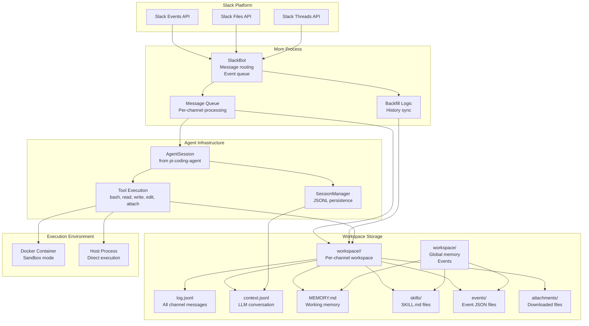
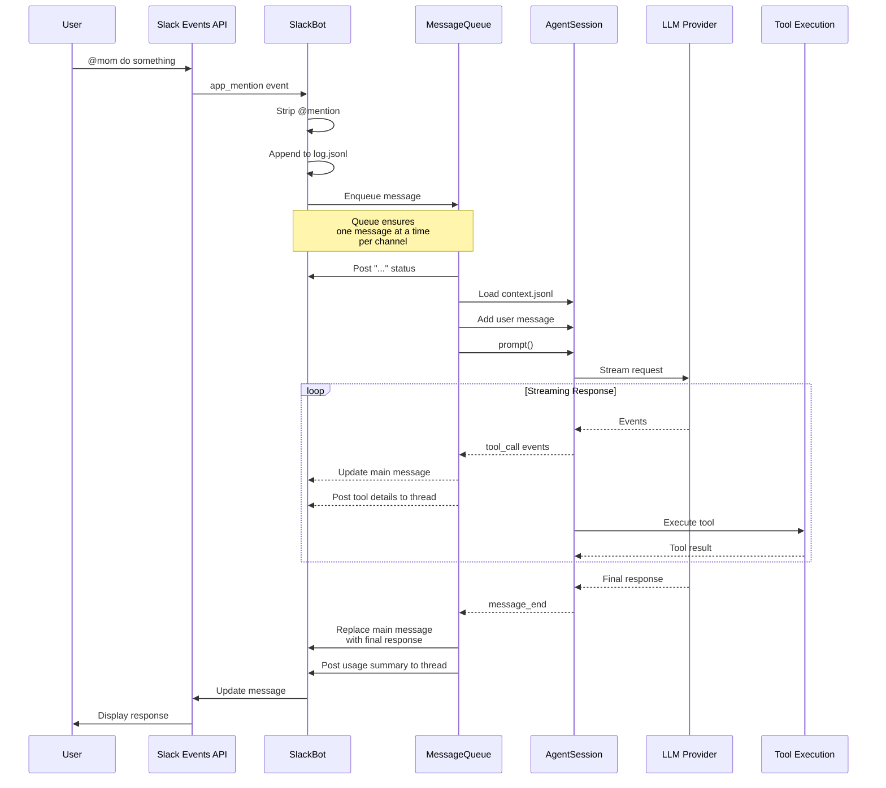
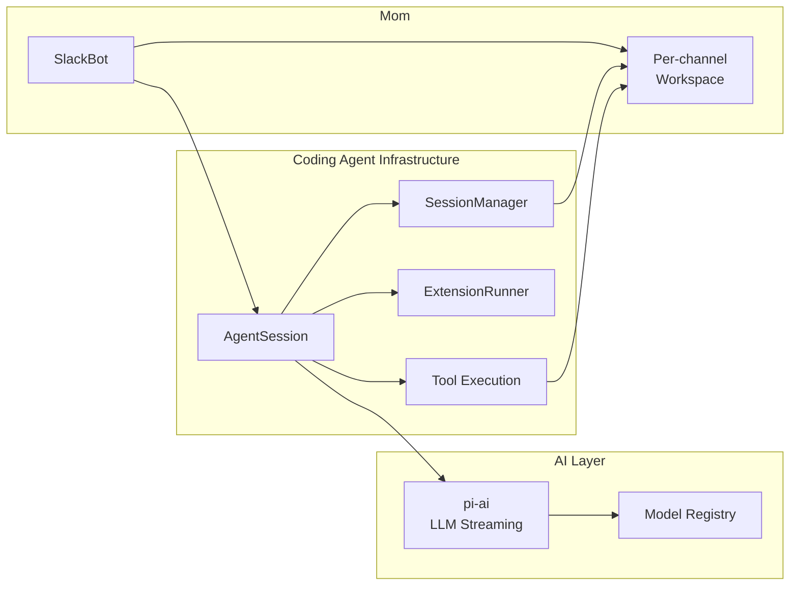

# pi-mom: Slack Bot

<details>
<summary>Relevant source files</summary>

The following files were used as context for generating this wiki page:

- [packages/agent/CHANGELOG.md](packages/agent/CHANGELOG.md)
- [packages/ai/CHANGELOG.md](packages/ai/CHANGELOG.md)
- [packages/coding-agent/CHANGELOG.md](packages/coding-agent/CHANGELOG.md)
- [packages/mom/CHANGELOG.md](packages/mom/CHANGELOG.md)
- [packages/tui/CHANGELOG.md](packages/tui/CHANGELOG.md)
- [packages/web-ui/CHANGELOG.md](packages/web-ui/CHANGELOG.md)

</details>

This document provides an overview of pi-mom, the Slack bot integration for the pi-mono agent framework. It covers the high-level architecture, Slack integration patterns, per-channel workspace model, and how mom delegates to the agent system.

For detailed information about specific subsystems:

- Workspace structure and persistence: see [Architecture & Workspace Structure](#8.1)
- Event scheduling system: see [Events System](#8.2)
- Artifact hosting: see [Artifacts Server](#8.3)

For information about the underlying agent framework, see [pi-agent-core: Agent Framework](#3) and [AgentSession Lifecycle & Architecture](#4.2).

---

## What is pi-mom?

pi-mom is a Slack bot that exposes the coding agent functionality through Slack channels and direct messages. Each Slack channel gets its own isolated workspace with persistent conversation history, working memory, skills, and scheduled events. Mom uses the same `AgentSession` and core agent infrastructure as the CLI (`pi`), enabling it to execute tools, manage context windows, and maintain conversation continuity across multiple interactions.

The name "mom" represents a helpful, proactive assistant that can respond to @mentions, execute tasks in a sandboxed environment, remember important information, and schedule follow-up actions.

**Sources:** [packages/mom/CHANGELOG.md:1-476]()

---

## High-Level Architecture



**Diagram: Mom Architecture and Integration Points**

Mom integrates with Slack through the Events API and maintains a per-channel workspace structure on disk. Each channel has its own `log.jsonl` (complete message history) and `context.jsonl` (LLM conversation state), plus memory files, skills, and scheduled events. The `SlackBot` class routes incoming messages to a processing queue, which delegates to `AgentSession` for LLM interactions and tool execution.

**Sources:** [packages/mom/CHANGELOG.md:236-476]()

---

## Slack Integration Model

Mom operates as a Slack app that responds to two types of events:

- **@mentions in channels**: When a user @mentions the bot in a public or private channel
- **Direct messages**: When a user sends a DM to the bot

### Message Flow



**Diagram: Message Processing Flow**

When a user @mentions mom or sends a DM, the `SlackBot` class receives the event, strips the @mention, logs it to `log.jsonl`, and enqueues it for processing. The message queue ensures only one message is processed per channel at a time. During processing, mom posts a status message ("..."), delegates to `AgentSession`, and streams updates back to Slack. Tool execution details are posted to a thread while the main message shows the final response.

**Sources:** [packages/mom/CHANGELOG.md:286-348](), [packages/coding-agent/CHANGELOG.md:1-1000]()

---

## Per-Channel Workspace Model

Each Slack channel mom participates in gets its own isolated workspace directory. This enables channel-specific memory, skills, and event scheduling without cross-channel pollution.

### Workspace Directory Structure

```
workspace/
├── MEMORY.md                    # Global working memory (all channels)
├── skills/                      # Global skills (all channels)
│   └── example-skill/
│       └── SKILL.md
├── events/                      # Global events
│   └── daily-standup.json
└── <channel-id>/                # Per-channel workspace
    ├── log.jsonl                # Complete message history
    ├── context.jsonl            # LLM conversation state
    ├── MEMORY.md                # Channel-specific memory
    ├── skills/                  # Channel-specific skills
    │   └── channel-skill/
    │       └── SKILL.md
    ├── events/                  # Channel-specific events
    │   └── reminder.json
    ├── attachments/             # Downloaded file attachments
    │   └── screenshot.png
    └── scratchpad/              # Working directory for bash tool
        └── temp-files/
```

**Workspace Structure**

Global resources (`workspace/MEMORY.md`, `workspace/skills/`, `workspace/events/`) are shared across all channels, while channel-specific resources live under `workspace/<channel-id>/`. This allows mom to maintain shared knowledge while isolating channel-specific state.

**Sources:** [packages/mom/CHANGELOG.md:358-423]()

---

## Core Components

### SlackBot

The `SlackBot` class is the main entry point for Slack integration. It:

- Connects to Slack Events API and listens for `app_mention` and `message` events
- Routes messages to per-channel queues
- Manages Slack API calls (posting messages, updating messages, threading)
- Handles backfill of historical messages
- Downloads file attachments

**Sources:** [packages/mom/CHANGELOG.md:236-300]()

### Message Queue

Each channel has its own message queue that ensures sequential processing. When a message arrives while mom is processing another message in the same channel, it's logged to `log.jsonl` but not processed until the current message completes. This prevents race conditions and ensures conversation coherence.

**Sources:** [packages/mom/CHANGELOG.md:310-330]()

### AgentSession Integration

Mom reuses `AgentSession` from `@mariozechner/pi-coding-agent`, which provides:

- Auto-compaction when context windows fill
- Overflow handling
- Prompt caching
- Multi-turn tool execution
- Session persistence via `SessionManager`

This is the same session infrastructure used by the `pi` CLI, ensuring consistent behavior across interfaces.

**Sources:** [packages/mom/CHANGELOG.md:303-327](), [packages/coding-agent/CHANGELOG.md:1-500]()

### Persistence Model

Mom uses two JSONL files per channel:

| File            | Purpose                                                      | Format                               |
| --------------- | ------------------------------------------------------------ | ------------------------------------ |
| `log.jsonl`     | Source of truth for all channel messages (user, bot, system) | Append-only log with timestamps      |
| `context.jsonl` | LLM conversation state (what gets sent to Claude/GPT)        | Same format as coding-agent sessions |

On startup, mom syncs `context.jsonl` with `log.jsonl` to ensure consistency. Messages logged while mom was offline are synced and processed on next startup.

**Sources:** [packages/mom/CHANGELOG.md:303-348]()

### Tool Execution

Mom exposes five core tools to the LLM:

| Tool     | Description                             | Example Use                          |
| -------- | --------------------------------------- | ------------------------------------ |
| `bash`   | Execute shell commands in the workspace | `ls`, `grep`, `curl`                 |
| `read`   | Read file contents                      | Read source code, config files       |
| `write`  | Write file contents                     | Create new files, overwrite existing |
| `edit`   | Apply diffs to existing files           | Modify code, update configs          |
| `attach` | Upload files to Slack                   | Share generated reports, screenshots |

Tools execute either in a Docker container (sandbox mode) or directly on the host. The bash tool's working directory is `workspace/<channel-id>/scratchpad/` for isolated per-channel execution.

**Sources:** [packages/mom/CHANGELOG.md:461-475]()

### Skills Discovery

Mom automatically discovers skills from:

- `workspace/skills/` (global skills, all channels)
- `workspace/<channel-id>/skills/` (channel-specific skills)

Each skill is a directory containing a `SKILL.md` file with YAML frontmatter:

```markdown
---
name: example-skill
description: Does something useful
---

# Example Skill

Implementation details...
```

Available skills are listed in the system prompt with their descriptions. Mom reads the `SKILL.md` file before using a skill.

**Sources:** [packages/mom/CHANGELOG.md:236-257]()

### Working Memory

Mom maintains working memory in `MEMORY.md` files:

- `workspace/MEMORY.md`: Global memory (shared across all channels)
- `workspace/<channel-id>/MEMORY.md`: Channel-specific memory

Mom automatically loads memory into the system prompt on each request and can update memory files to remember project details, user preferences, and conversation context.

**Sources:** [packages/mom/CHANGELOG.md:405-447]()

---

## Execution Modes

Mom supports two execution modes:

### Docker Sandbox Mode

Tools execute inside a Docker container with the workspace mounted as `/workspace`. This provides:

- Process isolation
- Filesystem isolation
- Network control
- Reproducible environment

Paths in the system prompt are translated to container paths (e.g., `/workspace/skills/...`) so mom can read them from inside Docker.

**Sources:** [packages/mom/CHANGELOG.md:234-238]()

### Host Mode

Tools execute directly on the host machine. Useful for:

- Development and debugging
- Accessing host resources (databases, APIs)
- Avoiding Docker overhead

---

## Message Handling Patterns

### Channel Chatter

Messages without @mentions are logged to `log.jsonl` but don't trigger processing. This allows mom to observe conversations and provides context when explicitly invoked.

**Sources:** [packages/mom/CHANGELOG.md:320-323]()

### Thread Details

During execution:

- Main message shows status ("...") and streaming updates
- Thread shows detailed tool execution (tool name, arguments, results, thinking)

After completion:

- Main message replaced with final assistant response
- Thread retains full audit trail
- Usage summary posted to thread

**Sources:** [packages/mom/CHANGELOG.md:393-403]()

### Stop Command

Users can interrupt running tasks with `@mom stop`. This:

- Executes immediately (not queued)
- Aborts the current agent run
- Posts "Stopped" status
- Preserves tool results in thread

**Sources:** [packages/mom/CHANGELOG.md:326-328]()

### Backfill

On startup, mom can backfill historical messages from channels that already have a `log.jsonl` file. This:

- Fetches messages since the last logged timestamp
- Downloads file attachments
- Strips @mentions for consistency
- Syncs with `context.jsonl`

**Sources:** [packages/mom/CHANGELOG.md:312-323]()

---

## Cost and Usage Tracking

Mom tracks token usage and costs per agent run:

- Input tokens (prompt)
- Output tokens (response)
- Cache read tokens (Anthropic prompt caching)
- Cache write tokens (Anthropic prompt caching)

Usage summary is displayed in:

- Console output (for operator monitoring)
- Slack thread (for transparency)

Example: `💰 Usage: 12,543 in + 847 out (5,234 cache read, 127 cache write) = $0.0234`

**Sources:** [packages/mom/CHANGELOG.md:422-426]()

---

## Integration with Agent Infrastructure

Mom reuses core infrastructure from the coding agent:



**Diagram: Mom's Integration with Shared Infrastructure**

Mom delegates agent logic to `AgentSession` from `@mariozechner/pi-coding-agent`, session persistence to `SessionManager`, and LLM streaming to `@mariozechner/pi-ai`. This ensures consistent behavior with the CLI and reduces code duplication.

**Sources:** [packages/mom/CHANGELOG.md:142-233](), [packages/coding-agent/CHANGELOG.md:1-500]()
