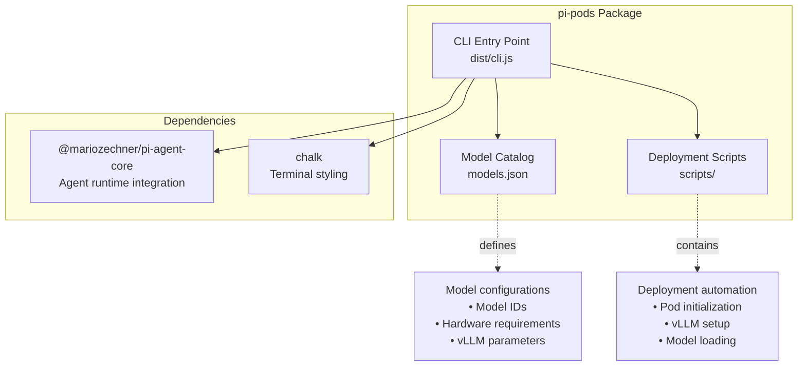
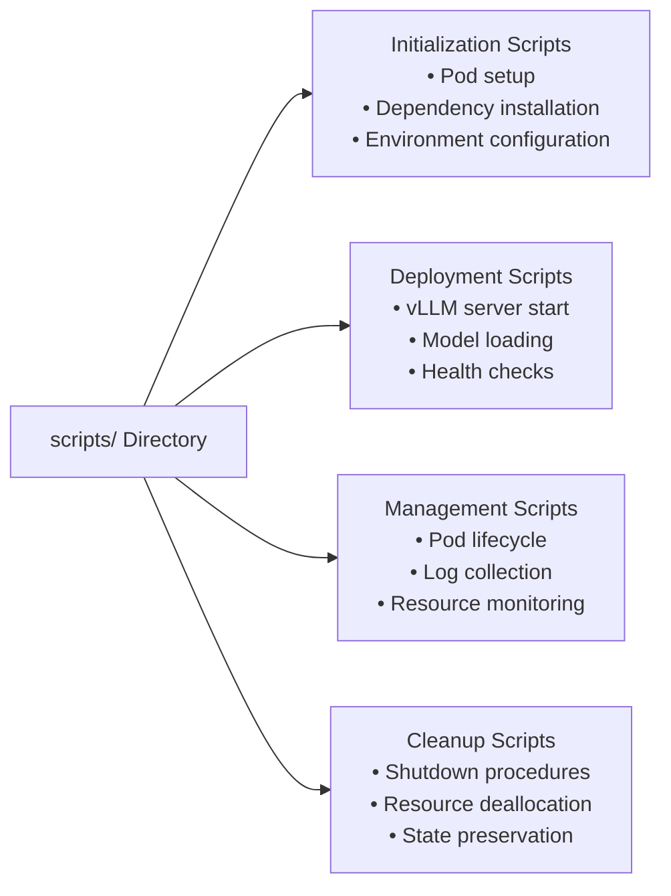
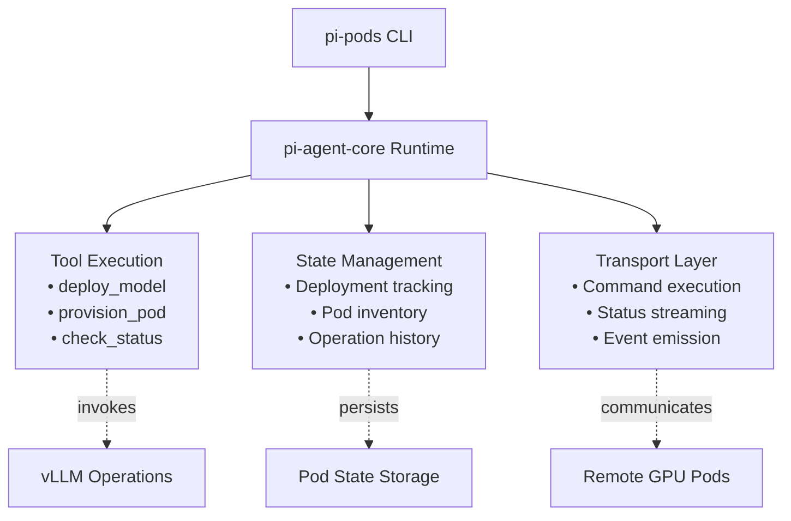
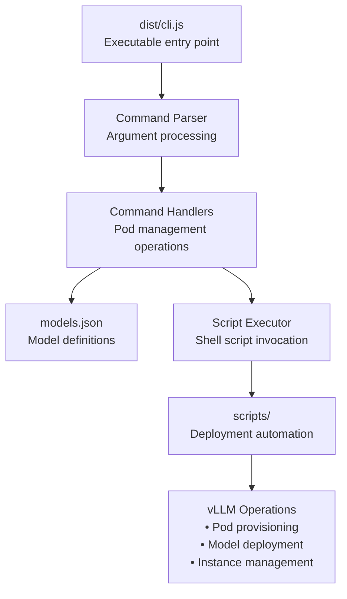
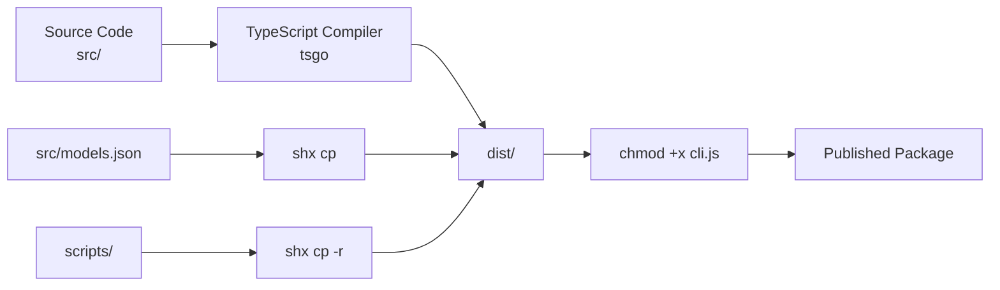

# pi-pods: GPU Pod Manager

<details>
<summary>Relevant source files</summary>

The following files were used as context for generating this wiki page:

- [package-lock.json](package-lock.json)
- [packages/agent/CHANGELOG.md](packages/agent/CHANGELOG.md)
- [packages/agent/package.json](packages/agent/package.json)
- [packages/ai/CHANGELOG.md](packages/ai/CHANGELOG.md)
- [packages/ai/package.json](packages/ai/package.json)
- [packages/coding-agent/CHANGELOG.md](packages/coding-agent/CHANGELOG.md)
- [packages/coding-agent/package.json](packages/coding-agent/package.json)
- [packages/mom/CHANGELOG.md](packages/mom/CHANGELOG.md)
- [packages/mom/package.json](packages/mom/package.json)
- [packages/pods/package.json](packages/pods/package.json)
- [packages/tui/CHANGELOG.md](packages/tui/CHANGELOG.md)
- [packages/tui/package.json](packages/tui/package.json)
- [packages/web-ui/CHANGELOG.md](packages/web-ui/CHANGELOG.md)
- [packages/web-ui/example/package.json](packages/web-ui/example/package.json)
- [packages/web-ui/package.json](packages/web-ui/package.json)

</details>

## Purpose and Scope

This document covers `pi-pods`, a command-line infrastructure tool for managing vLLM deployments on GPU compute pods. The package provides model deployment automation, pod provisioning commands, and infrastructure scripts for running large language models on remote GPU infrastructure.

For information about the core agent runtime that pi-pods integrates with, see [pi-agent-core: Agent Framework](#3). For LLM API interactions, see [pi-ai: LLM API Library](#2).

## Overview

The `pi-pods` package (`@mariozechner/pi`) is a supporting infrastructure tool in the pi-mono ecosystem that simplifies the deployment and management of vLLM inference servers on GPU pods. It provides a command-line interface for provisioning compute resources, deploying models, and managing running instances.

**Key Capabilities:**

- GPU pod provisioning and lifecycle management
- vLLM model deployment automation
- Model catalog configuration
- Infrastructure deployment scripts
- Integration with pi-agent-core for agent-based workflows

**Sources:** [packages/pods/package.json:1-40]()

## Package Structure



**Sources:** [packages/pods/package.json:1-40]()

## Installation and Setup

The package is published as `@mariozechner/pi` and provides the `pi-pods` command-line tool:

```bash
npm install -g @mariozechner/pi
```

The CLI entry point is located at `dist/cli.js` and is made executable during the build process.

**Node Version Requirement:** Node.js >= 20.0.0

**Sources:** [packages/pods/package.json:6-8](), [packages/pods/package.json:32-33]()

## Model Configuration

The package includes a `models.json` file located at `src/models.json` that defines the catalog of available models and their deployment parameters. This file is copied to `dist/models.json` during the build process.

**Model Catalog Structure:**

The `models.json` file serves as the source of truth for deployable models and their infrastructure requirements. The specific schema includes model identifiers, hardware requirements, vLLM engine parameters, and resource allocations needed for deployment.

**Build Integration:**

```bash
# From package.json build script
shx cp src/models.json dist/
```

The model catalog is bundled with the distribution to provide offline access to model metadata.

**Sources:** [packages/pods/package.json:11]()

## Deployment Scripts

The `scripts/` directory contains shell scripts and automation tools for pod management and vLLM deployment. These scripts are bundled with the package distribution and handle:

**Common Script Categories:**



Scripts are copied to the distribution during the build process to ensure they are available at runtime.

**Sources:** [packages/pods/package.json:11]()

## Integration with pi-agent-core

The `pi-pods` package depends on `@mariozechner/pi-agent-core`, enabling agent-driven infrastructure management workflows. This integration allows:

**Agent Integration Points:**

| Integration Feature       | Description                                 |
| ------------------------- | ------------------------------------------- |
| **Tool-based Deployment** | Expose deployment operations as agent tools |
| **State Management**      | Track pod states and deployment history     |
| **Async Operations**      | Handle long-running deployment operations   |
| **Error Handling**        | Agent-based retry and recovery logic        |



This architecture allows pi-pods to be used both as a standalone CLI tool and as part of agent-based automation workflows.

**Sources:** [packages/pods/package.json:35-37]()

## CLI Architecture

The command-line interface entry point is `dist/cli.js`, which is made executable during the build process.

**CLI Structure:**



The CLI is made executable via `chmod +x` during the build step.

**Sources:** [packages/pods/package.json:6-8](), [packages/pods/package.json:11]()

## Build Process

The package uses a streamlined build process with TypeScript compilation and asset copying:

**Build Pipeline:**

| Build Step                 | Command                        | Purpose                           |
| -------------------------- | ------------------------------ | --------------------------------- |
| **Clean**                  | `npm run clean`                | Remove `dist/` directory          |
| **TypeScript Compilation** | `tsgo -p tsconfig.build.json`  | Compile TypeScript to JavaScript  |
| **Set Executable**         | `shx chmod +x dist/cli.js`     | Make CLI executable               |
| **Copy Model Config**      | `shx cp src/models.json dist/` | Bundle model catalog              |
| **Copy Scripts**           | `shx cp -r scripts dist/`      | Bundle deployment scripts         |
| **Publish**                | `npm run prepublishOnly`       | Runs clean + build before publish |



**Sources:** [packages/pods/package.json:9-12]()

## Dependencies

The package maintains a minimal dependency footprint:

| Dependency                      | Version | Purpose                                   |
| ------------------------------- | ------- | ----------------------------------------- |
| **@mariozechner/pi-agent-core** | ^0.58.3 | Agent runtime integration, tool execution |
| **chalk**                       | ^5.5.0  | Terminal output styling and colors        |

The package requires Node.js >= 20.0.0, consistent with the rest of the pi-mono ecosystem.

**Sources:** [packages/pods/package.json:35-38](), [packages/pods/package.json:32-33]()

## Package Metadata

| Field            | Value                       |
| ---------------- | --------------------------- |
| **Package Name** | `@mariozechner/pi`          |
| **Binary Name**  | `pi-pods`                   |
| **Version**      | 0.58.3                      |
| **License**      | MIT                         |
| **Type**         | ES Module                   |
| **Keywords**     | llm, vllm, gpu, ai, cli     |
| **Repository**   | github.com/badlogic/pi-mono |
| **Directory**    | packages/pods               |

**Sources:** [packages/pods/package.json:2-31]()

## Distribution Files

The published package includes:

- `dist/` - Compiled JavaScript and bundled assets
  - `cli.js` - Executable CLI entry point
  - `models.json` - Model catalog
  - TypeScript type definitions
- `scripts/` - Deployment automation scripts

These files are specified in the `files` array of package.json to ensure they are included in the npm package.

**Sources:** [packages/pods/package.json:14-17]()
