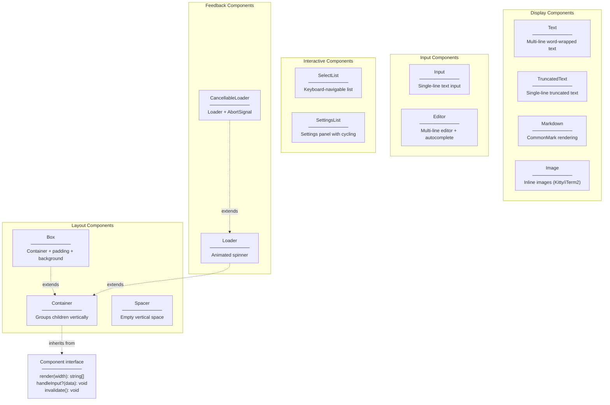
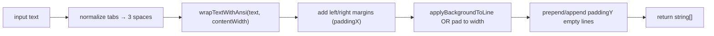
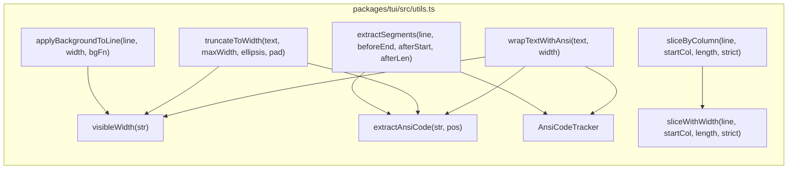

# Built-in Components

<details>
<summary>Relevant source files</summary>

The following files were used as context for generating this wiki page:

- [packages/coding-agent/docs/terminal-setup.md](packages/coding-agent/docs/terminal-setup.md)
- [packages/coding-agent/docs/tmux.md](packages/coding-agent/docs/tmux.md)
- [packages/coding-agent/docs/tui.md](packages/coding-agent/docs/tui.md)
- [packages/coding-agent/examples/extensions/overlay-qa-tests.ts](packages/coding-agent/examples/extensions/overlay-qa-tests.ts)
- [packages/coding-agent/src/modes/interactive/components/custom-editor.ts](packages/coding-agent/src/modes/interactive/components/custom-editor.ts)
- [packages/tui/README.md](packages/tui/README.md)
- [packages/tui/src/components/editor.ts](packages/tui/src/components/editor.ts)
- [packages/tui/src/components/input.ts](packages/tui/src/components/input.ts)
- [packages/tui/src/index.ts](packages/tui/src/index.ts)
- [packages/tui/src/keys.ts](packages/tui/src/keys.ts)
- [packages/tui/src/kill-ring.ts](packages/tui/src/kill-ring.ts)
- [packages/tui/src/tui.ts](packages/tui/src/tui.ts)
- [packages/tui/src/undo-stack.ts](packages/tui/src/undo-stack.ts)
- [packages/tui/test/editor.test.ts](packages/tui/test/editor.test.ts)
- [packages/tui/test/input.test.ts](packages/tui/test/input.test.ts)
- [packages/tui/test/keys.test.ts](packages/tui/test/keys.test.ts)
- [packages/tui/test/overlay-non-capturing.test.ts](packages/tui/test/overlay-non-capturing.test.ts)
- [packages/tui/test/overlay-options.test.ts](packages/tui/test/overlay-options.test.ts)
- [packages/tui/test/overlay-short-content.test.ts](packages/tui/test/overlay-short-content.test.ts)
- [packages/tui/test/tui-render.test.ts](packages/tui/test/tui-render.test.ts)

</details>

The `@mariozechner/pi-tui` package provides a comprehensive set of components for building terminal user interfaces. All components implement the `Component` interface defined in [packages/tui/src/tui.ts:14-40]() with a `render(width: number): string[]` method and optional `handleInput(data: string): void` for interactive components.

This page documents the built-in components organized by category. For the core TUI framework and rendering engine, see page [5.1](#5.1). For details on the Editor and Input components specifically, see page [5.3](#5.3). For keyboard protocol and input handling, see page [5.4](#5.4).

---

## Component Categories

**Built-in component hierarchy**



Sources: [packages/tui/src/tui.ts:14-40](), [packages/tui/src/tui.ts:172-204](), [packages/tui/src/components/text.ts:1-106](), [packages/tui/src/components/markdown.ts:1-50](), [packages/tui/README.md:197-533]()

---

## Layout Components

### Container

The `Container` class in [packages/tui/src/tui.ts:172-204]() groups child components vertically. Each child's output is concatenated in the order added.

**Key methods:**

| Method                              | Purpose                              |
| ----------------------------------- | ------------------------------------ |
| `addChild(component: Component)`    | Append a child to the end            |
| `removeChild(component: Component)` | Remove a child                       |
| `clear()`                           | Remove all children                  |
| `render(width: number): string[]`   | Concatenate all child render outputs |

Sources: [packages/tui/src/tui.ts:172-204]()

### Box

The `Box` class in [packages/tui/src/components/box.ts:1-56]() extends `Container` to add padding and a background color function. All children are rendered with the specified padding applied, and each line is passed through the background function.

**Constructor parameters:**

| Parameter  | Type                       | Default     | Purpose                                          |
| ---------- | -------------------------- | ----------- | ------------------------------------------------ |
| `paddingX` | `number`                   | `1`         | Left and right margin                            |
| `paddingY` | `number`                   | `1`         | Top and bottom margin                            |
| `bgFn`     | `(text: string) => string` | `undefined` | Background color function (e.g., `chalk.bgGray`) |

**Methods:**

- `setBgFn(fn: (text: string) => string)` — Update background function dynamically

Sources: [packages/tui/src/components/box.ts:1-56](), [packages/tui/README.md:210-221]()

### Spacer

The `Spacer` class in [packages/tui/src/components/spacer.ts:1-18]() renders empty vertical space (blank lines).

**Constructor:**

```typescript
new Spacer(lines?: number)  // Default: 1
```

Sources: [packages/tui/src/components/spacer.ts:1-18](), [packages/tui/README.md:481-486]()

---

## Display Components

### Text

The `Text` component in [packages/tui/src/components/text.ts:1-106]() displays multi-line text with word wrapping. It applies optional horizontal and vertical padding and can fill the line background.

**Constructor parameters:**

| Parameter    | Type                       | Default     | Purpose                             |
| ------------ | -------------------------- | ----------- | ----------------------------------- |
| `text`       | `string`                   | `""`        | Content to display                  |
| `paddingX`   | `number`                   | `1`         | Left and right margin in columns    |
| `paddingY`   | `number`                   | `1`         | Empty lines above and below content |
| `customBgFn` | `(text: string) => string` | `undefined` | ANSI background color function      |

**Text rendering flow**



**Methods:**

- `setText(text: string)` — Update content and clear cache
- `setCustomBgFn(fn: (text: string) => string)` — Update background function

The result is cached by `(text, width)` so repeated renders at the same width are free. Calling `setText()` or `invalidate()` clears the cache.

Sources: [packages/tui/src/components/text.ts:1-106](), [packages/tui/README.md:223-249]()

### TruncatedText

The `TruncatedText` component in [packages/tui/src/components/truncated-text.ts:1-51]() displays a single line of text, truncating with ellipsis if it exceeds the viewport width.

**Constructor parameters:**

| Parameter  | Type     | Default | Purpose               |
| ---------- | -------- | ------- | --------------------- |
| `text`     | `string` | `""`    | Content to display    |
| `paddingX` | `number` | `0`     | Left and right margin |
| `paddingY` | `number` | `0`     | Top and bottom margin |

**Methods:**

- `setText(text: string)` — Update content

Useful for status lines, headers, and fixed-height displays where overflow must be prevented.

Sources: [packages/tui/src/components/truncated-text.ts:1-51](), [packages/tui/README.md:240-248]()

### Markdown

The `Markdown` component in [packages/tui/src/components/markdown.ts:1-50]() renders CommonMark-flavored markdown to styled terminal output using the `marked` lexer.

**Constructor parameters:**

| Parameter          | Type               | Purpose                                     |
| ------------------ | ------------------ | ------------------------------------------- |
| `text`             | `string`           | Markdown content to render                  |
| `paddingX`         | `number`           | Left and right margin                       |
| `paddingY`         | `number`           | Top and bottom margin                       |
| `theme`            | `MarkdownTheme`    | Styling functions for all markdown elements |
| `defaultTextStyle` | `DefaultTextStyle` | Optional base text formatting               |

**MarkdownTheme interface**

Every visual styling decision is delegated to the `MarkdownTheme` object. Each field is a function `(text: string) => string` that wraps text in ANSI codes.

| Theme field                                                            | Purpose                                                |
| ---------------------------------------------------------------------- | ------------------------------------------------------ |
| `heading(text)`                                                        | Heading styles                                         |
| `link(text)`                                                           | Link text color                                        |
| `linkUrl(text)`                                                        | URL color                                              |
| `code(text)`                                                           | Inline code style                                      |
| `codeBlock(text)`                                                      | Code fence content                                     |
| `codeBlockBorder(text)`                                                | Code fence border lines                                |
| `quote(text)`                                                          | Blockquote content                                     |
| `quoteBorder(text)`                                                    | Blockquote left border                                 |
| `hr(text)`                                                             | Horizontal rule                                        |
| `listBullet(text)`                                                     | List item bullets                                      |
| `bold(text)`, `italic(text)`, `strikethrough(text)`, `underline(text)` | Inline styles                                          |
| `highlightCode?(code, lang)`                                           | Optional syntax highlighter returning pre-styled lines |
| `codeBlockIndent?`                                                     | Prefix for code lines (default: `"  "`)                |

**Markdown token rendering table**

| Token type   | Rendered output                                                                      |
| ------------ | ------------------------------------------------------------------------------------ |
| `heading`    | `theme.heading(...)` with `theme.bold`, `theme.underline` for `h1`                   |
| `paragraph`  | Inline tokens with default style                                                     |
| `code`       | Border via `theme.codeBlockBorder`, content via `theme.codeBlock` or `highlightCode` |
| `list`       | Recursive `renderList()`, `theme.listBullet`, 2-space indent per level               |
| `table`      | Width-aware `renderTable()` with box-drawing borders (`┌─┬│┼└┘`)                     |
| `blockquote` | `theme.quote(theme.italic(...))`, `theme.quoteBorder("│ ")` prefix                   |
| `hr`         | `theme.hr("─".repeat(min(width, 80)))`                                               |
| `html`       | Rendered as plain text                                                               |
| `space`      | Empty line                                                                           |

**Methods:**

- `setText(text: string)` — Update content and clear cache

The component caches the rendered output by `(text, width)`. Table rendering distributes available width proportionally across columns, respecting minimum word widths. See [packages/tui/src/components/markdown.ts:603-769]() for the table layout algorithm.

Sources: [packages/tui/src/components/markdown.ts:1-50](), [packages/tui/src/components/markdown.ts:92-178](), [packages/tui/src/components/markdown.ts:263-471](), [packages/tui/README.md:316-364]()

### Image

The `Image` component in [packages/tui/src/components/image.ts:1-240]() renders inline images using the Kitty graphics protocol (supported by Kitty, Ghostty, WezTerm) or iTerm2 inline images. Falls back to a text placeholder on unsupported terminals.

**Constructor parameters:**

| Parameter    | Type           | Purpose                                     |
| ------------ | -------------- | ------------------------------------------- |
| `base64Data` | `string`       | Base64-encoded image data                   |
| `mimeType`   | `string`       | MIME type (`image/png`, `image/jpeg`, etc.) |
| `theme`      | `ImageTheme`   | Fallback text color                         |
| `options`    | `ImageOptions` | Optional sizing constraints                 |

**ImageOptions:**

```typescript
interface ImageOptions {
  maxWidthCells?: number // Max width in terminal columns
  maxHeightCells?: number // Max height in terminal rows
  filename?: string // Optional display name for fallback
}
```

Supported formats: PNG, JPEG, GIF, WebP. Dimensions are parsed from image headers automatically. The component queries terminal cell dimensions on first render to scale images correctly.

Sources: [packages/tui/src/components/image.ts:1-240](), [packages/tui/README.md:488-513]()

---

## Utils Module

`packages/tui/src/utils.ts` provides ANSI-aware string layout primitives used by both components and the TUI compositor.

**Utility function map**



Sources: [packages/tui/src/utils.ts:1-890]()

### `visibleWidth`

```
visibleWidth(str: string): number
```

Returns the number of terminal columns occupied by a string. ANSI escape sequences, APC sequences, and OSC 8 hyperlinks are stripped before measuring. Characters are segmented by `Intl.Segmenter` at grapheme cluster granularity, then measured with `eastAsianWidth` for CJK/wide characters and RGI emoji detection for multi-codepoint emoji sequences.

A fast path skips segmentation for pure ASCII (codepoints 0x20–0x7E). Non-ASCII results are cached in an LRU-style map capped at 512 entries.

Sources: [packages/tui/src/utils.ts:81-135]()

### `extractAnsiCode`

```
extractAnsiCode(str: string, pos: number): { code: string; length: number } | null
```

Parses a single ANSI escape sequence starting at `pos`. Handles three families:

- **CSI** (`ESC [` … `m/G/K/H/J`) — SGR and cursor codes
- **OSC** (`ESC ]` … `BEL` or `ST`) — hyperlinks, window titles
- **APC** (`ESC _` … `BEL` or `ST`) — cursor marker and application commands

Returns `null` if no escape sequence starts at `pos`.

Sources: [packages/tui/src/utils.ts:140-178]()

### `AnsiCodeTracker`

`AnsiCodeTracker` (class, not exported directly) maintains a stateful model of active SGR attributes as text is scanned left-to-right. It tracks:

| Attribute        | SGR codes                          |
| ---------------- | ---------------------------------- |
| Bold             | 1 / 22                             |
| Dim              | 2 / 22                             |
| Italic           | 3 / 23                             |
| Underline        | 4 / 24                             |
| Blink            | 5 / 25                             |
| Inverse          | 7 / 27                             |
| Hidden           | 8 / 28                             |
| Strikethrough    | 9 / 29                             |
| Foreground color | 30–37, 90–97, 38;5;N, 38;2;R;G;B   |
| Background color | 40–47, 100–107, 48;5;N, 48;2;R;G;B |

Key methods:

| Method              | Purpose                                                                       |
| ------------------- | ----------------------------------------------------------------------------- |
| `process(ansiCode)` | Update state from an SGR sequence                                             |
| `getActiveCodes()`  | Return a single `\x1b[…m` sequence restoring all active attributes            |
| `getLineEndReset()` | Return `\x1b[24m` (underline-off only) if underline is active, otherwise `""` |
| `hasActiveCodes()`  | Check if any attribute is active                                              |
| `clear()`           | Reset all state                                                               |

The split between `getActiveCodes()` and `getLineEndReset()` is intentional: a full reset at line-end would also clear background colors, causing the padding added by the `Text` and `Markdown` components to render without background. Only underline is reset at line boundaries because it visually "bleeds" into padding.

Sources: [packages/tui/src/utils.ts:183-383]()

### `wrapTextWithAnsi`

```
wrapTextWithAnsi(text: string, width: number): string[]
```

Word-wraps `text` to at most `width` visible columns per line. ANSI state is preserved across line breaks: each wrapped continuation line begins with `tracker.getActiveCodes()`. Underline is reset at line ends via `getLineEndReset()` without discarding other active styles.

The algorithm:

1. Split `text` on `\
`. For each input line:
2. Tokenize into whitespace and non-whitespace chunks via `splitIntoTokensWithAnsi()`, which keeps ANSI codes attached to the following visible character.
3. Accumulate tokens greedily. When a token would overflow:
   - If it is a word wider than `width`, delegate to `breakLongWord()` (grapheme-by-grapheme hard break).
   - Otherwise, push the current line and start a new one.
4. Trailing whitespace is trimmed from each output line.

Sources: [packages/tui/src/utils.ts:460-559]()

### `truncateToWidth`

```
truncateToWidth(text: string, maxWidth: number, ellipsis?: string, pad?: boolean): string
```

Truncates `text` to fit within `maxWidth` visible columns, appending `ellipsis` (default `"..."`). A reset code (`\x1b[0m`) is inserted before the ellipsis to prevent styled content from leaking into it. If `pad` is `true`, the result is padded with spaces to exactly `maxWidth`.

Sources: [packages/tui/src/utils.ts:676-752]()

### `sliceByColumn` and `sliceWithWidth`

```
sliceByColumn(line: string, startCol: number, length: number, strict?: boolean): string
sliceWithWidth(line: string, startCol: number, length: number, strict?: boolean): { text: string; width: number }
```

Extract a column range from a string while preserving ANSI codes. `strict = true` excludes wide characters whose right half would fall outside the requested range. `sliceByColumn` is a thin wrapper that discards the returned width. Both are used by the TUI overlay compositor to splice overlay content into base lines.

Sources: [packages/tui/src/utils.ts:758-808]()

### `applyBackgroundToLine`

```
applyBackgroundToLine(line: string, width: number, bgFn: (text: string) => string): string
```

Pads `line` with spaces to `width` visible columns, then applies `bgFn` to the entire padded string. Used by `Text` and `Markdown` to fill background color to the full terminal width.

Sources: [packages/tui/src/utils.ts:654-663]()

### `extractSegments`

```
extractSegments(
  line: string,
  beforeEnd: number,
  afterStart: number,
  afterLen: number,
  strictAfter?: boolean
): { before: string; beforeWidth: number; after: string; afterWidth: number }
```

A single-pass extraction of two non-overlapping column ranges from a line, used by the overlay compositor in `TUI`. The "after" segment inherits the active ANSI state from the "before" segment via a pooled `AnsiCodeTracker` instance (`pooledStyleTracker`), ensuring that styles established before an overlay region continue correctly after it.

Sources: [packages/tui/src/utils.ts:818-889]()

---

## Caching

Both `Text` and `Markdown` maintain a triple cache of `(cachedText, cachedWidth, cachedLines)`. A render call returns the cached `string[]` immediately when both `text` and `width` match. The cache is cleared by:

- `setText()` — new content
- `invalidate()` — externally triggered (e.g., theme change, parent resize notification)

Sources: [packages/tui/src/components/text.ts:46-49](), [packages/tui/src/components/markdown.ts:93-97]()
