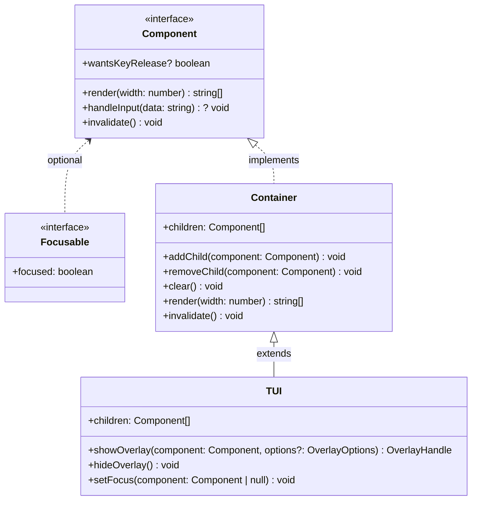
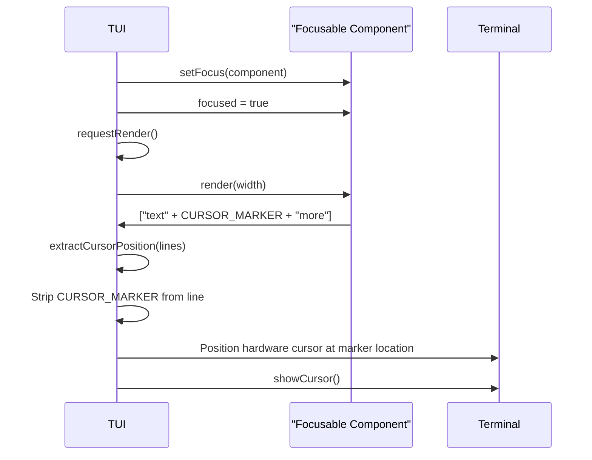
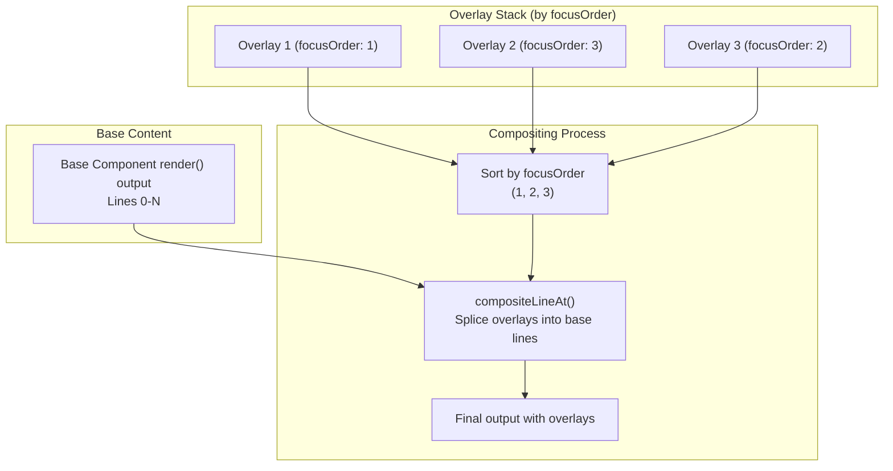
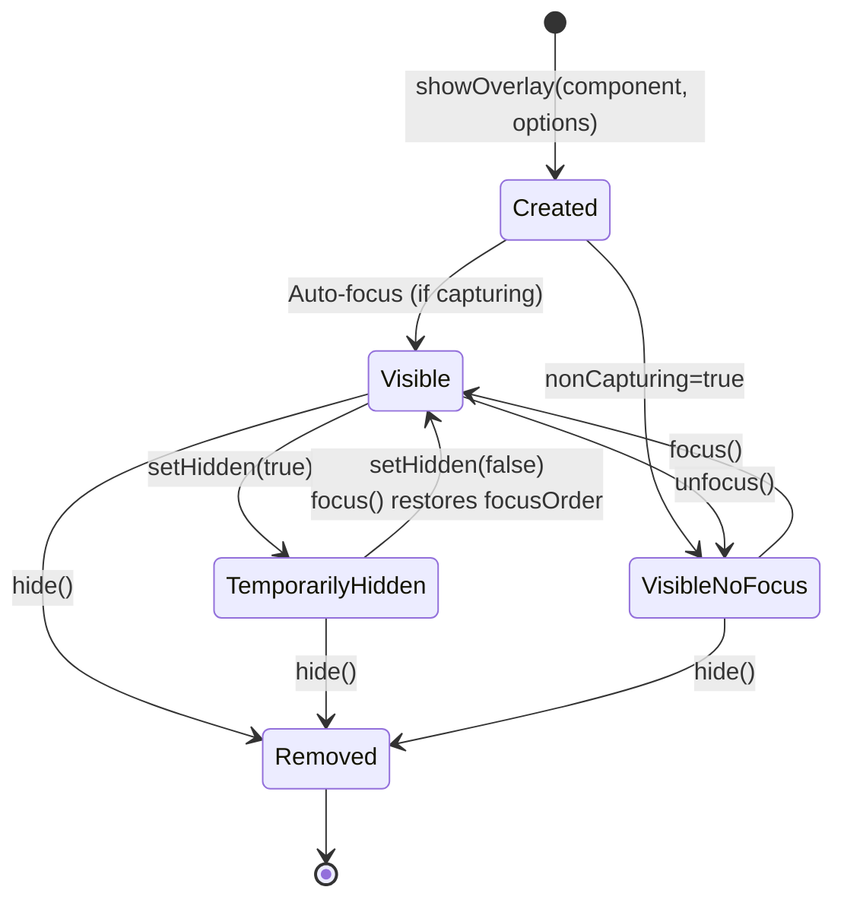
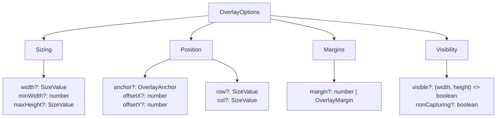
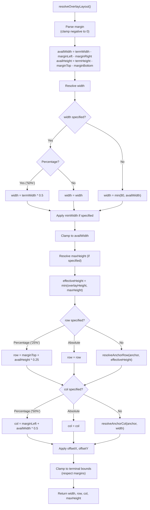
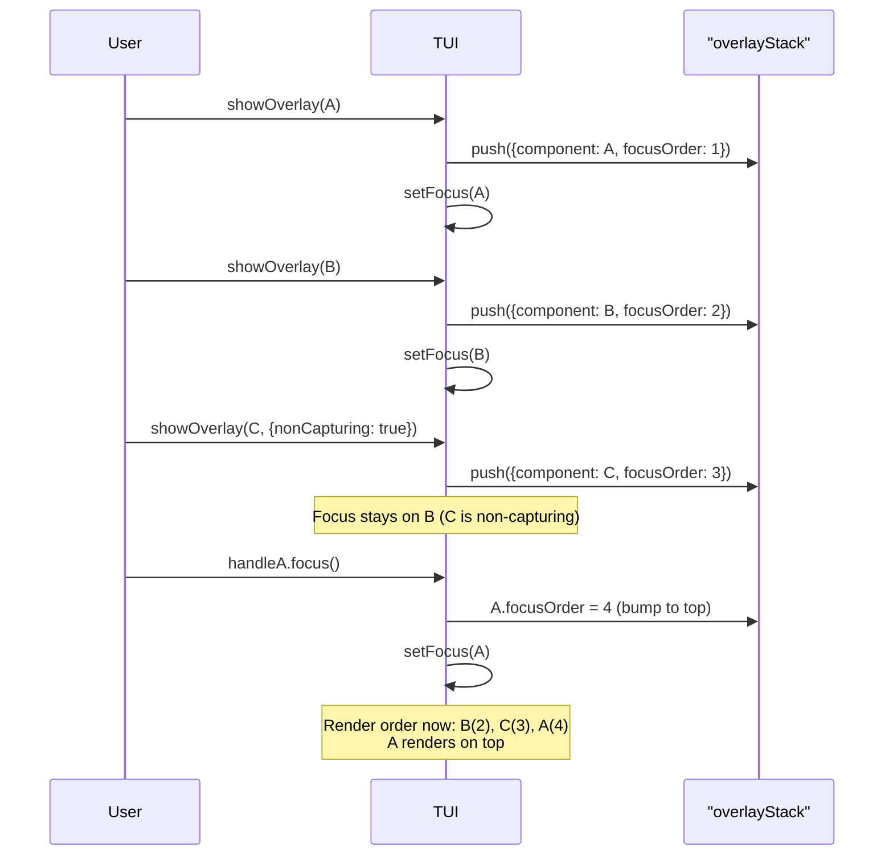
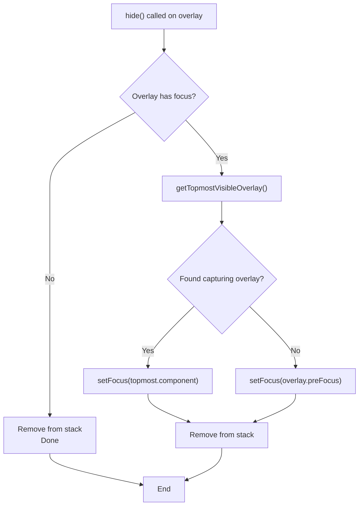
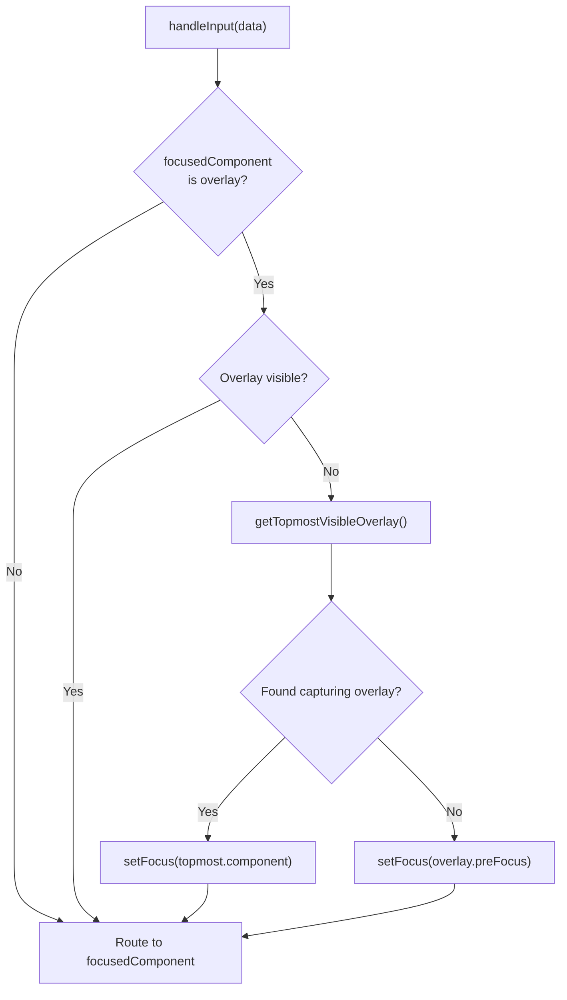
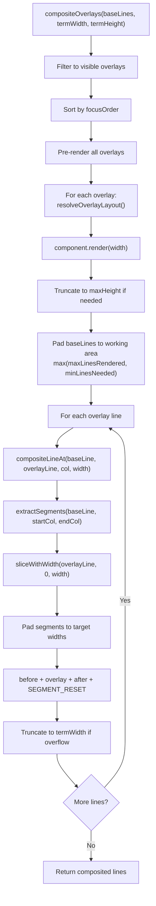

# Component Interface & Overlays

<details>
<summary>Relevant source files</summary>

The following files were used as context for generating this wiki page:

- [packages/coding-agent/docs/tui.md](packages/coding-agent/docs/tui.md)
- [packages/coding-agent/examples/extensions/overlay-qa-tests.ts](packages/coding-agent/examples/extensions/overlay-qa-tests.ts)
- [packages/tui/README.md](packages/tui/README.md)
- [packages/tui/src/tui.ts](packages/tui/src/tui.ts)
- [packages/tui/test/overlay-non-capturing.test.ts](packages/tui/test/overlay-non-capturing.test.ts)
- [packages/tui/test/overlay-options.test.ts](packages/tui/test/overlay-options.test.ts)
- [packages/tui/test/overlay-short-content.test.ts](packages/tui/test/overlay-short-content.test.ts)
- [packages/tui/test/tui-render.test.ts](packages/tui/test/tui-render.test.ts)

</details>

This page documents the core Component interface that all TUI elements must implement, the Container class for grouping components, and the overlay system for rendering modal UI on top of existing content. For the main TUI rendering pipeline and differential updates, see [Core TUI Architecture & Rendering](#5.1). For specific built-in components like Text, Box, and Markdown, see [Built-in Components](#5.5).

## Component Interface

All TUI elements implement the `Component` interface, which defines the contract for rendering, input handling, and invalidation.



**Sources:** [packages/tui/src/tui.ts:14-40](), [packages/tui/src/tui.ts:51-59](), [packages/tui/src/tui.ts:172-204]()

### Core Methods

| Method              | Required | Description                                                                                      |
| ------------------- | -------- | ------------------------------------------------------------------------------------------------ |
| `render(width)`     | Yes      | Returns array of strings, one per line. Each line **must not exceed** `width` or TUI will error. |
| `handleInput(data)` | No       | Receives raw terminal input when component has focus. `data` may contain ANSI escape sequences.  |
| `invalidate()`      | Yes      | Clears cached render state. Called on theme changes or when component needs full re-render.      |
| `wantsKeyRelease`   | No       | If `true`, component receives key release events (Kitty protocol). Default: `false`.             |

**Critical constraint:** Lines returned by `render()` must not exceed the provided `width` parameter. The TUI will throw an error if this constraint is violated, as overflow causes terminal corruption.

**Sources:** [packages/tui/src/tui.ts:14-40](), [packages/tui/README.md:125-144]()

### Focusable Interface

Components that display a text cursor and require IME (Input Method Editor) support implement the `Focusable` interface by adding a `focused` property and emitting `CURSOR_MARKER` at the cursor position:



The `CURSOR_MARKER` constant (`\x1b_pi:c\x07`) is a zero-width APC escape sequence that terminals ignore during display. The TUI scans rendered output for this marker, calculates its visual column position, strips it from the output, and positions the hardware terminal cursor there. This enables IME candidate windows to appear at the correct screen position.

**Sources:** [packages/tui/src/tui.ts:62-67](), [packages/tui/src/tui.ts:841-867](), [packages/tui/README.md:145-170]()

### Container Components with Embedded Focusable Children

When a container component (dialog, menu, etc.) embeds a focusable child like `Input` or `Editor`, the container must implement `Focusable` and propagate the `focused` property to the child. Otherwise, the hardware cursor won't be positioned correctly for IME input:

```typescript
class SearchDialog extends Container implements Focusable {
  private searchInput: Input

  private _focused = false
  get focused(): boolean {
    return this._focused
  }
  set focused(value: boolean) {
    this._focused = value
    this.searchInput.focused = value // Propagate to child
  }
}
```

**Sources:** [packages/tui/README.md:171-196](), [packages/coding-agent/docs/tui.md:57-86]()

## Container Class

The `Container` class groups multiple components vertically. It implements the `Component` interface by concatenating child render outputs and propagating `invalidate()` calls to all children.

```mermaid
graph TD
    Container["Container"]
    Child1["Component 1"]
    Child2["Component 2"]
    Child3["Component 3"]

    Container -->|addChild| Child1
    Container -->|addChild| Child2
    Container -->|addChild| Child3

    Container -->|render()| Concat["Concatenate<br/>child.render() outputs"]
    Container -->|invalidate()| PropInv["Propagate to<br/>all children"]
```

The `Container.render()` method calls `render(width)` on each child and concatenates the results. The `Container.invalidate()` method calls `invalidate()` on each child to clear their cached state.

**Sources:** [packages/tui/src/tui.ts:172-204]()

### Container Methods

| Method                   | Description                           |
| ------------------------ | ------------------------------------- |
| `addChild(component)`    | Appends component to children array   |
| `removeChild(component)` | Removes component from children array |
| `clear()`                | Removes all children                  |
| `render(width)`          | Concatenates all child render outputs |
| `invalidate()`           | Calls `invalidate()` on all children  |

The `TUI` class itself extends `Container`, so the main TUI instance can contain child components.

**Sources:** [packages/tui/src/tui.ts:172-204](), [packages/tui/src/tui.ts:209]()

## Overlay System

Overlays render components on top of existing content without clearing the screen or replacing the component tree. They're used for dialogs, menus, modal UI, and transient panels.



Overlays are stored in `TUI.overlayStack` and composited onto base content during rendering. Each overlay has a `focusOrder` counter that determines visual stacking—higher `focusOrder` renders on top.

**Sources:** [packages/tui/src/tui.ts:231-239](), [packages/tui/src/tui.ts:716-775]()

### OverlayHandle Interface

The `showOverlay()` method returns an `OverlayHandle` that controls the overlay's lifecycle:

| Method              | Description                                                    |
| ------------------- | -------------------------------------------------------------- |
| `hide()`            | Permanently removes overlay from stack (cannot be shown again) |
| `setHidden(hidden)` | Temporarily hides or shows overlay without removing it         |
| `isHidden()`        | Returns whether overlay is temporarily hidden                  |
| `focus()`           | Transfers focus to this overlay and brings it to visual front  |
| `unfocus()`         | Releases focus to previous target (preFocus)                   |
| `isFocused()`       | Returns whether overlay currently has focus                    |

**Sources:** [packages/tui/src/tui.ts:154-168](), [packages/tui/README.md:101-109]()

### Overlay Lifecycle



When `hide()` is called, the overlay is removed from `overlayStack` and cannot be re-shown. If the overlay had focus, focus is restored to either the topmost visible overlay or the `preFocus` target stored when the overlay was created.

**Sources:** [packages/tui/src/tui.ts:296-377]()

## Overlay Positioning Options

The `OverlayOptions` interface provides multiple positioning modes that can be combined.



`SizeValue` can be an absolute number (columns/rows) or a percentage string (e.g., `"50%"` for 50% of terminal width/height).

**Sources:** [packages/tui/src/tui.ts:95-150](), [packages/tui/README.md:64-99]()

### Positioning Resolution

Overlay position is resolved in this order:



**Resolution precedence:** Absolute `row`/`col` > Percentage `row`/`col` > `anchor`-based positioning. The `minWidth` is applied as a floor after width calculation but before clamping.

**Sources:** [packages/tui/src/tui.ts:578-714]()

### Anchor Positions

The `OverlayAnchor` type defines 9 standard positions:

| Anchor          | Row Calculation                          | Col Calculation                         |
| --------------- | ---------------------------------------- | --------------------------------------- |
| `top-left`      | `marginTop`                              | `marginLeft`                            |
| `top-center`    | `marginTop`                              | `marginLeft + (availWidth - width) / 2` |
| `top-right`     | `marginTop`                              | `marginLeft + availWidth - width`       |
| `left-center`   | `marginTop + (availHeight - height) / 2` | `marginLeft`                            |
| `center`        | `marginTop + (availHeight - height) / 2` | `marginLeft + (availWidth - width) / 2` |
| `right-center`  | `marginTop + (availHeight - height) / 2` | `marginLeft + availWidth - width`       |
| `bottom-left`   | `marginTop + availHeight - height`       | `marginLeft`                            |
| `bottom-center` | `marginTop + availHeight - height`       | `marginLeft + (availWidth - width) / 2` |
| `bottom-right`  | `marginTop + availHeight - height`       | `marginLeft + availWidth - width`       |

**Sources:** [packages/tui/src/tui.ts:74-83](), [packages/tui/src/tui.ts:682-714]()

### Responsive Visibility

The `visible` callback in `OverlayOptions` allows conditional rendering based on terminal dimensions:

```typescript
tui.showOverlay(component, {
  width: '25%',
  anchor: 'right-center',
  visible: (termWidth, termHeight) => termWidth >= 100, // Hide on narrow terminals
})
```

This callback is evaluated every render cycle. If it returns `false`, the overlay is not rendered and does not participate in focus management for that frame.

**Sources:** [packages/tui/src/tui.ts:142-147](), [packages/tui/src/tui.ts:384-391]()

## Z-ordering and Focus Management

Overlays are rendered in order of their `focusOrder` property—lower values render first (bottom), higher values render last (top). The `focusOrder` is assigned from a monotonically increasing counter when the overlay is created or focused.



Calling `focus()` on an overlay increments the global `focusOrderCounter` and assigns the new value to that overlay, effectively bringing it to the visual front. The rendering order is determined by sorting overlays by `focusOrder` before compositing.

**Sources:** [packages/tui/src/tui.ts:232](), [packages/tui/src/tui.ts:303](), [packages/tui/src/tui.ts:348-354](), [packages/tui/src/tui.ts:716-726]()

### Non-capturing Overlays

Overlays with `nonCapturing: true` do not automatically receive focus when shown. They are rendered but do not intercept keyboard input unless explicitly focused via `handle.focus()`.

```mermaid
flowchart TD
    ShowOverlay["showOverlay(component, options)"]
    ShowOverlay --> CheckCapturing{nonCapturing?}

    CheckCapturing -->|false| CheckVisible{visible() true?}
    CheckCapturing -->|true| NoFocus["Skip auto-focus<br/>Store preFocus"]

    CheckVisible -->|true| AutoFocus["setFocus(component)"]
    CheckVisible -->|false| NoFocus

    AutoFocus --> Return["Return OverlayHandle"]
    NoFocus --> Return
```

Non-capturing overlays are useful for status panels, timers, or information displays that should not steal keyboard focus from the main UI.

**Sources:** [packages/tui/src/tui.ts:149](), [packages/tui/src/tui.ts:296-310]()

### Focus Restoration on Overlay Removal

When an overlay is hidden or removed, focus is restored using this logic:



The `preFocus` field stores the focused component at the time `showOverlay()` was called, providing a fallback when no other overlays remain visible.

**Sources:** [packages/tui/src/tui.ts:314-327](), [packages/tui/src/tui.ts:366-377](), [packages/tui/src/tui.ts:393-402]()

### Overlay Input Redirection

When a focused overlay becomes invisible (via `visible()` callback returning `false`), input is automatically redirected:



This ensures that when an overlay is hidden due to terminal resize or other conditions, input doesn't get lost.

**Sources:** [packages/tui/src/tui.ts:510-522]()

## Overlay Compositing

Overlays are composited onto base content using `compositeLineAt()`, which splices overlay lines into base lines at the calculated positions. The compositing process handles ANSI escape sequences and wide characters correctly.



The `SEGMENT_RESET` constant (`\x1b[0m\x1b]8;;\x07`) is appended after each segment to prevent ANSI state bleed between overlay and base content.

**Sources:** [packages/tui/src/tui.ts:716-775](), [packages/tui/src/tui.ts:790-839]()

### Width Overflow Protection

The TUI applies defensive truncation to prevent width overflow in overlay compositing:

1. **Component render width:** Overlays call `component.render(width)` with the calculated width from `OverlayOptions`
2. **Pre-composite truncation:** If `visibleWidth(overlayLine) > width`, the line is truncated with `sliceByColumn(overlayLine, 0, width, true)` before compositing
3. **Post-composite verification:** After compositing, if `visibleWidth(result) > termWidth`, the result is truncated to `termWidth` with `sliceByColumn(result, 0, termWidth, true)`

This three-level protection ensures that even if a component violates the render width contract, the TUI will not crash due to line overflow.

**Sources:** [packages/tui/src/tui.ts:765-773](), [packages/tui/src/tui.ts:826-838]()
