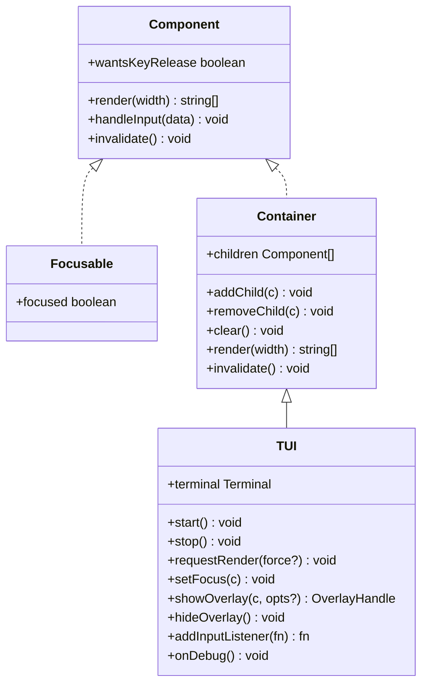
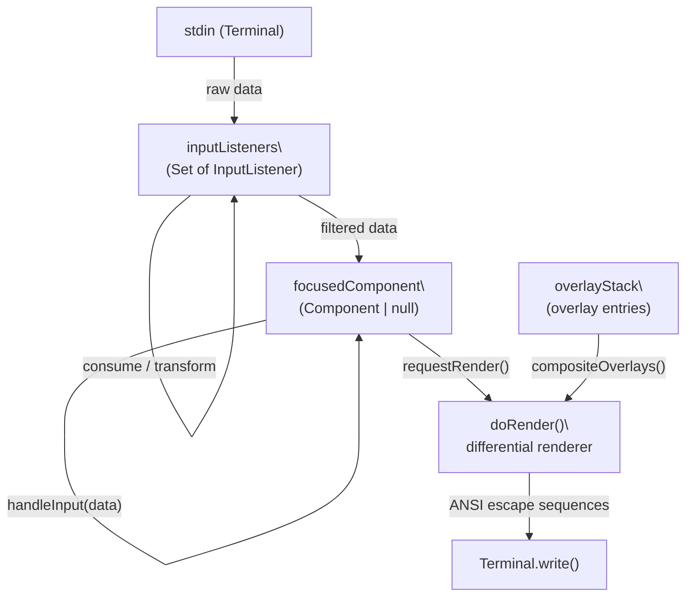
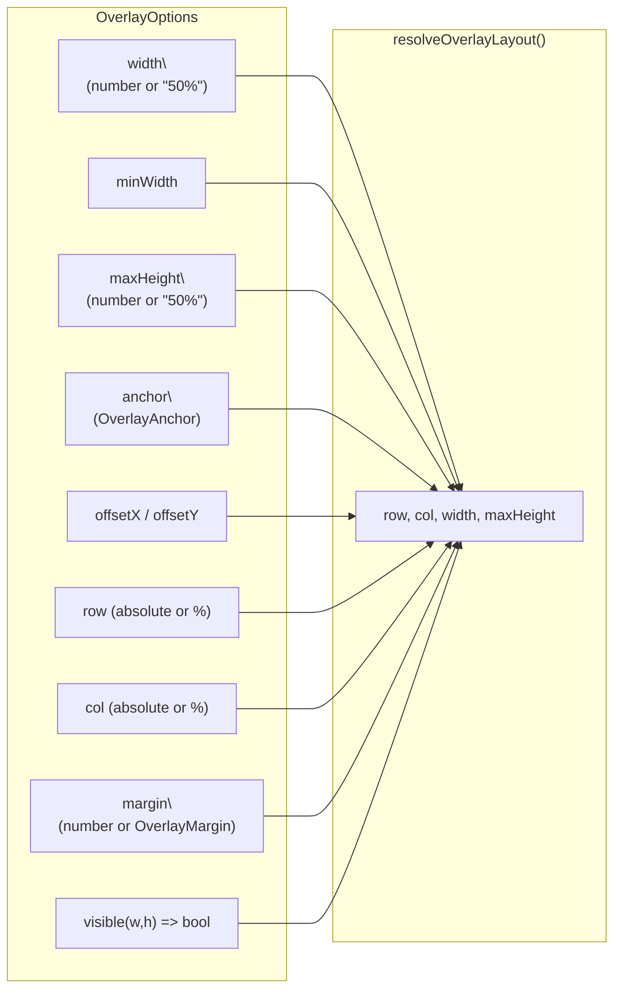
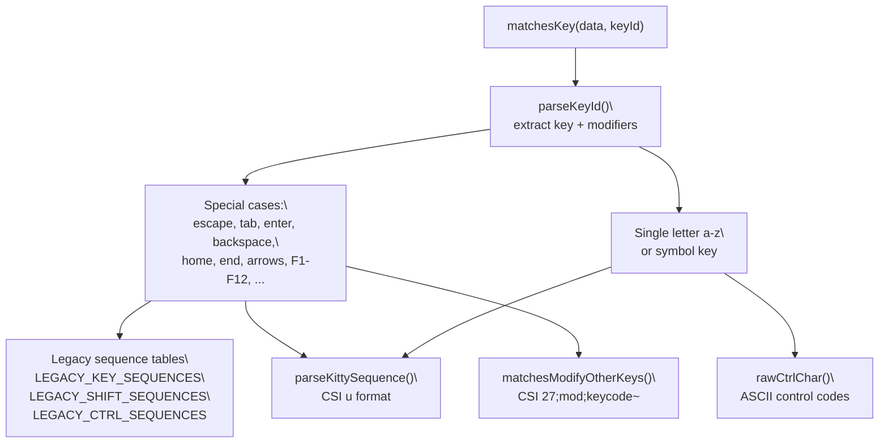

# Core TUI & Key Handling

<details>
<summary>Relevant source files</summary>

The following files were used as context for generating this wiki page:

- [packages/coding-agent/docs/tui.md](packages/coding-agent/docs/tui.md)
- [packages/coding-agent/examples/extensions/overlay-qa-tests.ts](packages/coding-agent/examples/extensions/overlay-qa-tests.ts)
- [packages/tui/README.md](packages/tui/README.md)
- [packages/tui/src/tui.ts](packages/tui/src/tui.ts)
- [packages/tui/test/overlay-non-capturing.test.ts](packages/tui/test/overlay-non-capturing.test.ts)
- [packages/tui/test/overlay-options.test.ts](packages/tui/test/overlay-options.test.ts)
- [packages/tui/test/overlay-short-content.test.ts](packages/tui/test/overlay-short-content.test.ts)
- [packages/tui/test/tui-render.test.ts](packages/tui/test/tui-render.test.ts)

</details>

This page documents the `@mariozechner/pi-tui` package's core rendering engine and keyboard input system. It covers the `TUI` class, the `Component`/`Focusable` interfaces, the overlay system, and the key parsing utilities in `keys.ts`.

For higher-level components built on this foundation (editors, markdown rendering, autocomplete), see page [5.2]() and [5.3](). For how `InteractiveMode` in the coding agent wires these pieces together, see page [4.8]().

---

## Component Model

All renderable elements implement the `Component` interface, defined in [packages/tui/src/tui.ts:16-40]().

| Member                             | Required | Description                                                             |
| ---------------------------------- | -------- | ----------------------------------------------------------------------- |
| `render(width: number): string[]`  | Yes      | Returns one string per terminal row, each no wider than `width` columns |
| `handleInput?(data: string): void` | No       | Called when the component has focus and input arrives                   |
| `wantsKeyRelease?: boolean`        | No       | Opt-in to receive Kitty key-release events (default: filtered out)      |
| `invalidate(): void`               | Yes      | Clear any cached rendering state (called on theme change or resize)     |

The `Focusable` interface adds a `focused: boolean` property. When `TUI.setFocus()` targets a component, it sets `focused = true` on the new component and `false` on the old one. A focused component should emit `CURSOR_MARKER` at the cursor position in its `render()` output so the hardware cursor can be positioned for IME support.

**Diagram: Component interface hierarchy**



Sources: [packages/tui/src/tui.ts:16-59](), [packages/tui/src/tui.ts:165-236]()

---

## CURSOR_MARKER

```
CURSOR_MARKER = "\x1b_pi:c\x07"
```

This is an APC (Application Program Command) escape sequence that terminals ignore visually. A focused component embeds it in its `render()` output at the cursor's logical position. During each render cycle, `TUI` scans the visible viewport for this marker, records its row/col, strips it from the output, then uses ANSI cursor positioning to move the hardware cursor there. This positions IME candidate windows correctly without interfering with the rendered content.

Defined at [packages/tui/src/tui.ts:67]().

---

## TUI Class

`TUI` extends `Container` and is the root of the component tree. It owns the render loop, input dispatch, overlay stack, and focus management.

**Diagram: TUI runtime data flow**



Sources: [packages/tui/src/tui.ts:201-497]()

### Key Methods

| Method                             | Description                                                                                                                   |
| ---------------------------------- | ----------------------------------------------------------------------------------------------------------------------------- |
| `start()`                          | Activates raw input mode via `Terminal`, hides hardware cursor, queries cell size, triggers first render                      |
| `stop()`                           | Moves cursor past content, shows hardware cursor, deactivates raw input                                                       |
| `requestRender(force?)`            | Schedules a render on `process.nextTick`. With `force=true`, clears all cached state and forces a full redraw                 |
| `setFocus(component)`              | Transfers `focused` flag; accepts `null` to clear focus                                                                       |
| `showOverlay(component, options?)` | Pushes onto the overlay stack, sets focus, returns an `OverlayHandle`                                                         |
| `hideOverlay()`                    | Pops the top overlay, restores prior focus                                                                                    |
| `addInputListener(fn)`             | Prepends a listener that can consume or transform input before it reaches `focusedComponent`. Returns an unsubscribe function |
| `onDebug`                          | Optional callback fired on `shift+ctrl+d` before input reaches components                                                     |

The `requestRender()` method batches multiple calls within a single tick into one `doRender()` call. Calling `requestRender(true)` resets all line state and forces a full-screen redraw.

Sources: [packages/tui/src/tui.ts:373-497]()

---

## Differential Rendering

`doRender()` compares `newLines` against `previousLines` to find the first and last changed rows, then emits only the minimal ANSI sequence to update those rows. Full redraws are triggered when:

- It is the first render (`previousLines.length === 0`)
- Terminal width changed (line wrapping changes)
- `clearOnShrink` is enabled and content shrank below the previous max line count
- A changed line is above the visible viewport

All output is wrapped in synchronized output mode (`\x1b[?2026h` / `\x1b[?2026l`) to prevent flicker. Each line gets a style reset appended (`\x1b[0m\x1b]8;;\x07`) so ANSI state cannot leak between lines.

Lines that exceed terminal width cause `TUI` to write a crash log to `~/.pi/agent/pi-crash.log` and throw, since overflowing lines corrupt the terminal layout.

Sources: [packages/tui/src/tui.ts:848-1100]()

---

## Overlay System

Overlays are `Component` instances rendered on top of base content. They are stored in `overlayStack` and composited into the rendered lines before differential comparison.

**Diagram: Overlay positioning options**



Sources: [packages/tui/src/tui.ts:74-148](), [packages/tui/src/tui.ts:541-677]()

### OverlayAnchor Values

| Value           | Horizontal | Vertical |
| --------------- | ---------- | -------- |
| `center`        | centered   | centered |
| `top-left`      | left       | top      |
| `top-center`    | centered   | top      |
| `top-right`     | right      | top      |
| `bottom-left`   | left       | bottom   |
| `bottom-center` | centered   | bottom   |
| `bottom-right`  | right      | bottom   |
| `left-center`   | left       | centered |
| `right-center`  | right      | centered |

`row` and `col` override anchor-based positioning when set. Percentage strings (e.g., `"50%"`) are resolved relative to terminal dimensions. Negative margins are clamped to zero.

### OverlayHandle

`showOverlay()` returns an `OverlayHandle`:

| Method               | Description                                    |
| -------------------- | ---------------------------------------------- |
| `hide()`             | Permanently removes the overlay from the stack |
| `setHidden(boolean)` | Temporarily hides or shows without removing    |
| `isHidden()`         | Returns current hidden state                   |

When an overlay is hidden or removed, focus reverts to the next visible overlay in the stack, or to `preFocus` (the component that was focused before the overlay was shown).

Sources: [packages/tui/src/tui.ts:153-160](), [packages/tui/src/tui.ts:286-342]()

---

## Input Listener Pipeline

When input arrives from the terminal, it passes through `inputListeners` in insertion order before reaching `focusedComponent.handleInput`. Each listener receives the current `data` string and may return:

- `{ consume: true }` — stops all further processing
- ``{ data: "..." }` — replaces `data` for subsequent listeners
- `undefined` — passes `data` unchanged

After listeners, the global `shift+ctrl+d` debug handler runs, then key-release filtering occurs (release events are dropped unless `focusedComponent.wantsKeyRelease === true`).

Sources: [packages/tui/src/tui.ts:384-497]()

---

## Key Handling

Key handling lives in [packages/tui/src/keys.ts](). It supports both legacy terminal escape sequences and the [Kitty keyboard protocol](https://sw.kovidgoyal.net/kitty/keyboard-protocol/).

### KeyId Type System

`KeyId` is a TypeScript union type providing compile-time autocomplete and typo detection for key strings:

```
KeyId = BaseKey
      | `ctrl+${BaseKey}`
      | `shift+${BaseKey}`
      | `alt+${BaseKey}`
      | `ctrl+shift+${BaseKey}`
      | ... (all modifier combinations)
```

`BaseKey` = `Letter | SymbolKey | SpecialKey`

The `Key` helper object provides typed constructors:

| Usage                   | Result               |
| ----------------------- | -------------------- |
| `Key.escape`            | `"escape"`           |
| `Key.ctrl("c")`         | `"ctrl+c"`           |
| `Key.ctrlShift("p")`    | `"ctrl+shift+p"`     |
| `Key.alt("enter")`      | `"alt+enter"`        |
| `Key.ctrlShiftAlt("x")` | `"ctrl+shift+alt+x"` |

Sources: [packages/tui/src/keys.ts:44-253]()

### matchesKey

```
matchesKey(data: string, keyId: KeyId): boolean
```

The primary API for key detection. Tests raw terminal input `data` against a `KeyId` string. Internally delegates to:

- **Legacy sequence lookup** — fixed tables like `LEGACY_KEY_SEQUENCES`, `LEGACY_SHIFT_SEQUENCES`, `LEGACY_CTRL_SEQUENCES`
- **Kitty sequence parsing** — `parseKittySequence()` extracts codepoint, modifier, event type from `CSI u` format
- **xterm modifyOtherKeys** — `matchesModifyOtherKeys()` handles `CSI 27;mod;keycode~` format
- **Control character arithmetic** — `rawCtrlChar()` maps `ctrl+letter` to ASCII codes 1–26

**Diagram: matchesKey dispatch logic**



Sources: [packages/tui/src/keys.ts:709-1035]()

### parseKey

```
parseKey(data: string): KeyId | undefined
```

The inverse of `matchesKey`. Given raw terminal bytes, returns the human-readable `KeyId` string (e.g., `"ctrl+c"`, `"shift+up"`). Returns `undefined` for unrecognized sequences.

Sources: [packages/tui/src/keys.ts:1036-1200]()

### isKeyRelease and isKeyRepeat

```
isKeyRelease(data: string): boolean
isKeyRepeat(data: string): boolean
```

Pattern-match `data` for Kitty protocol event-type markers (`:3u`, `:3A`, etc. for release; `:2u`, `:2A`, etc. for repeat). Bracketed paste content (`\x1b[200~`) is explicitly excluded to avoid false positives from paste data containing those byte patterns.

`TUI.handleInput` uses `isKeyRelease` to drop release events for components that do not set `wantsKeyRelease = true`.

Sources: [packages/tui/src/keys.ts:480-530]()

### Kitty Protocol State

```
setKittyProtocolActive(active: boolean): void
isKittyProtocolActive(): boolean
```

Global flag set by `ProcessTerminal` after detecting protocol support. Affects how legacy sequences are interpreted — for example, `\
` means `enter` in legacy mode but `shift+enter` in Kitty mode, and `ESC+letter` means `alt+letter` only in legacy mode.

Sources: [packages/tui/src/keys.ts:25-40]()

### Non-Latin Keyboard Layout Support

When Kitty protocol flag 4 (alternate keys) is active, the terminal may report a `baseLayoutKey` (the key position in the standard PC-101 layout). `matchesKittySequence` uses this to allow, for example, `Ctrl+С` (Cyrillic) to match `ctrl+c`.

The fallback is only used when the primary codepoint is **not** a recognized Latin letter or known symbol. This prevents remapped layouts (Dvorak, Colemak) from producing false matches — for those layouts the reported codepoint is already the logical key and is authoritative.

Sources: [packages/tui/src/keys.ts:606-638]()

---

## Container

`Container` is a concrete base `Component` that holds an ordered list of child `Component` instances. Its `render()` concatenates children's lines in order. `TUI` extends `Container`, so top-level child components are added via `tui.addChild()`.

| Method           | Description                                |
| ---------------- | ------------------------------------------ |
| `addChild(c)`    | Appends a component to `children`          |
| `removeChild(c)` | Removes a component by reference           |
| `clear()`        | Empties `children`                         |
| `invalidate()`   | Calls `invalidate()` on all children       |
| `render(width)`  | Concatenates all children's rendered lines |

Sources: [packages/tui/src/tui.ts:165-196]()

---

## Public API Summary

All core symbols are re-exported from [packages/tui/src/index.ts]():

| Export                   | Kind      | Purpose                                   |
| ------------------------ | --------- | ----------------------------------------- |
| `TUI`                    | class     | Root rendering and input manager          |
| `Container`              | class     | Composable child container                |
| `Component`              | interface | Base contract for all renderable elements |
| `Focusable`              | interface | Adds `focused` flag for hardware cursor   |
| `isFocusable`            | function  | Type guard for `Focusable`                |
| `CURSOR_MARKER`          | constant  | APC sequence for cursor position marking  |
| `OverlayHandle`          | interface | Control handle from `showOverlay()`       |
| `OverlayOptions`         | interface | Positioning/sizing config for overlays    |
| `OverlayAnchor`          | type      | Nine anchor positions                     |
| `SizeValue`              | type      | `number` or `"50%"` string                |
| `matchesKey`             | function  | Test raw bytes against a `KeyId`          |
| `parseKey`               | function  | Raw bytes → `KeyId` string                |
| `isKeyRelease`           | function  | Detect Kitty key-release events           |
| `isKeyRepeat`            | function  | Detect Kitty key-repeat events            |
| `Key`                    | object    | Typed `KeyId` constructors                |
| `KeyId`                  | type      | Union of all valid key identifier strings |
| `KeyEventType`           | type      | `"press" \| "repeat" \| "release"`        |
| `setKittyProtocolActive` | function  | Set global Kitty protocol flag            |
| `isKittyProtocolActive`  | function  | Query global Kitty protocol flag          |
| `visibleWidth`           | function  | ANSI-aware column width measurement       |

Sources: [packages/tui/src/index.ts:1-93]()
