# Editor & Input Components

<details>
<summary>Relevant source files</summary>

The following files were used as context for generating this wiki page:

- [packages/coding-agent/docs/terminal-setup.md](packages/coding-agent/docs/terminal-setup.md)
- [packages/coding-agent/docs/tmux.md](packages/coding-agent/docs/tmux.md)
- [packages/coding-agent/src/modes/interactive/components/custom-editor.ts](packages/coding-agent/src/modes/interactive/components/custom-editor.ts)
- [packages/tui/src/components/editor.ts](packages/tui/src/components/editor.ts)
- [packages/tui/src/components/input.ts](packages/tui/src/components/input.ts)
- [packages/tui/src/index.ts](packages/tui/src/index.ts)
- [packages/tui/src/keys.ts](packages/tui/src/keys.ts)
- [packages/tui/src/kill-ring.ts](packages/tui/src/kill-ring.ts)
- [packages/tui/src/undo-stack.ts](packages/tui/src/undo-stack.ts)
- [packages/tui/test/editor.test.ts](packages/tui/test/editor.test.ts)
- [packages/tui/test/input.test.ts](packages/tui/test/input.test.ts)
- [packages/tui/test/keys.test.ts](packages/tui/test/keys.test.ts)

</details>

This page documents the text editing components in the `pi-tui` library: the multi-line `Editor` component and single-line `Input` component. These components provide grapheme-aware text editing with features including word wrapping, history navigation, autocomplete, kill ring (Emacs-style cut/paste), undo/redo, and bracketed paste support.

For keyboard input parsing and protocol support, see [Keyboard Protocol & Input Handling](#5.4).  
For the component interface and overlay system, see [Component Interface & Overlays](#5.2).

---

## Component Architecture

Both `Editor` and `Input` implement the `Component` and `Focusable` interfaces from the TUI framework. They share common editing operations but differ in layout and complexity.

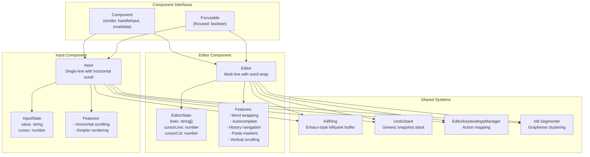

**Sources:** [packages/tui/src/components/editor.ts:215-283](), [packages/tui/src/components/input.ts:18-45](), [packages/tui/src/tui.ts:5]()

---

## Editor Component

The `Editor` class provides a multi-line text editing experience with sophisticated features. It is the primary input component in pi's interactive mode.

### Text State & Cursor Management

The editor maintains state as an array of strings (lines) with a 2D cursor position:

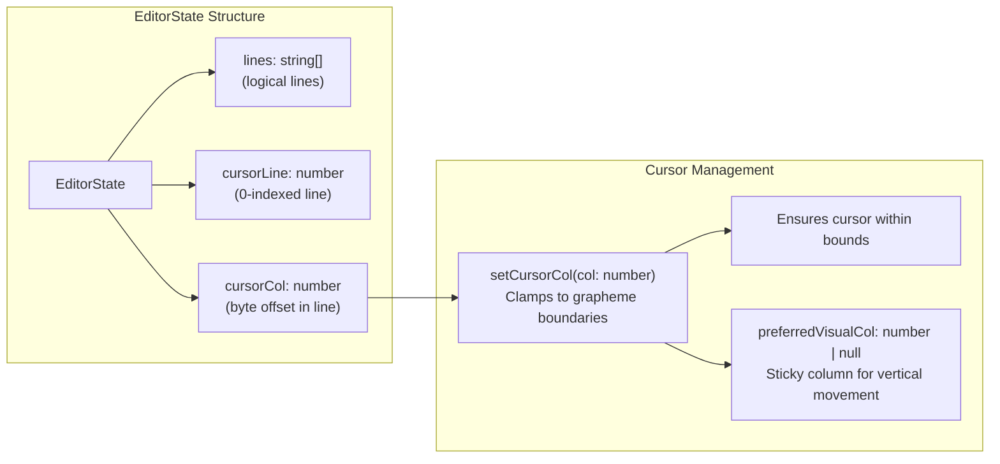

The `cursorCol` field stores byte offsets, not grapheme counts, to handle multi-byte Unicode correctly. The `setCursorCol` method ensures the cursor never lands mid-grapheme.

**Sources:** [packages/tui/src/components/editor.ts:188-192](), [packages/tui/src/components/editor.ts:1178-1211]()

---

### Word Wrapping Algorithm

The editor uses grapheme-aware word wrapping that preserves word boundaries when possible:

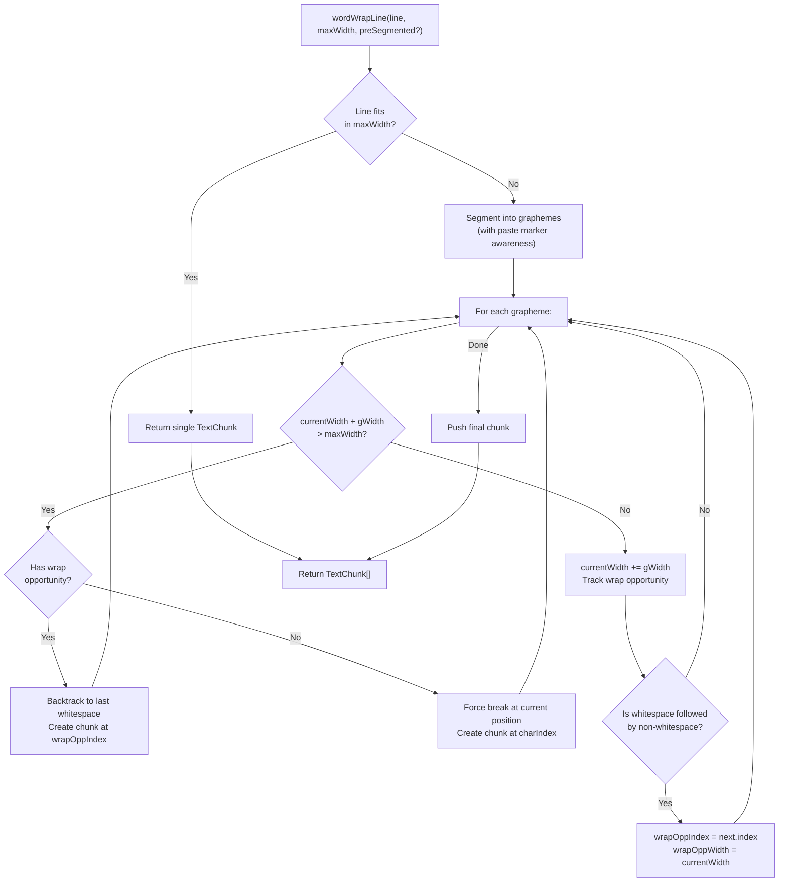

The algorithm tracks "wrap opportunities" (positions after whitespace before non-whitespace) and backtracks to them when overflow is detected. If backtracking doesn't help, it force-breaks mid-word.

**Key data structure:**

| Field        | Type     | Description                                     |
| ------------ | -------- | ----------------------------------------------- |
| `text`       | `string` | The wrapped text content                        |
| `startIndex` | `number` | Byte offset in original line where chunk starts |
| `endIndex`   | `number` | Byte offset in original line where chunk ends   |

**Sources:** [packages/tui/src/components/editor.ts:84-185](), [packages/tui/test/editor.test.ts:696-767]()

---

### Paste Handling & Markers

Large pastes (>10 lines or >1000 characters) are replaced with compact markers to avoid overwhelming the UI:

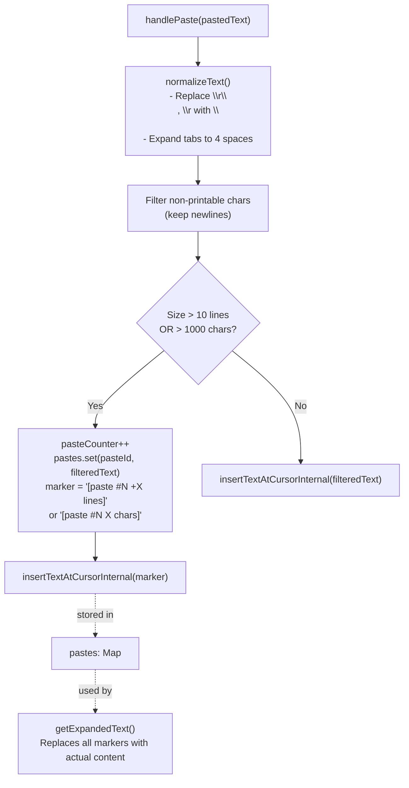

Paste markers are treated as atomic units by the segmenter, preventing cursor movement or deletion from splitting them:

```typescript
// Example markers:
'[paste #1 +123 lines]'
'[paste #2 1234 chars]'
```

**Marker-aware segmentation:** The `segmentWithMarkers` function wraps `Intl.Segmenter` and merges graphemes within valid paste markers into single segments. This ensures:

- Single backspace deletes entire marker
- Single arrow movement skips entire marker
- Word wrap treats marker as atomic unit

**Sources:** [packages/tui/src/components/editor.ts:12-78](), [packages/tui/src/components/editor.ts:1073-1126](), [packages/tui/src/components/editor.ts:905-920]()

---

### History Navigation

The editor maintains a prompt history for up/down arrow navigation, similar to shell history:

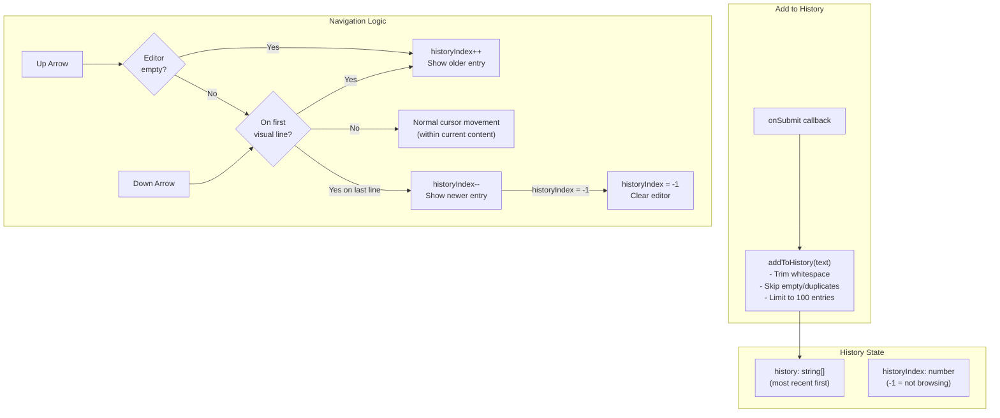

**Behavior details:**

- History browsing only triggers when editor is empty OR cursor is on first/last visual line
- Otherwise, up/down arrows perform normal cursor movement within wrapped text
- Typing any character exits history mode and stays in the current content
- History limit is 100 entries, oldest entries dropped first

**Sources:** [packages/tui/src/components/editor.ts:254-256](), [packages/tui/src/components/editor.ts:326-374](), [packages/tui/src/components/editor.ts:742-764]()

---

### Autocomplete Integration

The editor supports pluggable autocomplete via the `AutocompleteProvider` interface:

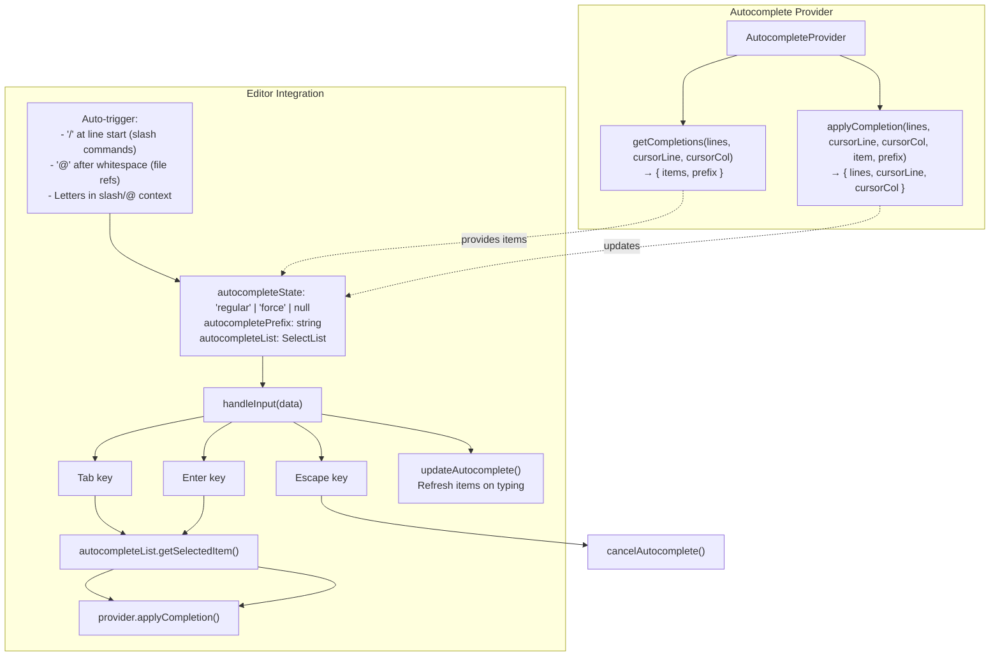

**Autocomplete modes:**

- `regular`: Auto-triggered by typing, dismissed by Escape
- `force`: Explicitly triggered by Tab, persists through character edits
- `null`: Not showing

**Auto-trigger conditions:**

1. `/` at start of message → slash command completion
2. `@` after whitespace → file reference completion
3. Letters when inside slash/@ context → update completions

**Sources:** [packages/tui/src/components/editor.ts:238-244](), [packages/tui/src/components/editor.ts:1040-1071](), [packages/tui/src/components/editor.ts:1345-1412]()

---

### Scrolling

The editor implements vertical scrolling when content exceeds available space:

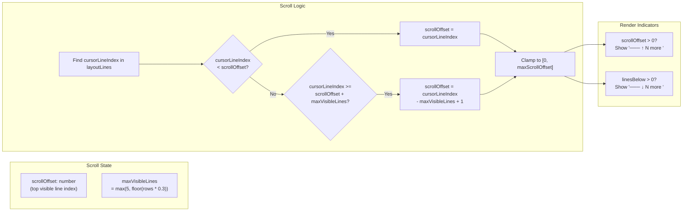

The editor reserves 30% of terminal height for the editor (minimum 5 lines). Scroll indicators replace the top/bottom borders when content is clipped.

**Sources:** [packages/tui/src/components/editor.ts:233](), [packages/tui/src/components/editor.ts:411-448]()

---

## Input Component

The `Input` class provides single-line text editing with horizontal scrolling. It shares most editing operations with `Editor` but has a simpler state model:

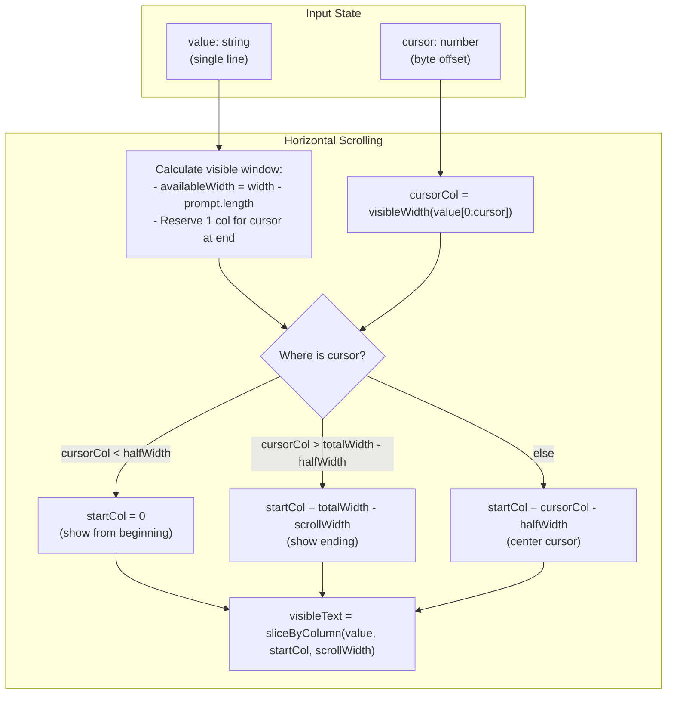

**Rendering:** Input renders with a fixed `"> "` prompt prefix. The cursor is shown as reverse video (SGR 7).

**Sources:** [packages/tui/src/components/input.ts:10-45](), [packages/tui/src/components/input.ts:434-502]()

---

## Editing Operations

Both `Editor` and `Input` share common editing primitives:

### Grapheme-Aware Text Manipulation

All text operations use `Intl.Segmenter` to respect grapheme cluster boundaries:

| Operation         | Implementation                              | Grapheme Handling                                 |
| ----------------- | ------------------------------------------- | ------------------------------------------------- |
| Insert character  | `insertCharacter(char)`                     | Inserts at cursor byte offset                     |
| Delete backward   | `handleBackspace()`                         | Deletes last grapheme before cursor               |
| Delete forward    | `handleForwardDelete()`                     | Deletes first grapheme after cursor               |
| Cursor left/right | `moveCursor(0, ±1)`                         | Moves by grapheme, not byte                       |
| Word movement     | `moveWordBackwards()`, `moveWordForwards()` | Skips grapheme runs (word/punctuation/whitespace) |

**Grapheme examples:**

- `"ä"` (single code unit) → 1 grapheme
- `"😀"` (multi-byte emoji) → 1 grapheme
- `"👨‍👩‍👧"` (family emoji, multiple code points) → 1 grapheme

**Word boundary detection:**

```typescript
// Word classification (simplified)
isWhitespaceChar(g) // space, tab, newline
isPunctuationChar(g) // .,;:!?()[]{}
// Everything else is a word character
```

**Sources:** [packages/tui/src/components/editor.ts:1012-1071](), [packages/tui/src/components/editor.ts:1473-1575](), [packages/tui/src/utils.ts:60-82]()

---

### Kill Ring System

The kill ring implements Emacs-style kill/yank operations with accumulation:

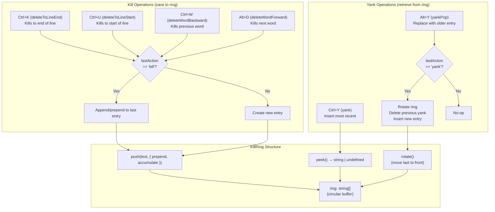

**Accumulation rules:**

- Consecutive kills accumulate into one ring entry
- Backward deletions (Ctrl+W, Ctrl+U) prepend to current entry
- Forward deletions (Alt+D, Ctrl+K) append to current entry
- Any non-kill action breaks accumulation

**Sources:** [packages/tui/src/kill-ring.ts:1-47](), [packages/tui/src/components/editor.ts:1603-1666](), [packages/tui/test/editor.test.ts:1866-2067]()

---

### Undo System

The undo system uses a generic stack with snapshot-based state storage:

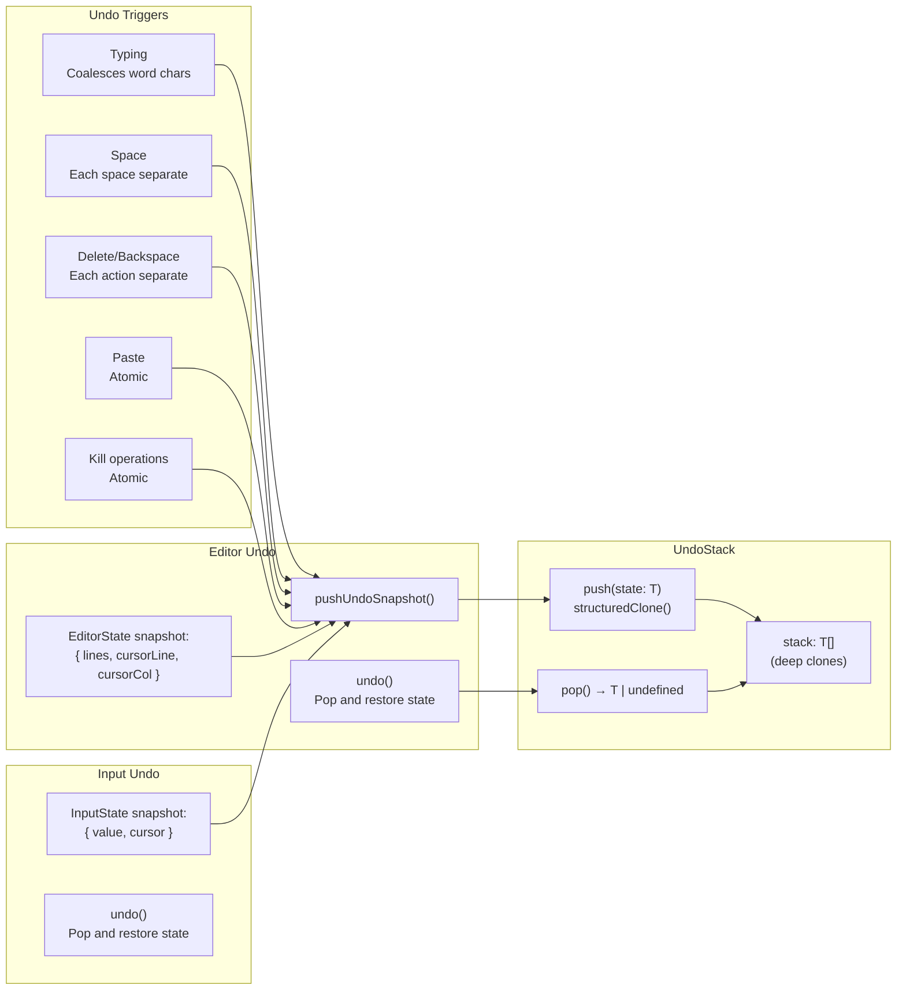

**Coalescing logic:**

```typescript
// Consecutive word characters coalesce into one undo unit
if (isWhitespaceChar(char) || this.lastAction !== 'type-word') {
  this.pushUndoSnapshot()
}
this.lastAction = 'type-word'
```

Whitespace characters create separate undo units, allowing granular undo for spaces while keeping words atomic.

**Sources:** [packages/tui/src/undo-stack.ts:1-29](), [packages/tui/src/components/editor.ts:267-268](), [packages/tui/src/components/editor.ts:1012-1026](), [packages/tui/test/editor.test.ts:2069-2194]()

---

## Keyboard Handling

Both components use the `EditorKeybindingsManager` for action mapping:

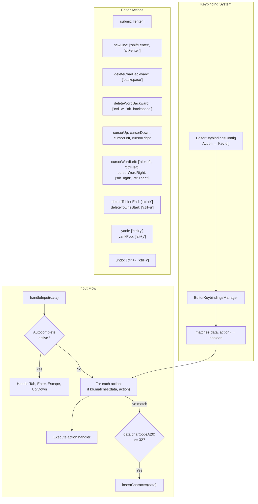

**Special key handling:**

- Bracketed paste (`\x1b[200~...content...\x1b[201~`) is buffered and processed atomically
- Kitty protocol printables (`\x1b[<codepoint>u`) are decoded before action matching
- Control characters are rejected except for defined keybindings

**Sources:** [packages/tui/src/keybindings.ts:1-200](), [packages/tui/src/components/editor.ts:519-811](), [packages/tui/src/components/input.ts:47-210]()

---

## Rendering

Both components implement the `Component.render(width: number): string[]` interface:

### Editor Rendering

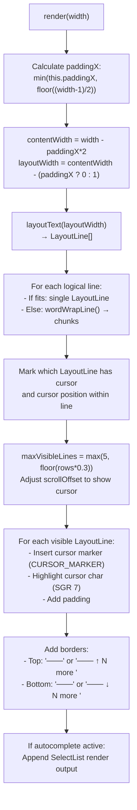

**Cursor rendering:** The editor emits `CURSOR_MARKER` (zero-width special character) before the fake cursor to position the hardware cursor for IME (Input Method Editor) support.

### Input Rendering

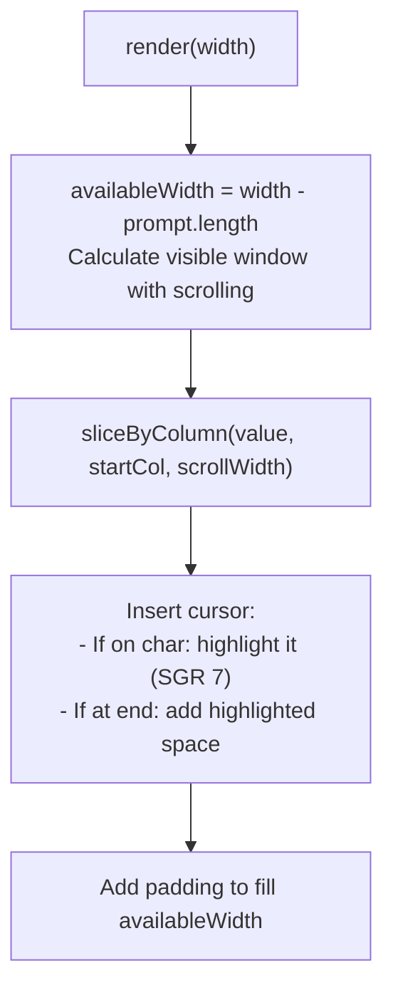

**Sources:** [packages/tui/src/components/editor.ts:394-517](), [packages/tui/src/components/input.ts:434-502](), [packages/tui/src/tui.ts:24-26]()
