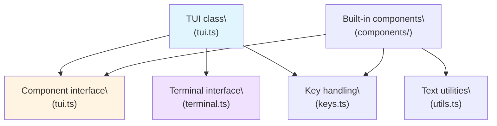
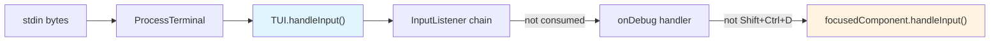
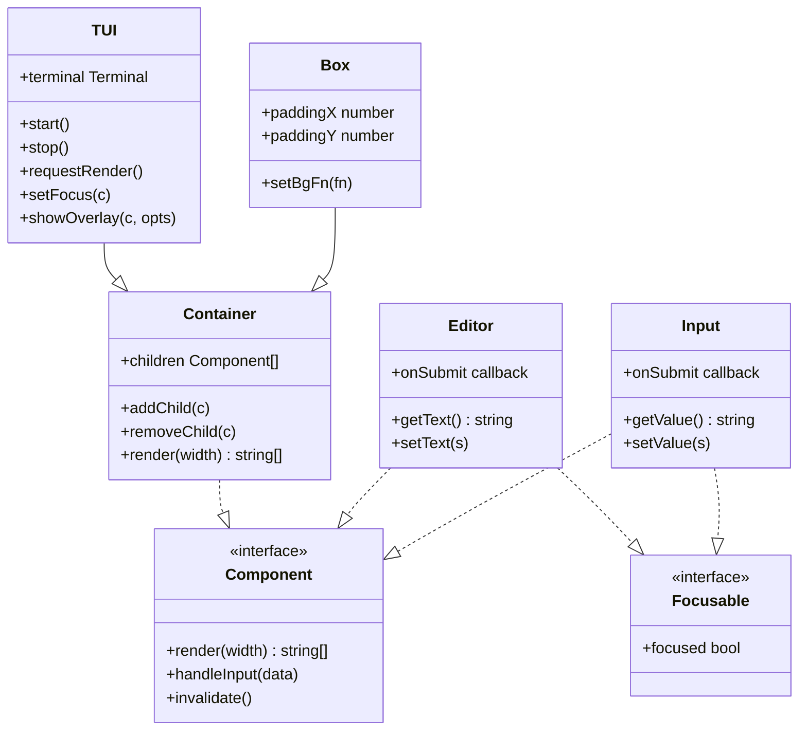
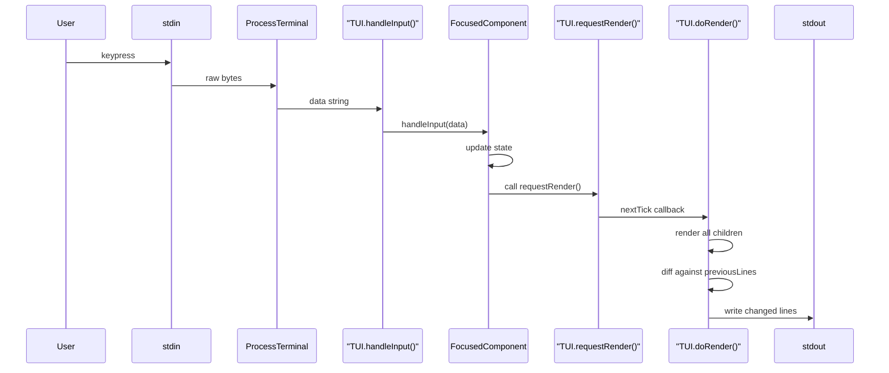

# pi-tui: Terminal UI Library

<details>
<summary>Relevant source files</summary>

The following files were used as context for generating this wiki page:

- [packages/coding-agent/docs/tui.md](packages/coding-agent/docs/tui.md)
- [packages/coding-agent/examples/extensions/overlay-qa-tests.ts](packages/coding-agent/examples/extensions/overlay-qa-tests.ts)
- [packages/tui/README.md](packages/tui/README.md)
- [packages/tui/src/tui.ts](packages/tui/src/tui.ts)
- [packages/tui/test/overlay-non-capturing.test.ts](packages/tui/test/overlay-non-capturing.test.ts)
- [packages/tui/test/overlay-options.test.ts](packages/tui/test/overlay-options.test.ts)
- [packages/tui/test/overlay-short-content.test.ts](packages/tui/test/overlay-short-content.test.ts)
- [packages/tui/test/tui-render.test.ts](packages/tui/test/tui-render.test.ts)

</details>

This page introduces the `@mariozechner/pi-tui` package (`packages/tui`): its purpose, core architecture, the `Component` interface, and how it fits into the pi-mono ecosystem. It provides enough context to understand the framework's design philosophy and guides you to the detailed subsystem pages.

**Child pages:**

- [5.1 Core TUI Architecture & Rendering](#5.1) - `TUI` class lifecycle, rendering pipeline, focus management, input routing
- [5.2 Component Interface & Overlays](#5.2) - `Component` contract, `Container`, overlay system, positioning
- [5.3 Editor & Input Components](#5.3) - `Editor`, `Input`, autocomplete, kill ring, undo/redo
- [5.4 Keyboard Protocol & Input Handling](#5.4) - Kitty protocol, `matchesKey`, key parsing, bracketed paste
- [5.5 Built-in Components](#5.5) - `Text`, `Markdown`, `Box`, `SelectList`, `Image`, etc.

**Related pages:**

- [4.10 Interactive Mode & TUI Integration](#4.10) - How coding-agent uses pi-tui

---

## Purpose and Scope

`@mariozechner/pi-tui` is a standalone terminal UI framework with no dependencies on the AI or agent packages. It provides the rendering and input-handling infrastructure for `@mariozechner/pi-coding-agent`'s interactive mode, but can be used independently in any Node.js CLI application.

**Key features:**

- **Differential rendering** - Only repaints changed lines, uses CSI 2026 synchronized output to eliminate flicker
- **Component-based architecture** - Everything implements `Component`; composition via `Container`
- **Overlay system** - Modal dialogs and panels rendered on top of existing content
- **Keyboard input abstraction** - Supports legacy terminal sequences and Kitty keyboard protocol
- **Built-in components** - `Editor`, `Input`, `Markdown`, `SelectList`, `Image`, and more
- **ANSI-aware text utilities** - Correct width calculation, wrapping, truncation for CJK, emoji, hyperlinks

The framework handles terminal raw mode, resize events, hardware cursor positioning (for IME support), and provides utilities for creating custom interactive CLI components.

Sources: [packages/tui/README.md:1-14](), [packages/tui/src/index.ts:1-93]()

---

## Architecture Overview

The package is organized around three core abstractions:

1. **`TUI`** - The main container and render loop manager
2. **`Component`** - The interface all renderable elements implement
3. **`Terminal`** - Abstraction over stdin/stdout for testing and flexibility

**High-level module organization:**



**Key source files:**

| Module     | Path                | Exports                                                                         |
| ---------- | ------------------- | ------------------------------------------------------------------------------- |
| Core       | `tui.ts`            | `TUI`, `Container`, `Component`, `Focusable`, `OverlayOptions`, `OverlayHandle` |
| Input      | `keys.ts`           | `matchesKey`, `parseKey`, `Key`, `KeyId`, `isKeyRelease`                        |
| Terminal   | `terminal.ts`       | `Terminal`, `ProcessTerminal`                                                   |
| Text       | `utils.ts`          | `visibleWidth`, `wrapTextWithAnsi`, `truncateToWidth`, `sliceByColumn`          |
| Images     | `terminal-image.ts` | `detectCapabilities`, `renderImage`, `encodeKitty`, `encodeITerm2`              |
| Components | `components/`       | `Editor`, `Input`, `Markdown`, `Text`, `Box`, `SelectList`, `Image`, etc.       |

Sources: [packages/tui/src/index.ts:1-93](), [packages/tui/src/tui.ts:1-50]()

---

## Core Architecture: Rendering and Input

`TUI` manages two parallel concerns: **rendering output** and **routing input**.

### Rendering Pipeline

The render loop uses differential updates to minimize terminal writes:

1. Call `render(width)` on all children to collect new lines
2. Compare each line to `previousLines` from the last render
3. For changed lines: emit ANSI cursor movement + line content
4. Wrap all writes in CSI 2026 synchronized output block

Three strategies (evaluated in order):

| Trigger                                  | Action                                    |
| ---------------------------------------- | ----------------------------------------- |
| Width/height change                      | Full redraw (clear screen, repaint all)   |
| Content shrunk + `clearOnShrink` enabled | Full redraw (prevents ghost lines)        |
| Individual line differences              | Differential (only repaint changed lines) |

Renders are deferred to `process.nextTick` via `requestRender()`, coalescing multiple state changes into one paint cycle.

**Rendering flow (simplified):**

```mermaid
sequenceDiagram
    participant App as "Application code"
    participant TUI as "TUI.requestRender()"
    participant Loop as "process.nextTick"
    participant Render as "doRender()"
    participant Term as "Terminal.write()"

    App->>TUI: requestRender()
    TUI->>Loop: schedule
    Loop->>Render: execute
    Render->>Render: collect lines from children
    Render->>Render: diff against previousLines
    Render->>Term: "\x1b[?2026h" (sync start)
    Render->>Term: cursor moves + changed lines
    Render->>Term: "\x1b[?2026l" (sync end)
```

See [5.1 Core TUI Architecture & Rendering](#5.1) for full details on the render strategies, cursor positioning, and viewport scrolling.

Sources: [packages/tui/src/tui.ts:460-476](), [packages/tui/src/tui.ts:869-1094]()

### Input Routing

User input flows through a chain of handlers before reaching the focused component:



Input listeners can transform or consume input before it reaches the focused component (used for cell-size query parsing, debugging hooks, etc.). See [5.4 Keyboard Protocol & Input Handling](#5.4) for details on Kitty protocol, `matchesKey`, and bracketed paste.

Sources: [packages/tui/src/tui.ts:478-534](), [packages/tui/src/tui.ts:420-430]()

---

## Component Contract

Every renderable element implements the `Component` interface defined in [packages/tui/src/tui.ts:16-40]():

```typescript
interface Component {
  render(width: number): string[]
  handleInput?(data: string): void
  wantsKeyRelease?: boolean
  invalidate(): void
}
```

| Method               | Contract                                                                                                                                  |
| -------------------- | ----------------------------------------------------------------------------------------------------------------------------------------- |
| `render(width)`      | Returns one string per line. **Each line must not exceed `width` visible columns.** Uses `truncateToWidth` or `sliceByColumn` to enforce. |
| `handleInput?(data)` | Receives raw terminal input bytes when component has focus. Optional.                                                                     |
| `wantsKeyRelease?`   | Opt-in flag for Kitty key-release events. Default `false`.                                                                                |
| `invalidate()`       | Clear cached render state. Called on theme changes or `requestRender(force=true)`.                                                        |

The `TUI` appends `\x1b[0m\x1b]8;;\x07` (SGR reset + OSC 8 reset) after each line, preventing ANSI style bleed across line boundaries.

### Focusable (IME Support)

Components that display a text cursor implement `Focusable` for correct IME positioning:

```typescript
interface Focusable {
  focused: boolean
}
```

When `focused = true`, the component emits `CURSOR_MARKER` (APC sequence `\x1b_pi:c\x07`) at the cursor position in its rendered output. `TUI` extracts this marker's location and positions the hardware terminal cursor there. This ensures IME candidate windows appear at the correct screen position for Chinese, Japanese, Korean input methods.

`Editor` and `Input` implement `Focusable` automatically. Custom components with text input should follow this pattern.

See [5.2 Component Interface & Overlays](#5.2) for full `Component` contract details, and [5.3 Editor & Input Components](#5.3) for `Focusable` implementation examples.

Sources: [packages/tui/src/tui.ts:16-68](), [packages/tui/src/tui.ts:777-788](), [packages/tui/src/tui.ts:849-867]()

---

## Component Composition

`Container` implements `Component` and manages a list of child components. Its `render()` concatenates child render outputs:

```typescript
class Container implements Component {
  children: Component[] = []
  addChild(component: Component): void
  removeChild(component: Component): void
  render(width: number): string[] {
    const lines: string[] = []
    for (const child of this.children) {
      lines.push(...child.render(width))
    }
    return lines
  }
}
```

`TUI` extends `Container`, making it the root of the component tree. Application code builds a hierarchy by nesting `Container` instances and adding leaf components.

**Class hierarchy:**



See [5.2 Component Interface & Overlays](#5.2) for composition patterns and overlay system details.

Sources: [packages/tui/src/tui.ts:173-204](), [packages/tui/src/tui.ts:209-240]()

---

## Built-in Components Overview

The `components/` directory provides ready-to-use UI elements. All are exported from `@mariozechner/pi-tui` and documented in [5.5 Built-in Components](#5.5).

| Component      | Purpose            | Key Features                                          |
| -------------- | ------------------ | ----------------------------------------------------- |
| `Text`         | Multi-line display | Word wrapping, padding, background color              |
| `Markdown`     | Formatted text     | CommonMark parser, syntax highlighting, theme support |
| `Editor`       | Multi-line input   | Autocomplete, undo/redo, kill ring, Focusable         |
| `Input`        | Single-line input  | Word navigation, history, Focusable                   |
| `SelectList`   | Item picker        | Keyboard navigation, scrolling, filtering             |
| `SettingsList` | Settings UI        | Value cycling, submenus, fuzzy search                 |
| `Box`          | Layout container   | Padding, background color                             |
| `Image`        | Inline graphics    | Kitty/iTerm2 protocol, auto-sizing                    |
| `Loader`       | Progress indicator | Animated spinner, customizable colors                 |

See [5.5 Built-in Components](#5.5) for API documentation and usage examples.

Sources: [packages/tui/src/index.ts:11-23](), [packages/tui/README.md:197-511]()

---

## Overlay System (Summary)

Overlays render components on top of existing content without clearing the screen, enabling modal dialogs and side panels. The `TUI` class maintains an overlay stack and composites them into the final output:

```typescript
const handle = tui.showOverlay(component, options?);
```

**Key options:**

| Option         | Type               | Description                                        |
| -------------- | ------------------ | -------------------------------------------------- |
| `width`        | `number \| "50%"`  | Absolute or percentage of terminal width           |
| `anchor`       | `OverlayAnchor`    | One of 9 positions: `"center"`, `"top-left"`, etc. |
| `row` / `col`  | `number \| "25%"`  | Absolute or percentage position (overrides anchor) |
| `margin`       | `number \| object` | Spacing from terminal edges                        |
| `maxHeight`    | `number \| "50%"`  | Maximum overlay height with truncation             |
| `visible`      | `(w, h) => bool`   | Responsive visibility callback                     |
| `nonCapturing` | `boolean`          | Don't auto-focus when shown                        |

**Handle API:**

```typescript
interface OverlayHandle {
  hide(): void // Permanently remove
  setHidden(bool): void // Toggle visibility
  isHidden(): boolean
  focus(): void // Bring to front, take focus
  unfocus(): void // Release focus
  isFocused(): boolean
}
```

Overlays are rendered in stack order (bottom to top) but focus order determines visual stacking when using `nonCapturing` overlays. See [5.2 Component Interface & Overlays](#5.2) for full positioning documentation and overlay lifecycle patterns.

Sources: [packages/tui/src/tui.ts:74-169](), [packages/tui/src/tui.ts:297-364](), [packages/tui/README.md:61-115]()

---

## Keyboard Input (Summary)

The `keys.ts` module provides a unified API for matching keyboard input across legacy terminal sequences and the Kitty keyboard protocol:

```typescript
import { matchesKey, Key } from '@mariozechner/pi-tui'

// In handleInput():
if (matchesKey(data, Key.ctrl('c'))) {
  process.exit(0)
} else if (matchesKey(data, Key.enter)) {
  this.submit()
} else if (matchesKey(data, Key.ctrlShift('p'))) {
  this.showCommandPalette()
}
```

**Core API:**

| Function                  | Description                                               |
| ------------------------- | --------------------------------------------------------- |
| `matchesKey(data, keyId)` | Returns `true` if input `data` matches the `KeyId` string |
| `parseKey(data)`          | Returns the `KeyId` for the input, or `undefined`         |
| `Key.ctrl(key)`           | Helper for constructing `KeyId` like `"ctrl+c"`           |
| `isKeyRelease(data)`      | Detects Kitty key-release events                          |

`KeyId` format: `"ctrl+c"`, `"shift+enter"`, `"alt+left"`, `"ctrl+shift+p"`. Symbol keys use literals: `"ctrl+/"`, `"alt+["`.

The module auto-detects Kitty protocol support and parses the extended event fields (modifiers, repeat, release). See [5.4 Keyboard Protocol & Input Handling](#5.4) for protocol details, base layout support, and bracketed paste mode.

Sources: [packages/tui/src/keys.ts:1-19](), [packages/tui/src/keys.ts:136-156](), [packages/tui/README.md:544-565]()

---

## ANSI-Aware Text Utilities

The `utils.ts` module exports functions for measuring, wrapping, and truncating strings that contain ANSI escape codes, wide characters (CJK), emoji with ZWJ sequences, and OSC 8 hyperlinks:

| Function                                  | Description                                                                               |
| ----------------------------------------- | ----------------------------------------------------------------------------------------- |
| `visibleWidth(s)`                         | Returns printable column width, stripping ANSI codes, measuring Unicode grapheme clusters |
| `wrapTextWithAnsi(s, width)`              | Wraps text to `width` columns, re-applying ANSI codes at line breaks                      |
| `truncateToWidth(s, maxWidth, ellipsis?)` | Truncates to `maxWidth` columns, optionally pads or adds ellipsis                         |
| `sliceByColumn(s, start, end, strict?)`   | Extracts column range, handling wide chars at boundaries                                  |

These utilities are required for correct rendering because:

- CJK characters occupy 2 columns each
- Emoji with ZWJ sequences (e.g., 👨‍👩‍👧‍👦) must be treated as single graphemes
- ANSI escape codes occupy 0 columns but must be preserved
- OSC 8 hyperlinks are 0-width but affect cursor position

Every component's `render()` method must use `truncateToWidth` or `sliceByColumn` to enforce the `width` parameter contract.

Sources: [packages/tui/src/utils.ts:1-20](), [packages/tui/README.md:603-617]()

---

## Terminal Abstraction and Image Support

### Terminal Interface

`ProcessTerminal` implements the `Terminal` interface, abstracting stdin/stdout for testing and flexibility:

```typescript
interface Terminal {
  start(onInput: (data: string) => void, onResize: () => void): void
  stop(): void
  write(data: string): void
  get columns(): number
  get rows(): number
  hideCursor(): void
  showCursor(): void
  // ... (clearLine, clearFromCursor, clearScreen, moveBy)
}
```

`ProcessTerminal` additionally:

- Enables raw mode on stdin
- Negotiates Kitty keyboard protocol via query string
- Emits resize events on SIGWINCH
- Initializes Windows VT input mode via `koffi` FFI (dynamically loaded)

For testing, `VirtualTerminal` (from `test/virtual-terminal.ts`) uses `@xterm/headless` to simulate a terminal without real stdin/stdout.

Sources: [packages/tui/src/terminal.ts:1-20](), [packages/tui/src/terminal.ts:120-138]()

### Image Rendering

The `terminal-image.ts` module renders inline images using Kitty graphics protocol (Kitty, WezTerm, Ghostty) or iTerm2 inline images:

| Function                          | Description                                                             |
| --------------------------------- | ----------------------------------------------------------------------- |
| `detectCapabilities()`            | Probes `TERM_PROGRAM`, `TERM`, and responses to determine protocol      |
| `renderImage(base64, mime, opts)` | Auto-detects protocol and emits image escape sequence                   |
| `encodeKitty(data, opts)`         | Encodes for Kitty graphics protocol (chunked base64 with control codes) |
| `encodeITerm2(data)`              | Encodes for iTerm2 (OSC 1337 with base64 data)                          |
| `setCellDimensions(dims)`         | Sets cell pixel size for width/height calculations                      |

The `Image` component (see [5.5 Built-in Components](#5.5)) wraps this API and parses image dimensions from PNG/JPEG/GIF headers.

Sources: [packages/tui/src/terminal-image.ts:1-30](), [packages/tui/README.md:489-511]()

---

## Usage Pattern: From Construction to Render Loop

Typical application structure:

1. **Construct terminal abstraction:** `const terminal = new ProcessTerminal()`
2. **Create TUI instance:** `const tui = new TUI(terminal)`
3. **Build component tree:** `tui.addChild(new Editor(...))`, `tui.addChild(new Markdown(...))`
4. **Set focus:** `tui.setFocus(editorComponent)`
5. **Start render/input loop:** `tui.start()`
6. **Trigger re-renders on state changes:** `tui.requestRender()`
7. **Show overlays for modals:** `tui.showOverlay(dialog, { anchor: "center", width: 50 })`
8. **Clean up on exit:** `tui.stop()`

**Input-to-render cycle:**



See the [test/chat-simple.ts](packages/tui/test/chat-simple.ts:1-100)() example for a complete working chat UI.

Sources: [packages/tui/src/tui.ts:409-418](), [packages/tui/src/tui.ts:478-534](), [packages/tui/src/tui.ts:869-920](), [packages/tui/README.md:18-39]()

---

## Environment Variables

| Variable               | Effect                                                  |
| ---------------------- | ------------------------------------------------------- |
| `PI_HARDWARE_CURSOR=1` | Enables hardware cursor positioning (default: off)      |
| `PI_CLEAR_ON_SHRINK=1` | Full redraw when content shrinks (default: off)         |
| `PI_TUI_WRITE_LOG`     | Path to capture raw ANSI output for debugging           |
| `PI_DEBUG_REDRAW=1`    | Logs full-redraw triggers to `~/.pi/agent/pi-debug.log` |

Sources: [packages/tui/src/tui.ts:215-216](), [packages/tui/CHANGELOG.md:107-113]()
