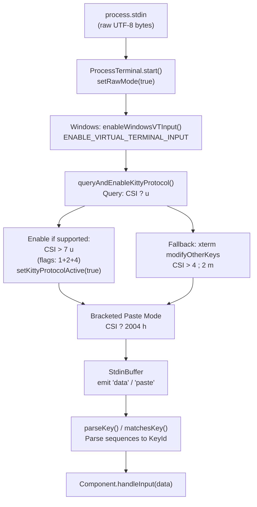
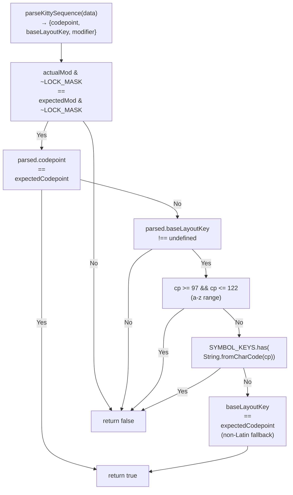
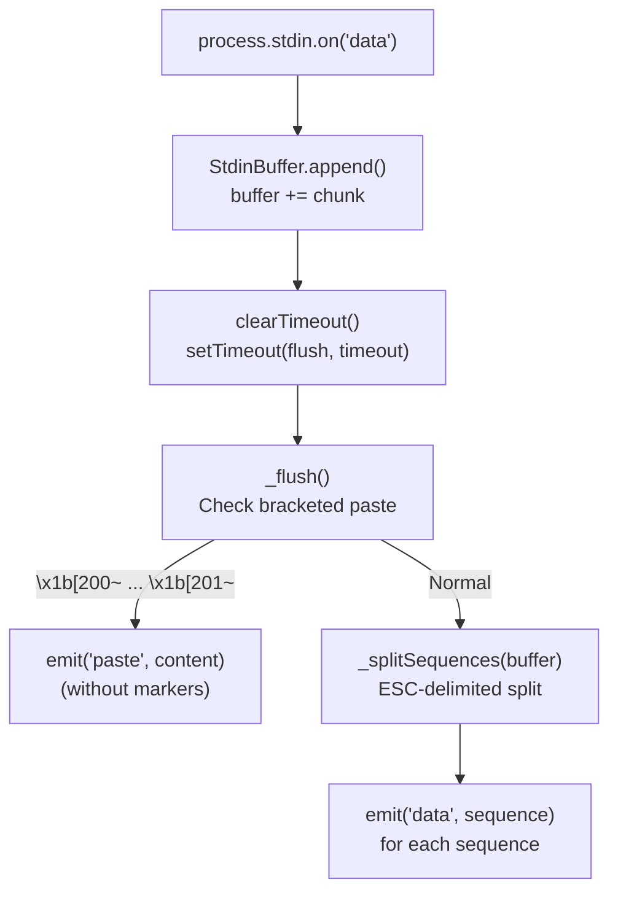
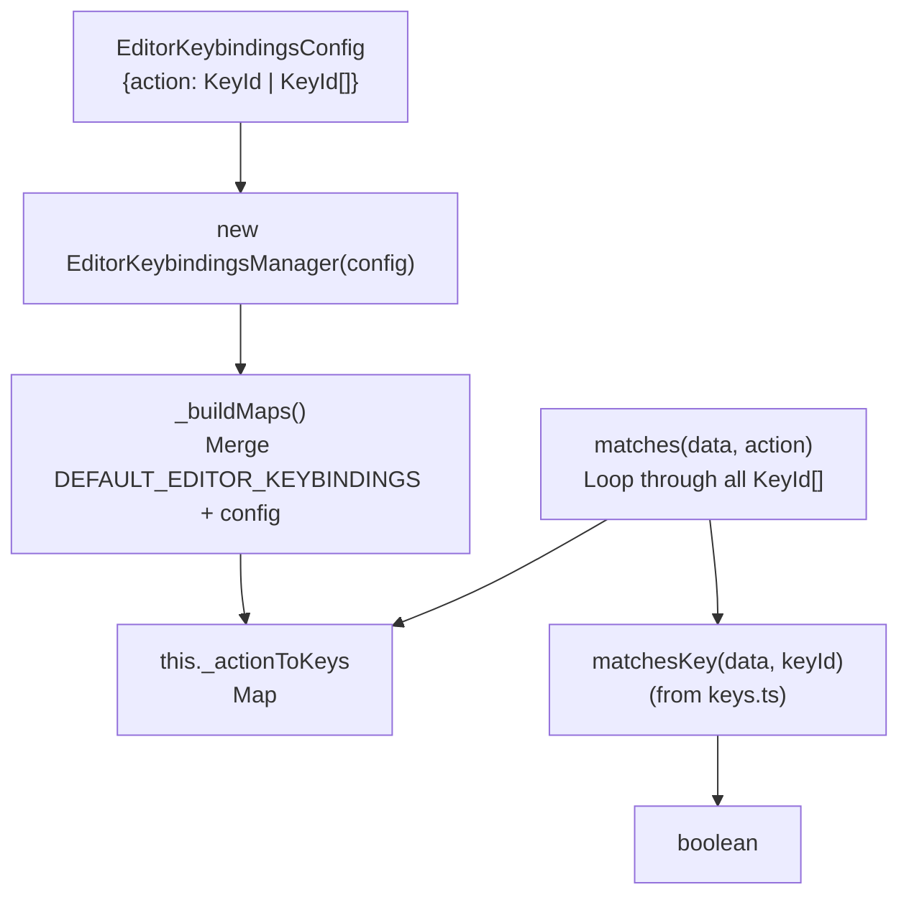
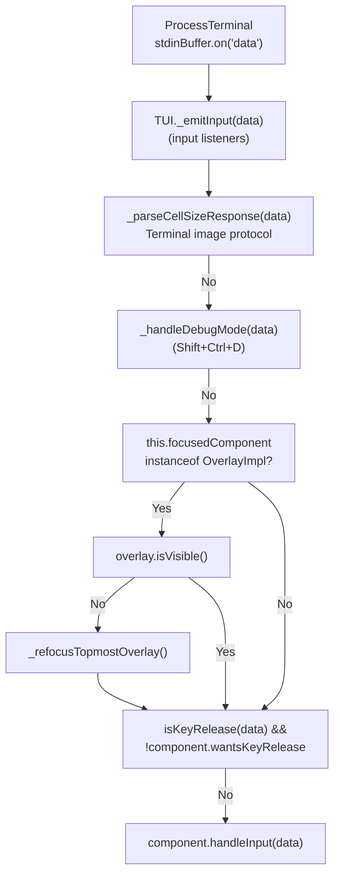

# Keyboard Protocol & Input Handling

<details>
<summary>Relevant source files</summary>

The following files were used as context for generating this wiki page:

- [packages/coding-agent/docs/terminal-setup.md](packages/coding-agent/docs/terminal-setup.md)
- [packages/coding-agent/docs/tmux.md](packages/coding-agent/docs/tmux.md)
- [packages/coding-agent/src/modes/interactive/components/custom-editor.ts](packages/coding-agent/src/modes/interactive/components/custom-editor.ts)
- [packages/tui/src/components/editor.ts](packages/tui/src/components/editor.ts)
- [packages/tui/src/components/input.ts](packages/tui/src/components/input.ts)
- [packages/tui/src/index.ts](packages/tui/src/index.ts)
- [packages/tui/src/keys.ts](packages/tui/src/keys.ts)
- [packages/tui/src/kill-ring.ts](packages/tui/src/kill-ring.ts)
- [packages/tui/src/undo-stack.ts](packages/tui/src/undo-stack.ts)
- [packages/tui/test/editor.test.ts](packages/tui/test/editor.test.ts)
- [packages/tui/test/input.test.ts](packages/tui/test/input.test.ts)
- [packages/tui/test/keys.test.ts](packages/tui/test/keys.test.ts)

</details>

This page documents the keyboard input handling system in pi-tui, which provides robust terminal input parsing with support for modern terminal protocols and graceful fallback to legacy sequences.

**Scope**: This covers the keyboard protocol detection, key parsing, keybindings system, and input routing from raw terminal data to components. For information about specific input components (Editor, Input), see [Editor & Input Components](#5.3). For general component interfaces, see [Component Interface & Overlays](#5.2).

## Purpose & Architecture

The keyboard handling system solves several challenges:

- **Protocol detection**: Automatically detect and enable Kitty keyboard protocol when available
- **Unified parsing**: Parse both modern (Kitty CSI-u) and legacy terminal sequences into a common format
- **Non-Latin keyboard support**: Handle keyboard layouts where physical keys differ from character output (e.g., Cyrillic, Arabic)
- **Modifier disambiguation**: Distinguish `Ctrl+Enter` from plain `Enter`, `Shift+Tab` from `Tab`, etc.
- **Paste handling**: Process large pastes correctly with bracketed paste mode
- **Input batching**: Split batched terminal input into individual key events

**Key modules**:

- `keys.ts` - Key parsing and matching logic
- `terminal.ts` - Protocol negotiation and terminal interface
- `stdin-buffer.ts` - Input batching and paste detection
- `keybindings.ts` - Configurable keybinding system

---

## Keyboard Protocol Layers

### Protocol Stack Flow



**Sources**: [packages/tui/src/terminal.ts](), [packages/tui/src/stdin-buffer.ts](), [packages/tui/src/keys.ts:31-40]()

The protocol is negotiated during `ProcessTerminal.start()`:

1. **Raw mode**: Terminal input is read character-by-character without line buffering
2. **Windows VT input**: On Windows, enable VT sequence emission for modified keys (e.g., `Shift+Tab` → `\x1b[Z`)
3. **Kitty protocol query**: Send `CSI ? u` and wait for response `CSI ? <flags> u`
4. **Protocol enable**: If Kitty supported, enable with flags 1+2+4. Otherwise enable xterm modifyOtherKeys mode 2
5. **Bracketed paste**: Enable with `CSI ? 2004 h` to wrap pasted content in markers
6. **Input buffering**: StdinBuffer splits batched input into individual sequences

**Sources**: [packages/tui/src/terminal.ts:99-180]()

---

## Key Parsing API

### Core Functions

The `keys.ts` module provides three main functions:

| Function                         | Purpose                                                   |
| -------------------------------- | --------------------------------------------------------- |
| `matchesKey(data, keyId)`        | Check if raw input matches a key identifier (most common) |
| `parseKey(data)`                 | Parse raw input and return the key identifier             |
| `setKittyProtocolActive(active)` | Set global protocol state (called by ProcessTerminal)     |

**Type-safe key identifiers**:

```typescript
type KeyId =
  | BaseKey // "a", "escape", "enter", etc.
  | `ctrl+${BaseKey}`
  | `shift+${BaseKey}`
  | `alt+${BaseKey}`
  | `ctrl+shift+${BaseKey}`
// ... all modifier combinations
```

**Sources**: [packages/tui/src/keys.ts:44-161]()

### Key Helper Object

The `Key` helper provides autocomplete for creating key identifiers:

```typescript
import { Key } from '@mariozechner/pi-tui'

// Special keys
Key.escape // "escape"
Key.enter // "enter"
Key.tab // "tab"

// Single modifiers
Key.ctrl('c') // "ctrl+c"
Key.shift('tab') // "shift+tab"
Key.alt('left') // "alt+left"

// Combined modifiers
Key.ctrlShift('p') // "ctrl+shift+p"
Key.ctrlAlt('x') // "ctrl+alt+x"
Key.shiftAlt('down') // "shift+alt+down"
```

**Sources**: [packages/tui/src/keys.ts:172-253]()

### Usage in Components

```typescript
class MyComponent implements Component {
  handleInput(data: string): void {
    if (matchesKey(data, Key.up)) {
      this.selectedIndex--
    } else if (matchesKey(data, Key.ctrl('c'))) {
      this.onCancel?.()
    } else if (matchesKey(data, Key.ctrlShift('p'))) {
      this.showPalette()
    }
  }
}
```

**Sources**: [packages/tui/README.md:266-287]()

---

## Kitty Keyboard Protocol

### Protocol Flags

When Kitty protocol is detected, pi-tui enables flags 1, 2, and 4:

| Flag | Name           | Purpose                                                           |
| ---- | -------------- | ----------------------------------------------------------------- |
| 1    | Disambiguate   | All keys emit CSI-u sequences (even plain `a` becomes `\x1b[97u`) |
| 2    | Event types    | Report press/repeat/release events (`:1`, `:2`, `:3` suffix)      |
| 4    | Alternate keys | Report shifted key and base layout key for non-Latin layouts      |

Enable command: `CSI > 7 u` (7 = 1+2+4)

**Sources**: [packages/tui/src/terminal.ts:127-134]()

### CSI-u Sequence Format

With all flags enabled, the format is:

```
CSI <codepoint> [:<shifted>] [:<base>] [;<modifier>] [:<event>] u
```

**Examples**:

| Sequence           | Meaning                                                              |
| ------------------ | -------------------------------------------------------------------- |
| `\x1b[97u`         | Plain `a` (codepoint 97)                                             |
| `\x1b[97;5u`       | `Ctrl+a` (modifier 5 = ctrl(4) + 1)                                  |
| `\x1b[97:65u`      | `Shift+a` (shifted key `A` = 65)                                     |
| `\x1b[1089::99;5u` | `Ctrl+с` on Cyrillic keyboard (codepoint 1089, base layout `c` = 99) |
| `\x1b[97;5:2u`     | `Ctrl+a` repeat event                                                |
| `\x1b[97;5:3u`     | `Ctrl+a` release event                                               |

**Modifier values**: shift=1, alt=2, ctrl=4. Final value is sum+1 (so `Ctrl+Shift` = 1+4+1 = 6).

**Sources**: [packages/tui/src/keys.ts:540-604]()

---

## Base Layout Key Support

### Problem: Non-Latin Keyboards

On non-Latin keyboard layouts (Cyrillic, Arabic, Hebrew, etc.), the **character** produced differs from the **physical key position**. For example, on a Russian keyboard:

- Physical key for Latin `c` produces Cyrillic `с` (codepoint 1089)
- User expects `Ctrl+C` to work for copy, not `Ctrl+с`

### Solution: Base Layout Key

Kitty protocol flag 4 adds a third field to CSI-u sequences: the **base layout key** - the key's position on a standard PC-101 (Latin QWERTY) layout.

**Sequence**: `\x1b[<codepoint>::<base>;<modifier>u`

When matching keys, pi-tui prefers the base layout key **only** if the codepoint is not already a recognized Latin letter or symbol. This prevents false matches on remapped layouts (Dvorak, Colemak, xremap).

**Sources**: [packages/tui/src/keys.ts:606-638]()

### Matching Logic (matchesKittySequence)



**Sources**: [packages/tui/src/keys.ts:613-645]()

**Example scenarios**:

| Scenario          | Codepoint  | Base      | Match `ctrl+c`? | Reason                                  |
| ----------------- | ---------- | --------- | --------------- | --------------------------------------- |
| Latin `Ctrl+c`    | 99 (`c`)   | -         | ✓               | Direct codepoint match                  |
| Cyrillic `Ctrl+с` | 1089 (`с`) | 99 (`c`)  | ✓               | Base layout fallback (not Latin)        |
| Dvorak `Ctrl+k`   | 107 (`k`)  | 118 (`v`) | ✓               | Codepoint is Latin, base ignored        |
| Dvorak `Ctrl+/`   | 47 (`/`)   | 91 (`[`)  | ✓               | Codepoint is known symbol, base ignored |

**Sources**: [packages/tui/test/keys.test.ts:9-119]()

---

## Event Types & Key Release

### Kitty Protocol Flag 2

When enabled, Kitty protocol adds an event type field after the modifier:

```
CSI <codepoint> ; <modifier> : <event> u
```

**Event types**:

- `1` = Press
- `2` = Repeat (key held down)
- `3` = Release

### Detecting Release Events

Components can opt into receiving release events by setting `wantsKeyRelease = true`:

```typescript
class MyComponent implements Component {
  wantsKeyRelease = true // Receive release events

  handleInput(data: string): void {
    if (isKeyRelease(data)) {
      console.log('Key released')
    } else if (isKeyRepeat(data)) {
      console.log('Key repeating')
    } else {
      console.log('Key pressed')
    }
  }
}
```

**Default behavior**: TUI filters out release events unless `wantsKeyRelease = true`.

**Sources**: [packages/tui/src/tui.ts:527-530](), [packages/tui/src/keys.ts:473-530]()

### Paste Content Protection

The `isKeyRelease()` function explicitly checks for bracketed paste markers to avoid false positives:

```typescript
// Don't treat pasted MAC addresses like "90:62:3F:A5" as release events
if (data.includes('\x1b[200~')) {
  return false
}
```

**Sources**: [packages/tui/src/keys.ts:480-487]()

---

## Bracketed Paste Mode

### Purpose

Bracketed paste mode wraps pasted content in escape sequences so terminals can distinguish:

- **Typed input**: Individual keypresses
- **Pasted content**: Multi-line text that should be inserted atomically

### Protocol

**Enable**: `CSI ? 2004 h` (sent during terminal start)  
**Disable**: `CSI ? 2004 l` (sent during terminal stop)

**Paste markers**:

- Start: `\x1b[200~`
- End: `\x1b[201~`

**Sources**: [packages/tui/src/terminal.ts:82](), [packages/tui/src/terminal.ts:251]()

### StdinBuffer Integration

StdinBuffer detects bracketed paste markers and emits them as separate events:

```typescript
const stdinBuffer = new StdinBuffer({ timeout: 10 })

stdinBuffer.on('data', (sequence) => {
  // Regular key events - forward to TUI
})

stdinBuffer.on('paste', (content) => {
  // Re-wrap for Editor's paste handling
  // (Editor.handleInput expects bracketed markers)
  this.inputHandler(`\x1b[200~${content}\x1b[201~`)
})
```

**Sources**: [packages/tui/src/terminal.ts](), [packages/tui/src/stdin-buffer.ts]()

### Editor Paste Handling

The Editor component buffers pasted content and processes it when the end marker arrives:

```typescript
// Editor.handleInput() - detect paste start
if (data.includes('\x1b[200~')) {
  this.isInPaste = true
  this.pasteBuffer = ''
  data = data.replace('\x1b[200~', '')
}

if (this.isInPaste) {
  this.pasteBuffer += data
  const endIndex = this.pasteBuffer.indexOf('\x1b[201~')
  if (endIndex !== -1) {
    const pasteContent = this.pasteBuffer.substring(0, endIndex)
    this.handlePaste(pasteContent) // Process complete paste
    this.isInPaste = false
  }
}
```

**Large paste markers**: If paste exceeds 10 lines or 1000 characters, Editor inserts a compact marker like `[paste #1 +123 lines]` or `[paste #1 1234 chars]` instead of the full content. The actual content is stored in `this.pastes` Map and expanded via `getExpandedText()`.

**Sources**: [packages/tui/src/components/editor.ts:543-566](), [packages/tui/src/components/editor.ts:1073-1116](), [packages/tui/src/components/editor.ts:905-920]()

---

## Input Buffering with StdinBuffer

### Problem: Batched Input

Terminals may batch multiple key events into a single `stdin` data event, especially:

- During rapid typing
- When terminal is under load
- Over SSH with latency

This breaks `matchesKey()` and `isKeyRelease()` which expect individual sequences.

### Solution: StdinBuffer

StdinBuffer splits batched input into individual sequences using a timeout-based approach:



**Sources**: [packages/tui/src/stdin-buffer.ts]()

### Configuration

```typescript
const buffer = new StdinBuffer({
  timeout: 10, // ms to wait for more data before emitting
})

buffer.on('data', (sequence) => {
  // Individual key sequence
})

buffer.on('paste', (content) => {
  // Bracketed paste content (without markers)
})
```

**Sources**: [packages/tui/src/terminal.ts:113-148]()

---

## Keybindings System

### EditorKeybindingsManager

The keybindings system provides configurable key mappings for editor actions:



**Sources**: [packages/tui/src/keybindings.ts]()

### Default Bindings

```typescript
export const DEFAULT_EDITOR_KEYBINDINGS = {
  // Cursor movement
  cursorUp: 'up',
  cursorDown: 'down',
  cursorLeft: ['left', 'ctrl+b'],
  cursorRight: ['right', 'ctrl+f'],
  cursorWordLeft: ['alt+left', 'ctrl+left', 'alt+b'],
  cursorWordRight: ['alt+right', 'ctrl+right', 'alt+f'],
  cursorLineStart: ['home', 'ctrl+a'],
  cursorLineEnd: ['end', 'ctrl+e'],

  // Deletion
  deleteCharBackward: 'backspace',
  deleteCharForward: ['delete', 'ctrl+d'],
  deleteWordBackward: ['ctrl+w', 'alt+backspace'],
  deleteWordForward: ['alt+d', 'alt+delete'],
  deleteToLineStart: 'ctrl+u',
  deleteToLineEnd: 'ctrl+k',

  // Text input
  newLine: 'shift+enter',
  submit: 'enter',
  tab: 'tab',

  // Selection
  selectUp: 'up',
  selectDown: 'down',
  selectConfirm: 'enter',
  selectCancel: ['escape', 'ctrl+c'],

  // Undo/Kill ring
  undo: 'ctrl+-',
  yank: 'ctrl+y',
  yankPop: 'alt+y',

  // ... more actions
}
```

**Sources**: [packages/tui/src/keybindings.ts:67-114]()

### Custom Keybindings

```typescript
import {
  EditorKeybindingsManager,
  setEditorKeybindings,
} from '@mariozechner/pi-tui'

const customKeybindings = new EditorKeybindingsManager({
  submit: 'ctrl+enter', // Override
  newLine: ['shift+enter', 'alt+enter'], // Multiple keys
  selectCancel: 'escape', // Single key only
})

setEditorKeybindings(customKeybindings)
```

**Sources**: [packages/tui/src/keybindings.ts:119-184]()

### Usage in Components

```typescript
import { getEditorKeybindings } from '@mariozechner/pi-tui'

class MyEditor implements Component {
  handleInput(data: string): void {
    const kb = getEditorKeybindings()

    if (kb.matches(data, 'submit')) {
      this.submit()
    } else if (kb.matches(data, 'undo')) {
      this.undo()
    } else if (kb.matches(data, 'deleteWordBackward')) {
      this.deleteWord()
    }
  }
}
```

**Sources**: [packages/tui/src/components/editor.ts:520](), [packages/tui/src/components/input.ts:85]()

---

## Legacy Terminal Fallback

### xterm modifyOtherKeys

When Kitty protocol is not supported, pi-tui enables xterm `modifyOtherKeys` mode 2:

```
CSI > 4 ; 2 m
```

This allows modified keys (e.g., `Shift+Enter`, `Ctrl+/`) to be distinguished in older terminals like tmux.

**Format**: `CSI 27 ; <modifier> ; <keycode> ~`

**Example**: `Shift+Enter` → `\x1b[27;2;13~` (modifier=2 for shift+1, keycode=13 for enter)

**Sources**: [packages/tui/src/terminal.ts:175-179](), [packages/tui/src/keys.ts:645-653]()

### Legacy Sequences

For terminals without CSI-u or modifyOtherKeys, pi-tui falls back to standard VT100/xterm sequences:

| Key        | Sequence              | Notes                |
| ---------- | --------------------- | -------------------- |
| Arrow keys | `\x1b[A/B/C/D`        | Up/Down/Right/Left   |
| Home       | `\x1b[H`, `\x1b[1~`   | Multiple variants    |
| End        | `\x1b[F`, `\x1b[4~`   | Multiple variants    |
| Page Up    | `\x1b[5~`             | -                    |
| Page Down  | `\x1b[6~`             | -                    |
| Delete     | `\x1b[3~`             | -                    |
| F1-F12     | `\x1bOP` - `\x1b[24~` | SS3 and CSI variants |

**Modified keys** (limited support):

- `Shift+Up`: `\x1b[a`
- `Ctrl+Up`: `\x1bOa`
- `Shift+Insert`: `\x1b[2$`
- `Ctrl+Delete`: `\x1b[3^`

**Sources**: [packages/tui/src/keys.ts:326-439]()

### Control Character Mapping

For `Ctrl+letter` combinations, the universal formula is `code & 0x1f`:

| Key      | ASCII Code | Result      |
| -------- | ---------- | ----------- |
| `Ctrl+a` | 97 & 0x1f  | 1 (`\x01`)  |
| `Ctrl+c` | 99 & 0x1f  | 3 (`\x03`)  |
| `Ctrl+z` | 122 & 0x1f | 26 (`\x1a`) |

**Limitations**: Some `Ctrl+symbol` combinations overlap with control codes (e.g., `Ctrl+[` = ESC = 27).

**Sources**: [packages/tui/src/keys.ts:668-679]()

---

## Component Input Integration

### TUI Input Routing



**Sources**: [packages/tui/src/tui.ts]()

### Component Implementation Pattern

```typescript
import { matchesKey, Key, type Component } from '@mariozechner/pi-tui'

class MyComponent implements Component {
  // Opt into key release events
  wantsKeyRelease = true

  render(width: number): string[] {
    // ... render logic
  }

  handleInput(data: string): void {
    // Check specific keys
    if (matchesKey(data, Key.up)) {
      this.moveUp()
    } else if (matchesKey(data, Key.ctrl('c'))) {
      this.cancel()
    } else if (matchesKey(data, Key.ctrlShift('p'))) {
      this.showPalette()
    }

    // Check for printable characters
    const firstChar = data.charCodeAt(0)
    if (firstChar >= 32) {
      this.insertCharacter(data)
    }
  }

  invalidate(): void {
    // ... clear cached state
  }
}
```

**Sources**: [packages/tui/src/components/editor.ts:407-693](), [packages/tui/src/components/input.ts:47-210]()

---

## Windows Terminal Support

### VT Input Mode

On Windows, pi-tui enables `ENABLE_VIRTUAL_TERMINAL_INPUT` on the stdin console handle to force the terminal to emit VT escape sequences for modified keys:

```typescript
// enableWindowsVTInput() - via koffi (dynamic require)
const k32 = koffi.load('kernel32.dll')
const GetStdHandle = k32.func('void* __stdcall GetStdHandle(int)')
const GetConsoleMode = k32.func(
  'bool __stdcall GetConsoleMode(void*, _Out_ uint32_t*)'
)
const SetConsoleMode = k32.func(
  'bool __stdcall SetConsoleMode(void*, uint32_t)'
)

const STD_INPUT_HANDLE = -10
const ENABLE_VIRTUAL_TERMINAL_INPUT = 0x0200

const handle = GetStdHandle(STD_INPUT_HANDLE)
const mode = new Uint32Array(1)
GetConsoleMode(handle, mode)
SetConsoleMode(handle, mode[0] | ENABLE_VIRTUAL_TERMINAL_INPUT)
```

**Without this**: `Shift+Tab` arrives as plain `\t` (modifier lost)  
**With this**: `Shift+Tab` arrives as `\x1b[Z` (distinguishable)

**Sources**: [packages/tui/src/terminal.ts]()

---

## Summary Table

| Feature         | Implementation                                  | Purpose                                        |
| --------------- | ----------------------------------------------- | ---------------------------------------------- |
| Kitty protocol  | `ProcessTerminal.queryAndEnableKittyProtocol()` | Unambiguous key events with modifiers          |
| Base layout key | `parseKittySequence()` flag 4                   | Support non-Latin keyboards (Cyrillic, Arabic) |
| Event types     | `isKeyRelease()`, `isKeyRepeat()`               | Distinguish press/repeat/release events        |
| Bracketed paste | `CSI ? 2004 h`                                  | Large paste handling in Editor                 |
| Input buffering | `StdinBuffer`                                   | Split batched terminal input                   |
| Keybindings     | `EditorKeybindingsManager`                      | Configurable action mappings                   |
| Legacy fallback | VT100/xterm sequences                           | Support tmux, older terminals                  |
| Windows support | `ENABLE_VIRTUAL_TERMINAL_INPUT`                 | VT sequences on Windows Console                |

**Sources**: [packages/tui/src/keys.ts](), [packages/tui/src/terminal.ts](), [packages/tui/src/keybindings.ts](), [packages/tui/src/stdin-buffer.ts]()
