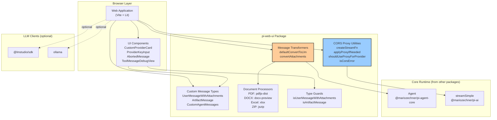
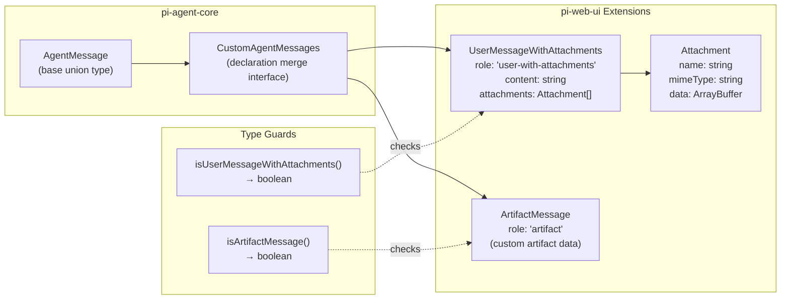
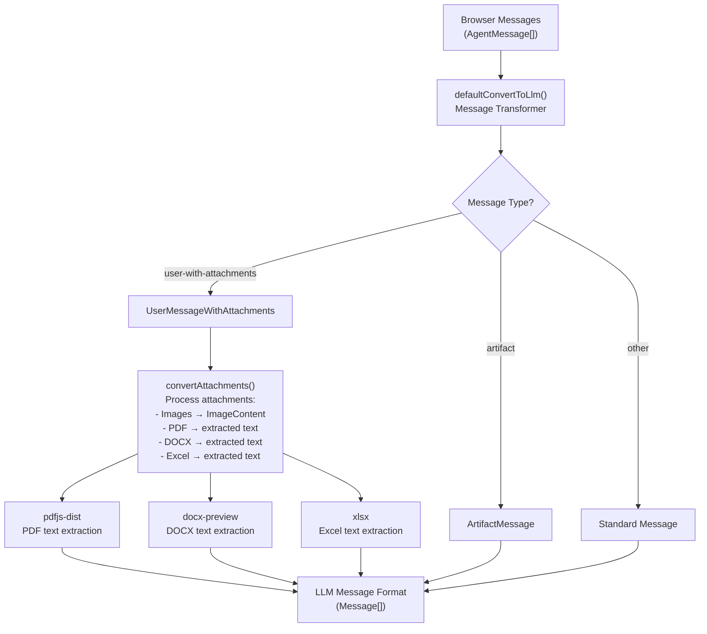
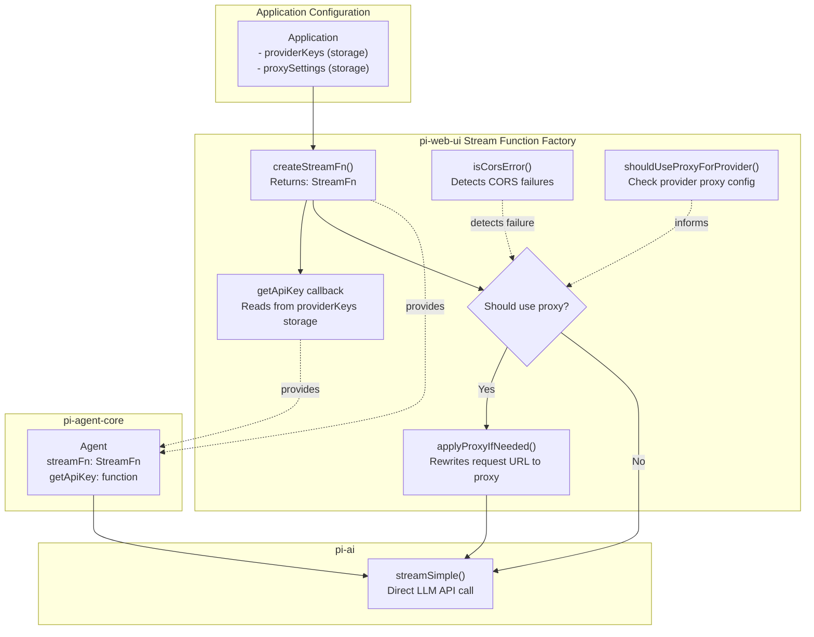
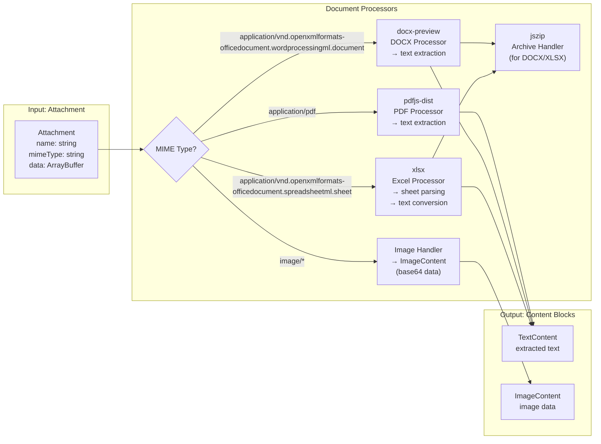
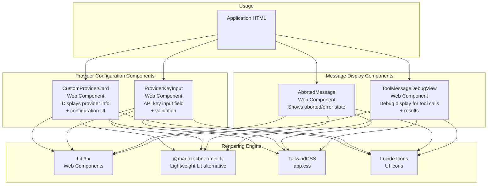
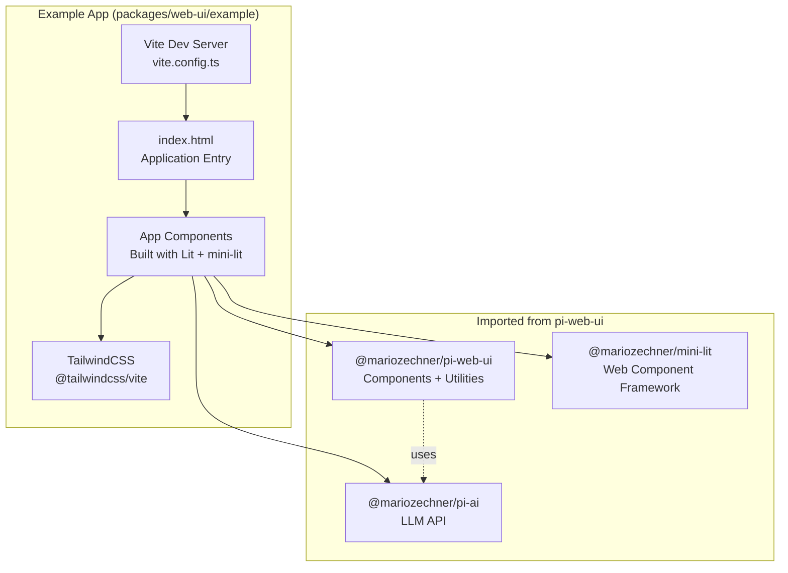
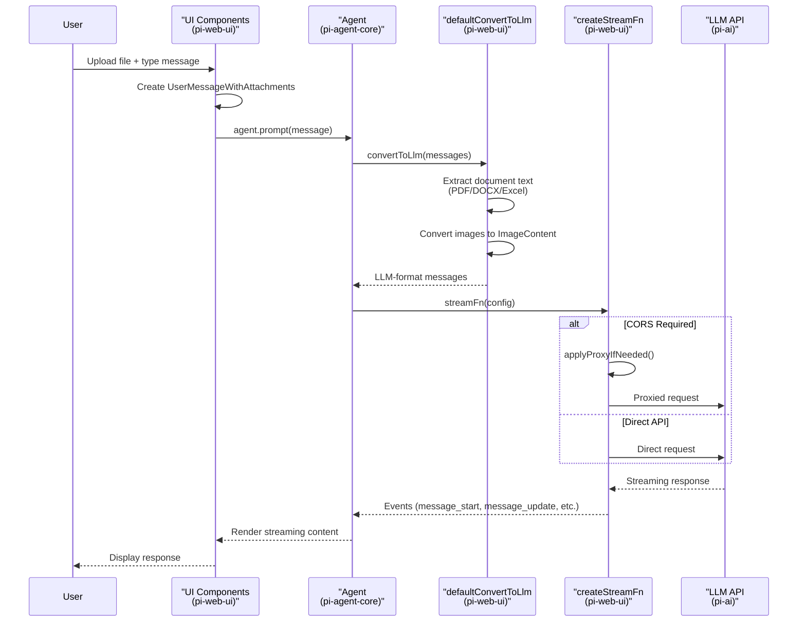

# pi-web-ui: Web UI Components

<details>
<summary>Relevant source files</summary>

The following files were used as context for generating this wiki page:

- [package-lock.json](package-lock.json)
- [packages/agent/CHANGELOG.md](packages/agent/CHANGELOG.md)
- [packages/agent/package.json](packages/agent/package.json)
- [packages/ai/CHANGELOG.md](packages/ai/CHANGELOG.md)
- [packages/ai/package.json](packages/ai/package.json)
- [packages/coding-agent/CHANGELOG.md](packages/coding-agent/CHANGELOG.md)
- [packages/coding-agent/package.json](packages/coding-agent/package.json)
- [packages/mom/CHANGELOG.md](packages/mom/CHANGELOG.md)
- [packages/mom/package.json](packages/mom/package.json)
- [packages/pods/package.json](packages/pods/package.json)
- [packages/tui/CHANGELOG.md](packages/tui/CHANGELOG.md)
- [packages/tui/package.json](packages/tui/package.json)
- [packages/web-ui/CHANGELOG.md](packages/web-ui/CHANGELOG.md)
- [packages/web-ui/example/package.json](packages/web-ui/example/package.json)
- [packages/web-ui/package.json](packages/web-ui/package.json)

</details>

This package provides reusable web components for building browser-based AI chat interfaces powered by the pi-ai LLM API. It handles attachment processing (images, PDFs, DOCX, Excel), CORS proxy configuration, custom message types, and provides pre-built UI components for chat applications.

For information about the underlying agent runtime, see [pi-agent-core: Agent Framework](#3). For LLM API integration details, see [pi-ai: LLM API Library](#2).

---

## Architecture and Dependencies

pi-web-ui sits between the browser UI layer and the core agent/LLM infrastructure, bridging the gap between user-facing components and backend AI services.

### Package Dependencies and Relationships



**Sources:** [packages/web-ui/package.json:1-51](), [packages/web-ui/CHANGELOG.md:203-289]()

---

## Custom Message Types

pi-web-ui extends the `AgentMessage` type system from pi-agent-core to support browser-specific message types for attachments and artifacts. Applications can further extend these types through declaration merging.

### Message Type Architecture



**Declaration Merging Pattern:**

Applications extend message types by declaring custom roles on the `CustomAgentMessages` interface:

```typescript
declare module '@mariozechner/pi-agent-core' {
  interface CustomAgentMessages {
    'user-with-attachments': UserMessageWithAttachments
    artifact: ArtifactMessage
  }
}
```

**Sources:** [packages/web-ui/CHANGELOG.md:209-289]()

---

## Message Transformation Pipeline

The `defaultConvertToLlm` function transforms browser-specific message types into the format expected by LLM APIs, handling attachment extraction and conversion.

### Message Conversion Flow



**Key Functions:**

| Function                       | Purpose                  | Input            | Output                           |
| ------------------------------ | ------------------------ | ---------------- | -------------------------------- |
| `defaultConvertToLlm`          | Main message transformer | `AgentMessage[]` | `Message[]` (LLM format)         |
| `convertAttachments`           | Process attachment array | `Attachment[]`   | `ContentBlock[]` (images + text) |
| `isUserMessageWithAttachments` | Type guard               | `AgentMessage`   | `boolean`                        |
| `isArtifactMessage`            | Type guard               | `AgentMessage`   | `boolean`                        |

**Sources:** [packages/web-ui/CHANGELOG.md:219-230](), [packages/web-ui/package.json:19-29]()

---

## Agent Integration and Stream Functions

pi-web-ui provides utilities for creating browser-compatible stream functions that integrate with the `Agent` class from pi-agent-core, including automatic CORS proxy handling.

### Stream Function Creation



**CORS Proxy Utilities:**

| Utility                       | Purpose                                                      |
| ----------------------------- | ------------------------------------------------------------ |
| `createStreamFn()`            | Factory that creates a `StreamFn` with dynamic proxy support |
| `applyProxyIfNeeded()`        | Rewrites API request URLs to route through CORS proxy        |
| `shouldUseProxyForProvider()` | Checks if a provider requires proxy in current config        |
| `isCorsError()`               | Type guard to detect CORS-related fetch failures             |

**Default Configuration:**

If not explicitly provided, `AgentInterface` (the UI layer wrapper around `Agent`) sets defaults:

- `streamFn`: Uses `createStreamFn()` with proxy settings from storage
- `getApiKey`: Reads API keys from `providerKeys` storage

**Sources:** [packages/web-ui/CHANGELOG.md:231-249]()

---

## Document Processing

pi-web-ui includes document processors that extract text content from various file formats for inclusion in LLM context. All processing happens client-side in the browser.

### Document Processing Architecture



**Supported Document Types:**

| Format | MIME Type                                                                 | Library        | Output               |
| ------ | ------------------------------------------------------------------------- | -------------- | -------------------- |
| PDF    | `application/pdf`                                                         | `pdfjs-dist`   | Extracted text       |
| DOCX   | `application/vnd.openxmlformats-officedocument.wordprocessingml.document` | `docx-preview` | Extracted text       |
| Excel  | `application/vnd.openxmlformats-officedocument.spreadsheetml.sheet`       | `xlsx`         | Sheet data as text   |
| Images | `image/*`                                                                 | (built-in)     | Base64-encoded image |

**Sources:** [packages/web-ui/package.json:19-29]()

---

## UI Components

pi-web-ui exports pre-built web components for common chat interface elements, built with Lit and mini-lit. These components are styled with Tailwind CSS and use Lucide icons.

### Exported Components



**Component Descriptions:**

| Component              | Purpose                     | Key Features                                           |
| ---------------------- | --------------------------- | ------------------------------------------------------ |
| `CustomProviderCard`   | Provider configuration card | Displays provider metadata, configuration options      |
| `ProviderKeyInput`     | API key input               | Secure input field with validation, save/clear actions |
| `AbortedMessage`       | Error display               | Shows aborted or failed assistant messages             |
| `ToolMessageDebugView` | Tool debugging              | Displays tool execution details for debugging          |

**Styling:**

The package exports `app.css` which contains compiled Tailwind CSS styles. Applications import this CSS along with the component modules:

```typescript
import '@mariozechner/pi-web-ui'
import '@mariozechner/pi-web-ui/app.css'
```

**Sources:** [packages/web-ui/CHANGELOG.md:93-96](), [packages/web-ui/package.json:1-51]()

---

## Example Application

The package includes a complete example application that demonstrates integration patterns for building a browser-based AI chat interface.

### Example Application Architecture



**Example App Stack:**

| Layer         | Technology                           | Purpose                         |
| ------------- | ------------------------------------ | ------------------------------- |
| Build Tool    | Vite                                 | Development server and bundling |
| UI Framework  | Lit 3.x + mini-lit                   | Web components                  |
| Styling       | Tailwind CSS (via @tailwindcss/vite) | CSS framework                   |
| Icons         | Lucide                               | Icon library                    |
| LLM API       | pi-ai                                | Multi-provider LLM integration  |
| UI Components | pi-web-ui                            | Chat interface components       |

**Sources:** [packages/web-ui/example/package.json:1-26](), [packages/web-ui/package.json:15-16]()

---

## Integration Example

Here's how applications typically integrate pi-web-ui components with the Agent runtime:

### Typical Integration Pattern



**Key Integration Points:**

1. **Message Creation**: UI creates `UserMessageWithAttachments` with file uploads
2. **Message Transformation**: `defaultConvertToLlm` handles document processing
3. **Stream Configuration**: `createStreamFn` manages CORS proxy logic
4. **Event Handling**: UI components listen to Agent events for real-time updates

**Sources:** [packages/web-ui/CHANGELOG.md:203-289]()

---

## Migration from 0.30.x

For applications upgrading from version 0.30.x, the major breaking change was the removal of the `Agent` class and transport abstractions from pi-web-ui (moved to pi-agent-core).

### Key Migration Changes

**Before (0.30.x):**

```typescript
import { Agent, ProviderTransport, type AppMessage } from '@mariozechner/pi-web-ui';

const agent = new Agent({
  transport: new ProviderTransport(),
  messageTransformer: (messages: AppMessage[]) => messages.filter(...)
});
```

**After (0.31.0+):**

```typescript
import { Agent, type AgentMessage } from '@mariozechner/pi-agent-core'
import { defaultConvertToLlm } from '@mariozechner/pi-web-ui'

const agent = new Agent({
  convertToLlm: (messages: AgentMessage[]) => {
    return defaultConvertToLlm(messages)
  },
})
// streamFn and getApiKey are set by AgentInterface defaults
```

**Custom Message Type Declaration Merging:**

```typescript
// Before
declare module '@mariozechner/pi-web-ui' {
  interface CustomMessages {
    'my-message': MyMessage
  }
}

// After
declare module '@mariozechner/pi-agent-core' {
  interface CustomAgentMessages {
    'my-message': MyMessage
  }
}
```

**Sources:** [packages/web-ui/CHANGELOG.md:249-289]()
