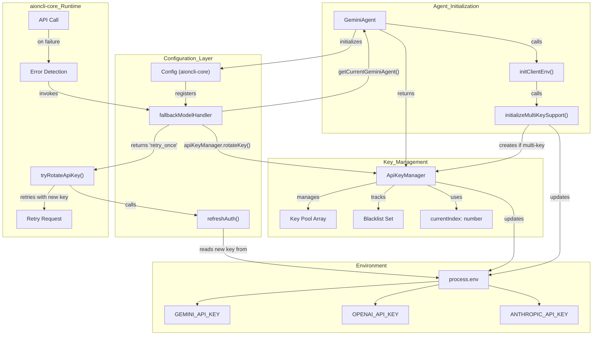
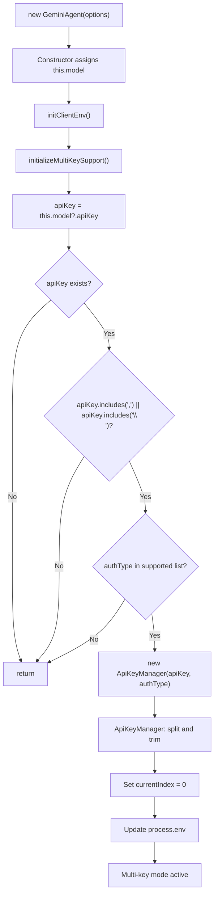
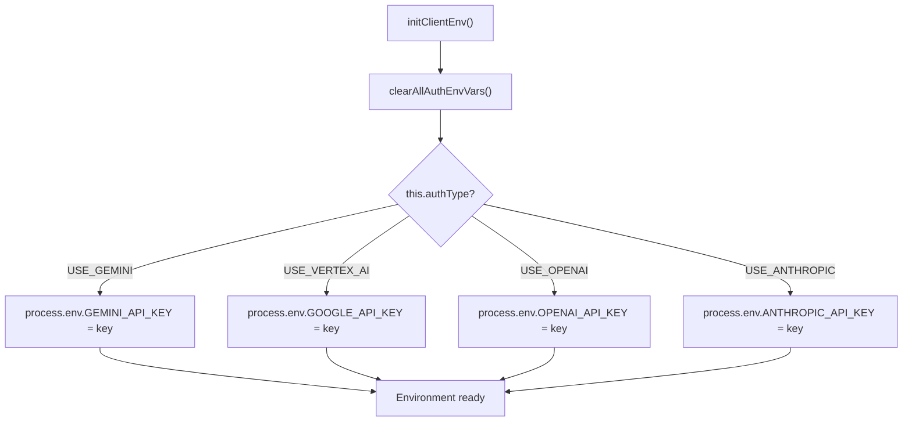

# API Key Rotation

<details>
<summary>Relevant source files</summary>

The following files were used as context for generating this wiki page:

- [src/common/utils/platformAuthType.ts](src/common/utils/platformAuthType.ts)

</details>


## Purpose and Scope

This document describes the API Key Rotation system in AionUi, which provides automatic failover across multiple API keys when quota errors or rate limits are encountered. The system detects quota exhaustion, rotates to an alternative API key, and retries the request automatically to maintain uninterrupted service.

The rotation mechanism is tightly integrated with `aioncli-core`'s `FallbackModelHandler` interface, which orchestrates the retry flow. This system primarily applies to API-key based authentication methods (`USE_GEMINI`, `USE_OPENAI`, `USE_ANTHROPIC`) and does not support OAuth or credential-based auth types like `USE_VERTEX_AI` or `LOGIN_WITH_GOOGLE` [src/common/utils/platformAuthType.ts:15-44]().

For model configuration and provider setup, see page 4.7. For stream error handling, see page 13.3.

---

## System Overview

The API Key Rotation system consists of three core components working together:

| Component | Responsibility | Location |
|-----------|---------------|----------|
| `ApiKeyManager` | Key pool management, rotation logic, blacklisting | `src/common/ApiKeyManager.ts` |
| `GeminiAgent.initializeMultiKeySupport()` | Multi-key detection and initialization | [src/agent/gemini/index.ts:257-267]() |
| `fallbackModelHandler` | Integration with aioncli-core retry system | [src/agent/gemini/cli/config.ts:295-332]() |

The system integrates with `aioncli-core`'s `FallbackModelHandler` mechanism, which is invoked when API calls fail. The handler rotates the API key by updating `process.env`, then signals `aioncli-core` to retry with the new credentials.

**Sources:** [src/agent/gemini/index.ts:257-267](), [src/agent/gemini/cli/config.ts:295-332]()

---

## Architecture

### Component Interaction Flow

The following diagram illustrates how the `GeminiAgent` coordinates with `ApiKeyManager` and the environment to handle key rotation.



**Sources:** [src/agent/gemini/index.ts:118-267](), [src/agent/gemini/cli/config.ts:295-335]()

---

## Key Management Flow

### Initialization and Multi-Key Detection

During `GeminiAgent` initialization, the system examines the `apiKey` field from the provider configuration to detect multiple keys. The `getProviderAuthType` utility is used to determine if the platform supports rotation [src/common/utils/platformAuthType.ts:54-76]().



**Key Detection Logic:**

The `initializeMultiKeySupport()` method at [src/agent/gemini/index.ts:257-267]() performs the following checks:

1. Extract `apiKey` from `this.model?.apiKey`.
2. Return early if key is missing or doesn't contain comma/newline.
3. Only create `ApiKeyManager` for supported auth types (`USE_OPENAI`, `USE_GEMINI`, `USE_ANTHROPIC`).
4. `ApiKeyManager` parses the key string and initializes the pool.

**Sources:** [src/agent/gemini/index.ts:118-267](), [src/common/utils/platformAuthType.ts:15-44]()

---

### Environment Variable Setup

After detecting multiple keys, `initClientEnv()` sets up environment variables based on the `AuthType` [src/common/utils/platformAuthType.ts:15-44]():



**getCurrentApiKey() Logic:**

The method at [src/agent/gemini/index.ts:164-169]() checks if multi-key mode is active:

```typescript
const getCurrentApiKey = () => {
  if (this.apiKeyManager && this.apiKeyManager.hasMultipleKeys()) {
    return process.env[this.apiKeyManager.getStatus().envKey] || this.model.apiKey;
  }
  return this.model.apiKey;
};
```

This ensures the current rotated key from `process.env` is used, with fallback to the original key.

**Sources:** [src/agent/gemini/index.ts:150-255](), [src/common/utils/platformAuthType.ts:54-76]()

---

## Integration with aioncli-core

### Fallback Model Handler

The `fallbackModelHandler` at [src/agent/gemini/cli/config.ts:295-332]() bridges the API key rotation system with aioncli-core's error recovery mechanism. It specifically handles errors by rotating keys via the `ApiKeyManager` and returning a retry intent.

**FallbackIntent Return Values:**

| Return Value | Condition | Effect on aioncli-core |
|--------------|-----------|----------------------|
| `'retry_once'` | `rotateKey()` returned `true` | Reset retry counter, call `refreshAuth()`, retry request |
| `'stop'` | No `apiKeyManager` or `rotateKey()` returned `false` | Stop retry attempts, propagate error |

**Global Registry Pattern:**

The handler uses `getCurrentGeminiAgent()` at [src/agent/gemini/index.ts:872-874]() to access the current agent instance. This global variable is set in the `GeminiAgent` constructor at [src/agent/gemini/index.ts:144-145]().

**Sources:** [src/agent/gemini/cli/config.ts:295-335](), [src/agent/gemini/index.ts:144-145](), [src/agent/gemini/index.ts:872-874]()

---

## Supported Authentication Types

The multi-key rotation system is only activated for API-key based authentication methods determined by `getAuthTypeFromPlatform` [src/common/utils/platformAuthType.ts:15-44]():

| Auth Type | Multi-Key Support | Environment Variable | Detection Logic |
|-----------|------------------|---------------------|-----------------|
| `AuthType.USE_GEMINI` | ✓ | `GEMINI_API_KEY` | [src/agent/gemini/index.ts:194-197]() |
| `AuthType.USE_OPENAI` | ✓ | `OPENAI_API_KEY` | [src/agent/gemini/index.ts:218-221]() |
| `AuthType.USE_ANTHROPIC` | ✓ | `ANTHROPIC_API_KEY` | [src/agent/gemini/index.ts:223-226]() |
| `AuthType.USE_VERTEX_AI` | ✗ | N/A | [src/agent/gemini/index.ts:199-202]() |
| `AuthType.LOGIN_WITH_GOOGLE` | ✗ | N/A | [src/agent/gemini/index.ts:204-216]() |

**Sources:** [src/agent/gemini/index.ts:150-267](), [src/common/utils/platformAuthType.ts:15-44]()

---

## Error Detection and Blacklisting

### Quota Error Detection

The system detects quota-related errors through the `enrichErrorMessage()` method at [src/agent/gemini/index.ts:281-298](). When keywords like `resource_exhausted` or `ratelimitexceeded` are found, the system identifies the need for rotation.

**Sources:** [src/agent/gemini/index.ts:281-298]()

---

### Blacklisting Mechanism

When `rotateKey()` is called, it blacklists the current failing key before searching for a replacement. Blacklisted keys are skipped in all subsequent rotation attempts within the session.

1. **On Error**: `rotateKey()` adds the current key to a blacklist Set.
2. **Search**: The system loops through the key pool to find the next key not in the blacklist.
3. **Exhaustion**: If all keys in the pool are blacklisted, the rotation returns `false`, and the agent stops retrying.

**Sources:** [src/agent/gemini/index.ts:257-267]() (logic implemented in `ApiKeyManager`)

---

## Configuration

### API Key Format

The `ApiKeyManager` accepts multiple API keys in two formats:

- **Comma-separated**: `key1,key2,key3`
- **Newline-separated**: 
  ```
  key1
  key2
  key3
  ```

The constructor cleans whitespace and filters empty strings to ensure a valid key pool.

**Sources:** [src/agent/gemini/index.ts:257-267]()