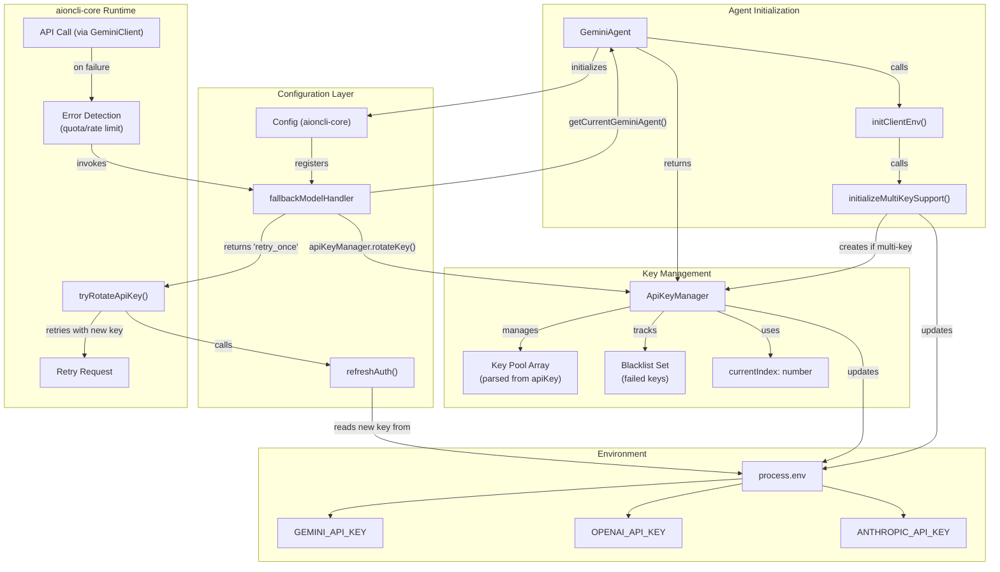
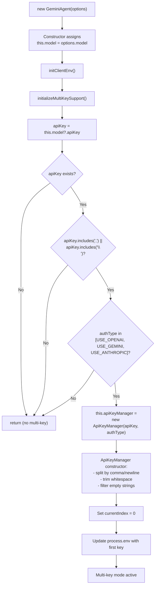
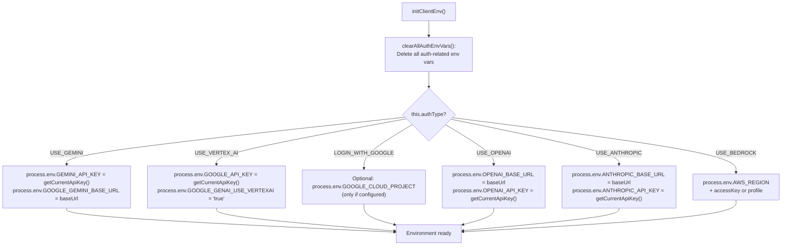
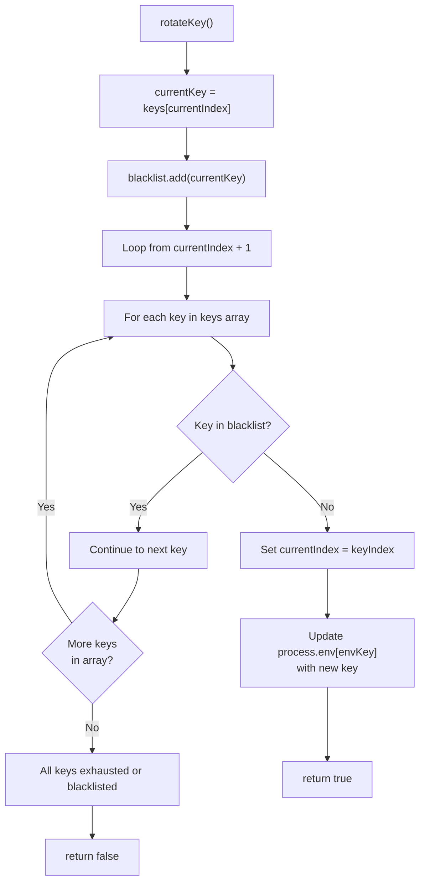
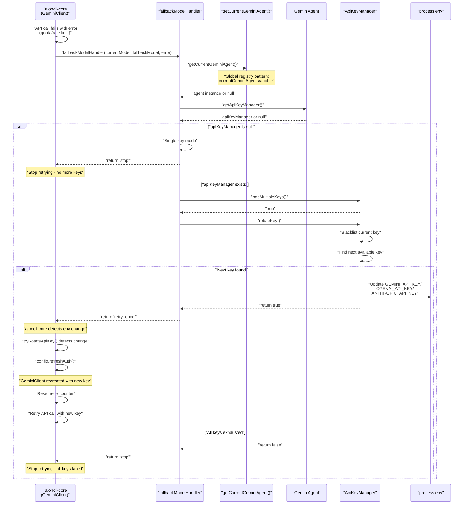
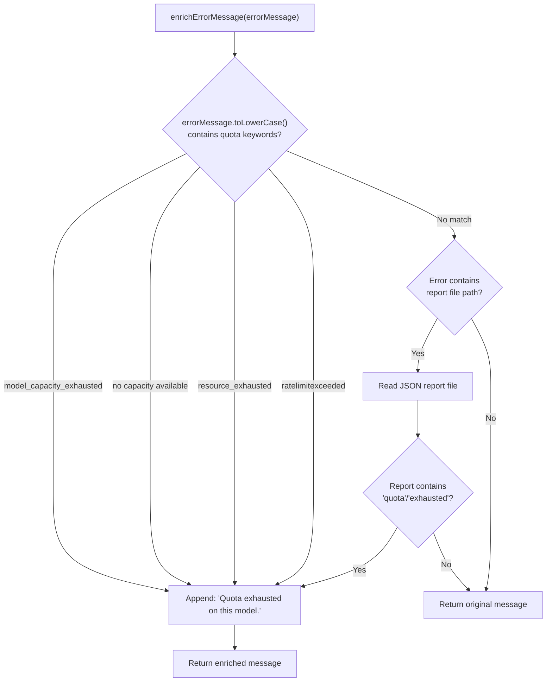
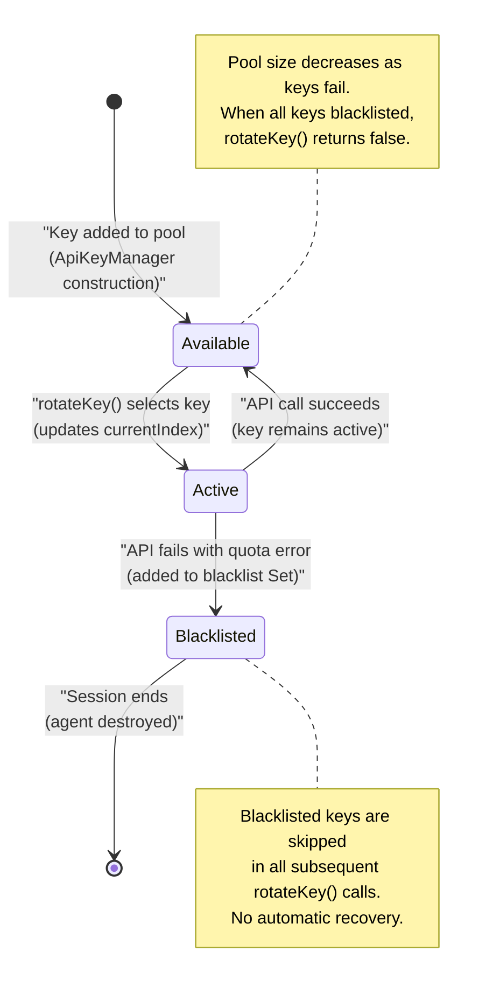
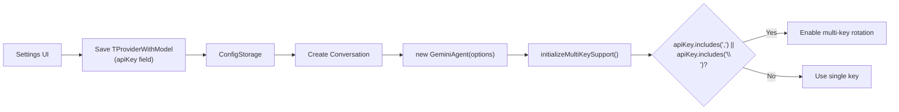

# API Key Rotation

<details>
<summary>Relevant source files</summary>

The following files were used as context for generating this wiki page:

- [src/agent/gemini/cli/atCommandProcessor.ts](src/agent/gemini/cli/atCommandProcessor.ts)
- [src/agent/gemini/cli/config.ts](src/agent/gemini/cli/config.ts)
- [src/agent/gemini/cli/errorParsing.ts](src/agent/gemini/cli/errorParsing.ts)
- [src/agent/gemini/cli/tools/web-fetch.ts](src/agent/gemini/cli/tools/web-fetch.ts)
- [src/agent/gemini/cli/tools/web-search.ts](src/agent/gemini/cli/tools/web-search.ts)
- [src/agent/gemini/cli/types.ts](src/agent/gemini/cli/types.ts)
- [src/agent/gemini/cli/useReactToolScheduler.ts](src/agent/gemini/cli/useReactToolScheduler.ts)
- [src/agent/gemini/index.ts](src/agent/gemini/index.ts)
- [src/agent/gemini/utils.ts](src/agent/gemini/utils.ts)
- [src/process/services/mcpServices/McpOAuthService.ts](src/process/services/mcpServices/McpOAuthService.ts)

</details>

## Purpose and Scope

This document describes the API Key Rotation system in AionUi, which provides automatic failover across multiple API keys when quota errors or rate limits are encountered. The system detects quota exhaustion, rotates to an alternative API key, and retries the request automatically to maintain uninterrupted service.

The rotation mechanism is tightly integrated with `aioncli-core`'s `FallbackModelHandler` interface, which orchestrates the retry flow. This system only applies to API-key based authentication methods (`USE_GEMINI`, `USE_OPENAI`, `USE_ANTHROPIC`) and does not support OAuth or credential-based auth types.

For model configuration and provider setup, see page 4.7. For stream error handling, see page 12.3.

---

## System Overview

The API Key Rotation system consists of three core components working together:

| Component                                 | Responsibility                                    | Location                                   |
| ----------------------------------------- | ------------------------------------------------- | ------------------------------------------ |
| `ApiKeyManager`                           | Key pool management, rotation logic, blacklisting | `src/common/ApiKeyManager.ts`              |
| `GeminiAgent.initializeMultiKeySupport()` | Multi-key detection and initialization            | [src/agent/gemini/index.ts:257-267]()      |
| `fallbackModelHandler`                    | Integration with aioncli-core retry system        | [src/agent/gemini/cli/config.ts:295-332]() |

The system integrates with `aioncli-core`'s `FallbackModelHandler` mechanism, which is invoked when API calls fail. The handler rotates the API key by updating `process.env`, then signals `aioncli-core` to retry with the new credentials.

**Sources:** [src/agent/gemini/index.ts:257-267](), [src/agent/gemini/cli/config.ts:295-332]()

---

## Architecture

### Component Interaction Flow



**Sources:** [src/agent/gemini/index.ts:118-267](), [src/agent/gemini/cli/config.ts:295-335]()

---

## Key Management Flow

### Initialization and Multi-Key Detection

During `GeminiAgent` initialization, the system examines the `apiKey` field from `TProviderWithModel` to detect multiple keys:



**Key Detection Logic:**

The `initializeMultiKeySupport()` method at [src/agent/gemini/index.ts:257-267]() performs the following checks:

1. Extract `apiKey` from `this.model?.apiKey`
2. Return early if key is missing or doesn't contain comma/newline
3. Only create `ApiKeyManager` for supported auth types
4. `ApiKeyManager` parses the key string and initializes the pool

**Sources:** [src/agent/gemini/index.ts:118-267]()

---

### Environment Variable Setup

After detecting multiple keys, `initClientEnv()` sets up environment variables for the current auth type:



**getCurrentApiKey() Logic:**

The method at [src/agent/gemini/index.ts:164-169]() checks if multi-key mode is active:

```typescript
const getCurrentApiKey = () => {
  if (this.apiKeyManager && this.apiKeyManager.hasMultipleKeys()) {
    return (
      process.env[this.apiKeyManager.getStatus().envKey] || this.model.apiKey
    )
  }
  return this.model.apiKey
}
```

This ensures the current rotated key from `process.env` is used, with fallback to the original key.

**Sources:** [src/agent/gemini/index.ts:150-255]()

---

### Key Rotation Algorithm

When `apiKeyManager.rotateKey()` is called, it implements the following algorithm:



**Environment Variable Mapping:**

| Auth Type                | Environment Variable | Used By                          |
| ------------------------ | -------------------- | -------------------------------- |
| `AuthType.USE_GEMINI`    | `GEMINI_API_KEY`     | `GeminiClient` from aioncli-core |
| `AuthType.USE_OPENAI`    | `OPENAI_API_KEY`     | OpenAI-compatible clients        |
| `AuthType.USE_ANTHROPIC` | `ANTHROPIC_API_KEY`  | Anthropic clients                |

The `envKey` is determined by the `authType` passed to `ApiKeyManager` during construction.

**Sources:** [src/agent/gemini/index.ts:257-267]() (references `ApiKeyManager.rotateKey()`)

---

## Integration with aioncli-core

### Fallback Model Handler

The `fallbackModelHandler` at [src/agent/gemini/cli/config.ts:295-332]() bridges the API key rotation system with aioncli-core's error recovery mechanism:



**FallbackIntent Return Values:**

| Return Value     | Condition                                            | Effect on aioncli-core                                   |
| ---------------- | ---------------------------------------------------- | -------------------------------------------------------- |
| `'retry_once'`   | `rotateKey()` returned `true`                        | Reset retry counter, call `refreshAuth()`, retry request |
| `'stop'`         | No `apiKeyManager` or `rotateKey()` returned `false` | Stop retry attempts, propagate error                     |
| `'retry_always'` | (Not used)                                           | Infinite retry loop                                      |
| `'retry_later'`  | (Not used)                                           | Defer retry                                              |
| `null`           | (Not used)                                           | Let aioncli-core use default logic                       |

**Global Registry Pattern:**

The handler uses `getCurrentGeminiAgent()` at [src/agent/gemini/index.ts:872-874]() to access the current agent instance:

```typescript
let currentGeminiAgent: GeminiAgent | null = null

export function getCurrentGeminiAgent(): GeminiAgent | null {
  return currentGeminiAgent
}
```

This global variable is set in the `GeminiAgent` constructor at [src/agent/gemini/index.ts:144-145]().

**Sources:** [src/agent/gemini/cli/config.ts:295-335](), [src/agent/gemini/index.ts:36-36](), [src/agent/gemini/index.ts:144-145](), [src/agent/gemini/index.ts:872-874]()

---

## Supported Authentication Types

The multi-key rotation system is only activated for API-key based authentication methods:

| Auth Type                    | Multi-Key Support | Environment Variable          | Detection Logic                       |
| ---------------------------- | ----------------- | ----------------------------- | ------------------------------------- |
| `AuthType.USE_GEMINI`        | ✓                 | `GEMINI_API_KEY`              | [src/agent/gemini/index.ts:194-197]() |
| `AuthType.USE_OPENAI`        | ✓                 | `OPENAI_API_KEY`              | [src/agent/gemini/index.ts:218-221]() |
| `AuthType.USE_ANTHROPIC`     | ✓                 | `ANTHROPIC_API_KEY`           | [src/agent/gemini/index.ts:223-226]() |
| `AuthType.USE_VERTEX_AI`     | ✗                 | (service account credentials) | [src/agent/gemini/index.ts:199-202]() |
| `AuthType.LOGIN_WITH_GOOGLE` | ✗                 | (OAuth token)                 | [src/agent/gemini/index.ts:204-216]() |
| `AuthType.USE_BEDROCK`       | ✗                 | (AWS IAM)                     | [src/agent/gemini/index.ts:228-254]() |

**Initialization Check:**

The `initializeMultiKeySupport()` method at [src/agent/gemini/index.ts:257-267]() only creates an `ApiKeyManager` when:

```typescript
if (
  this.authType === AuthType.USE_OPENAI ||
  this.authType === AuthType.USE_GEMINI ||
  this.authType === AuthType.USE_ANTHROPIC
) {
  this.apiKeyManager = new ApiKeyManager(apiKey, this.authType)
}
```

Other auth types like OAuth and IAM-based authentication bypass multi-key initialization.

**Sources:** [src/agent/gemini/index.ts:150-267]()

---

## Error Detection and Blacklisting

### Quota Error Detection

The system detects quota-related errors through the `enrichErrorMessage()` method at [src/agent/gemini/index.ts:281-298]():



**Detected Error Patterns:**

| Pattern                    | Source            | Meaning                |
| -------------------------- | ----------------- | ---------------------- |
| `model_capacity_exhausted` | API response      | Model quota exceeded   |
| `no capacity available`    | API response      | No available capacity  |
| `resource_exhausted`       | API response      | Resource limit reached |
| `ratelimitexceeded`        | API response      | Rate limit hit         |
| `quota` in report file     | Error report JSON | Quota issue logged     |

When these patterns are detected, the error is enriched with a user-friendly message indicating quota exhaustion.

**Sources:** [src/agent/gemini/index.ts:281-298]()

---

### Blacklisting Mechanism

When `rotateKey()` is called, it blacklists the current failing key before searching for a replacement:



**Blacklist Lifecycle:**

1. **Initialization**: Empty blacklist Set created in `ApiKeyManager` constructor
2. **On Error**: `rotateKey()` adds `keys[currentIndex]` to blacklist
3. **Search**: Loop skips any key found in blacklist Set
4. **Exhaustion**: If all keys are blacklisted, return `false`
5. **Session Scope**: Blacklist destroyed when agent/manager is garbage collected

**Sources:** Referenced behavior from [src/agent/gemini/index.ts:257-267]() (calls `ApiKeyManager.rotateKey()`)

---

## Configuration

### API Key Format

The `ApiKeyManager` accepts multiple API keys in two formats:

**Comma-separated:**

```
sk-proj-xxxxxxxxxxxxx,sk-proj-yyyyyyyyyyyyy,sk-proj-zzzzzzzzzzzzz
```

**Newline-separated:**

```
sk-proj-xxxxxxxxxxxxx
sk-proj-yyyyyyyyyyyyy
sk-proj-zzzzzzzzzzzzz
```

**Mixed format with whitespace (automatically cleaned):**

```
sk-proj-xxxxxxxxxxxxx  ,
  sk-proj-yyyyyyyyyyyyy,

sk-proj-zzzzzzzzzzzzz
```

The `ApiKeyManager` constructor splits by both comma and newline, trims whitespace, and filters empty strings.

**Sources:** Referenced from [src/agent/gemini/index.ts:257-267]()

---

### Configuration in UI

Users configure multiple keys through the settings interface:

**Model Configuration (ModeSettings):**

1. Navigate to Settings → Models
2. Select or add a platform (e.g., OpenAI, Gemini)
3. In the "API Key" field, enter keys separated by commas or newlines
4. Save configuration

**Detection:**

The system automatically detects multiple keys when creating a conversation:



**Sources:** Related to provider configuration in page 4.7

---

## Limitations and Trade-offs

### Current Limitations

| Limitation                | Impact                        | Workaround                 |
| ------------------------- | ----------------------------- | -------------------------- |
| No automatic key recovery | Blacklisted keys stay blocked | Restart conversation/agent |
| Session-scoped blacklist  | Good keys may be exhausted    | Use more keys or restart   |
| No key health monitoring  | Can't predict failures        | Monitor usage externally   |
| Synchronous rotation      | Brief latency on rotation     | Minimal impact (< 100ms)   |

### Trade-offs

**Performance vs Reliability:**

- Extra retry attempts increase latency
- But prevent request failures from temporary issues

**Memory vs Functionality:**

- Each rotating client maintains key pool and blacklist
- But shared `ApiKeyManager` reduces overhead

**Simplicity vs Features:**

- No automatic key recovery or health checks
- But simpler implementation and fewer edge cases

**Sources:** [src/common/RotatingApiClient.ts:128-160]()

---

## Related Systems

For related functionality, see:

- [Model Configuration & API Management](#4.6) - Platform and model configuration
- [Stream Resilience](#10.3) - Connection monitoring and invalid stream recovery
- [Build Retry Mechanism](#10.2) - Retry logic for build and deployment
- [Tool System Architecture](#4.4) - Image generation and web search tools
