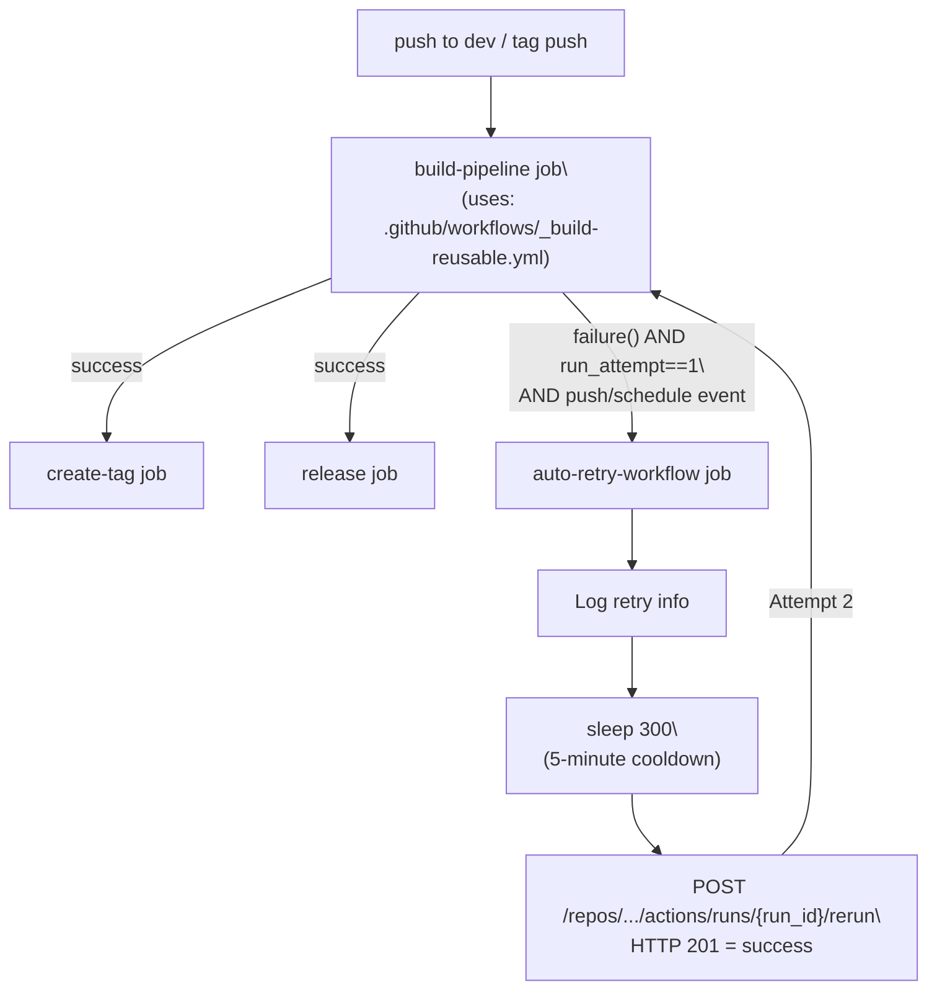
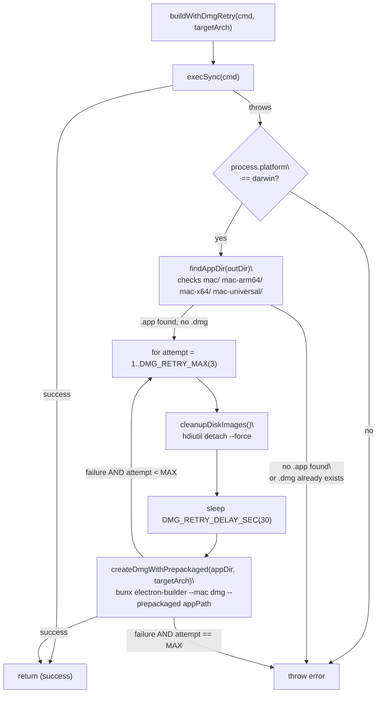

# Build Retry Mechanism

<details>
<summary>Relevant source files</summary>

The following files were used as context for generating this wiki page:

- [.github/workflows/build-and-release.yml](.github/workflows/build-and-release.yml)
- [electron-builder.yml](electron-builder.yml)
- [package.json](package.json)
- [resources/windows-installer-arm64.nsh](resources/windows-installer-arm64.nsh)
- [resources/windows-installer-x64.nsh](resources/windows-installer-x64.nsh)
- [scripts/build-with-builder.js](scripts/build-with-builder.js)

</details>

## Purpose and Scope

This document describes the automated retry mechanisms in AionUi's build and release pipeline for handling transient build failures. The system implements two independent tiers:

1. **Workflow-level retry** — the `auto-retry-workflow` GitHub Actions job triggers a full pipeline rerun after a 5-minute cooldown on first failure.
2. **Script-level DMG retry** — `buildWithDmgRetry()` in `scripts/build-with-builder.js` recovers from transient macOS `hdiutil` errors without rerunning the entire pipeline.

For the overall build pipeline structure see page 11.1 (Build Pipeline). For code signing and notarization details see page 11.4 (Code Signing & Notarization). For the two-phase build process see page 11.2 (Two-Phase Build Process).

---

## Retry Strategy Overview

| Failure Type                       | Detection Method                 | Retry Strategy                                  | Cooldown                | Max Attempts        |
| ---------------------------------- | -------------------------------- | ----------------------------------------------- | ----------------------- | ------------------- |
| **Any build pipeline failure**     | `needs: build-pipeline` result   | GitHub Actions full workflow rerun via API      | 5 minutes (`sleep 300`) | 2 total (1 retry)   |
| **DMG creation failure (hdiutil)** | `.app` exists but `.dmg` missing | `buildWithDmgRetry()` with `--prepackaged` flag | 30 seconds              | 3 (`DMG_RETRY_MAX`) |

Both tiers are designed to be non-recursive: the workflow retry gate is `github.run_attempt == 1` and the DMG loop has a hard cap of `DMG_RETRY_MAX`.

Sources: [.github/workflows/build-and-release.yml:38-91](), [scripts/build-with-builder.js:18-195]()

---

## Architecture

The two retry tiers operate at different scopes and are independent of each other.

**Retry Tier Relationships**



Sources: [.github/workflows/build-and-release.yml:18-91]()

---

**DMG Retry Logic inside `build-with-builder.js`**



Sources: [scripts/build-with-builder.js:108-195]()

---

## Workflow-Level Auto-Retry

### The `auto-retry-workflow` Job

This job is defined directly in `build-and-release.yml` alongside the main `build-pipeline` job. It triggers a complete workflow rerun when `build-pipeline` fails on the first attempt.

#### Job Definition Summary

| Property    | Value                                                                |
| ----------- | -------------------------------------------------------------------- |
| `runs-on`   | `ubuntu-latest`                                                      |
| `needs`     | `build-pipeline`                                                     |
| Condition   | `failure() && github.run_attempt == 1 && (push or schedule event)`   |
| Cooldown    | `sleep 300` (5 minutes)                                              |
| Rerun scope | Full workflow (`/actions/runs/{run_id}/rerun`), not just failed jobs |

Sources: [.github/workflows/build-and-release.yml:38-91]()

#### Trigger Conditions

The `if` expression on the job [.github/workflows/build-and-release.yml:43-46]() has three required conditions:

- `failure()` — `build-pipeline` must have failed
- `github.run_attempt == 1` — prevents infinite retry loops; only fires on the first failure
- `github.event_name == 'push' || github.event_name == 'schedule'` — skips manual reruns (which would already be attempt 2+)

#### Wait Step

The "Wait before retry" step [.github/workflows/build-and-release.yml:59-65]() runs `sleep 300`, applying a 5-minute cooldown before triggering the rerun. This handles transient runner resource issues or brief infrastructure outages.

#### Rerun Trigger Step

The "Trigger workflow rerun" step [.github/workflows/build-and-release.yml:67-91]() calls:

```
POST https://api.github.com/repos/{owner}/{repo}/actions/runs/{run_id}/rerun
```

using `GITHUB_TOKEN` for authorization. An HTTP `201` response confirms the rerun was scheduled. Any other status code causes the step to exit with code `1`, making the failure visible in the workflow UI.

> **Important:** The endpoint used is `/rerun` (full workflow), not `/rerun-failed-jobs`. This ensures the second attempt starts from a clean state rather than accumulating partial results.

Sources: [.github/workflows/build-and-release.yml:67-91]()

---

## DMG Retry Mechanism

### Script-Level Recovery in `build-with-builder.js`

GitHub Actions macOS runners occasionally produce transient `hdiutil` errors (e.g., "Device not configured") during DMG creation — specifically after the `.app` has already been packaged and signed. To avoid discarding a valid signed `.app`, the script detects this specific failure mode and retries only the DMG step.

This is tracked via constants [scripts/build-with-builder.js:24-25]():

- `DMG_RETRY_MAX = 3` — maximum retry attempts
- `DMG_RETRY_DELAY_SEC = 30` — seconds to wait between attempts

---

### Helper Functions

**`findAppDir(outDir)`** [scripts/build-with-builder.js:126-136]()

Searches the `out/` directory for sub-directories named `mac`, `mac-arm64`, `mac-x64`, or `mac-universal` that contain a `.app` bundle. Returns the path to the first match, or `null` if none found.

**`dmgExists(outDir)`** [scripts/build-with-builder.js:139-144]()

Returns `true` if any `.dmg` file already exists in `out/`.

**`cleanupDiskImages()`** [scripts/build-with-builder.js:108-123]()

Before each retry: runs `hdiutil info`, extracts `/dev/diskN` paths, and calls `hdiutil detach -force` on each. This releases stale mount points left by a failed prior DMG creation.

**`createDmgWithPrepackaged(appDir, targetArch)`** [scripts/build-with-builder.js:148-158]()

Runs:

```
bunx electron-builder --mac dmg --{targetArch} --prepackaged "{appPath}" --publish=never
```

The `--prepackaged` flag instructs electron-builder to skip the pack and sign phases and only create the DMG from the existing `.app`. DMG styling (window size, icon positions, UDZO format) is still read from `electron-builder.yml` [electron-builder.yml:129-146]().

> **Critical detail:** The path passed to `--prepackaged` must be the `.app` bundle itself (e.g. `out/mac-arm64/AionUi.app`), not its parent directory. `createDmgWithPrepackaged` resolves this by using `fs.readdirSync(appDir).find(f => f.endsWith('.app'))`.

**`buildWithDmgRetry(cmd, targetArch)`** [scripts/build-with-builder.js:160-195]()

The top-level entry point. Runs the full build command first; if it throws on macOS and the failure signature is `.app` present + `.dmg` absent, it enters the retry loop calling `cleanupDiskImages()`, `sleep`, and `createDmgWithPrepackaged()`. On non-macOS platforms or when the failure is unrelated, it re-throws immediately.

Sources: [scripts/build-with-builder.js:18-195](), [electron-builder.yml:117-146]()

---

## Configuration Reference

### Retry Parameters

| Parameter                   | File                                           | Value         | Purpose                       |
| --------------------------- | ---------------------------------------------- | ------------- | ----------------------------- |
| `DMG_RETRY_MAX`             | [scripts/build-with-builder.js:24]()           | `3`           | Maximum DMG creation attempts |
| `DMG_RETRY_DELAY_SEC`       | [scripts/build-with-builder.js:25]()           | `30`          | Seconds between DMG retries   |
| Workflow cooldown (`sleep`) | [.github/workflows/build-and-release.yml:63]() | `300` (5 min) | Wait before triggering rerun  |
| `github.run_attempt` guard  | [.github/workflows/build-and-release.yml:45]() | `== 1`        | Prevents infinite retry loops |

Sources: [scripts/build-with-builder.js:24-25](), [.github/workflows/build-and-release.yml:43-46](), [.github/workflows/build-and-release.yml:59-65]()

---

## Integration with Build Pipeline

### Matrix Build Strategy

The `build-pipeline` job delegates all platform-specific work to the reusable workflow `_build-reusable.yml` via the `uses:` key. The matrix passed to it covers five build targets [.github/workflows/build-and-release.yml:26-32]():

| `platform`      | `os`            | `command`                                   | `artifact-name`       |
| --------------- | --------------- | ------------------------------------------- | --------------------- |
| `macos-arm64`   | `macos-14`      | `build-with-builder.js arm64 --mac --arm64` | `macos-build-arm64`   |
| `macos-x64`     | `macos-14`      | `build-with-builder.js x64 --mac --x64`     | `macos-build-x64`     |
| `windows-x64`   | `windows-2022`  | `build-with-builder.js x64 --win --x64`     | `windows-build-x64`   |
| `windows-arm64` | `windows-2022`  | `build-with-builder.js arm64 --win --arm64` | `windows-build-arm64` |
| `linux`         | `ubuntu-latest` | `bun run dist:linux`                        | `linux-build`         |

The `auto-retry-workflow` job watches the aggregate result of `build-pipeline` (which covers all matrix entries). If any matrix entry fails and the conditions are met, the full workflow — including all matrix jobs — is rerun.

Sources: [.github/workflows/build-and-release.yml:19-34](), [.github/workflows/build-and-release.yml:38-46]()

---

## Known Issues and Limitations

### Apple Notarization Bottleneck

- **First-time notarization** can take 1-24 hours
- **Subsequent builds** with same bundle ID are faster
- The 1-hour wait is a compromise between wait time and success rate

### hdiutil Transient Errors

Common errors on GitHub Actions macOS runners:

- `Device not configured` - stale disk image mounts
- `Resource busy` - concurrent disk operations
- `Operation not permitted` - file system race conditions

The cleanup + retry strategy mitigates but doesn't eliminate these issues.

### Workflow Retry Limitations

- Only retries once (`github.run_attempt == 1`)
- No retry for manual workflow runs
- Cannot selectively retry individual matrix jobs

**Sources:** [.github/workflows/build-and-release.yml:495](), [scripts/build-with-builder.js:22-37]()
