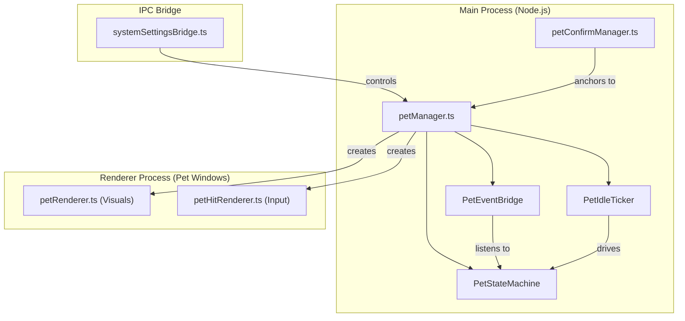
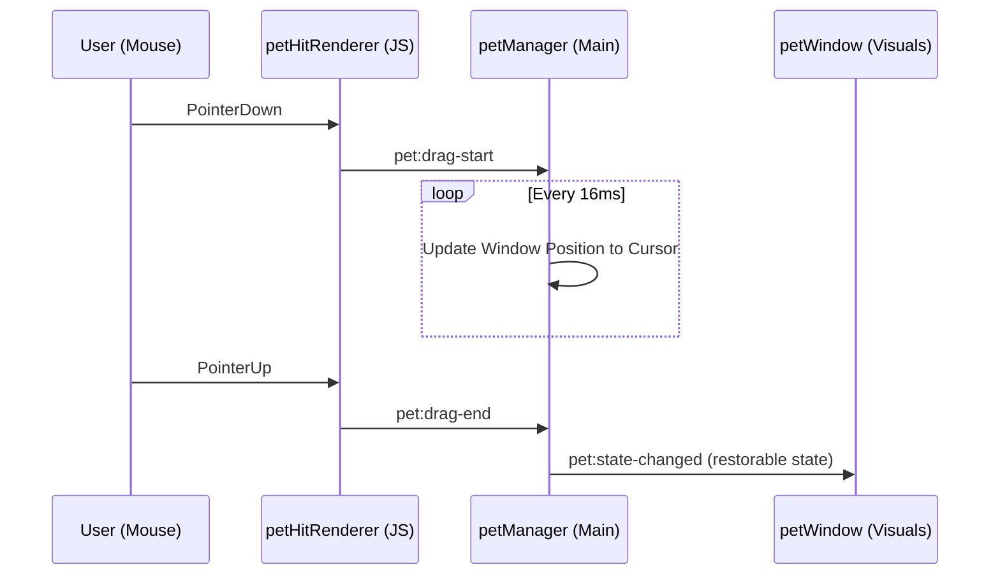

# Desktop Pet Feature

Relevant source files

The following files were used as context for generating this wiki page:

- [public/pet-states/done.svg](public/pet-states/done.svg)
- [public/pet-states/idle.svg](public/pet-states/idle.svg)
- [public/pet-states/preview.html](public/pet-states/preview.html)
- [src/process/bridge/systemSettingsBridge.ts](src/process/bridge/systemSettingsBridge.ts)
- [src/process/pet/petEventBridge.ts](src/process/pet/petEventBridge.ts)
- [src/process/pet/petIdleTicker.ts](src/process/pet/petIdleTicker.ts)
- [src/process/pet/petManager.ts](src/process/pet/petManager.ts)
- [src/process/pet/petTypes.ts](src/process/pet/petTypes.ts)
- [src/renderer/pages/settings/PetSettings.tsx](src/renderer/pages/settings/PetSettings.tsx)
- [src/renderer/pages/settings/components/SettingsSider.tsx](src/renderer/pages/settings/components/SettingsSider.tsx)
- [src/renderer/pet/pet.html](src/renderer/pet/pet.html)
- [src/renderer/pet/petHitRenderer.ts](src/renderer/pet/petHitRenderer.ts)
- [src/renderer/pet/petRenderer.ts](src/renderer/pet/petRenderer.ts)
- [src/renderer/services/i18n/locales/en-US/pet.json](src/renderer/services/i18n/locales/en-US/pet.json)
- [src/renderer/services/i18n/locales/ja-JP/pet.json](src/renderer/services/i18n/locales/ja-JP/pet.json)
- [src/renderer/services/i18n/locales/ko-KR/pet.json](src/renderer/services/i18n/locales/ko-KR/pet.json)
- [src/renderer/services/i18n/locales/tr-TR/pet.json](src/renderer/services/i18n/locales/tr-TR/pet.json)
- [src/renderer/services/i18n/locales/zh-CN/pet.json](src/renderer/services/i18n/locales/zh-CN/pet.json)
- [src/renderer/services/i18n/locales/zh-TW/pet.json](src/renderer/services/i18n/locales/zh-TW/pet.json)
- [tests/unit/process/pet/petEventBridge.test.ts](tests/unit/process/pet/petEventBridge.test.ts)
- [tests/unit/process/pet/petManager.test.ts](tests/unit/process/pet/petManager.test.ts)

The Desktop Pet is a standalone visual assistant subsystem in AionUi that provides real-time feedback on AI activities (thinking, working, completion) and user interaction through an animated character. It is implemented using a dual-window Electron architecture to balance high-quality SVG animations with precise click-through hit detection.

## System Architecture

The feature is managed by the `petManager` in the main process, which orchestrates the lifecycle of two specialized `BrowserWindow` instances.

### Dual-Window Design
To achieve a "floating" pet that doesn't interfere with other desktop applications while remaining interactive, the system splits rendering and interaction:

1.  **Rendering Window (`petWindow`)**: A transparent, `alwaysOnTop` window that displays the SVG animations. It ignores all mouse events (`setIgnoreMouseEvents(true)`) to ensure it never blocks the user's cursor [src/process/pet/petManager.ts:110-135]().
2.  **Hit Detection Window (`petHitWindow`)**: A smaller window (60% of pet size) positioned over the pet's body. It manages click-through logic, dragging, and context menus [src/process/pet/petManager.ts:141-166]().

### Component Relationship Diagram
This diagram maps the natural language concepts to the specific code entities that implement them.

**Sources:** [src/process/pet/petManager.ts:42-46](), [src/process/pet/petManager.ts:169-171](), [src/process/bridge/systemSettingsBridge.ts:142-159]().

---

## Key Subsystems

### 1. Pet Manager & Lifecycle
The `petManager` handles window creation, positioning, and cleanup. It checks for environment compatibility (e.g., disabling on headless Linux) before initialization [src/process/pet/petManager.ts:27-35]().

*   **`createPetWindow()`**: Initializes both windows, sets them to `screen-saver` level on macOS or `pop-up-menu` on other platforms, and starts the state machine [src/process/pet/petManager.ts:95-195]().
*   **`destroyPetWindow()`**: Safely closes windows and nullifies the `eventBridge` and `idleTicker` [src/process/pet/petManager.ts:223-240]().

### 2. Idle Ticker & Eye Tracking
The `PetIdleTicker` generates procedural "life" for the pet when no AI activity is occurring.
*   **Eye Movement**: It calculates `eyeDx` and `eyeDy` to simulate the pet looking around or following the cursor [src/process/pet/petManager.ts:179-183]().
*   **Procedural Animation**: The `petRenderer.ts` applies these coordinates to specific SVG groups (`.idle-pupil` and `.idle-track`) using `setAttribute('transform', ...)` to avoid fighting with CSS-based breathing animations [src/renderer/pet/petRenderer.ts:89-109]().

### 3. Event Bridge & State Machine
The `PetEventBridge` connects the pet to the rest of the application's events (e.g., agent thinking, tool execution, task completion).
*   **`handleBridgeMessage`**: Translates system-wide events into pet states like `thinking`, `working`, or `notification` [src/process/pet/petManager.ts:187-191]().
*   **`PetStateMachine`**: Manages the current visual state and transitions. When the state changes, it notifies the renderer to swap the SVG asset [src/process/pet/petManager.ts:173-177]().

---

## Interaction & Rendering

### SVG State Animations
The pet uses high-performance SVG files with embedded CSS keyframe animations for effects like breathing, swaying, and blinking [public/pet-states/idle.svg:4-33]().

| State | Asset | Description |
| :--- | :--- | :--- |
| **Idle** | `idle.svg` | Default state with breathing and eye tracking. |
| **Thinking** | `thinking.svg` | Triggered when AI is generating a response. |
| **Working** | `working.svg` | Triggered during tool/MCP execution. |
| **Done** | `done.svg` | Temporary state upon task completion. |

**Cross-fading**: The `petRenderer.ts` implements a "flash-free" transition by creating a new `<object>` element, waiting for it to load, and then cross-fading the opacity over 150ms before removing the old element [src/renderer/pet/petRenderer.ts:23-71]().

### Interaction Logic (`petHitRenderer.ts`)
The hit window manages complex mouse interactions to prevent the pet from "trapping" the user's cursor.

*   **Click-through Watchdog**: A multi-layered defense system ensures the window ignores mouse events whenever the cursor is outside the circular hit region [src/renderer/pet/petHitRenderer.ts:84-140]().
*   **Dragging**: Implements a 60 FPS follow-timer in the main process. If the renderer fails to send a `drag-end` signal (e.g., due to lost pointer capture), a 8-second watchdog force-terminates the drag [src/process/pet/petManager.ts:54-62]().

**Sources:** [src/renderer/pet/petHitRenderer.ts:29-46](), [src/process/pet/petManager.ts:54-62](), [src/process/pet/petManager.ts:173-177]().

---

## Configuration & Settings

Users can customize the pet via the **Pet Settings** page [src/renderer/pages/settings/PetSettings.tsx:17]().

*   **Pet Size**: Supports Small (200px), Medium (280px), and Large (360px). Changing this triggers `resizePetWindow` which updates both the rendering and hit detection bounds [src/process/bridge/systemSettingsBridge.ts:161-170]().
*   **Do Not Disturb (DND)**: When enabled, the pet ignores all AI events and remains in the idle state [src/process/bridge/systemSettingsBridge.ts:172-181]().
*   **Confirmation Bubbles**: Controls whether AI tool-call authorization requests are routed to a bubble window next to the pet or stay in the main chat [src/process/bridge/systemSettingsBridge.ts:185-195]().

**Sources:** [src/renderer/pages/settings/PetSettings.tsx:102-131](), [src/process/bridge/systemSettingsBridge.ts:141-195]().