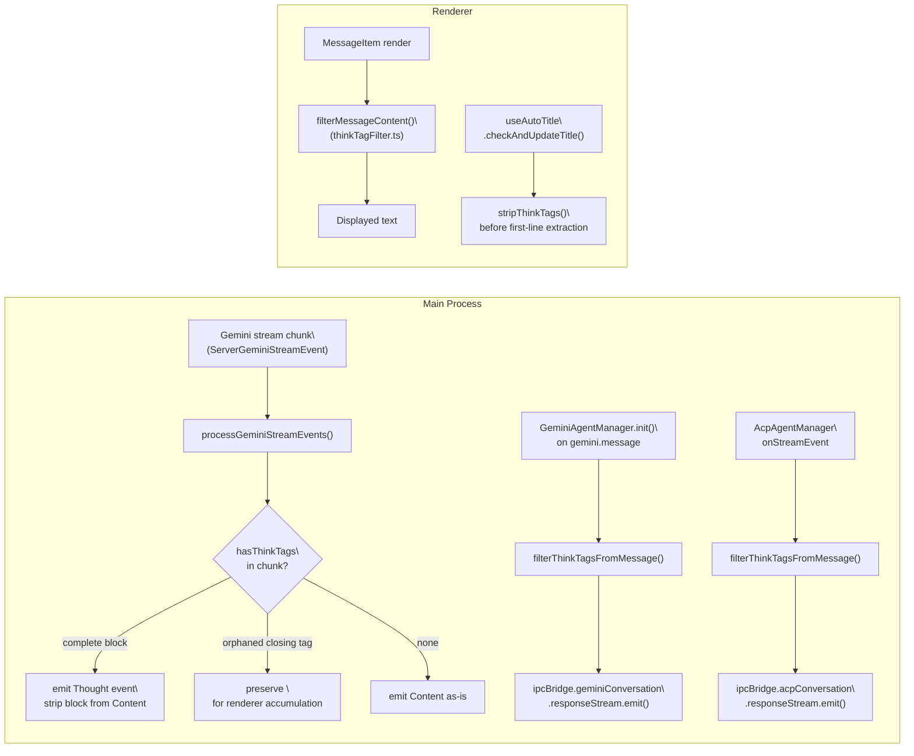
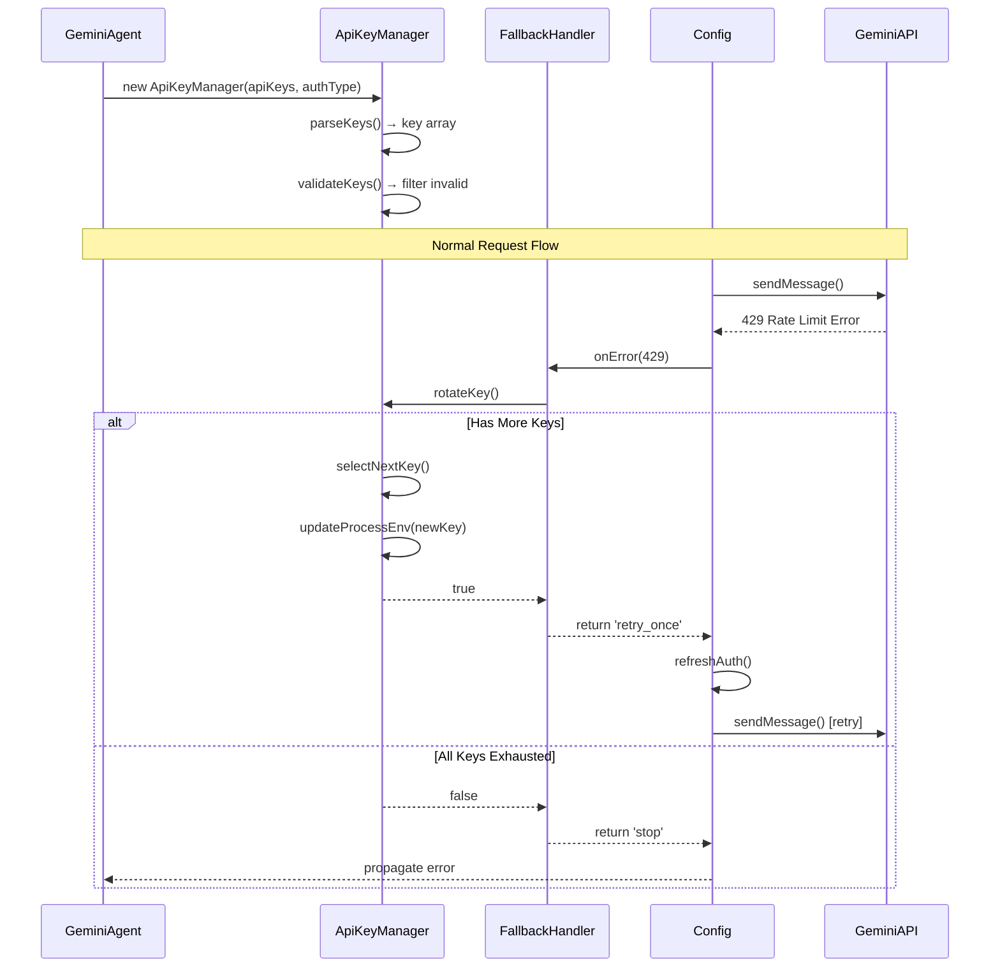
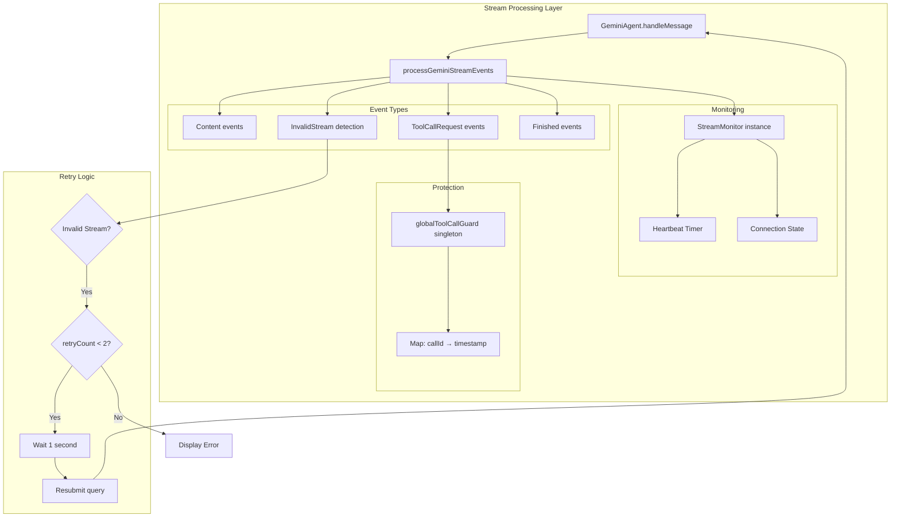
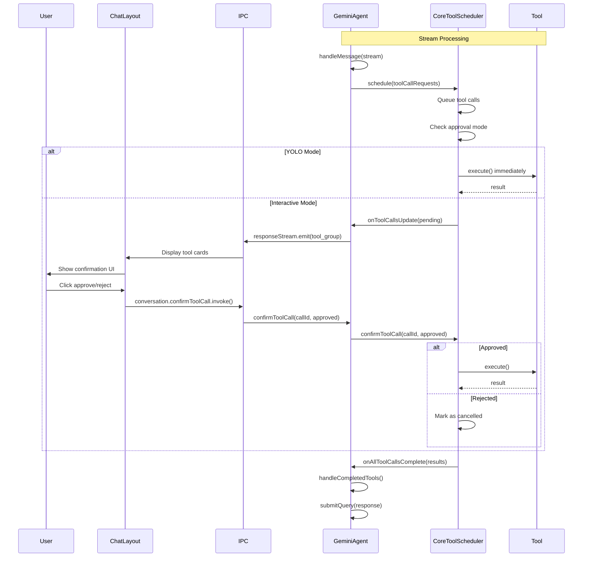
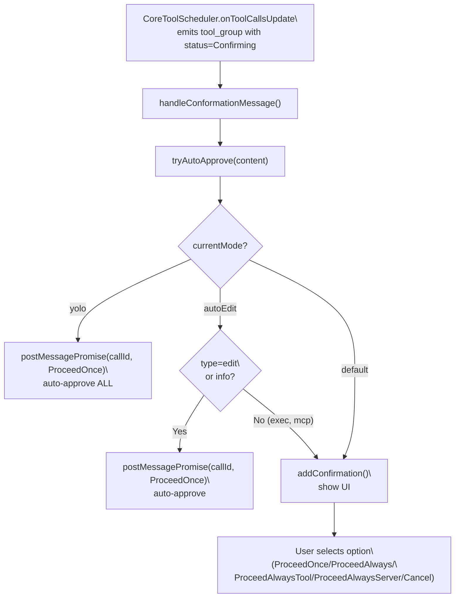

# Advanced Topics

<details>
<summary>Relevant source files</summary>

The following files were used as context for generating this wiki page:

- [src/agent/gemini/cli/atCommandProcessor.ts](src/agent/gemini/cli/atCommandProcessor.ts)
- [src/agent/gemini/cli/config.ts](src/agent/gemini/cli/config.ts)
- [src/agent/gemini/cli/errorParsing.ts](src/agent/gemini/cli/errorParsing.ts)
- [src/agent/gemini/cli/tools/web-fetch.ts](src/agent/gemini/cli/tools/web-fetch.ts)
- [src/agent/gemini/cli/tools/web-search.ts](src/agent/gemini/cli/tools/web-search.ts)
- [src/agent/gemini/cli/types.ts](src/agent/gemini/cli/types.ts)
- [src/agent/gemini/cli/useReactToolScheduler.ts](src/agent/gemini/cli/useReactToolScheduler.ts)
- [src/agent/gemini/index.ts](src/agent/gemini/index.ts)
- [src/agent/gemini/utils.ts](src/agent/gemini/utils.ts)
- [src/process/services/mcpServices/McpOAuthService.ts](src/process/services/mcpServices/McpOAuthService.ts)

</details>

This page covers advanced architectural patterns, optimization techniques, and specialized resilience features implemented in AionUi. These systems address production challenges including API rate limits, network unreliability, build environment instability, and user interaction complexity. The topics documented here represent cross-cutting concerns that span multiple agent types and operational modes.

For basic agent architecture and communication patterns, see [AI Agent Systems](#4). For build configuration fundamentals, see [Build & Deployment](#11).

---

## Overview of Advanced Systems

AionUi implements four primary categories of advanced patterns:

| System                    | Purpose                                                           | Key Components                                                 |
| ------------------------- | ----------------------------------------------------------------- | -------------------------------------------------------------- |
| **API Key Rotation**      | Automatic failover across multiple API keys to handle rate limits | `ApiKeyManager`, fallback handler                              |
| **Build Retry Mechanism** | Automatic retry of failed builds with exponential backoff         | GitHub Actions workflow, notarization retry                    |
| **Stream Resilience**     | Detection and recovery from invalid/stale streaming connections   | `StreamMonitor`, `globalToolCallGuard`                         |
| **Permission System**     | User approval flow for tool execution with timeout handling       | `CoreToolScheduler`, `GeminiApprovalStore`, `AcpApprovalStore` |
| **Think Tag Filtering**   | Strip ``and`<thinking>…</thinking>` blocks                        |

2. Handle MiniMax M2.5–style orphaned closing tags: content before the first `</think>` is treated as hidden reasoning and removed entirely
3. Remove any remaining orphaned opening or closing tags
4. Collapse excess newlines and trim whitespace

`hasThinkTags()` uses a single regex `/<\s*\/?\s*think(?:ing)?\s*>/i` covering all variants (both open/close, with optional spaces, case-insensitive).

Sources: [src/process/task/ThinkTagDetector.ts:26-64](), [src/renderer/utils/thinkTagFilter.ts:18-55]()

### Application Points

**Diagram: Think Tag Filtering in the Message Pipeline**



| Location                                        | Function                | Scope                                           |
| ----------------------------------------------- | ----------------------- | ----------------------------------------------- |
| `processGeminiStreamEvents`                     | Per-chunk, inline       | Gemini streaming only                           |
| `GeminiAgentManager.filterThinkTagsFromMessage` | Before IPC emit         | All Gemini messages                             |
| `AcpAgentManager.filterThinkTagsFromMessage`    | Before IPC emit         | All ACP messages                                |
| `filterMessageContent` (renderer)               | At render time          | Historical messages saved before filter existed |
| `useAutoTitle.checkAndUpdateTitle`              | Before title extraction | Conversation auto-naming                        |

Sources: [src/agent/gemini/utils.ts:104-148](), [src/process/task/GeminiAgentManager.ts:554-556](), [src/process/task/AcpAgentManager.ts:215-219](), [src/renderer/hooks/useAutoTitle.ts:14-22](), [src/renderer/utils/thinkTagFilter.ts:63-81]()

### Streaming Complexity

In streaming mode, thinking content may arrive across multiple chunks without enclosing tags. The handling differs by agent:

- **Gemini** (`processGeminiStreamEvents`): Processes per-chunk. Complete blocks are split into `Thought` + cleaned `Content` events. Orphaned `</think>` is deliberately kept in the emitted content; the renderer uses the accumulated text to detect and strip all preceding thinking content.
- **ACP/Codex** (`filterThinkTagsFromMessage` in managers): Applied after the ACP adapter has assembled message chunks, operating on the full accumulated text.

Sources: [src/agent/gemini/utils.ts:104-148](), [src/process/task/ThinkTagDetector.ts:39-64]()

---

## Permission & Confirmation System

- **Fail-fast validation** with graceful degradation
- **Automatic retry** with configurable limits
- **State tracking** to prevent duplicate operations
- **Observable patterns** for debugging and monitoring

---

## API Key Rotation Architecture

The API key rotation system enables uninterrupted service when individual API keys hit rate limits. It supports comma-separated or newline-separated key lists and automatically rotates through available keys when quota errors occur.

### Key Manager Design

**Diagram: API Key Rotation Flow**



**Sources:** [src/common/ApiKeyManager.ts:1-200](), [src/agent/gemini/index.ts:188-198](), [src/agent/gemini/cli/config.ts:290-323]()

### State Management

The `ApiKeyManager` class maintains:

| State Field       | Type          | Purpose                                         |
| ----------------- | ------------- | ----------------------------------------------- |
| `keys`            | `string[]`    | Parsed and validated API keys                   |
| `currentIndex`    | `number`      | Active key index                                |
| `blacklistedKeys` | `Set<string>` | Keys marked as invalid/exhausted                |
| `authType`        | `AuthType`    | Determines which env var to update              |
| `envKey`          | `string`      | Environment variable name for current auth type |

The rotation algorithm implements round-robin selection with blacklist filtering:

1. **Parse input**: Split by comma or newline, trim whitespace
2. **Validate**: Filter empty strings and duplicates
3. **Rotate**: Increment index, skip blacklisted keys
4. **Update environment**: Set appropriate env var (`GEMINI_API_KEY`, `OPENAI_API_KEY`, etc.)
5. **Trigger refresh**: Return control to `Config.refreshAuth()`

**Sources:** [src/common/ApiKeyManager.ts:30-100]()

### Integration with Agent Initialization

The multi-key support is initialized during agent construction if the API key contains delimiters:

```typescript
// From GeminiAgent constructor
private initializeMultiKeySupport(): void {
  const apiKey = this.model?.apiKey;
  if (!apiKey || (!apiKey.includes(',') && !apiKey.includes('\
'))) {
    return; // Single key or no key
  }

  if (this.authType === AuthType.USE_OPENAI ||
      this.authType === AuthType.USE_GEMINI ||
      this.authType === AuthType.USE_ANTHROPIC) {
    this.apiKeyManager = new ApiKeyManager(apiKey, this.authType);
  }
}
```

The fallback handler registered in [src/agent/gemini/cli/config.ts:290-323]() coordinates rotation with `Config.refreshAuth()` by returning `FallbackIntent` values:

- `'retry_once'`: Rotate succeeded, retry with new key
- `'stop'`: No more keys available, stop retrying
- `null`: Let built-in retry mechanism handle

**Sources:** [src/agent/gemini/index.ts:118-129](), [src/agent/gemini/index.ts:188-198](), [src/agent/gemini/cli/config.ts:274-325]()

---

## Build Retry Mechanism

The CI/CD pipeline implements sophisticated retry logic to handle transient failures in macOS code signing and notarization, which can take hours or fail due to Apple service congestion.

### Two-Phase Build System

**Diagram: Build Orchestration with Retry**

```mermaid
graph TB
    subgraph "GitHub Actions Workflow"
        Trigger[Push to main/dev]
        CodeQuality[code-quality job]
        BuildMatrix[build job matrix]

        subgraph "Build Job (per platform)"
            Setup[Setup: Node.js + Python]
            NativeRebuild[Rebuild Native Modules]
            ForgePackage[electron-forge package]
            BuilderDist[electron-builder dist]

            subgraph "Retry Wrapper (macOS only)"
                RetryAction[nick-fields/retry@v3]
                Attempt1[Attempt 1: 80 min timeout]
                Wait[Wait 5 min]
                Attempt2[Attempt 2: 80 min timeout]
            end

            AfterSign[afterSign.js: Notarization]
        end

        AutoRetry[auto-retry-workflow job]
        CreateTag[create-tag job]
        Release[release job]
    end

    Trigger --> CodeQuality
    CodeQuality --> BuildMatrix

    BuildMatrix --> Setup
    Setup --> NativeRebuild
    NativeRebuild --> ForgePackage
    ForgePackage --> BuilderDist

    BuilderDist --> RetryAction
    RetryAction --> Attempt1
    Attempt1 -->|Timeout/Fail| Wait
    Wait --> Attempt2
    Attempt1 -->|Success| AfterSign
    Attempt2 --> AfterSign

    AfterSign -->|Success| CreateTag
    AfterSign -->|Failure| AutoRetry

    AutoRetry -->|Sleep 1 hour| Trigger

    CreateTag --> Release
```

**Sources:** [.github/workflows/build-and-release.yml:1-641](), [scripts/build-with-builder.js:1-182]()

### Retry Strategy Configuration

The GitHub Actions workflow uses the `nick-fields/retry@v3` action with platform-specific configuration:

```yaml
# From .github/workflows/build-and-release.yml
- name: Build with electron-builder (non-Windows)
  uses: nick-fields/retry@v3
  with:
    timeout_minutes: 80
    max_attempts: 2
    retry_wait_seconds: 300
    continue_on_error: ${{ startsWith(matrix.platform, 'macos') }}
    command: ${{ matrix.command }}
    on_retry_command: |
      # Clean up stale disk images before retry (macOS)
      if [[ "$RUNNER_OS" == "macOS" ]]; then
        hdiutil info | grep '/dev/disk' | awk '{print $1}' | while read disk; do
          hdiutil detach "$disk" -force || true
        done
        rm -f /tmp/*.dmg || true
      fi
```

**Key retry parameters:**

| Parameter            | Value      | Rationale                                 |
| -------------------- | ---------- | ----------------------------------------- |
| `timeout_minutes`    | 80         | Apple notarization can take 30-60 minutes |
| `max_attempts`       | 2          | Balance between reliability and CI time   |
| `retry_wait_seconds` | 300        | 5 minutes for Apple services to stabilize |
| `continue_on_error`  | macOS only | Windows/Linux failures are fatal          |

**Sources:** [.github/workflows/build-and-release.yml:310-330]()

### Cleanup Between Retries

The `on_retry_command` hook performs critical cleanup to prevent "Device not configured" errors:

1. **Detach mounted disk images**: `hdiutil detach` all `/dev/disk*` devices
2. **Remove temporary DMG files**: Delete `/tmp/*.dmg` artifacts
3. **Clear keychain state**: Handled by separate cleanup step

This prevents accumulation of stale resources that cause subsequent build attempts to fail.

**Sources:** [.github/workflows/build-and-release.yml:319-329]()

### Automatic Workflow Re-run

The `auto-retry-workflow` job implements whole-workflow retry for first-time failures:

```yaml
auto-retry-workflow:
  name: Auto Retry on Build Failure
  needs: build
  if: |
    failure() &&
    github.run_attempt == 1 &&
    (github.event_name == 'push' || github.event_name == 'schedule')
  steps:
    - name: Wait before retry (1 hour for Apple notarization)
      run: sleep 3600

    - name: Trigger workflow rerun
      run: |
        curl -X POST \
          -H "Authorization: token ${{ secrets.GITHUB_TOKEN }}" \
          https://api.github.com/repos/${{ github.repository }}/actions/runs/${{ github.run_id }}/rerun
```

This pattern handles Apple's "first-time notarization can take days" behavior by:

- Waiting 1 hour for Apple backend processing
- Re-running entire workflow (not just failed jobs)
- Only triggering once (`github.run_attempt == 1`)

**Sources:** [.github/workflows/build-and-release.yml:440-497]()

---

## Stream Resilience System

The stream resilience system detects and recovers from invalid or stale streaming connections, which can occur due to proxy timeouts, model failures, or network issues.

### Connection Monitoring

**Diagram: Stream Resilience Components**



**Sources:** [src/agent/gemini/index.ts:392-514](), [src/agent/gemini/utils.ts:67-274](), [src/agent/gemini/cli/streamResilience.ts:1-300]()

### StreamMonitor Implementation

The `StreamMonitor` class tracks connection health with configurable thresholds:

```typescript
// Configuration from src/agent/gemini/cli/streamResilience.ts
export const DEFAULT_STREAM_RESILIENCE_CONFIG: StreamResilienceConfig = {
  heartbeatTimeoutMs: 90000, // 90 seconds
  maxInvalidStreamRetries: 2, // Max retry attempts
  invalidStreamRetryDelayMs: 1000, // 1 second delay
  enableHeartbeatMonitoring: true,
  enableInvalidStreamDetection: true,
}
```

The monitor operates in three states:

1. **Active**: Receiving events normally, heartbeat timer active
2. **Timeout**: No events for `heartbeatTimeoutMs`, emit warning
3. **Failed**: Error occurred, stop monitoring

**State transitions:**

```
  start() → Active
  recordEvent() → reset heartbeat timer
  isHeartbeatTimeout() → check elapsed time > threshold
  markFailed() → Failed state
  stop() → clear timers
```

**Sources:** [src/agent/gemini/cli/streamResilience.ts:100-250]()

### Tool Call Protection

The `globalToolCallGuard` singleton prevents tool call cancellation during stream recovery:

```typescript
class ToolCallGuard {
  private protectedCalls: Map<string, number> = new Map()

  protect(callId: string): void {
    this.protectedCalls.set(callId, Date.now())
  }

  unprotect(callId: string): void {
    this.protectedCalls.delete(callId)
  }

  isProtected(callId: string): boolean {
    return this.protectedCalls.has(callId)
  }
}

export const globalToolCallGuard = new ToolCallGuard()
```

Tool calls are protected immediately when requested:

```typescript
// From handleMessage in GeminiAgent
if (data.type === 'tool_call_request') {
  const toolRequest = data.data as ToolCallRequestInfo
  toolCallRequests.push(toolRequest)
  globalToolCallGuard.protect(toolRequest.callId) // Immediate protection
  return
}
```

This prevents race conditions where:

1. Stream emits tool call request
2. Stream fails/retries before tool execution begins
3. Tool execution proceeds with protected call ID
4. Unprotect after completion or error

**Sources:** [src/agent/gemini/cli/streamResilience.ts:50-100](), [src/agent/gemini/index.ts:421-428]()

### Invalid Stream Detection and Retry

The `InvalidStream` event indicates the model returned empty or malformed responses. The system implements automatic retry with backoff:

```typescript
// From handleMessage
if (data.type === ('invalid_stream' as string)) {
  invalidStreamDetected = true
  const eventData = data.data as { message: string; retryable: boolean }

  if (
    eventData.retryable &&
    retryCount < MAX_INVALID_STREAM_RETRIES &&
    query &&
    !abortController.signal.aborted
  ) {
    this.onStreamEvent({
      type: 'info',
      data: `Stream interrupted, retrying... (${retryCount + 1}/${MAX_INVALID_STREAM_RETRIES})`,
      msg_id,
    })
  }
  return
}

// After stream completes
if (
  invalidStreamDetected &&
  retryCount < MAX_INVALID_STREAM_RETRIES &&
  query &&
  !abortController.signal.aborted
) {
  await new Promise((resolve) => setTimeout(resolve, RETRY_DELAY_MS))

  const prompt_id = this.config.getSessionId() + '########' + getPromptCount()
  const newStream = this.geminiClient.sendMessageStream(
    query,
    abortController.signal,
    prompt_id
  )
  return this.handleMessage(
    newStream,
    msg_id,
    abortController,
    query,
    retryCount + 1
  )
}
```

**Retry parameters:**

- `MAX_INVALID_STREAM_RETRIES = 2`
- `RETRY_DELAY_MS = 1000`

**Sources:** [src/agent/gemini/index.ts:433-475](), [src/agent/gemini/utils.ts:221-233]()

---

## Permission & Confirmation System

The permission system manages user approval for tool execution. It spans two agent backends — the Gemini agent (via `CoreToolScheduler` from `aioncli-core`) and ACP agents (via JSON-RPC `permission_request` notifications) — with a shared `IConfirmation` model used to drive the UI. Session-level "always allow" memory is provided by `GeminiApprovalStore` (Gemini) and `AcpApprovalStore` (ACP agents).

### Tool Scheduling Architecture

**Diagram: Tool Confirmation Flow**



**Sources:** [src/agent/gemini/index.ts:309-380](), [src/agent/gemini/index.ts:488-498]()

### Scheduler Configuration

The `CoreToolScheduler` is initialized in `GeminiAgent.initToolScheduler()` with callbacks:

```typescript
this.scheduler = new CoreToolScheduler({
  onAllToolCallsComplete: async (completedToolCalls: CompletedToolCall[]) => {
    // Refresh memory after tool execution
    await refreshServerHierarchicalMemory(this.config)

    // Build continuation message with tool results
    const response = handleCompletedTools(
      completedToolCalls,
      this.geminiClient,
      refreshMemory
    )

    if (response.length > 0) {
      // Submit tool results back to model
      this.submitQuery(response, msg_id, abortController, {
        isContinuation: true,
        prompt_id: toolCalls[0].request.prompt_id,
      })
    }
  },

  onToolCallsUpdate: (updatedCoreToolCalls: ToolCall[]) => {
    // Transform core tool calls to UI display format
    const display = mapToDisplay(toolCalls)
    this.onStreamEvent({
      type: 'tool_group',
      data: display.tools,
      msg_id: this.activeMsgId,
    })
  },

  config: this.config,
})
```

**Sources:** [src/agent/gemini/index.ts:309-380]()

### Tool Call State Tracking

The `TrackedToolCall` type extends `aioncli-core`'s `ToolCall` with UI state:

```typescript
interface TrackedToolCall extends ToolCall {
  responseSubmittedToGemini: boolean
}
```

Tool calls progress through states:

- `pending`: Awaiting user confirmation
- `approved`: User confirmed, execution in progress
- `success`: Completed successfully
- `error`: Failed during execution
- `cancelled`: User rejected or timeout

The `mapToDisplay()` function transforms tool calls for UI rendering:

```typescript
export function mapToDisplay(toolCalls: TrackedToolCall[]): {
  tools: DisplayToolCall[]
} {
  return {
    tools: toolCalls.map((tc) => ({
      callId: tc.request.callId,
      name: tc.request.name,
      args: tc.request.args,
      status: tc.status,
      result: tc.response?.result,
      error: tc.response?.error,
      // ... UI-specific fields
    })),
  }
}
```

**Sources:** [src/agent/gemini/cli/useReactToolScheduler.ts:1-200](), [src/agent/gemini/index.ts:349-372]()

### Confirmation IPC Bridge

The UI sends confirmation decisions through the IPC bridge:

```typescript
// From initBridge.ts
ipcBridge.conversation.confirmToolCall.provider(async (callId, approved) => {
  const task = WorkerManage.getTaskByConversationId(conversationId)
  if (!task) return

  const agent = task.worker.agent
  if ('confirmToolCall' in agent) {
    agent.confirmToolCall(callId, approved)
  }
})
```

The agent delegates to the scheduler:

```typescript
// In GeminiAgent
confirmToolCall(callId: string, approved: boolean): void {
  this.scheduler?.confirmToolCall(callId, approved);
}
```

The scheduler validates the call ID and updates state:

1. Check if call ID exists in pending queue
2. Update status to `approved` or `cancelled`
3. If approved, execute tool immediately
4. Emit `onToolCallsUpdate` with new state

**Sources:** [src/process/bridge/initBridge.ts:500-550](), [src/agent/gemini/index.ts:700-750]()

### Session Modes and Auto-Approval

`GeminiAgentManager` and `AcpAgentManager` each maintain a `currentMode` field that governs automatic approval behavior, bypassing the confirmation UI for categories of operations.

**Diagram: Session Mode Auto-Approval in GeminiAgentManager**



| Mode       | Auto-Approves                           | Requires Manual Confirmation       |
| ---------- | --------------------------------------- | ---------------------------------- |
| `default`  | Nothing                                 | All tool operations                |
| `autoEdit` | `edit` (file writes) and `info` (reads) | `exec` (shell commands), MCP tools |
| `yolo`     | Everything                              | Nothing                            |

Sources: [src/process/task/GeminiAgentManager.ts:449-468](), [src/process/task/GeminiAgentManager.ts:470-510]()

### GeminiApprovalStore: Always-Allow Memory

`GeminiApprovalStore` is a session-scoped in-memory store that remembers decisions made with `ProceedAlways`, `ProceedAlwaysTool`, and `ProceedAlwaysServer` outcomes. On subsequent matching confirmations within the same session, the store triggers auto-approval without showing UI.

- `ProceedAlways`: Approves the same root command (e.g., all `npm` invocations) for the session
- `ProceedAlwaysTool`: Approves a specific MCP tool from a specific server
- `ProceedAlwaysServer`: Approves all tools from a specific MCP server

The store instance is owned by `GeminiAgentManager.approvalStore` and is cleared when the conversation ends.

Sources: [src/agent/gemini/GeminiApprovalStore.ts](), [src/process/task/GeminiAgentManager.ts:74-74]()

### ACP Permission Flow

ACP backends (Claude, Qwen, CodeBuddy, etc.) emit `permission_request` via JSON-RPC while `session/prompt` is in flight. `AcpApprovalStore` provides equivalent "always allow" caching for these agents.

The end-to-end flow:

1. `AcpConnection.handlePermissionRequest()` receives the JSON-RPC notification
2. It calls `this.onPermissionRequest(params)` (registered by `AcpAgent`) and **pauses** all `session/prompt` timeouts
3. `AcpAgent` emits `acp_permission` via `onSignalEvent`
4. `AcpAgentManager.onSignalEvent` calls `addConfirmation()` to display the UI
5. User responds; `AcpAgent.confirmMessage(callId, optionId)` resolves the pending promise
6. `AcpConnection.handlePermissionRequest` sends the JSON-RPC response and **resumes** all `session/prompt` timeouts

Sources: [src/agent/acp/index.ts:101-115](), [src/process/task/AcpAgentManager.ts:237-261](), [src/agent/acp/AcpConnection.ts:850-880]()

---

## Cross-Cutting Patterns

Several design patterns appear across all advanced systems:

### Observable State Pattern

All systems emit events for external observation:

```typescript
// API Key Manager
getStatus(): ApiKeyStatus {
  return {
    totalKeys: this.keys.length,
    currentIndex: this.currentIndex,
    blacklistedCount: this.blacklistedKeys.size,
    hasMultipleKeys: this.hasMultipleKeys(),
    envKey: this.envKey,
  };
}

// Stream Monitor
onConnectionEvent?: (event: StreamConnectionEvent) => void;

// Tool Scheduler
onToolCallsUpdate: (toolCalls: ToolCall[]) => void;
```

This enables debugging, monitoring, and UI synchronization without tight coupling.

**Sources:** [src/common/ApiKeyManager.ts:150-200](), [src/agent/gemini/cli/streamResilience.ts:50-100]()

### Stateless Retry Logic

Retry mechanisms store minimal state and use closure-captured parameters:

```typescript
// Stream retry captures original query
if (invalidStreamDetected && retryCount < MAX_RETRIES) {
  const newStream = this.geminiClient.sendMessageStream(
    query, // Original query captured in closure
    abortController.signal,
    prompt_id
  )
  return this.handleMessage(
    newStream,
    msg_id,
    abortController,
    query,
    retryCount + 1
  )
}
```

This prevents state corruption from concurrent retries and simplifies cleanup.

**Sources:** [src/agent/gemini/index.ts:459-475]()

### Graceful Degradation

All systems provide fallback behavior when advanced features fail:

| System                    | Degradation Path                                              |
| ------------------------- | ------------------------------------------------------------- |
| API Key Rotation          | Return to single-key behavior if parsing fails                |
| Build Retry               | Mark build as warning, allow workflow to continue             |
| ACP Connection Resilience | Fall back to online npm resolution if offline cache is stale  |
| Stream Resilience         | Disable monitoring if timer allocation fails                  |
| Think Tag Filtering       | Pass content through unmodified if regex fails                |
| Confirmation System       | Fall back to `default` mode if session mode cannot be applied |

This ensures core functionality remains operational even when advanced features encounter errors.

**Sources:** [src/common/ApiKeyManager.ts:30-50](), [.github/workflows/build-and-release.yml:317-317](), [src/agent/gemini/cli/streamResilience.ts:120-140](), [src/agent/acp/AcpConnection.ts:231-263](), [src/process/task/ThinkTagDetector.ts:26-31]()

---

## Summary

The advanced systems in AionUi demonstrate production-ready patterns for handling:

1. **Resource exhaustion**: Multi-key rotation prevents service disruption from rate limits
2. **Network unreliability**: Stream monitoring detects and recovers from connection failures
3. **Platform instability**: Build retry handles transient Apple notarization delays
4. **User interaction**: Confirmation system balances safety with automation

These systems share common design principles (observable state, stateless retry, graceful degradation) that make them maintainable and testable. Each subsystem is documented in detail in the child pages of this section.

**Sources:** [src/common/ApiKeyManager.ts:1-200](), [src/agent/gemini/cli/streamResilience.ts:1-300](), [.github/workflows/build-and-release.yml:1-641](), [src/agent/gemini/index.ts:309-514]()
