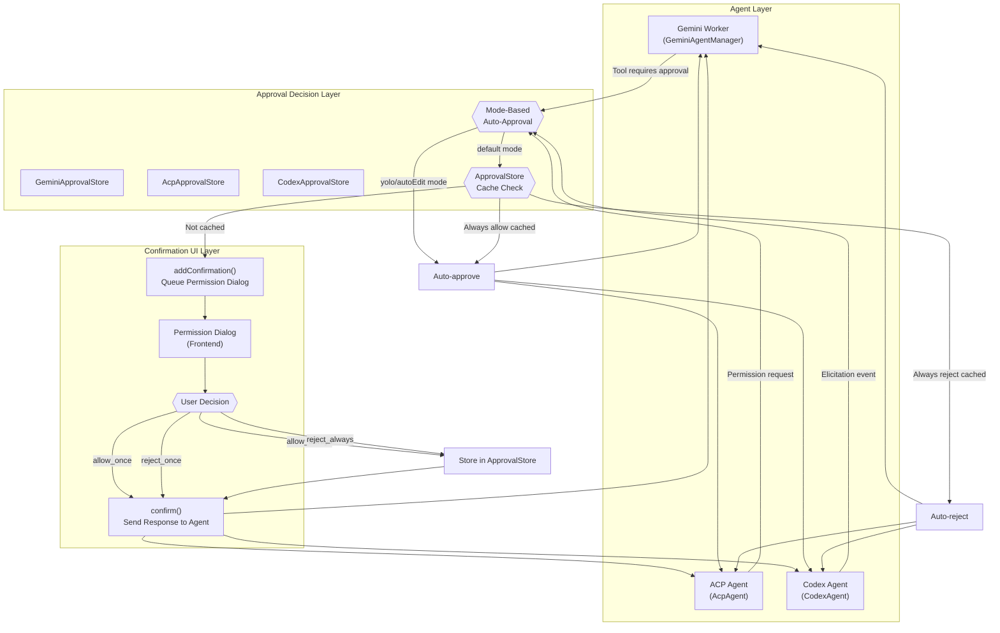
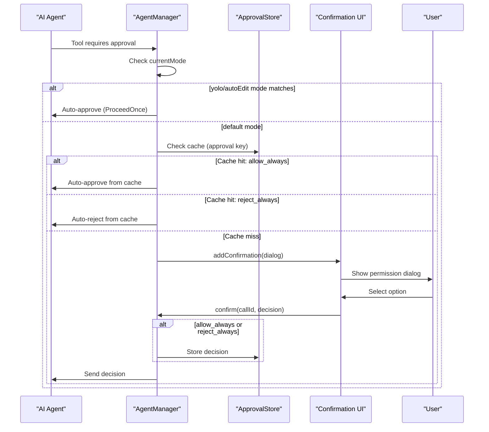
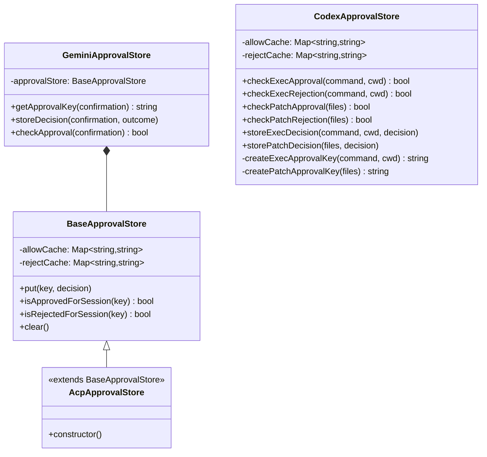
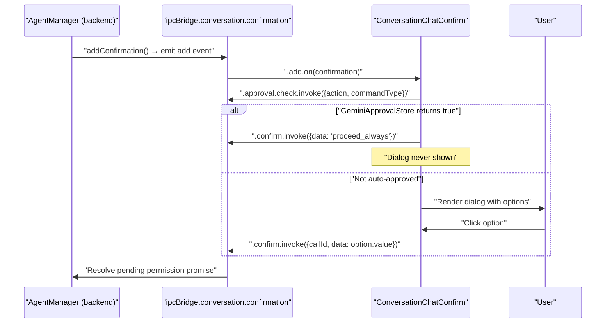
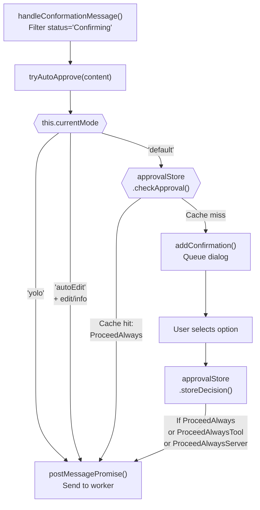
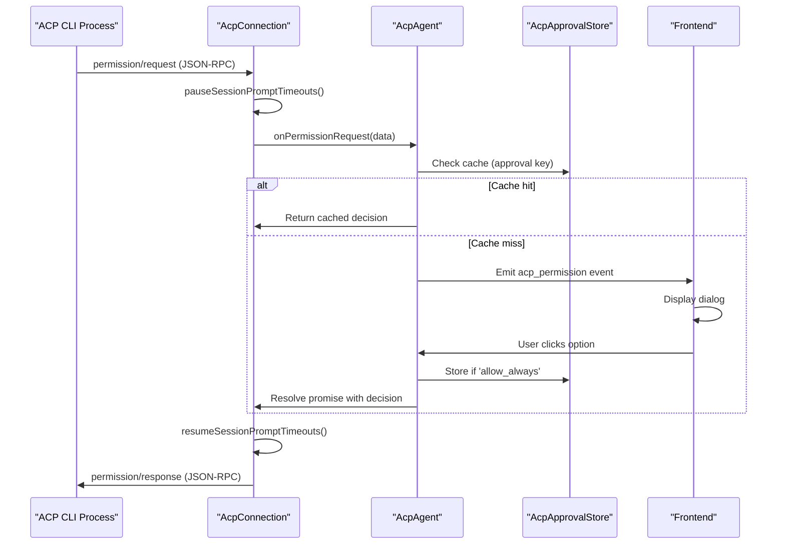
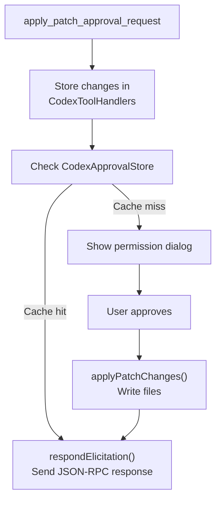

# Permission & Confirmation System

<details>
<summary>Relevant source files</summary>

The following files were used as context for generating this wiki page:

- [src/agent/acp/AcpAdapter.ts](src/agent/acp/AcpAdapter.ts)
- [src/agent/acp/AcpConnection.ts](src/agent/acp/AcpConnection.ts)
- [src/agent/acp/index.ts](src/agent/acp/index.ts)
- [src/agent/acp/modelInfo.ts](src/agent/acp/modelInfo.ts)
- [src/agent/codex/connection/CodexConnection.ts](src/agent/codex/connection/CodexConnection.ts)
- [src/agent/codex/core/CodexAgent.ts](src/agent/codex/core/CodexAgent.ts)
- [src/agent/codex/core/ErrorService.ts](src/agent/codex/core/ErrorService.ts)
- [src/agent/codex/handlers/CodexEventHandler.ts](src/agent/codex/handlers/CodexEventHandler.ts)
- [src/agent/codex/handlers/CodexFileOperationHandler.ts](src/agent/codex/handlers/CodexFileOperationHandler.ts)
- [src/agent/codex/handlers/CodexSessionManager.ts](src/agent/codex/handlers/CodexSessionManager.ts)
- [src/agent/codex/handlers/CodexToolHandlers.ts](src/agent/codex/handlers/CodexToolHandlers.ts)
- [src/agent/codex/messaging/CodexMessageProcessor.ts](src/agent/codex/messaging/CodexMessageProcessor.ts)
- [src/agent/gemini/cli/atCommandProcessor.ts](src/agent/gemini/cli/atCommandProcessor.ts)
- [src/agent/gemini/cli/config.ts](src/agent/gemini/cli/config.ts)
- [src/agent/gemini/cli/errorParsing.ts](src/agent/gemini/cli/errorParsing.ts)
- [src/agent/gemini/cli/tools/web-fetch.ts](src/agent/gemini/cli/tools/web-fetch.ts)
- [src/agent/gemini/cli/tools/web-search.ts](src/agent/gemini/cli/tools/web-search.ts)
- [src/agent/gemini/cli/types.ts](src/agent/gemini/cli/types.ts)
- [src/agent/gemini/cli/useReactToolScheduler.ts](src/agent/gemini/cli/useReactToolScheduler.ts)
- [src/agent/gemini/index.ts](src/agent/gemini/index.ts)
- [src/agent/gemini/utils.ts](src/agent/gemini/utils.ts)
- [src/common/chatLib.ts](src/common/chatLib.ts)
- [src/common/codex/types/eventData.ts](src/common/codex/types/eventData.ts)
- [src/common/codex/types/eventTypes.ts](src/common/codex/types/eventTypes.ts)
- [src/process/bridge/acpConversationBridge.ts](src/process/bridge/acpConversationBridge.ts)
- [src/process/message.ts](src/process/message.ts)
- [src/process/services/mcpServices/McpOAuthService.ts](src/process/services/mcpServices/McpOAuthService.ts)
- [src/process/task/AcpAgentManager.ts](src/process/task/AcpAgentManager.ts)
- [src/process/task/CodexAgentManager.ts](src/process/task/CodexAgentManager.ts)
- [src/process/task/GeminiAgentManager.ts](src/process/task/GeminiAgentManager.ts)
- [src/renderer/components/AcpModelSelector.tsx](src/renderer/components/AcpModelSelector.tsx)
- [src/renderer/pages/guid/hooks/useGuidAgentSelection.ts](src/renderer/pages/guid/hooks/useGuidAgentSelection.ts)
- [src/renderer/pages/settings/AssistantManagement.tsx](src/renderer/pages/settings/AssistantManagement.tsx)
- [src/types/acpTypes.ts](src/types/acpTypes.ts)

</details>

## Purpose and Scope

The Permission & Confirmation System provides a multi-tier approval strategy for controlling AI agent tool execution. It mediates dangerous operations (command execution, file modifications, MCP tool calls) through user confirmation dialogs, session-level "always allow" caching, and mode-based auto-approval policies. This system prevents unintended changes while minimizing user friction through intelligent permission memory.

For information about the agents themselves, see [AI Agent Systems](#4). For cron task execution with forced yolo mode, see [Cron & Scheduled Tasks](#4.8).

---

## System Architecture

The permission system operates across three layers:

1. **Permission Request Layer**: Agents detect operations requiring approval and emit permission request events
2. **Approval Decision Layer**: ApprovalStore caches decisions, mode-based rules auto-approve, or user is prompted
3. **Confirmation UI Layer**: Frontend displays permission dialogs with multiple approval options



Sources: [src/process/task/GeminiAgentManager.ts:360-383](), [src/agent/acp/index.ts:670-721](), [src/agent/codex/handlers/CodexEventHandler.ts:145-164]()

---

## Permission Types and Request Flow

### Permission Types by Agent

Different agent types handle different permission categories:

| Permission Type                | Gemini | ACP | Codex | Description                        |
| ------------------------------ | ------ | --- | ----- | ---------------------------------- |
| **File Edit** (`edit`)         | ✓      | ✓   | ✓     | Write or modify files in workspace |
| **Command Execution** (`exec`) | ✓      | ✓   | ✓     | Execute shell commands             |
| **File Read** (`info`)         | ✓      | -   | -     | Read file contents                 |
| **MCP Tool Call** (`mcp`)      | ✓      | -   | ✓     | Call external MCP server tools     |
| **ACP Permission**             | -      | ✓   | -     | Generic ACP permission requests    |

### Request Flow Diagram



Sources: [src/process/task/GeminiAgentManager.ts:364-383](), [src/agent/acp/index.ts:680-686](), [src/agent/codex/handlers/CodexEventHandler.ts:182-194]()

---

## Approval Stores: Session-Level Caching

Each agent type maintains its own `ApprovalStore` for caching "always allow" and "always reject" decisions within a session. The store uses a hash-based key system to identify permission requests.

### Approval Key Generation

Approval keys are generated from permission request metadata to ensure consistent cache lookups:

**Gemini** [src/agent/gemini/GeminiApprovalStore.ts:23-66]():

The `getApprovalKey()` method generates keys based on confirmation type:

- **Edit**: `editFile:${fileName}:${isModifying ? 'modify' : 'create'}`
- **Exec**: `exec:${rootCommand}` (e.g., `exec:curl`, `exec:npm`)
- **Info** (read): `info:${prompt || urls?.join(';')}`
- **MCP**: `mcp:${serverName}:${toolName}` or `mcp-server:${serverName}` (for server-wide approvals)

These keys match the `action` and `commandType` fields on `IConfirmation`, which the renderer passes to `ipcBridge.conversation.approval.check.invoke` for the auto-confirmation path.

**ACP** [src/agent/acp/ApprovalStore.ts:20-41]():

The `createAcpApprovalKey()` function generates keys from `AcpPermissionRequest`:

- Uses `kind`, `title`, and `rawInput?.description` fields
- Example: `execute:Execute command ls:Run command: ls in /home/user`
- Falls back to JSON stringification for unrecognized permission types

**Codex** [src/agent/codex/core/ApprovalStore.ts:35-85]():

Separate key generation methods for each permission type:

- **Exec**: `createExecApprovalKey(command, cwd)` → `exec:${normalizedCommand}:${normalizedCwd}`
  - Normalizes paths to ensure cache hits across different relative path formats
- **Patch**: `createPatchApprovalKey(files)` → `patch:${sortedFilePaths.join(',')}`
  - Sorts file paths for consistent keys regardless of patch order

Permission types are defined in the `PermissionType` enum: `COMMAND_EXECUTION`, `FILE_WRITE`, `FILE_READ`

### Store Operations

**ApprovalStore Class Hierarchy**



**Implementation Notes**:

- `GeminiApprovalStore` uses composition, wrapping a `BaseApprovalStore` instance
- `AcpApprovalStore` extends `BaseApprovalStore` via inheritance
- `CodexApprovalStore` is an independent implementation with domain-specific methods
- The renderer accesses `GeminiApprovalStore` indirectly via `ipcBridge.conversation.approval.check.invoke`

Sources: [src/agent/gemini/GeminiApprovalStore.ts:11-87](), [src/agent/acp/ApprovalStore.ts:10-87](), [src/agent/codex/core/ApprovalStore.ts:14-102](), [src/renderer/pages/conversation/components/ConversationChatConfirm.tsx:31-36]()

---

## Mode-Based Auto-Approval

The system supports three session modes that control auto-approval behavior:

### Mode Definitions

| Mode                       | Description              | Auto-Approves                          | Requires User Confirmation |
| -------------------------- | ------------------------ | -------------------------------------- | -------------------------- |
| **Plan** (`default`)       | Default safe mode        | None                                   | All operations             |
| **Auto Edit** (`autoEdit`) | Auto-approve read/write  | File edit (`edit`), File read (`info`) | Exec, MCP tools            |
| **Full Auto** (`yolo`)     | Bypass all confirmations | All operations                         | None                       |

### Mode Implementation by Agent

#### Gemini Mode Handling

[src/process/task/GeminiAgentManager.ts:364-383]()

```typescript
private tryAutoApprove(content: IMessageToolGroup['content'][number]): boolean {
  const type = content.confirmationDetails?.type;
  if (this.currentMode === 'yolo') {
    // yolo: auto-approve ALL operations
    void this.postMessagePromise(content.callId, ToolConfirmationOutcome.ProceedOnce);
    return true;
  }
  if (this.currentMode === 'autoEdit') {
    // autoEdit: auto-approve edit (write/replace) and info (read) operations
    if (type === 'edit' || type === 'info') {
      void this.postMessagePromise(content.callId, ToolConfirmationOutcome.ProceedOnce);
      return true;
    }
  }
  return false;
}
```

#### ACP Mode Handling

ACP agents delegate mode checking to the worker process through the `yoloMode` flag: [src/agent/acp/index.ts:272-285]()

```typescript
async enableYoloMode(): Promise<void> {
  if (this.extra.yoloMode) return;
  this.extra.yoloMode = true;

  if (this.connection.isConnected && this.connection.hasActiveSession) {
    const yoloModeMap: Partial<Record<AcpBackend, string>> = {
      claude: CLAUDE_YOLO_SESSION_MODE,
      qwen: QWEN_YOLO_SESSION_MODE,
    };
    const sessionMode = yoloModeMap[this.extra.backend];
    if (sessionMode) {
      await this.connection.setSessionMode(sessionMode);
    }
  }
}
```

#### Codex Mode Handling

Codex always passes `yoloMode: false` to the CLI to avoid dual-approval conflicts. All approval modes are handled uniformly at the manager layer: [src/process/task/CodexAgentManager.ts:112-118]()

Sources: [src/process/task/GeminiAgentManager.ts:364-383](), [src/agent/acp/index.ts:272-285](), [src/process/task/CodexAgentManager.ts:112-118]()

---

## Confirmation UI System

### IConfirmation Interface

The unified confirmation interface is defined in [src/common/chatLib.ts:281-298]():

Each confirmation carries:

| Field         | Type                             | Description                                               |
| ------------- | -------------------------------- | --------------------------------------------------------- |
| `id`          | `string`                         | Unique identifier for the confirmation dialog             |
| `callId`      | `string`                         | Tool call ID used to route the response back to the agent |
| `title`       | `string?`                        | Dialog title (i18n key)                                   |
| `description` | `string`                         | Dialog body text (i18n key)                               |
| `options`     | `Array<{label, value, params?}>` | User-facing buttons                                       |
| `action`      | `string?`                        | Action name for `GeminiApprovalStore` cache lookup        |
| `commandType` | `string?`                        | Root command for exec confirmations (e.g., `curl`, `npm`) |

Sources: [src/common/chatLib.ts:281-298]()

---

### ConversationChatConfirm Component

`ConversationChatConfirm` is the React component that wraps the conversation's `SendBox` and intercepts pending confirmations. It renders one confirmation dialog at a time, blocking the input area until resolved.

**IPC Bridge subscriptions** (initialized in a single `useEffect`):

| IPC Channel                                          | Direction | Purpose                                       |
| ---------------------------------------------------- | --------- | --------------------------------------------- |
| `ipcBridge.conversation.confirmation.list.invoke`    | invoke    | Load all pending confirmations on mount       |
| `ipcBridge.conversation.confirmation.add.on`         | subscribe | Receive new confirmations in real time        |
| `ipcBridge.conversation.confirmation.remove.on`      | subscribe | Remove resolved confirmations                 |
| `ipcBridge.conversation.confirmation.update.on`      | subscribe | Mutate in-place (e.g., status change)         |
| `ipcBridge.conversation.confirmation.confirm.invoke` | invoke    | Submit the user's selected option             |
| `ipcBridge.conversation.approval.check.invoke`       | invoke    | Check `GeminiApprovalStore` for auto-approval |

Sources: [src/renderer/pages/conversation/components/ConversationChatConfirm.tsx:59-117]()

---

**Auto-confirmation (`checkAndAutoConfirm`)**: Before displaying any incoming confirmation, the component queries the backend approval store. If the conversation's `agentType` is `gemini` and the store returns `true` for the combination of `action` and `commandType`, the component automatically invokes `confirmation.confirm` with `proceed_always` or `proceed_once` (whichever option exists) and silently skips the dialog.

> This is currently only active for the `gemini` agent type. Other agent types always show the dialog.

Sources: [src/renderer/pages/conversation/components/ConversationChatConfirm.tsx:21-57]()

---

**ESC key handling**: When at least one confirmation is pending, a `keydown` listener on `window` captures `Escape`. It finds the `cancel` option on the first confirmation and invokes `confirmation.confirm` with `cancel`, effectively dismissing the dialog without proceeding.

Sources: [src/renderer/pages/conversation/components/ConversationChatConfirm.tsx:120-145]()

---

**Error handling and retry**: On mount, the component retries loading confirmations up to 3 times with a 1-second delay if the IPC call fails. After exhausting retries, it renders an error card with a manual "Retry" button instead of the dialog.

Sources: [src/renderer/pages/conversation/components/ConversationChatConfirm.tsx:59-88]()

---

**Stable children tree**: The `SendBox` (children) is always mounted in the DOM. When a confirmation is shown, the children are hidden via `className='hidden'` rather than unmounted. This prevents duplicate message sends caused by remounting components like `AcpSendBox`.

Sources: [src/renderer/pages/conversation/components/ConversationChatConfirm.tsx:185-229]()

---

**Confirmation Dialog Flow**



Sources: [src/renderer/pages/conversation/components/ConversationChatConfirm.tsx:1-232]()

---

### Option Types by Permission

Different permission types provide different approval options:

**File Edit** ([src/process/task/GeminiAgentManager.ts:273-286]()):

- `yesAllowOnce`: Approve this edit
- `yesAllowAlways`: Always allow edits to this file
- `no`: Reject this edit

**Command Execution** ([src/process/task/GeminiAgentManager.ts:290-303]()):

- `yesAllowOnce`: Run this command
- `yesAllowAlways`: Always allow this root command (e.g., always allow `curl`)
- `no`: Don't run

**MCP Tool** ([src/process/task/GeminiAgentManager.ts:324-351]()):

- `yesAllowOnce`: Call this tool once
- `yesAlwaysAllowTool`: Always allow this specific tool
- `yesAlwaysAllowServer`: Always allow all tools from this server
- `no`: Don't call

**Codex Permissions** [src/common/codex/utils/permissionUtils.ts:14-43]():

All Codex permission types (`COMMAND_EXECUTION`, `FILE_WRITE`, `FILE_READ`) share these four standard options derived from `BASE_PERMISSION_OPTIONS`:

| `optionId`      | `kind`          | `PermissionSeverity` | Description                   |
| --------------- | --------------- | -------------------- | ----------------------------- |
| `allow_once`    | `allow_once`    | `LOW`                | Approve this single operation |
| `allow_always`  | `allow_always`  | `MEDIUM`             | Approve for entire session    |
| `reject_once`   | `reject_once`   | `LOW`                | Reject this single operation  |
| `reject_always` | `reject_always` | `HIGH`               | Reject and block for session  |

The `createPermissionOptionsForType()` function [src/common/codex/utils/permissionUtils.ts:45-77]() generates these options with type-specific i18n keys. For example, `FILE_WRITE` permissions get keys like `"messages.confirmation.fileWriteAllowOnce"` while `COMMAND_EXECUTION` gets `"messages.confirmation.commandExecutionAllowOnce"`.

Sources: [src/common/chatLib.ts:281-298](), [src/process/task/GeminiAgentManager.ts:266-359](), [src/common/codex/utils/permissionUtils.ts:14-77]()

---

## Agent-Specific Implementations

### Gemini Permission System

**Architecture**: [src/process/task/GeminiAgentManager.ts:66-67]()

The `GeminiAgentManager` maintains a `GeminiApprovalStore` instance for session-level caching. Confirmation checks happen in `handleConformationMessage()` which filters tool groups for status `'Confirming'`.

**Key Methods**:

- `tryAutoApprove(content)`: Mode-based auto-approval check [src/process/task/GeminiAgentManager.ts:364-383]()
- `getConfirmationButtons(confirmationDetails, t)`: Generate approval options [src/process/task/GeminiAgentManager.ts:266-359]()
- `handleConformationMessage(message)`: Process incoming tool confirmations [src/process/task/GeminiAgentManager.ts:385-425]()
- `addConfirmation(confirmation)`: Queue confirmation dialog (inherited from `BaseAgentManager`)
- `confirm(data)`: Process user decision and update `approvalStore` [src/process/task/GeminiAgentManager.ts:553-602]()

**Approval Decision Flow**:



Sources: [src/process/task/GeminiAgentManager.ts:66-67](), [src/process/task/GeminiAgentManager.ts:364-425](), [src/process/task/GeminiAgentManager.ts:553-602]()

---

### ACP Permission System

**Architecture**: [src/agent/acp/index.ts:111-113]()

The `AcpAgent` class maintains an `AcpApprovalStore` and a metadata map for permission requests. The `AcpConnection` class handles low-level permission request/response protocol.

**Key Components**:

- `handlePermissionRequest()`: Process incoming `AcpPermissionRequest` from CLI ([line 670-721]())
- `confirmMessage()`: Send user decision back to ACP CLI ([line 570-607]())
- `onPermissionRequest`: Async callback that pauses CLI and waits for user response ([AcpConnection.ts:90-92]())

**ACP Protocol Flow**:



**Timeout Management**: [src/agent/acp/AcpConnection.ts:512-565]()

Permission requests pause the `session/prompt` request timeout to prevent false timeouts during user confirmation. The timeout is resumed after the user responds.

Sources: [src/agent/acp/index.ts:111-113](), [src/agent/acp/index.ts:670-721](), [src/agent/acp/AcpConnection.ts:512-565]()

---

### Codex Permission System

**Architecture**: [src/agent/codex/handlers/CodexEventHandler.ts:15-27]()

Codex uses a unified permission handler in `CodexEventHandler` that routes both `exec_approval_request` and `apply_patch_approval_request` events through a single flow. The `CodexToolHandlers` class stores patch changes and exec metadata.

**Key Methods in CodexEventHandler** [src/agent/codex/handlers/CodexEventHandler.ts:15-27]():

- `handleUnifiedPermissionRequest(msg)`: Deduplicate and route permission events [src/agent/codex/handlers/CodexEventHandler.ts:161-180]()
- `processExecApprovalRequest(msg, unifiedRequestId)`: Handle command execution approvals [src/agent/codex/handlers/CodexEventHandler.ts:182-229]()
- `processApplyPatchRequest(msg, unifiedRequestId)`: Handle file patch approvals [src/agent/codex/handlers/CodexEventHandler.ts:231-281]()

**Key Methods in CodexAgentManager** [src/process/task/CodexAgentManager.ts:45-72]():

- `confirm(data)`: Map UI decision to `ReviewDecision`, apply patches, call `respondElicitation()` [src/process/task/CodexAgentManager.ts:393-433]()

**Patch Application Flow**:



**Decision Mapping** [src/process/task/CodexAgentManager.ts:393-433]():

Codex CLI expects snake_case `ReviewDecision` values. The `PERMISSION_DECISION_MAP` constant [src/common/codex/types/permissionTypes.ts:36-41]() defines the mapping from UI option `kind` to backend protocol value:

| UI `kind`       | Codex `ReviewDecision` | Action                        |
| --------------- | ---------------------- | ----------------------------- |
| `allow_once`    | `approved`             | Proceed once                  |
| `allow_always`  | `approved_for_session` | Proceed and cache for session |
| `reject_once`   | `denied`               | Reject once                   |
| `reject_always` | `abort`                | Reject and cache for session  |

The `mapPermissionDecision()` utility [src/common/codex/utils/permissionUtils.ts:96-108]() applies this map, defaulting to `denied` for unknown keys. The `confirm()` method in `CodexAgentManager` first applies patches (for file write approvals) using `applyPatchChanges()`, then sends the decision to the CLI via `agent.respondElicitation()`.

**Permission Type Utilities**: `permissionUtils.ts` provides factory functions consumed by `CodexEventHandler` when building `IConfirmation` objects:

- `createPermissionOptionsForType(permissionType)` — returns the four standard options with type-scoped description i18n keys
- `getPermissionDisplayInfo(type)` — returns `titleKey`, `descriptionKey`, `icon`, and `severity` for each `PermissionType`

Sources: [src/agent/codex/handlers/CodexEventHandler.ts:15-27](), [src/agent/codex/handlers/CodexEventHandler.ts:145-164](), [src/process/task/CodexAgentManager.ts:339-379](), [src/common/codex/types/permissionTypes.ts:36-41](), [src/common/codex/utils/permissionUtils.ts:96-129]()

---

## Permission Request Deduplication

All three agent systems implement deduplication to prevent showing duplicate dialogs for the same permission request:

**Gemini** [src/process/task/GeminiAgentManager.ts:385-425]():

Uses tool `callId` as unique identifier within `handleConformationMessage()`. The method filters `message.content` for items with `status === 'Confirming'`, then calls `getConfirmationButtons()` to build the dialog. Each `callId` corresponds to exactly one confirmation instance. Multiple streaming updates to the same tool call don't create duplicate dialogs because the confirmation is added only when status first becomes `'Confirming'`.

**ACP** [src/agent/acp/index.ts:670-721]():

The `handlePermissionRequest()` method checks `this.pendingPermissions` Map before adding a new confirmation. If the `toolCallId` already exists in the map, the method returns early without creating a duplicate dialog. Tool calls without a `toolCallId` are assigned a UUID via `uuid()` to ensure uniqueness.

```typescript
// Check for duplicate permission requests
if (this.pendingPermissions.has(toolCall.toolCallId || msg_id)) {
  return Promise.resolve({ optionId: 'reject_once' })
}
```

**Codex** [src/agent/codex/handlers/CodexEventHandler.ts:161-180]():

Maintains a `pendingConfirmations: Set<string>` in the `CodexToolHandlers` class. The `handleUnifiedPermissionRequest()` method generates a `unifiedRequestId` from the event's `call_id`, then checks the set:

```typescript
const unifiedRequestId = `permission_${callId}`
if (this.toolHandlers.getPendingConfirmations().has(unifiedRequestId)) {
  return // Skip duplicate
}
this.toolHandlers.getPendingConfirmations().add(unifiedRequestId)
```

This prevents both `exec_approval_request` and `apply_patch_approval_request` events with the same `call_id` from creating duplicate dialogs.

Sources: [src/process/task/GeminiAgentManager.ts:385-425](), [src/agent/acp/index.ts:670-721](), [src/agent/codex/handlers/CodexEventHandler.ts:161-180](), [src/agent/codex/handlers/CodexToolHandlers.ts:14-27]()

---

## Mode Persistence

Session modes are persisted to the conversation database to survive application restarts:

**Storage Location**: `TChatConversation.extra.sessionMode`

**Save Flow**: [src/process/task/CodexAgentManager.ts:302-317]()

```typescript
private saveSessionMode(mode: string): void {
  try {
    const db = getDatabase();
    const result = db.getConversation(this.conversation_id);
    if (result.success && result.data) {
      const conversation = result.data;
      const updatedExtra = {
        ...conversation.extra,
        sessionMode: mode,
      };
      db.updateConversation(this.conversation_id, { extra: updatedExtra });
    }
  } catch (error) {
    console.error('Failed to save session mode:', error);
  }
}
```

**Restore Flow**: Mode is read from `data.sessionMode` in constructor and applied after session resume:

- **Gemini**: [src/process/task/GeminiAgentManager.ts:105]()
- **ACP**: [src/process/task/AcpAgentManager.ts:61](), [src/process/task/AcpAgentManager.ts:313-320]()
- **Codex**: [src/process/task/CodexAgentManager.ts:54]()

Sources: [src/process/task/CodexAgentManager.ts:302-317](), [src/process/task/GeminiAgentManager.ts:105](), [src/process/task/AcpAgentManager.ts:61]()

---

## Legacy Yolo Mode Migration

The system includes logic to migrate from the legacy `yoloMode` boolean flag (stored in agent configs) to the new mode selector system:

**Migration Logic**: [src/process/task/GeminiAgentManager.ts:144-158]()

```typescript
// Determine yoloMode from legacy config
const legacyYoloMode = this.forceYoloMode ?? config?.yoloMode ?? false

// Migrate legacy yoloMode config to currentMode
if (legacyYoloMode && this.currentMode === 'default' && !data.sessionMode) {
  this.currentMode = 'yolo'
}

// When user explicitly chose a non-yolo mode, clear legacy config
if (legacyYoloMode && data.sessionMode && data.sessionMode !== 'yolo') {
  void this.clearLegacyYoloConfig()
}
```

This ensures backward compatibility while transitioning to the mode selector UI. Similar migration exists for ACP ([src/process/task/AcpAgentManager.ts:101-119]()) and Codex ([src/process/task/CodexAgentManager.ts:98-111]()).

Sources: [src/process/task/GeminiAgentManager.ts:144-158](), [src/process/task/AcpAgentManager.ts:101-119](), [src/process/task/CodexAgentManager.ts:98-111]()
