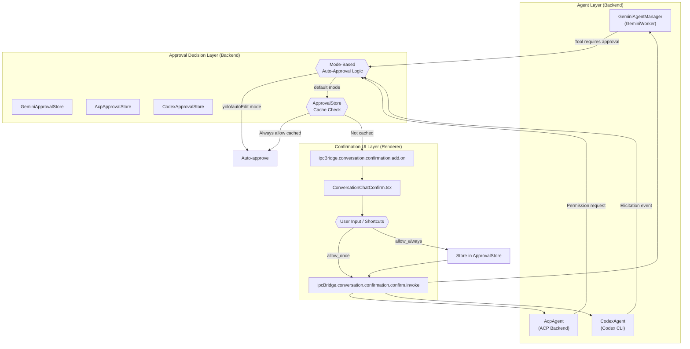
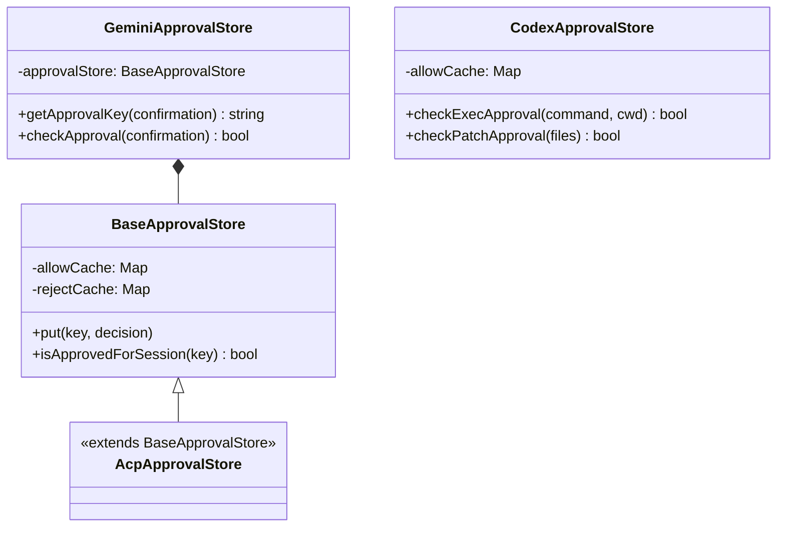
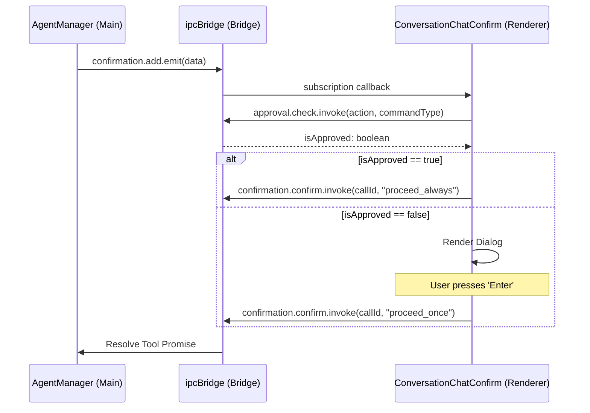

# Permission & Confirmation System

Relevant source files

The following files were used as context for generating this wiki page:

- [src/renderer/hooks/mcp/index.ts](src/renderer/hooks/mcp/index.ts)
- [src/renderer/hooks/mcp/useMcpAgentStatus.ts](src/renderer/hooks/mcp/useMcpAgentStatus.ts)
- [src/renderer/hooks/mcp/useMcpConnection.ts](src/renderer/hooks/mcp/useMcpConnection.ts)
- [src/renderer/hooks/mcp/useMcpOAuth.ts](src/renderer/hooks/mcp/useMcpOAuth.ts)
- [src/renderer/hooks/mcp/useMcpOperations.ts](src/renderer/hooks/mcp/useMcpOperations.ts)
- [src/renderer/hooks/mcp/useMcpServers.ts](src/renderer/hooks/mcp/useMcpServers.ts)
- [src/renderer/pages/conversation/components/ConversationChatConfirm.tsx](src/renderer/pages/conversation/components/ConversationChatConfirm.tsx)
- [tests/unit/process/services/mcpProtocol.test.ts](tests/unit/process/services/mcpProtocol.test.ts)

## Purpose and Scope

The Permission & Confirmation System provides a multi-tier approval strategy for controlling AI agent tool execution. It mediates dangerous operations (command execution, file modifications, MCP tool calls) through user confirmation dialogs, session-level "always allow" caching, and mode-based auto-approval policies. This system prevents unintended changes while minimizing user friction through intelligent permission memory.

For information about the agents themselves, see [AI Agent Systems](). For cron task execution with forced yolo mode, see [Cron & Scheduled Tasks]().

---

## System Architecture

The permission system operates across three layers:

1.  **Permission Request Layer**: Agents detect operations requiring approval and emit permission request events.
2.  **Approval Decision Layer**: `ApprovalStore` caches decisions, mode-based rules auto-approve, or the user is prompted.
3.  **Confirmation UI Layer**: Frontend displays permission dialogs with multiple approval options and keyboard shortcuts.

### Code Entity Mapping

Sources: [src/renderer/pages/conversation/components/ConversationChatConfirm.tsx:14-18](), [src/renderer/pages/conversation/components/ConversationChatConfirm.tsx:117-127](), [src/renderer/pages/conversation/components/ConversationChatConfirm.tsx:148-154]()

---

## Approval Stores: Session-Level Caching

Each agent type maintains its own `ApprovalStore` for caching "always allow" and "always reject" decisions within a session. The store uses a hash-based key system to identify permission requests.

### Approval Key Generation

Approval keys are generated from permission request metadata to ensure consistent cache lookups:

*   **Gemini**: Generates keys based on confirmation type: `editFile:${fileName}`, `exec:${rootCommand}`, `info:${prompt}`, or `mcp:${serverName}:${toolName}`.
*   **ACP**: Generates keys from `AcpPermissionRequest` using `kind`, `title`, and `rawInput?.description`.
*   **Codex**:
    *   **Exec**: `exec:${normalizedCommand}:${normalizedCwd}`.
    *   **Patch**: `patch:${sortedFilePaths.join(',')}`.

### Store Operations

**ApprovalStore Class Hierarchy**

Sources: [src/renderer/pages/conversation/components/ConversationChatConfirm.tsx:38-76]()

---

## Mode-Based Auto-Approval

The system supports three session modes that control auto-approval behavior:

| Mode | Description | Auto-Approves |
| :--- | :--- | :--- |
| **Plan** (`default`) | Default safe mode | None (All require confirmation) |
| **Auto Edit** (`autoEdit`) | Auto-approve file operations | File edit (`edit`), File read (`info`) |
| **Full Auto** (`yolo`) | Bypass all confirmations | All operations |

### Mode Implementation

#### Backend Logic
Agents check the `currentMode` during tool execution. If `yolo` is enabled, the tool call is automatically resolved with a "Proceed" outcome. If `autoEdit` is enabled, only non-destructive file operations or read operations are auto-approved.

#### Frontend Logic
The UI layer also performs an asynchronous check against the backend `approvalStore` before displaying a dialog to the user [src/renderer/pages/conversation/components/ConversationChatConfirm.tsx:38-76]().

Sources: [src/renderer/pages/conversation/components/ConversationChatConfirm.tsx:38-76]()

---

## Confirmation UI System

### ConversationChatConfirm Component

`ConversationChatConfirm` is the React component that intercepts pending confirmations and renders dialogs. It manages a queue of `StoredConfirmation[]` objects [src/renderer/pages/conversation/components/ConversationChatConfirm.tsx:18]().

**Key Features**:

1.  **Auto-Confirmation Check**: Before displaying a dialog, it calls `ipcBridge.conversation.approval.check.invoke` [src/renderer/pages/conversation/components/ConversationChatConfirm.tsx:48-52](). If approved by the backend store, it automatically confirms with `proceed_always` or `proceed_once` [src/renderer/pages/conversation/components/ConversationChatConfirm.tsx:54-67]().
2.  **Keyboard Shortcuts**: [src/renderer/pages/conversation/components/ConversationChatConfirm.tsx:156-185]()
    *   `Enter`: Selects the first option (typically "Allow") [src/renderer/pages/conversation/components/ConversationChatConfirm.tsx:164-168]().
    *   `Escape` / `N`: Cancels the request [src/renderer/pages/conversation/components/ConversationChatConfirm.tsx:171-178]().
    *   `Y`: Triggers `proceed_once` (Allow).
    *   `A`: Triggers `proceed_always`.
3.  **Retry Mechanism**: If loading confirmations fails, it retries up to 3 times with a 1000ms delay [src/renderer/pages/conversation/components/ConversationChatConfirm.tsx:79-112]().
4.  **Team Mode Integration**: In Team Mode, local confirmation listening is disabled as `TeamConfirmOverlay` handles cross-agent routing at the page level [src/renderer/pages/conversation/components/ConversationChatConfirm.tsx:28-32]().

### IPC Communication Flow

Sources: [src/renderer/pages/conversation/components/ConversationChatConfirm.tsx:116-136](), [src/renderer/pages/conversation/components/ConversationChatConfirm.tsx:148-154](), [src/renderer/pages/conversation/components/ConversationChatConfirm.tsx:48-52]()

---

## Persistence and Migration

### Mode Persistence
Session modes are persisted to the conversation database within the `extra.sessionMode` field. This allows the system to restore the user's preferred automation level (e.g., `yolo`) after a restart.

### Legacy Migration
The system includes logic to migrate from legacy `yoloMode` boolean flags to the unified mode system. If a legacy flag is detected and no session mode is set, it defaults the session to `yolo`.

Sources: [src/renderer/pages/conversation/components/ConversationChatConfirm.tsx:21-22](), [src/renderer/pages/conversation/components/ConversationChatConfirm.tsx:40-41]()