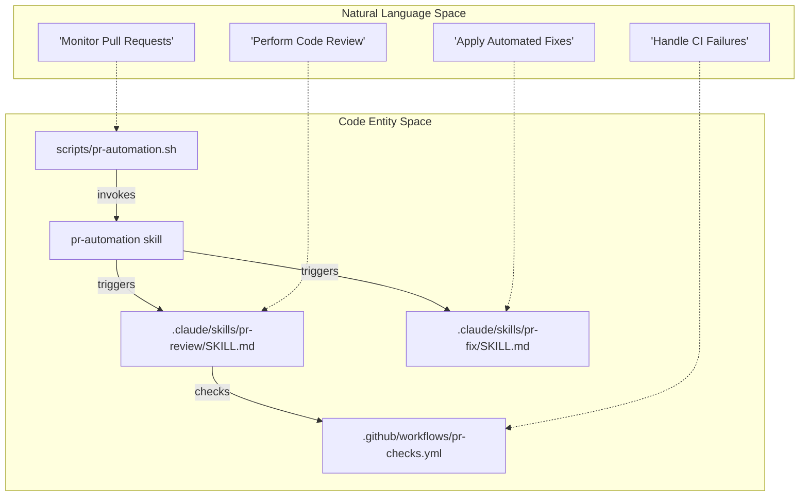
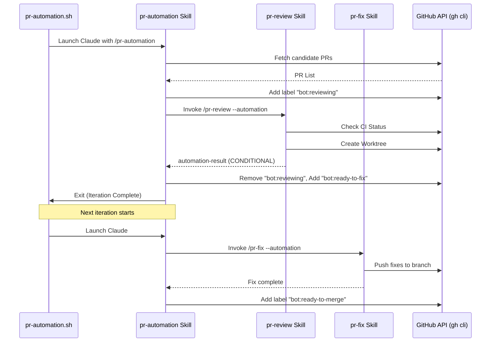

# PR Automation System

<details>
<summary>Relevant source files</summary>

The following files were used as context for generating this wiki page:

- [.claude/skills/bump-version/SKILL.md](.claude/skills/bump-version/SKILL.md)
- [.claude/skills/oss-pr/SKILL.md](.claude/skills/oss-pr/SKILL.md)
- [.claude/skills/pr-automation/SKILL.md](.claude/skills/pr-automation/SKILL.md)
- [.claude/skills/pr-fix/SKILL.md](.claude/skills/pr-fix/SKILL.md)
- [.claude/skills/pr-review/SKILL.md](.claude/skills/pr-review/SKILL.md)
- [.github/actions/call-openai/action.yml](.github/actions/call-openai/action.yml)
- [.github/actions/checkout-pr/action.yml](.github/actions/checkout-pr/action.yml)
- [.github/actions/gather-pr-diff/action.yml](.github/actions/gather-pr-diff/action.yml)
- [.github/actions/read-file-contents/action.yml](.github/actions/read-file-contents/action.yml)
- [.github/pull_request_template.md](.github/pull_request_template.md)
- [.github/workflows/README.md](.github/workflows/README.md)
- [.github/workflows/gpt-pr-assessment.yml](.github/workflows/gpt-pr-assessment.yml)
- [.github/workflows/gpt-review.yml](.github/workflows/gpt-review.yml)
- [.github/workflows/pr-checks-docs.yml](.github/workflows/pr-checks-docs.yml)
- [.github/workflows/pr-checks.yml](.github/workflows/pr-checks.yml)
- [.github/workflows/pr-e2e-artifacts.yml](.github/workflows/pr-e2e-artifacts.yml)
- [AGENTS.md](AGENTS.md)
- [docs/conventions/pr-automation.md](docs/conventions/pr-automation.md)
- [scripts/pr-automation.conf](scripts/pr-automation.conf)
- [scripts/pr-automation.sh](scripts/pr-automation.sh)
- [src/process/services/database/drivers/BetterSqlite3Driver.ts](src/process/services/database/drivers/BetterSqlite3Driver.ts)

</details>


The AionUi PR Automation System is an autonomous agent-driven pipeline designed to manage the full lifecycle of Pull Requests—from initial review and automated fixing to final merging—using a label-based state machine. It leverages specialized AI skills and a local daemon to provide high-fidelity code analysis without the truncation limits of standard API-based GitHub Actions.

## Overview and State Machine

The system is governed by a set of `bot:*` labels that act as a mutex and state indicator for the automation daemon. This prevents multiple agents from colliding on the same PR and provides transparency to human contributors.

### Label State Definitions

| Label | Meaning | Terminal? |
| :--- | :--- | :--- |
| `bot:reviewing` | A review is currently in progress. | No |
| `bot:ready-to-fix` | Review completed with actionable issues; waiting for the fix cycle. | No |
| `bot:fixing` | Automated fixing of review issues is in progress. | No |
| `bot:ci-waiting` | CI failed; snoozed until the author pushes new commits. | No |
| `bot:needs-rebase` | Merge conflict detected that requires manual author intervention. | No |
| `bot:needs-human-review` | Blocking issues or critical path changes requiring human oversight. | **Yes** |
| `bot:ready-to-merge` | Automation completed successfully; code is clean and ready for human merge. | **Yes** |
| `bot:done` | All automation tasks finished. | **Yes** |

**Sources:** [docs/conventions/pr-automation.md:7-18](), [.claude/skills/pr-automation/SKILL.md:42-50]()

---

## The Automation Daemon (`pr-automation.sh`)

The system runs as a continuous background process (daemon) on a dedicated host. It orchestrates the execution of the Claude-based agent using the `pr-automation` skill.

### Execution Loop
The daemon follows a "Poll-Execute-Sleep" cycle:
1. **Poll**: Searches for open PRs created within a lookback window (default 7 days) [.claude/skills/pr-automation/SKILL.md:63-71]().
2. **Prioritize**: Selects target PRs based on:
   - Priority 1: PRs with `bot:ready-to-fix`.
   - Priority 2: PRs from `trusted-contributors`.
   - Priority 3: Oldest PRs first (FIFO) [.claude/skills/pr-automation/SKILL.md:88-93]().
3. **Execute**: Launches a Claude instance with the `/pr-automation` command [scripts/pr-automation.sh:130-142]().
4. **Clean up**: Removes stale worktrees and residual labels if a session crashes [scripts/pr-automation.sh:58-84]().

### Logic Flow: Natural Language to Code Entity

The following diagram maps the high-level automation logic to the specific scripts and skills that implement them.

Title: PR Automation Logic Mapping

**Sources:** [scripts/pr-automation.sh:1-12](), [.claude/skills/pr-automation/SKILL.md:1-15](), [.claude/skills/pr-review/SKILL.md:1-12](), [.claude/skills/pr-fix/SKILL.md:1-13]()

---

## Core Automation Skills

The system relies on two primary "heavy" skills to perform the actual work. Each skill uses **Git Worktree Isolation** to ensure the local environment remains clean and supports parallel processing of different PRs.

### 1. PR Review Skill (`pr-review`)
This skill performs a deep analysis of the PR diff and source code.
- **CI Handshake**: It first checks the status of mandatory jobs (Code Quality, Unit Tests, i18n-check) via `gh pr view` [.claude/skills/pr-review/SKILL.md:54-68]().
- **Worktree Setup**: Creates an isolated directory at `/tmp/aionui-pr-<num>` and symlinks `node_modules` to avoid expensive re-installs [.claude/skills/pr-review/SKILL.md:163-179]().
- **Analysis**: Runs `oxlint` on changed files and reads the full content of the diff to provide context-aware suggestions [.claude/skills/pr-review/SKILL.md:223-238]().
- **Result**: Produces a machine-readable `<!-- automation-result -->` block used by the orchestrator [.claude/skills/pr-review/SKILL.md:94-101]().

### 2. PR Fix Skill (`pr-fix`)
This skill automatically resolves issues identified by `pr-review`.
- **Triage**: It parses the "汇总" (Summary) table from the review report, filtering for CRITICAL, HIGH, and MEDIUM issues [.claude/skills/pr-fix/SKILL.md:63-92]().
- **Verification**: Before applying a fix, it independently validates if the issue is real by reading the worktree source [.claude/skills/pr-fix/SKILL.md:182-198]().
- **Execution**: Applies fixes, runs `vitest` and `lint` to ensure no regressions, and pushes the changes back to the PR branch [.claude/skills/pr-fix/SKILL.md:225-245]().

**Sources:** [.claude/skills/pr-review/SKILL.md:10-181](), [.claude/skills/pr-fix/SKILL.md:9-178]()

---

## Handshake Protocol

The communication between the daemon, the orchestrator, and the sub-skills is handled via a structured handshake protocol embedded in the assistant's output.

### Automation Result Schema
When running in `--automation` mode, skills output a standardized block:

```markdown
<!-- automation-result -->
CONCLUSION: [APPROVED | CONDITIONAL | REJECTED | CI_FAILED | CI_NOT_READY]
IS_CRITICAL_PATH: [true | false]
CRITICAL_PATH_FILES: [file list]
PR_NUMBER: <number>
<!-- /automation-result -->
```
**Sources:** [.claude/skills/pr-review/SKILL.md:94-101](), [.claude/skills/pr-review/SKILL.md:316-325]()

### Data Flow Diagram

Title: PR Automation Data Flow

**Sources:** [scripts/pr-automation.sh:121-142](), [.claude/skills/pr-automation/SKILL.md:59-125](), [docs/conventions/pr-automation.md:23-52]()

---

## Configuration and Management

The system behavior is tuned via `scripts/pr-automation.conf` and environment variables.

| Variable | Description | Default |
| :--- | :--- | :--- |
| `SLEEP_SECONDS` | Delay between automation iterations. | `30` |
| `MAX_CLAUDE_SECS` | Timeout for a single Claude session. | `3600` |
| `PR_DAYS_LOOKBACK` | Age limit for PRs to be processed. | `7` |
| `CRITICAL_PATH_PATTERN` | Regex for files requiring human review. | (Defined in conf) |

### Management Commands
- **Start**: `./scripts/pr-automation.sh` [docs/conventions/pr-automation.md:89]()
- **Stop**: `kill $(cat /tmp/pr-automation-daemon.pid)` [docs/conventions/pr-automation.md:99]()
- **Logs**: `tail -f ~/Library/Logs/AionUi/pr-automation-YYYY-MM-DD.log` [scripts/pr-automation.sh:46]()

**Sources:** [scripts/pr-automation.sh:5-47](), [scripts/pr-automation.conf:1-10](), [docs/conventions/pr-automation.md:111-118]()