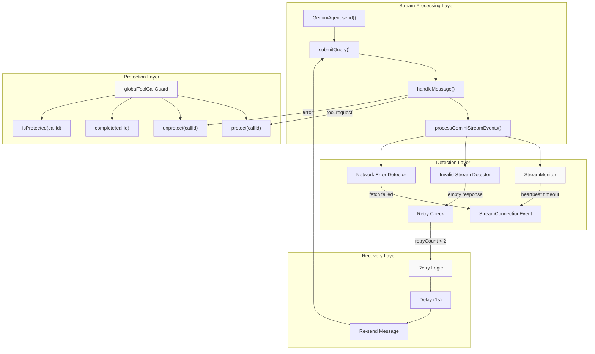
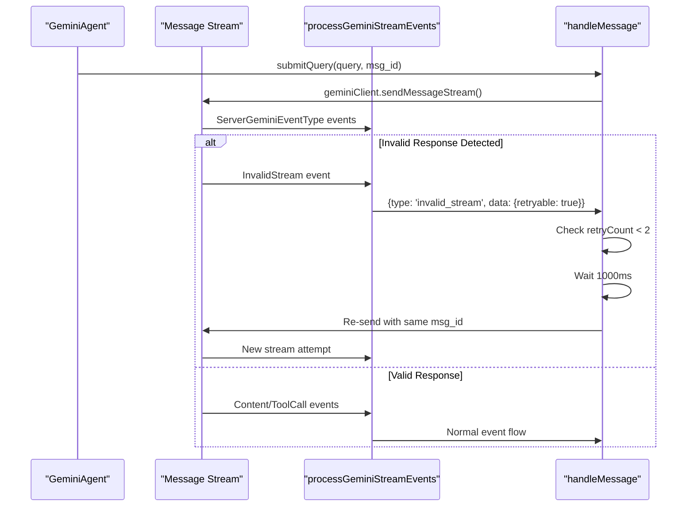
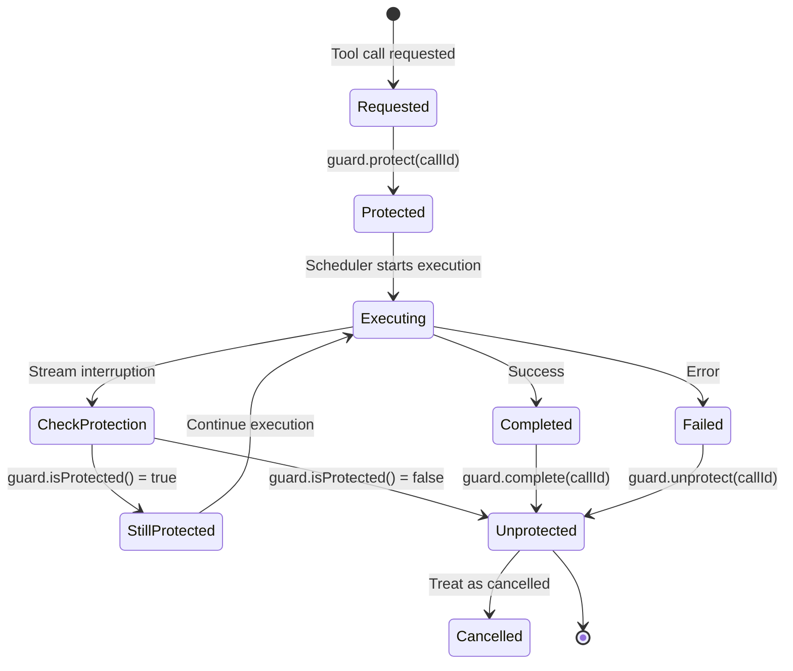
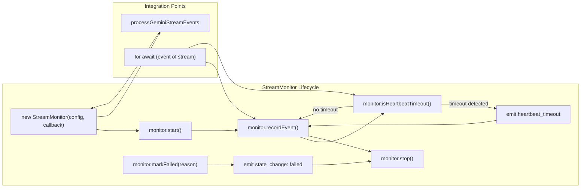
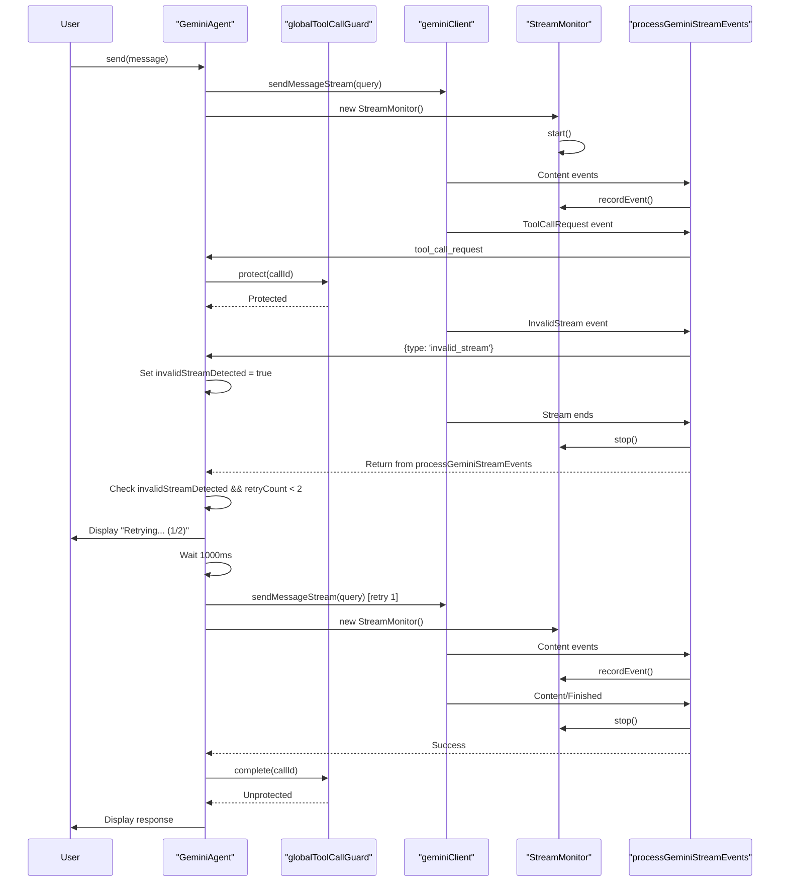

# Stream Resilience

<details>
<summary>Relevant source files</summary>

The following files were used as context for generating this wiki page:

- [src/agent/gemini/cli/atCommandProcessor.ts](src/agent/gemini/cli/atCommandProcessor.ts)
- [src/agent/gemini/cli/config.ts](src/agent/gemini/cli/config.ts)
- [src/agent/gemini/cli/errorParsing.ts](src/agent/gemini/cli/errorParsing.ts)
- [src/agent/gemini/cli/tools/web-fetch.ts](src/agent/gemini/cli/tools/web-fetch.ts)
- [src/agent/gemini/cli/tools/web-search.ts](src/agent/gemini/cli/tools/web-search.ts)
- [src/agent/gemini/cli/types.ts](src/agent/gemini/cli/types.ts)
- [src/agent/gemini/cli/useReactToolScheduler.ts](src/agent/gemini/cli/useReactToolScheduler.ts)
- [src/agent/gemini/index.ts](src/agent/gemini/index.ts)
- [src/agent/gemini/utils.ts](src/agent/gemini/utils.ts)
- [src/process/services/mcpServices/McpOAuthService.ts](src/process/services/mcpServices/McpOAuthService.ts)

</details>

## Purpose and Scope

Stream Resilience is the system responsible for detecting and automatically recovering from failures during AI model response streaming. It handles three critical failure modes: invalid model responses (empty streams, missing finish reasons), network connection interruptions (fetch failures, socket errors), and tool execution race conditions (premature cancellation).

This document covers the retry mechanisms, tool call protection, and heartbeat monitoring that ensure reliable agent responses. For information about the broader agent streaming architecture, see [Gemini Agent System](#4.1). For tool execution lifecycle management, see [Tool System Architecture](#4.5).

---

## System Architecture

The stream resilience system operates across three layers: detection (identifying failures), protection (preventing concurrent access issues), and recovery (automatic retries with backoff).



**Sources**: [src/agent/gemini/index.ts:482-611](), [src/agent/gemini/utils.ts:70-293](), [src/agent/gemini/cli/streamResilience.ts:28]()

---

## Invalid Stream Detection and Retry

### Detection Mechanism

The system detects invalid streams when the model returns responses that fail validation checks implemented in `aioncli-core`. An invalid stream occurs when:

- Response is empty (no content, no tool calls, no finish reason)
- Finish reason is missing while stream indicates completion
- Response structure is malformed

The `ServerGeminiEventType.InvalidStream` event is emitted by the core library when these conditions are detected.



**Sources**: [src/agent/gemini/index.ts:522-576](), [src/agent/gemini/utils.ts:241-252]()

### Retry Logic Implementation

The retry mechanism is implemented in `GeminiAgent.handleMessage()` with the following parameters:

| Parameter                    | Value         | Purpose                              |
| ---------------------------- | ------------- | ------------------------------------ |
| `MAX_INVALID_STREAM_RETRIES` | `2`           | Maximum retry attempts               |
| `RETRY_DELAY_MS`             | `1000`        | Delay between retries (milliseconds) |
| `retryCount`                 | `0` (initial) | Current retry attempt counter        |

The retry flow tracks state through closure variables:

```
1. handleMessage() receives initial query
2. processGeminiStreamEvents() detects invalid_stream
3. invalidStreamDetected flag set to true
4. After stream completion, check conditions:
   - invalidStreamDetected === true
   - retryCount < MAX_INVALID_STREAM_RETRIES
   - query is available (passed for retry)
   - !abortController.signal.aborted
5. Display retry hint to user
6. Wait RETRY_DELAY_MS
7. Create new stream with geminiClient.sendMessageStream()
8. Recursively call handleMessage() with retryCount + 1
```

**Sources**: [src/agent/gemini/index.ts:482-576]()

### User Feedback

The system displays progress messages during retry attempts:

```typescript
// Retry hint displayed to user (line 530-534)
this.onStreamEvent({
  type: 'info',
  data: `Stream interrupted, retrying... (${retryCount + 1}/${MAX_INVALID_STREAM_RETRIES})`,
  msg_id,
})
```

After exhausting retries, a final error is shown:

```typescript
// Final error after max retries (line 570-575)
this.onStreamEvent({
  type: 'error',
  data: 'Invalid response stream detected after multiple retries. Please try again.',
  msg_id,
})
```

**Sources**: [src/agent/gemini/index.ts:527-575]()

---

## Tool Call Protection System

### Problem Statement

Tool calls can be mistakenly marked as cancelled during stream interruptions. Without protection, the following race condition occurs:

1. Model requests tool execution
2. CoreToolScheduler schedules tool
3. Stream fails mid-execution
4. Error handler treats all pending tools as cancelled
5. Tool completes successfully but result is discarded

This causes data loss and inconsistent conversation state.

### Protection Mechanism

The `globalToolCallGuard` singleton maintains a registry of protected tool call IDs. Tool calls are protected from the moment they're requested until they complete or error.



**Sources**: [src/agent/gemini/index.ts:515-518](), [src/agent/gemini/utils.ts:414-418]()

### Lifecycle Integration

The protection lifecycle integrates with tool execution flow:

**1. Protection Start (handleMessage)**

```typescript
// Immediately protect tool call when requested (line 513-518)
if (data.type === 'tool_call_request') {
  const toolRequest = data.data as ToolCallRequestInfo
  toolCallRequests.push(toolRequest)
  globalToolCallGuard.protect(toolRequest.callId)
  return
}
```

**2. Error Path Cleanup (handleMessage)**

```typescript
// Clean up protected tool calls on error (line 600-604)
.catch((e: unknown) => {
  for (const req of toolCallRequests) {
    globalToolCallGuard.unprotect(req.callId);
  }
  // ... error handling
});
```

**3. Completion Path (handleCompletedTools)**

```typescript
// Mark tool as complete, remove protection (line 414-418)
if (tc.status === 'success' || tc.status === 'error') {
  globalToolCallGuard.complete(tc.request.callId)
}
return completedOrCancelledCall.response?.responseParts !== undefined
```

**4. Cancellation Check (handleCompletedTools)**

```typescript
// Check if tools were cancelled (excluding protected tools) (line 446-456)
const allToolsCancelled = geminiTools.every((tc) => {
  if (globalToolCallGuard.isProtected(tc.request.callId)) {
    console.debug(`[ToolCallGuard] Tool ${tc.request.callId} is protected`)
    return false
  }
  return tc.status === 'cancelled'
})
```

**Sources**: [src/agent/gemini/index.ts:513-604](), [src/agent/gemini/utils.ts:409-456]()

---

## Stream Monitoring System

### StreamMonitor Class

The `StreamMonitor` tracks stream health by monitoring event timestamps and detecting stale connections. It provides a heartbeat mechanism to identify streams that have stopped receiving data.



**Sources**: [src/agent/gemini/utils.ts:70-92]()

### Configuration and Events

The monitoring system uses configuration to tune heartbeat sensitivity:

```typescript
// Default configuration from streamResilience module
interface StreamResilienceConfig {
  heartbeatTimeoutMs?: number // Max time between events before timeout
  connectionStateTimeoutMs?: number // Connection failure detection window
}
```

Events are emitted through the callback mechanism:

| Event Type          | Trigger                                  | Data                       |
| ------------------- | ---------------------------------------- | -------------------------- |
| `heartbeat_timeout` | No events received within timeout window | `{ type, lastEventTime }`  |
| `state_change`      | Connection state transitions             | `{ type, state, reason? }` |

**Sources**: [src/agent/gemini/utils.ts:26-30](), [src/agent/gemini/utils.ts:72-82]()

### Error Detection and Classification

The system classifies stream errors to determine appropriate recovery strategy:

```typescript
// Network error detection (line 276-288)
const errorMessage = error instanceof Error ? error.message : String(error)
monitor.markFailed(errorMessage)

if (
  errorMessage.includes('fetch failed') ||
  errorMessage.includes('network') ||
  errorMessage.includes('timeout') ||
  errorMessage.includes('ECONNRESET') ||
  errorMessage.includes('socket hang up')
) {
  return StreamProcessingStatus.ConnectionLost
}
```

**StreamProcessingStatus** enum values:

- `Completed`: Stream finished successfully
- `UserCancelled`: Aborted by user action
- `Error`: Generic error (non-network)
- `HeartbeatTimeout`: No data received within timeout
- `ConnectionLost`: Network failure detected

**Sources**: [src/agent/gemini/utils.ts:18-24](), [src/agent/gemini/utils.ts:276-288]()

### Integration with handleMessage

The monitoring system integrates with the main message handler through the `onConnectionEvent` callback:

```typescript
// Connection event handler in handleMessage (line 492-506)
const onConnectionEvent = (event: StreamConnectionEvent) => {
  if (event.type === 'heartbeat_timeout') {
    console.warn(
      `[GeminiAgent] Stream heartbeat timeout at ${new Date(event.lastEventTime).toISOString()}`
    )
    if (!heartbeatWarned) {
      heartbeatWarned = true
    }
  } else if (event.type === 'state_change' && event.state === 'failed') {
    console.error(`[GeminiAgent] Stream connection failed: ${event.reason}`)
    this.onStreamEvent({
      type: 'error',
      data: `Connection lost: ${event.reason}. Please try again.`,
      msg_id,
    })
  }
}
```

This callback is passed to `processGeminiStreamEvents` via `monitorOptions`:

```typescript
// Passing monitor options (line 508-545)
return processGeminiStreamEvents(
  stream,
  this.config,
  (data) => {
    /* event handler */
  },
  { onConnectionEvent }
)
```

**Sources**: [src/agent/gemini/index.ts:492-545]()

---

## Complete Retry Flow

The following diagram shows the complete interaction between all resilience components during a retry scenario:



**Sources**: [src/agent/gemini/index.ts:482-611](), [src/agent/gemini/utils.ts:70-293](), [src/agent/gemini/cli/streamResilience.ts:28]()

---

## Related Tools and Error Handling

### Web Fetch Tool Resilience

The `WebFetchTool` implements its own timeout mechanism for network requests:

```typescript
// Timeout configuration (line 13)
const URL_FETCH_TIMEOUT_MS = 10000

// Fetch with timeout implementation (line 16-31)
async function fetchWithTimeout(
  url: string,
  timeout: number
): Promise<Response> {
  const controller = new AbortController()
  const timeoutId = setTimeout(() => controller.abort(), timeout)

  try {
    const response = await fetch(url, { signal: controller.signal })
    return response
  } catch (error) {
    if (controller.signal.aborted) {
      throw new Error(`Request timeout after ${timeout}ms`)
    }
    throw error
  } finally {
    clearTimeout(timeoutId)
  }
}
```

**Sources**: [src/agent/gemini/cli/tools/web-fetch.ts:13-31]()

### Error Message Enhancement

The system enriches error messages by checking for quota-related issues:

```typescript
// Error enrichment (line 281-298 in index.ts)
private enrichErrorMessage(errorMessage: string): string {
  const reportMatch = errorMessage.match(/Full report available at:\s*(.+?\.json)/i);
  const lowerMessage = errorMessage.toLowerCase();

  if (lowerMessage.includes('model_capacity_exhausted') ||
      lowerMessage.includes('no capacity available') ||
      lowerMessage.includes('resource_exhausted') ||
      lowerMessage.includes('ratelimitexceeded')) {
    return `${errorMessage}\
Quota exhausted on this model.`;
  }
  // ... check report file for quota errors
}
```

The error parsing system provides context-aware messages based on authentication type:

**Sources**: [src/agent/gemini/index.ts:281-298](), [src/agent/gemini/cli/errorParsing.ts:79-123]()

---

## Configuration and Tuning

### Retry Configuration

The retry behavior is controlled by constants in `GeminiAgent.handleMessage()`:

```typescript
const MAX_INVALID_STREAM_RETRIES = 2 // Line 483
const RETRY_DELAY_MS = 1000 // Line 484
```

To modify retry behavior:

1. Adjust `MAX_INVALID_STREAM_RETRIES` for more/fewer attempts
2. Adjust `RETRY_DELAY_MS` for shorter/longer backoff
3. Consider exponential backoff for production use

### Stream Monitor Configuration

The monitor configuration is passed via `StreamMonitorOptions`:

```typescript
// Configuration interface (line 27-30)
export interface StreamMonitorOptions {
  config?: Partial<StreamResilienceConfig>
  onConnectionEvent?: (event: StreamConnectionEvent) => void
}
```

The default configuration is defined in `DEFAULT_STREAM_RESILIENCE_CONFIG` (imported from `cli/streamResilience.ts`).

**Sources**: [src/agent/gemini/index.ts:483-484](), [src/agent/gemini/utils.ts:26-30](), [src/agent/gemini/utils.ts:72]()

---

## Integration with aioncli-core

### Fetch Error Retry Configuration

The system enables built-in retry for fetch errors in `aioncli-core`:

```typescript
// Enable retry on fetch errors (line 276-280 in config.ts)
const config = new Config({
  // ... other options
  retryFetchErrors: true, // Handle "fetch failed sending request" errors
})
```

This handles transient network errors caused by:

- Network instability
- Proxy configuration issues
- Temporary DNS failures
- Connection resets

**Sources**: [src/agent/gemini/cli/config.ts:276-280]()

### Fallback Model Handler

The configuration includes a fallback handler for API key rotation on quota errors (used in conjunction with stream resilience):

```typescript
// Fallback handler for quota errors (line 299-332)
const fallbackModelHandler = async (
  _currentModel: string,
  _fallbackModel: string,
  _error?: unknown
): Promise<FallbackIntent | null> => {
  const agent = getCurrentGeminiAgent()
  const apiKeyManager = agent?.getApiKeyManager()

  if (!apiKeyManager?.hasMultipleKeys()) {
    return 'stop' // Single key mode, stop retrying
  }

  const hasMoreKeys = apiKeyManager.rotateKey()
  return hasMoreKeys ? 'retry_once' : 'stop'
}
```

This integrates with stream resilience by providing a recovery mechanism when quota limits are hit during streaming.

**Sources**: [src/agent/gemini/cli/config.ts:299-334]()

---

## Summary

The Stream Resilience system provides three layers of protection:

| Layer                    | Mechanism                                       | Recovery Time               |
| ------------------------ | ----------------------------------------------- | --------------------------- |
| Invalid Stream Detection | Automatic retry with exponential backoff        | 1-2 seconds per retry       |
| Tool Call Protection     | Guard registry prevents premature cancellation  | Immediate (no retry needed) |
| Heartbeat Monitoring     | Connection state tracking and timeout detection | Configurable (default ~30s) |

These mechanisms work together to ensure reliable AI agent responses even in unstable network conditions or when models produce invalid outputs. The system prioritizes data integrity (protecting executing tools) while providing user feedback about retry attempts.

**Sources**: [src/agent/gemini/index.ts:482-611](), [src/agent/gemini/utils.ts:70-293](), [src/agent/gemini/cli/streamResilience.ts:28](), [src/agent/gemini/cli/config.ts:276-334]()
