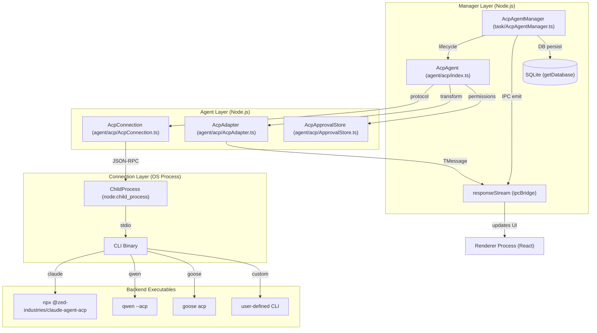
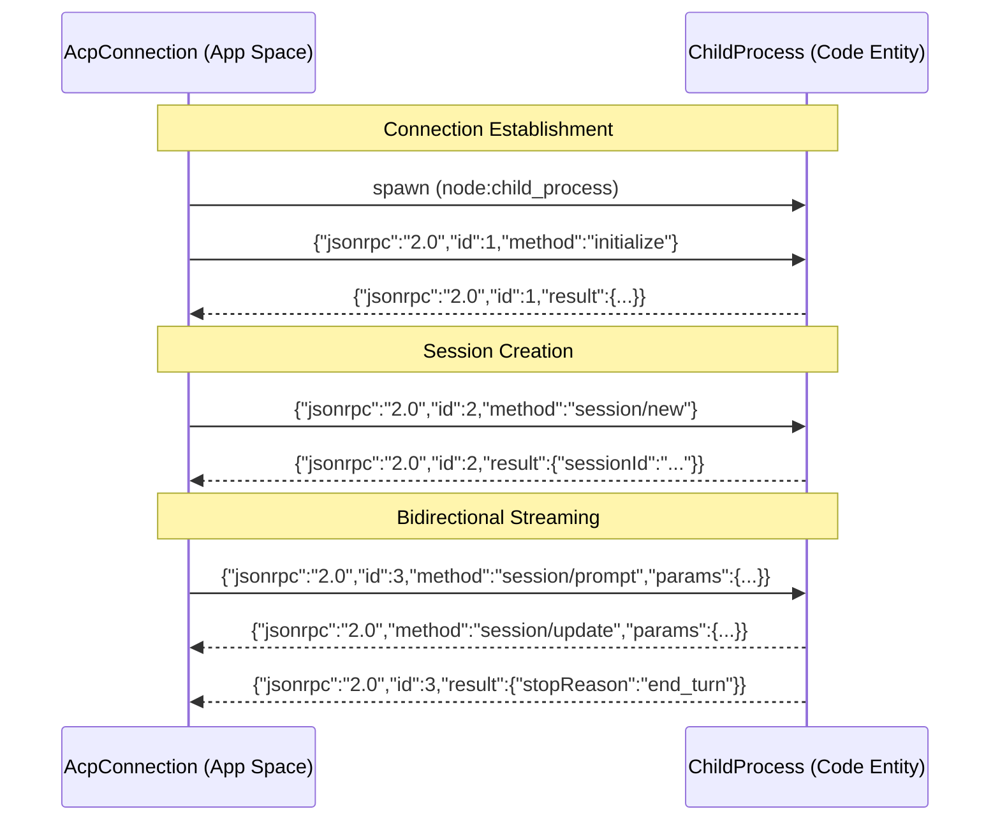

# ACP Agent Integration

Relevant source files

The following files were used as context for generating this wiki page:

- [docs/research/acpx-integration-analysis.md](docs/research/acpx-integration-analysis.md)
- [src/process/agent/acp/AcpAdapter.ts](src/process/agent/acp/AcpAdapter.ts)
- [src/process/agent/acp/AcpConnection.ts](src/process/agent/acp/AcpConnection.ts)
- [src/process/agent/acp/acpConnectors.ts](src/process/agent/acp/acpConnectors.ts)
- [src/process/agent/acp/index.ts](src/process/agent/acp/index.ts)
- [src/process/channels/actions/SystemActions.ts](src/process/channels/actions/SystemActions.ts)
- [src/process/channels/gateway/ActionExecutor.ts](src/process/channels/gateway/ActionExecutor.ts)
- [src/process/channels/plugins/telegram/TelegramAdapter.ts](src/process/channels/plugins/telegram/TelegramAdapter.ts)
- [src/process/task/AcpAgentManager.ts](src/process/task/AcpAgentManager.ts)
- [src/process/task/GeminiAgentManager.ts](src/process/task/GeminiAgentManager.ts)
- [src/process/task/workerTaskManagerSingleton.ts](src/process/task/workerTaskManagerSingleton.ts)
- [src/process/utils/shellEnv.ts](src/process/utils/shellEnv.ts)
- [tests/unit/acpAdapter.test.ts](tests/unit/acpAdapter.test.ts)
- [tests/unit/acpAdapterUserMessageChunk.test.ts](tests/unit/acpAdapterUserMessageChunk.test.ts)
- [tests/unit/acpAgentSetModel.test.ts](tests/unit/acpAgentSetModel.test.ts)
- [tests/unit/acpConnectionStartupExit.test.ts](tests/unit/acpConnectionStartupExit.test.ts)
- [tests/unit/acpConnectors.test.ts](tests/unit/acpConnectors.test.ts)
- [tests/unit/acpTimeout.test.ts](tests/unit/acpTimeout.test.ts)
- [tests/unit/channels/telegramAdapter.test.ts](tests/unit/channels/telegramAdapter.test.ts)
- [tests/unit/channels/weixinSystemActions.test.ts](tests/unit/channels/weixinSystemActions.test.ts)
- [tests/unit/shellEnv.test.ts](tests/unit/shellEnv.test.ts)
- [tests/unit/workerTaskManagerSingleton.test.ts](tests/unit/workerTaskManagerSingleton.test.ts)

## Purpose and Scope

This document describes the **ACP (Agent Communication Protocol) integration layer** in AionUi, which enables unified communication with multiple AI coding agents (Claude Code, Qwen Code, Codex, Goose, etc.) through a standardized JSON-RPC protocol over stdio. The ACP layer abstracts backend-specific differences and provides a consistent API for agent lifecycle management, session control, model selection, and permission handling.

**Related documentation:**
- For Gemini's native agent implementation, see [4.1 Gemini Agent System]()
- For Codex's legacy implementation, see [4.2 Codex Agent System]()
- For tool execution and MCP server integration, see [4.6 MCP Integration]()
- For model configuration across all providers, see [4.7 Model Configuration & API Management]()

---

## Architecture Overview

### ACP Agent Stack

The ACP integration consists of three primary layers:

1.  **Manager Layer (`AcpAgentManager`)**: Manages the high-level conversation state, persistence to SQLite, and IPC communication with the renderer process. [src/process/task/AcpAgentManager.ts:79-113]()
2.  **Agent Layer (`AcpAgent`)**: Orchestrates the protocol logic, permission handling via `AcpApprovalStore`, and message transformation via `AcpAdapter`. [src/process/agent/acp/index.ts:129-174]()
3.  **Connection Layer (`AcpConnection`)**: Handles the low-level JSON-RPC transport, CLI process spawning, and stdio stream management. [src/process/agent/acp/AcpConnection.ts:105-151]()

**ACP System Entity Map**

Sources: [src/process/task/AcpAgentManager.ts:79-113](), [src/process/agent/acp/index.ts:129-174](), [src/process/agent/acp/AcpConnection.ts:105-151]()

### Supported Backends

AionUi supports multiple ACP-compatible backends through a unified registry. [src/process/task/AcpAgentManager.ts:19-19]()

| Backend ID | CLI Command | Launch Strategy |
| :--- | :--- | :--- |
| `claude` | `npx @zed-industries/claude-agent-acp` | `spawnNpxBackend` [src/process/agent/acp/acpConnectors.ts:62-62]() |
| `qwen` | `qwen` / `npx @qwen-code/qwen-code` | `spawnGenericBackend` [src/process/agent/acp/acpConnectors.ts:61-61]() |
| `codex` | `npx @zed-industries/codex-acp` | Platform-specific package resolution [src/process/agent/acp/acpConnectors.ts:41-73]() |
| `goose` | `goose` | Subcommand `acp` [src/process/agent/acp/acpConnectors.ts:198-202]() |

---

## AcpConnection: JSON-RPC Protocol Layer

### Protocol Fundamentals

`AcpConnection` implements a bidirectional JSON-RPC 2.0 communication channel over stdio pipes. It uses `JSONRPC_VERSION` and standardized `ACP_METHODS`. [src/process/agent/acp/AcpConnection.ts:20-20]()

**ACP Protocol Sequence**

Sources: [src/process/agent/acp/AcpConnection.ts:105-112](), [src/process/agent/acp/AcpConnection.ts:172-176]()

### Request and Timeout Management

Outgoing requests are tracked in a `pendingRequests` Map. [src/process/agent/acp/AcpConnection.ts:107-107]()

- **Prompt Timeout**: Default is 300 seconds (5 minutes). [src/process/agent/acp/AcpConnection.ts:120-120]()
- **Cancellation**: `cancelPrompt()` sends a `session/cancel` notification to the backend and clears pending prompt requests. [tests/unit/acpTimeout.test.ts:50-61]()
- **Startup Diagnostics**: `buildStartupErrorMessage` parses stderr and exit codes to provide actionable hints (e.g., "CLI not found" or "Version does not support ACP"). [src/process/agent/acp/AcpConnection.ts:52-93]()

---

## CLI Process Spawning and Environment

### Environment Preparation

The `prepareCleanEnv` function provides a universal environment for backends. [src/process/agent/acp/acpConnectors.ts:121-121]()

- **Shell Inheritance**: Loads `PATH`, `SSL_CERT_FILE`, and `ANTHROPIC_API_KEY` from the user's login shell (e.g., `.zshrc`) to ensure child processes work as they would in a terminal. [src/process/utils/shellEnv.ts:61-72]()
- **Isolation**: Deletes `NODE_OPTIONS` and `npm_` prefixed variables to prevent Electron's internal environment from interfering with child Node.js processes. [src/process/agent/acp/acpConnectors.ts:133-147]()
- **UTF-8 Support**: On Windows, commands are prefixed with `chcp 65001 >nul &&` to ensure correct character encoding in stdio. [tests/unit/acpConnectors.test.ts:91-97]()

### NPX and Node.js Resolution

AionUi handles various runtime environments:
- **Node.js Version Guard**: `ensureMinNodeVersion` checks if the system Node.js meets the backend's requirements and attempts to find a suitable bundled binary if not. [src/process/agent/acp/acpConnectors.ts:156-186]()
- **NPX Pathing**: `resolveNpxPath` locates the `npx` binary across different platforms. [src/process/utils/shellEnv.ts:28-33]()
- **Codex Native Packages**: Resolves architecture-specific packages like `@zed-industries/codex-acp-win32-x64` for optimal performance. [src/process/agent/acp/acpConnectors.ts:41-73]()

---

## Unified Conversation API

### Message Transformation via AcpAdapter

The `AcpAdapter` converts ACP-specific session updates into AionUi's internal `TMessage` format. [src/process/agent/acp/AcpAdapter.ts:22-32]()

- **Streaming Chunks**: Maps `agent_message_chunk` to `text` messages sharing a stable `msg_id`. [src/process/agent/acp/AcpAdapter.ts:155-177]()
- **Tool Calls**: Manages `tool_call` and `tool_call_update` states, merging `rawInput` across streaming events. [src/process/agent/acp/AcpAdapter.ts:91-109]()
- **Thinking Support**: Handles `agent_thought_chunk` to display reasoning blocks in the UI. [src/process/agent/acp/AcpAdapter.ts:78-89]()

### Stream Buffering and Persistence

To optimize database performance during high-frequency streaming, `AcpAgentManager` implements a buffering mechanism. [src/process/task/AcpAgentManager.ts:100-101]()

- **Flush Interval**: 120ms. [src/process/task/AcpAgentManager.ts:100-100]()
- **Mechanism**: `queueBufferedStreamTextMessage` accumulates text chunks in a Map indexed by conversation and message ID. [src/process/task/AcpAgentManager.ts:119-150]()
- **Batch Update**: `flushBufferedStreamTextMessage` commits the combined text to SQLite via `addOrUpdateMessage`. [src/process/task/AcpAgentManager.ts:152-159]()

### Session Management and Resumption

`AcpAgentManager` supports session resumption by persisting the `acpSessionId`. [src/process/task/AcpAgentManager.ts:59-60]()

- **Initialization**: `initAgent` either creates a `session/new` or performs a `session/load` if an ID exists. [src/process/agent/acp/index.ts:184-210]()
- **Model Fallback**: If a persisted `currentModelId` is unavailable, the system detects available models via the connection and selects a suitable default. [src/process/agent/acp/index.ts:176-180]()

Sources: [src/process/task/AcpAgentManager.ts:100-167](), [src/process/agent/acp/AcpAdapter.ts:63-150](), [src/process/agent/acp/index.ts:129-210]()