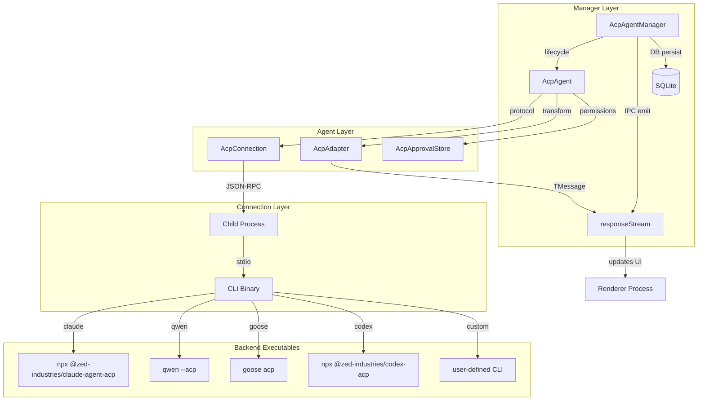
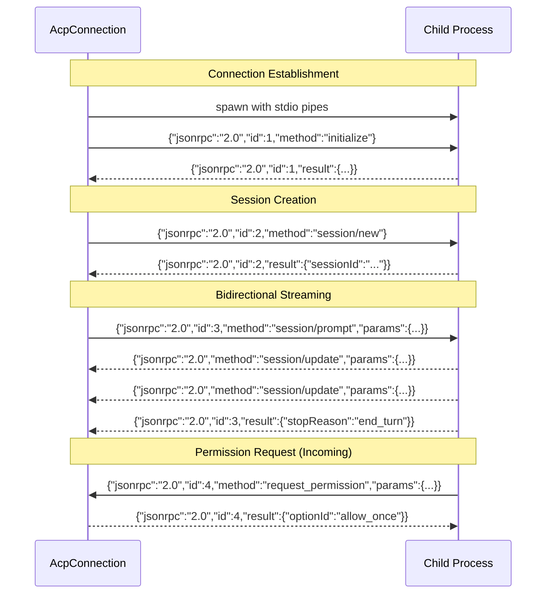
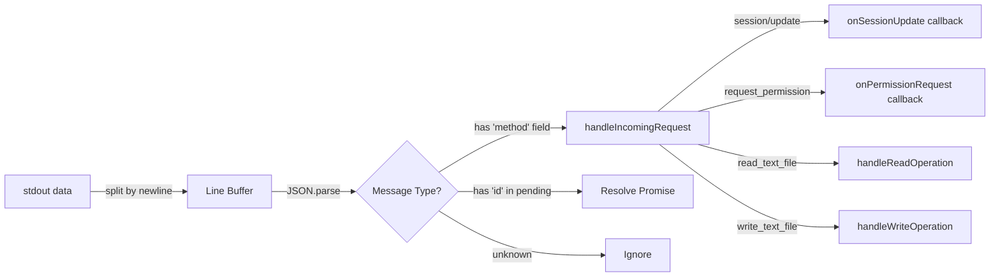
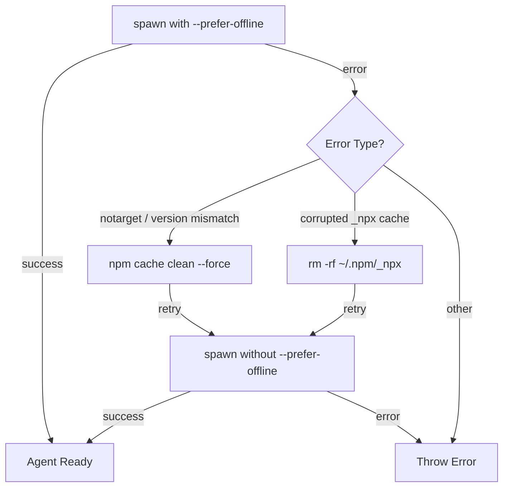
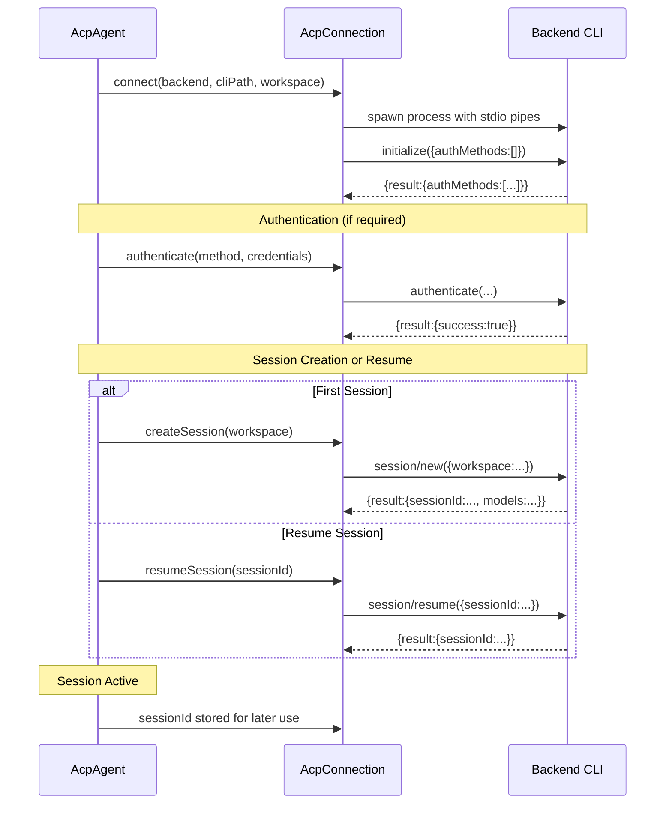
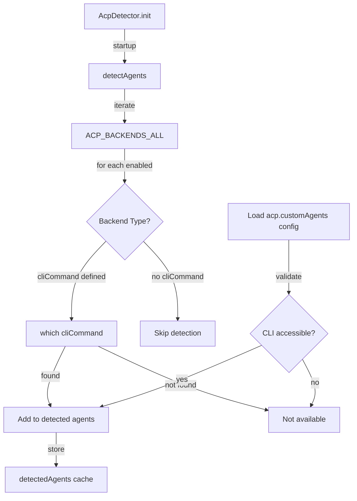
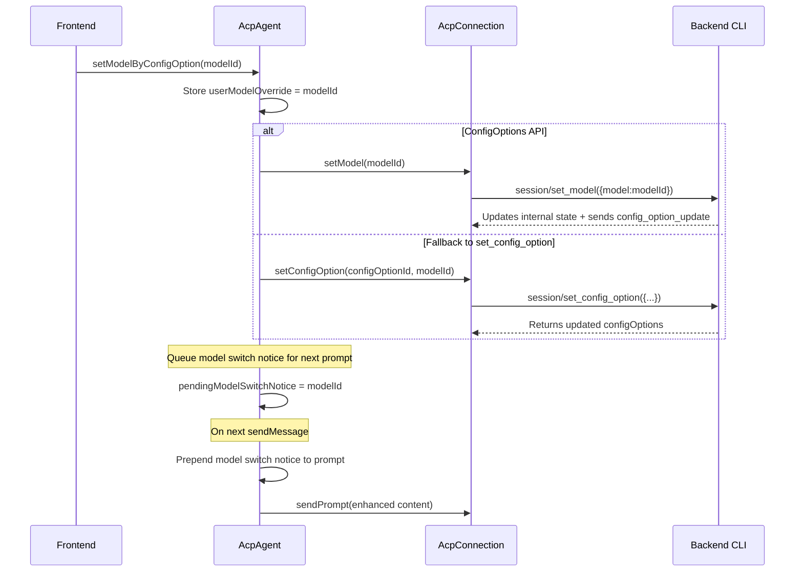
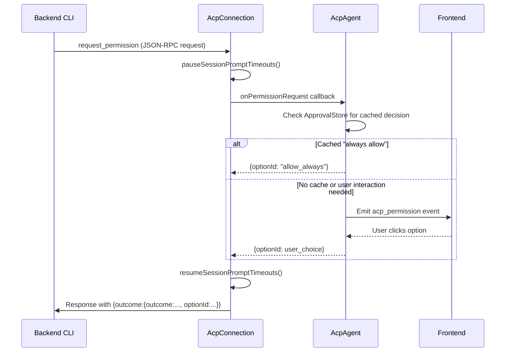
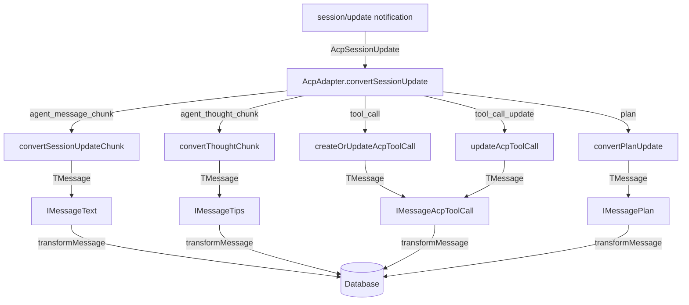
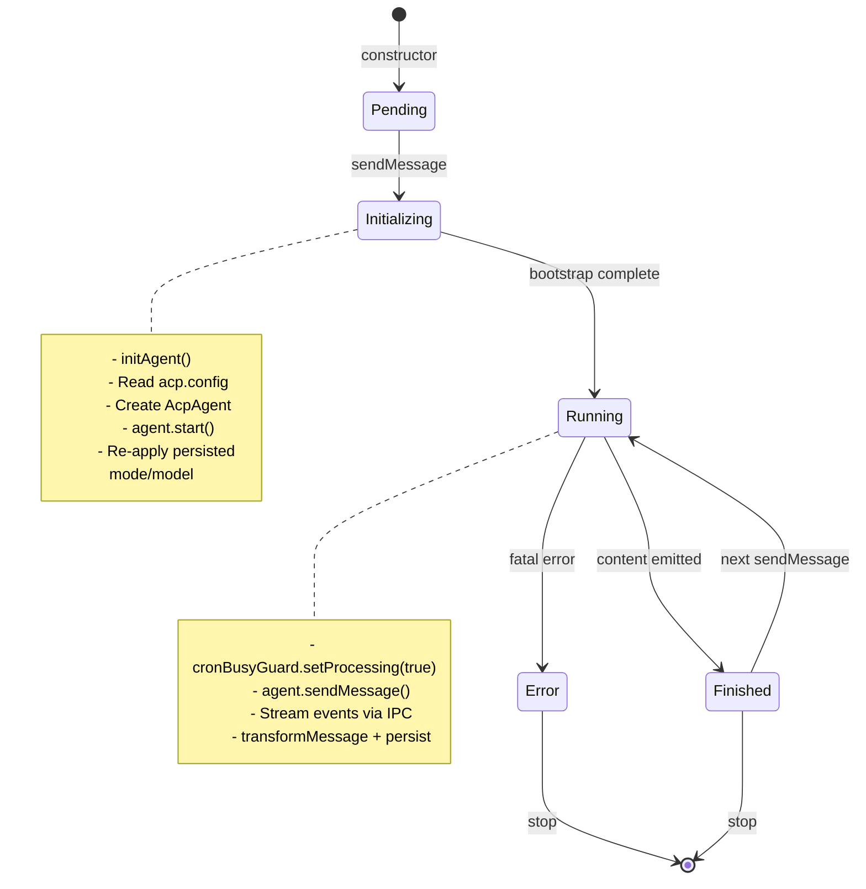

# ACP Agent Integration

<details>
<summary>Relevant source files</summary>

The following files were used as context for generating this wiki page:

- [src/agent/acp/AcpAdapter.ts](src/agent/acp/AcpAdapter.ts)
- [src/agent/acp/AcpConnection.ts](src/agent/acp/AcpConnection.ts)
- [src/agent/acp/index.ts](src/agent/acp/index.ts)
- [src/agent/acp/modelInfo.ts](src/agent/acp/modelInfo.ts)
- [src/agent/codex/connection/CodexConnection.ts](src/agent/codex/connection/CodexConnection.ts)
- [src/agent/codex/core/CodexAgent.ts](src/agent/codex/core/CodexAgent.ts)
- [src/common/chatLib.ts](src/common/chatLib.ts)
- [src/process/bridge/acpConversationBridge.ts](src/process/bridge/acpConversationBridge.ts)
- [src/process/message.ts](src/process/message.ts)
- [src/process/task/AcpAgentManager.ts](src/process/task/AcpAgentManager.ts)
- [src/process/task/CodexAgentManager.ts](src/process/task/CodexAgentManager.ts)
- [src/process/task/GeminiAgentManager.ts](src/process/task/GeminiAgentManager.ts)
- [src/renderer/components/AcpModelSelector.tsx](src/renderer/components/AcpModelSelector.tsx)
- [src/renderer/pages/guid/hooks/useGuidAgentSelection.ts](src/renderer/pages/guid/hooks/useGuidAgentSelection.ts)
- [src/renderer/pages/settings/AssistantManagement.tsx](src/renderer/pages/settings/AssistantManagement.tsx)
- [src/types/acpTypes.ts](src/types/acpTypes.ts)

</details>

## Purpose and Scope

This document describes the **ACP (Agent Communication Protocol) integration layer** in AionUi, which enables unified communication with multiple AI coding agents (Claude Code, Qwen Code, Codex, Goose, etc.) through a standardized JSON-RPC protocol over stdio. The ACP layer abstracts backend-specific differences and provides a consistent API for agent lifecycle management, session control, model selection, and permission handling.

**Related documentation:**

- For Gemini's native agent implementation, see [Gemini Agent System](#4.1)
- For Codex's MCP protocol implementation, see [Codex Agent System](#4.2)
- For tool execution and MCP server integration, see [MCP Integration](#4.6)
- For model configuration across all providers, see [Model Configuration & API Management](#4.7)

---

## Architecture Overview

### ACP Agent Stack

The ACP integration consists of three primary layers:



**Sources:** [src/process/task/AcpAgentManager.ts:49-407](), [src/agent/acp/index.ts:95-407](), [src/agent/acp/AcpConnection.ts:80-333]()

### Supported Backends

AionUi supports 15+ ACP-compatible backends through a unified registry:

| Backend ID  | CLI Command                            | Launch Args                | Description                      |
| ----------- | -------------------------------------- | -------------------------- | -------------------------------- |
| `claude`    | `npx @zed-industries/claude-agent-acp` | _(none)_                   | Claude Code via Zed's ACP bridge |
| `qwen`      | `qwen` / `npx @qwen-code/qwen-code`    | `--acp`                    | Alibaba Qwen Code CLI            |
| `codex`     | `npx @zed-industries/codex-acp`        | _(none)_                   | OpenAI Codex via Zed's bridge    |
| `goose`     | `goose`                                | `acp`                      | Block's Goose CLI (subcommand)   |
| `auggie`    | `auggie`                               | `--acp`                    | Augment Code CLI                 |
| `codebuddy` | `npx @tencent-ai/codebuddy-code`       | `--acp`                    | Tencent CodeBuddy                |
| `droid`     | `droid`                                | `exec --output-format acp` | Factory Droid CLI                |
| `iflow`     | `iflow`                                | `--experimental-acp`       | iFlow CLI                        |
| `kimi`      | `kimi`                                 | `acp`                      | Moonshot Kimi CLI                |
| `opencode`  | `opencode`                             | `acp`                      | OpenCode CLI                     |
| `copilot`   | `copilot`                              | `--acp --stdio`            | GitHub Copilot CLI               |
| `qoder`     | `qodercli`                             | `--acp`                    | Qoder CLI                        |
| `vibe`      | `vibe-acp`                             | _(none)_                   | Mistral Vibe CLI                 |
| `custom`    | _(user-defined)_                       | _(user-defined)_           | Custom agent configuration       |

**Sources:** [src/types/acpTypes.ts:292-445]()

---

## AcpConnection: JSON-RPC Protocol Layer

### Protocol Fundamentals

`AcpConnection` implements a bidirectional JSON-RPC 2.0 communication channel over stdio pipes:



**Sources:** [src/agent/acp/AcpConnection.ts:659-711]()

### Request-Response Flow

Outgoing requests are tracked in a `Map<number, PendingRequest>` with timeout management:

```typescript
interface PendingRequest<T = unknown> {
  resolve: (value: T) => void
  reject: (error: Error) => void
  timeoutId?: NodeJS.Timeout
  method: string
  isPaused: boolean
  startTime: number
  timeoutDuration: number
}
```

Timeouts are adaptive:

- **session/prompt**: 300 seconds (5 minutes) — LLM processing time
- **Other methods**: 60 seconds (1 minute) — protocol operations

When permission requests arrive, the connection **pauses** all `session/prompt` request timeouts to prevent spurious failures during user interaction [src/agent/acp/AcpConnection.ts:901-928]().

**Sources:** [src/agent/acp/AcpConnection.ts:24-32](), [src/agent/acp/AcpConnection.ts:659-711](), [src/agent/acp/AcpConnection.ts:713-766]()

### Message Handling

Incoming messages are parsed line-by-line from stdout:



**Sources:** [src/agent/acp/AcpConnection.ts:579-603](), [src/agent/acp/AcpConnection.ts:811-896]()

---

## CLI Process Management

### Generic Spawn Configuration

The `createGenericSpawnConfig` function provides a universal spawn strategy for all backends:

```typescript
export function createGenericSpawnConfig(
  cliPath: string, // e.g., 'goose' or 'npx @pkg/cli'
  workingDir: string,
  acpArgs?: string[], // e.g., ['acp'] or ['--acp']
  customEnv?: Record<string, string>
)
```

**Path resolution logic:**

1. If `cliPath` starts with `npx `, split into command + package name
2. Otherwise, treat as direct binary path
3. Use `resolveNpxPath(env)` to locate npx on Windows (handles `.cmd` extension)

**Environment preparation:**

- Merge `process.env` with user's shell environment via `getEnhancedEnv()`
- Strip Node.js debugging vars (`NODE_OPTIONS`, `NODE_DEBUG`, `NODE_INSPECT`)
- Remove `CLAUDECODE` env var to prevent nested session detection
- Remove all `npm_*` lifecycle vars to avoid npm script interference

**Sources:** [src/agent/acp/AcpConnection.ts:43-78](), [src/agent/acp/AcpConnection.ts:156-174]()

### NPX-Based Backends: Cache Recovery

For `claude`, `codex`, and `codebuddy`, which use npx packages from npm registry, the connection implements **automatic npm cache recovery**:



**Phase 1: Prefer offline** — Fast startup (~1-2s) using cached registry metadata  
**Phase 2: Fresh registry** — On failure, retry without `--prefer-offline` to refresh stale cache (~3-5s)  
**Cache cleanup:** Detects `notarget` or `ENOENT` errors and automatically cleans corrupted caches before retry

**Sources:** [src/agent/acp/AcpConnection.ts:233-281](), [src/agent/acp/AcpConnection.ts:335-363](), [src/agent/acp/AcpConnection.ts:392-419]()

### Node Version Enforcement

NPX-based bridges require Node.js ≥20.10. The connection pre-checks the version and auto-corrects PATH if needed:

```typescript
private ensureMinNodeVersion(
  cleanEnv: Record<string, string | undefined>,
  minMajor: number,
  minMinor: number,
  backendLabel: string
): void
```

**Correction strategy:**

1. Run `node --version` with current env
2. If too old, call `findSuitableNodeBin(20, 10)` to search common install locations
3. Prepend suitable bin directory to `PATH`
4. Verify correction by re-running `node --version`

If no suitable Node is found, throws descriptive error with upgrade instructions.

**Sources:** [src/agent/acp/AcpConnection.ts:181-219]()

### Platform-Specific Differences

**Windows:**

- Spawn with `shell: true` to handle `.cmd` wrappers for npx
- Process tree kill uses `taskkill /PID <pid> /T /F` to forcefully terminate all child processes
- Line endings normalized to `\r\
` for stdin writes

**macOS/Linux:**

- Direct binary spawn without shell
- Detached mode for backends that write to `/dev/tty` (CodeBuddy) to prevent `SIGTTOU` suspension
- Process group kill via `process.kill(-pid, 'SIGTERM')` for detached processes

**Sources:** [src/agent/acp/AcpConnection.ts:43-78](), [src/agent/acp/AcpConnection.ts:121-149](), [src/agent/acp/AcpConnection.ts:366-390]()

---

## Session Lifecycle

### Initialization Sequence



**Sources:** [src/agent/acp/index.ts:211-301](), [src/agent/acp/AcpConnection.ts:1027-1134]()

### Prompt Submission Flow

When user sends a message:

1. **AcpAgentManager** prepares content:
   - First message: inject preset rules and skills index via `prepareFirstMessageWithSkillsIndex`
   - Process `@file` references and attach uploaded files
   - Strip `AIONUI_FILES_MARKER` delimiter

2. **AcpAgent** enhances prompt:
   - Re-assert model override if user manually switched models
   - Inject model switch notice (Claude-specific) to update AI self-identification
   - Add pending skill load content if user requested skill activation

3. **AcpConnection** sends JSON-RPC request:

   ```json
   {
     "jsonrpc": "2.0",
     "id": 123,
     "method": "session/prompt",
     "params": {
       "prompt": "enhanced content here",
       "sessionId": "abc123"
     }
   }
   ```

4. **Streaming updates** arrive via `session/update` notifications with `agent_message_chunk`, `tool_call`, etc.

5. **Completion** indicated by response with `stopReason: "end_turn"`

**Sources:** [src/process/task/AcpAgentManager.ts:409-535](), [src/agent/acp/index.ts:410-535](), [src/agent/acp/AcpConnection.ts:1136-1157]()

### Disconnect Handling

Unexpected process exit triggers cleanup and reconnection:

```typescript
private handleProcessExit(code: number | null, signal: NodeJS.Signals | null): void {
  // 1. Reject all pending requests
  for (const [_id, request] of this.pendingRequests) {
    request.reject(new Error(`ACP process exited (code: ${code}, signal: ${signal})`));
  }

  // 2. Clear connection state
  this.sessionId = null;
  this.isInitialized = false;
  this.child = null;

  // 3. Notify AcpAgent via onDisconnect callback
  this.onDisconnect({ code, signal });
}
```

**Auto-reconnect** logic in `AcpAgent.sendMessage`:

- Detects `!this.connection.isConnected || !this.connection.hasActiveSession`
- Calls `this.start()` to rebuild connection and session
- Retries message send after successful reconnection

**Sources:** [src/agent/acp/AcpConnection.ts:634-657](), [src/agent/acp/index.ts:410-427]()

---

## Multi-Backend Support

### Backend Registry

All supported backends are defined in `ACP_BACKENDS_ALL` with metadata:

```typescript
export interface AcpBackendConfig {
  id: string // Unique identifier ('claude', 'qwen', etc.)
  name: string // Display name
  cliCommand?: string // Binary name for 'which' detection
  defaultCliPath?: string // Full spawn path (may include args)
  authRequired?: boolean // Authentication needed?
  enabled?: boolean // Show in UI?
  acpArgs?: string[] // Args to enable ACP mode
  env?: Record<string, string> // Custom environment variables
}
```

**Backend categories:**

| Category         | Backends                            | Characteristics                         |
| ---------------- | ----------------------------------- | --------------------------------------- |
| **NPX Packages** | claude, codex, codebuddy            | Installed on-demand from npm registry   |
| **Global CLIs**  | qwen, goose, auggie, kimi, opencode | Installed via package manager or binary |
| **Specialized**  | droid, copilot, qoder, vibe         | Specific launch conventions             |
| **User-Defined** | custom                              | Configured via settings UI              |

**Sources:** [src/types/acpTypes.ts:150-289](), [src/types/acpTypes.ts:292-445]()

### Detection System

The `AcpDetector` class scans for installed backends:



**Detection optimizations:**

- Run once at startup, cache results in memory
- Manual refresh via `refreshCustomAgents()` when config changes
- Skip backends without `cliCommand` (e.g., custom agents rely on config)

**Sources:** [src/agent/acp/AcpDetector.ts:1-200]() (referenced in diagrams but not provided in files)

### Backend-Specific Spawn Logic

Each backend family has unique spawn requirements:

**Claude/CodeBuddy/Codex (NPX):**

```typescript
await this.spawnAndSetupNpxBackend(
  'claude',
  '@zed-industries/claude-agent-acp',
  resolveNpxPath(cleanEnv),
  cleanEnv,
  workingDir,
  isWindows,
  preferOffline: true  // Phase 1
);
```

**Goose (Subcommand):**

```typescript
await this.connectGenericBackend(
  'goose',
  'goose', // cliPath
  workingDir,
  ['acp'], // acpArgs: subcommand, not flag
  customEnv
)
```

**Droid (Multi-arg):**

```typescript
await this.connectGenericBackend(
  'droid',
  'droid',
  workingDir,
  ['exec', '--output-format', 'acp'], // 3 args required
  customEnv
)
```

**Sources:** [src/agent/acp/AcpConnection.ts:222-333](), [src/agent/acp/AcpConnection.ts:335-363]()

---

## Model Selection System

### Dual API Support

ACP backends expose model configuration through two incompatible APIs:

**ConfigOptions API (Preferred):**

```json
{
  "configOptions": [
    {
      "id": "model",
      "category": "model",
      "type": "select",
      "currentValue": "claude-sonnet-4-6",
      "options": [
        { "value": "claude-sonnet-4-6", "name": "Claude Sonnet 4" },
        { "value": "claude-haiku-4", "name": "Claude Haiku 4" }
      ]
    }
  ]
}
```

**Models API (Unstable):**

```json
{
  "currentModelId": "gpt-4o",
  "availableModels": [
    { "id": "gpt-4o", "name": "GPT-4o" },
    { "id": "gpt-4", "name": "GPT-4" }
  ]
}
```

The `buildAcpModelInfo` function unifies both APIs into a common `AcpModelInfo` interface:

```typescript
export function buildAcpModelInfo(
  configOptions: AcpSessionConfigOption[] | null,
  models: AcpSessionModels | null
): AcpModelInfo | null {
  // Prefer configOptions (stable API)
  const modelOption = configOptions?.find(opt => opt.category === 'model');
  if (modelOption && modelOption.type === 'select') {
    return {
      source: 'configOption',
      configOptionId: modelOption.id,
      currentModelId: modelOption.currentValue,
      availableModels: modelOption.options.map(o => ({id: o.value, label: o.name})),
      canSwitch: true
    };
  }

  // Fallback to models API
  if (models) {
    return {
      source: 'models',
      currentModelId: models.currentModelId,
      availableModels: models.availableModels.map(...),
      canSwitch: true
    };
  }

  return null;
}
```

**Sources:** [src/agent/acp/modelInfo.ts:3-30](), [src/agent/acp/index.ts:328-374]()

### Model Switching Flow



**Model override re-assertion:**  
Before each `sendPrompt`, AcpAgent checks if the CLI's current model matches `userModelOverride`. If they diverge (e.g., after internal compaction), it re-applies the override via `setModel()` to ensure consistency.

**Sources:** [src/agent/acp/index.ts:344-374](), [src/agent/acp/index.ts:467-490]()

### Model Caching for Guid Page

To enable pre-selection before the first message, `AcpAgentManager` caches model lists to `acp.cachedModels` config:

```typescript
private async cacheModelList(modelInfo: AcpModelInfo): Promise<void> {
  try {
    const cached = await ProcessConfig.get('acp.cachedModels') || {};
    cached[this.options.backend] = modelInfo;
    await ProcessConfig.set('acp.cachedModels', cached);
  } catch { /* silent */ }
}
```

The Guid page reads this cache to populate the model selector immediately, then switches to live model info after agent initialization.

**Sources:** [src/process/task/AcpAgentManager.ts:399-403](), [src/renderer/components/AcpModelSelector.tsx:85-104]()

---

## Permission and Approval System

### Permission Request Flow

When a backend requests user permission for tool execution:



**Timeout pause mechanism:**  
While waiting for user input, the connection pauses all active `session/prompt` request timers to prevent false timeouts. Resumes after permission response is sent.

**Sources:** [src/agent/acp/AcpConnection.ts:898-929](), [src/agent/acp/index.ts:162-178]()

### ApprovalStore: Session-Level Cache

The `AcpApprovalStore` class provides "always allow" memory within a session:

```typescript
export function createAcpApprovalKey(request: {
  kind?: string
  title?: string
  rawInput?: Record<string, unknown>
}): string {
  const parts = [
    request.kind || '',
    request.title || '',
    // Serialize rawInput for fine-grained matching
    JSON.stringify(request.rawInput || {}),
  ]
  return parts.join('|')
}
```

**Approval decision storage:**

```typescript
if (data.confirmKey === 'allow_always') {
  const approvalKey = createAcpApprovalKey({
    kind: meta.kind,
    title: meta.title,
    rawInput: meta.rawInput,
  })
  this.approvalStore.put(approvalKey, 'allow_always')
}
```

**Auto-approval check:**

```typescript
const cached = this.approvalStore.get(approvalKey)
if (cached === 'allow_always') {
  // Skip UI, auto-respond to CLI
  return { optionId: 'allow_always' }
}
```

The store is cleared when the session ends (`agent.stop()`), ensuring decisions don't leak across conversations.

**Sources:** [src/agent/acp/ApprovalStore.ts:1-50](), [src/agent/acp/index.ts:699-736]()

### YOLO Mode

For cron jobs and trusted workflows, YOLO mode bypasses all permission prompts:

```typescript
if (this.extra.yoloMode) {
  const yoloModeMap: Partial<Record<AcpBackend, string>> = {
    claude: CLAUDE_YOLO_SESSION_MODE, // "bypassPermissions"
    qwen: QWEN_YOLO_SESSION_MODE, // "yolo"
    iflow: IFLOW_YOLO_SESSION_MODE, // "yolo"
  }
  const sessionMode = yoloModeMap[this.extra.backend]
  if (sessionMode) {
    await this.connection.setSessionMode(sessionMode)
  }
}
```

**Mode values:**

- `"bypassPermissions"` — Claude-specific
- `"yolo"` — Generic auto-approve mode

YOLO mode is set during agent initialization and can be enabled later via `enableYoloMode()`.

**Sources:** [src/agent/acp/index.ts:246-264](), [src/agent/acp/index.ts:308-322]()

---

## Message Flow and Transformation

### AcpAdapter: Protocol Translation

The `AcpAdapter` class converts raw ACP protocol messages into AionUi's `TMessage` format:



**Sources:** [src/agent/acp/AcpAdapter.ts:1-213]()

### Streaming Message Accumulation

For `agent_message_chunk` updates, the adapter maintains consistent `msg_id` across chunks to enable frontend accumulation:

```typescript
private convertSessionUpdateChunk(update: AgentMessageChunkUpdate['update']): TMessage | null {
  const msgId = this.getCurrentMessageId();  // Stable across chunks

  return {
    id: uuid(),              // Unique per chunk (for deduplication)
    msg_id: msgId,           // Shared across chunks (for accumulation)
    conversation_id: this.conversationId,
    type: 'text',
    content: { content: update.content.text }
  };
}
```

The `msg_id` is reset on `agent_thought_chunk` or `tool_call` to ensure the next message gets a new ID.

**Sources:** [src/agent/acp/AcpAdapter.ts:28-42](), [src/agent/acp/AcpAdapter.ts:129-150]()

### Tool Call State Tracking

Tool calls are tracked in a `Map<string, IMessageAcpToolCall>` to handle incremental updates:

```typescript
private createOrUpdateAcpToolCall(update: ToolCallUpdate): IMessageAcpToolCall {
  const toolCallId = update.update.toolCallId;
  const existing = this.activeToolCalls.get(toolCallId);

  if (existing) {
    // Update existing tool call
    const updatedContent = {
      ...update.update,
      status: normalizeToolCallStatus(update.update.status)
    };
    existing.content = updatedContent;
    return existing;
  }

  // Create new tool call message
  const message: IMessageAcpToolCall = {
    id: uuid(),
    msg_id: update.update.toolCallId,
    conversation_id: this.conversationId,
    type: 'acp_tool_call',
    content: {...}
  };

  this.activeToolCalls.set(toolCallId, message);
  return message;
}
```

**Sources:** [src/agent/acp/AcpAdapter.ts:177-213]()

---

## Error Handling and Resilience

### NPM Cache Recovery

Stale npm cache manifests as `notarget` or version mismatch errors when upgrading ACP bridge packages. The connection detects these errors and automatically recovers:

```typescript
// In connect() method
try {
  await this.doConnect(backend, cliPath, workingDir, acpArgs, customEnv)
} catch (error) {
  const errMsg = error instanceof Error ? error.message : String(error)

  if (
    AcpConnection.NPX_BACKENDS.has(backend) &&
    /notarget|no matching version/i.test(errMsg)
  ) {
    console.warn(
      `[ACP] Detected stale npm cache for ${backend}, cleaning and retrying...`
    )

    const cleanEnv = this.prepareNpxEnv()
    const npmPath = resolveNpxPath(cleanEnv).replace(/npx$/, 'npm')
    await execFile(npmPath, ['cache', 'clean', '--force'], {
      env: cleanEnv,
      timeout: 30000,
    })

    await this.doConnect(backend, cliPath, workingDir, acpArgs, customEnv)
  }
}
```

**Corrupted `_npx` cache recovery:**  
If cache contains incomplete package installations (e.g., missing transitive dependencies like `zod`), the connection detects `ENOENT` errors in `_npx` paths and removes the entire cache directory before retry.

**Sources:** [src/agent/acp/AcpConnection.ts:233-281]()

### Retry Logic and Timeouts

**Request timeouts:**

- Default: 60 seconds
- `session/prompt`: 300 seconds (LLM processing)
- Dynamic reset: timeout timer resets on every `session/update` chunk to prevent spurious failures during long-running tasks

**Auto-reconnect:**

- Detects disconnected state in `sendMessage()`
- Calls `this.start()` to rebuild connection + session
- Retries message send after successful reconnection

**Error classification:**

```typescript
let errorType: AcpErrorType = AcpErrorType.UNKNOWN
let retryable = false

if (errorMsg.includes('authentication')) {
  errorType = AcpErrorType.AUTHENTICATION_FAILED
  retryable = false
} else if (errorMsg.includes('timeout')) {
  errorType = AcpErrorType.TIMEOUT
  retryable = true
} else if (errorMsg.includes('connection')) {
  errorType = AcpErrorType.NETWORK_ERROR
  retryable = true
}
```

**Sources:** [src/agent/acp/index.ts:410-535](), [src/agent/acp/AcpConnection.ts:769-785](), [src/types/acpTypes.ts:1422-1453]()

### Process Exit Handling

When the CLI process exits unexpectedly:

1. **Reject pending requests** with descriptive error
2. **Clear session state** (sessionId, configOptions, models)
3. **Invoke `onDisconnect` callback** to notify AcpAgent
4. **AcpAgent updates UI** with connection status message
5. **Frontend triggers auto-reconnect** on next user message

**Early crash diagnostics:**  
During startup, stderr output is captured (max 2KB) to provide diagnostic context if the process crashes before protocol initialization completes.

**Sources:** [src/agent/acp/AcpConnection.ts:511-628](), [src/agent/acp/AcpConnection.ts:634-657]()

---

## Integration with AionUi Manager System

### AcpAgentManager Lifecycle

The manager orchestrates agent lifecycle alongside conversation state:



**Sources:** [src/process/task/AcpAgentManager.ts:49-407]()

### Configuration Cascade

Settings flow from multiple sources with precedence:

1. **Data from Guid page** (highest priority)
   - `backend`, `cliPath`, `customArgs`, `yoloMode`, `sessionMode`, `currentModelId`

2. **acp.config storage**
   - Backend-specific `cliPath`, `yoloMode` (legacy), `preferredMode`, `preferredModelId`

3. **acp.customAgents storage** (for `backend === 'custom'`)
   - User-defined agents with `defaultCliPath`, `acpArgs`, `env`

4. **ACP_BACKENDS_ALL defaults**
   - `cliCommand`, `defaultCliPath`, `acpArgs` from backend registry

**Sources:** [src/process/task/AcpAgentManager.ts:73-407]()

### IPC Bridge Integration

The manager emits events to the renderer via `ipcBridge.acpConversation.responseStream`:

```typescript
onStreamEvent: (message) => {
  // 1. Transform ACP message to TMessage
  const tMessage = transformMessage(message as IResponseMessage)

  // 2. Persist to database
  if (tMessage) {
    addOrUpdateMessage(message.conversation_id, tMessage, data.backend)
  }

  // 3. Emit to IPC stream for UI update
  ipcBridge.acpConversation.responseStream.emit(filteredMessage)

  // 4. Also emit to Channel event bus (Telegram/Lark)
  channelEventBus.emitAgentMessage(this.conversation_id, filteredMessage)
}
```

**Signal-only events** (via `onSignalEvent`) bypass UI persistence:

- `acp_permission` — Show confirmation dialog
- `finish` — Clear busy guard
- Cron command processing results

**Sources:** [src/process/task/AcpAgentManager.ts:194-356]()

---

## Summary

The ACP integration layer provides a **unified protocol adapter** that abstracts 15+ AI coding agents behind a single `AcpAgent` interface. Key architectural features:

- **JSON-RPC over stdio** with timeout management and pause/resume semantics
- **Multi-backend support** with automatic CLI detection and npm cache recovery
- **Dual model API compatibility** (configOptions + models) with fallback logic
- **Session-level permission cache** (ApprovalStore) to minimize user interruptions
- **Auto-reconnect** on unexpected disconnects with full session state restoration
- **Message transformation pipeline** (AcpAdapter) for protocol-agnostic persistence

This architecture enables AionUi to leverage the growing ecosystem of ACP-compatible agents while maintaining a consistent user experience across all backends.
