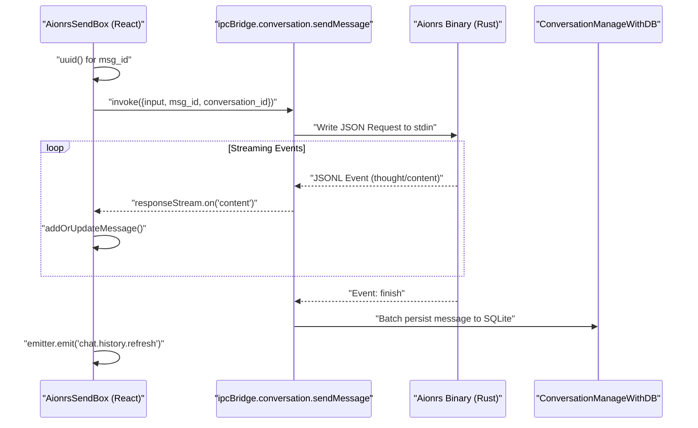
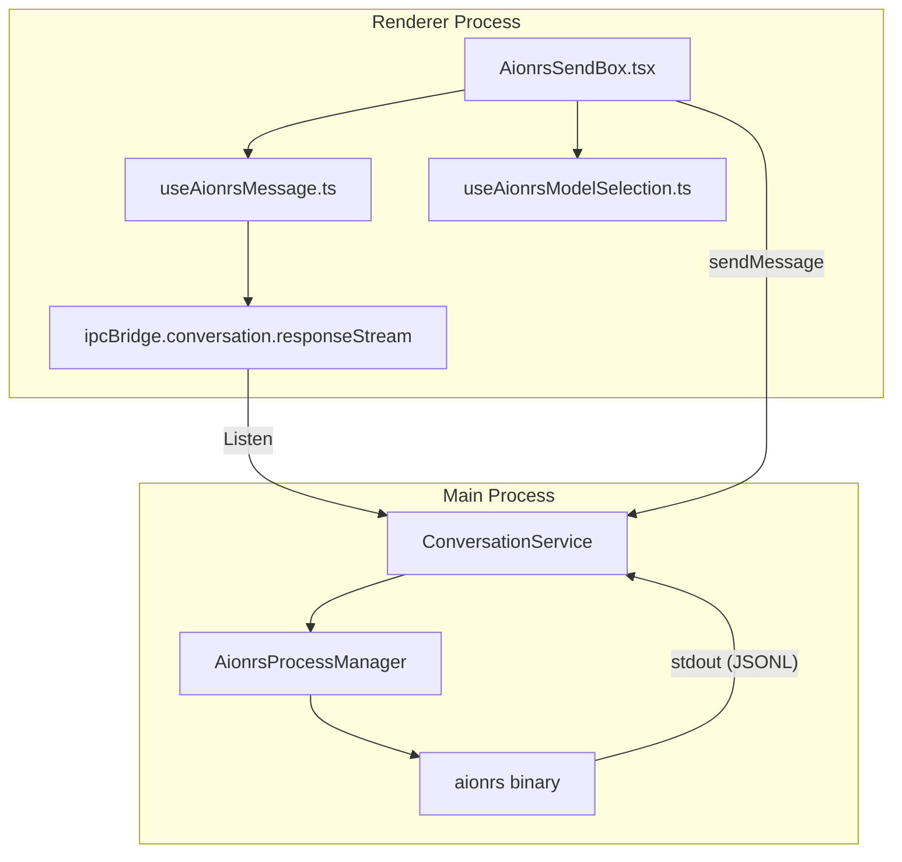

# Aionrs Agent

Relevant source files

The following files were used as context for generating this wiki page:

- [src/process/agent/openclaw/OpenClawGatewayConnection.ts](src/process/agent/openclaw/OpenClawGatewayConnection.ts)
- [src/process/agent/openclaw/types.ts](src/process/agent/openclaw/types.ts)
- [src/process/agent/remote/types.ts](src/process/agent/remote/types.ts)
- [src/process/bridge/remoteAgentBridge.ts](src/process/bridge/remoteAgentBridge.ts)
- [src/process/services/database/index.ts](src/process/services/database/index.ts)
- [src/process/services/database/migrations.ts](src/process/services/database/migrations.ts)
- [src/process/services/database/schema.ts](src/process/services/database/schema.ts)
- [src/renderer/components/chat/CommandQueuePanel.tsx](src/renderer/components/chat/CommandQueuePanel.tsx)
- [src/renderer/hooks/system/useCommandQueueEnabled.ts](src/renderer/hooks/system/useCommandQueueEnabled.ts)
- [src/renderer/pages/conversation/platforms/acp/AcpSendBox.tsx](src/renderer/pages/conversation/platforms/acp/AcpSendBox.tsx)
- [src/renderer/pages/conversation/platforms/aionrs/AionrsSendBox.tsx](src/renderer/pages/conversation/platforms/aionrs/AionrsSendBox.tsx)
- [src/renderer/pages/conversation/platforms/gemini/GeminiSendBox.tsx](src/renderer/pages/conversation/platforms/gemini/GeminiSendBox.tsx)
- [src/renderer/pages/conversation/platforms/gemini/useGeminiMessage.ts](src/renderer/pages/conversation/platforms/gemini/useGeminiMessage.ts)
- [src/renderer/pages/conversation/platforms/nanobot/NanobotSendBox.tsx](src/renderer/pages/conversation/platforms/nanobot/NanobotSendBox.tsx)
- [src/renderer/pages/conversation/platforms/openclaw/OpenClawSendBox.tsx](src/renderer/pages/conversation/platforms/openclaw/OpenClawSendBox.tsx)
- [src/renderer/pages/conversation/platforms/remote/RemoteSendBox.tsx](src/renderer/pages/conversation/platforms/remote/RemoteSendBox.tsx)
- [src/renderer/pages/conversation/platforms/useConversationCommandQueue.ts](src/renderer/pages/conversation/platforms/useConversationCommandQueue.ts)
- [tests/unit/RemoteAgentCore.test.ts](tests/unit/RemoteAgentCore.test.ts)
- [tests/unit/RemoteAgentManager.test.ts](tests/unit/RemoteAgentManager.test.ts)
- [tests/unit/RemoteSendBox.dom.test.tsx](tests/unit/RemoteSendBox.dom.test.tsx)
- [tests/unit/geminiAgentManagerThinking.test.ts](tests/unit/geminiAgentManagerThinking.test.ts)
- [tests/unit/normalizeWsUrl.test.ts](tests/unit/normalizeWsUrl.test.ts)
- [tests/unit/process/services/database/index.test.ts](tests/unit/process/services/database/index.test.ts)
- [tests/unit/remoteAgentBridge.test.ts](tests/unit/remoteAgentBridge.test.ts)
- [tests/unit/renderer/conversationCommandQueue.dom.test.tsx](tests/unit/renderer/conversationCommandQueue.dom.test.tsx)
- [tests/unit/renderer/conversationCommandQueue.test.ts](tests/unit/renderer/conversationCommandQueue.test.ts)
- [tests/unit/renderer/platformSendBoxes.dom.test.tsx](tests/unit/renderer/platformSendBoxes.dom.test.tsx)
- [tests/unit/schema.test.ts](tests/unit/schema.test.ts)
- [tests/unit/usePresetAssistantInfo.dom.test.ts](tests/unit/usePresetAssistantInfo.dom.test.ts)

The **Aionrs Agent** is a bundled, Rust-based agent specialized for high-performance CLI interactions and local environment management. Unlike the standard ACP (Agent Communication Protocol) agents which typically rely on Node.js or external runtimes, Aionrs is distributed as a pre-compiled binary optimized for the host architecture.

### Binary Resolution & Lifecycle
Aionrs follows a strict resolution strategy to ensure compatibility across Windows, macOS, and Linux. The system identifies the correct binary based on the `process.platform` and `process.arch` at runtime.

#### Resolution Strategy
1.  **Bundled Path**: The system looks for the binary within the application's `resources` or `bin` directory (depending on whether it is running in development or a packaged production build).
2.  **Permission Management**: On Unix-based systems (macOS/Linux), the application ensures the binary has executable permissions (`chmod +x`) before attempting to spawn the process.
3.  **Spawn Configuration**: The agent is spawned as a background child process. It inherits environment variables necessary for tool execution but runs in an isolated shell session to prevent terminal pollution.

**Sources:** [src/renderer/pages/conversation/platforms/aionrs/AionrsSendBox.tsx:175-185](), [src/process/services/database/schema.ts:43-54]()

### Communication Protocol
Aionrs communicates with the AionUi main process using a **JSON-line (JSONL) event stream** over standard I/O (`stdio`). Each line emitted by the binary is a discrete JSON object representing an agent state change or a content fragment.

| Event Type | Description |
| :--- | :--- |
| `thought` | Incremental updates for the agent's internal reasoning/planning process. |
| `content` | Streaming text fragments intended for the user. |
| `tool_call` | Requests to execute local tools (filesystem, shell, etc.). |
| `token_usage` | Metadata regarding context window consumption. |
| `finish` | Signal that the current response turn is complete. |

**Sources:** [src/renderer/pages/conversation/platforms/aionrs/AionrsSendBox.tsx:99-100](), [src/renderer/pages/conversation/platforms/aionrs/AionrsSendBox.tsx:181-185]()

### Session Management
Aionrs sessions are tied to specific workspaces. When a conversation is initialized, the agent is provided with a `workspacePath` which serves as its root directory for all file operations.

#### Data Flow: Message Sending
The following diagram illustrates the flow from user input in the `AionrsSendBox` to the Rust binary and back to the UI.

**Aionrs Message Flow**

**Sources:** [src/renderer/pages/conversation/platforms/aionrs/AionrsSendBox.tsx:147-185](), [src/process/services/database/index.ts:90-114]()

### Differences from ACP Agents
While both Aionrs and ACP agents (like those documented in section 4.3) use JSON-based communication, they differ in execution model and capability:

| Feature | Aionrs Agent | ACP Agent |
| :--- | :--- | :--- |
| **Runtime** | Native Rust Binary | Node.js / Python / Executable |
| **Protocol** | JSON-Line (JSONL) | JSON-RPC 2.0 |
| **Tooling** | Built-in high-perf tools | External MCP Servers |
| **Transport** | Stdio | Stdio or TCP/HTTP |
| **Resolution** | Bundled with App | Resolved via `npx` or local path |

### Implementation Details

#### SendBox Integration
The `AionrsSendBox` component manages the input state, file attachments, and command queuing. It utilizes `useAionrsMessage` to track the streaming state (thoughts, token usage, and processing status).

**Code Entity Relationship: Aionrs UI to Process**

**Key Functions:**
- `executeCommand`: Orchestrates the `uuid` generation, UI optimistic update, and the IPC call to trigger the agent. [src/renderer/pages/conversation/platforms/aionrs/AionrsSendBox.tsx:147-190]()
- `checkAndUpdateTitle`: A debounced utility that updates the conversation name in the database based on the first few messages. [src/renderer/pages/conversation/platforms/aionrs/AionrsSendBox.tsx:174-174]()
- `assertBridgeSuccess`: Validates that the IPC bridge successfully communicated with the backend process before proceeding. [src/renderer/pages/conversation/platforms/aionrs/AionrsSendBox.tsx:181-181]()

**Sources:** [src/renderer/pages/conversation/platforms/aionrs/AionrsSendBox.tsx:88-100](), [src/renderer/pages/conversation/platforms/aionrs/AionrsSendBox.tsx:147-190](), [src/process/services/database/schema.ts:61-71]()