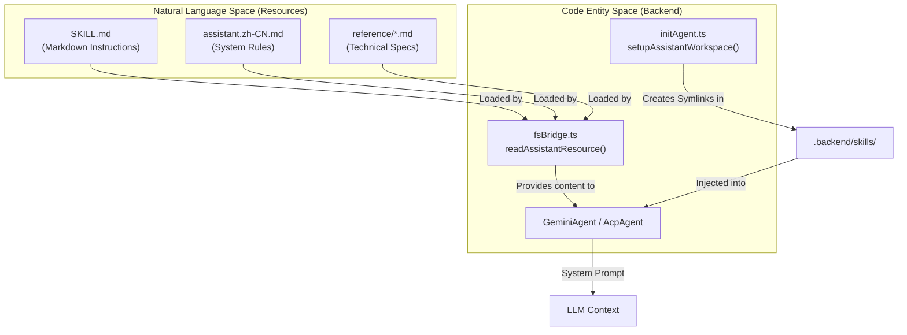
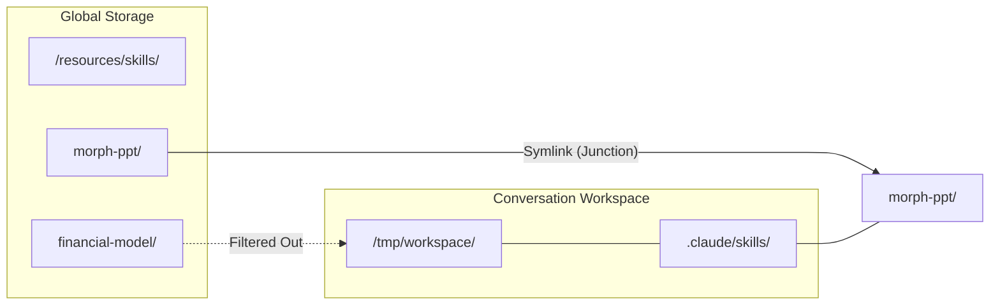

# Assistant Presets & Skills

Relevant source files

The following files were used as context for generating this wiki page:

- [.claude/commands/package-assistant.md](.claude/commands/package-assistant.md)
- [src/common/config/presets/assistantPresets.ts](src/common/config/presets/assistantPresets.ts)
- [src/process/resources/assistant/academic-paper/academic-paper.md](src/process/resources/assistant/academic-paper/academic-paper.md)
- [src/process/resources/assistant/academic-paper/academic-paper.zh-CN.md](src/process/resources/assistant/academic-paper/academic-paper.zh-CN.md)
- [src/process/resources/assistant/dashboard-creator/dashboard-creator.md](src/process/resources/assistant/dashboard-creator/dashboard-creator.md)
- [src/process/resources/assistant/dashboard-creator/dashboard-creator.zh-CN.md](src/process/resources/assistant/dashboard-creator/dashboard-creator.zh-CN.md)
- [src/process/resources/assistant/financial-model-creator/financial-model-creator.md](src/process/resources/assistant/financial-model-creator/financial-model-creator.md)
- [src/process/resources/assistant/financial-model-creator/financial-model-creator.zh-CN.md](src/process/resources/assistant/financial-model-creator/financial-model-creator.zh-CN.md)
- [src/process/resources/assistant/morph-ppt/morph-ppt.md](src/process/resources/assistant/morph-ppt/morph-ppt.md)
- [src/process/resources/assistant/morph-ppt/morph-ppt.zh-CN.md](src/process/resources/assistant/morph-ppt/morph-ppt.zh-CN.md)
- [src/process/resources/skills/_builtin/office-cli/SKILL.md](src/process/resources/skills/_builtin/office-cli/SKILL.md)
- [src/process/resources/skills/morph-ppt/SKILL.md](src/process/resources/skills/morph-ppt/SKILL.md)
- [src/process/resources/skills/morph-ppt/reference/decision-rules.md](src/process/resources/skills/morph-ppt/reference/decision-rules.md)
- [src/process/resources/skills/morph-ppt/reference/morph-helpers.py](src/process/resources/skills/morph-ppt/reference/morph-helpers.py)
- [src/process/resources/skills/morph-ppt/reference/officecli-pptx-min.md](src/process/resources/skills/morph-ppt/reference/officecli-pptx-min.md)
- [src/process/resources/skills/morph-ppt/reference/pptx-design.md](src/process/resources/skills/morph-ppt/reference/pptx-design.md)
- [src/process/resources/skills/morph-ppt/reference/quality-gates.md](src/process/resources/skills/morph-ppt/reference/quality-gates.md)
- [src/process/resources/skills/morph-ppt/reference/styles/INDEX.md](src/process/resources/skills/morph-ppt/reference/styles/INDEX.md)
- [src/process/resources/skills/morph-ppt/reference/styles/bw--brutalist-raw/build.sh](src/process/resources/skills/morph-ppt/reference/styles/bw--brutalist-raw/build.sh)
- [src/process/resources/skills/morph-ppt/reference/styles/dark--cosmic-neon/style.md](src/process/resources/skills/morph-ppt/reference/styles/dark--cosmic-neon/style.md)
- [src/process/resources/skills/morph-ppt/reference/styles/dark--cyber-future/style.md](src/process/resources/skills/morph-ppt/reference/styles/dark--cyber-future/style.md)
- [src/process/resources/skills/morph-ppt/reference/styles/dark--luxury-minimal/style.md](src/process/resources/skills/morph-ppt/reference/styles/dark--luxury-minimal/style.md)
- [src/process/resources/skills/morph-ppt/reference/styles/dark--neon-productivity/style.md](src/process/resources/skills/morph-ppt/reference/styles/dark--neon-productivity/style.md)
- [src/process/resources/skills/morph-ppt/reference/styles/dark--space-odyssey/style.md](src/process/resources/skills/morph-ppt/reference/styles/dark--space-odyssey/style.md)
- [src/process/resources/skills/morph-ppt/reference/styles/warm--playful-organic/style.md](src/process/resources/skills/morph-ppt/reference/styles/warm--playful-organic/style.md)
- [src/process/resources/skills/officecli-academic-paper/SKILL.md](src/process/resources/skills/officecli-academic-paper/SKILL.md)
- [src/process/resources/skills/officecli-academic-paper/creating.md](src/process/resources/skills/officecli-academic-paper/creating.md)
- [src/process/resources/skills/officecli-data-dashboard/SKILL.md](src/process/resources/skills/officecli-data-dashboard/SKILL.md)
- [src/process/resources/skills/officecli-data-dashboard/creating.md](src/process/resources/skills/officecli-data-dashboard/creating.md)
- [src/process/resources/skills/officecli-docx/SKILL.md](src/process/resources/skills/officecli-docx/SKILL.md)
- [src/process/resources/skills/officecli-docx/creating.md](src/process/resources/skills/officecli-docx/creating.md)
- [src/process/resources/skills/officecli-docx/editing.md](src/process/resources/skills/officecli-docx/editing.md)
- [src/process/resources/skills/officecli-financial-model/SKILL.md](src/process/resources/skills/officecli-financial-model/SKILL.md)
- [src/process/resources/skills/officecli-financial-model/creating.md](src/process/resources/skills/officecli-financial-model/creating.md)
- [src/process/resources/skills/officecli-pitch-deck/SKILL.md](src/process/resources/skills/officecli-pitch-deck/SKILL.md)
- [src/process/resources/skills/officecli-pitch-deck/creating.md](src/process/resources/skills/officecli-pitch-deck/creating.md)
- [src/process/resources/skills/officecli-pptx/SKILL.md](src/process/resources/skills/officecli-pptx/SKILL.md)
- [src/process/resources/skills/officecli-pptx/creating.md](src/process/resources/skills/officecli-pptx/creating.md)
- [src/process/resources/skills/officecli-pptx/editing.md](src/process/resources/skills/officecli-pptx/editing.md)
- [src/process/resources/skills/officecli-xlsx/SKILL.md](src/process/resources/skills/officecli-xlsx/SKILL.md)
- [src/process/resources/skills/officecli-xlsx/editing.md](src/process/resources/skills/officecli-xlsx/editing.md)

This document describes the assistant preset system and skill management in AionUi. Assistant presets define pre-configured AI agents with specific capabilities and behaviors, while skills provide modular, reusable functionality that can be enabled or disabled for any assistant. For information about the broader agent architecture, see [AI Agent Systems](). For model configuration, see [Model Configuration & API Management]().

---

## Overview

The assistant system consists of two primary components:

1.  **Assistant Presets**: Pre-configured agent definitions with system instructions, default models, and enabled skills (defined in `src/process/resources/assistant/` directory).
2.  **Skills**: Modular capability definitions that provide tools and instructions to agents (defined in `src/process/resources/skills/` directory).

AionUi ships with **12+ built-in assistant presets** and supports modular skill loading. Skills are loaded from the filesystem and filtered based on configuration before being injected into the agent's context.

---

## Assistant Preset Architecture

### Assistant Definition Structure

Assistant presets are defined as `AssistantPreset` objects in `src/common/config/presets/assistantPresets.ts`.

| Component | Description | Code Property |
| :--- | :--- | :--- |
| **ID** | Unique identifier for the assistant | `id` |
| **Avatar** | Emoji or icon representing the assistant | `avatar` |
| **System Rules** | Core behavioral instructions and guidelines | `ruleFiles` (mapping locale to `.md`) |
| **Agent Type** | Backend agent implementation (gemini, acp, etc.) | `presetAgentType` |
| **Enabled Skills** | List of skill names to load from the skills directory | `defaultEnabledSkills` |
| **Resource Dir** | Directory containing the markdown rules and local resources | `resourceDir` |

**Sources:** [src/common/config/presets/assistantPresets.ts:3-23]()

### Built-in Assistant Presets

AionUi includes specialized assistants for document creation, financial modeling, and academic research:

| Assistant ID | Avatar | Default Skills | Purpose |
| :--- | :--- | :--- | :--- |
| `word-creator` | 📝 | `officecli-docx` | Professional Word document creation |
| `ppt-creator` | 📊 | `officecli-pptx` | PowerPoint presentation generation |
| `excel-creator` | 📈 | `officecli-xlsx` | Financial models and data analysis |
| `morph-ppt` | ✨ | `morph-ppt` | Morph-animated presentations |
| `pitch-deck-creator`| 🎯 | `officecli-pitch-deck` | Investor and sales decks |
| `financial-model-creator` | 💰 | `officecli-financial-model` | Formula-driven 3-statement models |
| `academic-paper` | 🎓 | `officecli-academic-paper` | Scholarly papers with LaTeX math |

**Sources:** [src/common/config/presets/assistantPresets.ts:25-182]()

---

## Skills System

### Skill Definition Format

Skills are defined in the `src/process/resources/skills/` directory. Each skill folder contains a `SKILL.md` file (the "manual" for the LLM) and optional `reference/` documents providing technical specifications.

**Example: Morph PPT Skill (`morph-ppt`)**
The Morph PPT skill provides a complex workflow for generating animated presentations:
*   **Core Logic**: Uses `officecli` to manipulate OpenXML shapes by matching names.
*   **Scene Actors**: Defines persistent shapes with `!!` prefix (e.g., `!!scene-ring`) that evolve across slides.
*   **Ghosting**: Moves shapes to `x=36cm` (off-screen) instead of deleting them to maintain animation state.
*   **Workaround**: Uses shape index paths instead of name paths after `transition=morph` is set due to CLI name-prepending behavior.

**Sources:** [src/process/resources/skills/morph-ppt/SKILL.md:1-61](), [src/process/resources/skills/morph-ppt/reference/pptx-design.md:113-158]()

### Skill Loading and Injection

Skills are loaded into the agent's workspace during initialization. The system maps "Natural Language Space" (the markdown instructions) to "Code Entity Space" (the filesystem and agent configuration).

#### Skill Loading Data Flow

**Sources:** [src/process/bridge/fsBridge.ts:88-121](), [src/process/utils/initAgent.ts:76-88]()

---

## Skill Filtering and Workspace Setup

When a conversation starts, the `setupAssistantWorkspace` function prepares the agent's environment by linking enabled skills.

### Native Skill Support
The system checks if the selected backend supports native skills via `hasNativeSkillSupport`. This determines if skills are injected via the system prompt or via a dedicated directory in the workspace.

**Sources:** [tests/unit/initAgent.skills.test.ts:90-126]()

### Symlink Injection
For supported backends, AionUi creates a hidden directory (e.g., `.claude/skills/` or `.codex/skills/`) inside the conversation workspace. It then creates symlinks (junctions on Windows) from the global skills directory to this local workspace, allowing the agent to read reference materials directly.

**Sources:** [tests/unit/initAgent.skills.test.ts:155-171](), [tests/unit/initAgent.skills.test.ts:206-210]()

---

## Implementation Details

### Resource Resolution (`fsBridge.ts`)
The `fsBridge` handles the retrieval of assistant rules and skill definitions. It implements a fallback logic:
1.  **User Data Directory**: Checks `userData/assistants/` for customized versions.
2.  **Built-in Directory**: Falls back to the application's internal resources.
3.  **Locale Fallback**: Tries the requested locale (e.g., `zh-CN`), then `en-US`.

**Sources:** [src/process/bridge/fsBridge.ts:88-121]()

### Skill Context Injection
Once skills are linked, the agent (e.g., `GeminiAgent`) reads these markdown files and prepends them to the system prompt.

**Example: `officecli` Skill Injection**
When the `officecli` skill is enabled, the agent receives instructions on:
*   **Help System**: Using `officecli pptx set shape.fill` to learn syntax in real-time.
*   **Resident Mode**: Using `open`/`close` for multi-step workflows to avoid file I/O overhead.
*   **Stable IDs**: Preferring `@id=` or `@paraId=` paths in Word/PPT for reliable addressing during edits.

**Sources:** [src/process/resources/skills/_builtin/office-cli/SKILL.md:36-62](), [src/process/resources/skills/_builtin/office-cli/SKILL.md:127-154]()

### Specialized Skill Workflows

#### Financial Modeling (`officecli-financial-model`)
*   **Assumptions-First**: Mandatory rule that all hardcoded inputs go on the "Assumptions" sheet.
*   **Color Coding**: Blue (`0000FF`) for inputs, Black (`000000`) for formulas, Green (`008000`) for cross-sheet references.
*   **Build Order**: Strict 10-step sequence (Setup -> Headers -> Assumptions -> Formulas -> Formatting -> Charts -> Validation).

**Sources:** [src/process/resources/skills/officecli-financial-model/SKILL.md:85-91](), [src/process/resources/skills/officecli-financial-model/creating.md:101-134]()

#### Academic Paper (`officecli-academic-paper`)
*   **Style-First**: Defines all Word styles (Heading1, FootnoteText, etc.) before adding content.
*   **LaTeX Support**: Maps LaTeX math subsets (fractions, sums, matrices) to Word's OMML format.
*   **TOC Management**: Native Word Table of Contents field (levels 1-3).

**Sources:** [src/process/resources/skills/officecli-academic-paper/SKILL.md:77-80](), [src/process/resources/skills/officecli-academic-paper/SKILL.md:93-112]()