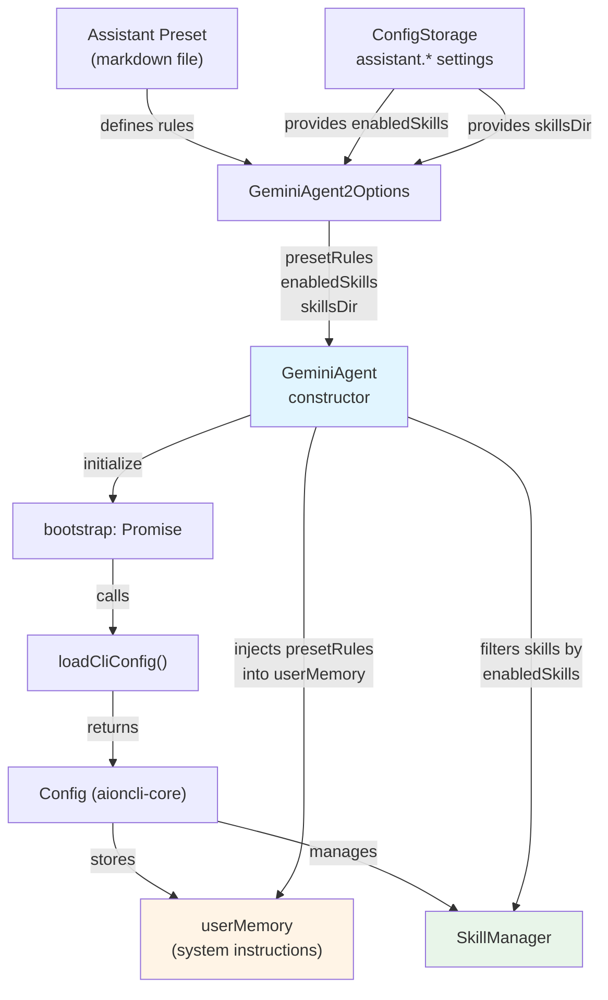
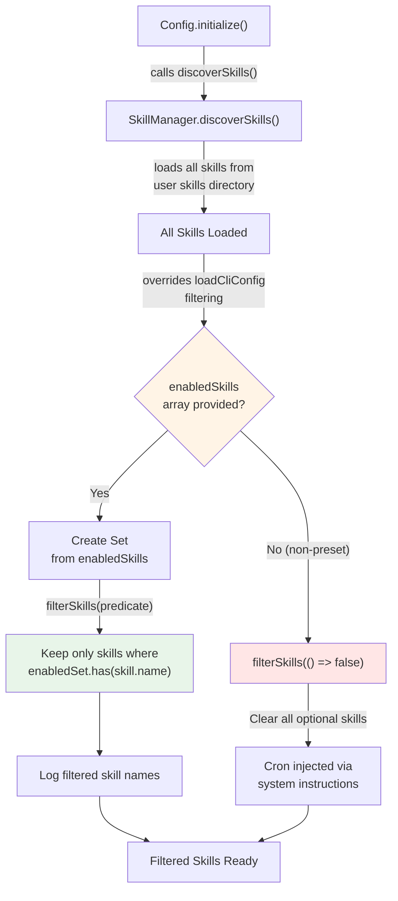
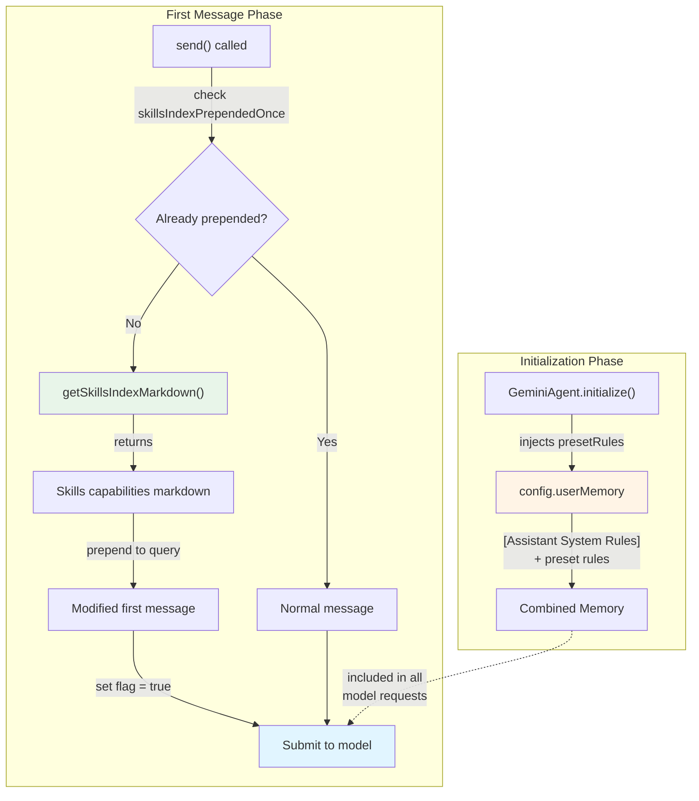

# Assistant Presets & Skills

<details>
<summary>Relevant source files</summary>

The following files were used as context for generating this wiki page:

- [readme.md](readme.md)
- [readme_ch.md](readme_ch.md)
- [readme_es.md](readme_es.md)
- [readme_jp.md](readme_jp.md)
- [readme_ko.md](readme_ko.md)
- [readme_pt.md](readme_pt.md)
- [readme_tr.md](readme_tr.md)
- [readme_tw.md](readme_tw.md)
- [resources/wechat_group4.png](resources/wechat_group4.png)
- [src/agent/gemini/cli/atCommandProcessor.ts](src/agent/gemini/cli/atCommandProcessor.ts)
- [src/agent/gemini/cli/config.ts](src/agent/gemini/cli/config.ts)
- [src/agent/gemini/cli/errorParsing.ts](src/agent/gemini/cli/errorParsing.ts)
- [src/agent/gemini/cli/tools/web-fetch.ts](src/agent/gemini/cli/tools/web-fetch.ts)
- [src/agent/gemini/cli/tools/web-search.ts](src/agent/gemini/cli/tools/web-search.ts)
- [src/agent/gemini/cli/types.ts](src/agent/gemini/cli/types.ts)
- [src/agent/gemini/cli/useReactToolScheduler.ts](src/agent/gemini/cli/useReactToolScheduler.ts)
- [src/agent/gemini/index.ts](src/agent/gemini/index.ts)
- [src/agent/gemini/utils.ts](src/agent/gemini/utils.ts)
- [src/process/services/mcpServices/McpOAuthService.ts](src/process/services/mcpServices/McpOAuthService.ts)

</details>

This document describes the assistant preset system and skill management in AionUi. Assistant presets define pre-configured AI agents with specific capabilities and behaviors, while skills provide modular, reusable functionality that can be enabled or disabled for any assistant. For information about the broader agent architecture, see [AI Agent Systems](#4). For model configuration, see [Model Configuration & API Management](#4.7).

---

## Overview

The assistant system consists of two primary components:

1. **Assistant Presets**: Pre-configured agent definitions with system instructions, default models, and enabled skills (defined in `assistant/` directory as markdown files)
2. **Skills**: Modular capability definitions that provide tools and instructions to agents (defined in `skills/` directory)

AionUi ships with **12 built-in assistant presets** and supports custom skill creation and management. Skills are loaded from the `skills/` directory and filtered based on configuration before being injected into the agent's context.

---

## Assistant Preset Architecture

### Assistant Definition Structure

Each assistant preset consists of:

| Component          | Description                                             | Location                                              |
| ------------------ | ------------------------------------------------------- | ----------------------------------------------------- |
| **System Rules**   | Core behavioral instructions and guidelines             | Injected into `userMemory` at agent initialization    |
| **Default Model**  | Preferred model for the assistant                       | Stored in configuration as `assistant.*.defaultModel` |
| **Enabled Skills** | List of skill names to load                             | Stored as `assistant.*.enabledSkills` array           |
| **Agent Type**     | Backend agent implementation (gemini, acp, codex, etc.) | Stored as `assistant.*.agent`                         |

**Built-in Assistant Presets:**

```
🤝 Cowork                - Autonomous task execution with file operations
📊 PPTX Generator        - PowerPoint presentation generation
📄 PDF to PPT            - PDF to PowerPoint conversion
🎮 3D Game               - Single-file 3D game generation
🎨 UI/UX Pro Max         - Professional UI/UX design (57 styles, 95 palettes)
📋 Planning with Files   - Manus-style persistent Markdown planning
🧭 HUMAN 3.0 Coach       - Personal development coaching
📣 Social Job Publisher  - Job posting and distribution
🦞 moltbook              - Zero-deployment AI agent social networking
📈 Beautiful Mermaid     - Diagram generation (flowcharts, sequences)
🔧 OpenClaw Setup        - OpenClaw integration assistant
📖 Story Roleplay        - Immersive roleplay with character cards
```

**Sources:** [readme.md:143-178](), [readme_ch.md:143-178]()

---

### Preset Injection Flow



**Injection Points:**

1. **System Rules** → `userMemory` at initialization [src/agent/gemini/index.ts:372-385]()
2. **Skills Index** → Prepended to first message [src/agent/gemini/index.ts:107-108]()
3. **Enabled Skills** → Filtered via `SkillManager.filterSkills()` [src/agent/gemini/index.ts:335-342]()

**Sources:** [src/agent/gemini/index.ts:63-149](), [src/agent/gemini/cli/config.ts:70-152]()

---

## Skills System

### Skill Definition Format

Skills are markdown files located in the `skills/` directory. Each skill provides:

- **Tool descriptions**: What tools the agent can use
- **Usage instructions**: How to use the tools effectively
- **Capability definitions**: What the skill enables the agent to do

**Built-in Skill Examples:**

```
pptx      - PowerPoint file generation
docx      - Word document creation
pdf       - PDF file operations
xlsx      - Excel spreadsheet processing
mermaid   - Diagram generation
cron      - Scheduled task execution
```

**Sources:** [readme.md:174]()

---

### Skill Loading Pipeline

```mermaid
graph LR
    subgraph "Configuration"
        OPTS["GeminiAgent2Options"]
        OPTS -->|"skillsDir<br/>enabledSkills"| LOADCLI["loadCliConfig()"]
    end

    subgraph "Load Phase"
        LOADCLI -->|"skillsDir path"| LOADSKILLS["loadSkillsFromDir()"]
        LOADSKILLS -->|returns| SKILLARRAY["SkillDefinition[]"]
        SKILLARRAY -->|stored in| CONFIG["Config object"]
    end

    subgraph "Filter Phase"
        CONFIG -->|"getSkillManager()"| SKILLMGR["SkillManager"]
        ENABLEDSET["Set<string><br/>(from enabledSkills)"]
        SKILLMGR -->|"filterSkills(predicate)"| FILTER["skill => enabledSet.has(skill.name)"]
        ENABLEDSET -.->|used by| FILTER
        FILTER -->|keeps only| FILTERED["Filtered Skills"]
    end

    subgraph "Injection Phase"
        FILTERED -->|"getSkillsIndexMarkdown()"| INDEX["Skills Index Markdown"]
        INDEX -->|"prepended to first message"| FIRSTMSG["First User Message"]
    end

    style CONFIG fill:#e1f5ff
    style SKILLMGR fill:#e8f5e9
    style FILTER fill:#fff4e6
```



**Loading Steps:**

1. **Load from directory**: `loadSkillsFromDir(skillsDir)` reads all `.md` files from the skills directory [src/agent/gemini/cli/config.ts:138-149]()
2. **Store in Config**: Skills are registered with the `Config` object's `SkillManager`
3. **Filter by enabled list**: `filterSkills()` removes skills not in `enabledSkills` array [src/agent/gemini/index.ts:335-342]()
4. **Generate index**: `getSkillsIndexMarkdown()` creates a consolidated markdown summary
5. **Inject into context**: Skills index is prepended to the first user message once [src/agent/gemini/index.ts:107-108]()

**Sources:** [src/agent/gemini/index.ts:329-342](), [src/agent/gemini/cli/config.ts:70-152]()

---

### Skill Filtering Logic

The filtering process ensures only enabled skills are available to the agent:



**Key Implementation Details:**

| Scenario                      | Behavior                                                  | Code Location                         |
| ----------------------------- | --------------------------------------------------------- | ------------------------------------- |
| **Preset with enabledSkills** | Filter to only enabled skills                             | [src/agent/gemini/index.ts:335-339]() |
| **Non-preset agent**          | Clear all optional skills (cron via system instructions)  | [src/agent/gemini/index.ts:340-342]() |
| **After Config.initialize()** | Re-apply filter (discoverSkills overrides initial filter) | [src/agent/gemini/index.ts:331-342]() |

**Sources:** [src/agent/gemini/index.ts:329-342]()

---

## Context Injection

### Injection Strategy

AionUi uses a two-phase injection strategy to incorporate assistant presets and skills into the agent context:



**Injection Timing:**

| Component        | Injection Point      | Persistence                                        | Code Reference                        |
| ---------------- | -------------------- | -------------------------------------------------- | ------------------------------------- |
| **presetRules**  | Agent initialization | Persisted in `userMemory` for all requests         | [src/agent/gemini/index.ts:372-385]() |
| **Skills Index** | First message send   | Prepended once via flag `skillsIndexPrependedOnce` | [src/agent/gemini/index.ts:107-108]() |

**Backward Compatibility:**

The system maintains backward compatibility with `contextContent`:

```typescript
// Prefer presetRules, fallback to contextContent
this.contextContent = options.contextContent || options.presetRules
```

[src/agent/gemini/index.ts:135]()

**Sources:** [src/agent/gemini/index.ts:100-108](), [src/agent/gemini/index.ts:372-385]()

---

## Configuration Interface

### GeminiAgent Options

The `GeminiAgent2Options` interface defines how presets and skills are configured:

```typescript
interface GeminiAgent2Options {
  workspace: string
  model: TProviderWithModel
  // ... other options

  // System rules, injected into userMemory at initialization
  presetRules?: string

  // Builtin skills directory path (loaded by aioncli-core SkillManager)
  skillsDir?: string

  // Enabled skills list for filtering skills in SkillManager
  enabledSkills?: string[]

  // Backward compatible (deprecated)
  contextContent?: string
}
```

[src/agent/gemini/index.ts:63-81]()

### LoadCliConfig Integration

Skills and presets flow through `loadCliConfig()` to configure the `Config` object:

```typescript
interface LoadCliConfigOptions {
  workspace: string
  settings: Settings
  // ... other options

  // Builtin skills directory path
  skillsDir?: string

  // Enabled skills list for filtering loaded skills
  enabledSkills?: string[]
}
```

[src/agent/gemini/cli/config.ts:54-68]()

**Configuration Flow:**

1. `GeminiAgent` receives `presetRules`, `skillsDir`, `enabledSkills`
2. Calls `loadCliConfig()` with these parameters
3. `loadCliConfig()` invokes `loadSkillsFromDir(skillsDir)` if provided
4. Skills are registered with `Config` via `SkillManager`
5. `GeminiAgent.initialize()` filters skills by `enabledSkills`
6. `GeminiAgent.initialize()` injects `presetRules` into `userMemory`

**Sources:** [src/agent/gemini/index.ts:118-149](), [src/agent/gemini/cli/config.ts:70-152]()

---

## Storage and Persistence

### Configuration Schema

Assistant preset settings are stored in `ConfigStorage`:

```typescript
interface IConfigStorageRefer {
  // Per-assistant configuration
  'assistant.*.defaultModel': string // Preferred model
  'assistant.*.agent': string // Agent type (gemini, acp, etc.)
  'assistant.*.enabledSkills': string[] // Enabled skill names

  // ... other config fields
}
```

**Storage Keys:**

- `assistant.cowork.defaultModel` → Default model for Cowork assistant
- `assistant.cowork.enabledSkills` → Array like `["pptx", "docx", "mermaid"]`
- `assistant.pptx-generator.agent` → Agent type for PPTX Generator

### Skill File Organization

```
skills/
├── pptx.md          - PowerPoint generation capabilities
├── docx.md          - Word document capabilities
├── pdf.md           - PDF operations
├── xlsx.md          - Excel processing
├── mermaid.md       - Diagram generation
├── cron.md          - Scheduled tasks
└── custom-skill.md  - User-defined skills
```

Skills are loaded from this directory via `loadSkillsFromDir()` from `@office-ai/aioncli-core`.

**Sources:** [readme.md:174](), [src/agent/gemini/cli/config.ts:138-149]()

---

## Implementation Details

### Preset Rules Injection

System rules are injected into `userMemory` during agent initialization:

```typescript
// Inject presetRules into userMemory at initialization
if (this.presetRules) {
  const currentMemory = this.config.getUserMemory()
  const rulesSection = `[Assistant System Rules]\
${this.presetRules}`
  const combined = currentMemory
    ? `${rulesSection}\
\
${currentMemory}`
    : rulesSection
  this.config.setUserMemory(combined)
  console.log(`[GeminiAgent] Injected presetRules into userMemory`)
}
```

[src/agent/gemini/index.ts:372-385]()

**Injection Format:**

```
[Assistant System Rules]
<preset rules content>

<existing userMemory content>
```

This ensures system rules are always included in the model's system instructions.

### Skills Index Prepending

Skills are prepended to the first user message only once:

```typescript
private skillsIndexPrependedOnce = false; // Track if skills prepended

// In send() method:
if (!this.skillsIndexPrependedOnce) {
  const skillsIndex = this.config.getSkillsIndexMarkdown();
  if (skillsIndex) {
    query = skillsIndex + "\
\
" + query;
    this.skillsIndexPrependedOnce = true;
  }
}
```

[src/agent/gemini/index.ts:107-108]() (flag declaration)

**Rationale:**

- **Skills define capabilities**: They describe what tools/functions the agent has access to
- **Runtime injection**: Skills are injected when the conversation starts, not at system level
- **One-time operation**: Flag prevents duplicate injection on subsequent messages

### Post-Initialization Filtering

Skills must be re-filtered after `Config.initialize()` completes:

```typescript
// aioncli-core's SkillManager.discoverSkills() reloads all skills,
// overriding our filtering in loadCliConfig, so re-apply filter here
if (this.enabledSkills && this.enabledSkills.length > 0) {
  const enabledSet = new Set(this.enabledSkills)
  this.config
    .getSkillManager()
    .filterSkills((skill) => enabledSet.has(skill.name))
  console.log(`[GeminiAgent] Filtered skills: ${this.enabledSkills.join(', ')}`)
} else {
  // Non-preset agent: clear all optional skills
  this.config.getSkillManager().filterSkills(() => false)
}
```

[src/agent/gemini/index.ts:331-342]()

**Why Re-filtering is Needed:**

1. `loadCliConfig()` loads and filters skills initially
2. `Config.initialize()` calls `SkillManager.discoverSkills()`
3. `discoverSkills()` reloads ALL skills from user directory, overriding the filter
4. Must re-apply `enabledSkills` filter after initialization completes

**Sources:** [src/agent/gemini/index.ts:329-342]()

---

## Usage Examples

### Creating a Custom Assistant Preset

1. **Define system rules** in a markdown file (e.g., `assistant/my-assistant.md`)
2. **Configure in settings**:
   ```typescript
   {
     'assistant.my-assistant.defaultModel': 'gemini-2.5-pro-latest',
     'assistant.my-assistant.agent': 'gemini',
     'assistant.my-assistant.enabledSkills': ['pptx', 'docx', 'mermaid']
   }
   ```
3. **Load preset** via `GeminiAgent`:
   ```typescript
   const agent = new GeminiAgent({
     workspace: '/path/to/workspace',
     model: modelConfig,
     presetRules: fs.readFileSync('assistant/my-assistant.md', 'utf-8'),
     skillsDir: '/path/to/skills',
     enabledSkills: ['pptx', 'docx', 'mermaid'],
   })
   ```

### Creating a Custom Skill

1. **Create skill file**: `skills/my-skill.md`

   ```markdown
   # My Custom Skill

   ## Capabilities

   - Tool X: Does action Y
   - Tool Z: Processes data W

   ## Usage

   Use tool X when you need to...
   ```

2. **Enable in assistant configuration**:
   ```typescript
   'assistant.my-assistant.enabledSkills': ['my-skill', 'pptx']
   ```
3. **Skill will be loaded** from `skillsDir` and filtered by `enabledSkills`

**Sources:** [readme.md:174-177](), [src/agent/gemini/index.ts:118-149]()

---

## Key Takeaways

| Aspect                 | Summary                                                                            |
| ---------------------- | ---------------------------------------------------------------------------------- |
| **Assistant Presets**  | Pre-configured agents with system rules, default models, and enabled skills        |
| **Skills**             | Modular capability definitions in markdown files, loaded from `skills/` directory  |
| **Injection Strategy** | Two-phase: presetRules → userMemory (init), skills index → first message (runtime) |
| **Filtering**          | Skills filtered by `enabledSkills` array after `Config.initialize()` completes     |
| **Storage**            | Assistant settings stored in ConfigStorage with `assistant.*` keys                 |
| **Extensibility**      | Users can create custom assistants and skills by adding markdown files             |

**Sources:** [src/agent/gemini/index.ts:63-385](), [src/agent/gemini/cli/config.ts:54-152](), [readme.md:143-178]()
