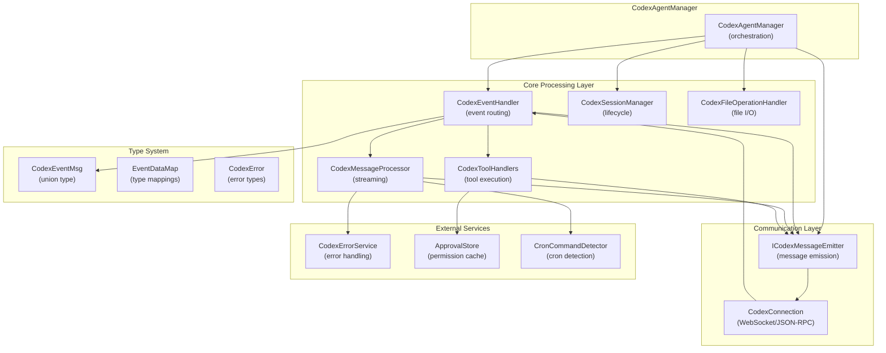
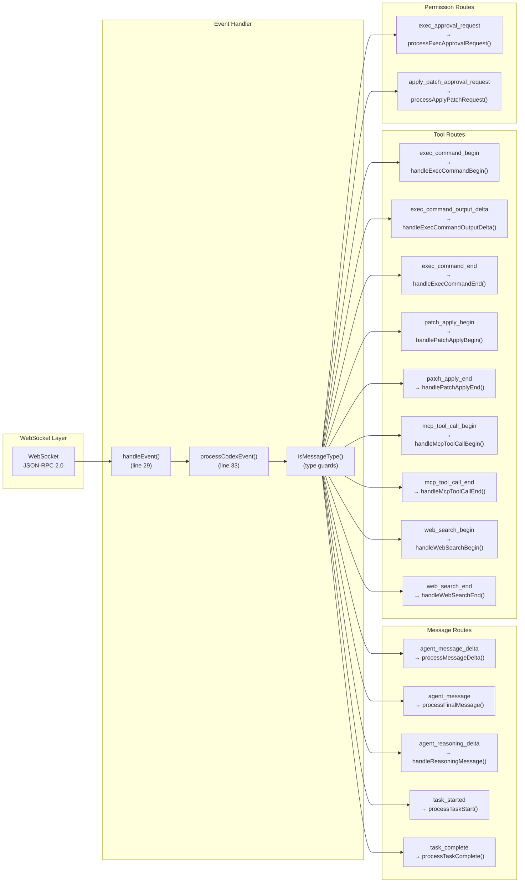
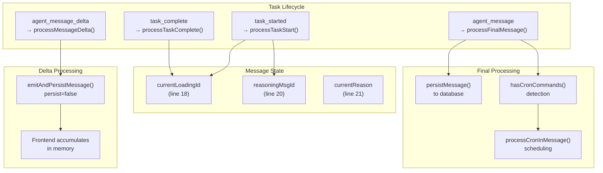
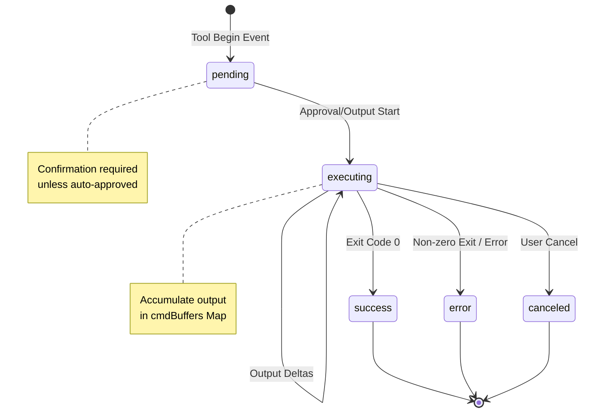
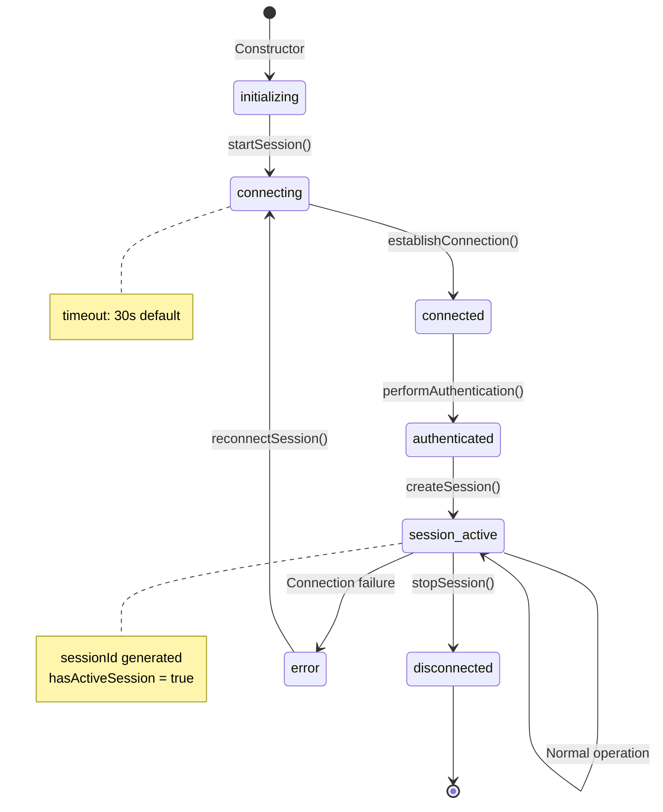
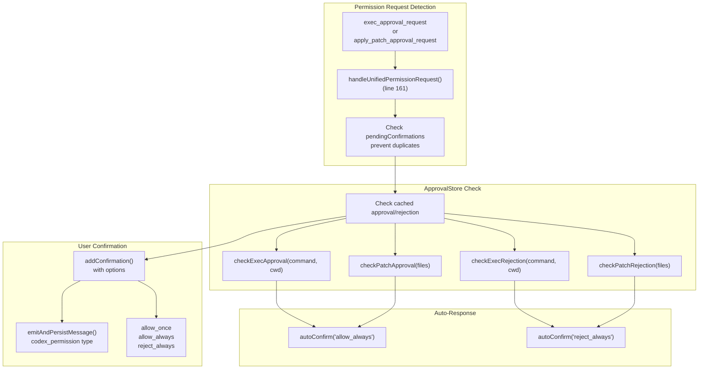

# Codex Agent System

<details>
<summary>Relevant source files</summary>

The following files were used as context for generating this wiki page:

- [src/agent/codex/core/ErrorService.ts](src/agent/codex/core/ErrorService.ts)
- [src/agent/codex/handlers/CodexEventHandler.ts](src/agent/codex/handlers/CodexEventHandler.ts)
- [src/agent/codex/handlers/CodexFileOperationHandler.ts](src/agent/codex/handlers/CodexFileOperationHandler.ts)
- [src/agent/codex/handlers/CodexSessionManager.ts](src/agent/codex/handlers/CodexSessionManager.ts)
- [src/agent/codex/handlers/CodexToolHandlers.ts](src/agent/codex/handlers/CodexToolHandlers.ts)
- [src/agent/codex/messaging/CodexMessageProcessor.ts](src/agent/codex/messaging/CodexMessageProcessor.ts)
- [src/common/codex/types/eventData.ts](src/common/codex/types/eventData.ts)
- [src/common/codex/types/eventTypes.ts](src/common/codex/types/eventTypes.ts)

</details>

## Purpose and Scope

The Codex Agent System provides integration with the Codex CLI (a code-editing AI agent) through a WebSocket-based JSON-RPC protocol. This system processes streaming events from Codex, manages tool executions (command execution, file patches, MCP tools, web search), and maintains session lifecycle. For information about the higher-level multi-agent architecture, see [AI Agent Systems](#4). For MCP server integration details, see [MCP Integration](#4.6).

The Codex agent operates as one of five agent backends in AionUi, offering capabilities including:

- Real-time streaming of agent messages and reasoning
- Command execution with permission controls
- File patch application and diff tracking
- MCP tool invocation
- Web search integration
- Cron command detection and scheduling

## Architecture Overview

### Component Hierarchy



**Component Roles**

| Component                   | File                                                      | Primary Responsibility                                      |
| --------------------------- | --------------------------------------------------------- | ----------------------------------------------------------- |
| `CodexEventHandler`         | [src/agent/codex/handlers/CodexEventHandler.ts]()         | Routes incoming JSON-RPC events to specialized processors   |
| `CodexMessageProcessor`     | [src/agent/codex/messaging/CodexMessageProcessor.ts]()    | Handles streaming message deltas and reasoning updates      |
| `CodexToolHandlers`         | [src/agent/codex/handlers/CodexToolHandlers.ts]()         | Manages tool execution lifecycle (exec, patch, MCP, search) |
| `CodexSessionManager`       | [src/agent/codex/handlers/CodexSessionManager.ts]()       | Controls session state machine and connection health        |
| `CodexFileOperationHandler` | [src/agent/codex/handlers/CodexFileOperationHandler.ts]() | Performs file system operations with preview updates        |
| `CodexErrorService`         | [src/agent/codex/core/ErrorService.ts]()                  | Standardizes error codes and retry logic                    |

Sources: [src/agent/codex/handlers/CodexEventHandler.ts:15-27](), [src/agent/codex/messaging/CodexMessageProcessor.ts:17-26](), [src/agent/codex/handlers/CodexToolHandlers.ts:23-38]()

## Event Processing Pipeline

### Event Flow Architecture



Sources: [src/agent/codex/handlers/CodexEventHandler.ts:29-156]()

### Event Type System

The Codex agent uses a discriminated union type `CodexEventMsg` for type-safe event handling. Each event type is validated using type guards before processing.

**Core Event Categories**

| Category              | Event Types                                                     | Processing Strategy                     |
| --------------------- | --------------------------------------------------------------- | --------------------------------------- |
| **Session Lifecycle** | `session_configured`, `task_started`, `task_complete`           | State transitions, metadata extraction  |
| **Message Streaming** | `agent_message_delta`, `agent_message`, `agent_reasoning_delta` | Delta accumulation, final persistence   |
| **Tool Execution**    | `exec_command_begin/output_delta/end`, `patch_apply_begin/end`  | Buffering, status tracking              |
| **MCP Tools**         | `mcp_tool_call_begin`, `mcp_tool_call_end`                      | Navigation intercept, result formatting |
| **Web Search**        | `web_search_begin`, `web_search_end`                            | Query tracking, result aggregation      |
| **Permissions**       | `exec_approval_request`, `apply_patch_approval_request`         | ApprovalStore check, confirmation UI    |
| **Metadata**          | `token_count`, `turn_diff`, `agent_reasoning_section_break`     | Telemetry, diff display                 |

**Event Filtering Strategy**

The handler implements selective event processing to reduce noise:

```typescript
// High-frequency events are not logged (line 37-39)
if (
  type !== 'agent_message_delta' &&
  type !== 'agent_reasoning_delta' &&
  type !== 'agent_reasoning'
) {
  console.log(`[CodexEventHandler] event: ${type}`)
}

// agent_reasoning is ignored - only deltas are processed (line 42-44)
if (type === 'agent_reasoning') {
  return
}
```

Sources: [src/agent/codex/handlers/CodexEventHandler.ts:33-156](), [src/common/codex/types/eventData.ts:24-54](), [src/common/codex/types/eventTypes.ts:1-360]()

## Message Processing and Streaming

### Streaming Architecture



### Dual-Phase Message Strategy

The message processor implements a critical optimization: streaming deltas are emitted to the UI in real-time but not persisted to the database, while the final complete message is persisted but not emitted (to avoid duplicate UI rendering).

**Delta Phase (Real-time Display)**

[src/agent/codex/messaging/CodexMessageProcessor.ts:82-93]()

```typescript
processMessageDelta(msg: Extract<CodexEventMsg, { type: 'agent_message_delta' }>) {
  const deltaMessage = {
    type: 'content' as const,
    conversation_id: this.conversation_id,
    msg_id: this.currentLoadingId, // Fixed ID for accumulation
    data: msg.delta,
  };
  // Delta messages: only emit to frontend for streaming display, do NOT persist
  this.messageEmitter.emitAndPersistMessage(deltaMessage, false);
}
```

**Final Phase (Database Persistence)**

[src/agent/codex/messaging/CodexMessageProcessor.ts:95-137]()

```typescript
processFinalMessage(msg: Extract<CodexEventMsg, { type: 'agent_message' }>) {
  // Final message: only persist to database, do NOT emit to frontend
  // Frontend has already shown the content via deltas

  const transformedMessage: TMessage = {
    id: this.currentLoadingId || uuid(),
    msg_id: this.currentLoadingId,
    type: 'text' as const,
    position: 'left' as const,
    conversation_id: this.conversation_id,
    content: { content: msg.message },
    status: 'finish', // Mark as finished for cron detection
    createdAt: Date.now(),
  };

  this.messageEmitter.persistMessage(transformedMessage);
}
```

### Reasoning Message Handling

Reasoning messages use a similar accumulation pattern but maintain a separate message ID (`reasoningMsgId`) and buffer (`currentReason`). Section breaks reset the buffer without creating new message IDs.

[src/agent/codex/messaging/CodexMessageProcessor.ts:58-80]()

Sources: [src/agent/codex/messaging/CodexMessageProcessor.ts:17-230]()

### Cron Command Detection

The final message processing phase integrates with the cron system to detect scheduled task commands. When cron commands are detected, system responses are collected and fed back to the AI agent.

[src/agent/codex/messaging/CodexMessageProcessor.ts:113-136]()

```typescript
if (hasCronCommands(messageText)) {
  const collectedResponses: string[] = []
  await processCronInMessage(
    this.conversation_id,
    'codex',
    transformedMessage,
    (sysMsg) => {
      collectedResponses.push(sysMsg)
      // Also emit to frontend for display
      ipcBridge.codexConversation.responseStream.emit({
        type: 'system',
        conversation_id: this.conversation_id,
        msg_id: uuid(),
        data: sysMsg,
      })
    }
  )

  // Send collected responses back to AI agent so it can continue
  if (collectedResponses.length > 0 && this.messageEmitter.sendMessageToAgent) {
    const feedbackMessage = `[System Response]\
${collectedResponses.join(
  '\
'
)}`
    await this.messageEmitter.sendMessageToAgent(feedbackMessage)
  }
}
```

Sources: [src/agent/codex/messaging/CodexMessageProcessor.ts:113-136](), [src/process/task/CronCommandDetector.ts](), [src/process/task/MessageMiddleware.ts]()

## Tool Execution System

### Tool Call Lifecycle



### Command Execution Flow

The command execution system implements a three-phase lifecycle with output buffering and base64 decoding.

**Phase 1: Begin**

[src/agent/codex/handlers/CodexToolHandlers.ts:41-57]()

```typescript
handleExecCommandBegin(msg: Extract<CodexEventMsg, { type: 'exec_command_begin' }>) {
  const callId = msg.call_id;
  const cmd = Array.isArray(msg.command) ? msg.command.join(' ') : String(msg.command);

  // Initialize buffer for output accumulation
  this.cmdBuffers.set(callId, { stdout: '', stderr: '', combined: '' });

  // Mark as pending confirmation
  this.pendingConfirmations.add(callId);

  // Emit CodexToolCall with subtype for UI rendering
  this.emitCodexToolCall(callId, {
    status: 'pending',
    kind: 'execute',
    subtype: 'exec_command_begin',
    data: msg,
    description: cmd,
    startTime: Date.now(),
  });
}
```

**Phase 2: Output Streaming**

The handler decodes base64-encoded output chunks from Codex and accumulates them in memory buffers.

[src/agent/codex/handlers/CodexToolHandlers.ts:59-92]()

```typescript
handleExecCommandOutputDelta(msg: Extract<CodexEventMsg, { type: 'exec_command_output_delta' }>) {
  const callId = msg.call_id;
  let chunk = msg.chunk;

  // Handle base64-encoded chunks from Codex
  if (this.isValidBase64(chunk)) {
    try {
      chunk = Buffer.from(chunk, 'base64').toString('utf-8');
    } catch {
      // Use original string if decoding fails
    }
  }

  const buf = this.cmdBuffers.get(callId) || { stdout: '', stderr: '', combined: '' };
  if (msg.stream === 'stderr') buf.stderr += chunk;
  else buf.stdout += chunk;
  buf.combined += chunk;
  this.cmdBuffers.set(callId, buf);

  // Emit update with accumulated output
  this.emitCodexToolCall(callId, {
    status: 'executing',
    kind: 'execute',
    subtype: 'exec_command_output_delta',
    data: msg,
    content: [{ type: 'output', output: buf.combined }],
  });
}
```

**Phase 3: Completion**

[src/agent/codex/handlers/CodexToolHandlers.ts:94-124]()

The handler determines final status based on exit code, with 0 indicating success and non-zero indicating error. Buffers are cleaned up after completion.

### Patch Application Flow

File patch operations follow a similar lifecycle but include an additional auto-approval mechanism and immediate change application.

**Patch Begin with Auto-Approval**

[src/agent/codex/handlers/CodexToolHandlers.ts:127-158]()

```typescript
handlePatchApplyBegin(msg: Extract<CodexEventMsg, { type: 'patch_apply_begin' }>) {
  const callId = msg.call_id || uuid();
  const summary = this.summarizePatch(msg.changes);

  // Cache both summary and raw changes
  this.patchBuffers.set(callId, summary);
  if (msg.changes && typeof msg.changes === 'object') {
    this.patchChanges.set(callId, msg.changes);
  }

  // Set confirmation only if not auto-approved
  if (!msg.auto_approved) {
    this.pendingConfirmations.add(callId);
  }

  // Emit tool call with appropriate status
  this.emitCodexToolCall(callId, {
    status: msg.auto_approved ? 'executing' : 'pending',
    kind: 'execute',
    subtype: 'patch_apply_begin',
    data: msg,
    description: `apply_patch auto_approved=${msg.auto_approved}`,
    startTime: Date.now(),
    content: [{ type: 'output', output: summary }],
  });

  // If auto-approved, immediately attempt to apply changes
  if (msg.auto_approved) {
    this.applyPatchChanges(callId);
  }
}
```

**FileChange Type Handling**

The patch system supports multiple `FileChange` formats (modern `add`/`delete`/`update` structure and legacy `action` field) as defined in [src/common/codex/types/eventData.ts:224-242]().

Sources: [src/agent/codex/handlers/CodexToolHandlers.ts:23-436]()

### MCP Tool Integration

MCP (Model Context Protocol) tool calls follow a specialized flow with navigation interception for chrome-devtools tools.

**Navigation Interception**

[src/agent/codex/handlers/CodexToolHandlers.ts:188-226]()

```typescript
handleMcpToolCallBegin(msg: Extract<CodexEventMsg, { type: 'mcp_tool_call_begin' }>) {
  const inv = msg.invocation || {};
  const toolName = String(inv.tool || inv.name || inv.method || 'unknown');
  const callId = (msg as unknown as { call_id?: string }).call_id || `mcp_${toolName}_${uuid()}`;

  // Intercept chrome-devtools navigation tools using unified NavigationInterceptor
  const interceptionResult = NavigationInterceptor.intercept(
    {
      toolName,
      server: String(inv.server || ''),
      arguments: inv.arguments as Record<string, unknown>,
    },
    this.conversation_id
  );

  if (interceptionResult.intercepted && interceptionResult.previewMessage) {
    // Emit preview_open message to trigger preview panel
    this.messageEmitter.emitAndPersistMessage(interceptionResult.previewMessage, false);
  }

  // Continue normal tool call flow
  this.emitCodexToolCall(callId, {
    status: 'executing',
    kind: 'execute',
    subtype: 'mcp_tool_call_begin',
    data: msg,
    description: `${this.formatMcpInvocation(inv)} (beginning)`,
    startTime: Date.now(),
  });
}
```

The `NavigationInterceptor` detects tools like `navigate_chrome_devtools` and emits `preview_open` messages to trigger the preview panel, preventing navigation events from being lost.

Sources: [src/agent/codex/handlers/CodexToolHandlers.ts:188-262](), [src/common/navigation/NavigationInterceptor.ts]()

### Web Search Integration

Web search operations are treated as tool calls with begin/end lifecycle events. The system tracks search queries and buffers output.

[src/agent/codex/handlers/CodexToolHandlers.ts:264-297]()

Sources: [src/agent/codex/handlers/CodexToolHandlers.ts:264-297]()

### Turn Diff Rendering

Turn diff events display file changes made during a conversation turn. These use the `patch` kind for proper UI rendering.

[src/agent/codex/handlers/CodexToolHandlers.ts:331-344]()

```typescript
handleTurnDiff(msg: Extract<CodexEventMsg, { type: 'turn_diff' }>) {
  // Generate unique call ID since turn_diff doesn't provide one
  const callId = `turn_diff_${Date.now()}_${Math.random().toString(36).substring(2, 11)}`;

  this.emitCodexToolCall(callId, {
    status: 'success',
    kind: 'patch', // Use patch kind for diff display
    subtype: 'turn_diff',
    data: msg,
    description: 'File changes summary',
    startTime: Date.now(),
    endTime: Date.now(),
  });
}
```

Sources: [src/agent/codex/handlers/CodexToolHandlers.ts:331-344]()

## Session Management

### Session State Machine



### Session Lifecycle Management

The `CodexSessionManager` provides unified connection state management modeled after the ACP agent's session handling.

**Session Configuration**

[src/agent/codex/handlers/CodexSessionManager.ts:13-18]()

```typescript
export interface CodexSessionConfig {
  conversation_id: string
  cliPath?: string
  workingDir: string
  timeout?: number // 30s default
}
```

**Connection Sequence**

[src/agent/codex/handlers/CodexSessionManager.ts:44-71]()

The connection sequence follows a four-phase state progression:

1. **Connecting** - Establish WebSocket connection
2. **Connected** - Connection established
3. **Authenticated** - Authentication complete (handled by Codex CLI)
4. **Session Active** - Session created with generated session ID

**Status Broadcasting**

The session manager emits status updates using a global status message ID to prevent duplicate status messages across conversations.

[src/agent/codex/handlers/CodexSessionManager.ts:25-26]()

```typescript
// Global status management, ensuring all Codex sessions share state
const globalStatusMessageId: string = 'codex_status_global'
```

[src/agent/codex/handlers/CodexSessionManager.ts:154-170]()

```typescript
private setStatus(status: CodexSessionStatus): void {
  this.status = status;

  this.messageEmitter.emitAndPersistMessage({
    type: 'agent_status',
    conversation_id: this.config.conversation_id,
    msg_id: globalStatusMessageId, // Use global status message ID
    data: {
      backend: 'codex',
      status,
      sessionId: this.sessionId,
      isConnected: this.isConnected,
      hasActiveSession: this.hasActiveSession,
    },
  });
}
```

**Health Monitoring**

[src/agent/codex/handlers/CodexSessionManager.ts:136-140]()

```typescript
checkSessionHealth(): boolean {
  return this.isConnected &&
         this.hasActiveSession &&
         this.status === 'session_active';
}
```

**Reconnection Logic**

[src/agent/codex/handlers/CodexSessionManager.ts:145-149]()

```typescript
async reconnectSession(): Promise<void> {
  await this.stopSession();
  await new Promise((resolve) => setTimeout(resolve, 1000)); // 1 second cooldown
  await this.startSession();
}
```

Sources: [src/agent/codex/handlers/CodexSessionManager.ts:1-303]()

## File Operations System

### File Operation Types

The file operation handler supports three primary operations with streaming updates to the preview panel.

**Operation Type Matrix**

| Operation  | Methods                            | Preview Update           | Database Persist     |
| ---------- | ---------------------------------- | ------------------------ | -------------------- |
| **Write**  | `fs/write_text_file`, `file_write` | `contentUpdate` event    | Message with preview |
| **Read**   | `fs/read_text_file`, `file_read`   | None                     | Message only         |
| **Delete** | `fs/delete_file`, `file_delete`    | `contentUpdate` (delete) | Message only         |

### File Write with Preview Streaming

File write operations emit real-time content updates to the preview panel via the IPC `fileStream.contentUpdate` channel.

[src/agent/codex/handlers/CodexFileOperationHandler.ts:71-104]()

```typescript
private async handleFileWrite(operation: FileOperation): Promise<void> {
  const fullPath = this.resolveFilePath(operation.path);
  const content = operation.content || '';

  // Ensure directory exists
  const dir = path.dirname(fullPath);
  await fs.mkdir(dir, { recursive: true });

  // Write file
  await fs.writeFile(fullPath, content, 'utf-8');

  // Send streaming content update to preview panel (for real-time updates)
  try {
    const eventData = {
      filePath: fullPath,
      content: content,
      workspace: this.workingDirectory,
      relativePath: operation.path,
      operation: 'write' as const,
    };

    ipcBridge.fileStream.contentUpdate.emit(eventData);
  } catch (error) {
    console.error('[CodexFileOperationHandler] ❌ Failed to emit file stream update:', error);
  }

  // Send operation feedback message
  this.emitFileOperationMessage({
    method: 'fs/write_text_file',
    path: operation.path,
    content: content,
  });
}
```

### Batch Change Application

The handler can apply multiple file changes atomically, used during patch application.

[src/agent/codex/handlers/CodexFileOperationHandler.ts:262-280]()

```typescript
async applyBatchChanges(changes: Record<string, FileChange>): Promise<void> {
  const operations: Promise<void>[] = [];

  for (const [filePath, change] of Object.entries(changes)) {
    if (typeof change === 'object' && change !== null) {
      const action = this.getChangeAction(change); // Handles both modern and legacy formats
      const content = this.getChangeContent(change);
      const operation: FileOperation = {
        method: action === 'delete' ? 'fs/delete_file' : 'fs/write_text_file',
        path: filePath,
        content,
        action,
      };
      operations.push(this.handleFileOperation(operation).then((): void => void 0));
    }
  }

  await Promise.all(operations);
}
```

### Path Resolution

The handler ensures all file paths are resolved relative to the workspace directory.

[src/agent/codex/handlers/CodexFileOperationHandler.ts:178-183]()

```typescript
private resolveFilePath(filePath: string): string {
  if (path.isAbsolute(filePath)) {
    return filePath;
  }
  return path.resolve(this.workingDirectory, filePath);
}
```

Sources: [src/agent/codex/handlers/CodexFileOperationHandler.ts:1-320]()

## Permission and Approval System

### Unified Permission Request Flow



### Permission Request Processing

The event handler implements unified permission handling that checks cached approvals before prompting the user.

**Exec Approval Flow**

[src/agent/codex/handlers/CodexEventHandler.ts:182-249]()

```typescript
private processExecApprovalRequest(msg: Extract<CodexEventMsg, { type: 'exec_approval_request' }>, unifiedRequestId: string) {
  const callId = msg.call_id || uuid();
  const command = msg.command;
  const cwd = msg.cwd;

  // Store exec metadata for ApprovalStore
  this.toolHandlers.storeExecRequestMeta(unifiedRequestId, { command, cwd });

  // Check ApprovalStore for cached rejection first
  if (this.messageEmitter.checkExecRejection?.(command, cwd)) {
    console.log(`[CodexEventHandler] exec auto-rejected by ApprovalStore: ${unifiedRequestId}`);
    this.messageEmitter.autoConfirm?.(unifiedRequestId, 'reject_always');
    return;
  }

  // Check ApprovalStore for cached approval
  if (this.messageEmitter.checkExecApproval?.(command, cwd)) {
    console.log(`[CodexEventHandler] exec auto-approved by ApprovalStore: ${unifiedRequestId}`);
    this.messageEmitter.autoConfirm?.(unifiedRequestId, 'allow_always');
    return;
  }

  // Need user confirmation - create options and add to confirmation queue
  const displayInfo = getPermissionDisplayInfo(PermissionType.COMMAND_EXECUTION);
  const options = createPermissionOptionsForType(PermissionType.COMMAND_EXECUTION);
  const description = msg.reason || `${displayInfo.icon} Codex wants to execute command: ${Array.isArray(msg.command) ? msg.command.join(' ') : msg.command}`;

  this.messageEmitter.addConfirmation({
    title: displayInfo.titleKey,
    id: unifiedRequestId,
    action: 'exec',
    description: description,
    callId: unifiedRequestId,
    options: options.map((opt) => ({
      label: opt.name,
      value: opt.optionId,
    })),
  });

  // Persist permission request for history
  this.messageEmitter.emitAndPersistMessage({
    type: 'codex_permission',
    msg_id: unifiedRequestId,
    conversation_id: this.conversation_id,
    data: {
      subtype: 'exec_approval_request',
      title: displayInfo.titleKey,
      description: description,
      agentType: 'codex',
      sessionId: '',
      options: options,
      requestId: callId,
      data: msg,
    },
  }, true);
}
```

**Patch Approval Flow**

[src/agent/codex/handlers/CodexEventHandler.ts:251-321]()

The patch approval flow extracts file paths from the `changes` object and checks them against the ApprovalStore. Cached approvals/rejections use the same file paths as the cache key.

### Permission Option Types

The system supports multiple permission option types defined in [src/common/codex/types/permissionTypes.ts]():

| Option ID             | Behavior                     | Cache Behavior          |
| --------------------- | ---------------------------- | ----------------------- |
| `allow_once`          | Approve this single request  | Not cached              |
| `allow_always`        | Approve and cache for future | Cached in ApprovalStore |
| `allow_always_tool`   | Approve tool across sessions | Cached by tool name     |
| `allow_always_server` | Approve MCP server           | Cached by server name   |
| `reject_always`       | Reject and cache             | Cached in ApprovalStore |

### Deduplication Strategy

The handler maintains a `pendingConfirmations` Set to prevent duplicate permission requests for the same `call_id`.

[src/agent/codex/handlers/CodexEventHandler.ts:161-180]()

```typescript
private handleUnifiedPermissionRequest(msg: ...) {
  const callId = msg.call_id || uuid();
  const unifiedRequestId = `permission_${callId}`;

  // Check if we've already processed this call_id to avoid duplicates
  if (this.toolHandlers.getPendingConfirmations().has(unifiedRequestId)) {
    return;
  }

  // Mark this request as being processed
  this.toolHandlers.getPendingConfirmations().add(unifiedRequestId);

  // Route to appropriate handler based on event type
  if (msg.type === 'exec_approval_request') {
    this.processExecApprovalRequest(msg, unifiedRequestId);
  } else {
    this.processApplyPatchRequest(msg, unifiedRequestId);
  }
}
```

Sources: [src/agent/codex/handlers/CodexEventHandler.ts:98-321](), [src/common/codex/types/permissionTypes.ts](), [src/common/codex/utils/permissionHelpers.ts]()

## Error Handling System

### Error Code System

The Codex agent uses a standardized error code system for consistent error handling and user messaging.

**Error Code Categories**

[src/agent/codex/core/ErrorService.ts:1-97](), [src/common/codex/types/errorTypes.ts]()

| Error Code           | Category | Retryable | User Message Key                   |
| -------------------- | -------- | --------- | ---------------------------------- |
| `NETWORK_TIMEOUT`    | Network  | Yes       | `codex.network.network_timeout`    |
| `NETWORK_REFUSED`    | Network  | Yes       | `codex.network.connection_refused` |
| `CLOUDFLARE_BLOCKED` | Network  | No        | `codex.network.cloudflare_blocked` |
| `NETWORK_UNKNOWN`    | Network  | Yes       | `codex.network.unknown_error`      |
| `UNKNOWN_ERROR`      | System   | No        | `codex.network.unknown_error`      |

### Error Creation and Standardization

The `CodexErrorService` provides factory methods for creating typed errors.

[src/agent/codex/core/ErrorService.ts:13-28]()

```typescript
createError(code: string, message: string, options?: Partial<CodexError>): CodexError {
  const error = new Error(message) as CodexError;
  error.code = code;
  error.timestamp = new Date();
  error.retryCount = 0;

  if (options) {
    Object.assign(error, options);
  }

  return error;
}
```

### Network Error Detection

The `fromNetworkError` utility function analyzes error messages to determine the appropriate error code.

[src/agent/codex/core/ErrorService.ts:52-83]()

```typescript
export function fromNetworkError(
  originalError: string | Error,
  options: { source?: string; retryCount?: number } = {}
): CodexError {
  const errorMsg =
    typeof originalError === 'string' ? originalError : originalError.message
  const lowerMsg = errorMsg.toLowerCase()

  let code: string
  let userMessageKey: string

  if (lowerMsg.includes('403') && lowerMsg.includes('cloudflare')) {
    code = ERROR_CODES.CLOUDFLARE_BLOCKED
    userMessageKey = 'codex.network.cloudflare_blocked'
  } else if (lowerMsg.includes('timeout') || lowerMsg.includes('etimedout')) {
    code = ERROR_CODES.NETWORK_TIMEOUT
    userMessageKey = 'codex.network.network_timeout'
  } else if (
    lowerMsg.includes('connection refused') ||
    lowerMsg.includes('econnrefused')
  ) {
    code = ERROR_CODES.NETWORK_REFUSED
    userMessageKey = 'codex.network.connection_refused'
  } else {
    code = ERROR_CODES.UNKNOWN_ERROR
    userMessageKey = 'codex.network.unknown_error'
  }

  return globalErrorService.createError(code, errorMsg, {
    originalError:
      typeof originalError === 'string' ? undefined : originalError,
    userMessage: userMessageKey,
    retryCount: options.retryCount || 0,
    context: options.source,
    technicalDetails: {
      source: options.source,
      originalMessage: errorMsg,
    },
  })
}
```

### Retry Logic

The error service determines retry eligibility based on error codes and retry count.

[src/agent/codex/core/ErrorService.ts:36-42]()

```typescript
shouldRetry(error: CodexError): boolean {
  if (!error.retryCount) {
    error.retryCount = 0;
  }

  return error.retryCount < this.maxRetries &&
         this.retryableErrors.has(error.code);
}
```

The maximum retry count defaults to 3, and only errors in the `retryableErrors` Set are eligible for automatic retry.

### Stream Error Processing

The message processor handles stream errors with special retry message deduplication.

[src/agent/codex/messaging/CodexMessageProcessor.ts:139-181]()

```typescript
processStreamError(message: string) {
  // Use error service to create standardized error
  const codexError = globalErrorService.createError(ERROR_CODES.NETWORK_UNKNOWN, message, {
    context: 'CodexMessageProcessor.processStreamError',
    technicalDetails: {
      originalMessage: message,
      eventType: 'STREAM_ERROR',
    },
  });

  // Process through error service for user-friendly message
  const processedError = globalErrorService.handleError(codexError);
  const errorHash = this.generateErrorHash(message);

  // Detect message type: retry message vs final error message
  const isRetryMessage = message.includes('retrying');
  const isFinalError = !isRetryMessage && message.includes('error sending request');

  let msgId: string;
  if (isRetryMessage) {
    // All retry messages use the same ID for merging
    msgId = `stream_retry_${errorHash}`;
  } else if (isFinalError) {
    // Final error also uses retry message ID to replace it
    msgId = `stream_retry_${errorHash}`;
  } else {
    // Other errors use unique ID
    msgId = `stream_error_${errorHash}`;
  }

  const errorData = processedError.code
    ? `ERROR_${processedError.code}: ${message}`
    : processedError.userMessage || message;

  this.messageEmitter.emitAndPersistMessage({
    type: 'error',
    conversation_id: this.conversation_id,
    msg_id: msgId,
    data: errorData,
  });
}
```

**Error Hash Generation**

The processor generates consistent hashes for retry messages by normalizing the error message (removing retry count and delay).

[src/agent/codex/messaging/CodexMessageProcessor.ts:199-222]()

Sources: [src/agent/codex/core/ErrorService.ts:1-97](), [src/agent/codex/messaging/CodexMessageProcessor.ts:139-222](), [src/common/codex/types/errorTypes.ts]()
