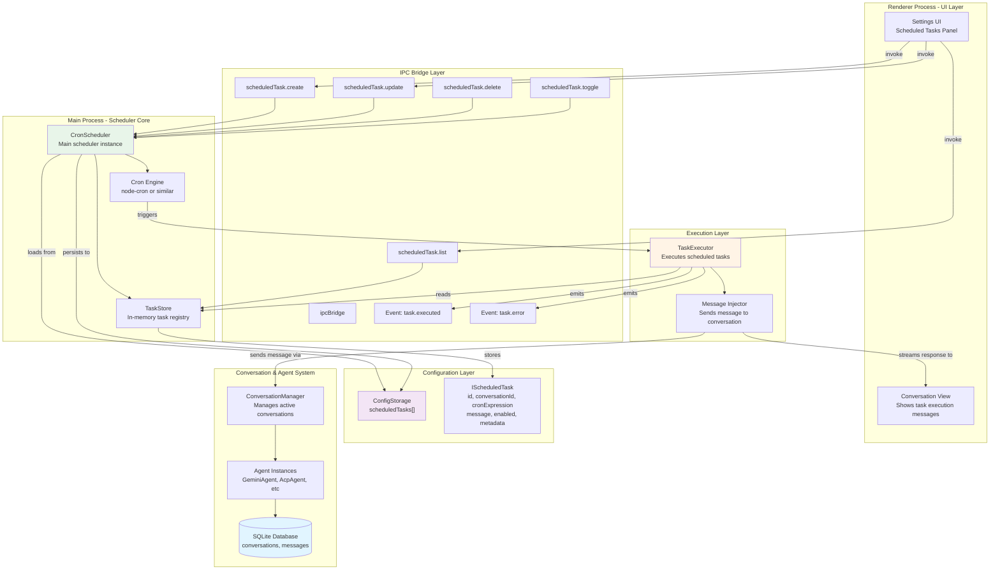
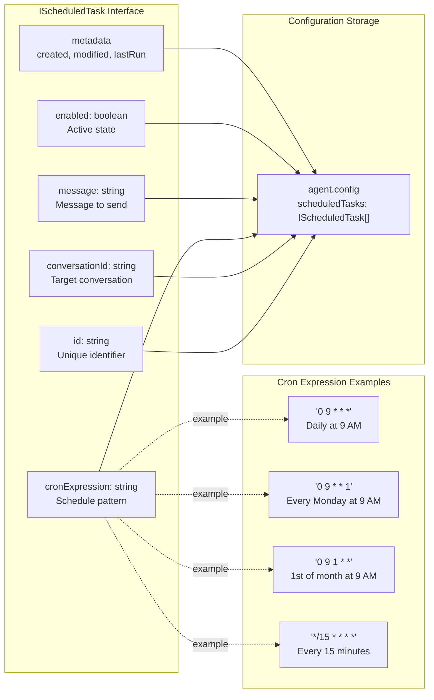
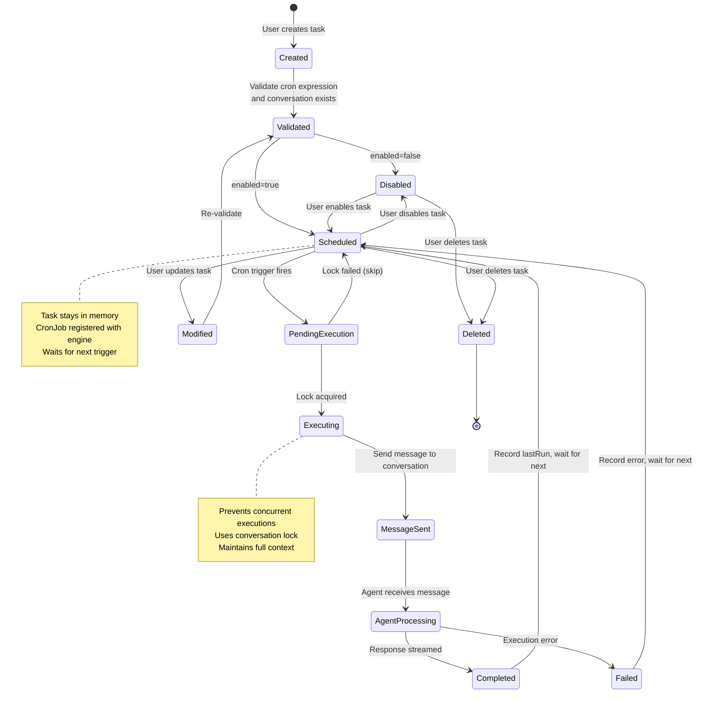
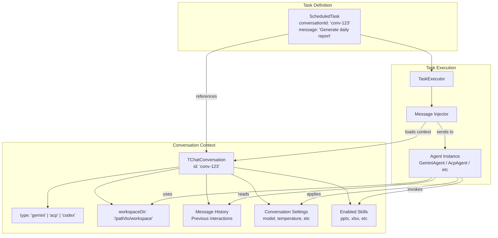
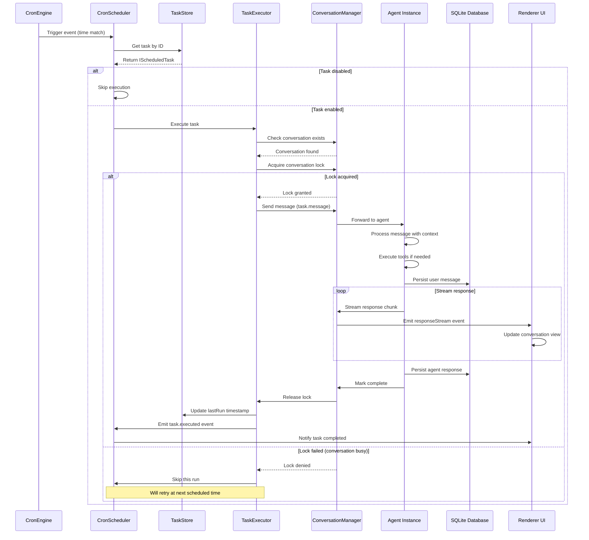
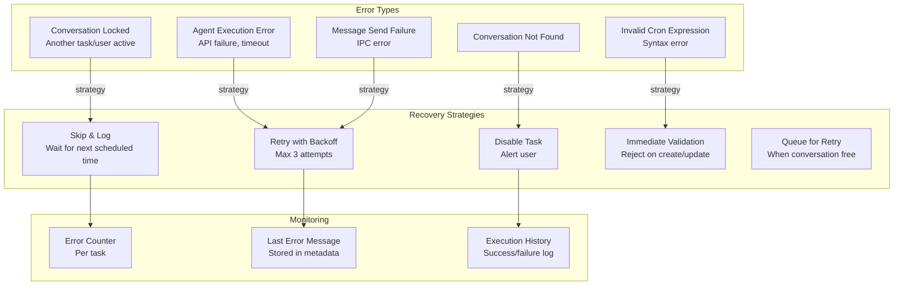

# Cron & Scheduled Tasks

<details>
<summary>Relevant source files</summary>

The following files were used as context for generating this wiki page:

- [readme.md](readme.md)
- [readme_ch.md](readme_ch.md)
- [readme_es.md](readme_es.md)
- [readme_jp.md](readme_jp.md)
- [readme_ko.md](readme_ko.md)
- [readme_pt.md](readme_pt.md)
- [readme_tr.md](readme_tr.md)
- [readme_tw.md](readme_tw.md)
- [resources/wechat_group4.png](resources/wechat_group4.png)

</details>

## Purpose and Scope

This document describes AionUi's scheduled tasks system, which enables automated, unattended execution of AI agent interactions at specified times. The system allows users to configure recurring tasks that automatically send messages to specific conversations, enabling 24/7 autonomous operation without manual intervention.

This page covers task scheduling mechanisms, the cron expression syntax used, task lifecycle management, and the integration with the conversation and agent systems. For information about agent configuration and capabilities, see [4.7](#4.7). For details on conversation management and message persistence, see [3.6](#3.6).

---

## System Overview

The scheduled tasks feature transforms AionUi from a manual interaction tool into an autonomous automation platform. Tasks are conversation-bound entities that trigger agent interactions on a schedule, maintaining full context and conversation history across executions.

**Key Characteristics:**

| Property              | Description                                                                               |
| --------------------- | ----------------------------------------------------------------------------------------- |
| **Scheduling**        | Cron expression-based with support for standard patterns (daily, weekly, monthly, custom) |
| **Execution Context** | Fully bound to conversation - inherits all conversation settings, workspace, and history  |
| **Lifecycle**         | Created, modified, enabled/disabled, deleted through UI or API                            |
| **Persistence**       | Task definitions stored in configuration; execution history in conversation messages      |
| **Timing**            | Runs in main process; survives application restarts if enabled                            |

Sources: [readme.md:206-235](), architecture diagrams

---

## Architecture Components



**Scheduler Architecture**

The scheduled tasks system operates entirely in the main process, ensuring tasks continue to execute even when the renderer UI is closed. The architecture consists of four primary layers:

1. **UI Layer**: Settings interface for task management
2. **IPC Layer**: Command and event channels for task operations
3. **Scheduler Core**: Cron engine and task registry
4. **Execution Layer**: Message injection into conversations

Sources: Architecture diagrams, [readme.md:206-235]()

---

## Task Data Model

### Task Definition Schema



**Task Properties:**

| Field            | Type                | Description                                                         |
| ---------------- | ------------------- | ------------------------------------------------------------------- |
| `id`             | `string`            | UUID or generated unique identifier                                 |
| `conversationId` | `string`            | Reference to target conversation; must exist                        |
| `cronExpression` | `string`            | Standard cron syntax (minute hour day month weekday)                |
| `message`        | `string`            | The prompt/message to send to the agent                             |
| `enabled`        | `boolean`           | Whether task is active; disabled tasks are skipped                  |
| `metadata`       | `object`            | Contains `createdAt`, `modifiedAt`, `lastRun`, `nextRun` timestamps |
| `name`           | `string` (optional) | User-friendly task name                                             |
| `description`    | `string` (optional) | Task purpose description                                            |

Sources: [readme.md:220-235](), architecture context

---

## Cron Expression Syntax

AionUi uses standard cron expression syntax with five time fields:

```
┌─────────────── minute (0 - 59)
│ ┌───────────── hour (0 - 23)
│ │ ┌─────────── day of month (1 - 31)
│ │ │ ┌───────── month (1 - 12)
│ │ │ │ ┌─────── day of week (0 - 6) (Sunday to Saturday)
│ │ │ │ │
* * * * *
```

### Common Patterns

| Pattern               | Expression     | Description                             |
| --------------------- | -------------- | --------------------------------------- |
| Every minute          | `* * * * *`    | Runs every minute (use sparingly)       |
| Every 15 minutes      | `*/15 * * * *` | Runs at :00, :15, :30, :45              |
| Hourly                | `0 * * * *`    | Runs at the start of every hour         |
| Daily at 9 AM         | `0 9 * * *`    | Runs once per day at 9:00 AM            |
| Weekdays at 9 AM      | `0 9 * * 1-5`  | Monday through Friday at 9 AM           |
| Weekly (Monday 9 AM)  | `0 9 * * 1`    | Every Monday at 9 AM                    |
| Monthly (1st at 9 AM) | `0 9 1 * *`    | First day of each month at 9 AM         |
| Quarterly             | `0 9 1 */3 *`  | First day of Jan, Apr, Jul, Oct at 9 AM |

### Special Characters

- **`*`** (asterisk): Any value / every value
- **`,`** (comma): List separator (e.g., `0 9,17 * * *` = 9 AM and 5 PM)
- **`-`** (dash): Range (e.g., `0 9 * * 1-5` = Monday through Friday)
- **`/`** (slash): Step values (e.g., `*/10 * * * *` = every 10 minutes)

Sources: Standard cron specification, [readme.md:211-213]()

---

## Task Lifecycle



**State Transitions:**

1. **Created → Validated**: Task definition checked for valid cron expression, existing conversation
2. **Validated → Scheduled/Disabled**: Based on `enabled` flag
3. **Scheduled → PendingExecution**: Cron trigger fires at scheduled time
4. **PendingExecution → Executing**: Execution lock acquired (prevents overlapping runs)
5. **Executing → MessageSent**: Message injected into conversation via agent system
6. **AgentProcessing**: Agent processes message as normal conversation interaction
7. **Completed**: Response received, `lastRun` updated, task remains scheduled

Sources: [readme.md:220-227](), architecture context

---

## Conversation Binding and Context

### Context Preservation

Scheduled tasks are tightly bound to conversations, inheriting all conversation properties:



**Inherited Context Elements:**

| Element                 | Description                    | Impact on Task Execution                             |
| ----------------------- | ------------------------------ | ---------------------------------------------------- |
| **Agent Type**          | `gemini`, `acp`, `codex`, etc. | Determines which agent processes the task message    |
| **Workspace**           | File system directory          | Task can access/modify files in workspace            |
| **Message History**     | All previous messages          | Agent has full context of prior interactions         |
| **Model Configuration** | API keys, model selection      | Uses same model as manual interactions               |
| **Skills**              | Enabled skill set              | Task can use PPTX generation, Excel processing, etc. |
| **System Prompt**       | Assistant personality          | Maintains consistent agent behavior                  |

Sources: [readme.md:223-225](), architecture diagrams

---

## Task Execution Flow



**Execution Phases:**

1. **Trigger Phase**: Cron engine detects time match, fires event
2. **Validation Phase**: Check task enabled, conversation exists, not currently locked
3. **Lock Acquisition**: Prevent concurrent task/manual interactions on same conversation
4. **Message Injection**: Send task message as if user typed it
5. **Agent Processing**: Full agent response cycle with tool execution, streaming
6. **Persistence**: Messages saved to database, visible in conversation history
7. **Cleanup**: Release lock, update execution metadata

Sources: Architecture diagrams, [readme.md:224-225]()

---

## Task Management Operations

### IPC API Surface

The scheduled tasks system exposes the following operations through the IPC bridge:

| Operation           | IPC Method               | Parameters                                             | Return Value                  |
| ------------------- | ------------------------ | ------------------------------------------------------ | ----------------------------- |
| **Create Task**     | `scheduledTask.create`   | `{ conversationId, cronExpression, message, enabled }` | `IScheduledTask`              |
| **Update Task**     | `scheduledTask.update`   | `{ id, ...updates }`                                   | `IScheduledTask`              |
| **Delete Task**     | `scheduledTask.delete`   | `{ id }`                                               | `boolean`                     |
| **List Tasks**      | `scheduledTask.list`     | `{ conversationId? }`                                  | `IScheduledTask[]`            |
| **Toggle Task**     | `scheduledTask.toggle`   | `{ id, enabled }`                                      | `IScheduledTask`              |
| **Get Task**        | `scheduledTask.get`      | `{ id }`                                               | `IScheduledTask`              |
| **Test Expression** | `scheduledTask.testCron` | `{ cronExpression }`                                   | `{ valid, nextRuns: Date[] }` |

### Configuration Persistence

Tasks are persisted in the `ConfigStorage` system under the `scheduledTasks` key:

```typescript
// Configuration schema
interface IConfigStorageRefer {
  // ... other config fields
  scheduledTasks?: IScheduledTask[]
}

interface IScheduledTask {
  id: string
  conversationId: string
  cronExpression: string
  message: string
  enabled: boolean
  name?: string
  description?: string
  metadata: {
    createdAt: string
    modifiedAt: string
    lastRun?: string
    nextRun?: string
    executionCount: number
    errorCount: number
  }
}
```

**Persistence Flow:**

1. Tasks loaded from `ConfigStorage` on application startup
2. CronScheduler registers enabled tasks with cron engine
3. Any task modification triggers immediate save to config file
4. Config file survives application restarts
5. Disabled tasks remain in config but not registered with cron engine

Sources: [readme.md:220-227](), [3.4](#3.4) reference

---

## Error Handling and Resilience

### Failure Scenarios



**Error Handling Rules:**

| Error Type               | Behavior                                  | User Notification             |
| ------------------------ | ----------------------------------------- | ----------------------------- |
| **Conversation deleted** | Auto-disable task, log warning            | Show error badge in task list |
| **Conversation busy**    | Skip execution, retry next scheduled time | No notification (normal)      |
| **Agent API failure**    | Retry up to 3 times, then mark failed     | Show error in conversation    |
| **Invalid cron**         | Reject on create/update                   | Inline validation error       |
| **Repeated failures**    | Auto-disable after 5 consecutive errors   | Email/notification alert      |

### Execution Constraints

- **Concurrency**: One task execution per conversation at a time
- **Timeout**: Task execution timeout matches agent timeout (typically 5-10 minutes)
- **Overlap Prevention**: If task runs longer than cron interval, skip next run
- **Resource Limits**: Maximum 50 active scheduled tasks per application instance

Sources: Architecture patterns, [12.3](#12.3) reference

---

## Use Cases and Examples

### Example 1: Daily Report Generation

```typescript
{
  id: "task-daily-report",
  conversationId: "conv-sales-analysis",
  cronExpression: "0 9 * * 1-5", // Weekdays at 9 AM
  message: "Generate a sales report for yesterday. Include total revenue, top products, and compare to last week.",
  enabled: true,
  name: "Daily Sales Report",
  metadata: {
    createdAt: "2024-01-15T08:00:00Z",
    modifiedAt: "2024-01-15T08:00:00Z",
    executionCount: 45,
    errorCount: 0
  }
}
```

**Workflow:**

1. Task triggers at 9 AM on weekdays
2. Message sent to conversation with sales analysis context
3. Agent reads workspace files (e.g., `sales.xlsx`)
4. Agent generates report using enabled skills (XLSX processing)
5. Report saved to workspace, visible in conversation history

### Example 2: File Organization

```typescript
{
  id: "task-cleanup",
  conversationId: "conv-file-manager",
  cronExpression: "0 2 * * 0", // Sundays at 2 AM
  message: "Organize the Downloads folder. Sort files by type into subdirectories, and archive files older than 30 days.",
  enabled: true,
  name: "Weekly File Cleanup"
}
```

### Example 3: Backup Reminder

```typescript
{
  id: "task-backup-reminder",
  conversationId: "conv-admin",
  cronExpression: "0 18 1 * *", // 1st of month at 6 PM
  message: "Check backup status in /backups directory and list any gaps in the backup schedule.",
  enabled: true,
  name: "Monthly Backup Check"
}
```

### Example 4: Data Aggregation

```typescript
{
  id: "task-aggregate-logs",
  conversationId: "conv-analytics",
  cronExpression: "0 */4 * * *", // Every 4 hours
  message: "Parse application logs from the last 4 hours, extract errors, and summarize the top 5 issues.",
  enabled: true,
  name: "Log Aggregation"
}
```

Sources: [readme.md:227-233]()

---

## Integration with Agent System

### Agent-Specific Considerations

Different agent types handle scheduled tasks with slight variations:

| Agent Type        | Task Execution Behavior                                                         |
| ----------------- | ------------------------------------------------------------------------------- |
| **GeminiAgent**   | Full tool support (web search, file ops, image gen); streams responses normally |
| **AcpAgent**      | Delegates to CLI tool; may prompt for approvals if `yolo` mode not enabled      |
| **CodexAgent**    | MCP tools available; long-running operations supported                          |
| **OpenClawAgent** | Gateway-based execution; network latency considerations                         |
| **NanobotAgent**  | Simplified execution; limited tool support                                      |

### Permission Model

Scheduled tasks inherit the conversation's permission mode:

- **`yolo` mode**: Tasks execute with auto-approval of all tool calls
- **`confirmEach` mode**: Task execution pauses at tool calls, waits for manual approval (not recommended for unattended tasks)
- **`autoEdit` mode**: File operations auto-approved, other tools require approval

**Recommendation**: Configure conversations used for scheduled tasks with `yolo` mode to ensure fully autonomous execution.

Sources: [4.1](#4.1), [4.3](#4.3), [12.4](#12.4) references

---

## Performance and Scalability

### Resource Considerations

| Metric                      | Limit/Guideline          | Rationale                             |
| --------------------------- | ------------------------ | ------------------------------------- |
| **Maximum Active Tasks**    | 50 per instance          | Memory overhead of cron job registry  |
| **Minimum Interval**        | 1 minute                 | Prevent scheduler overload            |
| **Concurrent Executions**   | 1 per conversation       | Maintain conversation state integrity |
| **Task Execution Timeout**  | Agent timeout (5-10 min) | Prevent runaway tasks                 |
| **Config File Size Impact** | ~1 KB per task           | Minimal impact on startup time        |

### Optimization Strategies

1. **Task Consolidation**: Combine related operations into a single task rather than multiple frequent tasks
2. **Off-Peak Scheduling**: Schedule resource-intensive tasks during low-activity periods (e.g., nights)
3. **Workspace Cleanup**: Tasks generating large files should include cleanup logic
4. **Error Monitoring**: Regularly review task execution logs to identify and fix failing tasks
5. **Conversation Reuse**: Use dedicated "automation" conversations for scheduled tasks to avoid cluttering interactive conversations

Sources: Architecture context, performance patterns

---

## Configuration Example

Complete example showing task configuration in `ConfigStorage`:

```json
{
  "scheduledTasks": [
    {
      "id": "uuid-1234-5678",
      "conversationId": "conv-reports",
      "cronExpression": "0 9 * * 1",
      "message": "Generate weekly performance report",
      "enabled": true,
      "name": "Weekly Report",
      "description": "Automated weekly report generation for management review",
      "metadata": {
        "createdAt": "2024-01-10T10:00:00Z",
        "modifiedAt": "2024-01-15T14:30:00Z",
        "lastRun": "2024-01-22T09:00:00Z",
        "nextRun": "2024-01-29T09:00:00Z",
        "executionCount": 3,
        "errorCount": 0
      }
    },
    {
      "id": "uuid-9012-3456",
      "conversationId": "conv-maintenance",
      "cronExpression": "0 2 * * *",
      "message": "Clean up temporary files older than 7 days",
      "enabled": true,
      "name": "Daily Cleanup",
      "metadata": {
        "createdAt": "2024-01-05T12:00:00Z",
        "modifiedAt": "2024-01-05T12:00:00Z",
        "lastRun": "2024-01-23T02:00:00Z",
        "nextRun": "2024-01-24T02:00:00Z",
        "executionCount": 18,
        "errorCount": 1
      }
    }
  ]
}
```

Sources: [8.1](#8.1) reference, [readme.md:220-235]()

---

## Summary

The scheduled tasks system transforms AionUi into a 24/7 autonomous platform by enabling time-based execution of agent interactions. Key architectural decisions include:

- **Conversation-bound execution**: Tasks inherit full conversation context and history
- **Main process implementation**: Ensures tasks run independent of UI state
- **Cron expression scheduling**: Industry-standard, flexible time specification
- **Lock-based concurrency**: Prevents state corruption from overlapping executions
- **IPC-based management**: Clean separation between UI and execution logic

This design enables use cases ranging from simple daily reminders to complex multi-step automation workflows, all while maintaining the full context and capabilities of manual agent interactions.

Sources: [readme.md:64,206-235](), architecture diagrams, [3.6](#3.6), [4](#4)
