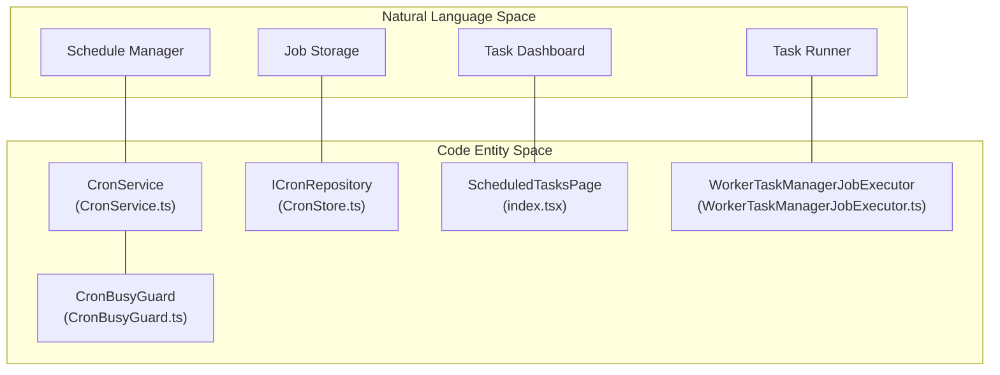
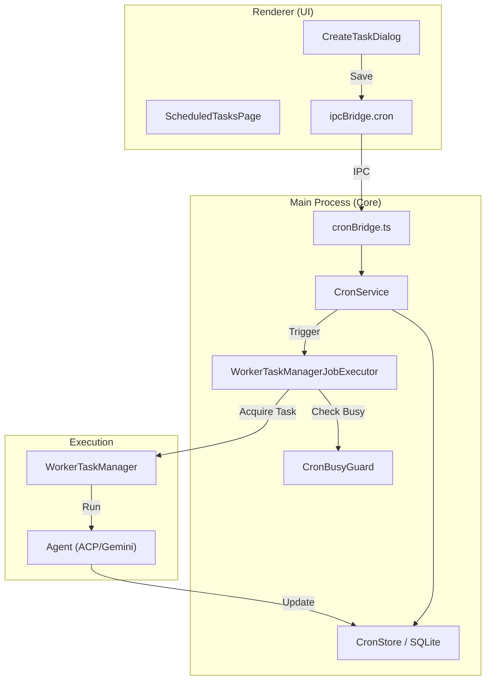

# Cron & Scheduled Tasks

Relevant source files

The following files were used as context for generating this wiki page:

- [src/process/bridge/cronBridge.ts](src/process/bridge/cronBridge.ts)
- [src/process/services/cron/CronService.ts](src/process/services/cron/CronService.ts)
- [src/process/services/cron/CronStore.ts](src/process/services/cron/CronStore.ts)
- [src/process/services/cron/ICronEventEmitter.ts](src/process/services/cron/ICronEventEmitter.ts)
- [src/process/services/cron/ICronJobExecutor.ts](src/process/services/cron/ICronJobExecutor.ts)
- [src/process/services/cron/IpcCronEventEmitter.ts](src/process/services/cron/IpcCronEventEmitter.ts)
- [src/process/services/cron/WorkerTaskManagerJobExecutor.ts](src/process/services/cron/WorkerTaskManagerJobExecutor.ts)
- [src/process/services/cron/cronServiceSingleton.ts](src/process/services/cron/cronServiceSingleton.ts)
- [src/process/task/MessageMiddleware.ts](src/process/task/MessageMiddleware.ts)
- [src/process/webserver/auth/middleware/AuthMiddleware.ts](src/process/webserver/auth/middleware/AuthMiddleware.ts)
- [src/renderer/components/chat/sendbox.tsx](src/renderer/components/chat/sendbox.tsx)
- [src/renderer/components/layout/Sider/CronJobSiderItem.tsx](src/renderer/components/layout/Sider/CronJobSiderItem.tsx)
- [src/renderer/components/layout/Sider/CronJobSiderSection.tsx](src/renderer/components/layout/Sider/CronJobSiderSection.tsx)
- [src/renderer/pages/conversation/Messages/components/MessageCronTrigger.tsx](src/renderer/pages/conversation/Messages/components/MessageCronTrigger.tsx)
- [src/renderer/pages/conversation/Messages/components/MessagetText.tsx](src/renderer/pages/conversation/Messages/components/MessagetText.tsx)
- [src/renderer/pages/conversation/Messages/components/SelectionReplyButton.tsx](src/renderer/pages/conversation/Messages/components/SelectionReplyButton.tsx)
- [src/renderer/pages/conversation/Messages/components/SkillSuggestCard.tsx](src/renderer/pages/conversation/Messages/components/SkillSuggestCard.tsx)
- [src/renderer/pages/cron/ScheduledTasksPage/CreateTaskDialog.tsx](src/renderer/pages/cron/ScheduledTasksPage/CreateTaskDialog.tsx)
- [src/renderer/pages/cron/ScheduledTasksPage/CronStatusTag.tsx](src/renderer/pages/cron/ScheduledTasksPage/CronStatusTag.tsx)
- [src/renderer/pages/cron/ScheduledTasksPage/TaskDetailPage.tsx](src/renderer/pages/cron/ScheduledTasksPage/TaskDetailPage.tsx)
- [src/renderer/pages/cron/ScheduledTasksPage/index.tsx](src/renderer/pages/cron/ScheduledTasksPage/index.tsx)
- [src/renderer/pages/cron/cronUtils.ts](src/renderer/pages/cron/cronUtils.ts)
- [src/renderer/pages/cron/useCronJobs.ts](src/renderer/pages/cron/useCronJobs.ts)
- [src/renderer/services/i18n/locales/en-US/cron.json](src/renderer/services/i18n/locales/en-US/cron.json)
- [src/renderer/services/i18n/locales/ja-JP/cron.json](src/renderer/services/i18n/locales/ja-JP/cron.json)
- [src/renderer/services/i18n/locales/ko-KR/cron.json](src/renderer/services/i18n/locales/ko-KR/cron.json)
- [src/renderer/services/i18n/locales/tr-TR/cron.json](src/renderer/services/i18n/locales/tr-TR/cron.json)
- [src/renderer/services/i18n/locales/zh-CN/cron.json](src/renderer/services/i18n/locales/zh-CN/cron.json)
- [src/renderer/services/i18n/locales/zh-TW/cron.json](src/renderer/services/i18n/locales/zh-TW/cron.json)
- [tests/unit/cronService.test.ts](tests/unit/cronService.test.ts)
- [tests/unit/renderer/conversation/CreateTaskDialog.dom.test.tsx](tests/unit/renderer/conversation/CreateTaskDialog.dom.test.tsx)
- [tests/unit/renderer/conversation/CronJobSiderItem.dom.test.tsx](tests/unit/renderer/conversation/CronJobSiderItem.dom.test.tsx)
- [tests/unit/renderer/conversation/CronJobSiderSection.dom.test.tsx](tests/unit/renderer/conversation/CronJobSiderSection.dom.test.tsx)
- [tests/unit/renderer/conversation/ScheduledTasksPage.dom.test.tsx](tests/unit/renderer/conversation/ScheduledTasksPage.dom.test.tsx)
- [tests/unit/renderer/conversation/TaskDetailPage.dom.test.tsx](tests/unit/renderer/conversation/TaskDetailPage.dom.test.tsx)

## Purpose and Scope

This document describes AionUi's scheduled tasks system, which enables automated, unattended execution of AI agent interactions at specified times. The system allows users to configure recurring tasks that automatically send messages to specific conversations or create new ones, enabling 24/7 autonomous operation.

Key features include cron-based scheduling, persistent execution history, and a "YOLO" mode that allows agents to execute tools (like file operations or web searches) without manual user confirmation during scheduled runs.

Sources: [src/process/services/cron/CronService.ts:42-46](), [src/process/services/cron/WorkerTaskManagerJobExecutor.ts:36-40]()

---

## System Overview

The scheduled tasks feature transforms AionUi from a manual interaction tool into an autonomous automation platform. Tasks are persisted entities that trigger agent interactions on a schedule.

### Execution Modes
The system supports two primary execution modes defined in the `CronJob` metadata:
1.  **Existing Conversation**: The task runs within a specific, pre-existing conversation. This maintains long-term context and history. [src/process/services/cron/CronService.ts:58-59]()
2.  **New Conversation**: Each execution creates a fresh conversation. This is ideal for independent tasks like daily news summaries where previous context is not required. [src/process/services/cron/CronService.ts:98-99]()

### Technical Characteristics
| Property | Description |
|----------|-------------|
| **Scheduling Engine** | Powered by the `croner` library, supporting standard cron expressions. [src/process/services/cron/CronService.ts:13-13]() |
| **Persistence** | Jobs are stored via `ICronRepository` (SQLite). [src/process/services/cron/CronService.ts:18-18]() |
| **Power Management** | Prevents system sleep when tasks are active via `powerSaveBlocker`. [src/process/services/cron/CronService.ts:81-81]() |
| **Context Retention** | Automatically backfills `agentConfig` and `workspace` settings from the original conversation. [src/process/services/cron/CronService.ts:134-173]() |

Sources: [src/process/services/cron/CronService.ts:13-18](), [src/process/services/cron/CronStore.ts:21-46]()

---

## Architecture Components

### Natural Language to Code Entity Mapping

The following diagram maps high-level system concepts to specific classes and interfaces in the codebase.

Sources: [src/process/services/cron/CronService.ts:47-59](), [src/process/services/cron/WorkerTaskManagerJobExecutor.ts:36-40](), [src/renderer/pages/cron/ScheduledTasksPage/index.tsx:37-42]()

### Data Flow and Execution Logic

Sources: [src/process/bridge/cronBridge.ts:1-50](), [src/process/services/cron/CronService.ts:65-86](), [src/process/services/cron/WorkerTaskManagerJobExecutor.ts:46-104]()

---

## Task Execution & Lifecycle

### Initialization and Recovery
Upon application startup, the `CronService.init()` method performs several critical recovery steps:
1.  **Cleanup**: Removes "orphan" jobs whose associated conversations have been deleted. [src/process/services/cron/CronService.ts:92-128]()
2.  **Backfill**: Ensures legacy jobs are updated with modern metadata like `cronJobId` and `agentConfig`. [src/process/services/cron/CronService.ts:134-173]()
3.  **Timer Restart**: Re-initializes `croner` timers for all enabled jobs. [src/process/services/cron/CronService.ts:76-78]()

### The Execution Pipeline
When a timer fires, the `WorkerTaskManagerJobExecutor` handles the actual AI interaction:
1.  **Task Acquisition**: Calls `taskManager.getOrBuildTask`. [src/process/services/cron/WorkerTaskManagerJobExecutor.ts:95-96]()
2.  **YOLO Mode**: Automatically enables `yoloMode: true`. This allows the agent to execute tools without waiting for user permission, which is essential for unattended operation. [src/process/services/cron/WorkerTaskManagerJobExecutor.ts:81-82]()
3.  **Busy Management**: Uses `CronBusyGuard` to ensure that a scheduled task does not conflict with an active manual user session in the same conversation. [src/process/services/cron/WorkerTaskManagerJobExecutor.ts:109-112]()
4.  **Context Injection**: Copies workspace files and injects instructions into the agent's prompt. [src/process/services/cron/WorkerTaskManagerJobExecutor.ts:131-140]()

Sources: [src/process/services/cron/CronService.ts:65-86](), [src/process/services/cron/WorkerTaskManagerJobExecutor.ts:46-155]()

---

## User Interface and Interaction

### Task Management UI
The system provides a comprehensive management interface in the `ScheduledTasksPage`:
*   **Task List**: Overview of all active and paused tasks, showing next run times and last execution status. [src/renderer/pages/cron/ScheduledTasksPage/index.tsx:163-200]()
*   **Detail View**: Shows execution history and allows manual "Run Now" triggers. [src/renderer/pages/cron/ScheduledTasksPage/TaskDetailPage.tsx:92-106]()
*   **Creation Dialog**: Supports complex scheduling (Daily, Weekly, Custom Cron) and advanced agent settings (Model selection, Workspace selection). [src/renderer/pages/cron/ScheduledTasksPage/CreateTaskDialog.tsx:118-162]()

### In-Chat Integration
Scheduled executions are visible within the conversation history:
*   **MessageCronBadge**: Messages triggered by a schedule are marked with a "Scheduled" badge. [src/renderer/pages/conversation/Messages/components/MessagetText.tsx:144-144]()
*   **MessageCronTrigger**: A specialized UI card that appears when a task is triggered, providing a link back to the task settings. [src/process/services/cron/WorkerTaskManagerJobExecutor.ts:155-155]()
*   **CronJobSiderItem**: In the sidebar, conversations belonging to a scheduled task are grouped under the task name. [src/renderer/components/layout/Sider/CronJobSiderItem.tsx:33-53]()

Sources: [src/renderer/pages/cron/ScheduledTasksPage/index.tsx:109-118](), [src/renderer/pages/conversation/Messages/components/MessagetText.tsx:136-144](), [src/renderer/components/layout/Sider/CronJobSiderItem.tsx:55-60]()

---

## Implementation Details

### SQLite Schema
Scheduled tasks are persisted in the `cron_jobs` table. The data structure includes:
*   **Schedule**: JSON-serialized frequency and cron expressions. [src/process/services/cron/CronStore.ts:17-17]()
*   **Target**: The specific message payload to send to the agent. [src/process/services/cron/CronStore.ts:23-23]()
*   **Metadata**: Information about the executing agent (backend, model, workspace). [src/process/services/cron/CronStore.ts:23-23]()

### Error Handling and Retries
If a task fails (e.g., due to a "Conversation Busy" state), the `CronService` implements a retry mechanism:
*   **Retry Logic**: The service attempts to re-run the job after a delay if the conversation was busy. [src/process/services/cron/CronService.ts:49-50]()
*   **Missed Jobs**: Detects jobs that were missed while the computer was asleep and notifies the user upon wake-up. [src/renderer/services/i18n/locales/en-US/cron.json:138-138]() (Ref: `error.missedJob`)

Sources: [src/process/services/cron/CronStore.ts:21-46](), [src/process/services/cron/CronService.ts:47-50]()