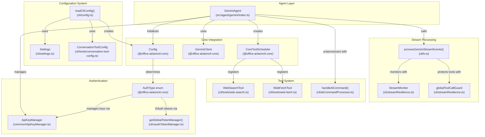
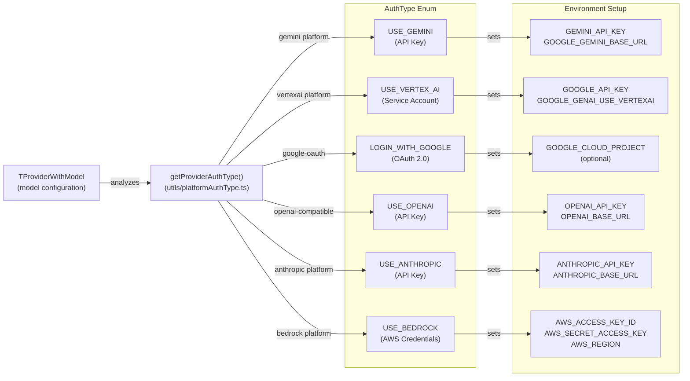
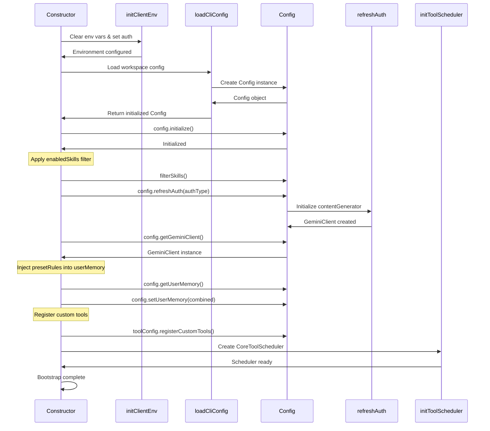
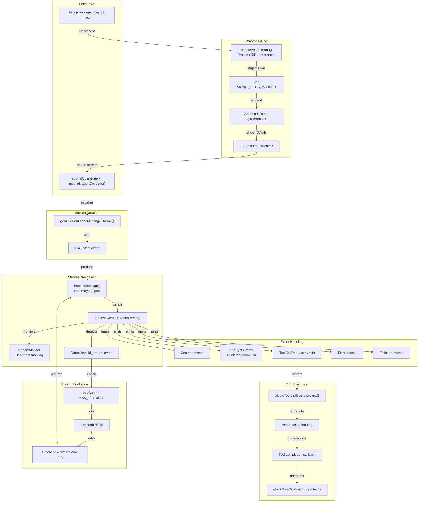
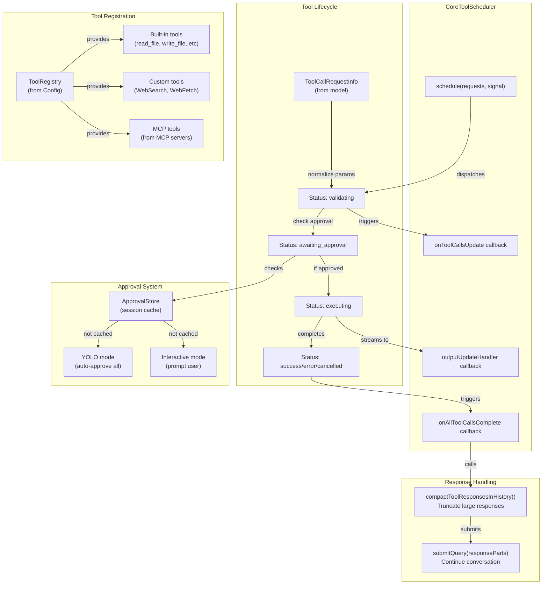
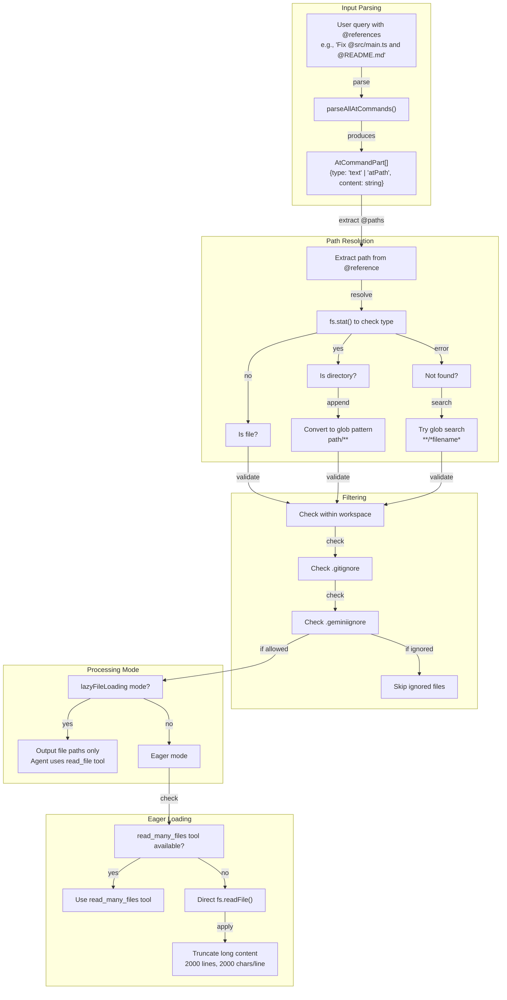
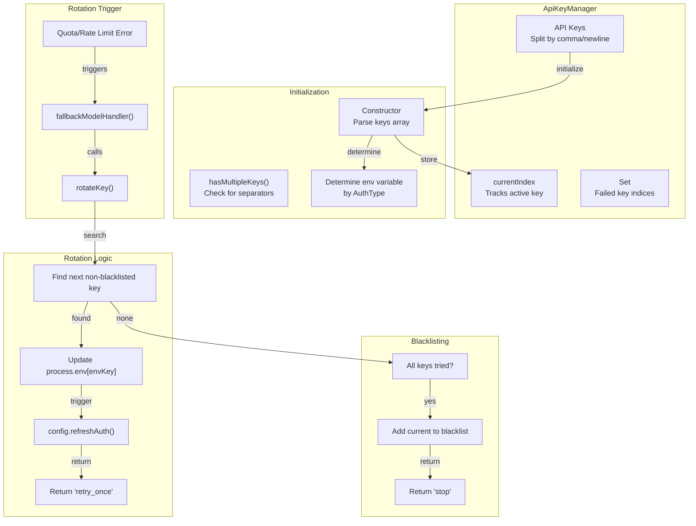

# Gemini Agent System

<details>
<summary>Relevant source files</summary>

The following files were used as context for generating this wiki page:

- [src/agent/gemini/cli/atCommandProcessor.ts](src/agent/gemini/cli/atCommandProcessor.ts)
- [src/agent/gemini/cli/config.ts](src/agent/gemini/cli/config.ts)
- [src/agent/gemini/cli/errorParsing.ts](src/agent/gemini/cli/errorParsing.ts)
- [src/agent/gemini/cli/tools/web-fetch.ts](src/agent/gemini/cli/tools/web-fetch.ts)
- [src/agent/gemini/cli/tools/web-search.ts](src/agent/gemini/cli/tools/web-search.ts)
- [src/agent/gemini/cli/types.ts](src/agent/gemini/cli/types.ts)
- [src/agent/gemini/cli/useReactToolScheduler.ts](src/agent/gemini/cli/useReactToolScheduler.ts)
- [src/agent/gemini/index.ts](src/agent/gemini/index.ts)
- [src/agent/gemini/utils.ts](src/agent/gemini/utils.ts)
- [src/process/services/mcpServices/McpOAuthService.ts](src/process/services/mcpServices/McpOAuthService.ts)

</details>

## Purpose and Scope

The Gemini Agent System provides the primary AI agent implementation for AionUi, integrating Google's Gemini models and other LLM providers through the `@office-ai/aioncli-core` library. This document covers the `GeminiAgent` class architecture, authentication methods, stream processing with resilience mechanisms, tool scheduling, configuration management, and integration patterns.

For other agent types (Codex, ACP, OpenClaw), see [Codex Agent System](#4.2) and [ACP Agent Integration](#4.3). For model configuration and provider management, see [Model Configuration & API Management](#4.7). For MCP server integration details, see [MCP Integration](#4.6).

---

## Architecture Overview

The `GeminiAgent` class serves as the main orchestrator, managing the lifecycle from initialization to message streaming. It integrates multiple subsystems including authentication, tool scheduling, stream monitoring, and configuration management.

### Component Hierarchy



**Sources:** [src/agent/gemini/index.ts:1-875](), [src/agent/gemini/cli/config.ts:1-380](), [src/agent/gemini/utils.ts:1-615]()

---

## Authentication Architecture

The Gemini Agent supports six authentication types, each with different credential handling and initialization logic. Authentication type is determined automatically from the provider configuration using `getProviderAuthType()`.

### Authentication Type Resolution



**Sources:** [src/agent/gemini/index.ts:129-254](), [src/common/utils/platformAuthType.ts]()

### Authentication Initialization Flow

The `initClientEnv()` method clears all previous authentication variables and configures environment based on detected `AuthType`:

| AuthType            | Environment Variables                                                       | Special Handling                                         |
| ------------------- | --------------------------------------------------------------------------- | -------------------------------------------------------- |
| `USE_GEMINI`        | `GEMINI_API_KEY`, `GOOGLE_GEMINI_BASE_URL`                                  | Multi-key support via `ApiKeyManager`                    |
| `USE_VERTEX_AI`     | `GOOGLE_API_KEY`, `GOOGLE_GENAI_USE_VERTEXAI=true`                          | Service account credentials                              |
| `LOGIN_WITH_GOOGLE` | `GOOGLE_CLOUD_PROJECT` (optional)                                           | OAuth credential check via `hasGoogleOAuthCredentials()` |
| `USE_OPENAI`        | `OPENAI_API_KEY`, `OPENAI_BASE_URL`                                         | Multi-key support, new-api URL normalization             |
| `USE_ANTHROPIC`     | `ANTHROPIC_API_KEY`, `ANTHROPIC_BASE_URL`                                   | Multi-key support                                        |
| `USE_BEDROCK`       | `AWS_ACCESS_KEY_ID`, `AWS_SECRET_ACCESS_KEY` or `AWS_PROFILE`, `AWS_REGION` | Two auth methods: accessKey or profile                   |

**Key Implementation Details:**

- **OAuth Credential Check** [src/agent/gemini/index.ts:346-359](): Before initialization, the agent checks for `~/.gemini/oauth_creds.json`. If missing, it throws an error prompting the user to authenticate via CLI or switch to API key mode.

- **Multi-Key Initialization** [src/agent/gemini/index.ts:257-267](): For `USE_OPENAI`, `USE_GEMINI`, and `USE_ANTHROPIC`, if the API key contains commas or newlines, an `ApiKeyManager` instance is created for automatic rotation.

- **New-API URL Normalization** [src/agent/gemini/index.ts:189-192](): For new-api gateway platforms, `normalizeNewApiBaseUrl()` adjusts the base URL based on the authentication protocol.

- **Bedrock Dual Auth** [src/agent/gemini/index.ts:228-254](): Supports both explicit credentials (`accessKeyId`, `secretAccessKey`) and AWS profile-based authentication.

**Sources:** [src/agent/gemini/index.ts:150-255](), [src/agent/gemini/index.ts:47-61]()

---

## Agent Lifecycle

The `GeminiAgent` constructor initializes a bootstrap promise that orchestrates the complete setup sequence asynchronously.

### Initialization Sequence



**Sources:** [src/agent/gemini/index.ts:118-148](), [src/agent/gemini/index.ts:300-396]()

### Configuration Loading

The `loadCliConfig()` function creates a `Config` instance with comprehensive settings including:

- **Memory Loading** [src/agent/gemini/cli/config.ts:162-165](): Uses `loadServerHierarchicalMemory()` to scan workspace files and build context memory with file filtering (gitignore, .geminiignore).

- **MCP Server Merging** [src/agent/gemini/cli/config.ts:167-217](): Combines MCP servers from settings, extensions, and UI configuration, applying allow/exclude filters.

- **Skill Loading** [src/agent/gemini/cli/config.ts:89-129](): Loads builtin skills from `skillsDir` (including `_builtin/` subdirectory), filters by `enabledSkills` list, and creates a virtual extension to hold them.

- **Fallback Handler** [src/agent/gemini/cli/config.ts:299-334](): Registers a `fallbackModelHandler` that integrates with `ApiKeyManager` for automatic key rotation on quota errors.

**Configuration Table:**

| Parameter         | Source                                 | Purpose                               |
| ----------------- | -------------------------------------- | ------------------------------------- |
| `sessionId`       | Generated UUID                         | Unique session identifier             |
| `targetDir`       | `workspace` option                     | Working directory for file operations |
| `userMemory`      | `loadServerHierarchicalMemory()`       | Workspace context with file contents  |
| `mcpServers`      | Merged from settings + extensions + UI | MCP server configurations             |
| `approvalMode`    | `yoloMode` option                      | Tool execution approval behavior      |
| `interactive`     | `true` (hardcoded)                     | Enables user confirmation dialogs     |
| `skillsSupport`   | `false` (hardcoded)                    | Disables native XML skill injection   |
| `extensionLoader` | `SimpleExtensionLoader`                | Provides extension context            |

**Sources:** [src/agent/gemini/cli/config.ts:70-337]()

### PresetRules and Skills Injection

The agent supports two types of system context injection:

1. **PresetRules (System Rules)** [src/agent/gemini/index.ts:373-385](): Injected into `userMemory` during initialization. These define assistant behavior and are always active.

2. **Skills Index** [src/agent/gemini/index.ts:772-793](): Prepended to the first user message as `[Assistant Rules - You MUST follow these instructions]`. This provides capability descriptions and usage instructions.

The distinction allows rules to be set once at session start, while skills can be dynamically enabled per conversation type.

**Sources:** [src/agent/gemini/index.ts:373-393](), [src/agent/gemini/index.ts:772-793]()

---

## Stream Processing and Resilience

The Gemini Agent implements a sophisticated stream processing pipeline with automatic retry, heartbeat monitoring, and tool call protection.

### Stream Processing Pipeline



**Sources:** [src/agent/gemini/index.ts:713-847](), [src/agent/gemini/index.ts:482-611](), [src/agent/gemini/utils.ts:70-293]()

### Stream Resilience Mechanisms

The agent implements three layers of resilience:

#### 1. StreamMonitor (Heartbeat Tracking)

[src/agent/gemini/cli/streamResilience.ts]() implements a `StreamMonitor` class that tracks event timing and detects connection issues:

- **Heartbeat Timer**: Records timestamp of each event via `recordEvent()`
- **Timeout Detection**: Checks if time since last event exceeds `heartbeatTimeoutMs` (default 30 seconds)
- **Connection State**: Tracks state as `idle`, `active`, or `failed`
- **Event Emission**: Fires `heartbeat_timeout` and `state_change` events

**Usage in Stream Processing** [src/agent/gemini/utils.ts:71-84]():

```typescript
const monitor = new StreamMonitor(monitorConfig, (event) => {
  if (event.type === 'heartbeat_timeout') {
    console.warn('[StreamMonitor] Heartbeat timeout detected')
  }
  monitorOptions?.onConnectionEvent?.(event)
})
monitor.start()
```

#### 2. Invalid Stream Detection and Retry

The agent detects `invalid_stream` events from aioncli-core [src/agent/gemini/utils.ts:240-252](), which indicate:

- Empty response from model
- Missing finish reason
- Malformed response structure

**Automatic Retry Logic** [src/agent/gemini/index.ts:523-576]():

```typescript
if (invalidStreamDetected && retryCount < MAX_INVALID_STREAM_RETRIES) {
  await new Promise((resolve) => setTimeout(resolve, RETRY_DELAY_MS))
  const newStream = this.geminiClient.sendMessageStream(
    query,
    signal,
    prompt_id
  )
  return this.handleMessage(
    newStream,
    msg_id,
    abortController,
    query,
    retryCount + 1
  )
}
```

**Retry Parameters:**

- `MAX_INVALID_STREAM_RETRIES`: 2 attempts
- `RETRY_DELAY_MS`: 1000ms between retries

#### 3. Tool Call Protection

The `globalToolCallGuard` [src/agent/gemini/cli/streamResilience.ts]() prevents premature tool call cancellation:

- **Protection Registration** [src/agent/gemini/index.ts:517](): When a tool call is scheduled, `globalToolCallGuard.protect(callId)` marks it as active
- **Completion Tracking** [src/agent/gemini/utils.ts:417](): On tool success/error, `globalToolCallGuard.complete(callId)` removes protection
- **Cancellation Check** [src/agent/gemini/utils.ts:448-455](): Protected tool calls are never treated as cancelled, even if abort signal fires

This prevents race conditions where user stops streaming but tools are still executing.

**Sources:** [src/agent/gemini/cli/streamResilience.ts](), [src/agent/gemini/index.ts:482-611](), [src/agent/gemini/utils.ts:409-501]()

### Think Tag Processing

The stream processor automatically detects and extracts thinking content from model responses [src/agent/gemini/utils.ts:107-152]():

**Detection Patterns:**

- Complete blocks: ``or`<thinking>...</thinking>`
- Orphaned closing tags: `</think>` or `</thinking>` without opening tag

**Processing Strategy:**

1. Extract complete think blocks and emit as `Thought` events
2. Remove complete blocks from content stream
3. Preserve orphaned closing tags for frontend filtering (streaming mode compatibility)
4. Clean excessive newlines

This handles both proxy services (like newapi) that wrap thinking in tags, and models (like MiniMax M2.5) that omit opening tags.

**Sources:** [src/agent/gemini/utils.ts:107-152]()

---

## Tool System Integration

The Gemini Agent integrates with the `CoreToolScheduler` from aioncli-core and registers custom AionUi-specific tools.

### Tool Scheduler Architecture



**Sources:** [src/agent/gemini/index.ts:398-470](), [src/agent/gemini/utils.ts:409-501]()

### Tool Scheduler Initialization

The `initToolScheduler()` method [src/agent/gemini/index.ts:398-470]() creates a `CoreToolScheduler` instance with three key callbacks:

#### 1. onAllToolCallsComplete

Triggered when all tool calls in a batch reach terminal status (success/error/cancelled):

```typescript
onAllToolCallsComplete: async (completedToolCalls: CompletedToolCall[]) => {
  // Refresh memory if save_memory tool succeeded
  const response = handleCompletedTools(
    completedToolCalls,
    this.geminiClient,
    refreshMemory
  )

  // Submit tool responses back to model
  if (response.length > 0) {
    this.submitQuery(response, msg_id, abortController, {
      isContinuation: true,
      prompt_id: completedToolCalls[0].request.prompt_id,
    })
  }
}
```

**Key Operations:**

- Calls `handleCompletedTools()` to process responses
- Refreshes hierarchical memory if `save_memory` tool succeeded
- Submits responses back to model with `isContinuation: true`

#### 2. onToolCallsUpdate

Triggered whenever tool call status changes:

```typescript
onToolCallsUpdate: (updatedCoreToolCalls: ToolCall[]) => {
  const display = mapToDisplay(updatedCoreToolCalls)
  this.onStreamEvent({
    type: 'tool_group',
    data: display.tools,
    msg_id: this.activeMsgId,
  })
}
```

Maps core tool calls to UI-friendly display format and emits to renderer.

#### 3. outputUpdateHandler

Implemented via `useReactToolScheduler` [src/agent/gemini/cli/useReactToolScheduler.ts:42-65]() to stream live tool output during execution.

**Sources:** [src/agent/gemini/index.ts:398-470](), [src/agent/gemini/cli/useReactToolScheduler.ts:39-116]()

### Custom Tool Registration

The `ConversationToolConfig` class [src/agent/gemini/cli/tools/conversation-tool-config.ts]() manages conversation-level custom tools:

#### WebSearchTool

[src/agent/gemini/cli/tools/web-search.ts:50-91]() provides Google Search integration:

**Implementation Details:**

- Uses `model: 'web-search'` alias from aioncli-core with `googleSearch` enabled
- Processes grounding metadata to extract source URLs and titles
- Returns both raw text (for LLM) and formatted markdown (for UI display)
- Tool name: `gemini_web_search`

**Parameters:**

| Parameter | Type   | Description  |
| --------- | ------ | ------------ |
| `query`   | string | Search query |

**Response Structure:**

- `llmContent`: Raw search results text
- `returnDisplay`: Markdown with source links
- `sources`: Array of `GroundingChunkItem` with URLs and titles

#### WebFetchTool

[src/agent/gemini/cli/tools/web-fetch.ts:50-98]() fetches and processes web content:

**Implementation Details:**

- Converts HTML to markdown using `html-to-text`
- Processes content with small model (`DEFAULT_GEMINI_FLASH_MODEL`)
- Handles GitHub blob URLs by converting to raw URLs
- Timeout: 10 seconds
- Max content length: 100,000 characters
- Tool name: `aionui_web_fetch`

**Parameters:**

| Parameter | Type   | Description                                        |
| --------- | ------ | -------------------------------------------------- |
| `url`     | string | URL to fetch (must start with http:// or https://) |
| `prompt`  | string | Query to run on fetched content                    |

**Processing Flow:**

1. Fetch URL with timeout
2. Convert HTML to plain text
3. Truncate to max length
4. Generate prompt combining user query and content
5. Process with flash model
6. Return model's response

**Sources:** [src/agent/gemini/cli/tools/web-search.ts:1-195](), [src/agent/gemini/cli/tools/web-fetch.ts:1-212]()

### Tool Parameter Normalization

The `normalizeToolParams()` function [src/agent/gemini/utils.ts:300-343]() standardizes parameter names across different model outputs:

**Normalization Rules:**

| Tool Category        | Parameter Mapping                    | Reason                                  |
| -------------------- | ------------------------------------ | --------------------------------------- |
| File operations      | `path` → `file_path`                 | Standardize to expected parameter name  |
| File operations      | Strip leading `@` from paths         | Handle user input like `@file.txt`      |
| Directory operations | Various `dir`-like keys → `dir_path` | Unify legacy parameter names            |
| `list_directory`     | Default `dir_path` to `"."`          | Satisfy required parameter when missing |

This ensures compatibility with models that use different parameter conventions.

**Sources:** [src/agent/gemini/utils.ts:300-343]()

### Tool Response Compaction

After the agentic loop completes, `compactToolResponsesInHistory()` [src/agent/gemini/utils.ts:523-604]() reduces context window usage:

**Compaction Strategy:**

1. **InlineData Removal** [src/agent/gemini/utils.ts:541-550](): Replace base64-encoded images/PDFs with placeholder text
2. **Long String Truncation** [src/agent/gemini/utils.ts:553-557](): Keep first 2,000 characters of responses exceeding 10,000 characters
3. **Nested Content Processing** [src/agent/gemini/utils.ts:571-596](): Walk arrays to compact nested inlineData and strings

This prevents context window overflow while preserving function call ↔ response pairing required by Gemini API.

**Sources:** [src/agent/gemini/utils.ts:523-604]()

---

## File Reference Processing

The `handleAtCommand()` function [src/agent/gemini/cli/atCommandProcessor.ts:148-489]() processes `@file` references in user input, expanding them to file contents or file paths depending on mode.

### @ Command Parsing



**Sources:** [src/agent/gemini/cli/atCommandProcessor.ts:75-137](), [src/agent/gemini/cli/atCommandProcessor.ts:148-489]()

### Path Resolution Logic

The `handleAtCommand()` function resolves paths through multiple strategies [src/agent/gemini/cli/atCommandProcessor.ts:236-293]():

#### 1. Direct File/Directory Check

Attempts `fs.stat()` on the specified path:

- **File**: Use path as-is
- **Directory**: Convert to glob pattern (e.g., `src/` → `src/**`)
- **Not Found**: Proceed to glob search

#### 2. Recursive Glob Search

If `config.getEnableRecursiveFileSearch()` is enabled and path not found:

```typescript
const globResult = await globTool.buildAndExecute(
  {
    pattern: `**/*${pathName}*`,
    path: workspaceDir,
  },
  signal
)
```

Uses first matching file from glob results.

#### 3. File Filtering

Each resolved path is checked against workspace rules [src/agent/gemini/cli/atCommandProcessor.ts:205-234]():

```typescript
// Check workspace boundary
if (!workspaceContext.isPathWithinWorkspace(pathName)) {
  continue // Skip external files
}

// Check .gitignore
const gitIgnored =
  respectFileIgnore.respectGitIgnore &&
  fileDiscovery.shouldIgnoreFile(pathName, { respectGitIgnore: true })

// Check .geminiignore
const geminiIgnored =
  respectFileIgnore.respectGeminiIgnore &&
  fileDiscovery.shouldIgnoreFile(pathName, { respectGeminiIgnore: true })
```

Ignored files are categorized by reason and reported to user.

**Sources:** [src/agent/gemini/cli/atCommandProcessor.ts:205-293]()

### Loading Modes

#### Lazy Loading Mode

[src/agent/gemini/cli/atCommandProcessor.ts:365-386]() When `lazyFileLoading: true`:

```typescript
processedQueryParts.push({
  text: '\
\
[Files referenced in workspace - use read_file tool to access when needed]:',
})

for (const pathSpec of pathSpecsToRead) {
  const absolutePath = path.resolve(workspaceDir, pathSpec)
  processedQueryParts.push({
    text: `\
- ${pathSpec} (path: ${absolutePath})`,
  })
}
```

**Purpose:** Reduces initial context size by deferring file reading to agent's discretion. Agent uses `read_file` tool when needed.

#### Eager Loading Mode

Two sub-strategies based on tool availability:

**1. Using read_many_files Tool** [src/agent/gemini/cli/atCommandProcessor.ts:424-476]():

```typescript
const invocation = readManyFilesTool.build({
  paths: pathSpecsToRead,
  file_filtering_options: {
    respect_git_ignore: respectFileIgnore.respectGitIgnore,
    respect_gemini_ignore: respectFileIgnore.respectGeminiIgnore,
  },
})

const result = await invocation.execute(signal)
```

Leverages aioncli-core's native file reading with proper filtering.

**2. Fallback Direct Reading** [src/agent/gemini/cli/atCommandProcessor.ts:389-420]():

```typescript
const rawContent = await fs.readFile(absolutePath, 'utf-8')
const { content: fileContent, truncated } = truncateFileContent(rawContent)
```

Applies manual truncation (2000 lines, 2000 chars per line) to prevent token overflow.

**Sources:** [src/agent/gemini/cli/atCommandProcessor.ts:365-420](), [src/agent/gemini/cli/atCommandProcessor.ts:17-43]()

### Message Preprocessing in send()

The `send()` method [src/agent/gemini/index.ts:713-847]() preprocesses user input before streaming:

#### 1. Files Marker Stripping

[src/agent/gemini/index.ts:717-729]() Removes `AIONUI_FILES_MARKER` (added by UI) from message text:

```typescript
const stripFilesMarker = (text: string): string => {
  const markerIndex = text.indexOf(AIONUI_FILES_MARKER)
  if (markerIndex === -1) return text
  return text.slice(0, markerIndex).trimEnd()
}
```

#### 2. Files Parameter Conversion

[src/agent/gemini/index.ts:731-742]() Converts `files` array to `@` references:

```typescript
if (files && files.length > 0) {
  const fileRefs = files.map((filePath) => `@${filePath}`).join(' ')
  message = `${message} ${fileRefs}`
}
```

This normalizes both drag-and-drop files and typed `@` references to the same format.

#### 3. OAuth Token Precheck

[src/agent/gemini/index.ts:745-757]() For `LOGIN_WITH_GOOGLE` mode, validates token before streaming:

```typescript
const tokenManager = getGlobalTokenManager(this.authType)
const isTokenValid = await tokenManager.checkAndRefreshIfNeeded()
if (!isTokenValid) {
  console.warn('[GeminiAgent] OAuth token validation failed')
}
```

Prevents stream initialization with expired credentials.

#### 4. @ Command Processing

[src/agent/gemini/index.ts:798-844]() Calls `handleAtCommand()` with `lazyFileLoading` enabled when `files` parameter present:

```typescript
const { processedQuery, shouldProceed } = await handleAtCommand({
  query: messageText,
  config: this.config,
  lazyFileLoading: !!(files && files.length > 0),
})
```

**Sources:** [src/agent/gemini/index.ts:713-847]()

---

## API Key Management and Rotation

The `ApiKeyManager` class [src/common/ApiKeyManager.ts]() provides multi-key support with automatic rotation on quota errors.

### Multi-Key Architecture



**Sources:** [src/common/ApiKeyManager.ts](), [src/agent/gemini/cli/config.ts:299-334]()

### Initialization

The `ApiKeyManager` is initialized in `initializeMultiKeySupport()` [src/agent/gemini/index.ts:257-267]():

```typescript
private initializeMultiKeySupport(): void {
  const apiKey = this.model?.apiKey;
  if (!apiKey || (!apiKey.includes(',') && !apiKey.includes('\
'))) {
    return; // Single key, skip
  }

  // Only for USE_OPENAI, USE_GEMINI, USE_ANTHROPIC
  if (this.authType === AuthType.USE_OPENAI ||
      this.authType === AuthType.USE_GEMINI ||
      this.authType === AuthType.USE_ANTHROPIC) {
    this.apiKeyManager = new ApiKeyManager(apiKey, this.authType);
  }
}
```

**Supported AuthTypes:**

- `USE_GEMINI` → `GEMINI_API_KEY`
- `USE_OPENAI` → `OPENAI_API_KEY`
- `USE_ANTHROPIC` → `ANTHROPIC_API_KEY`

### Rotation Mechanism

The rotation is triggered by the `fallbackModelHandler` registered in `loadCliConfig()` [src/agent/gemini/cli/config.ts:299-334]():

```typescript
const fallbackModelHandler = async (
  _currentModel: string,
  _fallbackModel: string,
  _error?: unknown
): Promise<FallbackIntent | null> => {
  const agent = getCurrentGeminiAgent()
  const apiKeyManager = agent?.getApiKeyManager()

  if (!apiKeyManager?.hasMultipleKeys()) {
    return 'stop' // Single key, stop retrying
  }

  const hasMoreKeys = apiKeyManager.rotateKey()

  if (hasMoreKeys) {
    return 'retry_once' // More keys available
  }

  return 'stop' // All keys exhausted
}
```

**Workflow:**

1. **Error Detection**: aioncli-core detects quota/rate limit error
2. **Handler Invocation**: `fallbackModelHandler` called
3. **Key Rotation**: `apiKeyManager.rotateKey()` updates `process.env`
4. **Auth Refresh**: aioncli-core's `tryRotateApiKey()` detects env change and calls `config.refreshAuth()`
5. **Retry**: Returns `'retry_once'` to trigger retry with new key

**Return Values:**

| Value          | Meaning                                              |
| -------------- | ---------------------------------------------------- |
| `'retry_once'` | More keys available, retry request                   |
| `'stop'`       | All keys exhausted or single key mode, stop retrying |

**Sources:** [src/common/ApiKeyManager.ts](), [src/agent/gemini/cli/config.ts:299-334]()

### Blacklist Management

Keys that consistently fail are blacklisted to avoid repeated failures:

```typescript
rotateKey(): boolean {
  // Find next non-blacklisted key
  for (let i = 0; i < this.keys.length; i++) {
    const nextIndex = (this.currentIndex + 1 + i) % this.keys.length;
    if (!this.blacklistedIndices.has(nextIndex)) {
      this.currentIndex = nextIndex;
      this.updateEnvironmentKey();
      return true;
    }
  }

  // All keys blacklisted
  return false;
}
```

Blacklisting is permanent for the session, preventing cycling through known-bad keys.

**Sources:** [src/common/ApiKeyManager.ts]()

---

## Error Handling and User Feedback

The Gemini Agent provides structured error handling with context-aware messages.

### Error Enrichment

The `enrichErrorMessage()` method [src/agent/gemini/index.ts:281-298]() enhances error messages with quota information:

```typescript
private enrichErrorMessage(errorMessage: string): string {
  const reportMatch = errorMessage.match(/Full report available at:\s*(.+?\.json)/i);

  // Check for quota-related errors in message
  if (lowerMessage.includes('model_capacity_exhausted') ||
      lowerMessage.includes('resource_exhausted') ||
      lowerMessage.includes('ratelimitexceeded')) {
    return `${errorMessage}\
Quota exhausted on this model.`;
  }

  // Try reading error report file if available
  if (reportMatch?.[1]) {
    const reportContent = fs.readFileSync(reportMatch[1], 'utf-8');
    if (reportContent.includes('quota') || reportContent.includes('exhausted')) {
      return `${errorMessage}\
Quota exhausted on this model.`;
    }
  }

  return errorMessage;
}
```

Appends user-friendly hints when quota limits detected.

### API Error Parsing

The `parseAndFormatApiError()` function [src/agent/gemini/cli/errorParsing.ts:79-123]() standardizes error messages:

**Error Detection:**

- Structured errors (`isStructuredError()`)
- JSON-embedded errors (parse from string)
- Nested error objects

**Rate Limit Messages by AuthType:**

| AuthType                   | Message Format                                                          |
| -------------------------- | ----------------------------------------------------------------------- |
| `LOGIN_WITH_GOOGLE` (Free) | Suggests upgrading to paid plan or switching to AI Studio API key       |
| `LOGIN_WITH_GOOGLE` (Paid) | Acknowledges paid tier, suggests AI Studio API key for continued access |
| `USE_GEMINI`               | Suggests requesting quota increase through AI Studio                    |
| `USE_VERTEX_AI`            | Suggests requesting quota increase through Vertex AI                    |
| Others                     | Generic fallback message with model switch notification                 |

**User Tier Detection:**

The error parser checks for `UserTierId` (Free, Legacy, Standard) to provide appropriate upgrade messaging.

**Sources:** [src/agent/gemini/cli/errorParsing.ts:1-124]()

### Stream Event Error Handling

Stream errors are emitted through the event system [src/agent/gemini/utils.ts:183-233]():

```typescript
case ServerGeminiEventType.Error:
  {
    const errorValue = (event.value as { error?: unknown })?.error ??
                       event.value ??
                       'Unknown error occurred';
    onStreamEvent({
      type: event.type,
      data: parseAndFormatApiError(errorValue, config.getContentGeneratorConfig().authType)
    });
  }
  break;

case ServerGeminiEventType.ContextWindowWillOverflow:
  {
    const estimated = event.value?.estimatedRequestTokenCount || 0;
    const remaining = event.value?.remainingTokenCount || 0;
    onStreamEvent({
      type: ServerGeminiEventType.Error,
      data: `Context window overflow: Request size (${estimatedK}K tokens) exceeds capacity...`
    });
  }
  break;
```

Context window errors provide specific token counts and actionable suggestions.

**Sources:** [src/agent/gemini/utils.ts:183-233]()

---

## Conversation History Management

The agent supports injecting conversation history and managing memory context.

### History Injection

The `injectConversationHistory()` method [src/agent/gemini/index.ts:852-866]() prepares history for session restart:

```typescript
async injectConversationHistory(text: string): Promise<void> {
  // Prepare prefix for first message
  this.historyPrefix = `Conversation history (recent):\
${text}\
\
`;
  this.historyUsedOnce = false;

  // Refresh server memory
  const { memoryContent } = await refreshServerHierarchicalMemory(this.config);

  // Combine memory with chat history
  const combined = `${memoryContent}\
\
[Recent Chat]\
${text}`;
  this.config.setUserMemory(combined);
}
```

**Usage Pattern:**

1. **Prefix Preparation**: History text stored in `historyPrefix`, marked unused
2. **Memory Refresh**: Calls `refreshServerHierarchicalMemory()` to reload workspace context
3. **Memory Combination**: Merges workspace memory with chat history
4. **First Message Injection**: In `send()`, prefix is prepended to first user message [src/agent/gemini/index.ts:760-769]()

This enables session continuity while ensuring current workspace state is reflected.

**Sources:** [src/agent/gemini/index.ts:852-866](), [src/agent/gemini/index.ts:760-769]()

---

## Summary

The Gemini Agent System provides a robust, production-ready AI agent implementation with:

- **Multi-Provider Authentication**: Six authentication types with automatic detection and environment setup
- **Stream Resilience**: Three-layer resilience with heartbeat monitoring, automatic retry, and tool call protection
- **Tool Integration**: Custom AionUi tools (WebSearch, WebFetch) alongside aioncli-core built-in tools
- **File Reference Processing**: Flexible `@` command handling with lazy/eager loading modes
- **API Key Rotation**: Automatic key rotation on quota exhaustion for uninterrupted service
- **Configuration Management**: Comprehensive workspace context loading with skill filtering
- **Error Handling**: Context-aware error messages with actionable suggestions

The agent serves as the foundation for AionUi's AI capabilities, providing a unified interface regardless of underlying model provider while maintaining compatibility with the broader aioncli-core ecosystem.

**Primary Implementation Files:**

- Core Agent: [src/agent/gemini/index.ts:1-875]()
- Stream Processing: [src/agent/gemini/utils.ts:1-615]()
- Configuration: [src/agent/gemini/cli/config.ts:1-380]()
- File Processing: [src/agent/gemini/cli/atCommandProcessor.ts:1-490]()
- Custom Tools: [src/agent/gemini/cli/tools/web-search.ts](), [src/agent/gemini/cli/tools/web-fetch.ts]()
- Error Handling: [src/agent/gemini/cli/errorParsing.ts:1-124]()
