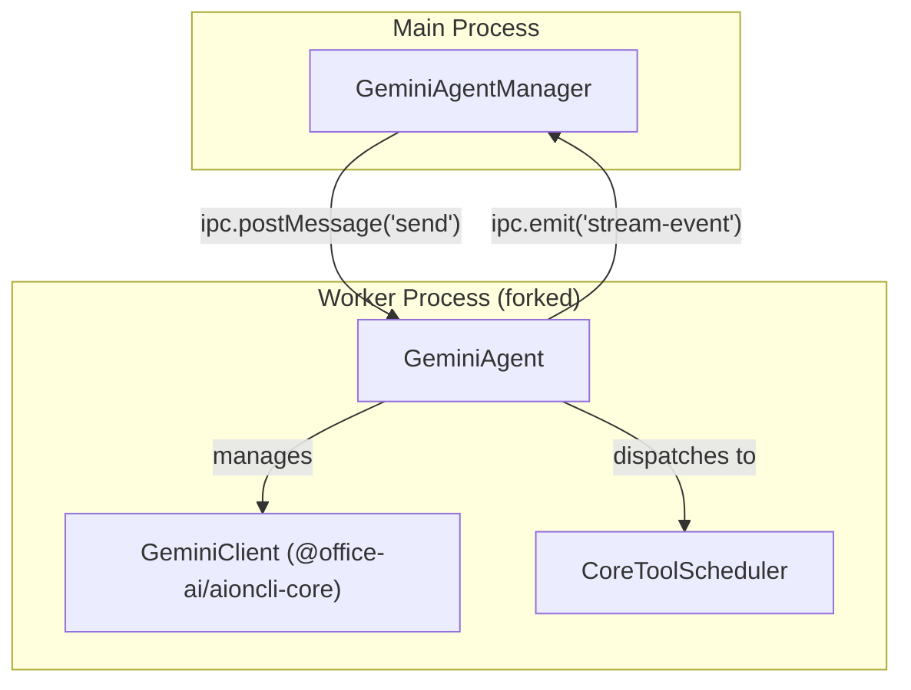
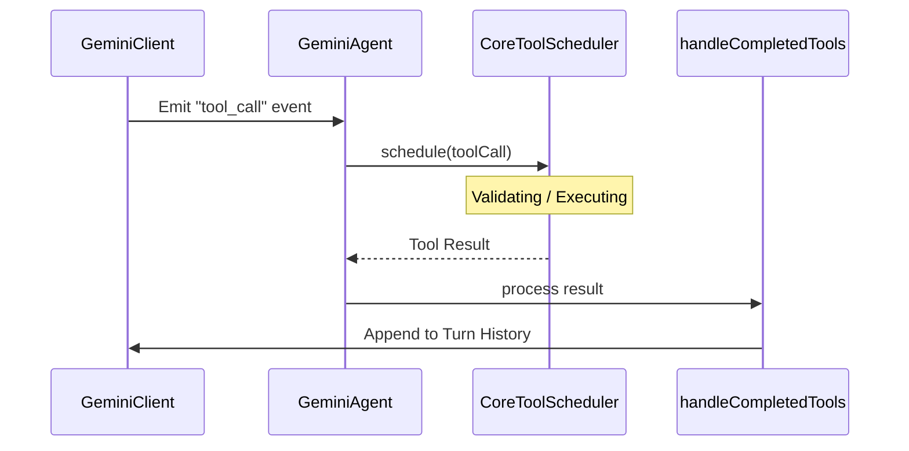

# Gemini Agent

Relevant source files

The following files were used as context for generating this wiki page:

- [src/process/agent/gemini/index.ts](src/process/agent/gemini/index.ts)
- [src/process/resources/skills/_builtin/cron/SKILL.md](src/process/resources/skills/_builtin/cron/SKILL.md)
- [src/renderer/pages/conversation/Messages/components/MessageSkillSuggest.tsx](src/renderer/pages/conversation/Messages/components/MessageSkillSuggest.tsx)
- [tests/unit/geminiAbortRecovery.test.ts](tests/unit/geminiAbortRecovery.test.ts)
- [tests/unit/geminiBootstrapRejection.test.ts](tests/unit/geminiBootstrapRejection.test.ts)
- [tests/unit/geminiWorkspaceEacces.test.ts](tests/unit/geminiWorkspaceEacces.test.ts)
- [tests/unit/geminiWorkspaceRecovery.test.ts](tests/unit/geminiWorkspaceRecovery.test.ts)

The Gemini Agent is a core AI implementation in AionUi that leverages the Google Gemini model series (including Flash and Pro variants) through a robust worker-process architecture. It provides advanced capabilities such as Model Context Protocol (MCP) integration, a sophisticated tool scheduling system, and native support for Google OAuth and API key authentication.

## Architecture Overview

The Gemini Agent operates using a decoupled architecture where the agent logic runs in a dedicated worker process, managed by the `GeminiAgentManager` in the main process. This ensures that long-running AI tasks or tool executions do not block the application's main thread.

### Process Relationship

The following diagram illustrates the relationship between the `GeminiAgentManager`, the `GeminiAgent` instance, and the underlying `GeminiClient` from the `@office-ai/aioncli-core` library.

**Gemini Agent Process Bridge**

Sources: `[src/process/agent/gemini/index.ts:103-133]()`, `[src/process/task/GeminiAgentManager.ts:40-55]()`

## GeminiAgentManager Lifecycle

The `GeminiAgentManager` acts as the lifecycle controller for a Gemini session. It is responsible for spawning the worker process, initializing the agent with the correct workspace and model configuration, and handling message routing.

### Key Lifecycle Phases
1.  **Initialization**: Upon creation, it triggers a `bootstrap` promise. This promise performs environment setup, including directory creation and credential validation `[src/process/agent/gemini/index.ts:164-168]()`.
2.  **Message Handling**: When `send()` is called, it ensures the bootstrap is complete before posting the message to the worker `[src/process/agent/gemini/index.ts:270-285]()`.
3.  **Abortion/Stop**: It supports graceful interruption of streams via an `AbortController`. When stopped, it triggers a history re-injection to ensure the agent's state remains consistent after the interruption `[tests/unit/geminiAbortRecovery.test.ts:48-59]()`.

Sources: `[src/process/agent/gemini/index.ts:103-168]()`, `[tests/unit/geminiAbortRecovery.test.ts:42-86]()`

## MCP Server Integration

The Gemini Agent integrates with the **Model Context Protocol (MCP)** to extend its capabilities through external servers. 

-   **Configuration**: MCP servers are passed into the agent via the `mcpServers` option during construction `[src/process/agent/gemini/index.ts:144-145]()`.
-   **Dynamic Loading**: The agent uses `loadExtensions` to resolve and initialize MCP-provided tools and resources `[src/process/agent/gemini/index.ts:39-40]()`.
-   **Context Awareness**: MCP servers allow the agent to interact with local files, databases, or external APIs using a standardized JSON-RPC interface.

Sources: `[src/process/agent/gemini/index.ts:137-158]()`, `[src/process/agent/gemini/index.ts:39-40]()`

## Built-in Tool Scheduler

AionUi implements a `CoreToolScheduler` within the Gemini Agent to manage the execution of function calls.

### Tool Execution Flow
The agent does not execute tools directly. Instead, it follows a structured scheduling pattern:
1.  **Detection**: The `GeminiClient` identifies a `tool_use` block in the model's response.
2.  **Scheduling**: The call is passed to `CoreToolScheduler` `[src/process/agent/gemini/index.ts:114-115]()`.
3.  **Guard Protection**: A `globalToolCallGuard` is used to prevent race conditions or unauthorized executions `[src/process/agent/gemini/index.ts:43-44]()`.
4.  **Completion**: Once the tool (e.g., `WebSearch`, `FileOperation`) returns a result, `handleCompletedTools` formats the output back into the conversation history `[src/process/agent/gemini/index.ts:49-50]()`.

**Tool Scheduling Logic**

Sources: `[src/process/agent/gemini/index.ts:43-52]()`, `[src/process/agent/gemini/index.ts:114-115]()`

## Streaming Event Handling

The agent communicates with the renderer process using a standardized stream event protocol. Events are processed via `processGeminiStreamEvents` `[src/process/agent/gemini/index.ts:50-51]()`.

| Event Type | Description |
| :--- | :--- |
| `text` | Incremental text chunks from the model. |
| `tool_call` | Information about a tool being invoked (name, arguments). |
| `tool_response` | The output of a completed tool execution. |
| `error` | Errors occurring during the stream or bootstrap `[tests/unit/geminiBootstrapRejection.test.ts:83-85]()`. |
| `finish` | Signals the end of the current response turn. |

Sources: `[src/process/agent/gemini/index.ts:50-52]()`, `[tests/unit/geminiBootstrapRejection.test.ts:79-98]()`

## Resilience and Error Handling

The implementation includes several guards to handle common environmental issues:

-   **Workspace Recovery**: If a temporary workspace directory is deleted, the agent recreates it using `fs.mkdir(path, { recursive: true })` before initialization to prevent `ENOENT` errors `[tests/unit/geminiWorkspaceRecovery.test.ts:18-38]()`.
-   **EACCES Guard**: The agent calls `fs.realpath` early in the `initialize()` phase to catch permission denied errors before they trigger unhandled rejections in the core library `[tests/unit/geminiWorkspaceEacces.test.ts:6-16]()`.
-   **Bootstrap Rejection**: The agent uses a `.catch(() => {})` pattern on its internal bootstrap promise to prevent Node.js `unhandledRejection` events while still allowing callers to `await` and catch errors during the first message send `[tests/unit/geminiBootstrapRejection.test.ts:30-45]()`.

Sources: `[tests/unit/geminiWorkspaceRecovery.test.ts:1-72]()`, `[tests/unit/geminiWorkspaceEacces.test.ts:1-76]()`, `[tests/unit/geminiBootstrapRejection.test.ts:1-100]()`