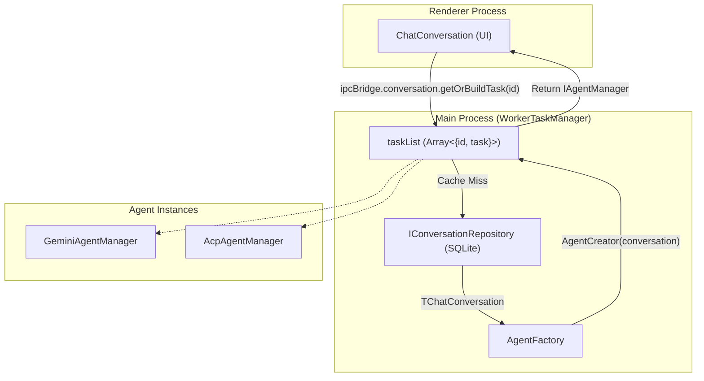
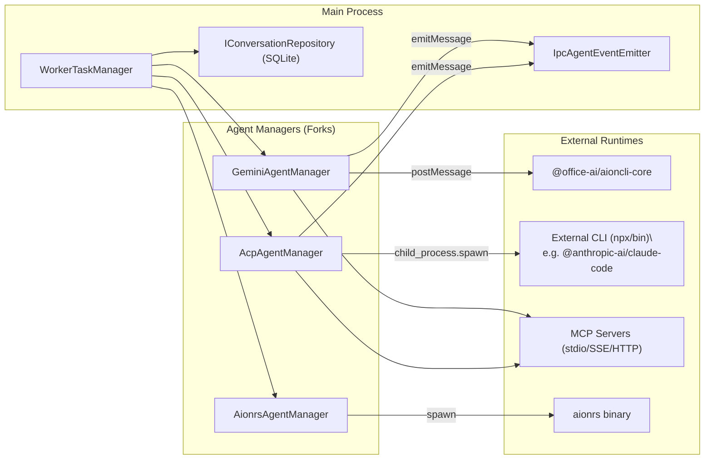

# AI Agent Systems

Relevant source files

The following files were used as context for generating this wiki page:

- [src/process/agent/acp/utils.ts](src/process/agent/acp/utils.ts)
- [src/process/task/AcpAgentManager.ts](src/process/task/AcpAgentManager.ts)
- [src/process/task/AgentFactory.ts](src/process/task/AgentFactory.ts)
- [src/process/task/BaseAgentManager.ts](src/process/task/BaseAgentManager.ts)
- [src/process/task/GeminiAgentManager.ts](src/process/task/GeminiAgentManager.ts)
- [src/process/task/IAgentEventEmitter.ts](src/process/task/IAgentEventEmitter.ts)
- [src/process/task/IAgentFactory.ts](src/process/task/IAgentFactory.ts)
- [src/process/task/IAgentManager.ts](src/process/task/IAgentManager.ts)
- [src/process/task/IWorkerTaskManager.ts](src/process/task/IWorkerTaskManager.ts)
- [src/process/task/IpcAgentEventEmitter.ts](src/process/task/IpcAgentEventEmitter.ts)
- [src/process/task/WorkerTaskManager.ts](src/process/task/WorkerTaskManager.ts)
- [tests/unit/AgentFactory.test.ts](tests/unit/AgentFactory.test.ts)
- [tests/unit/BaseAgentManagerDecouple.test.ts](tests/unit/BaseAgentManagerDecouple.test.ts)
- [tests/unit/IpcAgentEventEmitter.test.ts](tests/unit/IpcAgentEventEmitter.test.ts)
- [tests/unit/WorkerTaskManager.test.ts](tests/unit/WorkerTaskManager.test.ts)

This page provides an overview of the multi-agent architecture in AionUi, explaining how different agent types (Gemini, ACP, Codex, OpenClaw, Nanobot, Aionrs, Remote) are integrated and orchestrated. AionUi uses a provider-agnostic framework where the `WorkerTaskManager` manages the lifecycle of agent instances tied to specific conversations.

For implementation details of individual agent systems, see the linked child pages. For information on how AI model providers and API keys are configured, see [Model Configuration & API Management](#4.7).

---

## Agent Architecture Overview

AionUi supports several runtime agent categories. Each agent type maps to a specific conversation type value defined in the `TChatConversation` schema [src/common/config/storage.ts:12](). The system uses a factory pattern to instantiate the appropriate manager based on the conversation metadata.

| Conversation Type | Agent Manager Class | Description |
|---|---|---|
| `gemini` | `GeminiAgentManager` | Built-in agent powered by `@office-ai/aioncli-core`. Supports native tool scheduling, MCP, and vision. [src/process/task/GeminiAgentManager.ts:47-66]() |
| `acp` | `AcpAgentManager` | Integration for the Agent Communication Protocol. Wraps external CLI agents like Claude Code and Goose AI. [src/process/task/AcpAgentManager.ts:79-113]() |
| `codex` | `CodexAgentManager` | OpenAI Codex agent integration, handling file-system operations with specialized event handlers. |
| `aionrs` | `AionrsAgentManager` | Bundled Rust-based agent providing high-performance local capabilities. |
| `openclaw-gateway`| `OpenClawAgentManager` | Specialized integration for the OpenClaw platform gateway. |
| `nanobot` | `NanoBotAgentManager` | Simplified agent implementation for Nanobot integration. |
| `remote` | `RemoteAgentManager` | Connects to external OpenClaw-compatible gateways without a local process. |

Sources: [src/process/task/AcpAgentManager.ts:79-113](), [src/process/task/GeminiAgentManager.ts:47-66](), [src/process/task/agentTypes.ts:10-15]()

---

## Task Orchestration

The `WorkerTaskManager` is the central orchestrator responsible for mapping conversation IDs to live agent instances. It maintains a `taskList` to ensure that returning to a conversation resumes the existing session state rather than spawning a new process.

### Key Components

- **`WorkerTaskManager`**: Manages the `taskList` cache. It provides `getOrBuildTask(id)` which fetches conversation metadata from the `IConversationRepository` and uses the `AgentFactory` to build the agent [src/process/task/WorkerTaskManager.ts:21-62]().
- **`AgentFactory`**: A registry-based factory where agent creators are mapped to `AgentType` strings (`gemini`, `acp`, etc.) [src/process/task/AgentFactory.ts:13-25]().
- **`BaseAgentManager`**: The abstract base class providing common functionality like message queuing, confirmation (tool approval) handling, and `yoloMode` (auto-approval) logic [src/process/task/BaseAgentManager.ts:17-57]().
- **`IpcAgentEventEmitter`**: Bridges agent events (messages, confirmations) to the renderer process via `ipcBridge` [src/process/task/IpcAgentEventEmitter.ts:27-53]().

### Agent Initialization Flow

**Diagram: Conversation to Agent Task Resolution**

Sources: [src/process/task/WorkerTaskManager.ts:62-78](), [src/process/task/AgentFactory.ts:20-24](), [src/process/task/IpcAgentEventEmitter.ts:46-52]()

---

## Core Capabilities

### Tool and Permission System
Agents in AionUi are capable of executing tools (file operations, web search, etc.). The `BaseAgentManager` implements a confirmation system where tool calls are queued as `IConfirmation` objects [src/process/task/BaseAgentManager.ts:61-83]().
- **Interactive Mode**: Users must approve tool calls via the UI. The manager emits `emitConfirmationAdd` to the renderer [src/process/task/IpcAgentEventEmitter.ts:28-31]().
- **Yolo Mode**: When `yoloMode` is enabled (e.g., for cron tasks), the manager automatically selects the first approval option after a 50ms delay [src/process/task/BaseAgentManager.ts:63-73]().

### Skill Injection
Before an agent starts, AionUi can inject "Skills" (pre-defined system prompts or toolsets). The `GeminiAgentManager` uses `buildSystemInstructionsWithSkillsIndex` to load these capabilities from the `skills/` directory [src/process/task/GeminiAgentManager.ts:15-16]().

### Idle Management
To conserve system resources, the `WorkerTaskManager` runs a periodic check (every 1 minute) to kill `acp` agents that have been idle longer than the configured `acp.agentIdleTimeout` [src/process/task/WorkerTaskManager.ts:29-56]().

---

## System Topology

**Diagram: Multi-Agent Process Architecture**

Sources: [src/process/task/WorkerTaskManager.ts:21-30](), [src/process/task/AcpAgentManager.ts:150-180](), [src/process/task/GeminiAgentManager.ts:126-132](), [src/process/task/IpcAgentEventEmitter.ts:46-52]()

---

## Child Pages

| Section | Topic |
|---|---|
| [Gemini Agent](#4.1) | Implementation of the Gemini-specific manager, worker process architecture, and MCP integration. |
| [4.2 Codex Agent](#4.2) | Event processing and session management for the legacy Codex protocol. |
| [ACP Agent Integration](#4.3) | JSON-RPC protocol handling, CLI process spawning, and unified conversation API. |
| [OpenClaw, Nanobot, and Remote Agents](#4.4) | Gateway-based architecture and simplified agent wrappers for remote backends. |
| [Tool System Architecture](#4.5) | `CoreToolScheduler` and the lifecycle of tool execution (scheduled → terminal). |
| [MCP Integration](#4.6) | Model Context Protocol support including OAuth and various transport types (stdio, SSE, HTTP). |
| [Model Configuration & API Management](#4.7) | `IProvider` interface, model capability detection, and support for 20+ AI platforms. |
| [Assistant Presets & Skills](#4.8) | System prompt injection and the `skills/` directory management. |
| [Cron & Scheduled Tasks](#4.9) | 24/7 autonomous operation using `yoloMode` and background cron execution. |
| [Team Mode (Multi-Agent Collaboration)](#4.10) | Lead/Teammate coordination via `TeamSessionService` and shared state. |
| [Aionrs Agent](#4.11) | Bundled Rust-based agent integration, binary resolution, and JSON-line event protocol. |