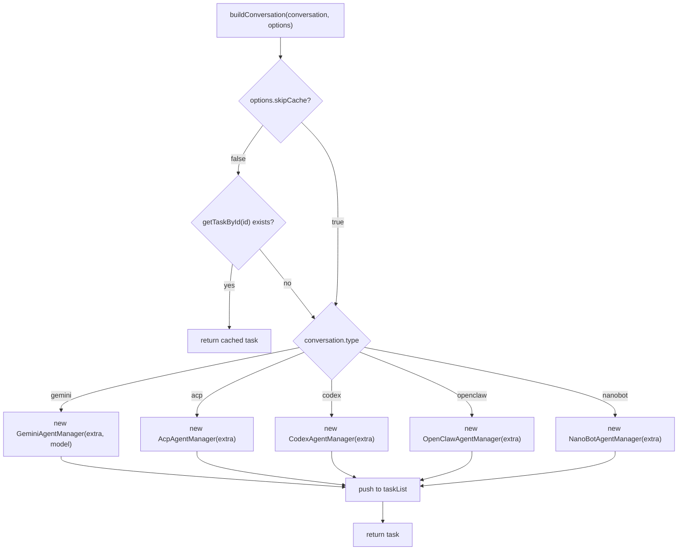
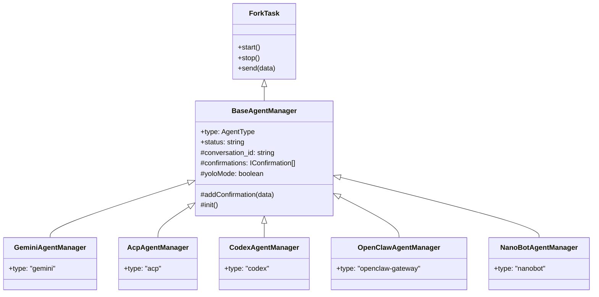
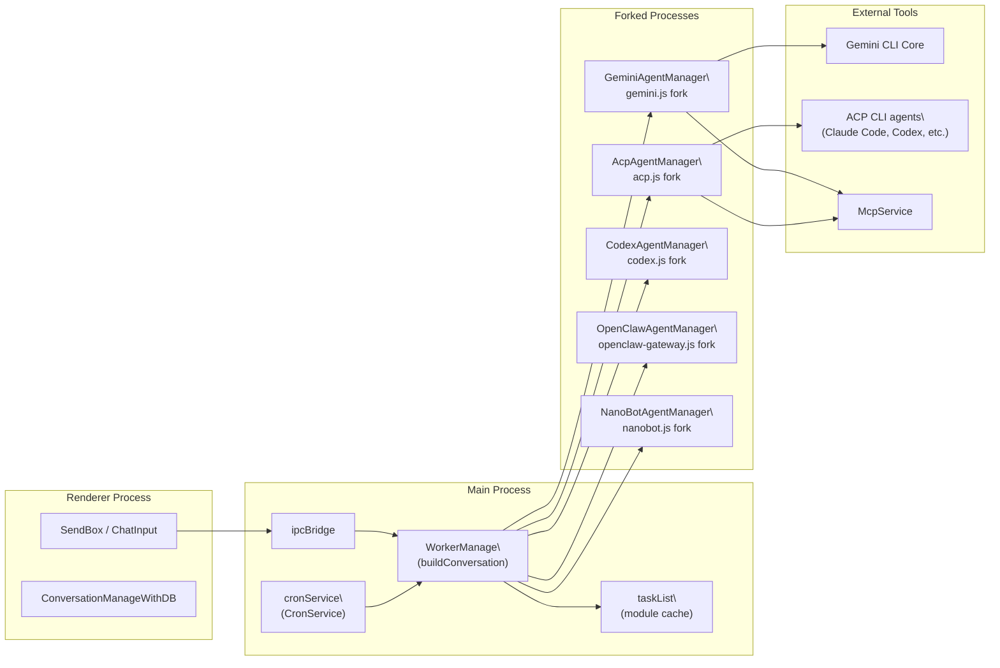

# AI Agent Systems

Relevant source files

The following files were used as context for generating this wiki page:

- [readme.md](readme.md)
- [readme_ch.md](readme_ch.md)
- [readme_es.md](readme_es.md)
- [readme_jp.md](readme_jp.md)
- [readme_ko.md](readme_ko.md)
- [readme_pt.md](readme_pt.md)
- [readme_tr.md](readme_tr.md)
- [readme_tw.md](readme_tw.md)
- [resources/wechat_group4.png](resources/wechat_group4.png)
- [src/common/ipcBridge.ts](src/common/ipcBridge.ts)
- [src/common/storage.ts](src/common/storage.ts)
- [src/renderer/pages/guid/index.tsx](src/renderer/pages/guid/index.tsx)

This page provides an overview of the AI agent types supported in AionUi, how agent instances are created per conversation, and how `WorkerManage` orchestrates their lifecycles. For implementation details of individual agent types, see the linked subsections. For information on how AI model providers and API keys are configured, see [Model Configuration & API Management](#4.6). For how the UI dispatches messages to agents, see [Message Input System](#5.5).

---

## Agent Types

AionUi supports five runtime agent categories. Each agent type maps to a specific conversation type value stored in `TChatConversation.type`.

| Conversation Type | Agent Manager Class    | Description                                                                                                                                                        |
| ----------------- | ---------------------- | ------------------------------------------------------------------------------------------------------------------------------------------------------------------ |
| `gemini`          | `GeminiAgentManager`   | Built-in agent powered by the Gemini CLI core. Zero external setup required. Supports file I/O, web search, image generation, and MCP tools.                       |
| `acp`             | `AcpAgentManager`      | Agent Communication Protocol integration. Wraps external CLI agents (Claude Code, Qwen Code, Goose AI, OpenClaw, Augment Code, etc.) that expose the ACP protocol. |
| `codex`           | `CodexAgentManager`    | OpenAI Codex agent. Uses an event-driven architecture with dedicated event handlers and message processors.                                                        |
| `openclaw`        | `OpenClawAgentManager` | OpenClaw gateway agent. A specialized ACP-adjacent integration for the OpenClaw platform.                                                                          |
| `nanobot`         | `NanoBotAgentManager`  | Nanobot agent integration.                                                                                                                                         |

The set of supported CLI agents that map to the `acp` type includes Claude Code, Codex CLI, Qwen Code, Goose AI, Augment Code, iFlow CLI, CodeBuddy, Kimi CLI, OpenCode, Factory Droid, GitHub Copilot, Qoder CLI, Mistral Vibe, and Nanobot.

Sources: [src/process/WorkerManage.ts:1-20](), [readme.md:93-93]()

---

## WorkerManage

`WorkerManage` is the central module in `src/process/WorkerManage.ts` responsible for mapping `TChatConversation` objects to live agent task instances. It maintains a module-level `taskList` cache to avoid creating duplicate instances for the same conversation.

### Key Constructs

- **`taskList`** — A module-level array of `{ id: string; task: AgentBaseTask<unknown> }` objects. One entry per active conversation.
- **`buildConversation(conversation, options?)`** — The primary factory function. Checks `taskList` for a cached instance before creating a new one. Switches on `conversation.type` to instantiate the correct manager class.
- **`BuildConversationOptions`** — Runtime options passed at instantiation:
  - `yoloMode?: boolean` — Auto-approves all tool call confirmations.
  - `skipCache?: boolean` — Bypasses `taskList` and creates a fresh isolated instance (used by cron jobs).
- **`getTaskById(id)`** — Looks up a cached task by conversation ID.

Sources: [src/process/WorkerManage.ts:18-130]()

### Agent Instantiation Flow

**Diagram: `buildConversation` dispatch in WorkerManage**

Sources: [src/process/WorkerManage.ts:34-130]()

---

## BaseAgentManager

All agent manager classes extend `BaseAgentManager`, defined in `src/process/task/BaseAgentManager.ts`. `BaseAgentManager` itself extends `ForkTask`, which means each agent runs in a separate forked Node.js process. The fork script is resolved by agent type at construction time.

### Class Hierarchy

**Diagram: Agent manager class hierarchy**

Sources: [src/process/task/BaseAgentManager.ts:1-60](), [src/process/WorkerManage.ts:8-16]()

### Key Properties

| Property          | Type                                                | Description                                                                                             |
| ----------------- | --------------------------------------------------- | ------------------------------------------------------------------------------------------------------- |
| `type`            | `AgentType`                                         | Identifies which fork script to load (`gemini.js`, `acp.js`, etc.)                                      |
| `status`          | `'pending' \| 'running' \| 'finished' \| undefined` | Lifecycle state of the agent task                                                                       |
| `yoloMode`        | `boolean`                                           | When `true`, `addConfirmation` auto-selects the first available option instead of queuing a user prompt |
| `confirmations`   | `IConfirmation[]`                                   | Pending confirmation requests waiting for user approval                                                 |
| `conversation_id` | `string`                                            | Binds the task to a specific conversation in the database                                               |

The `AgentType` union is `'gemini' | 'acp' | 'codex' | 'openclaw-gateway' | 'nanobot'`. Each value maps to a compiled fork script at `__dirname/<type>.js`.

Sources: [src/process/task/BaseAgentManager.ts:12-50]()

---

## System Topology

**Diagram: Full agent system topology and code entities**

Sources: [src/process/WorkerManage.ts:1-130](), [src/process/initBridge.ts:1-20]()

---

## Lifecycle and Initialization

Agent tasks are created lazily on first message send. The `taskList` in `WorkerManage` persists for the lifetime of the main process, so returning to a conversation resumes the same in-memory task instance.

Cron-triggered sessions use `skipCache: true` and `yoloMode: true` to create isolated, auto-approving instances that do not interfere with interactive sessions. See [Cron & Scheduled Tasks](#4.8) for details.

`cronService` is initialized in `src/process/initBridge.ts` immediately after all IPC bridges are established. Agent tasks themselves are only created when a conversation is first activated by `buildConversation`.

Sources: [src/process/initBridge.ts:9-19](), [src/process/WorkerManage.ts:27-45]()

---

## Subsystem References

Each agent type and supporting system is documented in a dedicated subsection:

| Page                                             | Topic                                                                                 |
| ------------------------------------------------ | ------------------------------------------------------------------------------------- |
| [4.1 Gemini Agent System](#4.1)                  | `GeminiAgent`, `loadCliConfig`, stream processing, API key management                 |
| [4.2 Codex Agent System](#4.2)                   | `CodexEventHandler`, `CodexMessageProcessor`, `CodexToolHandlers`, session management |
| [4.3 ACP Agent Integration](#4.3)                | `AcpConnection`, `AcpAgent`, `AcpAgentManager`, `AcpDetector`                         |
| [4.4 Tool System Architecture](#4.4)             | `ConversationToolConfig`, `CoreToolScheduler`, `ImageGenerationTool`                  |
| [4.5 MCP Integration](#4.5)                      | `McpService`, `AbstractMcpAgent`, per-agent MCP backends                              |
| [4.6 Model Configuration & API Management](#4.6) | `IProvider`, `RotatingApiClient`, API key rotation                                    |
| [4.7 Assistant Presets & Skills](#4.7)           | `ASSISTANT_PRESETS`, skills files, `AssistantManagement` UI                           |
| [4.8 Cron & Scheduled Tasks](#4.8)               | `CronService`, autonomous scheduled agent sessions                                    |
