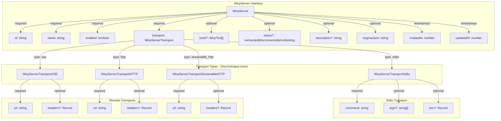
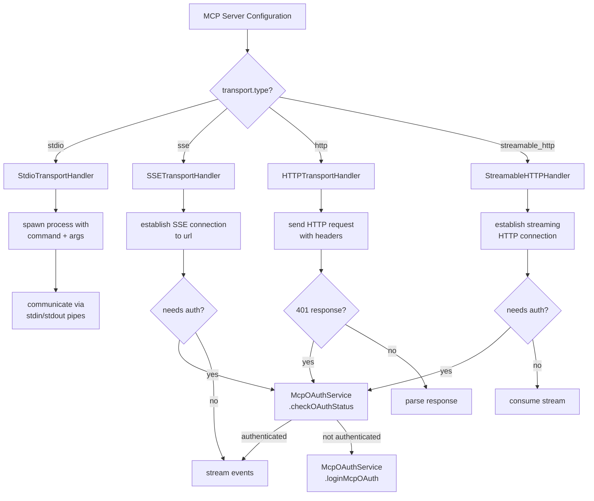
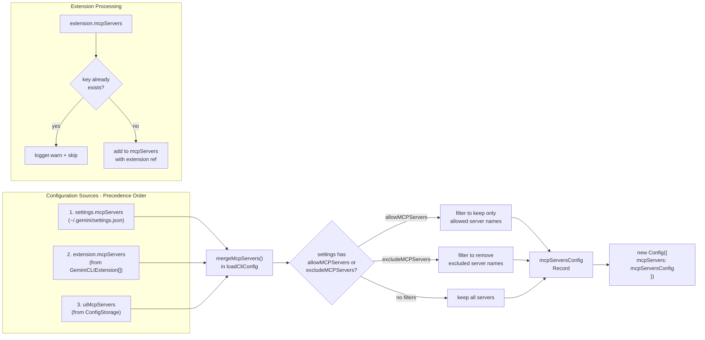
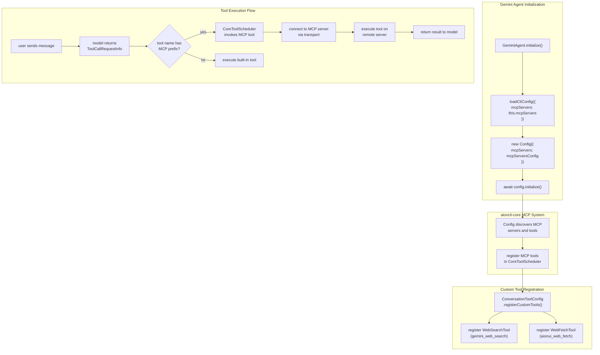
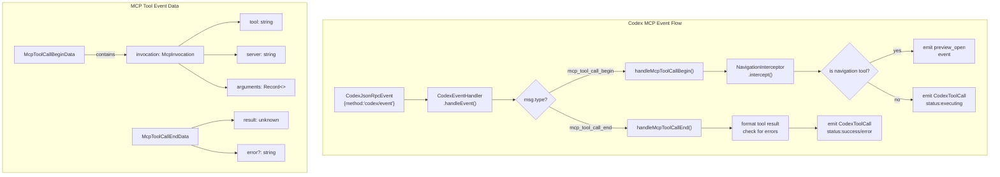
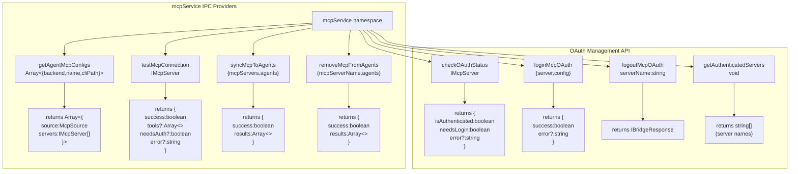
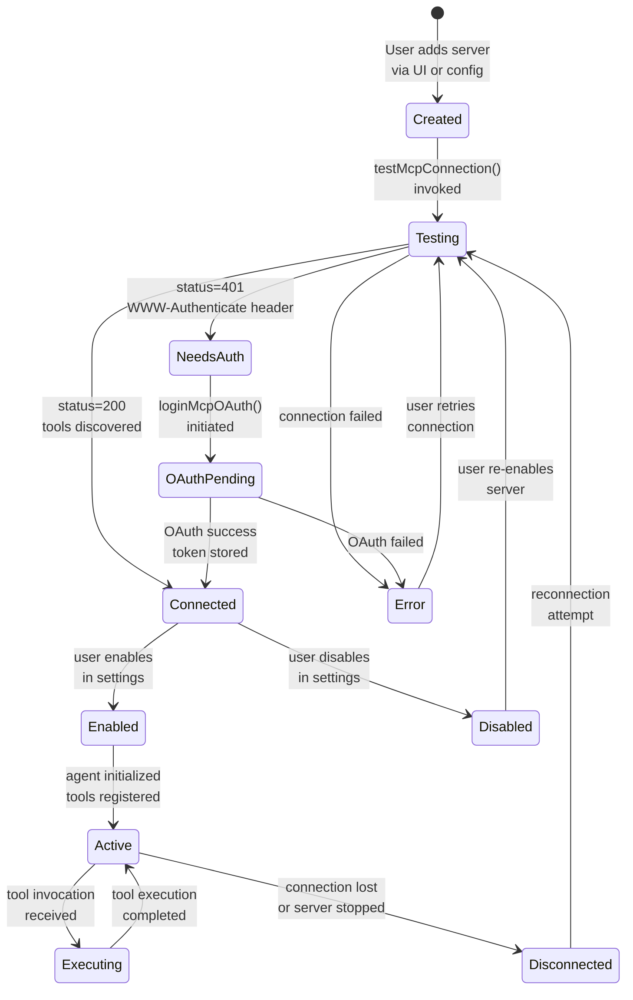
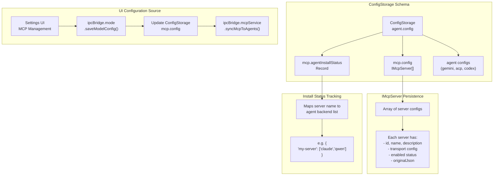

# MCP Integration

<details>
<summary>Relevant source files</summary>

The following files were used as context for generating this wiki page:

- [src/agent/codex/core/ErrorService.ts](src/agent/codex/core/ErrorService.ts)
- [src/agent/codex/handlers/CodexEventHandler.ts](src/agent/codex/handlers/CodexEventHandler.ts)
- [src/agent/codex/handlers/CodexFileOperationHandler.ts](src/agent/codex/handlers/CodexFileOperationHandler.ts)
- [src/agent/codex/handlers/CodexSessionManager.ts](src/agent/codex/handlers/CodexSessionManager.ts)
- [src/agent/codex/handlers/CodexToolHandlers.ts](src/agent/codex/handlers/CodexToolHandlers.ts)
- [src/agent/codex/messaging/CodexMessageProcessor.ts](src/agent/codex/messaging/CodexMessageProcessor.ts)
- [src/agent/gemini/cli/atCommandProcessor.ts](src/agent/gemini/cli/atCommandProcessor.ts)
- [src/agent/gemini/cli/config.ts](src/agent/gemini/cli/config.ts)
- [src/agent/gemini/cli/errorParsing.ts](src/agent/gemini/cli/errorParsing.ts)
- [src/agent/gemini/cli/tools/web-fetch.ts](src/agent/gemini/cli/tools/web-fetch.ts)
- [src/agent/gemini/cli/tools/web-search.ts](src/agent/gemini/cli/tools/web-search.ts)
- [src/agent/gemini/cli/types.ts](src/agent/gemini/cli/types.ts)
- [src/agent/gemini/cli/useReactToolScheduler.ts](src/agent/gemini/cli/useReactToolScheduler.ts)
- [src/agent/gemini/index.ts](src/agent/gemini/index.ts)
- [src/agent/gemini/utils.ts](src/agent/gemini/utils.ts)
- [src/common/codex/types/eventData.ts](src/common/codex/types/eventData.ts)
- [src/common/codex/types/eventTypes.ts](src/common/codex/types/eventTypes.ts)
- [src/common/ipcBridge.ts](src/common/ipcBridge.ts)
- [src/common/storage.ts](src/common/storage.ts)
- [src/process/services/mcpServices/McpOAuthService.ts](src/process/services/mcpServices/McpOAuthService.ts)
- [src/renderer/pages/guid/index.tsx](src/renderer/pages/guid/index.tsx)

</details>

## Purpose and Scope

This document describes the Model Context Protocol (MCP) server integration system in AionUi. MCP enables AI agents to access external tools and resources through a standardized protocol. The integration supports four transport types (stdio, SSE, HTTP, streamable_http), OAuth authentication for remote servers, and configuration management across multiple sources.

For agent-specific tool execution, see [Tool System Architecture](#4.5). For OAuth credential management, see [Authentication](#9).

---

## MCP Server Configuration Data Model

MCP servers are configured through the `IMcpServer` interface which supports multiple transport mechanisms and lifecycle states.

### Configuration Structure



**Sources:**

- [src/common/storage.ts:390-438]()

---

## Transport Layer Architecture

The system supports four transport mechanisms for MCP server communication, each optimized for different deployment scenarios.

### Transport Type Comparison

| Transport Type    | Use Case                               | Connection Model                | Authentication        |
| ----------------- | -------------------------------------- | ------------------------------- | --------------------- |
| `stdio`           | Local CLI tools via process spawning   | Child process with stdin/stdout | Environment variables |
| `sse`             | Remote servers with server-sent events | HTTP long-polling               | Headers + OAuth       |
| `http`            | Remote REST-style endpoints            | Request-response                | Headers + OAuth       |
| `streamable_http` | Remote streaming responses             | HTTP streaming                  | Headers + OAuth       |

### Transport Selection Flow



**Sources:**

- [src/common/storage.ts:390-418]()
- [src/process/services/mcpServices/McpOAuthService.ts:46-100]()

---

## OAuth Authentication System

Remote MCP servers (SSE, HTTP, streamable_http) can require OAuth authentication. The `McpOAuthService` class manages the complete OAuth flow using `@office-ai/aioncli-core` primitives.

### OAuth Service Architecture

```mermaid
graph TB
    subgraph "McpOAuthService Class"
        SERVICE["McpOAuthService"]
        SERVICE -->|manages| PROVIDER["MCPOAuthProvider<br/>from aioncli-core"]
        SERVICE -->|manages| STORAGE["MCPOAuthTokenStorage<br/>from aioncli-core"]
        SERVICE -->|emits| EVENTS["EventEmitter<br/>OAUTH_DISPLAY_MESSAGE_EVENT"]
    end

    subgraph "OAuth Status Check Flow"
        CHECK_START["checkOAuthStatus(server)"]
        CHECK_START --> VALIDATE_TRANSPORT{"transport is<br/>http or sse?"}
        VALIDATE_TRANSPORT -->|no| SKIP["return authenticated:true"]
        VALIDATE_TRANSPORT -->|yes| FETCH_SERVER["fetch(server.url)"]

        FETCH_SERVER --> CHECK_401{"status === 401?"}
        CHECK_401 -->|no| SUCCESS["return authenticated:true"]
        CHECK_401 -->|yes| CHECK_WWW["check WWW-Authenticate<br/>header"]

        CHECK_WWW --> LOAD_CREDS["tokenStorage.getCredentials<br/>(server.name)"]
        LOAD_CREDS --> HAS_TOKEN{"has valid token?"}
        HAS_TOKEN -->|yes| EXPIRED["return authenticated:true<br/>needsLogin:false"]
        HAS_TOKEN -->|no| NEED_LOGIN["return authenticated:false<br/>needsLogin:true"]
    end

    subgraph "OAuth Login Flow"
        LOGIN_START["loginMcpOAuth(server, config)"]
        LOGIN_START --> PARSE_WWW["parse WWW-Authenticate<br/>for OAuth params"]
        PARSE_WWW --> BUILD_CONFIG["build MCPOAuthConfig<br/>authUrl, tokenUrl, etc"]
        BUILD_CONFIG --> INITIATE["oauthProvider.initiateOAuth<br/>(serverName, config)"]

        INITIATE --> OPEN_BROWSER["open browser for<br/>user authorization"]
        OPEN_BROWSER --> CALLBACK["receive callback with<br/>authorization code"]
        CALLBACK --> EXCHANGE["exchange code for<br/>access token"]
        EXCHANGE --> STORE["tokenStorage.saveCredentials<br/>(serverName, token)"]
    end
```



**Implementation Details:**

The `McpOAuthService` constructor initializes both storage and provider:

```
constructor() {
  this.tokenStorage = new MCPOAuthTokenStorage();
  this.oauthProvider = new MCPOAuthProvider(this.tokenStorage);
  this.eventEmitter = new EventEmitter();
}
```

**Sources:**

- [src/process/services/mcpServices/McpOAuthService.ts:1-179]()
- [src/common/ipcBridge.ts:279-283]()

---

## Configuration Management System

MCP server configurations are merged from three sources with defined precedence: settings files, extensions, and UI configuration. The `loadCliConfig` function orchestrates this merge for Gemini agents.

### Configuration Merge Strategy



**Merge Function Implementation:**

The `mergeMcpServers` function at [src/agent/gemini/cli/config.ts:339-369]() implements the precedence logic:

1. Start with `settings.mcpServers`
2. Add servers from each extension (skip if key exists)
3. Override with `uiMcpServers` (highest precedence)

**Filtering Logic:**

The configuration applies allow/exclude filters at [src/agent/gemini/cli/config.ts:175-189]():

- `allowMCPServers`: whitelist specific server names
- `excludeMCPServers`: blacklist specific server names
- If both are present, allowlist takes precedence

**Sources:**

- [src/agent/gemini/cli/config.ts:70-336]()
- [src/agent/gemini/cli/config.ts:339-379]()

---

## Agent Integration

MCP servers are integrated differently across agent types, with Gemini using aioncli-core's native MCP support, while Codex receives MCP tool invocation events.

### Gemini Agent MCP Integration



**Key Integration Points:**

1. **MCP Server Configuration:** Passed to `loadCliConfig` at [src/agent/gemini/index.ts:126]()
2. **Tool Registration:** Happens during `config.initialize()` at [src/agent/gemini/index.ts:329]()
3. **Custom Tools:** Registered via `ConversationToolConfig` at [src/agent/gemini/index.ts:393]()

**Sources:**

- [src/agent/gemini/index.ts:118-396]()
- [src/agent/gemini/cli/config.ts:222-281]()

### Codex Agent MCP Integration



**Codex Event Handling:**

The `CodexEventHandler` processes MCP tool events at [src/agent/codex/handlers/CodexEventHandler.ts:129-138]():

- `mcp_tool_call_begin`: Tool invocation starts
- `mcp_tool_call_end`: Tool execution completes

**Navigation Interception:**

Chrome DevTools navigation tools are intercepted at [src/agent/codex/handlers/CodexToolHandlers.ts:198-212]() to emit `preview_open` events for URL display.

**Sources:**

- [src/agent/codex/handlers/CodexEventHandler.ts:1-350]()
- [src/agent/codex/handlers/CodexToolHandlers.ts:187-262]()
- [src/common/codex/types/eventData.ts:42-43]()

---

## IPC Bridge API

The IPC bridge provides a comprehensive API for MCP server management accessible from the renderer process.

### MCP Service API Structure



**API Usage Pattern:**

```typescript
// Test MCP server connection
const testResult = await ipcBridge.mcpService.testMcpConnection({
  id: 'server-id',
  name: 'my-mcp-server',
  enabled: true,
  transport: { type: 'http', url: 'http://localhost:8000' },
  createdAt: Date.now(),
  updatedAt: Date.now(),
})

if (testResult.data?.needsAuth) {
  // Initiate OAuth login
  await ipcBridge.mcpService.loginMcpOAuth({
    server: mcpServer,
    config: oauthConfig,
  })
}
```

**Sources:**

- [src/common/ipcBridge.ts:273-284]()

---

## Server Lifecycle Management

MCP servers have a defined lifecycle from configuration through connection testing to tool execution.

### Lifecycle State Machine



**Lifecycle Properties:**

The `IMcpServer.status` field tracks connection state at [src/common/storage.ts:427]():

- `connected`: Server is reachable and tools are available
- `disconnected`: Server was connected but is now offline
- `error`: Connection attempt failed
- `testing`: Connection test in progress

The `IMcpServer.enabled` field controls installation state at [src/common/storage.ts:424]():

- `true`: Server is installed to CLI agents
- `false`: Server is configured but not installed

**Sources:**

- [src/common/storage.ts:420-432]()
- [src/process/services/mcpServices/McpOAuthService.ts:46-100]()

---

## Configuration Storage

MCP server configurations are persisted in `ConfigStorage` and synchronized across agent configurations.

### Storage Schema



**Storage Keys:**

- `mcp.config`: Array of `IMcpServer` configurations at [src/common/storage.ts:58]()
- `mcp.agentInstallStatus`: Maps server names to installed agent backends at [src/common/storage.ts:59]()

**Synchronization Flow:**

1. User configures MCP server in UI
2. Configuration saved to `ConfigStorage['mcp.config']`
3. `syncMcpToAgents` called to write to agent-specific configs
4. Each agent reads from its own config source during initialization

**Sources:**

- [src/common/storage.ts:19-118]()
- [src/common/ipcBridge.ts:277-278]()
