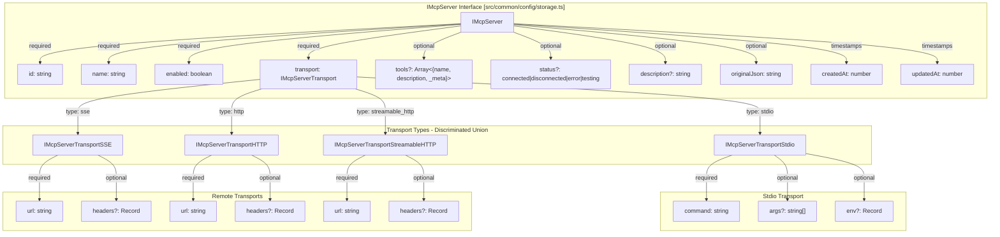
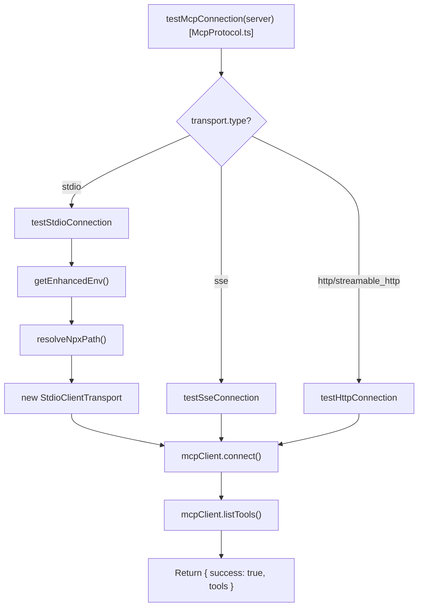
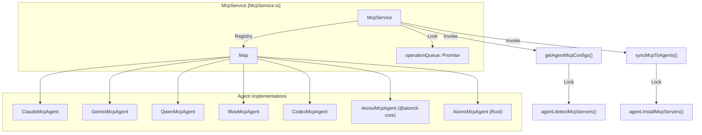
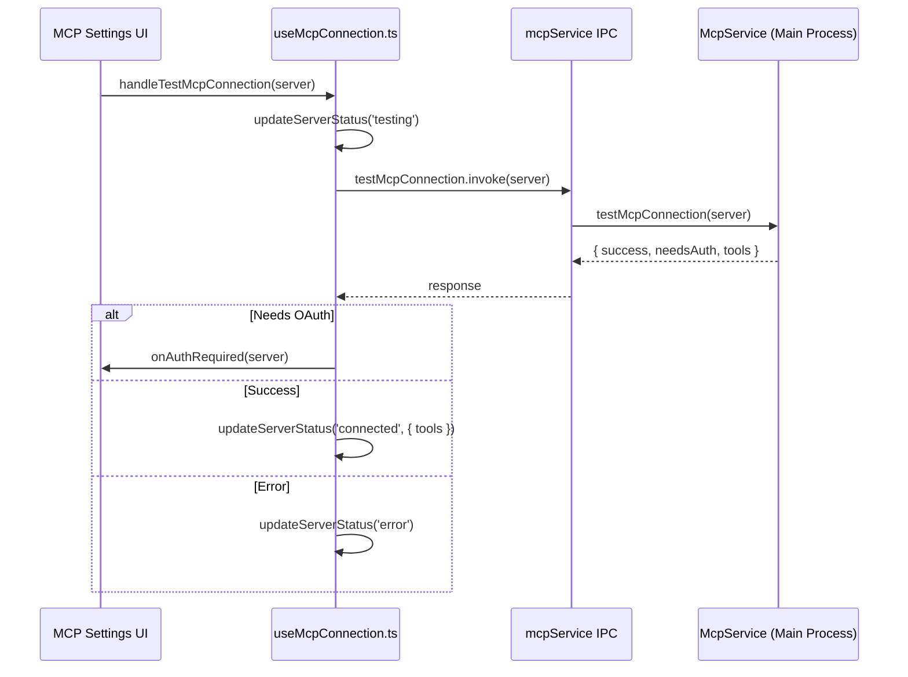
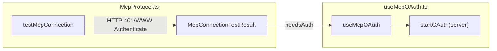

# MCP Integration

Relevant source files

The following files were used as context for generating this wiki page:

- [src/process/services/mcpServices/McpProtocol.ts](src/process/services/mcpServices/McpProtocol.ts)
- [src/process/services/mcpServices/McpService.ts](src/process/services/mcpServices/McpService.ts)
- [src/process/services/mcpServices/agents/AionuiMcpAgent.ts](src/process/services/mcpServices/agents/AionuiMcpAgent.ts)
- [src/process/services/mcpServices/agents/ClaudeMcpAgent.ts](src/process/services/mcpServices/agents/ClaudeMcpAgent.ts)
- [src/process/services/mcpServices/agents/CodexMcpAgent.ts](src/process/services/mcpServices/agents/CodexMcpAgent.ts)
- [src/process/services/mcpServices/agents/GeminiMcpAgent.ts](src/process/services/mcpServices/agents/GeminiMcpAgent.ts)
- [src/process/services/mcpServices/agents/IflowMcpAgent.ts](src/process/services/mcpServices/agents/IflowMcpAgent.ts)
- [src/process/services/mcpServices/agents/OpencodeMcpAgent.ts](src/process/services/mcpServices/agents/OpencodeMcpAgent.ts)
- [src/process/services/mcpServices/agents/QwenMcpAgent.ts](src/process/services/mcpServices/agents/QwenMcpAgent.ts)
- [src/renderer/components/settings/SettingsModal/contents/ToolsModalContent.tsx](src/renderer/components/settings/SettingsModal/contents/ToolsModalContent.tsx)
- [src/renderer/hooks/mcp/index.ts](src/renderer/hooks/mcp/index.ts)
- [src/renderer/hooks/mcp/useMcpAgentStatus.ts](src/renderer/hooks/mcp/useMcpAgentStatus.ts)
- [src/renderer/hooks/mcp/useMcpConnection.ts](src/renderer/hooks/mcp/useMcpConnection.ts)
- [src/renderer/hooks/mcp/useMcpOAuth.ts](src/renderer/hooks/mcp/useMcpOAuth.ts)
- [src/renderer/hooks/mcp/useMcpOperations.ts](src/renderer/hooks/mcp/useMcpOperations.ts)
- [src/renderer/hooks/mcp/useMcpServerCRUD.ts](src/renderer/hooks/mcp/useMcpServerCRUD.ts)
- [src/renderer/hooks/mcp/useMcpServers.ts](src/renderer/hooks/mcp/useMcpServers.ts)
- [src/renderer/pages/conversation/components/ConversationChatConfirm.tsx](src/renderer/pages/conversation/components/ConversationChatConfirm.tsx)
- [src/renderer/pages/settings/ToolsSettings/McpAgentStatusDisplay.tsx](src/renderer/pages/settings/ToolsSettings/McpAgentStatusDisplay.tsx)
- [src/renderer/pages/settings/ToolsSettings/McpManagement.tsx](src/renderer/pages/settings/ToolsSettings/McpManagement.tsx)
- [tests/unit/acpBuiltinMcp.test.ts](tests/unit/acpBuiltinMcp.test.ts)
- [tests/unit/common/toolsModalContent.dom.test.tsx](tests/unit/common/toolsModalContent.dom.test.tsx)
- [tests/unit/process/opencodeMcpAgent.test.ts](tests/unit/process/opencodeMcpAgent.test.ts)
- [tests/unit/process/services/mcpProtocol.test.ts](tests/unit/process/services/mcpProtocol.test.ts)
- [tests/unit/useMcpServerCRUD.dom.test.tsx](tests/unit/useMcpServerCRUD.dom.test.tsx)

## Purpose and Scope

This document describes the Model Context Protocol (MCP) server integration system in AionUi. MCP enables AI agents to access external tools and resources through a standardized protocol. The integration supports four transport types (`stdio`, `SSE`, `HTTP`, `streamable_http`), OAuth authentication for remote servers, and multi-agent configuration management across various CLI backends (Claude, Gemini, Qwen, iFlow, Codex, Aionrs).

The system architecture ensures that MCP servers can be discovered from local CLI installations and synchronized across multiple AI agent runtimes simultaneously.

---

## MCP Server Configuration Data Model

MCP servers are configured through the `IMcpServer` interface, which supports multiple transport mechanisms and lifecycle states.

### Configuration Structure

**Sources:**
- [src/common/config/storage.ts:400-450]()
- [src/process/services/mcpServices/McpProtocol.ts:162-188]()

---

## Transport Layer Architecture

The system supports four transport mechanisms for MCP server communication, implemented via the `AbstractMcpAgent` and specific agent subclasses.

### Transport Type Comparison

| Transport Type | Use Case | Implementation Class |
|---------------|----------|----------------------|
| `stdio` | Local CLI tools via process spawning | `StdioClientTransport` |
| `sse` | Remote servers with server-sent events | `SSEClientTransport` |
| `http` | Remote REST-style endpoints | `StreamableHTTPClientTransport` |
| `streamable_http` | Remote streaming responses | `StreamableHTTPClientTransport` |

### Transport Execution Flow

The `AbstractMcpAgent.testMcpConnection` method handles the protocol-specific logic for validating server connectivity using the `@modelcontextprotocol/sdk`.

**Sources:**
- [src/process/services/mcpServices/McpProtocol.ts:162-250]()
- [src/process/utils/shellEnv.ts:10-50]()

---

## Multi-Agent MCP Orchestration

AionUi uses a centralized `McpService` to coordinate MCP operations across different AI agent backends. Each backend (Claude, Qwen, Gemini, etc.) has a dedicated implementation of the `IMcpProtocol`.

### McpService Architecture

The `McpService` uses a `withServiceLock` mechanism to serialize heavy operations and prevent resource exhaustion from concurrent child process spawning.

**Sources:**
- [src/process/services/mcpServices/McpService.ts:29-97]()
- [src/process/services/mcpServices/McpProtocol.ts:67-107]()
- [src/process/services/mcpServices/McpService.ts:38-45]()

### Agent-Specific Implementations

Each agent handles the underlying CLI's configuration format:

*   **ClaudeMcpAgent**: Uses `claude mcp list` and `claude mcp add-json`. It parses ANSI-colored text output to reconstruct server configurations. [src/process/services/mcpServices/agents/ClaudeMcpAgent.ts:53-156]()
*   **GeminiMcpAgent**: Manages the official Google Gemini CLI via `gemini mcp list`. It includes a retry mechanism for robust detection. [src/process/services/mcpServices/agents/GeminiMcpAgent.ts:37-179]()
*   **CodexMcpAgent**: Communicates with the Codex CLI using JSON output (`codex mcp list --json`). [src/process/services/mcpServices/agents/CodexMcpAgent.ts:160-195]()
*   **IflowMcpAgent**: Supports `iflow mcp add` with specific flags for `--env` and `--header`. [src/process/services/mcpServices/agents/IflowMcpAgent.ts:155-210]()
*   **QwenMcpAgent**: Manages Qwen Code CLI configurations, supporting `user` scope additions. [src/process/services/mcpServices/agents/QwenMcpAgent.ts:148-175]()

---

## UI Integration and Connection Testing

The frontend manages MCP servers through React hooks that interface with the `mcpService` IPC bridge.

### Connection Test Flow (`useMcpConnection`)

The `useMcpConnection` hook manages the state of connection tests and handles OAuth requirements. It uses a `globalMessageQueue` to prevent UI message overlapping.

**Sources:**
- [src/renderer/hooks/mcp/useMcpConnection.ts:32-120]()
- [src/renderer/hooks/mcp/messageQueue.ts:1-10]()

### Operations Management (`useMcpOperations`)

This hook handles the synchronization of local configurations to external CLI agents.

*   **syncMcpToAgents**: Filters agents by compatible transport types before triggering the main process sync. [src/renderer/hooks/mcp/useMcpOperations.ts:127-157]()
*   **removeMcpFromAgents**: Coordinates the removal of a specific MCP server from all compatible backend agents. [src/renderer/hooks/mcp/useMcpOperations.ts:102-124]()

---

## Authentication and OAuth

Remote MCP servers requiring OAuth are handled via `McpOAuthService`. The UI detects when a server requires authentication during the connection test and triggers the appropriate flow.

### OAuth Detection and Trigger

When `testMcpConnection` returns `needsAuth: true`, the UI provides a mechanism for the user to initiate the OAuth handshake.

**Sources:**
- [src/process/services/mcpServices/McpProtocol.ts:35-42]()
- [src/renderer/hooks/mcp/useMcpConnection.ts:58-69]()
- [src/renderer/hooks/mcp/useMcpOAuth.ts:10-40]()

---

## Built-in MCP Integration

AionUi includes built-in MCP servers (e.g., image generation) that are automatically injected into ACP-compatible agent sessions.

### Session Configuration Flow

The `buildBuiltinAcpSessionMcpServers` utility transforms internal `IMcpServer` configurations into the format expected by ACP agents during session initialization.

| Feature | Description |
|---------|-------------|
| **Transport Filtering** | Only servers matching agent-supported transports (stdio, http, sse) are injected. |
| **Env Mapping** | Key-value pairs in `Record<string, string>` are transformed to `{ name, value }` arrays. |
| **Status Check** | Only servers with `enabled: true` and non-error status are included. |

**Sources:**
- [tests/unit/acpBuiltinMcp.test.ts:15-114]()
- [src/process/agent/acp/mcpSessionConfig.ts:10-30]()