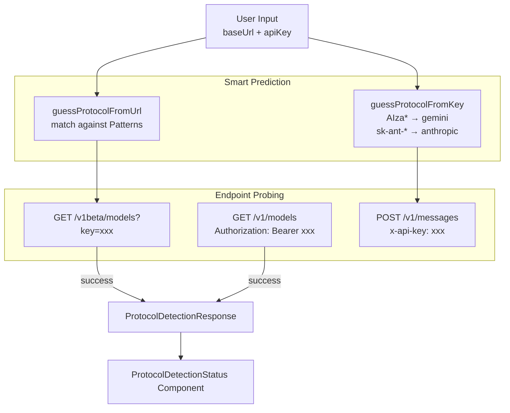

# Model Configuration & API Management

<details>
<summary>Relevant source files</summary>

The following files were used as context for generating this wiki page:

- [src/common/utils/platformAuthType.ts](src/common/utils/platformAuthType.ts)
- [src/common/utils/protocolDetector.ts](src/common/utils/protocolDetector.ts)
- [src/process/bridge/modelBridge.ts](src/process/bridge/modelBridge.ts)
- [src/renderer/pages/settings/GeminiSettings.tsx](src/renderer/pages/settings/GeminiSettings.tsx)
- [src/renderer/pages/settings/ModeSettings.tsx](src/renderer/pages/settings/ModeSettings.tsx)
- [src/renderer/pages/settings/SystemSettings.tsx](src/renderer/pages/settings/SystemSettings.tsx)
- [src/renderer/pages/settings/components/AddModelModal.tsx](src/renderer/pages/settings/components/AddModelModal.tsx)
- [src/renderer/pages/settings/components/AddPlatformModal.tsx](src/renderer/pages/settings/components/AddPlatformModal.tsx)
- [src/renderer/pages/settings/components/EditModeModal.tsx](src/renderer/pages/settings/components/EditModeModal.tsx)
- [tests/unit/bridge/modelBridge.test.ts](tests/unit/bridge/modelBridge.test.ts)

</details>


## Purpose and Scope

This document describes AionUi's multi-provider model configuration system, which enables users to connect to 20+ AI platforms through a unified interface. It covers the `IProvider` data structure, model capability tagging, protocol auto-detection, platform-specific integrations (New API gateway, AWS Bedrock), and the configuration persistence layer.

For agent-specific configuration (Gemini OAuth, ACP CLI paths), see [Gemini Agent](#4.1) and [ACP Agent Integration](#4.3). For runtime model selection in the UI, see [Conversation Initialization](#5.3). For assistant-specific model defaults, see [Assistant Presets & Skills](#4.8).

---

## Provider Configuration Architecture

The model configuration system is built around the `IProvider` interface, which represents a single AI model provider with one or more models. Providers are stored in `ConfigStorage` under the key `'model.config'` and accessed through the IPC bridge.

### Core Data Structure

The following diagram illustrates the relationship between UI components, the IPC bridge, and the underlying storage entities.

**Renderer to Main Process Data Flow**

```mermaid
graph TB
    subgraph "Renderer Process - UI Layer"
        SETTINGS["ModeSettings Page"]
        ADD_MODAL["AddPlatformModal"]
        EDIT_MODAL["EditModeModal"]
        ADD_MODEL["AddModelModal"]
    end
    
    subgraph "IPC Bridge Layer"
        FETCH["ipcBridge.mode.fetchModelList"]
        SAVE["ipcBridge.mode.saveModelConfig"]
        GET["ipcBridge.mode.getModelConfig"]
        DETECT["ipcBridge.mode.detectProtocol"]
    end
    
    subgraph "Main Process - Storage"
        CONFIG["ProcessConfig<br/>'model.config': IProvider[]"]
    end
    
    subgraph "IProvider Interface"
        PROVIDER["IProvider"]
        PROVIDER -->|required| ID["id: string<br/>UUID"]
        PROVIDER -->|required| PLATFORM["platform: string<br/>gemini | anthropic | bedrock | new-api"]
        PROVIDER -->|required| NAME["name: string"]
        PROVIDER -->|required| BASE_URL["baseUrl: string"]
        PROVIDER -->|required| API_KEY["apiKey: string<br/>supports multi-key: key1,key2"]
        PROVIDER -->|required| MODELS["model: string[]<br/>list of model IDs"]
        PROVIDER -->|optional| CAPS["capabilities?: ModelCapability[]"]
        PROVIDER -->|optional| PROTOCOLS["modelProtocols?: Record<string, string>"]
        PROVIDER -->|optional| BEDROCK["bedrockConfig?: BedrockConfig"]
    end
    
    SETTINGS --> ADD_MODAL
    SETTINGS --> EDIT_MODAL
    SETTINGS --> ADD_MODEL
    
    ADD_MODAL -->|invoke| FETCH
    ADD_MODAL -->|invoke| DETECT
    ADD_MODAL -->|submit| SAVE
    EDIT_MODAL -->|load| GET
    EDIT_MODAL -->|submit| SAVE
    ADD_MODEL -->|invoke| FETCH
    ADD_MODEL -->|submit| SAVE
    
    FETCH -.-> CONFIG
    SAVE -->|ProcessConfig.set| CONFIG
    GET -->|ProcessConfig.get| CONFIG
    
    PROVIDER -.->|stored as| CONFIG
```



**Sources:**
- [src/renderer/pages/settings/components/AddPlatformModal.tsx:1-25]()
- [src/renderer/pages/settings/components/EditModeModal.tsx:106-120]()
- [src/process/bridge/modelBridge.ts:76-87]()
- [src/common/utils/protocolDetector.ts:27-49]()

---

## Model Capability System

AionUi uses capability tags to filter models based on their supported features. This enables the UI to present appropriate model options for different use cases (e.g., only showing vision-capable models when image input is required).

### Capability Types

| Capability Type | Description | Use Case |
|----------------|-------------|----------|
| `text` | Basic text generation and chat | Primary conversation model |
| `vision` | Image understanding | When files with image MIME types are attached |
| `function_calling` | Tool/function execution | Required for agents that use tools (WebSearch, MCP) |
| `image_generation` | Image creation | DALL-E, Stable Diffusion, etc. |
| `reasoning` | Extended reasoning models | o1, o3, DeepSeek-R1 models |
| `excludeFromPrimary` | Not suitable as main model | Embedding/rerank models excluded from chat |

**Sources:**
- [src/renderer/pages/settings/components/AddModelModal.tsx:22-33]()
- [src/process/bridge/modelBridge.ts:76-158]() (Inferred from model list logic)

---

## Platform Support Matrix

AionUi supports 20+ AI platforms through a unified configuration system. Platforms are categorized into official providers, aggregator gateways, and regional Chinese platforms.

### Supported Platforms

| Platform | Type | Base URL | Auth Method |
|----------|------|----------|-------------|
| **Gemini** | Official | `generativelanguage.googleapis.com` | API Key / OAuth |
| **Gemini (Vertex AI)** | Official | - | Google Cloud Auth |
| **OpenAI** | Official | `api.openai.com/v1` | Bearer Token |
| **Anthropic** | Official | `api.anthropic.com` | x-api-key |
| **AWS Bedrock** | Cloud | - | Access Key / IAM Profile |
| **New API** | Gateway | User-defined | Bearer Token |
| **DeepSeek** | Provider | `api.deepseek.com` | OpenAI-compatible |
| **MiniMax** | Provider | `api.minimaxi.com/v1` | Bearer Token |
| **Dashscope** | Chinese | `dashscope.aliyuncs.com/...` | OpenAI-compatible |
| **SiliconFlow** | Gateway | `api.siliconflow.cn/v1` | OpenAI-compatible |
| **Zhipu** | Chinese | `open.bigmodel.cn/api/paas/v4` | OpenAI-compatible |

### Platform Configuration Structure

Platforms are defined with logos and preset URLs in `PROVIDER_CONFIGS`.

```typescript
// From src/renderer/pages/settings/components/EditModeModal.tsx:38-63
const PROVIDER_CONFIGS = [
  { name: 'Gemini', url: '', logo: GeminiLogo, platform: 'gemini' },
  { name: 'Gemini (Vertex AI)', url: '', logo: GeminiLogo, platform: 'gemini-vertex-ai' },
  { name: 'New API', url: '', logo: NewApiLogo, platform: 'new-api' },
  { name: 'OpenAI', url: 'https://api.openai.com/v1', logo: OpenAILogo },
  { name: 'AWS Bedrock', url: '', logo: BedrockLogo, platform: 'bedrock' },
  { name: 'DeepSeek', url: 'https://api.deepseek.com', logo: DeepSeekLogo },
  // ... 20+ platforms
];
```

**Sources:**
- [src/renderer/pages/settings/components/EditModeModal.tsx:38-63]()
- [src/process/bridge/modelBridge.ts:52-65]()
- [src/common/utils/platformAuthType.ts:15-44]()

---

## Protocol Detection System

The protocol detection system automatically identifies which API protocol (`openai`, `gemini`, `anthropic`) a given endpoint uses, based on URL patterns, API key formats, and endpoint probing.

### Detection Flow



### Protocol Signatures

| Protocol | Key Pattern | URL Patterns |
|----------|-------------|--------------|
| **Gemini** | `^AIza[A-Za-z0-9_-]{35}$` | `generativelanguage.googleapis.com` |
| **OpenAI** | `^sk-[A-Za-z0-9-_]{20,}$` | `api.openai.com`, `api.deepseek.com` |
| **Anthropic** | `^sk-ant-[A-Za-z0-9-]{80,}$` | `api.anthropic.com` |

**Sources:**
- [src/common/utils/protocolDetector.ts:159-246]()
- [src/renderer/pages/settings/components/AddPlatformModal.tsx:97-176]()
- [src/process/bridge/modelBridge.ts:10-22]()

---

## Model Fetching Pipeline

The `fetchModelList` function implements platform-specific logic to retrieve available models. It handles special cases like hardcoded lists for providers without a standard `/models` endpoint.

### Platform-Specific Logic

1.  **Vertex AI**: Returns a hardcoded list of `gemini-2.5` models as listing requires Google Cloud OAuth [src/process/bridge/modelBridge.ts:97-101]().
2.  **MiniMax**: Uses a hardcoded list (e.g., `MiniMax-M2.1`) because the `/v1/models` endpoint is often unavailable [src/process/bridge/modelBridge.ts:106-118]().
3.  **DashScope Coding**: Probes the `/chat/completions` endpoint with a dummy request to validate the API key before returning the model list [src/process/bridge/modelBridge.ts:123-158]().
4.  **AWS Bedrock**: Uses `ListInferenceProfilesCommand` from the AWS SDK to dynamically fetch available Claude models for the configured region [src/process/bridge/modelBridge.ts:191-240]().

### Auto-Fix Logic
For OpenAI-compatible providers, the system attempts to fix the `base_url` by appending common path patterns like `/v1`, `/api/v1`, or `/openai/v1` if the initial request fails [src/process/bridge/modelBridge.ts:31-46]().

**Sources:**
- [src/process/bridge/modelBridge.ts:76-187]()
- [src/process/bridge/modelBridge.ts:191-240]()
- [tests/unit/bridge/modelBridge.test.ts:95-109]()

---

## Special Platform Integrations

### New API Gateway - Per-Model Protocols
New API is an aggregator that can route to different providers. AionUi supports a `modelProtocols` map within the `IProvider` to specify which protocol to use for a specific model ID [src/common/platformAuthType.ts:67-72]().

```typescript
// From src/common/platformAuthType.ts:67-72
if (isNewApiPlatform(provider.platform) && provider.useModel && provider.modelProtocols) {
  const protocol = provider.modelProtocols[provider.useModel];
  if (protocol) {
    return getAuthTypeFromPlatform(protocol);
  }
}
```

### AWS Bedrock Configuration
Bedrock requires specific configuration including `region` and an `authMethod` (either `accessKey` or `profile`) [src/renderer/pages/settings/components/EditModeModal.tsx:132-137]().

**Sources:**
- [src/common/platformAuthType.ts:46-76]()
- [src/renderer/pages/settings/components/AddModelModal.tsx:38-45]()
- [src/renderer/pages/settings/components/EditModeModal.tsx:113-139]()

---

## API Key Management

### Multi-Key Support
AionUi allows users to enter multiple API keys separated by commas or newlines. The `parseApiKeys` utility splits these for rotation and testing [src/common/utils/protocolDetector.ts:14-15]().

### Key Masking
To protect user privacy, keys are masked in the UI, showing only the first and last four characters (e.g., `sk-a...z123`) [src/common/utils/protocolDetector.ts:15, 65-67]().

**Sources:**
- [src/process/bridge/modelBridge.ts:88-93]()
- [src/common/utils/protocolDetector.ts:52-75]()
- [src/renderer/pages/settings/components/AddPlatformModal.tsx:144-159]()