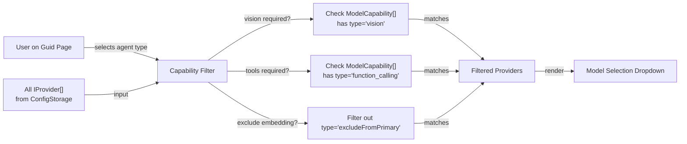
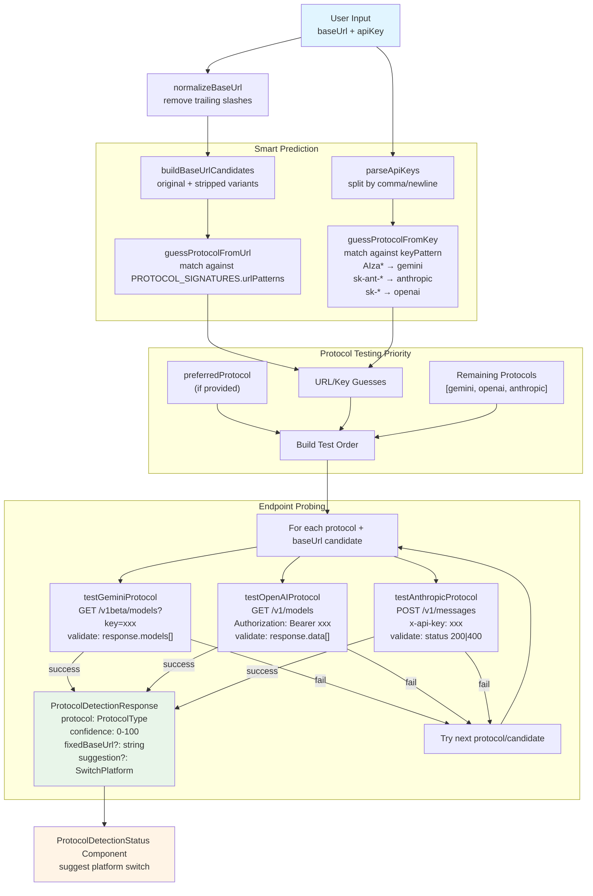
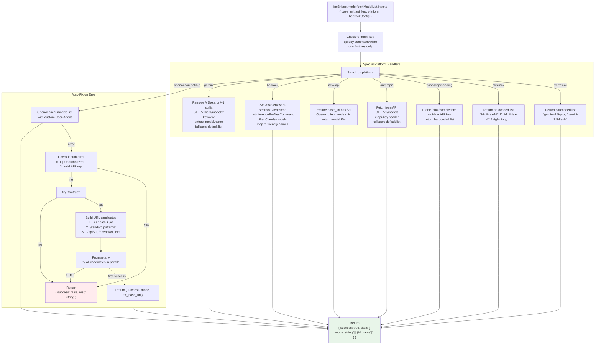
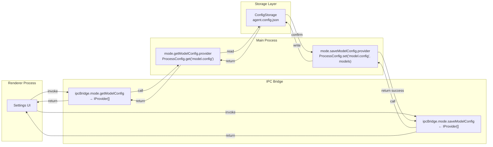
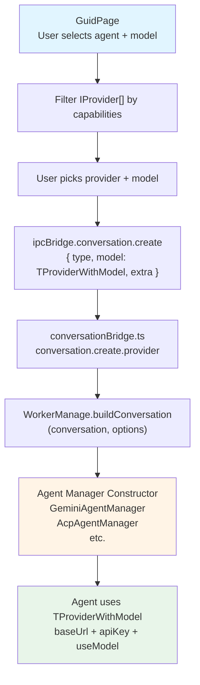

# Model Configuration & API Management

<details>
<summary>Relevant source files</summary>

The following files were used as context for generating this wiki page:

- [src/common/ipcBridge.ts](src/common/ipcBridge.ts)
- [src/common/storage.ts](src/common/storage.ts)
- [src/common/utils/protocolDetector.ts](src/common/utils/protocolDetector.ts)
- [src/process/WorkerManage.ts](src/process/WorkerManage.ts)
- [src/process/bridge/modelBridge.ts](src/process/bridge/modelBridge.ts)
- [src/process/initBridge.ts](src/process/initBridge.ts)
- [src/renderer/assets/logos/minimax.png](src/renderer/assets/logos/minimax.png)
- [src/renderer/config/modelPlatforms.ts](src/renderer/config/modelPlatforms.ts)
- [src/renderer/pages/guid/index.tsx](src/renderer/pages/guid/index.tsx)
- [src/renderer/pages/settings/components/AddModelModal.tsx](src/renderer/pages/settings/components/AddModelModal.tsx)
- [src/renderer/pages/settings/components/AddPlatformModal.tsx](src/renderer/pages/settings/components/AddPlatformModal.tsx)
- [src/renderer/pages/settings/components/EditModeModal.tsx](src/renderer/pages/settings/components/EditModeModal.tsx)

</details>

## Purpose and Scope

This document describes AionUi's multi-provider model configuration system, which enables users to connect to 20+ AI platforms through a unified interface. It covers the `IProvider` data structure, model capability tagging, protocol auto-detection, platform-specific integrations (New API gateway, AWS Bedrock), and the configuration persistence layer.

For agent-specific configuration (Gemini OAuth, ACP CLI paths), see [Gemini Agent System](#4.1) and [ACP Agent Integration](#4.3). For runtime model selection in the UI, see [Conversation Initialization](#5.3). For assistant-specific model defaults, see [Assistant Presets & Skills](#4.8).

---

## Provider Configuration Architecture

The model configuration system is built around the `IProvider` interface, which represents a single AI model provider with one or more models. Providers are stored in `ConfigStorage` under the key `'model.config'` and accessed through the IPC bridge.

### Core Data Structure

```mermaid
graph TB
    subgraph "Renderer Process - UI Layer"
        SETTINGS["ModeSettings Page"]
        ADD_MODAL["AddPlatformModal"]
        EDIT_MODAL["EditModeModal"]
        ADD_MODEL["AddModelModal"]
    end

    subgraph "IPC Bridge Layer"
        FETCH["ipcBridge.mode.fetchModelList"]
        SAVE["ipcBridge.mode.saveModelConfig"]
        GET["ipcBridge.mode.getModelConfig"]
        DETECT["ipcBridge.mode.detectProtocol"]
    end

    subgraph "Main Process - Storage"
        CONFIG["ConfigStorage<br/>'model.config': IProvider[]"]
    end

    subgraph "IProvider Interface"
        PROVIDER["IProvider"]
        PROVIDER -->|required| ID["id: string<br/>UUID"]
        PROVIDER -->|required| PLATFORM["platform: string<br/>gemini | anthropic | custom | new-api | bedrock"]
        PROVIDER -->|required| NAME["name: string"]
        PROVIDER -->|required| BASE_URL["baseUrl: string"]
        PROVIDER -->|required| API_KEY["apiKey: string<br/>supports multi-key: key1,key2"]
        PROVIDER -->|required| MODELS["model: string[]<br/>list of model IDs"]
        PROVIDER -->|optional| CAPS["capabilities?: ModelCapability[]<br/>text | vision | function_calling | etc."]
        PROVIDER -->|optional| CONTEXT["contextLimit?: number"]
        PROVIDER -->|optional| PROTOCOLS["modelProtocols?: Record<string, string><br/>per-model protocol for new-api"]
        PROVIDER -->|optional| BEDROCK["bedrockConfig?: { authMethod, region, ... }"]
        PROVIDER -->|optional| ENABLED["enabled?: boolean<br/>provider enabled state"]
        PROVIDER -->|optional| MODEL_ENABLED["modelEnabled?: Record<string, boolean>"]
        PROVIDER -->|optional| HEALTH["modelHealth?: Record<string, {...}>"]
    end

    subgraph "Runtime Usage"
        GUID["GuidPage<br/>Agent Selection"]
        CREATE["createConversation"]
        AGENT["Agent Manager<br/>uses TProviderWithModel"]
    end

    SETTINGS -->|user adds provider| ADD_MODAL
    SETTINGS -->|user edits provider| EDIT_MODAL
    SETTINGS -->|user adds model| ADD_MODEL

    ADD_MODAL -->|invoke| FETCH
    ADD_MODAL -->|invoke| DETECT
    ADD_MODAL -->|submit| SAVE
    EDIT_MODAL -->|load| GET
    EDIT_MODAL -->|submit| SAVE
    ADD_MODEL -->|invoke| FETCH
    ADD_MODEL -->|submit| SAVE

    FETCH -->|read/write| CONFIG
    SAVE -->|write| CONFIG
    GET -->|read| CONFIG

    GET -->|provides providers| GUID
    GUID -->|filters by capabilities| CREATE
    CREATE -->|initializes with| AGENT

    PROVIDER -.->|stored in| CONFIG
```



**Sources:**

- [src/common/storage.ts:327-386]()
- [src/common/ipcBridge.ts:224-230]()
- [src/process/bridge/modelBridge.ts:428-469]()

---

## Model Capability System

AionUi uses capability tags to filter models based on their supported features. This enables the UI to present appropriate model options for different use cases (e.g., only showing vision-capable models when image input is required).

### Capability Types

| Capability Type      | Description                    | Use Case                                                             |
| -------------------- | ------------------------------ | -------------------------------------------------------------------- |
| `text`               | Basic text generation and chat | Primary conversation model                                           |
| `vision`             | Image understanding            | When files with image MIME types are attached                        |
| `function_calling`   | Tool/function execution        | Required for agents that use tools (WebSearch, file operations, MCP) |
| `image_generation`   | Image creation                 | DALL-E, Stable Diffusion, etc.                                       |
| `web_search`         | Built-in web search            | Gemini models with native search support                             |
| `reasoning`          | Extended reasoning models      | o1, o3 models with step-by-step reasoning                            |
| `embedding`          | Text embedding generation      | Vector search, semantic similarity                                   |
| `rerank`             | Document re-ranking            | Search result optimization                                           |
| `excludeFromPrimary` | Not suitable as main model     | Embedding/rerank models excluded from conversation model list        |

### Capability Data Structure

Each provider can tag its models with capabilities:

```typescript
// From src/common/storage.ts:318-325
export type ModelCapability = {
  type: ModelType
  /**
   * Whether manually selected by user. If true, user explicitly enabled;
   * if false, user explicitly disabled; if undefined, use default.
   */
  isUserSelected?: boolean
}

interface IProvider {
  // ... other fields
  capabilities?: ModelCapability[]
}
```

### Capability Filtering in Agent Selection

The Guid page filters providers based on required capabilities:



**Sources:**

- [src/common/storage.ts:308-325]()
- [src/renderer/pages/guid/index.tsx:1-8]()

---

## Platform Support Matrix

AionUi supports 20+ AI platforms through a unified configuration system. Platforms are defined in `MODEL_PLATFORMS` array, categorized into official platforms, aggregator gateways, local deployments, and Chinese platforms.

### Supported Platforms

| Platform               | Type         | Base URL                                    | Special Handling                  | Auth Method            |
| ---------------------- | ------------ | ------------------------------------------- | --------------------------------- | ---------------------- |
| **Gemini**             | Official     | `generativelanguage.googleapis.com`         | OAuth + API key                   | API key in query param |
| **Gemini (Vertex AI)** | Official     | -                                           | Hardcoded model list              | OAuth via Google Cloud |
| **OpenAI**             | Official     | `api.openai.com/v1`                         | Standard OpenAI protocol          | Bearer token           |
| **Anthropic**          | Official     | `api.anthropic.com`                         | Custom messages endpoint          | x-api-key header       |
| **AWS Bedrock**        | Official     | -                                           | Dynamic model listing via AWS SDK | Access key or profile  |
| **New API**            | Gateway      | User-defined                                | Per-model protocol override       | Bearer token           |
| **DeepSeek**           | Third-party  | `api.deepseek.com`                          | OpenAI-compatible                 | Bearer token           |
| **MiniMax**            | Third-party  | `api.minimaxi.com/v1`                       | Hardcoded model list              | Bearer token           |
| **OpenRouter**         | Gateway      | `openrouter.ai/api/v1`                      | OpenAI-compatible                 | Bearer token           |
| **Dashscope**          | Chinese      | `dashscope.aliyuncs.com/compatible-mode/v1` | OpenAI-compatible                 | Bearer token           |
| **Dashscope Coding**   | Chinese      | `coding.dashscope.aliyuncs.com/v1`          | Hardcoded model list + probe      | Bearer token           |
| **SiliconFlow**        | Chinese      | `.siliconflow.cn` or `.com`                 | OpenAI-compatible                 | Bearer token           |
| **Moonshot (Kimi)**    | Chinese      | `api.moonshot.cn` or `.ai`                  | OpenAI-compatible                 | Bearer token           |
| **Zhipu**              | Chinese      | `open.bigmodel.cn/api/paas/v4`              | OpenAI-compatible                 | Bearer token           |
| **xAI**                | Third-party  | `api.x.ai/v1`                               | OpenAI-compatible                 | Bearer token           |
| **Ark (Volcengine)**   | Chinese      | `ark.cn-beijing.volces.com/api/v3`          | OpenAI-compatible                 | Bearer token           |
| **Qianfan (Baidu)**    | Chinese      | `qianfan.baidubce.com/v2`                   | OpenAI-compatible                 | Bearer token           |
| **Hunyuan (Tencent)**  | Chinese      | `api.hunyuan.cloud.tencent.com/v1`          | OpenAI-compatible                 | Bearer token           |
| **Lingyi**             | Chinese      | `api.lingyiwanwu.com/v1`                    | OpenAI-compatible                 | Bearer token           |
| **Poe**                | Gateway      | `api.poe.com/v1`                            | OpenAI-compatible                 | Bearer token           |
| **Custom**             | User-defined | User-defined                                | Protocol detection                | User-defined           |

### Platform Configuration Structure

Platforms are defined with logos, base URLs, and i18n keys:

```typescript
// From src/renderer/config/modelPlatforms.ts:49-62
export interface PlatformConfig {
  name: string // Display name
  value: string // Form value identifier
  logo: string | null // Logo asset path
  platform: PlatformType // gemini | anthropic | custom | new-api | bedrock
  baseUrl?: string // Preset base URL (optional)
  i18nKey?: string // Translation key (optional)
}
```

**Sources:**

- [src/renderer/config/modelPlatforms.ts:74-109]()
- [src/process/bridge/modelBridge.ts:64-426]()

---

## Protocol Detection System

The protocol detection system automatically identifies which API protocol (OpenAI, Gemini, Anthropic) a given endpoint uses, based on URL patterns, API key formats, and endpoint probing. This eliminates the need for users to manually select the correct platform.

### Detection Flow



### Protocol Signatures

Each protocol is defined with signature patterns for detection:

| Protocol      | Key Pattern                | URL Patterns                                                         | Test Endpoint        |
| ------------- | -------------------------- | -------------------------------------------------------------------- | -------------------- |
| **Gemini**    | `AIza[A-Za-z0-9_-]{35}`    | `generativelanguage.googleapis.com`, `aiplatform.googleapis.com`     | `GET /v1beta/models` |
| **OpenAI**    | `sk-[A-Za-z0-9-_]{20,}`    | `api.openai.com`, `api.deepseek.com`, `dashscope.aliyuncs.com`, etc. | `GET /v1/models`     |
| **Anthropic** | `sk-ant-[A-Za-z0-9-]{80,}` | `api.anthropic.com`, `claude.ai`                                     | `POST /v1/messages`  |

### Detection Confidence Scoring

- **100%**: Protocol detected, models fetched successfully, key format matches
- **80%**: Protocol detected, endpoint responds correctly, but models not fetched
- **60%**: Protocol detected via key/URL pattern match, but endpoint not tested
- **0%**: Detection failed (unknown protocol)

### Multi-Key Testing

When `testAllKeys=true`, the detector validates all provided API keys:

```typescript
// From src/common/utils/protocolDetector.ts:51-75
export interface MultiKeyTestResult {
  total: number // Total key count
  valid: number // Valid key count
  invalid: number // Invalid key count
  details: Array<{
    index: number // Key index
    maskedKey: string // Masked key (e.g., "sk-1234...5678")
    valid: boolean // Whether valid
    error?: string // Error message
    latency?: number // Response time (ms)
  }>
}
```

**Sources:**

- [src/common/utils/protocolDetector.ts:472-588]()
- [src/process/bridge/modelBridge.ts:472-588]()
- [src/renderer/hooks/useProtocolDetection.ts]() (not in file list but referenced)
- [src/renderer/pages/settings/components/ProtocolDetectionStatus.tsx]() (not in file list but referenced)

---

## Model Fetching Pipeline

The `fetchModelList` function implements platform-specific logic to retrieve available models from each provider. It handles special cases like hardcoded model lists (Vertex AI, MiniMax), custom authentication (Bedrock), and auto-fix for incorrect base URLs.

### Fetch Flow by Platform Type



### Platform-Specific Handling

**Vertex AI**  
Returns hardcoded list without API call (endpoint requires OAuth):

```typescript
// From src/process/bridge/modelBridge.ts:74-78
if (platform?.includes('vertex-ai')) {
  const vertexAIModels = ['gemini-2.5-pro', 'gemini-2.5-flash']
  return { success: true, data: { mode: vertexAIModels } }
}
```

**MiniMax**  
No `/v1/models` endpoint available, hardcoded list:

```typescript
// From src/process/bridge/modelBridge.ts:83-93
if (base_url && isMiniMaxAPI(base_url)) {
  const minimaxModels = [
    'MiniMax-M2.1',
    'MiniMax-M2.1-lightning',
    'MiniMax-M2',
    'M2-her',
  ]
  return { success: true, data: { mode: minimaxModels } }
}
```

**DashScope Coding Plan**  
Validates API key via chat completions probe, then returns hardcoded list:

```typescript
// From src/process/bridge/modelBridge.ts:98-121
if (base_url && isDashScopeCodingAPI(base_url)) {
  const codingPlanModels = ['qwen3-coder-plus', 'qwen3-coder-next', ...];
  // Probe /chat/completions to validate key
  const probeResponse = await fetch(`${base_url}/chat/completions`, {
    method: 'POST',
    headers: { 'Content-Type': 'application/json', Authorization: `Bearer ${apiKey}` },
    body: JSON.stringify({ model: codingPlanModels[0], messages: [...], max_tokens: 1 })
  });
  if (probeResponse.status === 401) {
    return { success: false, msg: 'Invalid API key' };
  }
  return { success: true, data: { mode: codingPlanModels } };
}
```

**AWS Bedrock**  
Dynamically fetches Claude inference profiles via AWS SDK:

```typescript
// From src/process/bridge/modelBridge.ts:191-240
if (platform?.includes('bedrock') && bedrockConfig?.region) {
  // Set AWS env vars based on authMethod (accessKey or profile)
  const bedrockClient = new BedrockClient({ region })
  const command = new ListInferenceProfilesCommand({})
  const response = await bedrockClient.send(command)
  const claudeProfiles = response.inferenceProfileSummaries.filter((profile) =>
    profile.inferenceProfileId?.includes('anthropic.claude')
  )
  // Map to friendly names using BEDROCK_MODEL_NAMES dictionary
  return { success: true, data: { mode: modelsWithNames } }
}
```

**New API Gateway**  
Uses standard OpenAI protocol but ensures `/v1` suffix:

```typescript
// From src/process/bridge/modelBridge.ts:163-187
if (isNewApiPlatform(platform)) {
  let openaiBaseUrl = base_url?.replace(/\/+$/, '') || ''
  if (!openaiBaseUrl.endsWith('/v1')) {
    openaiBaseUrl = `${openaiBaseUrl}/v1`
  }
  const openai = new OpenAI({ baseURL: openaiBaseUrl, apiKey })
  const res = await openai.models.list()
  return { success: true, data: { mode: res.data.map((v) => v.id) } }
}
```

**Sources:**

- [src/process/bridge/modelBridge.ts:64-426]()
- [src/common/ipcBridge.ts:225]()

---

## Special Platform Integrations

### New API Gateway - Per-Model Protocol Overrides

New API is a multi-model gateway that can serve models from different providers (OpenAI, Gemini, Anthropic) through a unified endpoint. AionUi supports per-model protocol configuration to ensure correct API usage.

**Configuration Structure:**

```typescript
// From src/common/storage.ts:343-349
interface IProvider {
  // ... other fields
  modelProtocols?: Record<string, string>
  // Example: {
  //   "gemini-2.5-pro": "gemini",
  //   "claude-sonnet-4": "anthropic",
  //   "gpt-4o": "openai"
  // }
}
```

**Protocol Auto-Detection:**

```typescript
// From src/renderer/config/modelPlatforms.ts:125-131
export const detectNewApiProtocol = (modelName: string): string => {
  const name = modelName.toLowerCase()
  if (name.startsWith('claude') || name.startsWith('anthropic'))
    return 'anthropic'
  if (name.startsWith('gemini') || name.startsWith('models/gemini'))
    return 'gemini'
  return 'openai' // Default covers gpt, deepseek, qwen, o1, o3, etc.
}
```

**UI Integration:**  
When adding a model to a New API provider, the protocol selector appears automatically:

- Auto-detects protocol from model name
- User can override with dropdown (OpenAI | Gemini | Anthropic)
- Saved in `modelProtocols` field for runtime usage

**Sources:**

- [src/common/storage.ts:343-349]()
- [src/renderer/config/modelPlatforms.ts:115-131]()
- [src/renderer/pages/settings/components/AddPlatformModal.tsx:75-86, 205-209]()
- [src/renderer/pages/settings/components/AddModelModal.tsx:8-39]()

### AWS Bedrock - Multi-Region Claude Models

AWS Bedrock provides access to Claude models across multiple AWS regions. AionUi supports both access key and profile-based authentication.

**Authentication Methods:**

| Method         | Configuration                    | Environment Variables                        |
| -------------- | -------------------------------- | -------------------------------------------- |
| **Access Key** | `accessKeyId`, `secretAccessKey` | `AWS_ACCESS_KEY_ID`, `AWS_SECRET_ACCESS_KEY` |
| **Profile**    | `profile` (e.g., "default")      | `AWS_PROFILE`                                |

**Configuration Structure:**

```typescript
// From src/common/storage.ts:350-363
interface IProvider {
  bedrockConfig?: {
    authMethod: 'accessKey' | 'profile'
    region: string // e.g., 'us-east-1'
    accessKeyId?: string
    secretAccessKey?: string
    profile?: string
  }
}
```

**Supported Regions:**

- US East (N. Virginia) - `us-east-1`
- US West (Oregon) - `us-west-2`
- Europe (Ireland) - `eu-west-1`
- Europe (Frankfurt) - `eu-central-1`
- Asia Pacific (Singapore) - `ap-southeast-1`
- Asia Pacific (Tokyo) - `ap-northeast-1`
- Asia Pacific (Sydney) - `ap-southeast-2`
- Canada (Central) - `ca-central-1`

**Model Fetching:**  
Uses AWS SDK to list inference profiles (cross-region endpoints) and filters for Claude models:

```typescript
// From src/process/bridge/modelBridge.ts:216-238
const bedrockClient = new BedrockClient({ region })
const command = new ListInferenceProfilesCommand({})
const response = await bedrockClient.send(command)
const claudeProfiles = inferenceProfiles.filter((profile) =>
  profile.inferenceProfileId?.includes('anthropic.claude')
)
// Map to friendly names: "anthropic.claude-opus-4-5-..." → "Claude Opus 4.5"
const modelsWithNames = claudeProfiles.map((profile) => ({
  id: profile.inferenceProfileId,
  name: getBedrockModelDisplayName(profile.inferenceProfileId),
}))
```

**Sources:**

- [src/common/storage.ts:350-363]()
- [src/process/bridge/modelBridge.ts:191-270]()
- [src/renderer/pages/settings/components/AddPlatformModal.tsx:94-96, 286-321]()
- [src/renderer/pages/settings/components/EditModeModal.tsx:115-239]()

---

## API Key Management

### Multi-Key Support

AionUi supports multiple API keys per provider for quota management and automatic rotation. Keys can be separated by commas or newlines.

**Input Format:**

```
sk-key1,sk-key2,sk-key3
```

or

```
sk-key1
sk-key2
sk-key3
```

**Parsing Logic:**

```typescript
// From src/common/utils/protocolDetector.ts:308-314
export function parseApiKeys(apiKeyString: string): string[] {
  if (!apiKeyString) return [];
  return apiKeyString
    .split(/[,\
]/)
    .map(k => k.trim())
    .filter(k => k.length > 0);
}
```

**Usage During Model Fetching:**  
Only the first key is used for model listing to avoid redundant API calls:

```typescript
// From src/process/bridge/modelBridge.ts:66-70
let actualApiKey = api_key;
if (api_key && (api_key.includes(',') || api_key.includes('\
'))) {
  actualApiKey = api_key.split(/[,\
]/)[0].trim();
}
```

**Runtime Key Rotation:**  
The `ApiKeyManager` (see [API Key Rotation](#12.1)) rotates through keys on quota errors, but model fetching always uses the first valid key.

### Key Masking for Display

API keys are masked in UI components and logs:

```typescript
// From src/common/utils/protocolDetector.ts:320-323
export function maskApiKey(apiKey: string): string {
  if (apiKey.length <= 8) return '***'
  return `${apiKey.substring(0, 4)}...${apiKey.substring(apiKey.length - 4)}`
}
// Example: "sk-1234...abcd"
```

**Sources:**

- [src/common/utils/protocolDetector.ts:308-323]()
- [src/process/bridge/modelBridge.ts:66-70]()
- [src/renderer/pages/settings/components/AddPlatformModal.tsx:268-284]()

---

## Deep Link Integration

AionUi supports the `aionui://` protocol for quick provider setup via deep links. This enables one-click configuration from external sources (documentation, community forums, etc.).

### Deep Link URL Format

```
aionui://add-provider?baseUrl=https://api.example.com&apiKey=sk-xxx&platform=new-api
```

**Supported Parameters:**

- `baseUrl`: Base URL of the API endpoint
- `apiKey`: API key for authentication
- `platform`: (Optional) Platform type (defaults to `new-api`)

### Deep Link Handling Flow

```mermaid
graph LR
    EXTERNAL["External Source<br/>website/email/forum"]
    CLICK["User clicks<br/>aionui:// link"]

    PROTOCOL["OS opens app<br/>deepLink.received event"]
    PARSE["Parse query params<br/>{ action: 'add-provider', params: {...} }"]

    HOOK["useDeepLink Hook<br/>in renderer"]
    STATE["useState<br/>deepLinkAddProvider"]

    SETTINGS["Settings Page<br/>auto-open AddPlatformModal"]
    PREFILL["Pre-fill form<br/>baseUrl + apiKey<br/>default to new-api"]

    DETECT["Protocol Detection<br/>auto-detect platform"]
    FETCH["Fetch Model List"]

    USER_REVIEW["User reviews<br/>selects model<br/>clicks confirm"]
    SAVE["Save to ConfigStorage"]

    EXTERNAL --> CLICK
    CLICK --> PROTOCOL
    PROTOCOL --> PARSE
    PARSE --> HOOK
    HOOK --> STATE
    STATE --> SETTINGS
    SETTINGS --> PREFILL
    PREFILL --> DETECT
    DETECT --> FETCH
    FETCH --> USER_REVIEW
    USER_REVIEW --> SAVE

    style EXTERNAL fill:#e1f5ff
    style PREFILL fill:#fff4e6
    style SAVE fill:#e8f5e9
```



### Implementation Details

**Deep Link Event Handling:**

```typescript
// From src/common/ipcBridge.ts:354-360
export const deepLink = {
  received: bridge.buildEmitter<{
    action: string // e.g., 'add-provider'
    params: Record<string, string> // parsed query params
  }>('deep-link.received'),
}
```

**Modal Pre-fill Logic:**

```typescript
// From src/renderer/pages/settings/components/AddPlatformModal.tsx:146-154
if (deepLinkData?.baseUrl || deepLinkData?.apiKey) {
  // Default to new-api platform for deep links (typical one-api/new-api usage)
  form.setFieldValue('platform', deepLinkData.platform || 'new-api')
  if (deepLinkData.baseUrl) form.setFieldValue('baseUrl', deepLinkData.baseUrl)
  if (deepLinkData.apiKey) form.setFieldValue('apiKey', deepLinkData.apiKey)
}
```

**Sources:**

- [src/common/ipcBridge.ts:353-360]()
- [src/renderer/pages/settings/components/AddPlatformModal.tsx:48-51, 136-155]()
- [src/renderer/hooks/useDeepLink.ts]() (not in file list but referenced)

---

## Configuration Persistence

### Storage Architecture

Provider configurations are stored in `ConfigStorage` under the key `'model.config'` as an array of `IProvider` objects. The storage layer provides atomic read/write operations with file-based persistence.

**Storage Location:**

- **Development:** `userData/config/agent.config.json`
- **Production:** `userData/config/agent.config.json` (in app's user data directory)

### IPC Bridge Operations



### Migration Handling

The storage system automatically migrates from old format (`selectedModel` field) to new format (`useModel` field):

```typescript
// From src/process/bridge/modelBridge.ts:444-465
return data.map((v: any, _index: number) => {
  // Check if old format (has 'selectedModel') vs new format (has 'useModel')
  if ('selectedModel' in v && !('useModel' in v)) {
    return {
      ...v,
      useModel: v.selectedModel, // Rename selectedModel to useModel
      id: v.id || uuid(),
      capabilities: v.capabilities || [],
      contextLimit: v.contextLimit,
    }
  }

  // Already in new format, ensure ID exists
  return {
    ...v,
    id: v.id || uuid(),
    useModel: v.useModel || v.selectedModel || '',
  }
})
```

### Enabled State Management

Providers and individual models can be enabled/disabled:

**Provider Level:**

```typescript
interface IProvider {
  enabled?: boolean // Defaults to true
}
```

**Model Level:**

```typescript
interface IProvider {
  modelEnabled?: Record<string, boolean> // Per-model override
  // Example: { "gpt-4": true, "gpt-3.5-turbo": false }
}
```

**Health Check Results (Display Only):**

```typescript
interface IProvider {
  modelHealth?: Record<
    string,
    {
      status: 'unknown' | 'healthy' | 'unhealthy'
      lastCheck?: number // Timestamp
      latency?: number // Response time (ms)
      error?: string // Error message
    }
  >
}
```

**Sources:**

- [src/process/bridge/modelBridge.ts:428-469]()
- [src/common/storage.ts:327-386]()
- [src/process/initStorage.ts]() (defines `ProcessConfig`)

---

## Configuration Usage in Agent Initialization

When a conversation is created, the selected `TProviderWithModel` (provider + specific model) is passed to the agent manager:

```typescript
// From src/common/storage.ts:388
export type TProviderWithModel = Omit<IProvider, 'model'> & { useModel: string }
```

**Flow from Guid Page to Agent:**



**Sources:**

- [src/common/storage.ts:388]()
- [src/process/WorkerManage.ts:38-126]()
- [src/renderer/pages/guid/index.tsx]() (not in file list but primary usage)
