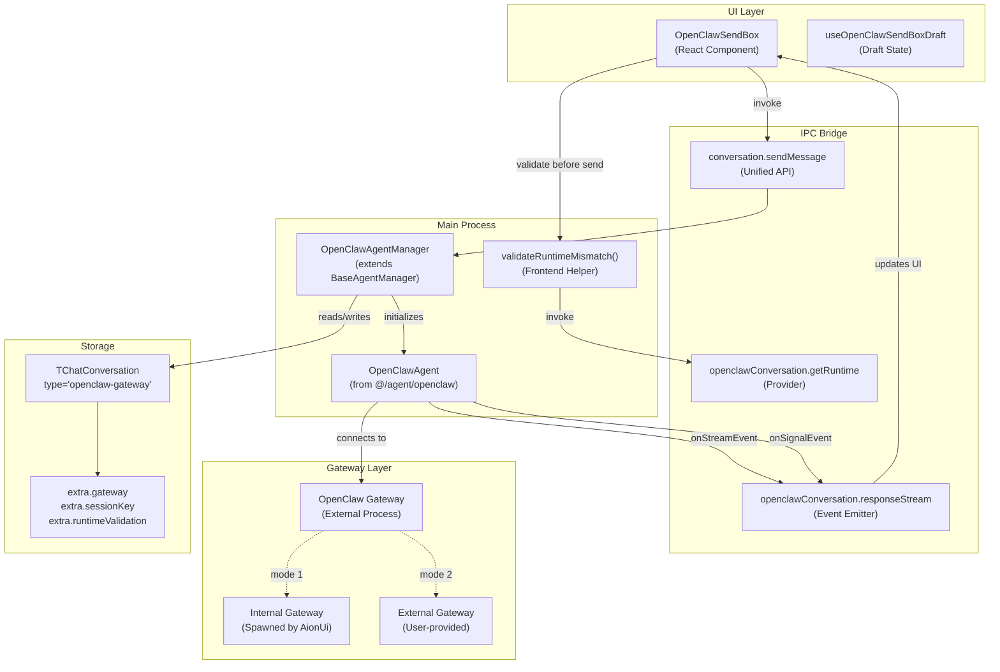
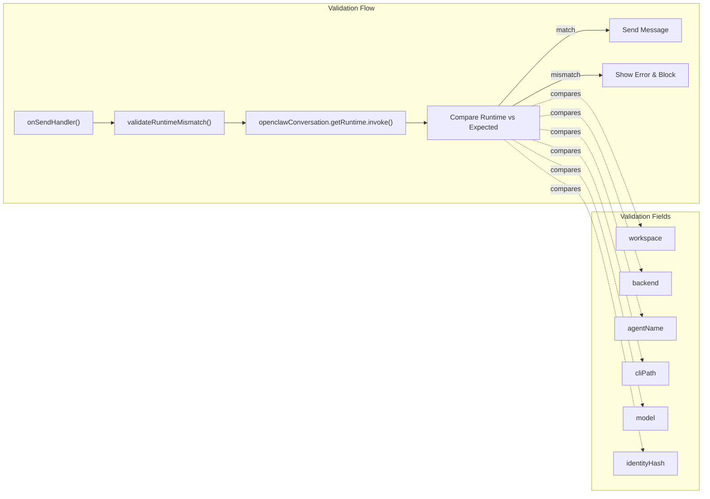
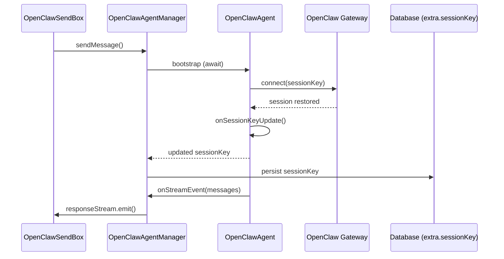
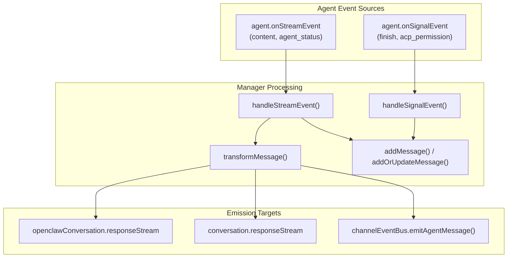
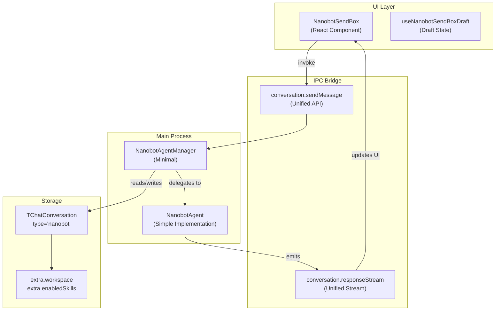
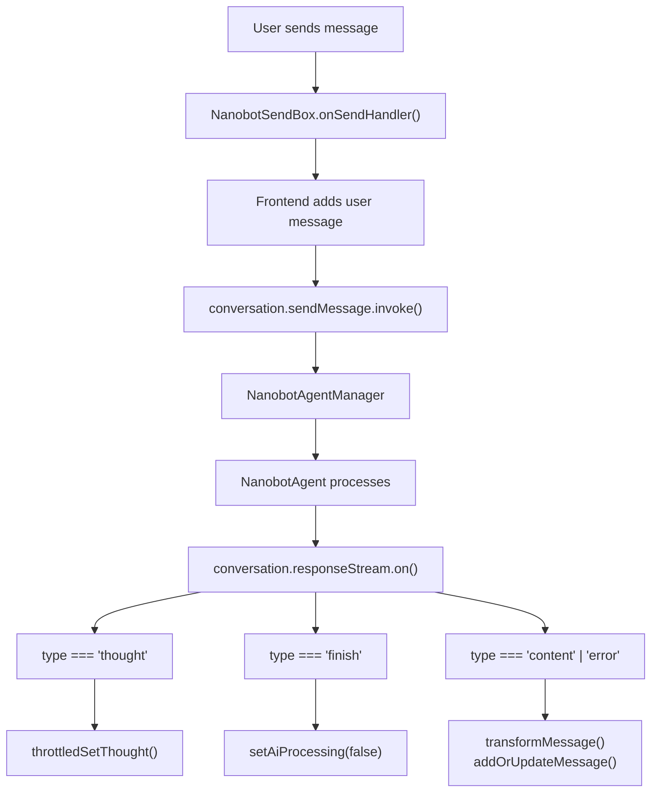
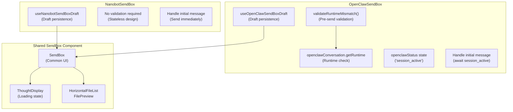
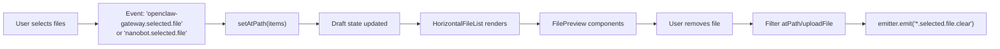
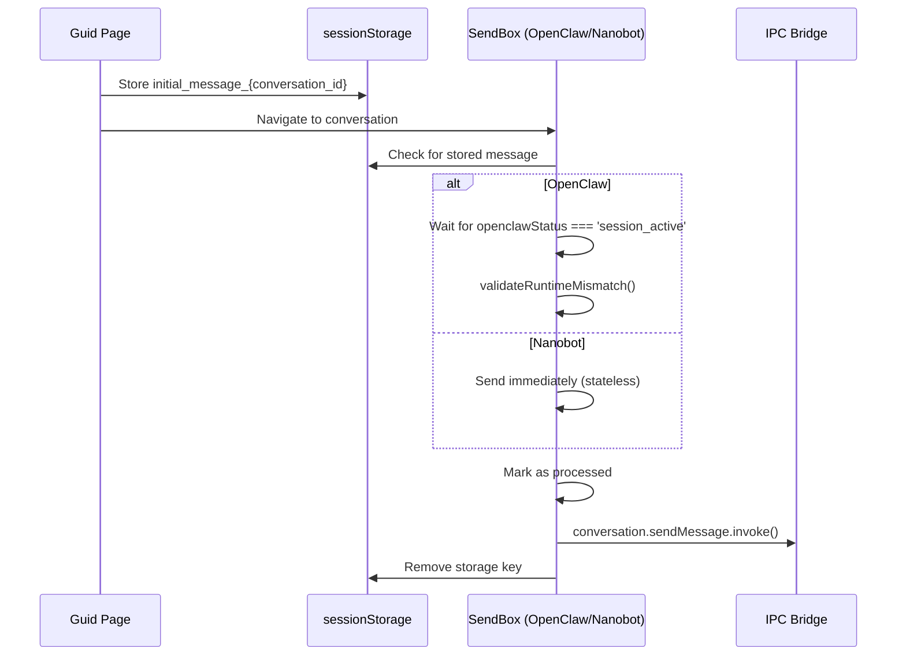

# OpenClaw and Nanobot Agents

<details>
<summary>Relevant source files</summary>

The following files were used as context for generating this wiki page:

- [src/common/ipcBridge.ts](src/common/ipcBridge.ts)
- [src/common/storage.ts](src/common/storage.ts)
- [src/process/task/OpenClawAgentManager.ts](src/process/task/OpenClawAgentManager.ts)
- [src/renderer/components/sendbox.tsx](src/renderer/components/sendbox.tsx)
- [src/renderer/pages/conversation/acp/AcpSendBox.tsx](src/renderer/pages/conversation/acp/AcpSendBox.tsx)
- [src/renderer/pages/conversation/codex/CodexSendBox.tsx](src/renderer/pages/conversation/codex/CodexSendBox.tsx)
- [src/renderer/pages/conversation/gemini/GeminiSendBox.tsx](src/renderer/pages/conversation/gemini/GeminiSendBox.tsx)
- [src/renderer/pages/conversation/nanobot/NanobotSendBox.tsx](src/renderer/pages/conversation/nanobot/NanobotSendBox.tsx)
- [src/renderer/pages/conversation/openclaw/OpenClawSendBox.tsx](src/renderer/pages/conversation/openclaw/OpenClawSendBox.tsx)
- [src/renderer/pages/guid/index.tsx](src/renderer/pages/guid/index.tsx)

</details>

This document describes the OpenClaw gateway-based agent and the Nanobot simplified agent, two of the five agent architectures in AionUi. OpenClaw provides a gateway connection model with runtime validation and session management, while Nanobot offers a minimal stateless implementation.

For information about other agent systems, see [Gemini Agent System](#4.1), [Codex Agent System](#4.2), and [ACP Agent Integration](#4.3). For the unified tool system shared by all agents, see [Tool System Architecture](#4.5).

---

## Agent Comparison

OpenClaw and Nanobot represent opposite ends of the complexity spectrum in AionUi's agent architecture:

| Feature                  | OpenClaw                                 | Nanobot                            |
| ------------------------ | ---------------------------------------- | ---------------------------------- |
| Architecture             | Gateway-based, external connection       | Simplified, minimal implementation |
| Session Management       | Full session resumption via `sessionKey` | Stateless, no session management   |
| Runtime Validation       | Strong runtime validation checks         | None required                      |
| Gateway Mode             | Internal (spawned) or external gateway   | No gateway concept                 |
| Backend Selection        | Supports multiple ACP backends           | Single implementation              |
| Conversation Type        | `'openclaw-gateway'`                     | `'nanobot'`                        |
| Agent Manager            | `OpenClawAgentManager`                   | `NanobotAgentManager` (minimal)    |
| Configuration Complexity | High (gateway, backend, validation)      | Low (workspace, skills only)       |

**Sources:** [src/common/storage.ts:240-302](), [src/process/task/OpenClawAgentManager.ts:19-38]()

---

## OpenClaw Gateway Architecture

### Connection Model

OpenClaw connects to an external gateway server that orchestrates AI model interactions. The gateway can be either spawned internally by AionUi or provided as an external service.



**Sources:** [src/renderer/pages/conversation/openclaw/OpenClawSendBox.tsx:1-580](), [src/process/task/OpenClawAgentManager.ts:39-269](), [src/common/storage.ts:240-282]()

### Runtime Validation System

OpenClaw implements a **strong runtime validation mechanism** to prevent configuration drift during session switches. Before sending each message, the frontend validates that the current agent runtime matches the expected configuration snapshot.



The validation logic normalizes paths and compares six critical fields:

```typescript
// Validation implementation
const norm = (v?: string | null) => (v || '').trim()
const eqPath = (a?: string | null, b?: string | null) =>
  norm(a).replace(/[\\/]+$/, '') === norm(b).replace(/[\\/]+$/, '')

if (
  expected.expectedWorkspace &&
  !eqPath(expected.expectedWorkspace, runtime.workspace)
) {
  mismatches.push(
    `workspace: expected=${expected.expectedWorkspace || '-'} actual=${runtime.workspace || '-'}`
  )
}
```

**Sources:** [src/renderer/pages/conversation/openclaw/OpenClawSendBox.tsx:47-89](), [src/common/storage.ts:259-268]()

### Gateway Configuration

The gateway configuration in conversation extra data determines how OpenClaw connects:

| Field                        | Type      | Purpose                              |
| ---------------------------- | --------- | ------------------------------------ |
| `gateway.host`               | `string`  | Gateway server hostname              |
| `gateway.port`               | `number`  | Gateway server port (default: 18789) |
| `gateway.token`              | `string`  | Authentication token                 |
| `gateway.password`           | `string`  | Authentication password              |
| `gateway.useExternalGateway` | `boolean` | Use external gateway vs spawned      |
| `gateway.cliPath`            | `string`  | Path to CLI binary for spawning      |

**Sources:** [src/common/storage.ts:249-256](), [src/process/task/OpenClawAgentManager.ts:24-32]()

### Session Management

OpenClaw supports **session resumption** through the `sessionKey` mechanism:



The `sessionKey` is updated during agent operation and persisted to `conversation.extra.sessionKey` for future session restoration.

**Sources:** [src/process/task/OpenClawAgentManager.ts:159-163](), [src/common/storage.ts:258]()

### Message Flow

OpenClaw processes messages through dual event handlers:



Content types that mark conversation as `'finished'`: `'content'`, `'agent_status'`, `'acp_tool_call'`, `'plan'`.

**Sources:** [src/process/task/OpenClawAgentManager.ts:88-157]()

### Permission System

OpenClaw reuses the ACP permission system with `acp_permission` message type:

```mermaid
graph LR
    A["handleSignalEvent()"]
    B["type === 'acp_permission'"]
    C["Extract toolCall data"]
    D["Create IConfirmation"]
    E["addConfirmation()"]
    F["UI shows permission dialog"]
    G["User approves/rejects"]
    H["confirm(id, callId, data)"]
    I["agent.confirmMessage()"]

    A --> B
    B --> C
    C --> D
    D --> E
    E --> F
    F --> G
    G --> H
    H --> I
```



Permission data structure:

```typescript
{
  sessionId: string;
  toolCall: {
    toolCallId: string;
    title?: string;
    kind?: string;
    rawInput?: Record<string, unknown>;
  };
  options: Array<{
    optionId: string;
    name: string;
    kind: string;
  }>;
}
```

**Sources:** [src/process/task/OpenClawAgentManager.ts:119-157](), [src/process/task/OpenClawAgentManager.ts:204-213]()

---

## Nanobot Simplified Architecture

### Design Philosophy

Nanobot provides a **minimal stateless agent** implementation with no gateway, no session management, and no runtime validation. It is designed for simple conversational interactions.



**Sources:** [src/renderer/pages/conversation/nanobot/NanobotSendBox.tsx:1-399](), [src/common/storage.ts:283-302]()

### Message Flow

Nanobot uses a **simplified message flow** with only three event types:



Event handling implementation:

```typescript
switch (message.type) {
  case 'thought':
    throttledSetThought(message.data as ThoughtData)
    break
  case 'finish':
    setThought({ subject: '', description: '' })
    setAiProcessing(false)
    break
  case 'content':
  case 'error':
  case 'user_content':
  default: {
    setThought({ subject: '', description: '' })
    const transformedMessage = transformMessage(message)
    if (transformedMessage) {
      addOrUpdateMessage(transformedMessage)
    }
    if (message.type === 'error') {
      setAiProcessing(false)
    }
    break
  }
}
```

**Sources:** [src/renderer/pages/conversation/nanobot/NanobotSendBox.tsx:156-184]()

### Configuration

Nanobot requires minimal configuration in conversation extra:

| Field               | Type       | Purpose                          |
| ------------------- | ---------- | -------------------------------- |
| `workspace`         | `string`   | Working directory path           |
| `customWorkspace`   | `boolean`  | User-specified vs system default |
| `enabledSkills`     | `string[]` | Skill filter list                |
| `presetAssistantId` | `string`   | Assistant preset identifier      |
| `pinned`            | `boolean`  | Conversation pin status          |
| `pinnedAt`          | `number`   | Pin timestamp                    |
| `isHealthCheck`     | `boolean`  | Temporary health-check marker    |

**Sources:** [src/common/storage.ts:284-300]()

---

## UI Components

### SendBox Implementations

Both agents implement their own `SendBox` wrappers with agent-specific logic:



**Sources:** [src/renderer/pages/conversation/openclaw/OpenClawSendBox.tsx:40-45](), [src/renderer/pages/conversation/nanobot/NanobotSendBox.tsx:40-45](), [src/renderer/components/sendbox.tsx:30-48]()

### Draft Management

Both agents use the shared draft hook pattern with agent-specific keys:

```typescript
// OpenClaw draft hook
const useOpenClawSendBoxDraft = getSendBoxDraftHook('openclaw-gateway', {
  _type: 'openclaw-gateway',
  atPath: [],
  content: '',
  uploadFile: [],
})

// Nanobot draft hook
const useNanobotSendBoxDraft = getSendBoxDraftHook('nanobot', {
  _type: 'nanobot',
  atPath: [],
  content: '',
  uploadFile: [],
})
```

Draft data structure:
| Field | Type | Purpose |
|-------|------|---------|
| `_type` | `'openclaw-gateway'` or `'nanobot'` | Agent discriminator |
| `atPath` | `Array<string \| FileOrFolderItem>` | Workspace file selections |
| `content` | `string` | Message input text |
| `uploadFile` | `string[]` | External file paths |

**Sources:** [src/renderer/pages/conversation/openclaw/OpenClawSendBox.tsx:33-45](), [src/renderer/pages/conversation/nanobot/NanobotSendBox.tsx:33-45]()

### File Handling

File selection state management:



**Sources:** [src/renderer/pages/conversation/openclaw/OpenClawSendBox.tsx:347-360](), [src/renderer/pages/conversation/nanobot/NanobotSendBox.tsx:195-208]()

### Initial Message Handling

Both agents support initial messages from the Guid page, stored in `sessionStorage`:



Storage keys:

- OpenClaw: `openclaw_initial_message_{conversation_id}` + `openclaw_initial_processed_{conversation_id}`
- Nanobot: `nanobot_initial_message_{conversation_id}` + `nanobot_initial_processed_{conversation_id}`

**Sources:** [src/renderer/pages/conversation/openclaw/OpenClawSendBox.tsx:419-475](), [src/renderer/pages/conversation/nanobot/NanobotSendBox.tsx:262-304]()

---

## IPC Bridge Integration

### OpenClaw-Specific APIs

```typescript
export const openclawConversation = {
  sendMessage: conversation.sendMessage, // Unified API
  responseStream: bridge.buildEmitter<IResponseMessage>(
    'openclaw.response.stream'
  ),
  getRuntime: bridge.buildProvider<
    IBridgeResponse<{
      conversationId: string
      runtime: {
        workspace?: string
        backend?: string
        agentName?: string
        cliPath?: string
        model?: string
        sessionKey?: string | null
        isConnected?: boolean
        hasActiveSession?: boolean
        identityHash?: string | null
      }
      expected?: {
        expectedWorkspace?: string
        expectedBackend?: string
        expectedAgentName?: string
        expectedCliPath?: string
        expectedModel?: string
        expectedIdentityHash?: string | null
        switchedAt?: number
      }
    }>,
    { conversation_id: string }
  >('openclaw.get-runtime'),
}
```

The `getRuntime` provider is used for runtime validation before sending messages.

**Sources:** [src/common/ipcBridge.ts:293-322]()

### Nanobot Integration

Nanobot uses **only the unified conversation APIs**:

- `conversation.sendMessage` for sending messages
- `conversation.responseStream` for receiving responses

No agent-specific IPC APIs are needed due to its stateless design.

**Sources:** [src/renderer/pages/conversation/nanobot/NanobotSendBox.tsx:210-248]()

---

## Conversation Type Definitions

### OpenClaw Type

```typescript
| Omit<
    IChatConversation<
      'openclaw-gateway',
      {
        workspace?: string;
        backend?: AcpBackendAll;
        agentName?: string;
        customWorkspace?: boolean;
        /** Gateway configuration */
        gateway?: {
          host?: string;
          port?: number;
          token?: string;
          password?: string;
          useExternalGateway?: boolean;
          cliPath?: string;
        };
        /** Session key for resume */
        sessionKey?: string;
        /** Runtime validation snapshot used for post-switch strong checks */
        runtimeValidation?: {
          expectedWorkspace?: string;
          expectedBackend?: string;
          expectedAgentName?: string;
          expectedCliPath?: string;
          expectedModel?: string;
          expectedIdentityHash?: string | null;
          switchedAt?: number;
        };
        enabledSkills?: string[];
        presetAssistantId?: string;
        pinned?: boolean;
        pinnedAt?: number;
        isHealthCheck?: boolean;
      }
    >,
    'model'
  >
```

The `Omit<..., 'model'>` indicates OpenClaw does not use the `model` field from the base conversation structure.

**Sources:** [src/common/storage.ts:240-282]()

### Nanobot Type

```typescript
| Omit<
    IChatConversation<
      'nanobot',
      {
        workspace?: string;
        customWorkspace?: boolean;
        enabledSkills?: string[];
        presetAssistantId?: string;
        pinned?: boolean;
        pinnedAt?: number;
        isHealthCheck?: boolean;
      }
    >,
    'model'
  >
```

Nanobot has the **most minimal extra configuration** of all agent types.

**Sources:** [src/common/storage.ts:283-302]()

---

## Agent Manager Diagnostics

### OpenClawAgentManager Diagnostics

The `getDiagnostics()` method provides runtime inspection:

```typescript
getDiagnostics() {
  return {
    workspace: this.workspace,
    backend: this.options.backend,
    agentName: this.options.agentName,
    cliPath: this.options.gateway?.cliPath ?? null,
    gatewayHost: this.options.gateway?.host ?? null,
    gatewayPort: this.options.gateway?.port ?? 18789,
    conversation_id: this.conversation_id,
    isConnected: this.agent?.isConnected ?? false,
    hasActiveSession: this.agent?.hasActiveSession ?? false,
    sessionKey: this.agent?.currentSessionKey ?? null,
  };
}
```

This data is exposed via the `getRuntime` IPC provider for frontend validation.

**Sources:** [src/process/task/OpenClawAgentManager.ts:252-265]()

---

## State Management Comparison

### OpenClaw State

OpenClaw tracks multiple state variables:

| State                 | Type           | Purpose                                |
| --------------------- | -------------- | -------------------------------------- |
| `aiProcessing`        | `boolean`      | UI loading indicator                   |
| `openclawStatus`      | `string`       | Connection status (`'session_active'`) |
| `thought`             | `ThoughtData`  | Current processing thought             |
| `hasContentInTurnRef` | `Ref<boolean>` | Content output tracking                |
| `finishTimeoutRef`    | `Ref<Timeout>` | Delayed finish detection               |

Finish handling uses delayed reset (1000ms) to detect true task completion:

```typescript
case 'finish':
  {
    finishTimeoutRef.current = setTimeout(() => {
      setAiProcessing(false);
      aiProcessingRef.current = false;
      setThought({ subject: '', description: '' });
      finishTimeoutRef.current = null;
    }, 1000);
    hasContentInTurnRef.current = false;
  }
  break;
```

**Sources:** [src/renderer/pages/conversation/openclaw/OpenClawSendBox.tsx:102-282]()

### Nanobot State

Nanobot uses minimal state:

| State          | Type          | Purpose                    |
| -------------- | ------------- | -------------------------- |
| `aiProcessing` | `boolean`     | UI loading indicator       |
| `thought`      | `ThoughtData` | Current processing thought |

Finish handling is immediate:

```typescript
case 'finish':
  setThought({ subject: '', description: '' });
  setAiProcessing(false);
  break;
```

**Sources:** [src/renderer/pages/conversation/nanobot/NanobotSendBox.tsx:58-168]()

---

## Summary Table

| Aspect                       | OpenClaw                              | Nanobot                            |
| ---------------------------- | ------------------------------------- | ---------------------------------- |
| **Architecture**             | Gateway-based with external server    | Direct minimal implementation      |
| **Complexity**               | High - validation, sessions, gateway  | Low - stateless and simple         |
| **Runtime Validation**       | Required before each message          | None                               |
| **Session Management**       | Full resumption via `sessionKey`      | No sessions                        |
| **Gateway Configuration**    | Internal/external with host/port/auth | Not applicable                     |
| **Initial Message Handling** | Wait for `session_active` status      | Send immediately                   |
| **IPC APIs**                 | Dedicated `openclawConversation.*`    | Unified `conversation.*` only      |
| **State Tracking**           | Multiple states + refs + timeouts     | Minimal state                      |
| **Agent Manager**            | `OpenClawAgentManager` with bootstrap | `NanobotAgentManager` (simple)     |
| **Permission System**        | ACP-style `acp_permission` messages   | None documented                    |
| **Use Cases**                | Complex workflows requiring gateway   | Simple conversational interactions |

**Sources:** [src/renderer/pages/conversation/openclaw/OpenClawSendBox.tsx:1-580](), [src/renderer/pages/conversation/nanobot/NanobotSendBox.tsx:1-399](), [src/process/task/OpenClawAgentManager.ts:1-269]()
