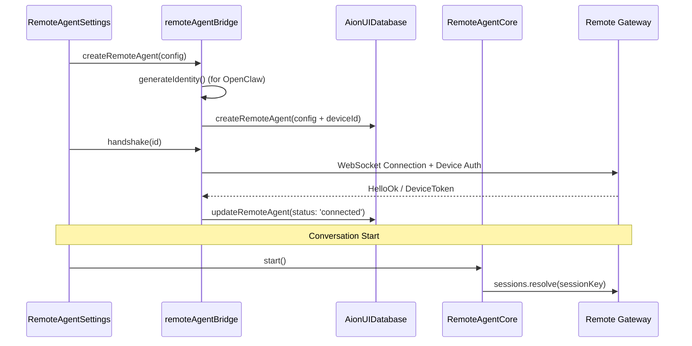

# OpenClaw, Nanobot, and Remote Agents

<details>
<summary>Relevant source files</summary>

The following files were used as context for generating this wiki page:

- [src/process/agent/openclaw/OpenClawGatewayConnection.ts](src/process/agent/openclaw/OpenClawGatewayConnection.ts)
- [src/process/agent/openclaw/types.ts](src/process/agent/openclaw/types.ts)
- [src/process/agent/remote/types.ts](src/process/agent/remote/types.ts)
- [src/process/bridge/remoteAgentBridge.ts](src/process/bridge/remoteAgentBridge.ts)
- [src/process/services/database/index.ts](src/process/services/database/index.ts)
- [src/process/services/database/migrations.ts](src/process/services/database/migrations.ts)
- [src/process/services/database/schema.ts](src/process/services/database/schema.ts)
- [src/process/task/NanoBotAgentManager.ts](src/process/task/NanoBotAgentManager.ts)
- [src/process/task/OpenClawAgentManager.ts](src/process/task/OpenClawAgentManager.ts)
- [src/process/task/RemoteAgentManager.ts](src/process/task/RemoteAgentManager.ts)
- [tests/unit/OpenClawAgentManagerBootstrap.test.ts](tests/unit/OpenClawAgentManagerBootstrap.test.ts)
- [tests/unit/RemoteAgentCore.test.ts](tests/unit/RemoteAgentCore.test.ts)
- [tests/unit/RemoteAgentManager.test.ts](tests/unit/RemoteAgentManager.test.ts)
- [tests/unit/normalizeWsUrl.test.ts](tests/unit/normalizeWsUrl.test.ts)
- [tests/unit/process/services/database/index.test.ts](tests/unit/process/services/database/index.test.ts)
- [tests/unit/remoteAgentBridge.test.ts](tests/unit/remoteAgentBridge.test.ts)
- [tests/unit/schema.test.ts](tests/unit/schema.test.ts)
- [tests/unit/usePresetAssistantInfo.dom.test.ts](tests/unit/usePresetAssistantInfo.dom.test.ts)

</details>


This page documents the OpenClaw gateway-based architecture, the simplified Nanobot agent implementation, and the Remote agent type which connects to external OpenClaw-compatible gateways without requiring a local process.

---

## Agent Architecture Comparison

AionUi supports multiple agent types that vary in their connection models and complexity.

| Feature | OpenClaw | Nanobot | Remote Agent |
|---------|----------|---------|--------------|
| **Type Identifier** | `openclaw-gateway` | `nanobot` | `remote` |
| **Connection** | Local/External Gateway | Local Process | External WebSocket |
| **Protocol** | OpenClaw Protocol | Simplified JSON-line | OpenClaw Protocol |
| **Session Persistence** | `sessionKey` in DB | Stateless | `sessionKey` in DB |
| **Authentication** | Password/Token | N/A | Bearer/Password/Device |
| **Manager Class** | `OpenClawAgentManager` | `NanoBotAgentManager` | `RemoteAgentManager` |

**Sources:** [src/process/task/OpenClawAgentManager.ts:43-50](), [src/process/task/NanoBotAgentManager.ts:29-36](), [src/process/task/RemoteAgentManager.ts:30-36]()

---

## OpenClaw Gateway Architecture

OpenClaw agents communicate with a gateway (either spawned locally or hosted externally) using a specialized JSON-RPC style protocol over WebSockets.

### Data Flow and Code Entities

The following diagram maps the logical components to the specific code entities responsible for the OpenClaw flow.

```mermaid
graph TB
    subgraph "Renderer Process"
        UI["OpenClawSendBox"]
        BRIDGE_R["ipcBridge.openclawConversation"]
    end
    
    subgraph "Main Process (Manager)"
        OC_MGR["OpenClawAgentManager"]
        IPC_EMIT["IpcAgentEventEmitter"]
    end

    subgraph "Agent Core"
        OC_AGENT["OpenClawAgent"]
        OC_CONN["OpenClawGatewayConnection"]
    end

    subgraph "External/Local Gateway"
        GW["OpenClaw Gateway Server"]
    end

    UI -->|"sendMessage"| OC_MGR
    OC_MGR -->|"init"| OC_AGENT
    OC_AGENT -->|"manages"| OC_CONN
    OC_CONN -->|"WebSocket (ws/wss)"| GW
    
    GW --|"EventFrame"| OC_CONN
    OC_CONN --|"onStreamEvent"| OC_MGR
    OC_MGR --|"emit"| IPC_EMIT
    IPC_EMIT --|"responseStream"| BRIDGE_R
```

**Sources:** [src/process/task/OpenClawAgentManager.ts:62-92](), [src/process/agent/openclaw/OpenClawGatewayConnection.ts:53-70](), [src/process/task/IpcAgentEventEmitter.ts:13-25]()

### Session Resumption
OpenClaw supports persistent sessions via a `sessionKey`. When the gateway issues or updates a key, the manager persists it to the `conversations` table in the SQLite database to allow later resumption.

*   **Key Function**: `saveSessionKey(sessionKey)` [src/process/task/OpenClawAgentManager.ts:183-200]().
*   **Database Integration**: Updates the `extra` field of the conversation row [src/process/task/OpenClawAgentManager.ts:189-195]().

---

## Remote Agents

Remote Agents are a specialized version of the OpenClaw architecture. Instead of managing a local gateway process, AionUi connects directly to a pre-configured remote URL.

### Remote Agent Lifecycle

Remote agents are registered in the database via the `RemoteAgentBridge`. They support device-based identity for secure pairing.



**Sources:** [src/process/bridge/remoteAgentBridge.ts:48-73](), [src/process/bridge/remoteAgentBridge.ts:153-195](), [src/process/agent/remote/RemoteAgentCore.ts:55-62]()

### Key Implementation Details
*   **Identity Generation**: For the `openclaw` protocol, `generateIdentity()` creates a unique `deviceId` and RSA key pair [src/process/bridge/remoteAgentBridge.ts:52-56]().
*   **Connection Handling**: `OpenClawGatewayConnection` manages the WebSocket lifecycle, including automatic reconnection with backoff [src/process/agent/openclaw/OpenClawGatewayConnection.ts:57-60]().
*   **URL Normalization**: The system automatically prepends `ws://` or converts `http://` to ensure compatibility with standard WebSocket clients [src/process/bridge/remoteAgentBridge.ts:22-35]().

---

## Nanobot Agent

The Nanobot agent is a simplified, stateless implementation designed for lightweight tasks. It lacks the complex session management and gateway orchestration of OpenClaw.

### Execution Model
Unlike OpenClaw, which maintains a persistent WebSocket, the Nanobot implementation typically involves a fire-and-forget message pattern where the manager does not block the UI thread during agent execution.

*   **Manager**: `NanoBotAgentManager` [src/process/task/NanoBotAgentManager.ts:29]().
*   **Non-blocking Send**: `this.agent.sendMessage({ content: data.content }).catch(...)` is called without `await` to return the IPC response immediately [src/process/task/NanoBotAgentManager.ts:122-126]().
*   **Event Handling**: Stream events are captured via `onStreamEvent` and emitted to the unified `ipcBridge.conversation.responseStream` [src/process/task/NanoBotAgentManager.ts:64-81]().

---

## Database Integration

All three agent types rely on the `AionUIDatabase` for message persistence and configuration storage.

### Table Schema for Remote Agents
The database includes specific tables for managing remote agent configurations.

| Table | Purpose |
|-------|---------|
| `remote_agents` | Stores URL, protocol, auth tokens, and device keys [src/process/services/database/index.ts:37-44]() |
| `conversations` | Stores the `type` (`remote`, `openclaw-gateway`, or `nanobot`) and `extra` config [src/process/services/database/schema.ts:43-54]() |
| `messages` | Standard message storage with `msg_id` for streaming updates [src/process/services/database/schema.ts:61-71]() |

### Message Persistence Logic
Managers use `addOrUpdateMessage` for streaming content (like AI typing) and `addMessage` for static content.
*   **Streaming**: `addOrUpdateMessage(this.conversation_id, tMessage)` [src/process/task/OpenClawAgentManager.ts:110]().
*   **Discrete**: `addMessage(this.conversation_id, tMessage)` [src/process/task/OpenClawAgentManager.ts:112]().

**Sources:** [src/process/services/database/schema.ts:12-77](), [src/process/task/OpenClawAgentManager.ts:104-114](), [src/process/task/RemoteAgentManager.ts:84-91]()

---

## Summary of Agent Capabilities

| Capability | OpenClaw | Nanobot | Remote Agent |
|------------|----------|---------|--------------|
| **Permission Requests** | Supported (`acp_permission`) | Not Supported | Supported (`acp_permission`) |
| **YOLO Mode** | Supported | Not Supported | Supported |
| **Tool Calling** | Supported (`acp_tool_call`) | Minimal | Supported (`acp_tool_call`) |
| **Status Tracking** | `agent_status` events | None | `agent_status` events |

**Sources:** [src/process/task/OpenClawAgentManager.ts:131-157](), [src/process/task/RemoteAgentManager.ts:102-127](), [src/process/task/NanoBotAgentManager.ts:158-160]()