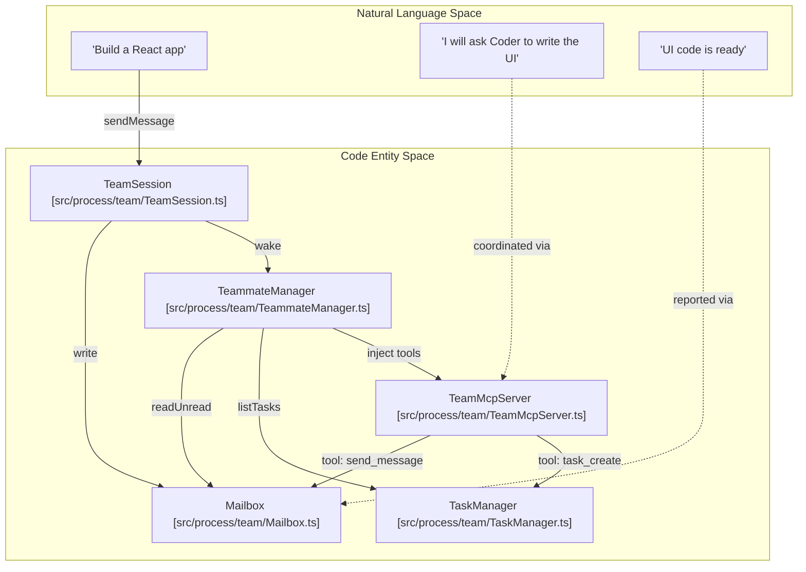
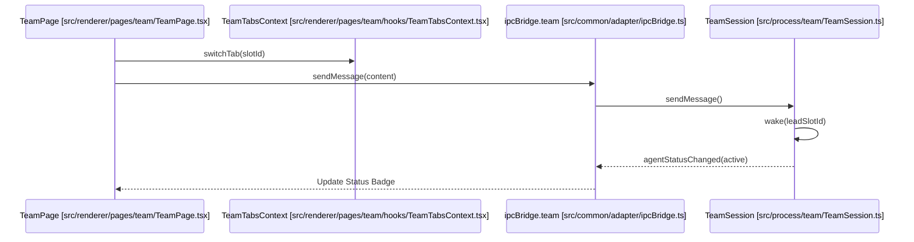

# Team Mode (Multi-Agent Collaboration)

Relevant source files

The following files were used as context for generating this wiki page:

- [docs/tech/team-mode-performance.md](docs/tech/team-mode-performance.md)
- [src/common/adapter/ipcBridge.ts](src/common/adapter/ipcBridge.ts)
- [src/common/types/teamTypes.ts](src/common/types/teamTypes.ts)
- [src/process/agent/acp/mcpSessionConfig.ts](src/process/agent/acp/mcpSessionConfig.ts)
- [src/process/team/Mailbox.ts](src/process/team/Mailbox.ts)
- [src/process/team/TaskManager.ts](src/process/team/TaskManager.ts)
- [src/process/team/TeamMcpServer.ts](src/process/team/TeamMcpServer.ts)
- [src/process/team/TeamSession.ts](src/process/team/TeamSession.ts)
- [src/process/team/TeamSessionService.ts](src/process/team/TeamSessionService.ts)
- [src/process/team/TeammateManager.ts](src/process/team/TeammateManager.ts)
- [src/process/team/adapters/PlatformAdapter.ts](src/process/team/adapters/PlatformAdapter.ts)
- [src/process/team/adapters/buildRolePrompt.ts](src/process/team/adapters/buildRolePrompt.ts)
- [src/process/team/adapters/xmlFallbackAdapter.ts](src/process/team/adapters/xmlFallbackAdapter.ts)
- [src/process/team/index.ts](src/process/team/index.ts)
- [src/process/team/prompts/leadPrompt.ts](src/process/team/prompts/leadPrompt.ts)
- [src/process/team/prompts/teammatePrompt.ts](src/process/team/prompts/teammatePrompt.ts)
- [src/process/team/repository/ITeamRepository.ts](src/process/team/repository/ITeamRepository.ts)
- [src/process/team/repository/SqliteTeamRepository.ts](src/process/team/repository/SqliteTeamRepository.ts)
- [src/process/team/types.ts](src/process/team/types.ts)
- [src/renderer/pages/conversation/GroupedHistory/hooks/useConversationListSync.ts](src/renderer/pages/conversation/GroupedHistory/hooks/useConversationListSync.ts)
- [src/renderer/pages/team/TeamPage.tsx](src/renderer/pages/team/TeamPage.tsx)
- [src/renderer/pages/team/components/AddAgentModal.tsx](src/renderer/pages/team/components/AddAgentModal.tsx)
- [src/renderer/pages/team/components/TeamConfirmOverlay.tsx](src/renderer/pages/team/components/TeamConfirmOverlay.tsx)
- [src/renderer/pages/team/components/TeamCreateModal.tsx](src/renderer/pages/team/components/TeamCreateModal.tsx)
- [src/renderer/pages/team/components/TeamTabs.tsx](src/renderer/pages/team/components/TeamTabs.tsx)
- [src/renderer/pages/team/components/agentSelectUtils.tsx](src/renderer/pages/team/components/agentSelectUtils.tsx)
- [src/renderer/pages/team/hooks/TeamTabsContext.tsx](src/renderer/pages/team/hooks/TeamTabsContext.tsx)
- [src/renderer/pages/team/hooks/useTeamList.ts](src/renderer/pages/team/hooks/useTeamList.ts)
- [src/renderer/pages/team/hooks/useTeamSession.ts](src/renderer/pages/team/hooks/useTeamSession.ts)
- [src/renderer/services/i18n/locales/en-US/team.json](src/renderer/services/i18n/locales/en-US/team.json)
- [src/renderer/services/i18n/locales/ja-JP/team.json](src/renderer/services/i18n/locales/ja-JP/team.json)
- [src/renderer/services/i18n/locales/ko-KR/team.json](src/renderer/services/i18n/locales/ko-KR/team.json)
- [src/renderer/services/i18n/locales/tr-TR/team.json](src/renderer/services/i18n/locales/tr-TR/team.json)
- [src/renderer/services/i18n/locales/zh-CN/team.json](src/renderer/services/i18n/locales/zh-CN/team.json)
- [src/renderer/services/i18n/locales/zh-TW/team.json](src/renderer/services/i18n/locales/zh-TW/team.json)
- [tests/integration/team-mcp-server.test.ts](tests/integration/team-mcp-server.test.ts)
- [tests/integration/team-real-components.test.ts](tests/integration/team-real-components.test.ts)
- [tests/integration/team-stress-concurrency.test.ts](tests/integration/team-stress-concurrency.test.ts)
- [tests/integration/team-stress-tcp.test.ts](tests/integration/team-stress-tcp.test.ts)
- [tests/integration/team-stress-xml.test.ts](tests/integration/team-stress-xml.test.ts)
- [tests/unit/process/teamSessionService.test.ts](tests/unit/process/teamSessionService.test.ts)
- [tests/unit/team-SqliteTeamRepository.test.ts](tests/unit/team-SqliteTeamRepository.test.ts)
- [tests/unit/team-TeammateManager.test.ts](tests/unit/team-TeammateManager.test.ts)
- [tests/unit/team-agentSelectUtils.test.ts](tests/unit/team-agentSelectUtils.test.ts)
- [tests/unit/team-migration-v19.test.ts](tests/unit/team-migration-v19.test.ts)

Team Mode is an orchestration framework that allows multiple AI agents to collaborate on complex tasks. It employs a "Lead Agent" (Dispatcher) pattern where a primary agent coordinates with "Teammate" agents through a shared workspace, a structured task board, and a message-passing mailbox system.

## System Architecture

The Team Mode architecture is divided into a backend orchestration layer (running in the Electron main process) and a multi-pane React UI.

### Core Orchestration Logic
The coordination is handled by a hierarchy of services that manage agent lifecycles and communication:

*   **`TeamSessionService`**: The entry point for team management. It handles session lifecycle, workspace resolution, and model provider mapping [src/process/team/TeamSessionService.ts:28-35]().
*   **`TeamSession`**: A coordinator that owns the state for a specific team, including the `Mailbox`, `TaskManager`, and the `TeamMcpServer` [src/process/team/TeamSession.ts:21-29]().
*   **`TeammateManager`**: The core execution engine. It manages agent state machines (pending, idle, active, failed) and coordinates the "Wake" cycle where agents read unread messages and update tasks [src/process/team/TeammateManager.ts:34-55]().

### Team Collaboration Diagram

This diagram shows how natural language requests from the user are transformed into coordinated actions between code entities.

"Team Orchestration Flow"

Sources: [src/process/team/TeamSession.ts:90-126](), [src/process/team/TeammateManager.ts:110-140](), [src/process/team/TeamMcpServer.ts:195-215]()

## Communication & State Management

### Mailbox and TaskManager
Agents do not communicate via direct function calls. Instead, they use persistent state stores:
*   **`Mailbox`**: Stores `MailboxMessage` objects. When an agent is "woken," the `TeammateManager` fetches unread messages for that agent's `slotId` [src/process/team/types.ts:21-31]().
*   **`TaskManager`**: A shared board of `TeamTask` objects. Agents can create, update, or assign tasks to other teammates [src/process/team/types.ts:34-46]().

### TeamMcpServer (TCP Coordination)
For agents that support the Model Context Protocol (MCP) (primarily ACP-based agents like Claude), coordination tools are exposed via a local TCP server:
1.  **Server Start**: `TeamMcpServer` starts a TCP server on a random port [src/process/team/TeamMcpServer.ts:111-125]().
2.  **Bridge**: A stdio-to-TCP bridge script (`team-mcp-stdio.js`) is injected into the agent's session configuration [src/process/team/TeamMcpServer.ts:136-153]().
3.  **Authentication**: Connections are secured using a one-time `authToken` [src/process/team/TeamMcpServer.ts:103-103]().
4.  **Tools**: The server exposes tools like `send_message`, `task_create`, `task_update`, and `wake_agent` [src/process/team/TeamMcpServer.ts:210-230]().

### XML Fallback Adapter
For non-MCP backends (e.g., standard Gemini or older providers), the system uses an `xmlFallbackAdapter`. This adapter wraps the agent's prompt with instructions to output structured XML tags (e.g., `<send_message>`, `<task_create>`), which are then parsed by the `TeammateManager` to drive the state machine [src/process/team/TeammateManager.ts:135-140]().

## User Interface

The `TeamPage` provides a multi-pane environment where users can monitor the entire team's progress simultaneously.

### UI Components
*   **`TeamPage`**: The top-level container that manages the split-view layout and agent slots [src/renderer/pages/team/TeamPage.tsx:28-36]().
*   **`TeamTabs`**: A custom tab bar showing agent names, logos, and real-time status badges (e.g., a "breathing" animation when an agent is `active`) [src/renderer/pages/team/components/TeamTabs.tsx:183-189]().
*   **`AgentChatSlot`**: Renders an individual agent's conversation. It includes specialized model selectors for each agent type (Acp, Gemini, Aionrs) [src/renderer/pages/team/TeamPage.tsx:56-64]().

### Data Flow (Renderer to Main)

"Team UI Event Bridge"

Sources: [src/renderer/pages/team/TeamPage.tsx:180-200](), [src/renderer/pages/team/hooks/useTeamSession.ts:79-89](), [src/process/team/TeamSession.ts:90-100]()

## Key Implementation Details

### Model Resolution
The `TeamSessionService` performs complex model resolution to ensure agents have valid providers. It prioritizes:
1.  Saved default models for the specific agent type (e.g., `gemini.defaultModel`) [src/process/team/TeamSessionService.ts:84-100]().
2.  Google Auth Gemini providers if OAuth credentials exist [src/process/team/TeamSessionService.ts:128-136]().
3.  First available enabled provider in the global configuration [src/process/team/TeamSessionService.ts:138-142]().

### Message Persistence
To keep the UI consistent, messages sent between agents are mirrored into the SQLite database.
*   **User Messages**: Written to the Lead Agent's conversation as a `right` (user) bubble [src/process/team/TeamSession.ts:105-115]().
*   **Teammate Messages**: Written to the recipient's conversation as a `left` (incoming) bubble, marked with `teammateMessage: true` metadata [src/process/team/TeammateManager.ts:154-165]().

### Session Lifecycle
Sessions are established via `ensureSession` [src/renderer/pages/team/hooks/useTeamSession.ts:77-77](). When a team conversation is opened, the backend initializes the `TeammateManager`. If an agent fails (e.g., process crash), the status is persisted in `localStorage` as `failed` to allow for manual retry or UI notification [src/renderer/pages/team/hooks/useTeamSession.ts:81-83]().

Sources:
- `src/process/team/TeamSessionService.ts`
- `src/process/team/TeamSession.ts`
- `src/process/team/TeammateManager.ts`
- `src/process/team/TeamMcpServer.ts`
- `src/process/team/Mailbox.ts`
- `src/process/team/TaskManager.ts`
- `src/renderer/pages/team/TeamPage.tsx`
- `src/renderer/pages/team/components/TeamTabs.tsx`
- `src/common/types/teamTypes.ts`
- `src/common/adapter/ipcBridge.ts`