# Tool System Architecture

<details>
<summary>Relevant source files</summary>

The following files were used as context for generating this wiki page:

- [src/agent/codex/core/ErrorService.ts](src/agent/codex/core/ErrorService.ts)
- [src/agent/codex/handlers/CodexEventHandler.ts](src/agent/codex/handlers/CodexEventHandler.ts)
- [src/agent/codex/handlers/CodexFileOperationHandler.ts](src/agent/codex/handlers/CodexFileOperationHandler.ts)
- [src/agent/codex/handlers/CodexSessionManager.ts](src/agent/codex/handlers/CodexSessionManager.ts)
- [src/agent/codex/handlers/CodexToolHandlers.ts](src/agent/codex/handlers/CodexToolHandlers.ts)
- [src/agent/codex/messaging/CodexMessageProcessor.ts](src/agent/codex/messaging/CodexMessageProcessor.ts)
- [src/agent/gemini/cli/atCommandProcessor.ts](src/agent/gemini/cli/atCommandProcessor.ts)
- [src/agent/gemini/cli/config.ts](src/agent/gemini/cli/config.ts)
- [src/agent/gemini/cli/errorParsing.ts](src/agent/gemini/cli/errorParsing.ts)
- [src/agent/gemini/cli/tools/web-fetch.ts](src/agent/gemini/cli/tools/web-fetch.ts)
- [src/agent/gemini/cli/tools/web-search.ts](src/agent/gemini/cli/tools/web-search.ts)
- [src/agent/gemini/cli/types.ts](src/agent/gemini/cli/types.ts)
- [src/agent/gemini/cli/useReactToolScheduler.ts](src/agent/gemini/cli/useReactToolScheduler.ts)
- [src/agent/gemini/index.ts](src/agent/gemini/index.ts)
- [src/agent/gemini/utils.ts](src/agent/gemini/utils.ts)
- [src/common/codex/types/eventData.ts](src/common/codex/types/eventData.ts)
- [src/common/codex/types/eventTypes.ts](src/common/codex/types/eventTypes.ts)
- [src/process/services/mcpServices/McpOAuthService.ts](src/process/services/mcpServices/McpOAuthService.ts)

</details>

## Purpose and Scope

This document describes the **tool execution framework** in AionUi, which enables AI agents to perform actions beyond text generation. The system provides a unified architecture for tool registration, execution, approval workflows, and result handling across multiple agent types (Gemini, ACP, Codex).

For information about individual agent implementations, see [AI Agent Systems](#4). For MCP server management, see [MCP Integration](#4.5). For permission/approval workflows, see [Permission & Confirmation System](#10.4).

---

## System Overview

The tool system consists of three main layers:

1. **Tool Definition Layer**: Declarative tool classes that define capabilities, parameters, and validation
2. **Execution Layer**: Schedulers and invocation handlers that manage tool lifecycle
3. **Integration Layer**: Protocol adapters that bridge AI model responses to tool invocations

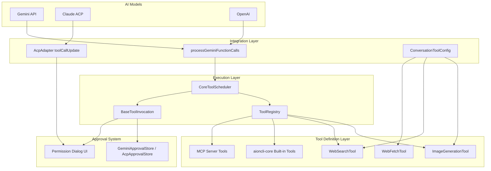

**Tool Execution Flow**:

1. AI model generates function call requests
2. Adapter layer converts model-specific format to unified tool invocation
3. Scheduler validates parameters and checks approval requirements
4. Tool invocation executes with progress tracking
5. Results are formatted and returned to the model

Sources: [src/agent/gemini/index.ts:1-865](), [src/agent/gemini/utils.ts:1-450](), [src/agent/gemini/cli/tools/conversation-tool-config.ts:1-181]()

---

## Tool Registration Architecture

### ConversationToolConfig: Conversation-Level Tool Management

`ConversationToolConfig` manages tool configuration for each conversation, determining which tools are available based on authentication type and user preferences.

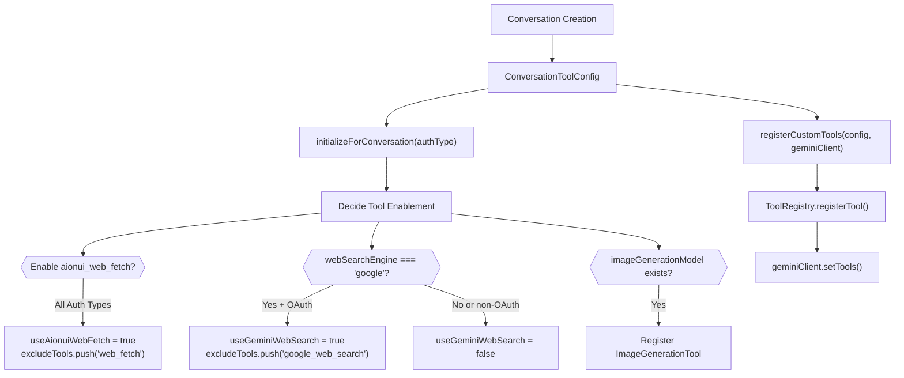

**Key Design Decisions**:

- **Conversation-scoped**: Tool configuration is fixed when conversation is created
- **Auth-aware**: Google OAuth-only tools (like `gemini_web_search`) are only enabled for `LOGIN_WITH_GOOGLE` auth
- **Excludes conflicts**: Built-in tools are excluded when custom replacements are registered

Sources: [src/agent/gemini/cli/tools/conversation-tool-config.ts:1-181]()

### Tool Registry and Discovery

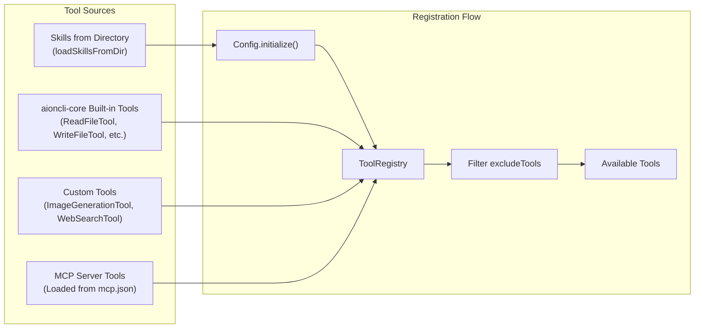

**Exclusion Mechanism**: Tools in `excludeTools` array are filtered out after registration, allowing custom replacements to override built-ins [src/agent/gemini/cli/tools/conversation-tool-config.ts:48]().

Sources: [src/agent/gemini/cli/config.ts:1-250](), [src/agent/gemini/cli/tools/conversation-tool-config.ts:130-179]()

---

## Tool Execution Lifecycle

### CoreToolScheduler: Central Execution Coordinator

`CoreToolScheduler` from `aioncli-core` manages the complete tool execution lifecycle with approval workflows, parallel execution support, and protection against premature cancellation.

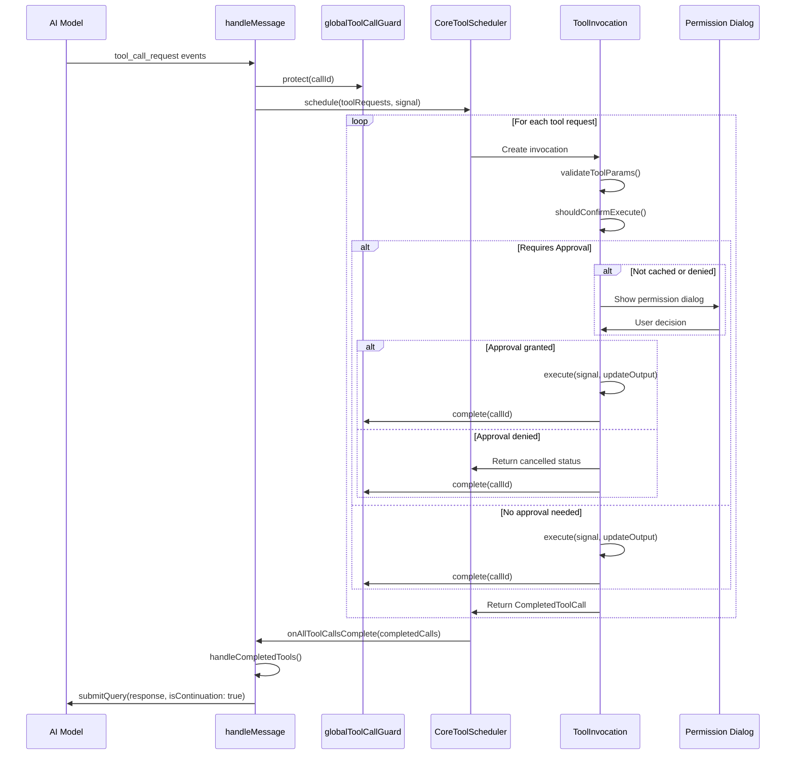

**Scheduler Configuration** [src/agent/gemini/index.ts:398-469]():

- `onAllToolCallsComplete`: Callback when all tools finish, filters for Gemini-initiated tools and submits their responses back to the model via `handleCompletedTools()` [src/agent/gemini/utils.ts:409-501]()
- `onToolCallsUpdate`: UI update callback that transforms core tool calls into display format and emits `tool_group` events [src/agent/gemini/index.ts:438-461]()
- `config`: Provides access to file system, workspace, authentication, and tool registry
- `getPreferredEditor`: Returns editor preference for tools that support code editing

**Protection Mechanism** [src/agent/gemini/cli/streamResilience.ts:1-150]():

- `globalToolCallGuard.protect(callId)`: Marks tool as protected immediately upon request to prevent misidentification as cancelled during stream interruptions
- `globalToolCallGuard.complete(callId)`: Removes protection when tool reaches terminal state (success/error)
- `globalToolCallGuard.isProtected(callId)`: Checked in `handleCompletedTools()` to avoid treating protected tools as cancelled [src/agent/gemini/utils.ts:449-455]()

Sources: [src/agent/gemini/index.ts:398-469](), [src/agent/gemini/utils.ts:409-501](), [src/agent/gemini/cli/streamResilience.ts:1-150]()
</thinking>

<old_str>

## Tool Execution Lifecycle

### CoreToolScheduler: Central Execution Coordinator

`CoreToolScheduler` from `aioncli-core` manages the complete tool execution lifecycle with approval workflows and parallel execution support.

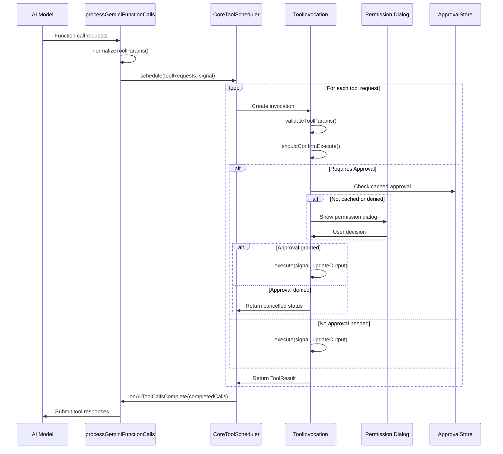

**Scheduler Configuration** [src/agent/gemini/index.ts:395-467]():

- `onAllToolCallsComplete`: Callback when all tools finish, triggers continuation with results
- `onToolCallsUpdate`: UI update callback with tool execution progress
- `config`: Access to file system, workspace, and authentication

Sources: [src/agent/gemini/index.ts:395-467](), [src/agent/gemini/utils.ts:332-450]()
</str>

<new_str>

## Tool Execution Lifecycle

### CoreToolScheduler: Central Execution Coordinator

`CoreToolScheduler` from `aioncli-core` manages the complete tool execution lifecycle with approval workflows, parallel execution support, and protection against premature cancellation.


**Scheduler Configuration** [src/agent/gemini/index.ts:398-469]():

- `onAllToolCallsComplete`: Callback when all tools finish, filters for Gemini-initiated tools and submits their responses back to the model via `handleCompletedTools()` [src/agent/gemini/utils.ts:409-501]()
- `onToolCallsUpdate`: UI update callback that transforms core tool calls into display format and emits `tool_group` events [src/agent/gemini/index.ts:438-461]()
- `config`: Provides access to file system, workspace, authentication, and tool registry
- `getPreferredEditor`: Returns editor preference for tools that support code editing

**Protection Mechanism** [src/agent/gemini/cli/streamResilience.ts:1-150]():

- `globalToolCallGuard.protect(callId)`: Marks tool as protected immediately upon request to prevent misidentification as cancelled during stream interruptions [src/agent/gemini/index.ts:517]()
- `globalToolCallGuard.complete(callId)`: Removes protection when tool reaches terminal state (success/error) [src/agent/gemini/utils.ts:417]()
- `globalToolCallGuard.isProtected(callId)`: Checked in `handleCompletedTools()` to avoid treating protected tools as cancelled [src/agent/gemini/utils.ts:449-455]()

Sources: [src/agent/gemini/index.ts:398-469](), [src/agent/gemini/utils.ts:409-501](), [src/agent/gemini/cli/streamResilience.ts:1-150]()

### Tool Parameter Normalization

Different AI models may use inconsistent parameter names. The `normalizeToolParams` function standardizes them before execution.

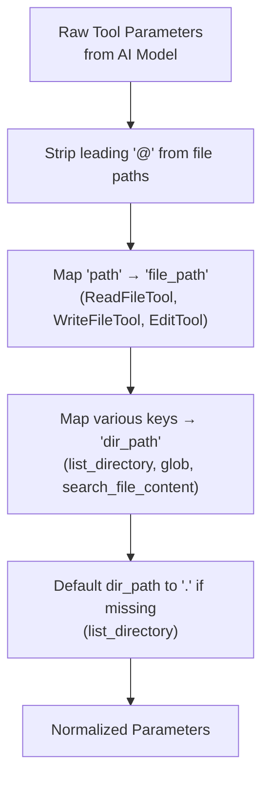

**Examples** [src/agent/gemini/utils.ts:288-331]():

- `@file.txt` → `file.txt`
- `{ path: "foo.txt" }` → `{ file_path: "foo.txt" }` for file tools
- `{ directory: "/usr" }` → `{ dir_path: "/usr" }` for directory tools

Sources: [src/agent/gemini/utils.ts:288-331]()

---

## Built-in Tools

### ImageGenerationTool: AI Image Generation and Analysis

`ImageGenerationTool` provides image generation, editing, and analysis capabilities using configurable image generation models (OpenAI, Gemini, etc.).

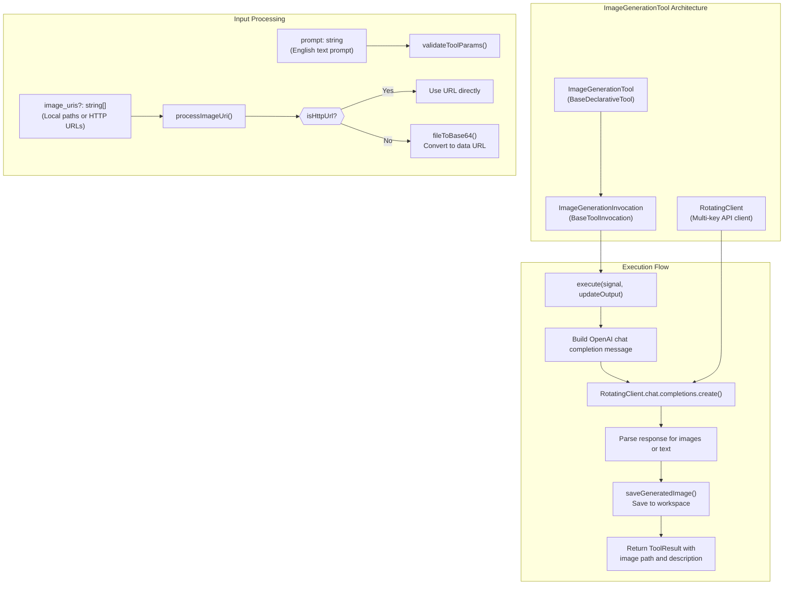

**Key Features** [src/agent/gemini/cli/tools/img-gen.ts:1-600]():

- **Multi-mode**: Generation, editing, analysis based on prompt prefix
- **Multi-key rotation**: Uses `RotatingClient` for API key fallback
- **Flexible input**: Supports local files, HTTP URLs, and @-references
- **Workspace integration**: Saves generated images with timestamp naming

**Parameter Validation** [src/agent/gemini/cli/tools/img-gen.ts:197-253]():

- Validates `prompt` is non-empty
- Checks `image_uris` files exist and have valid image extensions
- Supports JSON string format from model for array parameters

Sources: [src/agent/gemini/cli/tools/img-gen.ts:1-600]()

### WebSearchTool: Google Search Integration

`WebSearchTool` provides Google search capabilities for Gemini agents with OAuth authentication.

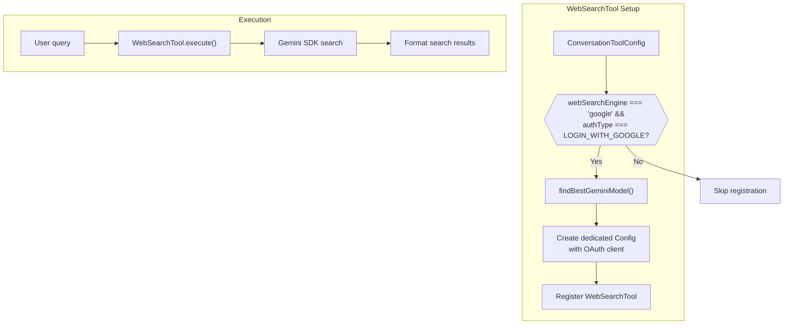

**Authentication Requirement**: Only enabled for `LOGIN_WITH_GOOGLE` or `USE_VERTEX_AI` auth types because it requires creating a Google OAuth client [src/agent/gemini/cli/tools/conversation-tool-config.ts:52-68]().

**Dedicated Config**: Uses a separate `Config` instance with its own `GeminiClient` to avoid auth conflicts with the main conversation [src/agent/gemini/cli/tools/conversation-tool-config.ts:99-112]().

Sources: [src/agent/gemini/cli/tools/conversation-tool-config.ts:1-181](), [src/agent/gemini/cli/tools/web-search.ts:1-100]()

### WebFetchTool: HTTP Content Retrieval

`WebFetchTool` replaces the built-in `web_fetch` tool with enhanced error handling and content extraction.

**Registration** [src/agent/gemini/cli/tools/conversation-tool-config.ts:46-49]():

```typescript
// All auth types use aionui_web_fetch
this.useAionuiWebFetch = true
this.excludeTools.push('web_fetch') // Exclude built-in
```

Sources: [src/agent/gemini/cli/tools/conversation-tool-config.ts:1-181](), [src/agent/gemini/cli/tools/web-fetch.ts:1-200]()

---

## MCP Tool Integration

MCP (Multi-Client Protocol) servers provide additional tools that are dynamically loaded and registered.

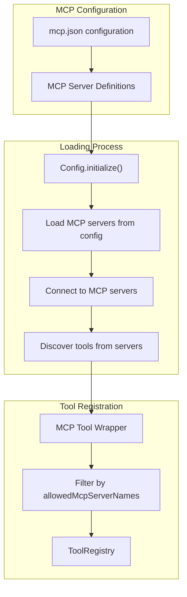

**Configuration Location**: MCP servers are configured in conversation's `mcpServers` property, passed during `Config` initialization [src/agent/gemini/cli/config.ts:70]().

**Server Filtering**: Only servers listed in `allowedMcpServerNames` are loaded if specified [src/agent/gemini/cli/settings.ts:1-300]().

Sources: [src/agent/gemini/cli/config.ts:1-250](), [src/agent/gemini/cli/settings.ts:1-300]()

---

## Codex Tool Protocol

Codex agents handle tools through event-based JSON-RPC protocol with specialized handlers for different tool types.

### Codex Tool Event Flow

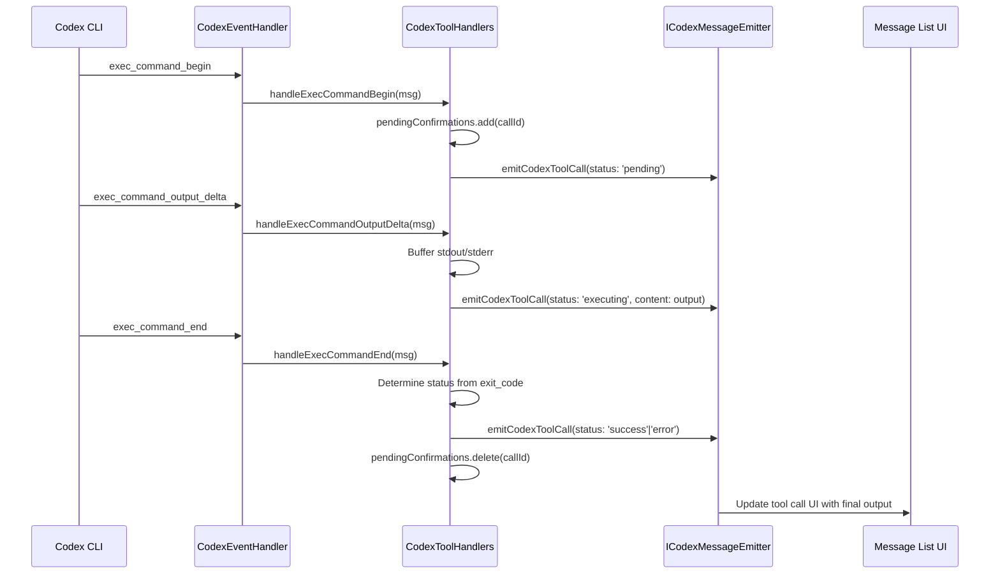

**Tool Call Types** [src/agent/codex/handlers/CodexToolHandlers.ts:1-437]():

| Event Type                  | Handler Method                 | Status Flow                               |
| --------------------------- | ------------------------------ | ----------------------------------------- |
| `exec_command_begin`        | `handleExecCommandBegin`       | `pending` → `executing`                   |
| `exec_command_output_delta` | `handleExecCommandOutputDelta` | `executing` (with buffered output)        |
| `exec_command_end`          | `handleExecCommandEnd`         | `success` or `error` based on exit_code   |
| `patch_apply_begin`         | `handlePatchApplyBegin`        | `pending` or `executing` if auto-approved |
| `patch_apply_end`           | `handlePatchApplyEnd`          | `success` or `error`                      |
| `mcp_tool_call_begin`       | `handleMcpToolCallBegin`       | `executing`                               |
| `mcp_tool_call_end`         | `handleMcpToolCallEnd`         | `success` or `error`                      |
| `web_search_begin`          | `handleWebSearchBegin`         | `pending`                                 |
| `web_search_end`            | `handleWebSearchEnd`           | `success`                                 |

**Permission Handling** [src/agent/codex/handlers/CodexEventHandler.ts:98-180]():

- Unified handler for `exec_approval_request` and `apply_patch_approval_request`
- Deduplication via `pendingConfirmations` set using `permission_{callId}` key
- Auto-approval check through `checkExecApproval` and `checkPatchApproval` methods
- Stores exec/patch metadata for ApprovalStore caching [src/agent/codex/handlers/CodexToolHandlers.ts:196]()

**Output Buffering** [src/agent/codex/handlers/CodexToolHandlers.ts:59-92]():

- Base64 decoding of command output chunks (Codex sends base64-encoded strings)
- Separate buffers for stdout, stderr, and combined output
- Progressive UI updates via `emitCodexToolCall` with buffered content

Sources: [src/agent/codex/handlers/CodexEventHandler.ts:1-350](), [src/agent/codex/handlers/CodexToolHandlers.ts:1-437]()

---

## Permission and Approval System

### Multi-Tier Approval Strategy

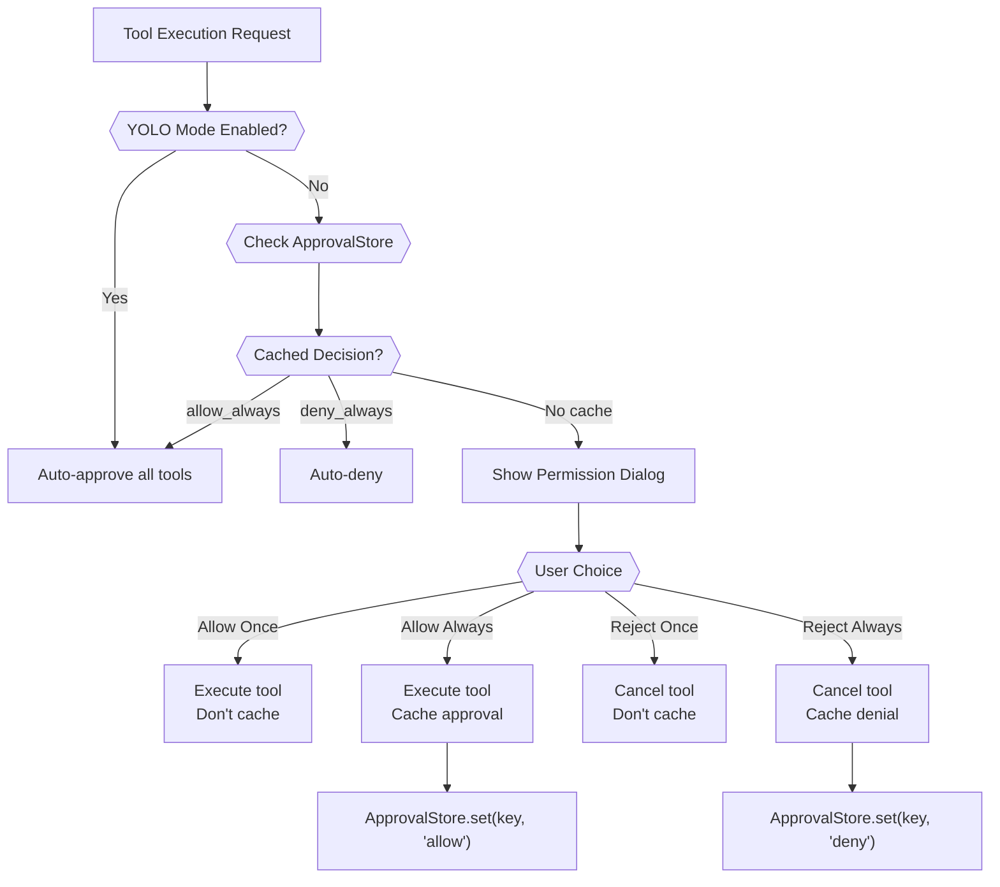

**Approval Key Generation** [src/agent/acp/ApprovalStore.ts:1-100]():

```typescript
// ACP: Hash of kind, title, and input
createAcpApprovalKey({ kind, title, rawInput })

// Gemini: Hash of tool name and arguments
createGeminiApprovalKey({ toolName, args })
```

**Session-Scoped Cache**: Approval cache is cleared when conversation ends [src/agent/acp/index.ts:291-294]().

Sources: [src/agent/gemini/GeminiApprovalStore.ts:1-150](), [src/agent/acp/ApprovalStore.ts:1-150]()

### Permission Dialog UI

**Gemini Tool Confirmation** [src/agent/gemini/index.ts:435-459]():

- `onToolCallsUpdate`: Emits tool group with confirmation details
- Frontend shows dialog with tool name, description, locations
- User choice sent back via IPC to `onConfirm` callback

**ACP Permission Request** [src/agent/acp/AcpConnection.ts:690-721]():

- `request_permission` method from ACP server
- Shows dialog with permission kind, title, suggested options
- Returns `outcome` with selected `optionId`

Sources: [src/agent/gemini/index.ts:395-467](), [src/agent/acp/AcpConnection.ts:690-721]()

---

## Tool Result Handling

### Result Display Format

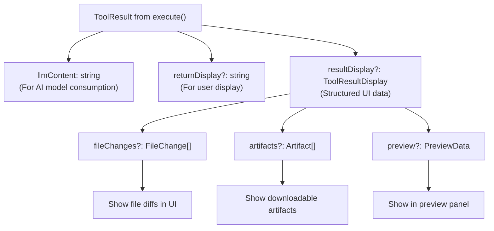

**Result Types** [src/agent/gemini/cli/tools/img-gen.ts:387-600]():

| Field           | Purpose                      | Example                            |
| --------------- | ---------------------------- | ---------------------------------- |
| `llmContent`    | Text for AI model to process | `"Generated image at img-123.png"` |
| `returnDisplay` | User-friendly text           | `"✓ Image generated successfully"` |
| `resultDisplay` | Structured UI data           | File paths, previews, artifacts    |

**Image Generation Result** [src/agent/gemini/cli/tools/img-gen.ts:550-580]():

```typescript
return {
  llmContent: analysisText,
  returnDisplay: analysisText,
  resultDisplay: {
    artifacts: [
      {
        label: 'Generated Image',
        content: imagePath,
        contentType: 'image',
      },
    ],
  },
}
```

Sources: [src/agent/gemini/cli/tools/img-gen.ts:387-600]()

### Continuation After Tools

**Gemini Agent** [src/agent/gemini/index.ts:398-428]():

- `onAllToolCallsComplete`: Callback that processes completed tools via `handleCompletedTools()` [src/agent/gemini/utils.ts:409-501]()
- Filters tools using `globalToolCallGuard.isProtected()` to avoid treating protected tools as cancelled
- Detects `save_memory` tool calls and triggers memory refresh via `refreshServerHierarchicalMemory()` [src/agent/gemini/utils.ts:429-436]()
- Submits Gemini-initiated tool results back to model using `submitQuery(response, isContinuation: true)` [src/agent/gemini/index.ts:424]()
- Merges response parts from multiple tools into single continuation request [src/agent/gemini/utils.ts:489-500]()

**Codex Agent**:

- Tool results automatically flow back through Codex CLI protocol
- Final message includes all tool execution context
- No explicit continuation call needed from AionUi side

**Tool Response Compaction** [src/agent/gemini/utils.ts:523-604]():

- After agentic loop completes, `compactToolResponsesInHistory()` is called to reduce context window usage
- Replaces base64 `inlineData` (images/PDFs) with lightweight text placeholders [src/agent/gemini/utils.ts:544-549]()
- Truncates large text responses (>10KB) to first 2KB with truncation notice [src/agent/gemini/utils.ts:553-557]()
- Preserves functionCall ↔ functionResponse pairing to maintain Gemini API compatibility

Sources: [src/agent/gemini/index.ts:398-428](), [src/agent/gemini/utils.ts:409-501](), [src/agent/gemini/utils.ts:523-604]()

---

## Tool Configuration Schema

### Complete Tool Configuration Structure

| Property               | Type                    | Source                 | Description                             |
| ---------------------- | ----------------------- | ---------------------- | --------------------------------------- |
| `proxy`                | string                  | ConversationToolConfig | HTTP proxy for tool network requests    |
| `imageGenerationModel` | TProviderWithModel      | ConversationToolConfig | Model config for image generation       |
| `webSearchEngine`      | 'google' \| 'default'   | ConversationToolConfig | Which search engine to use              |
| `yoloMode`             | boolean                 | GeminiAgent            | Auto-approve all tool executions        |
| `mcpServers`           | Record<string, unknown> | Config                 | MCP server configurations               |
| `excludeTools`         | string[]                | ConversationToolConfig | Tools to exclude from registration      |
| `skillsDir`            | string                  | Config                 | Directory for loading skill definitions |
| `enabledSkills`        | string[]                | Config                 | Filter for which skills to load         |

**Configuration Flow**:

1. User selects preferences in Guid page
2. `ConversationToolConfig` initialized with settings
3. `initializeForConversation()` called with auth type
4. Tools registered during `Config.initialize()`
5. Scheduler configured in `GeminiAgent.initToolScheduler()`

Sources: [src/agent/gemini/cli/tools/conversation-tool-config.ts:15-39](), [src/agent/gemini/index.ts:63-114]()

---

## Summary Table: Tool System Components

| Component                    | Location                                                   | Role                                                 |
| ---------------------------- | ---------------------------------------------------------- | ---------------------------------------------------- |
| `CoreToolScheduler`          | `aioncli-core`                                             | Central execution coordinator with approval workflow |
| `ConversationToolConfig`     | [src/agent/gemini/cli/tools/conversation-tool-config.ts]() | Conversation-level tool enablement decisions         |
| `ImageGenerationTool`        | [src/agent/gemini/cli/tools/img-gen.ts]()                  | Image generation, editing, and analysis              |
| `WebSearchTool`              | [src/agent/gemini/cli/tools/web-search.ts]()               | Google search with OAuth                             |
| `WebFetchTool`               | [src/agent/gemini/cli/tools/web-fetch.ts]()                | HTTP content retrieval                               |
| `ToolRegistry`               | `aioncli-core`                                             | Tool discovery and lookup                            |
| `normalizeToolParams`        | [src/agent/gemini/utils.ts:288-331]()                      | Parameter standardization across models              |
| `GeminiApprovalStore`        | [src/agent/gemini/GeminiApprovalStore.ts]()                | Session-level approval caching for Gemini            |
| `AcpApprovalStore`           | [src/agent/acp/ApprovalStore.ts]()                         | Session-level approval caching for ACP               |
| `processGeminiFunctionCalls` | [src/agent/gemini/utils.ts:332-450]()                      | Bridge from Gemini API to CoreToolScheduler          |

Sources: [src/agent/gemini/index.ts:1-865](), [src/agent/gemini/utils.ts:1-450](), [src/agent/gemini/cli/tools/]()
