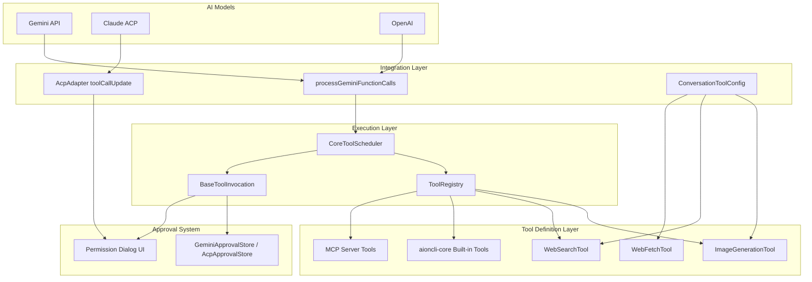
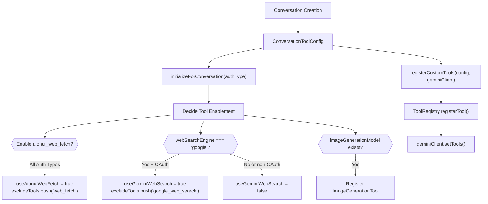
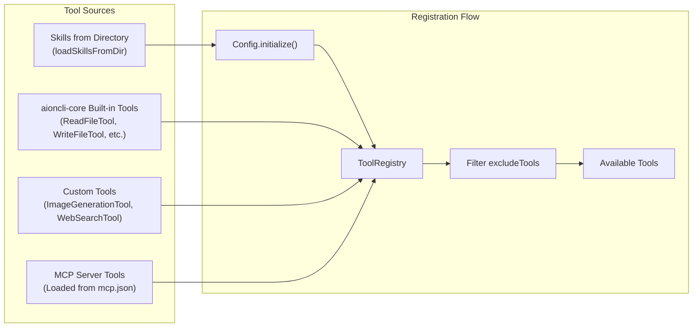
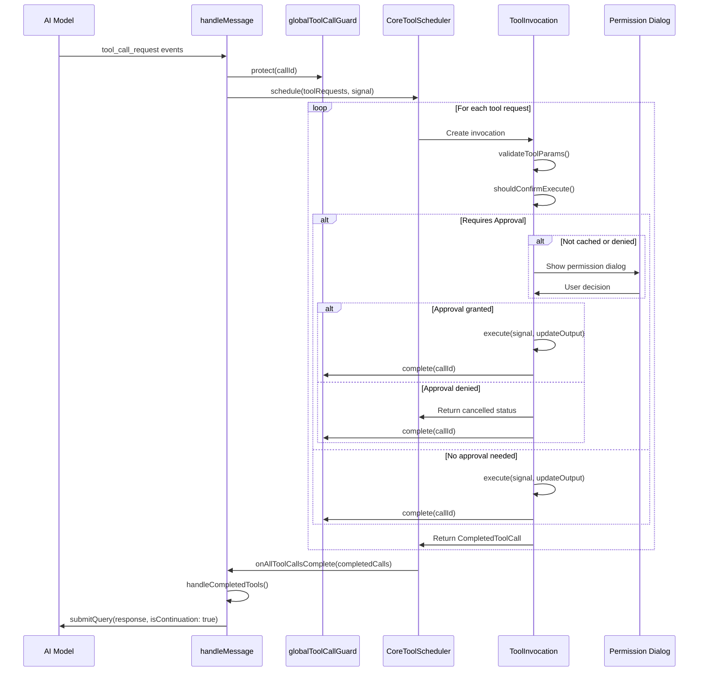
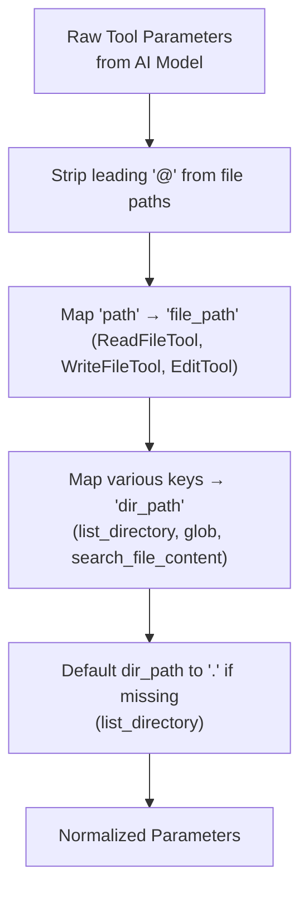
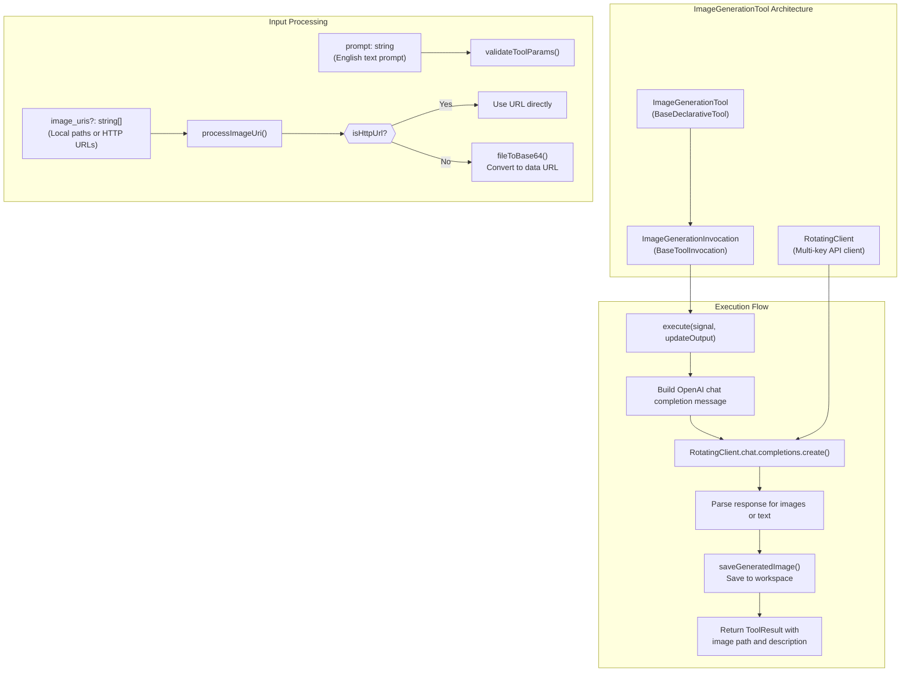
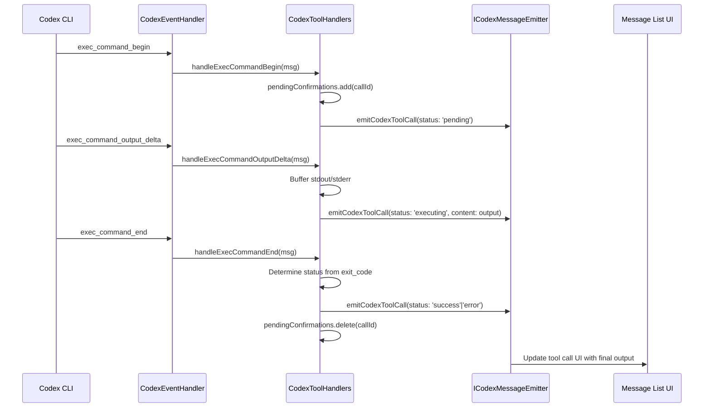
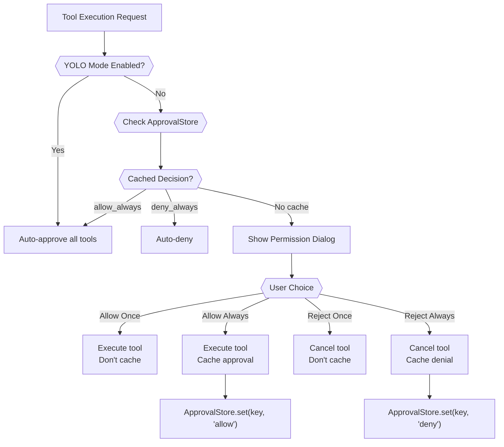

# Tool System Architecture

Relevant source files

The following files were used as context for generating this wiki page:

- [src/common/platform/register-electron.ts](src/common/platform/register-electron.ts)
- [src/common/platform/register-node.ts](src/common/platform/register-node.ts)
- [src/common/utils/platformAuthType.ts](src/common/utils/platformAuthType.ts)
- [src/process/bridge/fsBridge.ts](src/process/bridge/fsBridge.ts)
- [src/renderer/components/settings/SettingsModal/contents/WebuiModalContent.tsx](src/renderer/components/settings/SettingsModal/contents/WebuiModalContent.tsx)
- [src/renderer/components/settings/SettingsModal/contents/channels/ChannelModalContent.tsx](src/renderer/components/settings/SettingsModal/contents/channels/ChannelModalContent.tsx)
- [src/renderer/components/settings/SettingsModal/contents/channels/DingTalkConfigForm.tsx](src/renderer/components/settings/SettingsModal/contents/channels/DingTalkConfigForm.tsx)
- [src/renderer/components/settings/SettingsModal/contents/channels/LarkConfigForm.tsx](src/renderer/components/settings/SettingsModal/contents/channels/LarkConfigForm.tsx)
- [src/renderer/components/settings/SettingsModal/contents/channels/TelegramConfigForm.tsx](src/renderer/components/settings/SettingsModal/contents/channels/TelegramConfigForm.tsx)
- [src/renderer/pages/settings/AgentSettings/AssistantManagement/AddCustomPathModal.tsx](src/renderer/pages/settings/AgentSettings/AssistantManagement/AddCustomPathModal.tsx)
- [src/renderer/pages/settings/DisplaySettings/CssThemeModal.tsx](src/renderer/pages/settings/DisplaySettings/CssThemeModal.tsx)
- [src/renderer/pages/settings/SkillsHubSettings.tsx](src/renderer/pages/settings/SkillsHubSettings.tsx)
- [tests/unit/ChannelModelSelectionRestore.dom.test.tsx](tests/unit/ChannelModelSelectionRestore.dom.test.tsx)
- [tests/unit/SkillsHubSettings.dom.test.tsx](tests/unit/SkillsHubSettings.dom.test.tsx)
- [tests/unit/fsBridge.skills.test.ts](tests/unit/fsBridge.skills.test.ts)
- [tests/unit/platform/NodePlatformServices.test.ts](tests/unit/platform/NodePlatformServices.test.ts)
- [tests/unit/process/bridge/fsBridge.downloadRemoteBuffer.test.ts](tests/unit/process/bridge/fsBridge.downloadRemoteBuffer.test.ts)
- [tests/unit/process/bridge/fsBridge.readFile.test.ts](tests/unit/process/bridge/fsBridge.readFile.test.ts)
- [tests/unit/process/bridge/fsBridge.standalone.test.ts](tests/unit/process/bridge/fsBridge.standalone.test.ts)
- [tests/unit/skillsMarket.test.ts](tests/unit/skillsMarket.test.ts)

## Purpose and Scope

This document describes the **tool execution framework** in AionUi, which enables AI agents to perform actions beyond text generation. The system provides a unified architecture for tool registration, execution, approval workflows, and result handling across multiple agent types (Gemini, ACP, Codex).

For information about individual agent implementations, see [AI Agent Systems](#4). For MCP server management, see [4.6 MCP Integration](). For permission/approval workflows, see [13.4 Permission & Confirmation System]().

---

## System Overview

The tool system consists of three main layers:

1. **Tool Definition Layer**: Declarative tool classes that define capabilities, parameters, and validation.
2. **Execution Layer**: Schedulers and invocation handlers that manage tool lifecycle.
3. **Integration Layer**: Protocol adapters that bridge AI model responses to tool invocations.

Title: Tool System Architecture Data Flow

**Tool Execution Flow**:
1. AI model generates function call requests.
2. Adapter layer converts model-specific format to unified tool invocation.
3. Scheduler validates parameters and checks approval requirements.
4. Tool invocation executes with progress tracking.
5. Results are formatted and returned to the model.

Sources: [src/agent/gemini/index.ts:1-865](), [src/agent/gemini/utils.ts:1-450](), [src/agent/gemini/cli/tools/conversation-tool-config.ts:1-181]()

---

## Tool Registration Architecture

### ConversationToolConfig: Conversation-Level Tool Management

`ConversationToolConfig` manages tool configuration for each conversation, determining which tools are available based on authentication type and user preferences.

Title: Conversation Tool Initialization

**Key Design Decisions**:
- **Conversation-scoped**: Tool configuration is fixed when a conversation is created [src/agent/gemini/cli/tools/conversation-tool-config.ts:41-86]().
- **Auth-aware**: Google OAuth-only tools (like `gemini_web_search`) are only enabled for `LOGIN_WITH_GOOGLE` auth [src/agent/gemini/cli/tools/conversation-tool-config.ts:52-68]().
- **Excludes conflicts**: Built-in tools are excluded when custom replacements (like `aionui_web_fetch`) are registered [src/agent/gemini/cli/tools/conversation-tool-config.ts:48]().

Sources: [src/agent/gemini/cli/tools/conversation-tool-config.ts:1-181](), [src/common/utils/platformAuthType.ts:15-44]()

### Tool Registry and Discovery

Title: Tool Discovery Flow

**Exclusion Mechanism**: Tools in the `excludeTools` array are filtered out after registration, allowing custom replacements to override built-ins [src/agent/gemini/cli/tools/conversation-tool-config.ts:48]().

Sources: [src/agent/gemini/cli/config.ts:1-250](), [src/agent/gemini/cli/tools/conversation-tool-config.ts:130-179]()

---

## Tool Execution Lifecycle

### CoreToolScheduler: Central Execution Coordinator

`CoreToolScheduler` from `aioncli-core` manages the complete tool execution lifecycle with approval workflows, parallel execution support, and protection against premature cancellation.

Title: Tool Lifecycle Sequence

**Scheduler Configuration** [src/agent/gemini/index.ts:398-469]():
- `onAllToolCallsComplete`: Callback when all tools finish, filters for Gemini-initiated tools and submits their responses back to the model via `handleCompletedTools()` [src/agent/gemini/utils.ts:409-501]().
- `onToolCallsUpdate`: UI update callback that transforms core tool calls into display format and emits `tool_group` events [src/agent/gemini/index.ts:438-461]().
- `config`: Provides access to file system, workspace, authentication, and tool registry.
- `getPreferredEditor`: Returns editor preference for tools that support code editing.

**Protection Mechanism**:
- `globalToolCallGuard.protect(callId)`: Marks tool as protected immediately upon request to prevent misidentification as cancelled during stream interruptions [src/agent/gemini/index.ts:517]().
- `globalToolCallGuard.complete(callId)`: Removes protection when tool reaches terminal state (success/error) [src/agent/gemini/utils.ts:417]().
- `globalToolCallGuard.isProtected(callId)`: Checked in `handleCompletedTools()` to avoid treating protected tools as cancelled [src/agent/gemini/utils.ts:449-455]().

Sources: [src/agent/gemini/index.ts:398-469](), [src/agent/gemini/utils.ts:409-501]()

### Tool Parameter Normalization

Different AI models may use inconsistent parameter names. The `normalizeToolParams` function standardizes them before execution.

Title: Parameter Normalization Logic

**Examples** [src/agent/gemini/utils.ts:288-331]():
- `@file.txt` → `file.txt`
- `{ path: "foo.txt" }` → `{ file_path: "foo.txt" }` for file tools.
- `{ directory: "/usr" }` → `{ dir_path: "/usr" }` for directory tools.

Sources: [src/agent/gemini/utils.ts:288-331]()

---

## Built-in Tools

### ImageGenerationTool: AI Image Generation and Analysis

`ImageGenerationTool` provides image generation, editing, and analysis capabilities using configurable image generation models (OpenAI, Gemini, etc.).

Title: ImageGenerationTool Data Flow

**Key Features**:
- **Multi-mode**: Generation, editing, analysis based on prompt prefix [src/agent/gemini/cli/tools/img-gen.ts:1-600]().
- **Multi-key rotation**: Uses `RotatingClient` for API key fallback.
- **Flexible input**: Supports local files, HTTP URLs, and @-references.
- **Workspace integration**: Saves generated images with timestamp naming.

Sources: [src/agent/gemini/cli/tools/img-gen.ts:1-600]()

### WebSearchTool: Google Search Integration

`WebSearchTool` provides Google search capabilities for Gemini agents with OAuth authentication.

**Authentication Requirement**: Only enabled for `LOGIN_WITH_GOOGLE` or `USE_VERTEX_AI` auth types because it requires creating a Google OAuth client [src/agent/gemini/cli/tools/conversation-tool-config.ts:52-68]().

**Dedicated Config**: Uses a separate `Config` instance with its own `GeminiClient` to avoid auth conflicts with the main conversation [src/agent/gemini/cli/tools/conversation-tool-config.ts:99-112]().

Sources: [src/agent/gemini/cli/tools/conversation-tool-config.ts:1-181](), [src/common/utils/platformAuthType.ts:15-44]()

### WebFetchTool: HTTP Content Retrieval

`WebFetchTool` replaces the built-in `web_fetch` tool with enhanced error handling and content extraction. It is enabled for all authentication types by default in `ConversationToolConfig` [src/agent/gemini/cli/tools/conversation-tool-config.ts:46-49]().

Sources: [src/agent/gemini/cli/tools/conversation-tool-config.ts:1-181]()

---

## Codex Tool Protocol

Codex agents handle tools through event-based JSON-RPC protocol with specialized handlers for different tool types.

Title: Codex Tool Event Sequence

**Output Buffering**:
- Base64 decoding of command output chunks (Codex sends base64-encoded strings) [src/agent/codex/handlers/CodexToolHandlers.ts:59-92]().
- Progressive UI updates via `emitCodexToolCall` with buffered content.

Sources: [src/agent/codex/handlers/CodexEventHandler.ts:1-350](), [src/agent/codex/handlers/CodexToolHandlers.ts:1-437]()

---

## Permission and Approval System

### Multi-Tier Approval Strategy

Title: Tool Approval Decision Tree

**Approval Key Generation**:
- **ACP**: Hash of kind, title, and input [src/agent/acp/ApprovalStore.ts:1-100]().
- **Gemini**: Hash of tool name and arguments [src/agent/gemini/GeminiApprovalStore.ts:1-150]().

Sources: [src/agent/gemini/GeminiApprovalStore.ts:1-150](), [src/agent/acp/ApprovalStore.ts:1-150]()

---

## Tool Result Handling

### Result Display Format

| Field | Purpose | Example |
|-------|---------|---------|
| `llmContent` | Text for AI model to process | `"Generated image at img-123.png"` |
| `returnDisplay` | User-friendly text | `"✓ Image generated successfully"` |
| `resultDisplay` | Structured UI data (diffs, artifacts) | File paths, previews, artifacts |

**Image Generation Result** [src/agent/gemini/cli/tools/img-gen.ts:550-580]():
The `resultDisplay` field allows the UI to render specialized components like image previews or file download links for generated artifacts.

Sources: [src/agent/gemini/cli/tools/img-gen.ts:387-600]()

### Continuation After Tools

**Gemini Agent** [src/agent/gemini/index.ts:398-428]():
- `onAllToolCallsComplete`: Callback that processes completed tools via `handleCompletedTools()` [src/agent/gemini/utils.ts:409-501]().
- Submits Gemini-initiated tool results back to model using `submitQuery(response, isContinuation: true)` [src/agent/gemini/index.ts:424]().

**Tool Response Compaction** [src/agent/gemini/utils.ts:523-604]():
- After agentic loop completes, `compactToolResponsesInHistory()` is called to reduce context window usage.
- Replaces base64 `inlineData` (images/PDFs) with lightweight text placeholders [src/agent/gemini/utils.ts:544-549]().
- Truncates large text responses (>10KB) to first 2KB with truncation notice [src/agent/gemini/utils.ts:553-557]().

Sources: [src/agent/gemini/index.ts:398-428](), [src/agent/gemini/utils.ts:409-501](), [src/agent/gemini/utils.ts:523-604]()