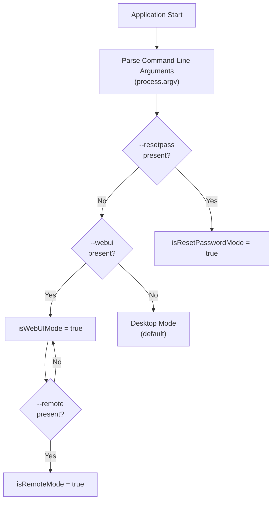
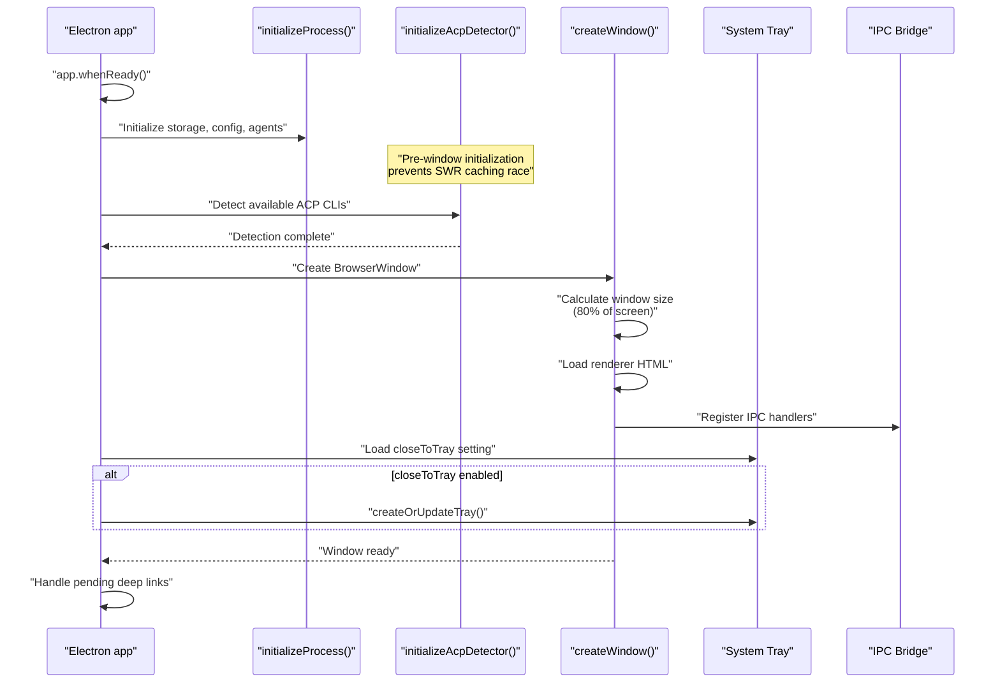
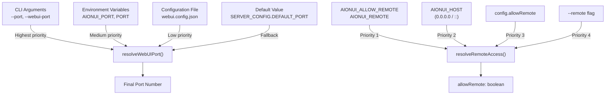
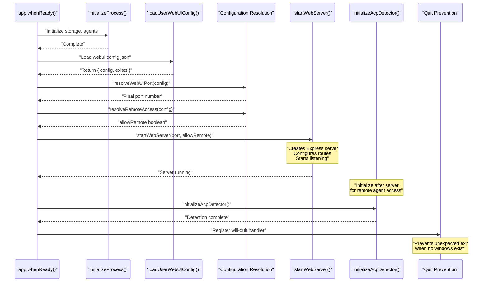
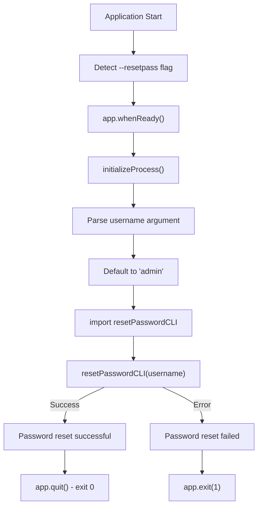
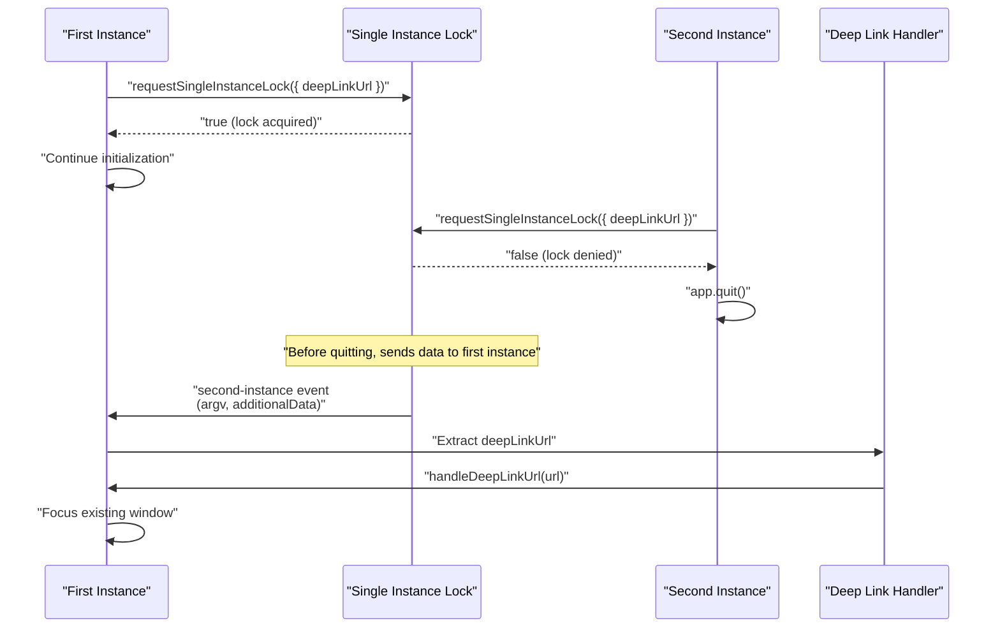

# Application Modes

Relevant source files

The following files were used as context for generating this wiki page:

- [.github/workflows/build-and-release.yml](.github/workflows/build-and-release.yml)
- [bun.lock](bun.lock)
- [electron-builder.yml](electron-builder.yml)
- [package.json](package.json)
- [scripts/README.md](scripts/README.md)
- [scripts/afterPack.js](scripts/afterPack.js)
- [scripts/afterSign.js](scripts/afterSign.js)
- [scripts/build-with-builder.js](scripts/build-with-builder.js)
- [scripts/rebuildNativeModules.js](scripts/rebuildNativeModules.js)
- [src/index.ts](src/index.ts)
- [tests/unit/common/appEnv.test.ts](tests/unit/common/appEnv.test.ts)
- [tests/unit/directoryApi.test.ts](tests/unit/directoryApi.test.ts)
- [tests/unit/extensions/extensionLoader.test.ts](tests/unit/extensions/extensionLoader.test.ts)

AionUi supports three distinct operational modes that determine how the application runs and what interfaces it exposes. Each mode serves a specific use case and follows different initialization paths.

This page documents the mode detection logic, configuration resolution, and initialization flow for each mode. For details on the Electron window management and system tray integration used in Desktop mode, see [Electron Framework](3.2). For information on the Express server implementation used in WebUI mode, see [WebUI Server Architecture](3.5).

---

## Mode Overview

AionUi determines its operational mode at startup based on command-line arguments. The three modes are mutually exclusive:

| Mode | Trigger | Primary Use Case | Process Type |
|------|---------|-----------------|--------------|
| **Desktop** | Default (no flags) | Standard GUI application | Main + Renderer |
| **WebUI** | `--webui` flag | Remote access via web browser | Main only (headless) |
| **CLI** | `--resetpass` command | Password reset utility | Main only (headless) |

The mode detection happens early in the application lifecycle, before the Electron `ready` event, to ensure proper Chromium configuration.

**Sources:** [src/index.ts:166-185](), [src/index.ts:256-258]()

---

## Mode Detection and Selection

### Detection Logic

Title: Application Mode Selection Logic

**Mode Detection Implementation**

The mode is determined by scanning `process.argv` for specific flags using helper functions `hasSwitch` and `hasCommand`:

- `isResetPasswordMode`: Detected by `hasCommand('--resetpass')` - exact match in `process.argv` [src/index.ts:185-185]().
- `isWebUIMode`: Detected by `hasSwitch('webui')` - matches `--webui` [src/index.ts:166-181]().
- `isRemoteMode`: Detected by `hasSwitch('remote')` - enables remote network access for WebUI [src/index.ts:182-182]().

**Sources:** [src/index.ts:166-185]()

---

## Desktop Mode

Desktop mode is the default operational mode, providing a standard Electron-based GUI application with a `BrowserWindow` and optional system tray integration.

### Desktop Mode Initialization Flow

Title: Desktop Mode Startup Sequence

### Window Creation

The `createWindow()` function creates a `BrowserWindow` with platform-specific titlebar configuration [src/index.ts:353-472](). Window dimensions are calculated as 80% of the primary display's work area to ensure visibility on high-resolution displays [src/index.ts:365-375]().

**Sources:** [src/index.ts:353-472]()

### System Tray Integration

Desktop mode supports optional "close to tray" behavior. Configuration is loaded from `ConfigStorage` at `system.closeToTray`. If enabled, `createOrUpdateTray()` creates a system tray icon [src/index.ts:264-351]().

**Sources:** [src/index.ts:264-351](), [src/process/utils/tray.ts:1-60]()

### ACP Detector Pre-initialization

Desktop mode initializes the ACP detector via `initializeAcpDetector()` **before** creating the window to prevent a race condition where the renderer might fetch available agents before detection finishes [src/index.ts:577-581]().

**Sources:** [src/index.ts:577-581]()

---

## WebUI Mode

WebUI mode runs AionUi as a headless web server, allowing remote access via a web browser. This mode is designed for deployment scenarios like Docker containers or Linux servers without a display.

### WebUI Configuration Resolution

Title: WebUI Port and Remote Access Resolution

**Configuration Priority (highest to lowest):**

1. **CLI Arguments**: `--port=8080` or `--webui-port=8080` [src/process/utils/webuiConfig.ts:47-49]()
2. **Environment Variables**: `AIONUI_PORT` or `PORT` [src/process/utils/webuiConfig.ts:49-49]()
3. **Configuration File**: `webui.config.json` in userData directory [src/process/utils/webuiConfig.ts:51-51]()
4. **Default**: `SERVER_CONFIG.DEFAULT_PORT` [src/process/utils/webuiConfig.ts:53-53]()

**Sources:** [src/process/utils/webuiConfig.ts:47-53]()

### WebUI Mode Initialization Flow

Title: WebUI Server Startup Sequence

**Sources:** [src/index.ts:556-623]()

---

## CLI Mode (Password Reset)

CLI mode provides a command-line utility for resetting user passwords. This mode runs headless, performs the password reset operation, and exits.

### CLI Mode Flow

Title: CLI Password Reset Logic

**Sources:** [src/index.ts:539-555]()

---

## Single Instance Lock

AionUi enforces single-instance behavior across all modes using `app.requestSingleInstanceLock()`. When a second instance starts (e.g. from a protocol URL), it sends its data to the first instance via the `second-instance` event, then quits [src/index.ts:70-74]().

Title: Single Instance Lock and Deep Link Coordination

**Sources:** [src/index.ts:68-98]()