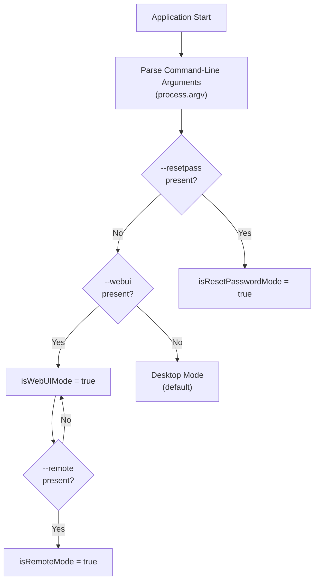
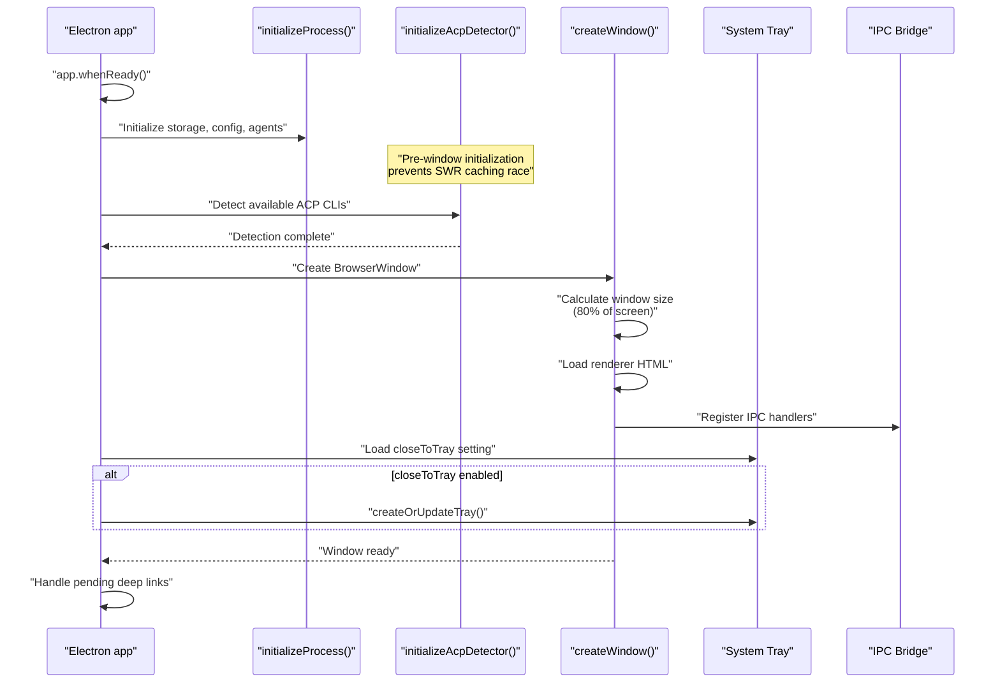
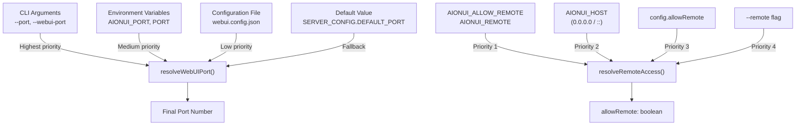
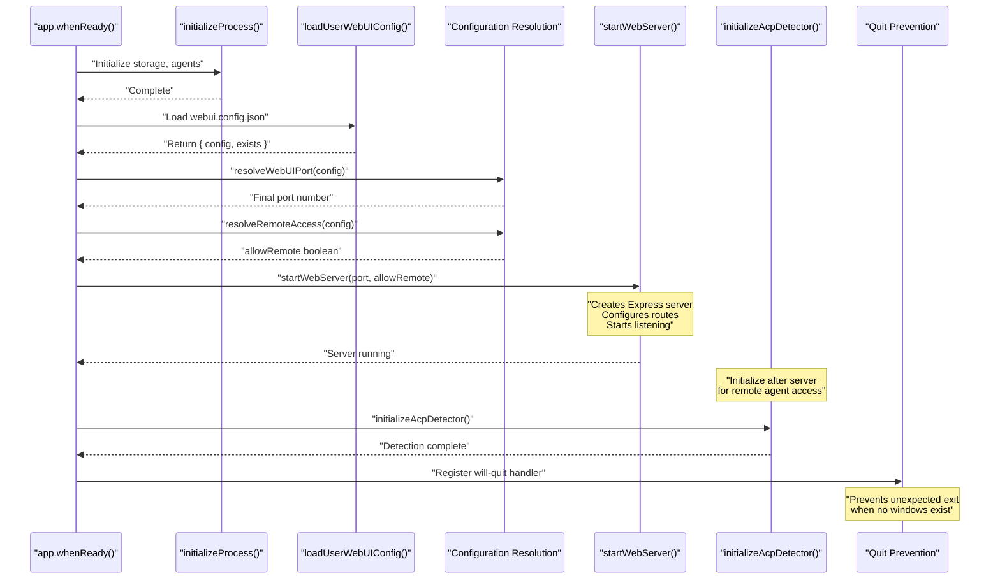
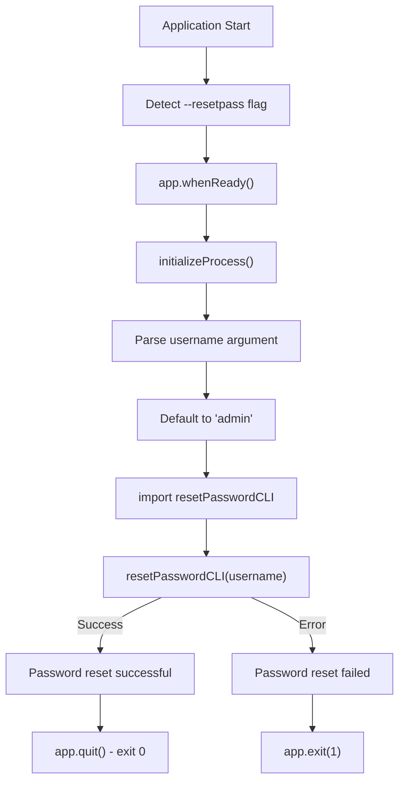
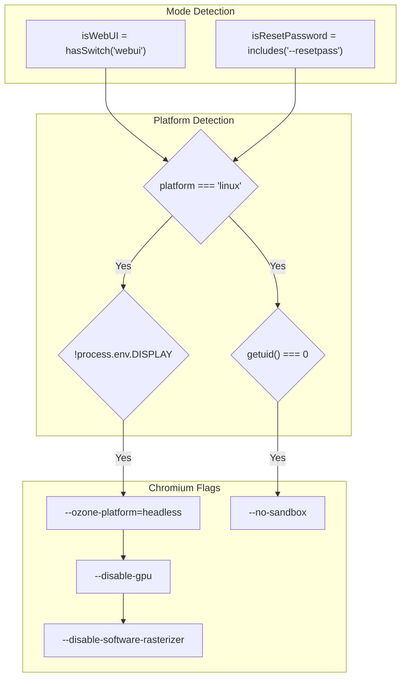
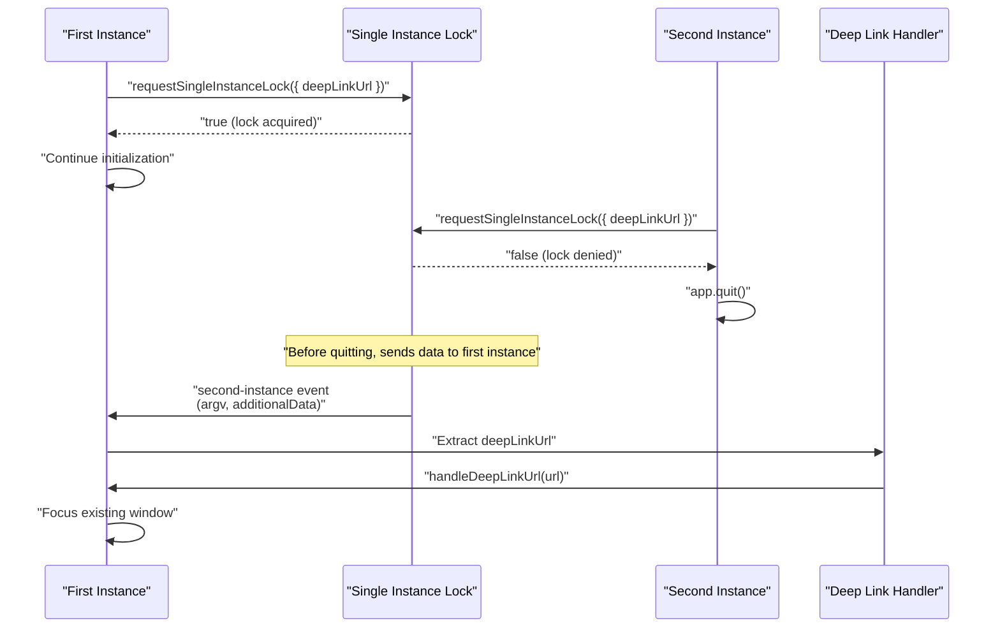

# Application Modes

<details>
<summary>Relevant source files</summary>

The following files were used as context for generating this wiki page:

- [.github/workflows/\_build-reusable.yml](.github/workflows/_build-reusable.yml)
- [.github/workflows/build-manual.yml](.github/workflows/build-manual.yml)
- [bun.lock](bun.lock)
- [src/index.ts](src/index.ts)
- [src/utils/configureChromium.ts](src/utils/configureChromium.ts)
- [tests/integration/autoUpdate.integration.test.ts](tests/integration/autoUpdate.integration.test.ts)
- [tests/unit/autoUpdaterService.test.ts](tests/unit/autoUpdaterService.test.ts)
- [tests/unit/test_acp_connection_disconnect.ts](tests/unit/test_acp_connection_disconnect.ts)
- [vitest.config.ts](vitest.config.ts)

</details>

AionUi supports three distinct operational modes that determine how the application runs and what interfaces it exposes. Each mode serves a specific use case and follows different initialization paths.

This page documents the mode detection logic, configuration resolution, and initialization flow for each mode. For details on the Electron window management and system tray integration used in Desktop mode, see [Electron Framework](#3.2). For information on the Express server implementation used in WebUI mode, see [WebUI Server Architecture](#3.5).

---

## Mode Overview

AionUi determines its operational mode at startup based on command-line arguments. The three modes are mutually exclusive:

| Mode        | Trigger               | Primary Use Case              | Process Type         |
| ----------- | --------------------- | ----------------------------- | -------------------- |
| **Desktop** | Default (no flags)    | Standard GUI application      | Main + Renderer      |
| **WebUI**   | `--webui` flag        | Remote access via web browser | Main only (headless) |
| **CLI**     | `--resetpass` command | Password reset utility        | Main only (headless) |

The mode detection happens early in the application lifecycle, before the Electron `ready` event, to ensure proper Chromium configuration.

**Sources:** [src/index.ts:256-258]()

---

## Mode Detection and Selection

### Detection Logic



**Mode Detection Implementation**

The mode is determined by scanning `process.argv` for specific flags:

- `isResetPasswordMode`: Detected by `hasCommand('--resetpass')` - exact match in argv
- `isWebUIMode`: Detected by `hasSwitch('webui')` - matches `--webui` with or without value
- `isRemoteMode`: Detected by `hasSwitch('remote')` - enables remote network access for WebUI

**Sources:** [src/index.ts:167-186](), [src/index.ts:256-258]()

---

## Desktop Mode

Desktop mode is the default operational mode, providing a standard Electron-based GUI application with a BrowserWindow and optional system tray integration.

### Desktop Mode Initialization Flow



### Window Creation

The `createWindow()` function creates a `BrowserWindow` with platform-specific titlebar configuration:

- **macOS**: Uses `titleBarStyle: 'hidden'` with traffic light positioning
- **Windows/Linux**: Uses frameless window (`frame: false`) with custom titlebar

Window dimensions are calculated as 80% of the primary display's work area to ensure visibility on high-resolution displays.

**Sources:** [src/index.ts:353-472](), [src/index.ts:575-618]()

### System Tray Integration

Desktop mode supports optional "close to tray" behavior:

1. Configuration loaded from `ConfigStorage` at `system.closeToTray`
2. If enabled, `createOrUpdateTray()` creates a system tray icon
3. Window close events are intercepted to hide instead of quit
4. Tray provides context menu for "Show Window" and "Quit"

**Sources:** [src/index.ts:264-351](), [src/index.ts:583-607]()

### ACP Detector Pre-initialization

Desktop mode initializes the ACP detector **before** creating the window to prevent a race condition:

```typescript
// Initialize ACP detector BEFORE creating the window to prevent a race
// condition where the renderer fetches getAvailableAgents before detection
// finishes, caching an empty result via SWR.
await initializeAcpDetector()

createWindow()
```

This ensures the renderer's SWR cache has valid ACP agent data when the window loads.

**Sources:** [src/index.ts:577-581]()

---

## WebUI Mode

WebUI mode runs AionUi as a headless web server, allowing remote access via a web browser. This mode is designed for deployment scenarios like Docker containers, Linux servers without a display, or remote development environments.

### WebUI Configuration Resolution



### Configuration File Structure

The `webui.config.json` file is stored in the application's `userData` directory:

```typescript
interface WebUIUserConfig {
  port?: number | string
  allowRemote?: boolean
}
```

**Configuration Priority (highest to lowest):**

1. **CLI Arguments**: `--port=8080` or `--webui-port=8080`
2. **Environment Variables**: `AIONUI_PORT` or `PORT`
3. **Configuration File**: `webui.config.json` in userData directory
4. **Default**: `SERVER_CONFIG.DEFAULT_PORT`

**Sources:** [src/index.ts:188-237]()

### Remote Access Resolution

Remote access determines whether the server binds to `0.0.0.0` (allowing external connections) or `127.0.0.1` (localhost only):

```typescript
const resolveRemoteAccess = (config: WebUIUserConfig): boolean => {
  const envRemote = parseBooleanEnv(
    process.env.AIONUI_ALLOW_REMOTE || process.env.AIONUI_REMOTE
  )
  const hostHint = process.env.AIONUI_HOST?.trim()
  const hostRequestsRemote = hostHint
    ? ['0.0.0.0', '::', '::0'].includes(hostHint)
    : false
  const configRemote = config.allowRemote === true

  return (
    isRemoteMode || hostRequestsRemote || envRemote === true || configRemote
  )
}
```

**Sources:** [src/index.ts:247-254]()

### WebUI Mode Initialization Flow



**Sources:** [src/index.ts:556-623]()

### Quit Prevention in WebUI Mode

WebUI mode prevents automatic application exit when running headless on Linux:

```typescript
// Keep the process alive in WebUI mode by preventing default quit behavior.
// On Linux headless (systemd), Electron may attempt to quit when no windows exist.
app.on('will-quit', (event) => {
  // Only prevent quit if this is an unexpected exit (server still running).
  // Explicit app.exit() calls bypass will-quit, so they are unaffected.
  if (!isExplicitQuit) {
    event.preventDefault()
    console.warn('[WebUI] Prevented unexpected quit — server is still running')
  }
})
```

The `isExplicitQuit` flag is set in the `before-quit` event handler to distinguish intentional shutdowns from unexpected exit attempts.

**Sources:** [src/index.ts:260-261](), [src/index.ts:567-574](), [src/index.ts:728-730]()

---

## CLI Mode (Password Reset)

CLI mode provides a command-line utility for resetting user passwords. This mode runs headless, performs the password reset operation, and exits.

### CLI Mode Flow



### Username Argument Parsing

The username is extracted from command-line arguments after the `--resetpass` flag:

```typescript
// Get username argument, filtering out flags (--xxx)
const resetPasswordIndex = process.argv.indexOf('--resetpass')
const argsAfterCommand = process.argv.slice(resetPasswordIndex + 1)
const username =
  argsAfterCommand.find((arg) => !arg.startsWith('--')) || 'admin'
```

**Example usage:**

```bash
# Reset password for 'admin' (default)
aionui --resetpass

# Reset password for specific user
aionui --resetpass john.doe
```

**Sources:** [src/index.ts:539-555](), [src/index.ts:542-546]()

---

## Chromium Configuration by Mode

Different modes require different Chromium configurations, particularly for headless operation.

### Configuration Matrix



### Headless Configuration for Linux

When running in WebUI or CLI mode on Linux without a display server:

```typescript
// For Linux without DISPLAY, use headless Ozone platform
if (process.platform === 'linux' && !process.env.DISPLAY) {
  app.commandLine.appendSwitch('ozone-platform', 'headless')
  app.commandLine.appendSwitch('disable-gpu')
  app.commandLine.appendSwitch('disable-software-rasterizer')
}
```

**Important:** The code uses `--ozone-platform=headless` instead of `--headless` because:

- `--headless`: Browser automation mode that causes auto-exit
- `--ozone-platform=headless`: Provides a display backend without requiring a display server, keeping the process alive

**Sources:** [src/utils/configureChromium.ts:16-38]()

### Root User Sandbox Disabling

When running as root (UID 0), the sandbox is disabled to prevent crashes:

```typescript
// For root user, disable sandbox to prevent crash
if (typeof process.getuid === 'function' && process.getuid() === 0) {
  app.commandLine.appendSwitch('no-sandbox')
}
```

**Sources:** [src/utils/configureChromium.ts:33-37]()

---

## Single Instance Lock

AionUi enforces single-instance behavior across all modes using `app.requestSingleInstanceLock()`:



**Lock Acquisition Flow:**

1. First instance requests lock with `additionalData: { deepLinkUrl }`
2. Lock is acquired, application continues normally
3. Second instance attempts to launch (e.g., user clicks a protocol link)
4. Second instance requests lock but is denied
5. Second instance's `additionalData` is sent to first instance via `second-instance` event
6. Second instance calls `app.quit()`
7. First instance receives deep link data and focuses its window

**Sources:** [src/index.ts:95-116]()

---

## Mode-Specific Features

| Feature            | Desktop | WebUI           | CLI             |
| ------------------ | ------- | --------------- | --------------- |
| BrowserWindow      | ✓       | ✗               | ✗               |
| System Tray        | ✓       | ✗               | ✗               |
| Deep Link Handling | ✓       | ✗               | ✗               |
| Express Server     | ✗       | ✓               | ✗               |
| Remote Access      | ✗       | ✓ (optional)    | ✗               |
| Auto-Update        | ✓       | ✓               | ✗               |
| ACP Detection      | ✓       | ✓               | ✗               |
| Password Reset     | ✗       | ✗               | ✓               |
| Headless Chromium  | ✗       | ✓ (Linux)       | ✓ (Linux)       |
| Sandbox Disabled   | ✗       | ✗ (unless root) | ✗ (unless root) |

**Sources:** [src/index.ts:514-665]()

---

## Environment Variables Summary

The following environment variables affect mode behavior:

| Variable              | Mode      | Purpose                                                        |
| --------------------- | --------- | -------------------------------------------------------------- |
| `AIONUI_PORT`         | WebUI     | Override server port                                           |
| `PORT`                | WebUI     | Fallback port variable                                         |
| `AIONUI_ALLOW_REMOTE` | WebUI     | Enable remote access (true/false)                              |
| `AIONUI_REMOTE`       | WebUI     | Alias for AIONUI_ALLOW_REMOTE                                  |
| `AIONUI_HOST`         | WebUI     | Bind host (0.0.0.0 enables remote)                             |
| `DISPLAY`             | WebUI/CLI | Linux display server (triggers headless if unset)              |
| `AIONUI_CDP_PORT`     | All       | Chrome DevTools Protocol port (see [Electron Framework](#3.2)) |

**Sources:** [src/index.ts:226-254](), [src/utils/configureChromium.ts:223-230]()
