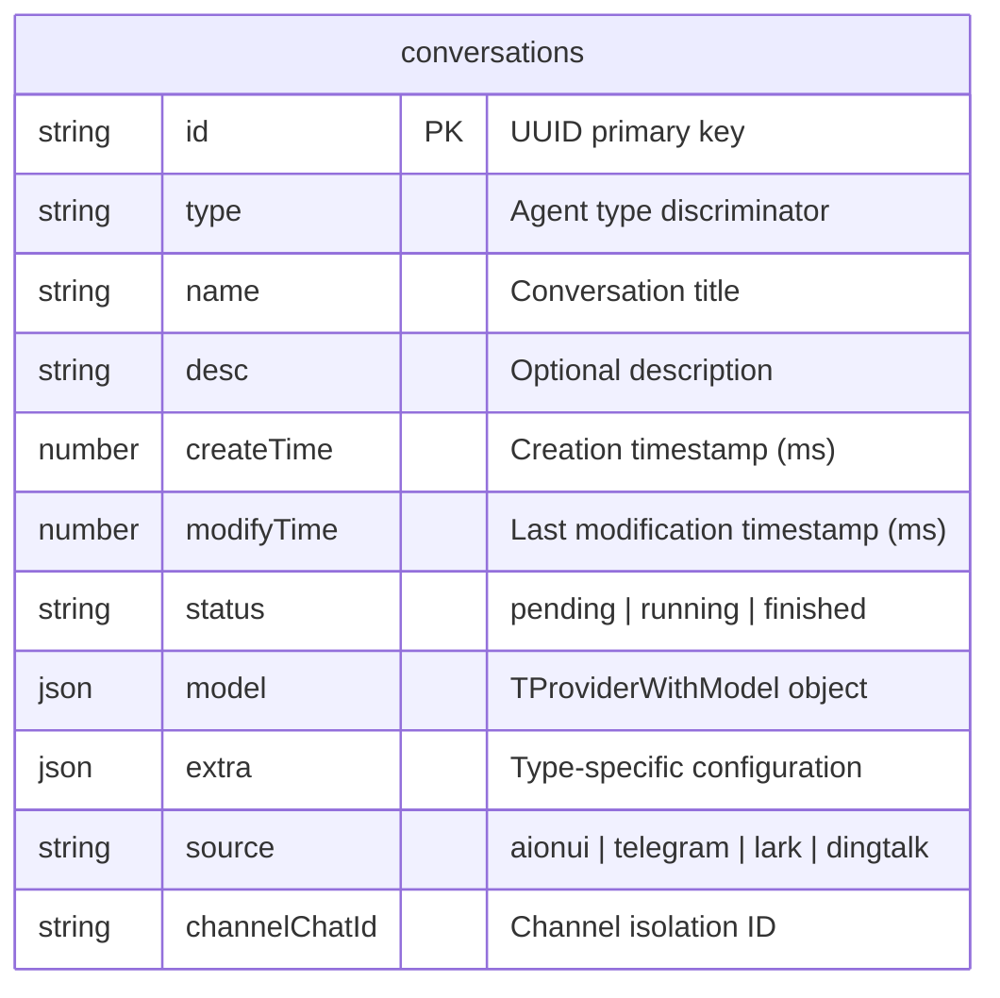
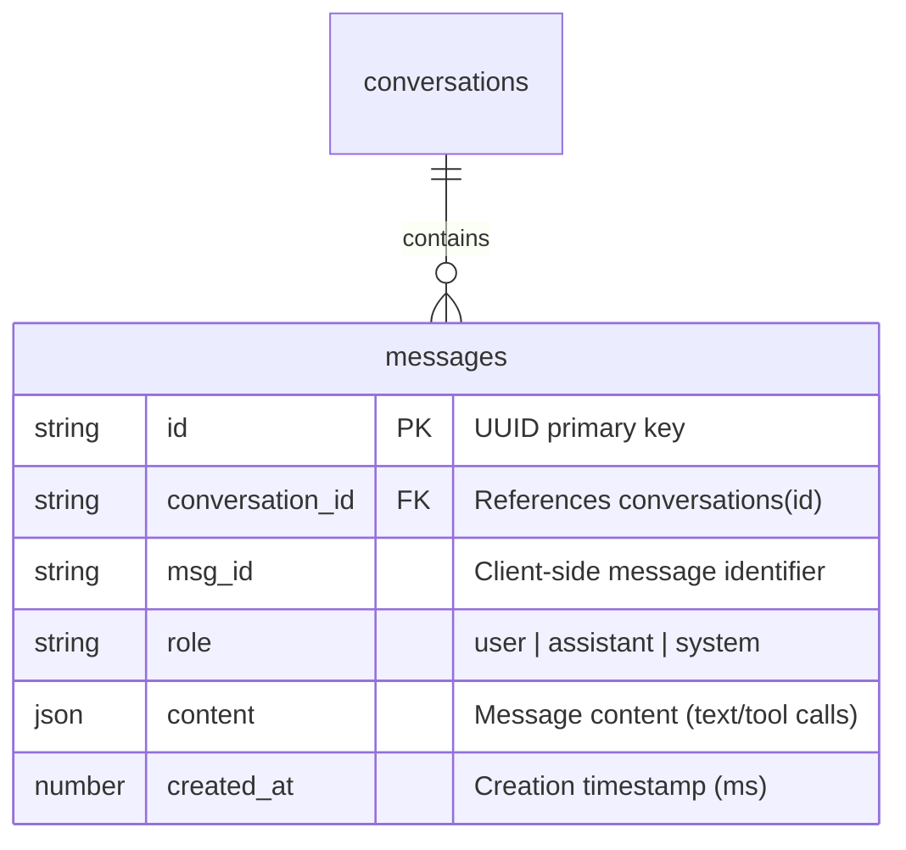
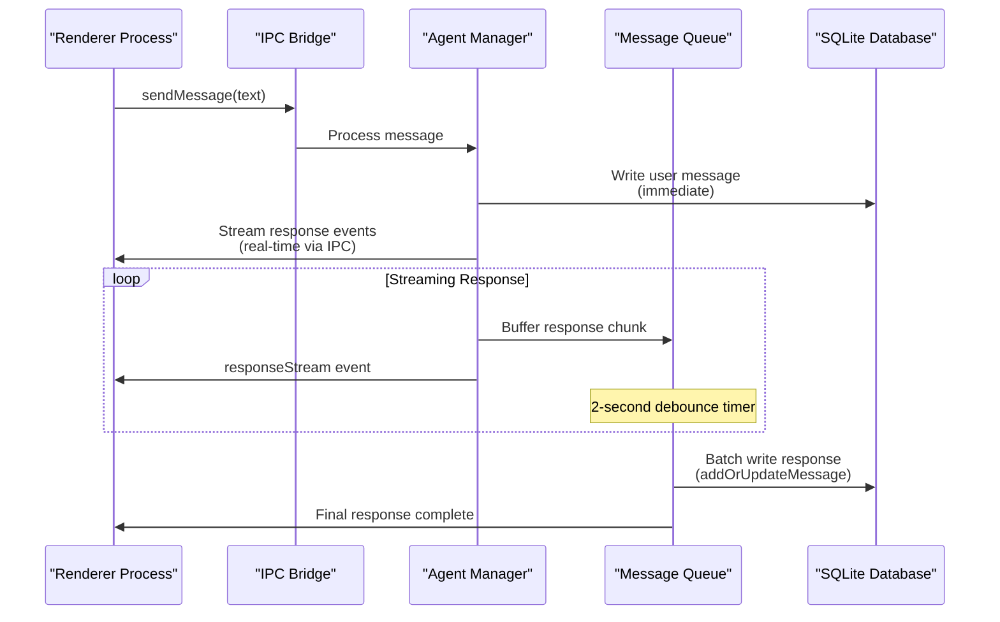
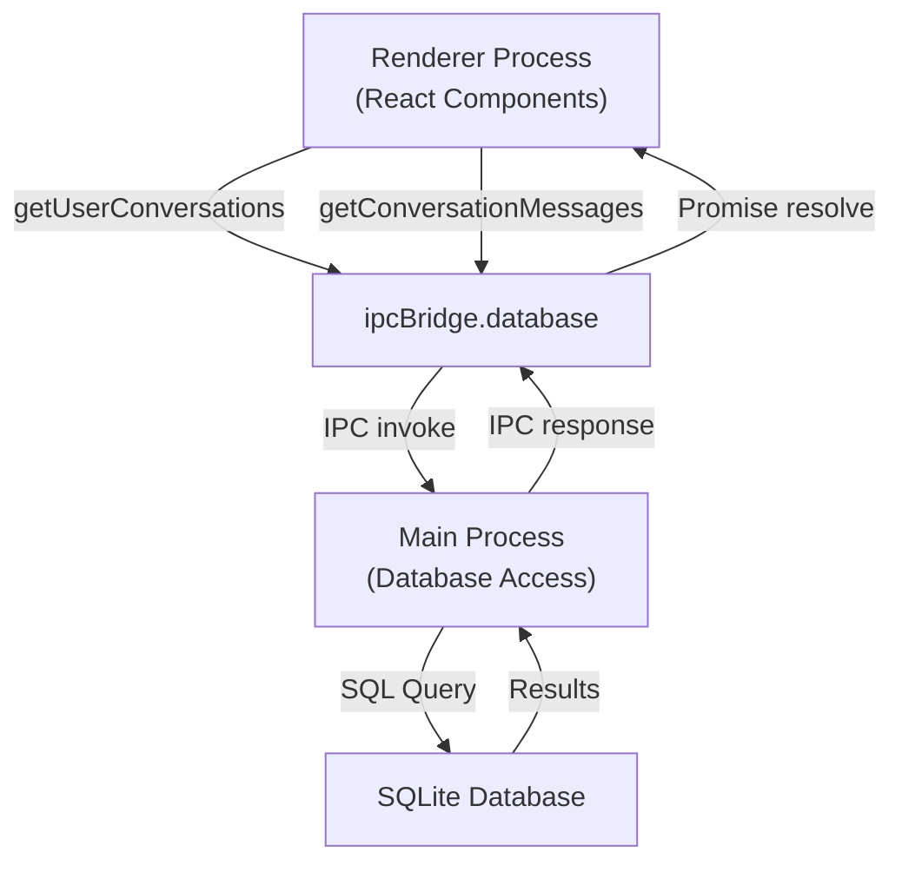
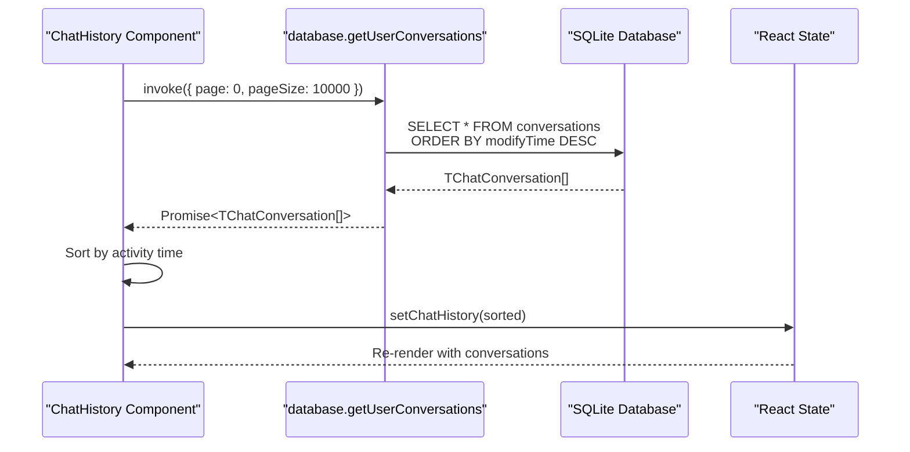
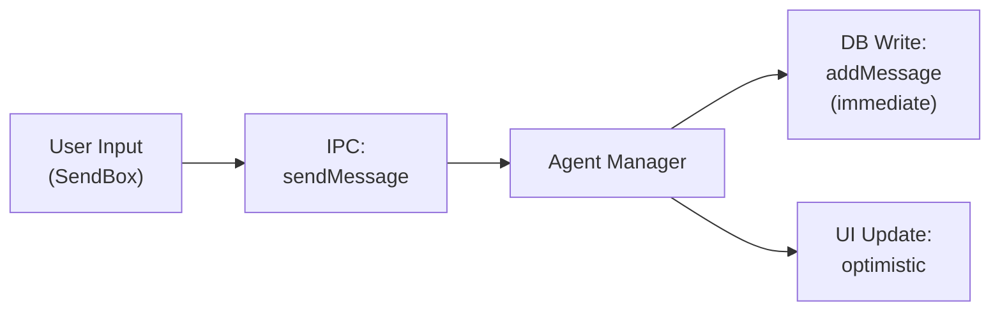
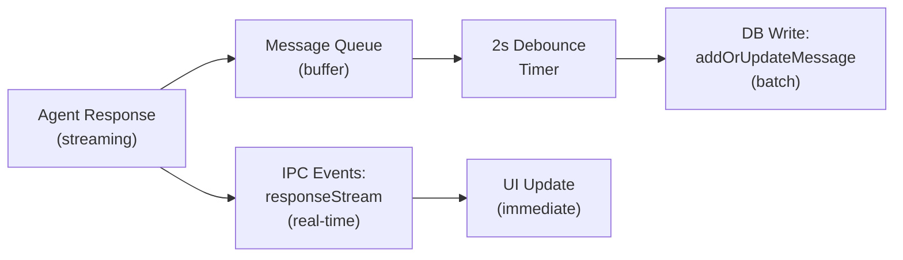
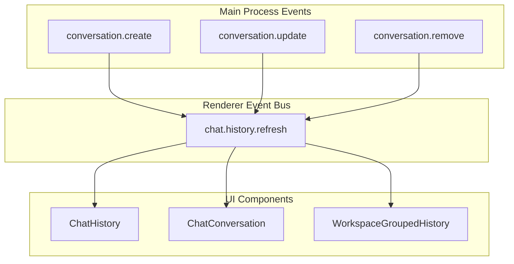

# Database System

<details>
<summary>Relevant source files</summary>

The following files were used as context for generating this wiki page:

- [src/common/ipcBridge.ts](src/common/ipcBridge.ts)
- [src/common/storage.ts](src/common/storage.ts)
- [src/process/initAgent.ts](src/process/initAgent.ts)
- [src/renderer/layout.tsx](src/renderer/layout.tsx)
- [src/renderer/pages/conversation/ChatConversation.tsx](src/renderer/pages/conversation/ChatConversation.tsx)
- [src/renderer/pages/conversation/ChatHistory.tsx](src/renderer/pages/conversation/ChatHistory.tsx)
- [src/renderer/pages/conversation/ChatLayout.tsx](src/renderer/pages/conversation/ChatLayout.tsx)
- [src/renderer/pages/conversation/ChatSider.tsx](src/renderer/pages/conversation/ChatSider.tsx)
- [src/renderer/pages/guid/index.tsx](src/renderer/pages/guid/index.tsx)
- [src/renderer/pages/settings/SettingsSider.tsx](src/renderer/pages/settings/SettingsSider.tsx)
- [src/renderer/router.tsx](src/renderer/router.tsx)
- [src/renderer/sider.tsx](src/renderer/sider.tsx)
- [src/renderer/styles/themes/base.css](src/renderer/styles/themes/base.css)

</details>

This document explains the SQLite-based persistence layer that stores conversation metadata and message history. The database system provides durable storage for all chat interactions and implements a sophisticated message batching mechanism to handle high-throughput streaming responses without degrading performance.

For information about the in-memory storage layer (ConfigStorage, ChatStorage), see [Storage System](#3.4). For details on how conversations are created and managed, see [Inter-Process Communication](#3.3).

---

## Overview

AionUi uses SQLite as its primary database for persisting conversations and messages. The database stores two main categories of data:

| Data Type             | Storage Location           | Purpose                                                     |
| --------------------- | -------------------------- | ----------------------------------------------------------- |
| Conversation metadata | `conversations` table      | Session configuration, workspace paths, agent settings      |
| Message history       | `messages` table           | User inputs, agent responses, tool calls, streaming content |
| Configuration         | JSON files (ConfigStorage) | Model providers, system settings, user preferences          |

The database system is designed to handle streaming AI responses efficiently through a batching mechanism that prevents database write contention during rapid message updates.

**Sources:** High-level architecture diagrams (Diagram 2), [src/common/storage.ts:1-453]()

---

## Database Schema

### Conversations Table

The `conversations` table stores metadata for each chat session. The schema maps directly to the `TChatConversation` TypeScript type, which is a discriminated union supporting five agent types: `gemini`, `acp`, `codex`, `openclaw-gateway`, and `nanobot`.



The `type` field determines which fields are populated in the `extra` JSON column:

| Type               | Extra Fields                                                                                                     | Description                                   |
| ------------------ | ---------------------------------------------------------------------------------------------------------------- | --------------------------------------------- |
| `gemini`           | `workspace`, `webSearchEngine`, `contextFileName`, `presetRules`, `enabledSkills`, `sessionMode`                 | Gemini agent configuration with tool settings |
| `acp`              | `workspace`, `backend`, `cliPath`, `agentName`, `customAgentId`, `acpSessionId`, `sessionMode`, `currentModelId` | ACP protocol agents (Claude, Qwen, etc.)      |
| `codex`            | `workspace`, `cliPath`, `sandboxMode`, `codexModel`                                                              | Legacy Codex agent (deprecated)               |
| `openclaw-gateway` | `workspace`, `backend`, `gateway`, `sessionKey`, `runtimeValidation`                                             | OpenClaw gateway connections                  |
| `nanobot`          | `workspace`, `enabledSkills`                                                                                     | Simplified built-in agent                     |

**Sources:** [src/common/storage.ts:133-302](), [src/process/initAgent.ts:1-189]()

---

### Messages Table

The `messages` table stores all conversation history with support for streaming updates and tool execution records.



The `content` field is a JSON structure that varies based on message role:

- **User messages**: Plain text or file attachments
- **Assistant messages**: Streaming text content, tool call records, final responses
- **System messages**: Context injection, preset rules, skill definitions

**Sources:** High-level architecture diagrams (Diagram 2)

---

## Message Batching Mechanism

### ConversationManageWithDB

The `ConversationManageWithDB` class implements a message batching system with a **2-second debounce window** to prevent database thrashing during streaming AI responses. This design allows the UI to receive real-time updates via IPC events while deferring database writes.



### Dual Write Strategy

The system uses different persistence strategies based on message source:

| Message Source  | Write Strategy                      | Rationale                                                  |
| --------------- | ----------------------------------- | ---------------------------------------------------------- |
| User input      | **Immediate write** to database     | Ensures durability; user messages are infrequent           |
| Agent streaming | **Buffered write** with 2s debounce | Prevents write contention; streaming chunks arrive rapidly |
| Tool execution  | **Immediate write** per tool call   | Tool results need immediate persistence for resume support |

This dual strategy is visible in the renderer's optimistic UI updates:

1. User sends message → immediate database write + UI update
2. Agent streams response → UI receives events via IPC, database waits for debounce
3. Stream completes → batched database write finalizes the message

**Sources:** High-level architecture diagrams (Diagram 2, Diagram 5)

---

## Query Interface

### IPC Bridge Database API

The database is accessed from the renderer process through the IPC bridge, which provides two primary query methods:



**`database.getUserConversations`**

Fetches all conversations for the current user with pagination support:

```typescript
ipcBridge.database.getUserConversations.invoke({
  page: 0,
  pageSize: 10000,
})
// Returns: TChatConversation[]
```

Usage example from ChatHistory component:

[src/renderer/pages/conversation/ChatHistory.tsx:96-110]()

**`database.getConversationMessages`**

Fetches message history for a specific conversation:

```typescript
ipcBridge.database.getConversationMessages.invoke({
  conversation_id: string,
  page?: number,
  pageSize?: number
})
// Returns: TMessage[]
```

Both methods support pagination through `page` and `pageSize` parameters, though the default page size (10000) is typically sufficient for desktop usage.

**Sources:** [src/common/ipcBridge.ts:324-328](), [src/renderer/pages/conversation/ChatHistory.tsx:94-114]()

---

## Data Flow Architecture

### Conversation Loading Flow

When the application starts or the user navigates to the conversation history, the following sequence occurs:



The component listens for the `chat.history.refresh` event to reload conversations after create/update/delete operations:

[src/renderer/pages/conversation/ChatHistory.tsx:113-114]()

### Message Persistence Flow

The message persistence system uses a two-phase approach:

**Phase 1: User Message (Immediate Write)**



**Phase 2: Agent Response (Batched Write)**



This architecture ensures:

- User messages are never lost (immediate persistence)
- UI remains responsive during streaming (decoupled from DB writes)
- Database write load is manageable (batched updates)
- Final state is consistent (debounced batch writes)

**Sources:** High-level architecture diagrams (Diagram 5)

---

## Conversation Updates and State Synchronization

### Update Operations

Conversations can be updated through the `conversation.update` IPC method, which supports partial updates with optional `extra` field merging:

```typescript
ipcBridge.conversation.update.invoke({
  id: string,
  updates: Partial<TChatConversation>,
  mergeExtra?: boolean  // If true, merge into extra instead of replacing
})
// Returns: Promise<boolean>
```

Common update scenarios:

| Update Type         | Fields Modified       | Triggers Refresh                 |
| ------------------- | --------------------- | -------------------------------- |
| Rename conversation | `name`, `modifyTime`  | `chat.history.refresh` event     |
| Change model        | `model`, `modifyTime` | No event (component-level state) |
| Update workspace    | `extra.workspace`     | No event (internal state only)   |
| Set session mode    | `extra.sessionMode`   | No event (runtime state)         |

Example from conversation rename flow:

[src/renderer/pages/conversation/ChatHistory.tsx:142-150]()

### Event-Driven Synchronization

The system uses event emitters to keep UI synchronized with database state:



Components subscribe to the `chat.history.refresh` event to reload data after mutations, ensuring consistency across the application without manual cache invalidation.

**Sources:** [src/renderer/pages/conversation/ChatHistory.tsx:113-114](), [src/renderer/utils/emitter.ts]() (referenced)

---

## Database Location and Initialization

The SQLite database file is stored in the application's user data directory, which varies by platform:

| Platform | Database Path                           |
| -------- | --------------------------------------- |
| macOS    | `~/Library/Application Support/AionUi/` |
| Windows  | `%APPDATA%/AionUi/`                     |
| Linux    | `~/.config/AionUi/`                     |

Database initialization and schema migrations are handled by the storage system during application startup. The database connection is maintained by the main process and accessed through IPC from renderer processes.

**Sources:** [src/process/initStorage.ts]() (referenced), High-level architecture diagrams (Diagram 1)

---

## Performance Characteristics

### Message Batching Impact

The 2-second debounce window significantly reduces database write load during streaming responses:

| Scenario                              | Without Batching       | With Batching          |
| ------------------------------------- | ---------------------- | ---------------------- |
| 1000-token response at 50 tokens/sec  | ~20 database writes    | 1 database write       |
| 10 concurrent streaming conversations | ~200 writes/sec        | ~5 writes/sec          |
| Database lock contention              | High (write conflicts) | Low (serialized batch) |

### Query Performance

- **Conversation list**: Optimized with indexes on `modifyTime` for sorting
- **Message history**: Indexed by `conversation_id` for efficient filtering
- **Pagination**: Supported but rarely needed (typical conversations < 1000 messages)

The database remains performant even with thousands of conversations due to SQLite's efficient B-tree indexing and the application's read-heavy access pattern.

**Sources:** High-level architecture diagrams (Diagram 2, Diagram 5)
