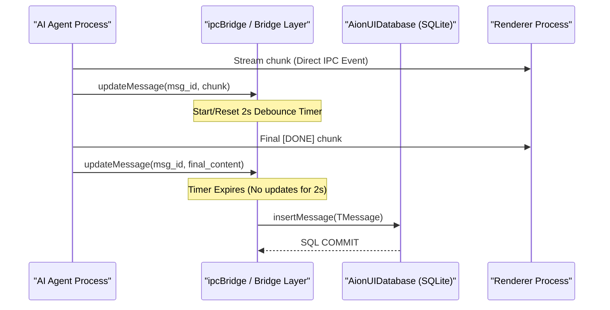

# Database System

<details>
<summary>Relevant source files</summary>

The following files were used as context for generating this wiki page:

- [src/process/agent/openclaw/OpenClawGatewayConnection.ts](src/process/agent/openclaw/OpenClawGatewayConnection.ts)
- [src/process/agent/openclaw/types.ts](src/process/agent/openclaw/types.ts)
- [src/process/agent/remote/types.ts](src/process/agent/remote/types.ts)
- [src/process/bridge/databaseBridge.ts](src/process/bridge/databaseBridge.ts)
- [src/process/bridge/extensionsBridge.ts](src/process/bridge/extensionsBridge.ts)
- [src/process/bridge/migrationUtils.ts](src/process/bridge/migrationUtils.ts)
- [src/process/bridge/remoteAgentBridge.ts](src/process/bridge/remoteAgentBridge.ts)
- [src/process/bridge/services/ActivitySnapshotBuilder.ts](src/process/bridge/services/ActivitySnapshotBuilder.ts)
- [src/process/services/ConversationServiceImpl.ts](src/process/services/ConversationServiceImpl.ts)
- [src/process/services/IConversationService.ts](src/process/services/IConversationService.ts)
- [src/process/services/cron/SkillSuggestWatcher.ts](src/process/services/cron/SkillSuggestWatcher.ts)
- [src/process/services/database/index.ts](src/process/services/database/index.ts)
- [src/process/services/database/migrations.ts](src/process/services/database/migrations.ts)
- [src/process/services/database/schema.ts](src/process/services/database/schema.ts)
- [src/process/task/agentTypes.ts](src/process/task/agentTypes.ts)
- [tests/unit/ConversationServiceImpl.test.ts](tests/unit/ConversationServiceImpl.test.ts)
- [tests/unit/RemoteAgentCore.test.ts](tests/unit/RemoteAgentCore.test.ts)
- [tests/unit/RemoteAgentManager.test.ts](tests/unit/RemoteAgentManager.test.ts)
- [tests/unit/SqliteConversationRepository.test.ts](tests/unit/SqliteConversationRepository.test.ts)
- [tests/unit/apiRoutesUploadWorkspace.test.ts](tests/unit/apiRoutesUploadWorkspace.test.ts)
- [tests/unit/databaseBridge.test.ts](tests/unit/databaseBridge.test.ts)
- [tests/unit/extensionsBridge.test.ts](tests/unit/extensionsBridge.test.ts)
- [tests/unit/normalizeWsUrl.test.ts](tests/unit/normalizeWsUrl.test.ts)
- [tests/unit/process/services/database/index.test.ts](tests/unit/process/services/database/index.test.ts)
- [tests/unit/remoteAgentBridge.test.ts](tests/unit/remoteAgentBridge.test.ts)
- [tests/unit/schema.test.ts](tests/unit/schema.test.ts)
- [tests/unit/usePresetAssistantInfo.dom.test.ts](tests/unit/usePresetAssistantInfo.dom.test.ts)

</details>


This document explains the SQLite-based persistence layer that stores conversation metadata, message history, and system-wide entities. The database system provides durable storage for all chat interactions and implements a message batching mechanism to handle high-throughput streaming responses without degrading performance.

---

## Overview

AionUi uses SQLite as its primary database for persisting conversations and messages. The database is managed in the main process via the `AionUIDatabase` class and exposed to the renderer through the `databaseBridge`.

| Component | Role |
|-----------|------|
| `AionUIDatabase` | Main database class managing connection, recovery, and schema initialization. [src/process/services/database/index.ts:90]() |
| `initSchema` | Defines the SQL tables, indexes, and constraints. [src/process/services/database/schema.ts:12]() |
| `SqliteConversationRepository` | Implementation of the data access layer for chat entities. [src/process/services/database/SqliteConversationRepository.ts]() |
| `databaseBridge` | IPC provider that maps renderer requests to repository calls. [src/process/bridge/databaseBridge.ts:13-84]() |
| `migrationUtils` | Utilities for "lazy" migration of conversations from JSON files to SQLite. [src/process/bridge/migrationUtils.ts:15-52]() |

**Sources:** [src/process/services/database/index.ts:90-180](), [src/process/bridge/databaseBridge.ts:1-84]()

---

## Database Schema and Entities

The database structure bridges the gap between the "Natural Language Space" (Conversations, Messages) and the "Code Entity Space" (SQL Tables, TypeScript Interfaces).

### Entity Mapping

```mermaid
classDiagram
    class "TChatConversation (Code)" as TChatConversation {
        +string id
        +string type
        +string name
        +number createTime
        +number modifyTime
        +json extra
    }
    class "TMessage (Code)" as TMessage {
        +string id
        +string conversation_id
        +string role
        +json content
        +number createdAt
    }
    class "conversations (Table)" as conversations {
        +TEXT id (PK)
        +TEXT user_id (FK)
        +TEXT name
        +TEXT type
        +TEXT extra
        +INTEGER created_at
    }
    class "messages (Table)" as messages {
        +TEXT id (PK)
        +TEXT conversation_id (FK)
        +TEXT type
        +TEXT content
        +INTEGER created_at
    }

    TChatConversation ..> conversations : persists to
    TMessage ..> messages : persists to
    conversations "1" -- "*" messages : foreign key
```
**Sources:** [src/process/services/database/schema.ts:43-76](), [src/process/services/database/types.ts]()

### Core Tables
1.  **`users`**: Manages account identities, password hashes, and `jwt_secret`. [src/process/services/database/schema.ts:28-38]()
2.  **`conversations`**: Stores session metadata. The `extra` field is a JSON string containing agent-specific configurations like `workspace` paths or `enabledSkills`. [src/process/services/database/schema.ts:43-54]()
3.  **`messages`**: Stores the dialogue history. It includes a `position` field (`left`, `right`, `center`, `pop`) and `status` (`finish`, `pending`, `error`, `work`). [src/process/services/database/schema.ts:61-71]()
4.  **`teams` & `mailbox`**: Support the Multi-Agent Collaboration (Team Mode) by tracking shared tasks and inter-agent communication. [src/process/services/database/schema.ts:79-106]()

---

## Message Batching Mechanism

To prevent database thrashing during rapid AI streaming (where chunks may arrive every few milliseconds), AionUi employs a **2-second debounce mechanism** via the `ConversationManageWithDB` logic (integrated into the message transformation pipeline).

### Data Flow for Streaming Persistence



1.  **Immediate UI Update**: Streaming events bypass the database initially to ensure zero-latency UI rendering.
2.  **Debounced Write**: The bridge layer buffers message updates. The actual SQL `INSERT` or `UPDATE` triggers only after the stream pauses for 2 seconds or the session completes. [src/process/bridge/databaseBridge.ts]()

**Sources:** [src/process/services/database/schema.ts:18-21](), [src/process/bridge/databaseBridge.ts]()

---

## Database Lifecycle and Recovery

The `AionUIDatabase` includes robust initialization and corruption recovery logic to handle native module issues or file system errors.

### Initialization Process
1.  **Driver Creation**: Attempts to open the SQLite file using `better-sqlite3`. [src/process/services/database/index.ts:110]()
2.  **Pragma Configuration**: Enables `foreign_keys`, sets `busy_timeout = 5000`, and attempts to enable `WAL` (Write-Ahead Logging) mode for performance. [src/process/services/database/schema.ts:14-21]()
3.  **Migration Check**: Compares the `user_version` pragma against `CURRENT_DB_VERSION` (v22). [src/process/services/database/schema.ts:133-154]()
4.  **Corruption Recovery**: If initialization fails (except for native module mismatches), the system renames the corrupted file to a `.backup` and starts fresh to prevent application crashes. [src/process/services/database/index.ts:146-161]()

**Sources:** [src/process/services/database/index.ts:103-180](), [src/process/services/database/schema.ts:12-26]()

---

## Lazy Migration Strategy

AionUi performs a "lazy" migration from the legacy `ProcessChat` (file-based) system to the SQLite database.

### Migration Logic
When `getUserConversations` is called via IPC:
1.  Records are fetched from the SQLite `conversations` table. [src/process/bridge/databaseBridge.ts:30-31]()
2.  The system checks legacy file storage (`ProcessChat.get('chat.history')`). [src/process/bridge/databaseBridge.ts:36]()
3.  Any conversations in files but *not* in the database are filtered. [src/process/bridge/databaseBridge.ts:48]()
4.  These "file-only" sessions are migrated in the background via `migrateConversationToDatabase`. [src/process/bridge/databaseBridge.ts:53]()
5.  The utility creates the SQLite record and performs a batch insertion of all associated historical messages from the file system. [src/process/bridge/migrationUtils.ts:28-44]()

**Sources:** [src/process/bridge/databaseBridge.ts:27-66](), [src/process/bridge/migrationUtils.ts:15-52]()

---

## Repository Implementation

The `SqliteConversationRepository` implements the `IConversationRepository` interface, providing a clean abstraction for the `ConversationServiceImpl`.

### Key Methods
| Method | Description |
|--------|-------------|
| `getMessages` | Paginated retrieval of `TMessage` rows. [src/process/bridge/databaseBridge.ts:18]() |
| `getUserConversations` | Fetches sessions for a user, sorted by `updated_at`. [src/process/services/database/schema.ts:58]() |
| `searchMessages` | Uses `LIKE` queries with escaped patterns to search message content. [src/process/services/database/index.ts:53-84]() |
| `createWithMigration` | Handles cloning a conversation and its messages, including associated `cronJob` migration. [src/process/services/ConversationServiceImpl.ts:58-85]() |

**Sources:** [src/process/services/database/SqliteConversationRepository.ts](), [src/process/services/ConversationServiceImpl.ts:25-122]()