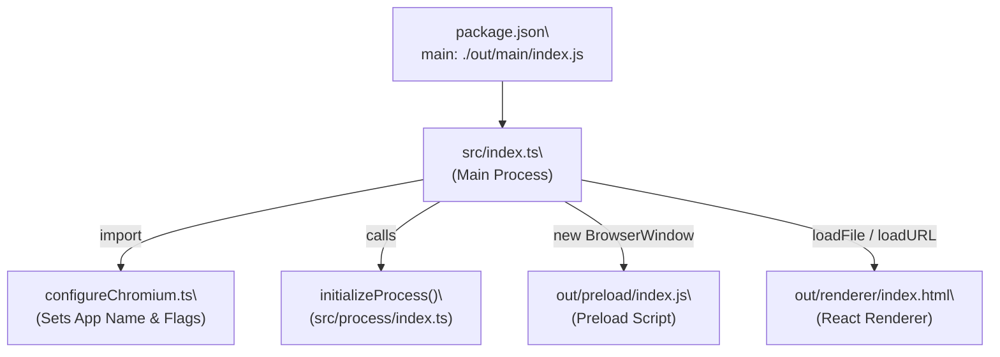
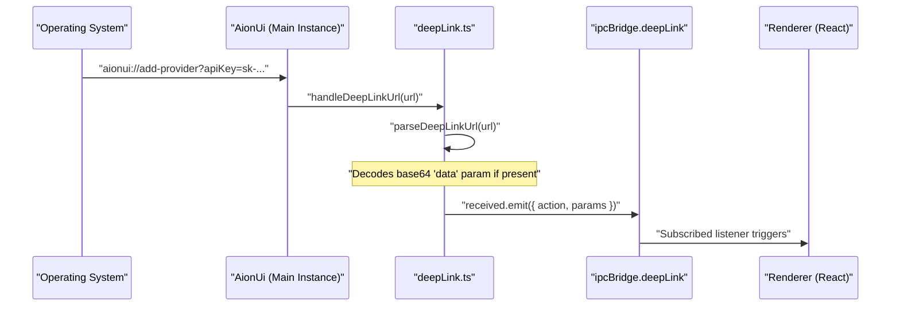
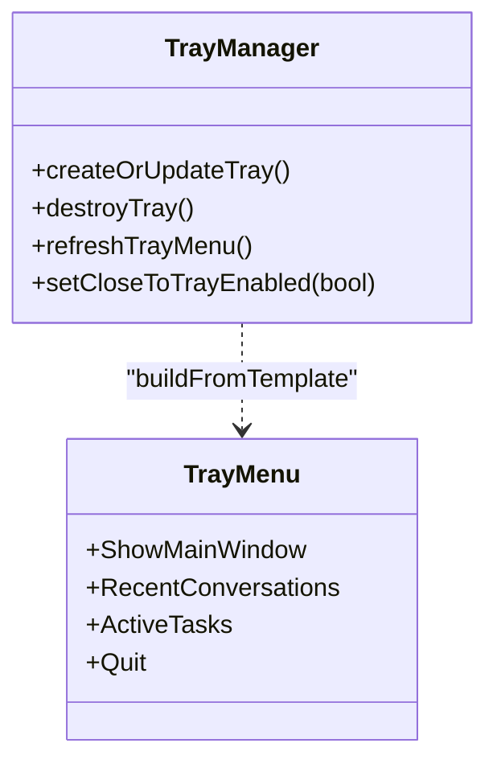
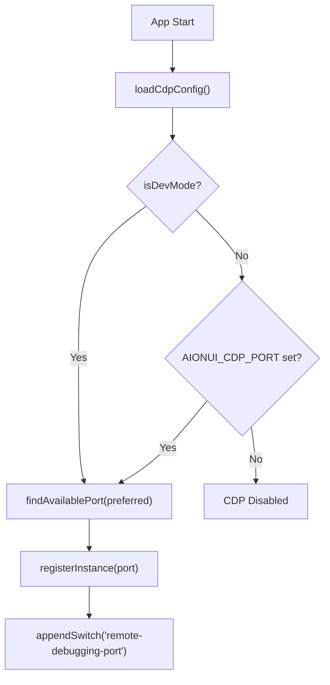

# Electron Framework

Relevant source files

The following files were used as context for generating this wiki page:

- [.github/workflows/build-and-release.yml](.github/workflows/build-and-release.yml)
- [bun.lock](bun.lock)
- [electron-builder.yml](electron-builder.yml)
- [package.json](package.json)
- [scripts/README.md](scripts/README.md)
- [scripts/afterPack.js](scripts/afterPack.js)
- [scripts/afterSign.js](scripts/afterSign.js)
- [scripts/build-with-builder.js](scripts/build-with-builder.js)
- [scripts/rebuildNativeModules.js](scripts/rebuildNativeModules.js)
- [src/common/platform/ElectronPlatformServices.ts](src/common/platform/ElectronPlatformServices.ts)
- [src/common/platform/IPlatformServices.ts](src/common/platform/IPlatformServices.ts)
- [src/common/platform/NodePlatformServices.ts](src/common/platform/NodePlatformServices.ts)
- [src/common/platform/index.ts](src/common/platform/index.ts)
- [src/index.ts](src/index.ts)
- [src/process/index.ts](src/process/index.ts)
- [src/process/utils/configureChromium.ts](src/process/utils/configureChromium.ts)
- [src/process/utils/initBridgeStandalone.ts](src/process/utils/initBridgeStandalone.ts)
- [tests/unit/deepLink.test.ts](tests/unit/deepLink.test.ts)
- [tests/unit/platform/platformRegistry.test.ts](tests/unit/platform/platformRegistry.test.ts)
- [tests/unit/process/utils/configureChromium.test.ts](tests/unit/process/utils/configureChromium.test.ts)
- [tests/unit/tray.test.ts](tests/unit/tray.test.ts)
- [tests/unit/webuiConfig.test.ts](tests/unit/webuiConfig.test.ts)

This page explains how AionUi utilizes the Electron framework to provide a cross-platform desktop experience, including window management, deep linking protocols, system tray integration, and Chrome DevTools Protocol (CDP) configuration.

---

## Process Architecture

AionUi follows the standard Electron process model but introduces a specialized initialization sequence in `src/index.ts` to handle environment isolation and Chromium flag configuration before the app is fully ready.

**App Entry Point: Initialization Flow**

| Component | Source | Role |
|---|---|---|
| **Environment Setup** | [src/process/utils/configureChromium.ts:14-24]() | Isolates `userData` for development (`AionUi-Dev`) vs production. |
| **Main Process** | [src/index.ts:17-60]() | Manages app lifecycle, native APIs, and single-instance locks. |
| **Process Init** | [src/process/index.ts:25-49]() | Asynchronously initializes storage, extensions, and channel managers. |

Sources: [src/index.ts:7-25](), [src/process/utils/configureChromium.ts:14-24](), [src/process/index.ts:25-49]()

---

## Application Lifecycle & Window Management

The application lifecycle is managed in `src/index.ts`. AionUi supports a single-instance lock to ensure that protocol URLs or second launches are piped back to the primary instance.

### Single Instance & Deep Linking
AionUi registers the `aionui://` protocol scheme. When a second instance is started (e.g., by clicking a deep link), the `second-instance` event captures the URL and passes it to `handleDeepLinkUrl`.

**Deep Link Data Flow**

| Function | File | Description |
|---|---|---|
| `handleDeepLinkUrl` | [src/process/utils/deepLink.ts:101-119]() | Routes URLs to the active window or queues them if no window exists. |
| `parseDeepLinkUrl` | [src/process/utils/deepLink.ts:54-99]() | Parses the action and query parameters, including base64 `data` payloads. |
| `requestSingleInstanceLock` | [src/index.ts:70-74]() | Ensures only one instance of the application runs. |

Sources: [src/index.ts:68-97](), [src/process/utils/deepLink.ts:54-119]()

---

## System Tray Integration

The system tray provides quick access to active tasks and recent conversations. It is managed by `src/process/utils/tray.ts`.

**Tray Implementation Entities**

- **Close to Tray**: Controlled via `getCloseToTrayEnabled()`. If enabled, closing the main window hides it instead of quitting [src/process/utils/tray.ts:257-270]().
- **Dynamic Menu**: The menu is refreshed via `refreshTrayMenu()` to show current AI worker tasks from `workerTaskManager` and recent chat history from `getDatabase()` [src/process/utils/tray.ts:121-145]().

Sources: [src/process/utils/tray.ts:93-270](), [tests/unit/tray.test.ts:163-232]()

---

## Chrome DevTools Protocol (CDP)

AionUi can expose a CDP remote debugging port. This allows external tools (like `chrome-devtools-mcp`) to connect to and automate the Electron instance.

### Configuration and Multi-Instance Support
CDP settings are persisted in `userData/cdp.config.json`. To prevent port conflicts when running multiple instances (e.g., Dev and Prod), AionUi maintains a registry file at `~/.aionui-cdp-registry.json`.

| Feature | Logic |
|---|---|
| **Port Selection** | Scans `9230-9250`. If the preferred port is taken in the registry, it picks the next available [src/process/utils/configureChromium.ts:150-173](). |
| **Registry Pruning** | On startup, it checks the PID of entries in the registry; if the process is dead, the entry is removed [src/process/utils/configureChromium.ts:140-147](). |
| **Environment Toggle** | Enabled by default in dev mode; in production, it requires the `AIONUI_CDP_PORT` environment variable or explicit user config [src/process/utils/configureChromium.ts:223-235](). |

**CDP Configuration Logic**

Sources: [src/process/utils/configureChromium.ts:53-187](), [tests/unit/process/utils/configureChromium.test.ts:142-189]()

---

## Custom Asset Protocol

AionUi registers a privileged protocol `aion-asset://` to handle local extension resources.

- **Purpose**: Bypasses browser security policies that prevent `http://localhost` (the renderer) from loading local `file://` URLs.
- **Registration**: Occurs before `app.whenReady()` to ensure the scheme is recognized as secure and CORS-enabled.

Sources: [src/index.ts:140-154](), [src/process/index.ts:25-30]()

---

## Build and Native Modules

AionUi uses a complex build pipeline to manage native dependencies like `better-sqlite3`, `bcrypt`, and `node-pty`.

### Native Module Rebuilding
Because Electron uses a different ABI than Node.js, native modules must be rebuilt. AionUi implements a unified utility in `scripts/rebuildNativeModules.js` that handles cross-architecture builds (e.g., building arm64 binaries on an x64 machine).

- **afterPack Hook**: The `scripts/afterPack.js` script triggers during the packaging phase to ensure the correct architecture-specific binaries are included in the ASAR [scripts/afterPack.js:17-40]().
- **Incremental Builds**: The `scripts/build-with-builder.js` script uses MD5 hashing of source files to skip unnecessary Vite compilations [scripts/build-with-builder.js:46-87]().

Sources: [scripts/rebuildNativeModules.js:69-82](), [scripts/afterPack.js:17-40](), [scripts/build-with-builder.js:46-87](), [electron-builder.yml:193-210]()