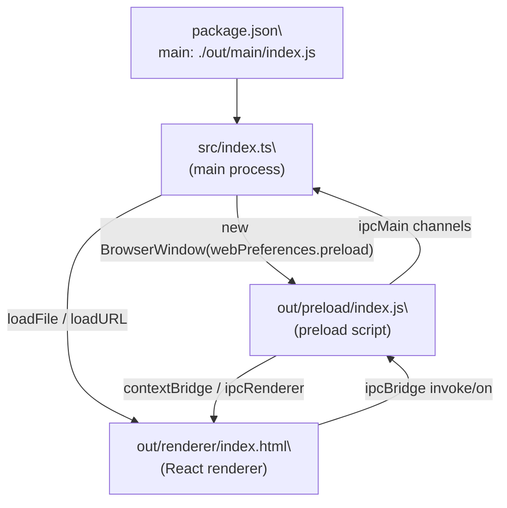
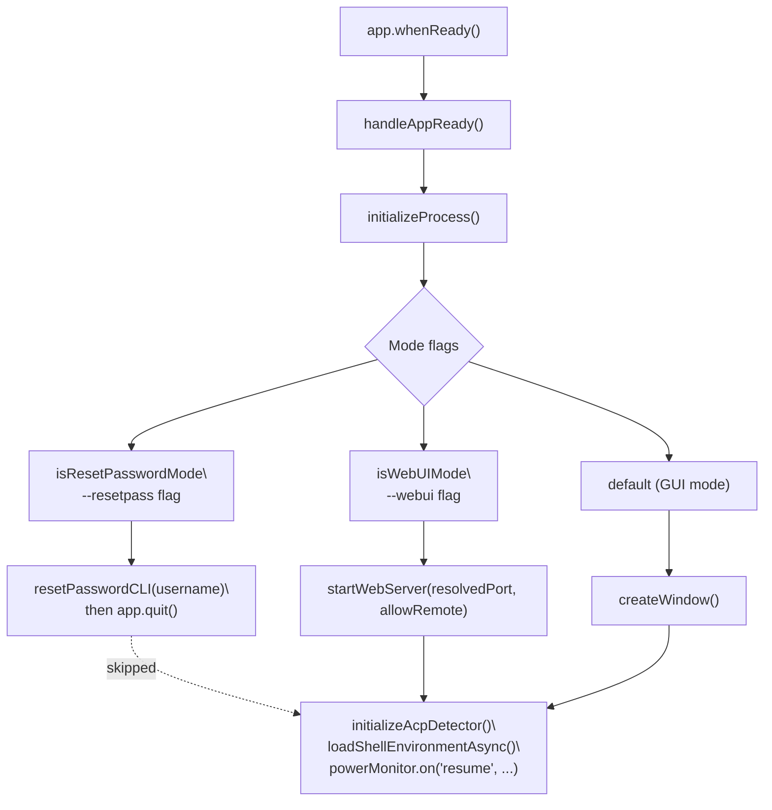
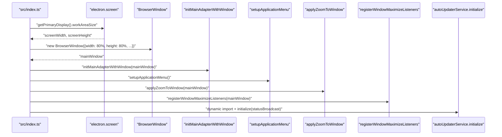
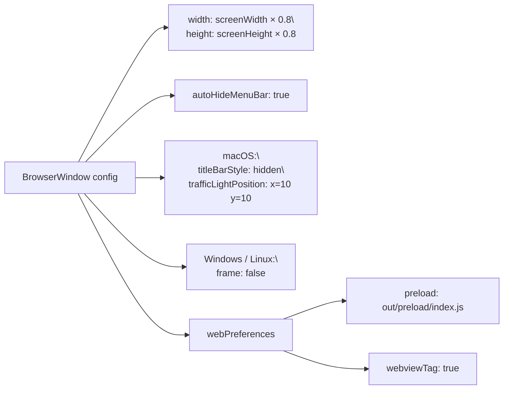
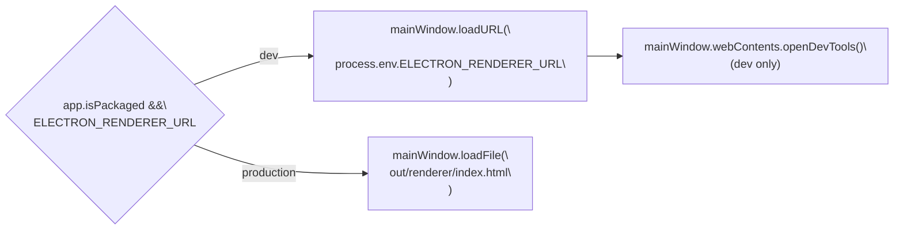

# Electron Framework

<details>
<summary>Relevant source files</summary>

The following files were used as context for generating this wiki page:

- [.github/workflows/\_build-reusable.yml](.github/workflows/_build-reusable.yml)
- [.github/workflows/build-manual.yml](.github/workflows/build-manual.yml)
- [bun.lock](bun.lock)
- [src/index.ts](src/index.ts)
- [src/utils/configureChromium.ts](src/utils/configureChromium.ts)
- [tests/integration/autoUpdate.integration.test.ts](tests/integration/autoUpdate.integration.test.ts)
- [tests/unit/autoUpdaterService.test.ts](tests/unit/autoUpdaterService.test.ts)
- [tests/unit/test_acp_connection_disconnect.ts](tests/unit/test_acp_connection_disconnect.ts)
- [vitest.config.ts](vitest.config.ts)

</details>

This page covers how AionUi uses Electron: the main process entry point, window creation, `BrowserWindow` configuration, app lifecycle events, and the split between the main and renderer processes. For information about inter-process communication between the main and renderer, see [3.3](#3.3). For the WebUI server that replaces the window in headless mode, see [3.5](#3.5). For build packaging configuration, see [11](#11).

---

## Process Architecture

AionUi follows the standard Electron three-process model.

**App Entry Point: BrowserWindow and Process Architecture**



| Layer          | Source          | Output                    | Role                                      |
| -------------- | --------------- | ------------------------- | ----------------------------------------- |
| Main process   | `src/index.ts`  | `out/main/index.js`       | App lifecycle, native APIs, IPC providers |
| Preload script | `src/preload/`  | `out/preload/index.js`    | Secure bridge between renderer and main   |
| Renderer       | `src/renderer/` | `out/renderer/index.html` | React UI, runs in Chromium                |

Sources: [src/index.ts:1-20](), [package.json:6-6](), [electron-builder.yml:13-17]()

---

## Application Lifecycle

The lifecycle is controlled entirely from `src/index.ts`. The central async function `handleAppReady` runs after `app.whenReady()` resolves and forks into three modes based on CLI flags.

**`handleAppReady` Flow with Code Entities**



Sources: [src/index.ts:268-340]()

### CLI Flag Parsing

Two helpers parse flags from both `process.argv` and `app.commandLine`:

- `hasSwitch(flag)` — checks for `--flag` in argv or via `app.commandLine.hasSwitch`
- `getSwitchValue(flag)` — reads `--flag=value` or `--flag value` form

[src/index.ts:75-93]()

The three mode flags derived from these helpers:

| Variable              | Flag          | Effect                                       |
| --------------------- | ------------- | -------------------------------------------- |
| `isWebUIMode`         | `--webui`     | Starts Express+WS server instead of a window |
| `isRemoteMode`        | `--remote`    | Binds server to `0.0.0.0`                    |
| `isResetPasswordMode` | `--resetpass` | Runs `resetPasswordCLI` then quits           |

Sources: [src/index.ts:164-166]()

---

## Window Creation

`createWindow()` is called only in standard GUI mode. It creates a single `BrowserWindow` named `mainWindow`.

**`createWindow()` — Key Calls and Side Effects**



Sources: [src/index.ts:170-256]()

### `BrowserWindow` Configuration



| Property                | Value                                            | Reason                                                 |
| ----------------------- | ------------------------------------------------ | ------------------------------------------------------ |
| `width` / `height`      | 80% of `screen.getPrimaryDisplay().workAreaSize` | Comfortable default on high-DPI displays               |
| `autoHideMenuBar`       | `true`                                           | Cleaner look; menu accessible via Alt key              |
| `titleBarStyle` (macOS) | `'hidden'`                                       | Custom title bar with traffic lights at `{x:10, y:10}` |
| `frame` (Windows/Linux) | `false`                                          | Custom frameless window                                |
| `webviewTag`            | `true`                                           | Required for the HTML preview panel                    |
| `preload`               | `path.join(__dirname, '../preload/index.js')`    | Exposes `ipcBridge` safely to renderer                 |

Sources: [src/index.ts:197-214]()

---

## URL Loading — Development vs Production

After the window is created, the renderer content is loaded differently depending on whether the app is packaged:



- In development, `electron-vite dev` injects `ELECTRON_RENDERER_URL` pointing to the Vite HMR server.
- In production, `loadFile` reads from the built `out/renderer/index.html`.
- DevTools are opened automatically only when `!app.isPackaged`.

Sources: [src/index.ts:241-256]()

---

## App Lifecycle Events

Three global `app` events are registered in `src/index.ts`:

| Event               | Handler behavior                                                                           |
| ------------------- | ------------------------------------------------------------------------------------------ |
| `window-all-closed` | Calls `app.quit()` on non-macOS, unless `isWebUIMode` is active (server must keep running) |
| `activate`          | Re-creates the window on macOS if no windows are open and not in WebUI mode                |
| `before-quit`       | Calls `WorkerManage.clear()` to stop AI workers; calls `getChannelManager().shutdown()`    |

[src/index.ts:354-380]()

A `powerMonitor.on('resume', ...)` handler is also registered after `handleAppReady` to trigger cron recovery when the system wakes from sleep. See [4.8](#4.8) for cron details.

---

## Global Error Handling

Two Node.js process-level handlers are registered to prevent Electron from showing its default crash dialog:

- `process.on('uncaughtException', ...)` — suppresses the Electron error dialog in production
- `process.on('unhandledRejection', ...)` — catches unhandled Promise rejections

[src/index.ts:60-73]()

---

## PATH Correction (macOS / Linux)

GUI apps launched from a dock or file manager on macOS and Linux inherit a limited `PATH` that excludes shell-initialized entries (`.bashrc`, `.zshrc`). AionUi corrects this with two steps:

1. `fixPath()` from the `fix-path` package — sourced from the login shell
2. Manual NVM path injection — reads `NVM_DIR/versions/node/*/bin` and prepends missing paths

This ensures that AI agent subprocesses spawned from the main process (e.g., `gemini`, `claude`) can be found on `PATH`.

[src/index.ts:28-49]()

---

## Windows Installer Startup Handling

```ts
import electronSquirrelStartup from 'electron-squirrel-startup'
if (electronSquirrelStartup) {
  app.quit()
}
```

`electron-squirrel-startup` handles Squirrel events during Windows installation and uninstallation (creating/removing shortcuts). When these events are active, the app quits immediately without initializing anything.

[src/index.ts:52-54]()

---

## Auto-Updater Initialization

The auto-updater is initialized inside `createWindow()` using a dynamic import to avoid loading it until a window exists. The sequence:

1. Dynamic imports of `autoUpdaterService` and `createAutoUpdateStatusBroadcast`
2. `createAutoUpdateStatusBroadcast()` creates a pure emitter callback that calls `ipcBridge.autoUpdate.status.emit`
3. `autoUpdaterService.initialize(statusBroadcast)` wires the callback
4. After a 3-second delay, `autoUpdaterService.checkForUpdatesAndNotify()` runs

The `AutoUpdaterService` class (in `src/process/services/autoUpdaterService.ts`) wraps `electron-updater`'s `autoUpdater` singleton. `autoDownload` is disabled so the user explicitly controls when the download begins.

For full update UI and IPC detail, see [14](#14).

Sources: [src/index.ts:222-236](), [src/process/services/autoUpdaterService.ts:42-51]()

---

## IPC Bridge Registration at Window Level

One IPC provider is registered directly in `src/index.ts` rather than in the `process/bridge` directory — the `openDevTools` provider:

```
ipcBridge.application.openDevTools.provider(() => {
  mainWindow.webContents.openDevTools();
  return Promise.resolve();
});
```

This is done here rather than in a bridge module because it needs direct access to the `mainWindow` reference. All other IPC providers are initialized inside `initializeProcess()`. See [3.3](#3.3) for the full ipcBridge reference.

[src/index.ts:261-266]()

---

## Packaging Configuration Summary

`electron-builder.yml` controls how the compiled output is packaged into distributable installers.

| Setting              | Value                                          |
| -------------------- | ---------------------------------------------- |
| `appId`              | `com.aionui.app`                               |
| `productName`        | `AionUi`                                       |
| `directories.output` | `out/`                                         |
| `asar.smartUnpack`   | `true`                                         |
| macOS targets        | `dmg`, `zip`                                   |
| Windows targets      | `nsis`, `zip`                                  |
| Linux targets        | `deb`, `AppImage` (x64 + arm64)                |
| `afterPack` hook     | `scripts/afterPack.js` (native module rebuild) |
| `afterSign` hook     | `scripts/afterSign.js` (macOS notarization)    |
| `publish.provider`   | `github` (iOfficeAI/AionUi)                    |

Native modules (`better-sqlite3`, `bcrypt`, `node-pty`) are listed under `asarUnpack` so they remain on disk as real files instead of being embedded in the asar archive — required because they are `.node` binaries that must be loaded by path.

Sources: [electron-builder.yml:1-210]()
