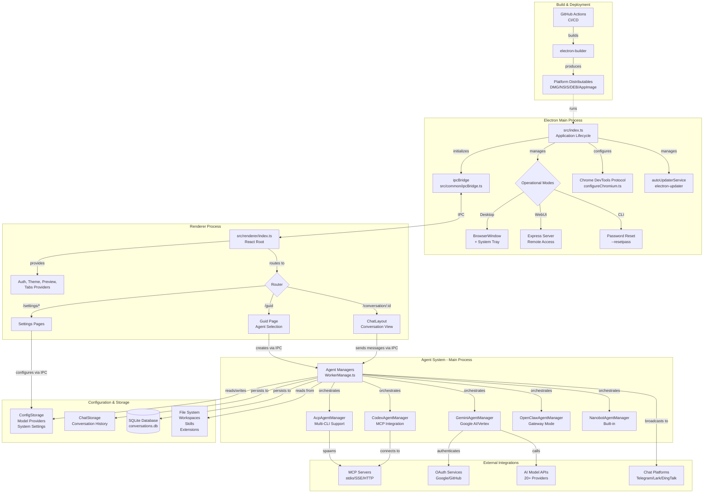
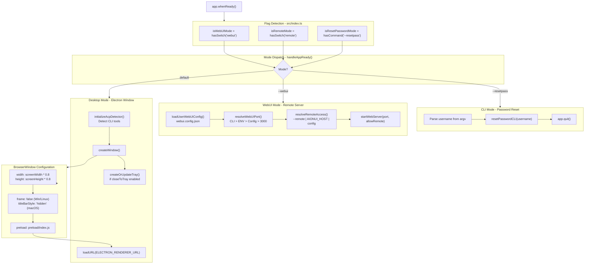
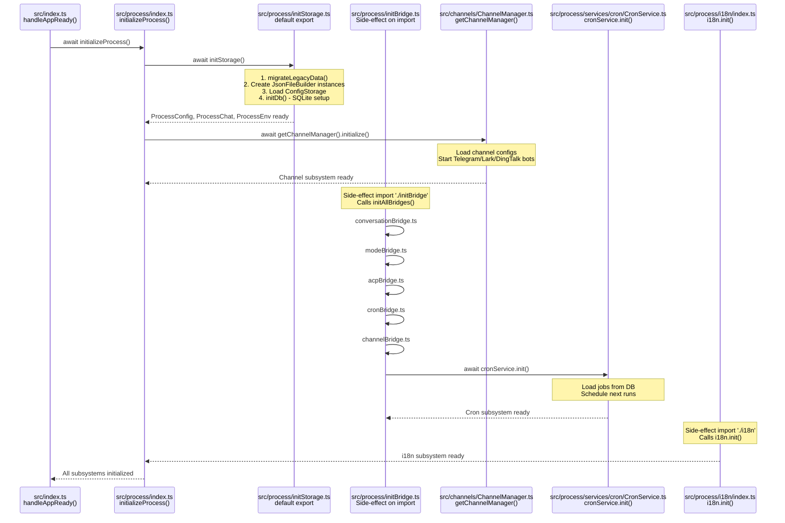
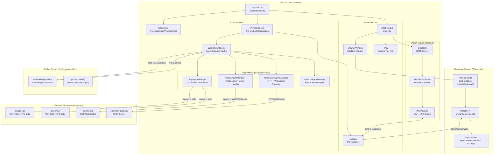
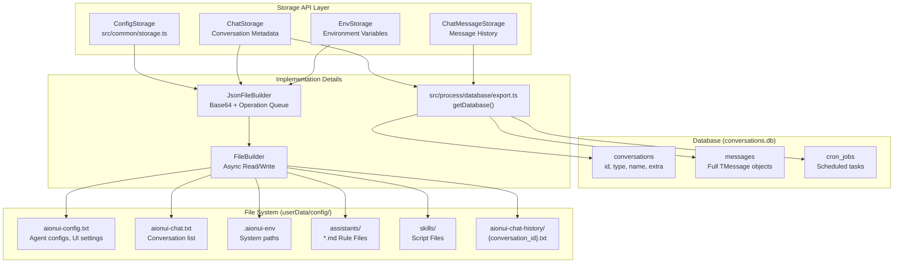
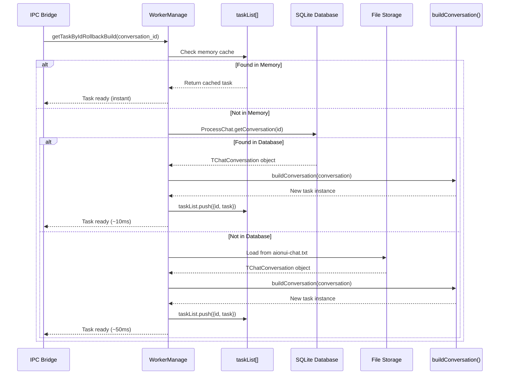
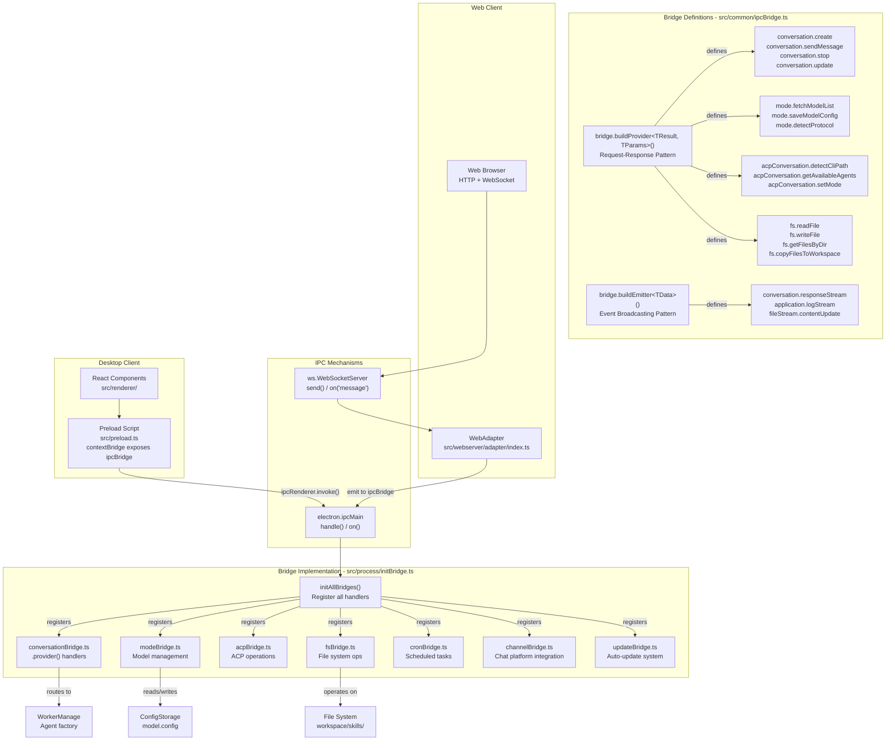
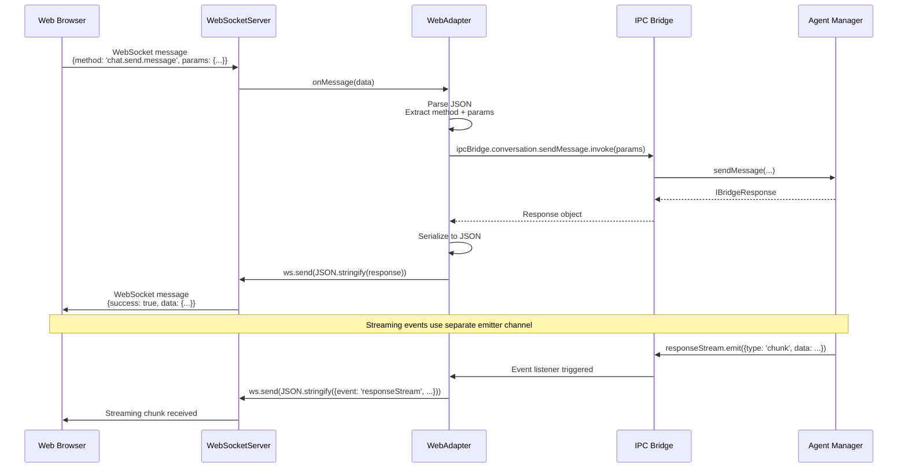
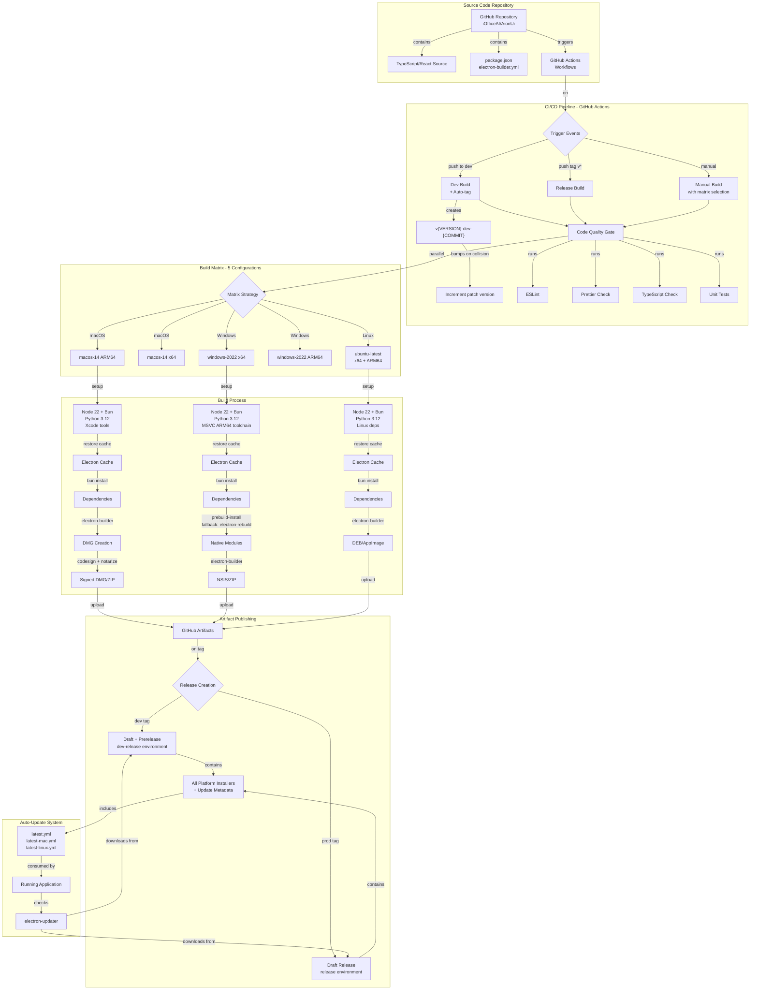

# Architecture

<details>
<summary>Relevant source files</summary>

The following files were used as context for generating this wiki page:

- [.github/workflows/\_build-reusable.yml](.github/workflows/_build-reusable.yml)
- [.github/workflows/build-manual.yml](.github/workflows/build-manual.yml)
- [bun.lock](bun.lock)
- [src/common/ipcBridge.ts](src/common/ipcBridge.ts)
- [src/common/storage.ts](src/common/storage.ts)
- [src/index.ts](src/index.ts)
- [src/renderer/pages/guid/index.tsx](src/renderer/pages/guid/index.tsx)
- [src/utils/configureChromium.ts](src/utils/configureChromium.ts)
- [tests/integration/autoUpdate.integration.test.ts](tests/integration/autoUpdate.integration.test.ts)
- [tests/unit/autoUpdaterService.test.ts](tests/unit/autoUpdaterService.test.ts)
- [tests/unit/test_acp_connection_disconnect.ts](tests/unit/test_acp_connection_disconnect.ts)
- [vitest.config.ts](vitest.config.ts)

</details>

## Purpose and Scope

This document describes the high-level architecture of AionUi, including its component relationships, operational modes, process structure, and core design patterns. It provides a technical overview of how the major subsystems interact to deliver a unified interface for multiple AI agent backends.

For detailed information about specific subsystems:

- Application startup modes and flag handling: see [Application Modes](#3.1)
- Electron process lifecycle and window management: see [Electron Framework](#3.2)
- IPC method registration and type-safe communication: see [Inter-Process Communication](#3.3)
- File builders, database integration, and persistence: see [Storage System](#3.4)
- Express server, WebSocket, and remote access: see [WebUI Server Architecture](#3.5)

---

## System Overview

AionUi is a cross-platform AI agent interface built on Electron. The application supports five AI agent types (Gemini, ACP, Codex, OpenClaw, Nanobot) and can operate in three modes: Desktop (BrowserWindow UI), WebUI (remote Express server), or CLI (password reset utility).

**Overall System Architecture**



**Key Architectural Characteristics:**

- **Multi-Process Design**: Main process handles agents/storage, renderer process handles UI, worker processes isolate Gemini agents
- **Unified IPC Bridge**: All communication (Desktop and WebUI) routes through `ipcBridge` defined in [src/common/ipcBridge.ts:1-603]()
- **Agent Polymorphism**: Five agent types share common interface via `AgentBaseTask` but use different connection mechanisms (worker fork, stdio, WebSocket)
- **Hybrid Storage**: File-based JSON for configuration, SQLite for message history, file system for workspace data
- **Three Operational Modes**: Desktop (Electron window), WebUI (Express server with WebSocket adapter), CLI (password utilities)

**Sources:** [src/index.ts:1-746](), [src/common/ipcBridge.ts:1-603](), [src/process/index.ts:1-31](), [src/process/WorkerManage.ts:1-150](), [src/utils/configureChromium.ts:1-365]()

---

## Application Entry Points and Routing

The `src/index.ts` entry point determines the operational mode via command-line flag inspection before creating any windows. This enables the same binary to function as a desktop app, headless web server, or CLI utility.

**Application Mode Routing Flow**



**Configuration Priority Chain**

The WebUI server resolves configuration from multiple sources in strict priority order:

| Priority    | Source                | Code Reference               | Example                           |
| ----------- | --------------------- | ---------------------------- | --------------------------------- |
| 1 (Highest) | CLI Flags             | `getSwitchValue('port')`     | `--port=8080`                     |
| 2           | Environment Variables | `process.env.AIONUI_PORT`    | `AIONUI_PORT=8080`                |
| 3           | Config File           | `loadUserWebUIConfig()`      | `webui.config.json: {port: 8080}` |
| 4 (Lowest)  | Default Constant      | `SERVER_CONFIG.DEFAULT_PORT` | `3000`                            |

**Sources:** [src/index.ts:256-258](), [src/index.ts:514-665](), [src/index.ts:539-556](), [src/index.ts:556-618](), [src/index.ts:353-472](), [src/index.ts:187-254]()

### Command-Line Flag Priority Chain

AionUi implements a multi-tier configuration priority system for WebUI mode:

| Priority    | Source                | Example             | Implementation               |
| ----------- | --------------------- | ------------------- | ---------------------------- |
| 1 (Highest) | CLI Flags             | `--port=8080`       | `getSwitchValue('port')`     |
| 2           | Environment Variables | `AIONUI_PORT=8080`  | `process.env.AIONUI_PORT`    |
| 3           | Config File           | `webui.config.json` | `loadUserWebUIConfig()`      |
| 4 (Lowest)  | Hard-coded Defaults   | `3000`              | `SERVER_CONFIG.DEFAULT_PORT` |

This allows flexible deployment: developers can override via CLI during testing, Docker containers can use environment variables, and production deployments can use persistent config files.

**Sources:** [src/index.ts:107-149](), [src/index.ts:159-166]()

---

## Core Subsystem Initialization

The `initializeProcess()` function in [src/process/index.ts:20-30]() orchestrates bootstrap of storage, IPC bridges, internationalization, and the channel subsystem in dependency-order.

**Initialization Sequence Diagram**



**Storage System Bootstrap**

The storage system initializes in three phases within [src/process/initStorage.ts:616-900]():

1. **Legacy Migration** ([src/process/initStorage.ts:43-88]()): Checks `temp/` for old data and migrates to `userData/config/` if new directory is empty
2. **File Builder Setup** ([src/process/initStorage.ts:146-246]()): Creates `JsonFileBuilder` instances for each storage domain (config, chat, env)
3. **Database Initialization** ([src/process/initStorage.ts:621-647]()): Calls `initDb()` which creates `conversations.db` with tables for conversations, messages, and cron jobs

**Sources:** [src/process/index.ts:20-30](), [src/process/initStorage.ts:616-900](), [src/process/initBridge.ts:7-19](), [src/process/i18n/index.ts:1-71](), [src/channels/ChannelManager.ts:1-200](), [src/process/services/cron/CronService.ts:1-300]()

### Storage System Bootstrap

The storage system initializes in three phases:

1. **Legacy Migration**: [src/process/initStorage.ts:43-88]() checks if old data exists in `temp/` and migrates it to `userData/config/` if the new directory is empty.

2. **File Builder Setup**: [src/process/initStorage.ts:146-246]() creates `JsonFileBuilder` instances for each storage domain (`aionui-config.txt`, `aionui-chat.txt`, etc). These builders use base64 encoding and operation queuing for thread-safe access.

3. **Database Initialization**: [src/process/initStorage.ts:621-647]() calls `initDb()` which creates the SQLite `conversations.db` with tables for conversations, messages, and cron jobs.

**Sources:** [src/process/initStorage.ts:616-900]()

---

## Process Architecture

AionUi uses Electron's multi-process architecture with additional worker processes for Gemini agent isolation. All UI and storage operations are separated across main, renderer, and worker processes.

**Multi-Process Architecture Diagram**



**Why Gemini Uses a Worker Process**

The Gemini agent is isolated in a forked worker process ([src/worker/gemini.ts:1-200]()) for these architectural reasons:

| Benefit                       | Implementation                                                                                 |
| ----------------------------- | ---------------------------------------------------------------------------------------------- |
| **Crash Isolation**           | Worker crashes don't affect main process; `GeminiAgentManager` can restart failed workers      |
| **Resource Management**       | Worker process memory is garbage collected when conversation ends; prevents main process bloat |
| **Concurrent Tool Execution** | Long-running tool calls (web fetch, file read) don't block main process event loop             |
| **OAuth Security**            | Google OAuth credentials handled in isolated process with limited main process access          |

In contrast, Codex/ACP/OpenClaw/Nanobot agents run in-process because they use external CLI processes (or built-in simple logic) that already provide isolation.

**Sources:** [src/index.ts:1-746](), [src/preload.ts:1-100](), [src/renderer/index.ts:1-50](), [src/worker/gemini.ts:1-200](), [src/process/WorkerManage.ts:1-150](), [src/process/task/GeminiAgentManager.ts:1-500]()

### Why Gemini Uses a Worker Process

The Gemini agent is isolated in a forked worker process ([src/worker/gemini.ts:1-200]()) for several architectural reasons:

1. **Crash Isolation**: If the Gemini agent encounters an unhandled exception or memory leak, only the worker process crashes. The main process can detect the exit and restart a fresh worker without affecting other conversations or the UI.

2. **Resource Management**: Worker processes can be garbage collected when conversations end. Long-running agents with large context histories won't cause main process memory bloat.

3. **Concurrent Tool Execution**: The worker process can block on long-running tool calls (e.g., 30-second web fetches) without freezing the main process event loop.

4. **OAuth Security**: Google OAuth credentials are handled in the worker process. If the worker is compromised, it has limited access to the main process storage layer.

In contrast, Codex and ACP agents run in-process because they use stdio communication with external CLI processes that already provide isolation.

**Sources:** [src/process/task/GeminiAgentManager.ts:1-500](), [src/worker/gemini.ts:1-200]()

---

## Storage Architecture

AionUi implements a hybrid storage strategy combining file-based configuration (base64-encoded JSON) with SQLite for conversation data.



**Sources:** [src/process/initStorage.ts:146-326](), [src/common/storage.ts:1-500](), [src/process/database/export.ts:1-100]()

### File-Based Storage: JsonFileBuilder

The `JsonFileBuilder<T>` class ([src/process/initStorage.ts:146-246]()) provides a type-safe, queue-based abstraction over file I/O:

**Key Features:**

- **Base64 Encoding**: Data is obfuscated (not encrypted) using `btoa(encodeURIComponent(JSON.stringify(data)))` to prevent casual inspection of config files.
- **Operation Queuing**: All read/write operations are queued and executed serially to prevent race conditions when multiple IPC calls modify the same file.
- **Atomic Writes**: Uses `fs.writeFile()` which is atomic on most filesystems (old file is replaced, not modified in-place).
- **Typed Access**: Generic type parameter `T` ensures TypeScript type safety for `get<K>()` and `set<K>()` operations.

**Example Usage:**

```typescript
const configFile = JsonFileBuilder<IConfigStorageRefer>(
  path.join(cacheDir, 'aionui-config.txt')
)

// Queue-based write (safe for concurrent access)
await configFile.set('gemini.config', { yoloMode: true })

// Typed read
const yoloMode = await configFile.get('gemini.config')
```

**Sources:** [src/process/initStorage.ts:146-246]()

### Database Storage: SQLite

The SQLite database ([src/process/database/export.ts:1-100]()) stores high-volume, structured data that benefits from indexing and querying:

| Table           | Purpose                                | Key Columns                                                 |
| --------------- | -------------------------------------- | ----------------------------------------------------------- |
| `conversations` | Conversation metadata and extra config | `id`, `type`, `name`, `model`, `extra` (JSON)               |
| `messages`      | Full message history with all metadata | `conversation_id`, `msg_id`, `role`, `content`, `timestamp` |
| `cron_jobs`     | Scheduled task definitions             | `id`, `conversation_id`, `schedule` (JSON), `state` (JSON)  |

**Why Hybrid Storage?**

The split design enables:

1. **Fast Queries**: `SELECT * FROM messages WHERE conversation_id = ? ORDER BY timestamp` is instant, even with 10,000+ messages.
2. **Simple Backup**: Users can copy `userData/config/` to backup all conversations and settings. The database is just one file.
3. **Schema Evolution**: SQLite migrations ([src/process/database/export.ts:50-80]()) can add columns without breaking existing configs.

**Sources:** [src/process/database/export.ts:1-150](), [src/process/initStorage.ts:621-647]()

---

## Agent System Architecture

The multi-agent system uses a factory pattern where `WorkerManage` acts as a singleton cache for active agent instances. Each agent type extends `AgentBaseTask<T>` but uses different connection mechanisms (worker fork, stdio, WebSocket, HTTP).

**Agent Orchestration and Communication Flow**

```mermaid
graph TB
    subgraph UILayer["UI Layer - Renderer Process"]
        SendBox["SendBox Component<br/>User Input"]
        MessageList["MessageList<br/>Message Display"]
        PreviewPanel["Preview Panel<br/>File/Diff Display"]
    end

    subgraph IPCBridgeLayer["IPC Bridge - Bidirectional"]
        Bridge["ipcBridge<br/>src/common/ipcBridge.ts"]
        Bridge -->|"providers"| RequestHandlers["conversation.create<br/>conversation.sendMessage<br/>conversation.stop"]
        Bridge -->|"emitters"| EventStreams["conversation.responseStream<br/>application.logStream<br/>webui.statusChanged"]
    end

    subgraph AgentManagers["Agent Managers - Main Process"]
        WorkerManage["WorkerManage.ts<br/>getTaskByIdRollbackBuild()"]
        WorkerManage -->|"routes by type"| GeminiMgr["GeminiAgentManager"]
        WorkerManage -->|"routes by type"| AcpMgr["AcpAgentManager"]
        WorkerManage -->|"routes by type"| CodexMgr["CodexAgentManager"]
        WorkerManage -->|"routes by type"| OpenClawMgr["OpenClawAgentManager"]
        WorkerManage -->|"routes by type"| NanobotMgr["NanobotAgentManager"]
    end

    subgraph ImplLayer["Agent Implementation Layer"]
        GeminiAgent["GeminiAgent<br/>aioncli-core"]
        GeminiAgent -->|"uses"| GeminiClient["GeminiClient<br/>Google AI API"]
        GeminiAgent -->|"schedules"| CoreTools["CoreToolScheduler<br/>WebSearch/WebFetch/MCP"]

        AcpAgent["AcpAgent"]
        AcpAgent -->|"manages"| AcpConn["AcpConnection<br/>JSON-RPC stdio"]
        AcpConn -->|"spawns"| AcpCLI["CLI Process<br/>npx/local binary"]

        CodexAgent["CodexAgent"]
        CodexAgent -->|"manages"| CodexConn["CodexConnection<br/>WebSocket"]
        CodexConn -->|"connects to"| CodexCLI["Codex CLI/Gateway"]

        OpenClawAgent["OpenClawAgent"]
        OpenClawAgent -->|"manages"| OpenClawConn["OpenClawConnection<br/>HTTP/WebSocket"]
        OpenClawConn -->|"connects to"| OpenClawGW["OpenClaw Gateway"]

        NanobotAgent["NanobotAgent<br/>Simplified"]
    end

    subgraph ToolExec["Tool Execution & File Operations"]
        ToolHandlers["Tool Handlers"]
        ToolHandlers -->|"executes"| BashCmd["Shell Commands<br/>bash_command"]
        ToolHandlers -->|"applies"| FilePatch["File Patches/Diffs<br/>patch_changes"]
        ToolHandlers -->|"calls"| MCPExt["MCP External Tools"]
        ToolHandlers -->|"performs"| WebSearch["Web Search<br/>searchWeb()"]

        FileOps["FileOperationHandler"]
        FileOps -->|"read/write/delete"| FS["File System<br/>workspace/"]
        FileOps -->|"streams updates to"| PreviewPanel
    end

    subgraph PermSystem["Permission & Confirmation"]
        ApprovalStore["ApprovalStore<br/>Session-level Cache"]
        ConfirmUI["Confirmation UI<br/>allow_once/allow_always/reject"]
    end

    subgraph PersistLayer["Persistence Layer"]
        DB[("SQLite Database<br/>conversations.db")]
        ChatDB["ConversationManageWithDB<br/>Message Batching (2s debounce)"]
        ChatDB -->|"writes"| DB
    end

    SendBox -->|"invoke"| RequestHandlers
    RequestHandlers -->|"routes to"| WorkerManage

    WorkerManage -->|"initializes"| GeminiAgent
    WorkerManage -->|"initializes"| AcpAgent
    WorkerManage -->|"initializes"| CodexAgent
    WorkerManage -->|"initializes"| OpenClawAgent
    WorkerManage -->|"initializes"| NanobotAgent

    GeminiAgent -->|"tool requests"| ToolHandlers
    AcpAgent -->|"tool requests"| ToolHandlers
    CodexAgent -->|"tool requests"| ToolHandlers
    OpenClawAgent -->|"tool requests"| ToolHandlers

    ToolHandlers -->|"needs approval?"| ApprovalStore
    ApprovalStore -->|"not cached"| ConfirmUI
    ConfirmUI -->|"user decision"| ApprovalStore

    ToolHandlers -->|"file operations"| FileOps

    GeminiAgent -->|"response events"| EventStreams
    AcpAgent -->|"response events"| EventStreams
    CodexAgent -->|"response events"| EventStreams
    OpenClawAgent -->|"response events"| EventStreams

    EventStreams -->|"updates"| MessageList

    WorkerManage -->|"persists"| ChatDB
```



**Task Cache and 3-Tier Fallback**

The `getTaskByIdRollbackBuild()` method ([src/process/WorkerManage.ts:77-114]()) implements a three-tier fallback strategy:

| Tier         | Source                            | Latency | Use Case                                     |
| ------------ | --------------------------------- | ------- | -------------------------------------------- |
| 1 (Memory)   | `taskList[]` in-memory cache      | ~0ms    | Active conversations (instant access)        |
| 2 (Database) | `ProcessChat.getConversation(id)` | ~10ms   | Recently used conversations (indexed lookup) |
| 3 (File)     | `aionui-chat.txt` file storage    | ~50ms   | Old conversations (backward compatibility)   |

**Agent Lifecycle: Bootstrap Promises**

All agent managers use a `bootstrap` promise pattern to handle asynchronous initialization without blocking conversation creation:

```typescript
// Pattern used in all agent managers
private bootstrap: Promise<void>;

constructor(config, model) {
  // Conversation created immediately - UI can navigate to chat page
  this.bootstrap = this.initialize(config, model);
}

async sendMessage(input, msg_id) {
  // Wait for initialization before sending
  await this.bootstrap;
  // Now safe to use worker process/CLI connection
  this.worker.send({ type: 'message', input });
}
```

This allows instant UI navigation while initialization (OAuth, MCP connections, CLI spawning) happens in background.

**Sources:** [src/process/WorkerManage.ts:1-150](), [src/process/task/GeminiAgentManager.ts:1-500](), [src/agent/codex/CodexAgentManager.ts:1-500](), [src/process/task/AcpAgentManager.ts:1-500](), [src/agent/openclaw/OpenClawAgentManager.ts:1-300](), [src/agent/nanobot/NanobotAgentManager.ts:1-200]()

### Task Cache and 3-Tier Fallback

The `getTaskByIdRollbackBuild()` method ([src/process/WorkerManage.ts:77-114]()) implements a three-tier fallback strategy for conversation resumption:



**Why Three Tiers?**

1. **Memory Cache**: Active conversations stay in memory for instant access (zero I/O).
2. **Database Fallback**: Recently used conversations are in SQLite with indexed lookups (~10ms).
3. **File Fallback**: Old conversations may have been archived to files (backward compatibility, ~50ms).

This pattern ensures conversations can always resume, even after app restarts or database corruption.

**Sources:** [src/process/WorkerManage.ts:77-114]()

### Agent Lifecycle: Bootstrap Promises

All agent managers use a `bootstrap` promise pattern to handle asynchronous initialization without blocking conversation creation:

```typescript
// src/process/task/GeminiAgentManager.ts
private bootstrap: Promise<void>;

constructor(config, model) {
  // Conversation is created immediately
  this.bootstrap = this.initialize(config, model);
}

async sendMessage(input, msg_id) {
  // Wait for initialization before sending
  await this.bootstrap;
  // Now safe to use worker process
  this.worker.send({ type: 'message', input });
}
```

This pattern allows the UI to navigate to the chat page instantly while initialization (OAuth, MCP server connections, etc.) happens in the background. If the user tries to send a message before bootstrap completes, `sendMessage()` will wait automatically.

**Sources:** [src/process/task/GeminiAgentManager.ts:60-150](), [src/agent/codex/CodexAgentManager.ts:60-150](), [src/process/task/AcpAgentManager.ts:60-150]()

---

## Inter-Process Communication

AionUi uses a unified IPC bridge layer that abstracts communication for both Desktop (Electron IPC) and WebUI (WebSocket) clients. All methods are type-safe via `bridge.buildProvider` and `bridge.buildEmitter`.

**IPC Bridge Architecture Diagram**



**Type-Safe IPC with bridge.buildProvider**

The `bridge.buildProvider<TResult, TParams>()` function ([src/common/ipcBridge.ts:25-35]()) creates type-safe IPC method definitions:

```typescript
// Definition in src/common/ipcBridge.ts
export const conversation = {
  create: bridge.buildProvider<TChatConversation, ICreateConversationParams>(
    'create-conversation'
  ),
  sendMessage: bridge.buildProvider<IBridgeResponse<{}>, ISendMessageParams>(
    'chat.send.message'
  ),
  stop: bridge.buildProvider<IBridgeResponse<{}>, { conversation_id: string }>(
    'chat.stop.stream'
  ),
}
```

**Implementation in Main Process:**

```typescript
// Handler in src/process/bridge/conversationBridge.ts
ipcBridge.conversation.create.provider(async (params) => {
  const { type, model, extra } = params;

  let conversation: TChatConversation;
  if (type === 'gemini') {
    conversation = await createGeminiAgent(model, extra.workspace, ...);
  } else if (type === 'acp') {
    conversation = await createAcpAgent(params);
  }

  await ProcessChat.create(conversation);
  return conversation; // TypeScript ensures return type matches TChatConversation
});
```

**WebSocket Adapter Pattern**

The WebUI server uses an adapter pattern ([src/webserver/adapter/index.ts:1-200]()) to bridge WebSocket messages to IPC:

1. **Bidirectional Mapping**: Adapter maintains map of WebSocket connections to IPC emitter subscriptions
2. **Authentication**: JWT token validation before allowing IPC access ([src/webserver/auth/middleware/TokenMiddleware.ts:1-150]())
3. **Error Propagation**: IPC errors serialized and sent to client, preserving stack traces in dev mode

**Sources:** [src/common/ipcBridge.ts:1-603](), [src/process/initBridge.ts:7-19](), [src/preload.ts:1-100](), [src/webserver/adapter/index.ts:1-200](), [src/process/bridge/conversationBridge.ts:1-300](), [src/process/bridge/modeBridge.ts:1-200]()

### Type-Safe IPC with bridge.buildProvider

The `bridge.buildProvider<TResult, TParams>()` function ([src/common/ipcBridge.ts:24-32]()) from `@office-ai/platform` creates type-safe IPC method definitions that work identically across Electron IPC and WebSocket transports:

```typescript
// src/common/ipcBridge.ts
export const conversation = {
  create: bridge.buildProvider<TChatConversation, ICreateConversationParams>(
    'create-conversation'
  ),
  sendMessage: bridge.buildProvider<IBridgeResponse<{}>, ISendMessageParams>(
    'chat.send.message'
  ),
  // ...
}
```

**Type Safety Properties:**

1. **Compile-Time Validation**: TypeScript enforces that `invoke()` calls match the parameter type `TParams`.
2. **IDE Autocomplete**: The return type `Promise<TResult>` provides autocomplete for result properties.
3. **Runtime Validation**: The bridge library validates that message structure matches expected types at runtime (optional zod schemas).

**Implementation in Main Process:**

```typescript
// src/process/bridge/conversationBridge.ts
ipcBridge.conversation.create.provider(async (params) => {
  const { type, model, extra } = params;

  let conversation: TChatConversation;
  if (type === 'gemini') {
    conversation = await createGeminiAgent(model, extra.workspace, ...);
  } else if (type === 'acp') {
    conversation = await createAcpAgent(params);
  }

  await ProcessChat.create(conversation);
  return conversation;
});
```

**Sources:** [src/common/ipcBridge.ts:24-60](), [src/process/bridge/conversationBridge.ts:1-300]()

### WebSocket Adapter Pattern

The WebUI server uses an adapter pattern ([src/webserver/adapter/index.ts:1-200]()) to bridge WebSocket messages to the IPC layer, ensuring feature parity between desktop and web clients:



**Key Implementation Details:**

1. **Bidirectional Mapping**: The adapter maintains a map of WebSocket connections to IPC emitter subscriptions ([src/webserver/adapter/index.ts:50-100]()).

2. **Authentication**: Each WebSocket connection validates JWT tokens before allowing IPC access ([src/webserver/auth/middleware/TokenMiddleware.ts:1-150]()).

3. **Error Propagation**: IPC errors are serialized and sent back to the client as WebSocket error messages, preserving stack traces in development mode.

**Sources:** [src/webserver/adapter/index.ts:1-200](), [src/webserver/auth/middleware/TokenMiddleware.ts:1-150]()

---

## Configuration and Model Provider System

AionUi uses a domain-specific configuration system with priority chains, protocol auto-detection, and model capability filtering.

**Configuration Storage Domains**

| Domain          | Storage Key                                   | Implementation                    | Purpose                                              |
| --------------- | --------------------------------------------- | --------------------------------- | ---------------------------------------------------- |
| Agent Config    | `gemini.config`, `acp.config`, `codex.config` | [src/common/storage.ts:24-54]()   | Agent-specific settings (auth, CLI paths, yolo mode) |
| Model Providers | `model.config`                                | [src/common/storage.ts:327-386]() | IProvider[] with baseUrl, apiKey, model[]            |
| MCP Servers     | `mcp.config`                                  | [src/common/storage.ts:420-432]() | IMcpServer[] with transport configs                  |
| UI Preferences  | `language`, `theme`, `customCss`              | [src/common/storage.ts:61-63]()   | User interface settings                              |
| Assistants      | `acp.customAgents`                            | [src/common/storage.ts:54]()      | AcpBackendConfig[] for custom agents                 |

**Model Provider Categories**

AionUi supports 20+ AI platforms organized into four categories:

| Category        | Platforms                  | Protocol Detection         | Code Reference                                   |
| --------------- | -------------------------- | -------------------------- | ------------------------------------------------ |
| **Official**    | Gemini, OpenAI, Anthropic  | URL patterns, key formats  | [src/common/utils/protocolDetector.ts:50-150]()  |
| **Aggregators** | NewAPI, AWS Bedrock        | Endpoint probing           | [src/common/utils/protocolDetector.ts:150-250]() |
| **Local**       | Ollama, LM Studio          | OpenAI-compatible probe    | [src/common/utils/protocolDetector.ts:250-300]() |
| **Chinese**     | Qwen, Zhipu, Kimi, +7 more | Platform-specific patterns | [src/common/utils/protocolDetector.ts:300-400]() |

**Protocol Detection System**

The `protocolDetector` ([src/common/utils/protocolDetector.ts:1-400]()) auto-identifies API protocol types:

1. **URL Pattern Matching**: `gemini.googleapis.com`, `api.openai.com`, `api.anthropic.com`
2. **API Key Format Detection**: `AIza...` (Gemini), `sk-...` (OpenAI), `sk-ant-...` (Anthropic)
3. **API Probing**: Test requests to `/v1/models`, `/v1/messages`, `/chat/completions`

**Model Capabilities System**

Each provider's models are tagged with capabilities ([src/common/storage.ts:308-326]()):

| Capability         | Code Symbol                      | Purpose                 |
| ------------------ | -------------------------------- | ----------------------- |
| `text`             | `ModelType = 'text'`             | Basic chat              |
| `vision`           | `ModelType = 'vision'`           | Image input support     |
| `function_calling` | `ModelType = 'function_calling'` | Tool execution          |
| `image_generation` | `ModelType = 'image_generation'` | Image creation (DALL-E) |
| `web_search`       | `ModelType = 'web_search'`       | Search integration      |
| `reasoning`        | `ModelType = 'reasoning'`        | O1 models               |
| `embedding`        | `ModelType = 'embedding'`        | Vector embeddings       |

The Guid page filters available agents/models based on required capabilities.

**Sources:** [src/common/storage.ts:24-453](), [src/common/utils/protocolDetector.ts:1-400](), [src/process/initStorage.ts:254-326]()

### Environment Variable Override Pattern

Critical paths (workspace directories, cache directories) can be overridden via environment variables without modifying config files:

```typescript
// src/process/initStorage.ts
const envFile = JsonFileBuilder<IEnvStorageRefer>(
  path.join(getHomePage(), STORAGE_PATH.env)
)

const dirConfig = envFile.getSync('aionui.dir')

// Priority: .aionui-env file > default path
const cacheDir = dirConfig?.cacheDir || getHomePage()
```

This enables:

- **Docker Deployments**: `AIONUI_CACHE_DIR=/data/cache` without touching config files.
- **CI Testing**: Isolated test environments with `AIONUI_WORK_DIR=/tmp/test-workspace`.
- **Multi-User Setups**: Each user can have their own workspace via environment variables.

**Sources:** [src/process/initStorage.ts:248-252](), [src/process/utils.ts:13-85]()

---

## Build Pipeline and Deployment

AionUi uses a sophisticated CI/CD pipeline that builds for 5 platform/architecture combinations, performs code quality checks, and publishes signed/notarized releases via GitHub Actions.

**Build Pipeline Architecture**



**Build Matrix Configuration**

The CI/CD pipeline builds 5 platform/architecture combinations in parallel:

| Platform      | OS Runner     | Architecture | Build Command                                            | Native Module Strategy                           |
| ------------- | ------------- | ------------ | -------------------------------------------------------- | ------------------------------------------------ |
| macOS ARM64   | macos-14      | arm64        | `node scripts/build-with-builder.js arm64 --mac --arm64` | electron-builder install-app-deps                |
| macOS x64     | macos-14      | x64          | `node scripts/build-with-builder.js x64 --mac --x64`     | electron-builder install-app-deps                |
| Windows x64   | windows-2022  | x64          | `node scripts/build-with-builder.js x64 --win --x64`     | prebuild-install → electron-rebuild              |
| Windows ARM64 | windows-2022  | arm64        | `node scripts/build-with-builder.js arm64 --win --arm64` | prebuild-install → electron-rebuild + MSVC ARM64 |
| Linux         | ubuntu-latest | x64 + arm64  | `bun run dist:linux`                                     | electron-builder install-app-deps                |

**Code Signing and Notarization**

macOS builds include:

1. **Code Signing** ([.github/workflows/\_build-reusable.yml:186-217]()): Certificate imported to keychain, codesign applies Developer ID
2. **Notarization** ([.github/workflows/\_build-reusable.yml:369-416]()): DMG submitted to Apple notary service with timeout tolerance (degraded mode allows unsigned DMG if notarization fails)

**Auto-Update Metadata**

Each release includes `latest.yml`, `latest-mac.yml`, `latest-linux.yml` files consumed by `electron-updater` for in-app update detection.

**Sources:** [.github/workflows/\_build-reusable.yml:1-567](), [.github/workflows/build-manual.yml:1-83](), [scripts/build-with-builder.js:1-182](), [electron-builder.yml:1-181]()

---

## Design Patterns Summary

| Pattern                       | Location                                             | Purpose                                       |
| ----------------------------- | ---------------------------------------------------- | --------------------------------------------- |
| **Singleton Task Cache**      | [src/process/WorkerManage.ts:19-34]()                | One agent instance per active conversation    |
| **3-Tier Fallback**           | [src/process/WorkerManage.ts:77-114]()               | Memory → Database → File conversation loading |
| **Bootstrap Promise**         | [src/process/task/GeminiAgentManager.ts:60-150]()    | Async initialization without blocking UI      |
| **Factory Method**            | [src/process/WorkerManage.ts:36-90]()                | Polymorphic agent creation based on type      |
| **Adapter Pattern**           | [src/webserver/adapter/index.ts:1-200]()             | WebSocket ↔ IPC bridge                        |
| **Queue-Based Serialization** | [src/process/initStorage.ts:107-143]()               | Thread-safe file writes                       |
| **Shadow DOM Isolation**      | [src/renderer/components/Markdown/index.tsx:1-300]() | CSS isolation for rich content                |
| **Provider-Repository**       | [src/webserver/auth/service/AuthService.ts:1-200]()  | Business logic separation from data access    |

**Sources:** Multiple files as cited in table.
