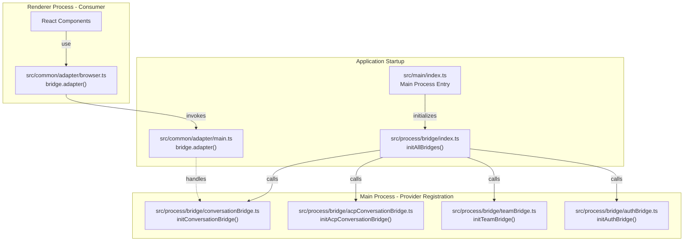
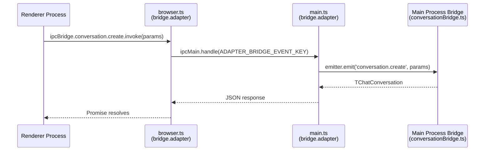

# Inter-Process Communication

<details>
<summary>Relevant source files</summary>

The following files were used as context for generating this wiki page:

- [src/common/adapter/browser.ts](src/common/adapter/browser.ts)
- [src/common/adapter/main.ts](src/common/adapter/main.ts)
- [src/process/bridge/acpConversationBridge.ts](src/process/bridge/acpConversationBridge.ts)
- [src/process/bridge/authBridge.ts](src/process/bridge/authBridge.ts)
- [src/process/bridge/conversationBridge.ts](src/process/bridge/conversationBridge.ts)
- [src/process/bridge/geminiConversationBridge.ts](src/process/bridge/geminiConversationBridge.ts)
- [src/process/bridge/index.ts](src/process/bridge/index.ts)
- [src/process/bridge/taskBridge.ts](src/process/bridge/taskBridge.ts)
- [src/process/bridge/teamBridge.ts](src/process/bridge/teamBridge.ts)
- [src/process/extensions/ExtensionRegistry.ts](src/process/extensions/ExtensionRegistry.ts)
- [src/process/extensions/hub/HubStateManager.ts](src/process/extensions/hub/HubStateManager.ts)
- [src/process/extensions/lifecycle/statePersistence.ts](src/process/extensions/lifecycle/statePersistence.ts)
- [src/process/utils/message.ts](src/process/utils/message.ts)
- [src/renderer/pages/guid/index.tsx](src/renderer/pages/guid/index.tsx)
- [tests/unit/acpConversationBridge.test.ts](tests/unit/acpConversationBridge.test.ts)
- [tests/unit/adapterEmitGuard.test.ts](tests/unit/adapterEmitGuard.test.ts)
- [tests/unit/adapterPayloadGuard.test.ts](tests/unit/adapterPayloadGuard.test.ts)
- [tests/unit/baseAgentManagerStop.test.ts](tests/unit/baseAgentManagerStop.test.ts)
- [tests/unit/browserAdapterReconnect.test.ts](tests/unit/browserAdapterReconnect.test.ts)
- [tests/unit/conversationBridge.test.ts](tests/unit/conversationBridge.test.ts)
- [tests/unit/extensions/statePersistence.test.ts](tests/unit/extensions/statePersistence.test.ts)
- [tests/unit/geminiConversationBridge.test.ts](tests/unit/geminiConversationBridge.test.ts)
- [tests/unit/messageQueue.test.ts](tests/unit/messageQueue.test.ts)
- [tests/unit/taskBridge.test.ts](tests/unit/taskBridge.test.ts)

</details>


## Purpose and Scope

This document details the IPC Bridge architecture that enables communication between AionUi's Electron main process and React renderer process. The IPC Bridge provides a type-safe, bidirectional communication layer using two core patterns: **providers** (request-response) and **emitters** (event broadcasting). 

The system is designed to work seamlessly across both Electron (via `ipcMain`/`ipcRenderer`) and WebUI modes (via WebSockets), ensuring that agent logic remains consistent regardless of the deployment target.

---

## Architecture Overview

AionUi's IPC Bridge is built on the `bridge` module from `@office-ai/platform`, which abstracts Electron's native IPC mechanisms into a more ergonomic, type-safe API. The bridge serves as a contract layer between renderer and main processes, defining all available operations and their type signatures in a single source of truth.

### Bridge Initialization Flow



**Sources:** [src/process/bridge/index.ts:59-95](), [src/common/adapter/main.ts:39-98](), [src/common/adapter/browser.ts:23-40]()

---

## Provider Pattern (Request-Response)

Providers implement a synchronous-style request-response pattern. The renderer invokes a provider with parameters, the main process handles the request, and returns a typed response.

### Provider Definition and Usage



**Sources:** [src/common/adapter/main.ts:93-97](), [src/common/adapter/browser.ts:26-28](), [src/process/bridge/conversationBridge.ts:126-148]()

#### Implementation (Main Process)

The `conversationBridge` registers handlers for creating conversations. It validates the type and emits a notification when the list changes [src/process/bridge/conversationBridge.ts:126-148]().

```typescript
ipcBridge.conversation.create.provider(async (params): Promise<TChatConversation> => {
  if (!VALID_CONVERSATION_TYPES.has(params?.type)) return undefined;
  const conversation = await conversationService.createConversation({ ...params });
  emitConversationListChanged(conversation, 'created');
  return conversation;
});
```

#### Error Handling (Safe Providers)

In the `teamBridge`, a `safeProvider` wrapper is used to ensure that unhandled rejections do not freeze the renderer. It catches errors and returns a sentinel object `{ __bridgeError: true, message }` [src/process/bridge/teamBridge.ts:18-29]().

---

## Emitter Pattern (Event Broadcasting)

Emitters implement a publish-subscribe pattern for streaming updates and notifications from the main process to the renderer.

### Broadcast Mechanism

The main process adapter iterates through all active `BrowserWindow` instances and sends serialized events via `webContents.send` [src/common/adapter/main.ts:78-85](). It also broadcasts to all connected WebSocket clients for WebUI mode [src/common/adapter/main.ts:87]().

### Payload Safety

To prevent main-process blocking, the bridge implements a `MAX_IPC_PAYLOAD_SIZE` guard (50 MB). If an event payload exceeds this limit, it is dropped, and a `bridge:error` event is emitted to notify the renderer [src/common/adapter/main.ts:37-76]().

**Sources:** [src/common/adapter/main.ts:37-88]()

---

## WebUI and WebSocket Bridge

When running in WebUI mode (outside Electron), the bridge switches from IPC to WebSockets [src/common/adapter/browser.ts:41-46]().

### Connection Management
- **Heartbeat:** The bridge handles `ping` messages from the server by responding with a `pong` [src/common/adapter/browser.ts:122-127]().
- **Auth Expiration:** If the server sends an `auth-expired` event or a close code `1008`, the bridge stops reconnection attempts and redirects the user to the login page [src/common/adapter/browser.ts:131-159](), [src/common/adapter/browser.ts:179-195]().
- **Reconnection:** Implements exponential backoff for reconnection [src/common/adapter/browser.ts:73-83]().
- **Queueing:** Messages sent while the socket is connecting are queued and flushed upon the `open` event [src/common/adapter/browser.ts:59-70]().

**Sources:** [src/common/adapter/browser.ts:41-224]()

---

## Specialized Bridge Modules

### ACP Conversation Bridge
Handles agent detection and health checks. It provides the `getAvailableAgents` method which enriches detected agents with supported MCP transports [src/process/bridge/acpConversationBridge.ts:49-75](). It also implements a real-time `checkAgentHealth` by spawning a temporary `AcpConnection` and sending a test prompt [src/process/bridge/acpConversationBridge.ts:98-173]().

### Auth Bridge
Manages Google OAuth flows. It checks for credential file existence using `fsAsync.access` to avoid blocking the main thread [src/process/bridge/authBridge.ts:19-30](). It handles the login flow with a 2-minute timeout to prevent hanging if the user fails to complete the browser-based OAuth [src/process/bridge/authBridge.ts:69-90]().

### Gemini Bridge
Specifically handles MCP tool confirmations. The `confirmMessage` provider routes user approval (including "always allow" keys) back to the `GeminiAgentManager` worker process [src/process/bridge/geminiConversationBridge.ts:14-26]().

### Team Bridge
Orchestrates multi-agent collaboration. It manages the lifecycle of `TeamSessionService`, including creating teams, adding agents, and starting TCP-based session servers [src/process/bridge/teamBridge.ts:33-108]().

---

## Key Entity Summary

| Entity | Role | Implementation |
| :--- | :--- | :--- |
| `ipcBridge` | The central type-safe contract for all IPC operations. | `src/common/adapter/ipcBridge.ts` |
| `initAllBridges` | Bootstraps all bridge modules in the main process. | [src/process/bridge/index.ts:59]() |
| `bridge.adapter` (Main) | Connects the bridge logic to Electron `ipcMain` and WebSockets. | [src/common/adapter/main.ts:39]() |
| `bridge.adapter` (Browser) | Connects the renderer to Electron `ipcRenderer` or WebSockets. | [src/common/adapter/browser.ts:23]() |
| `safeProvider` | Wrapper to prevent renderer hangs on main-process errors. | [src/process/bridge/teamBridge.ts:18]() |

**Sources:** [src/process/bridge/index.ts:59-95](), [src/common/adapter/main.ts:39-98](), [src/common/adapter/browser.ts:23-224](), [src/process/bridge/teamBridge.ts:18-29]()