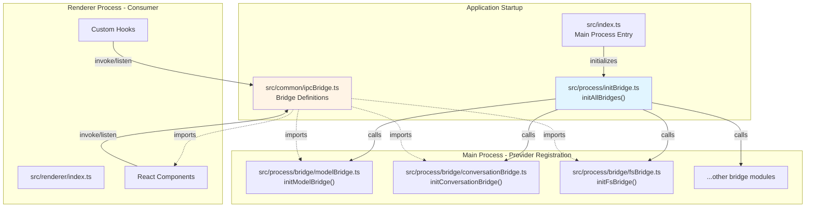
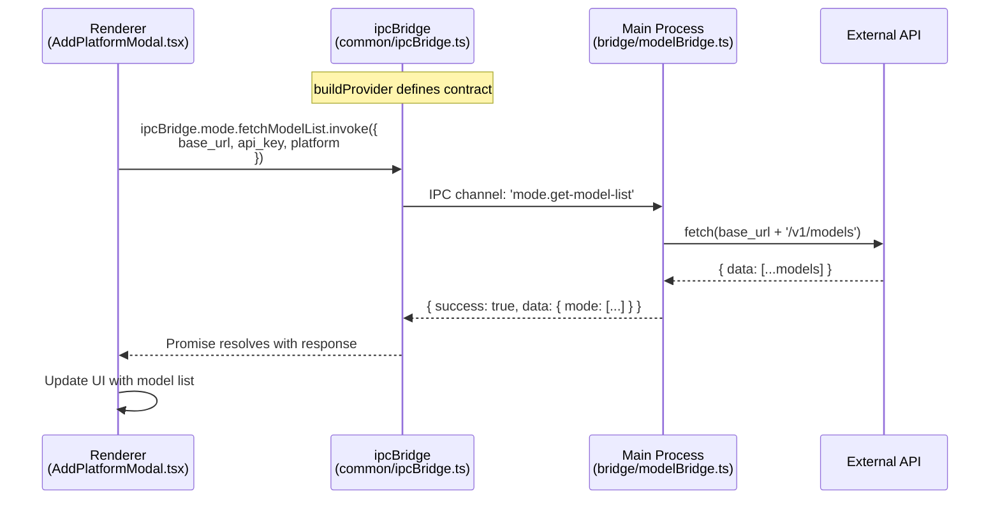
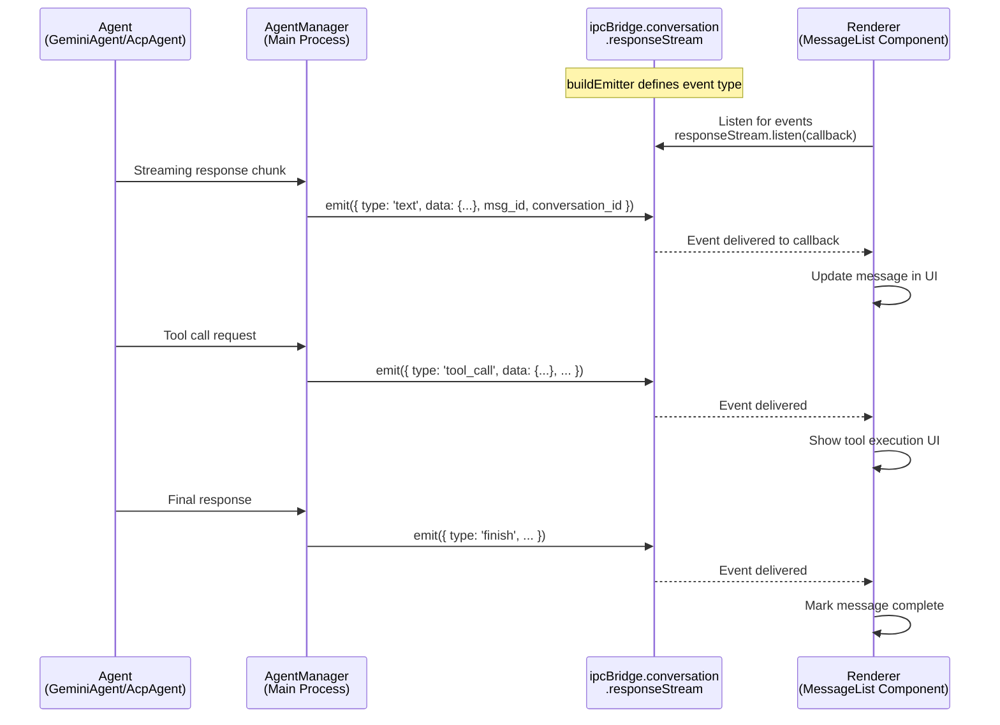
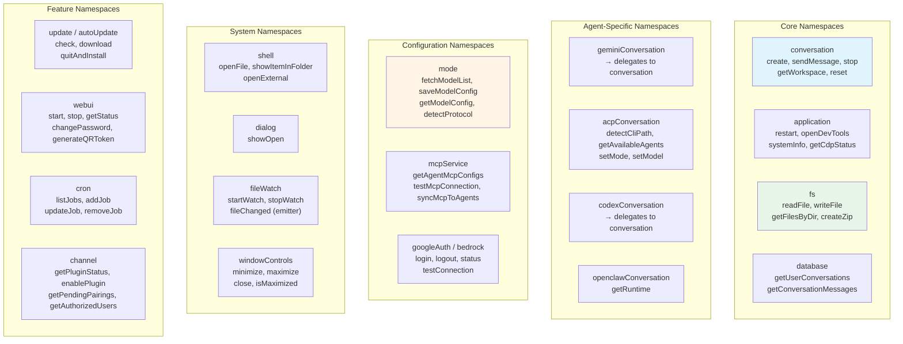
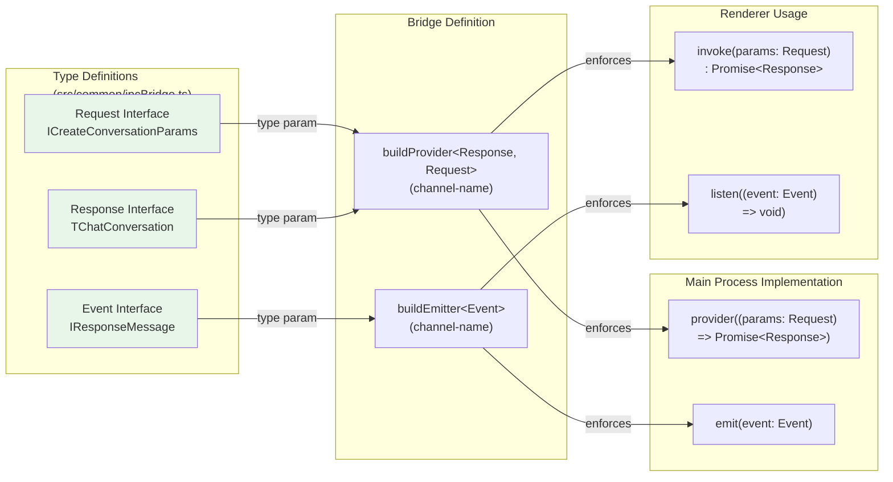
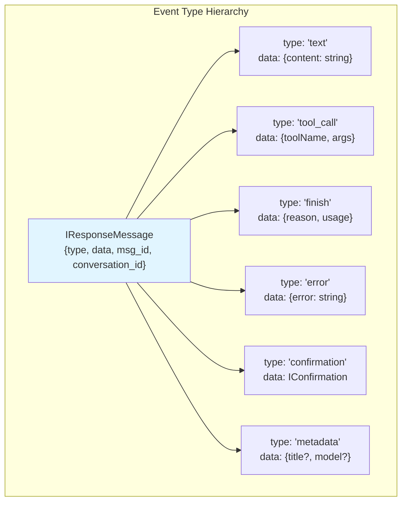
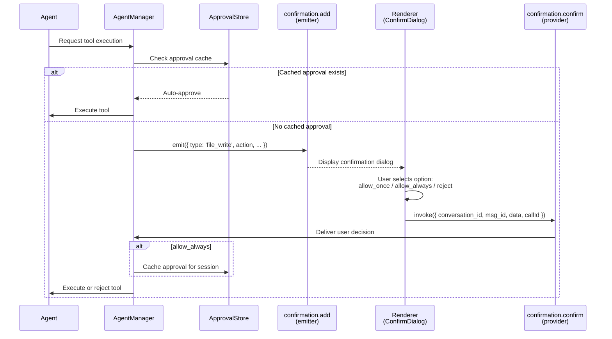
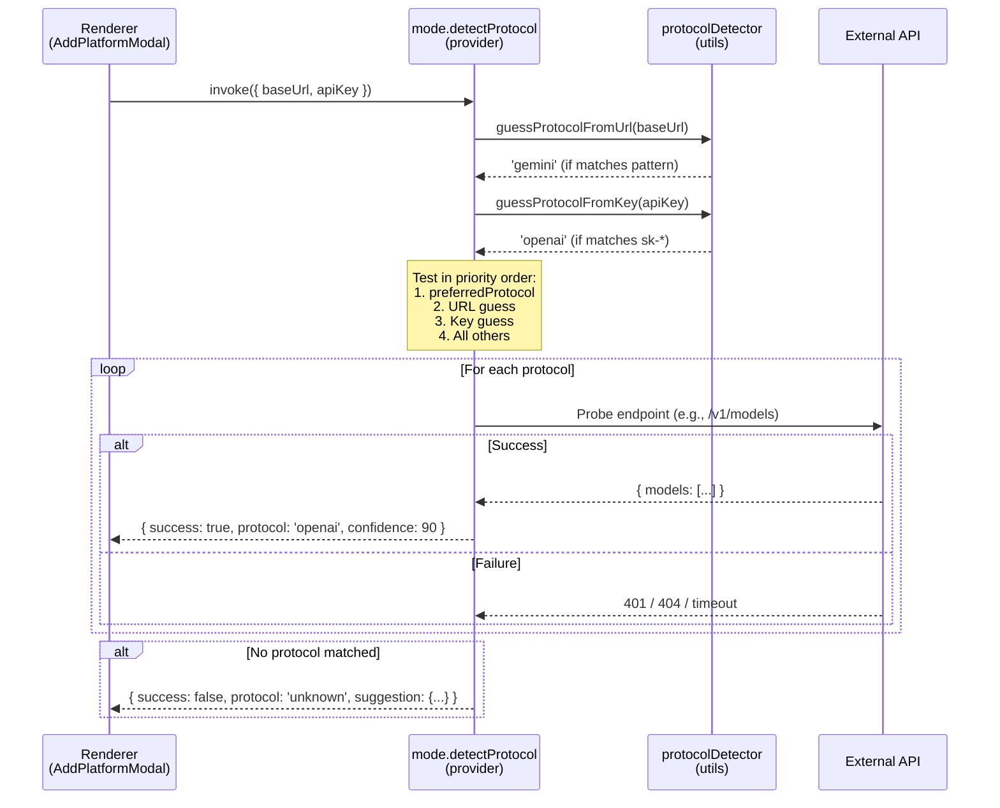

# Inter-Process Communication

<details>
<summary>Relevant source files</summary>

The following files were used as context for generating this wiki page:

- [src/common/ipcBridge.ts](src/common/ipcBridge.ts)
- [src/common/storage.ts](src/common/storage.ts)
- [src/common/utils/protocolDetector.ts](src/common/utils/protocolDetector.ts)
- [src/process/WorkerManage.ts](src/process/WorkerManage.ts)
- [src/process/bridge/modelBridge.ts](src/process/bridge/modelBridge.ts)
- [src/process/initBridge.ts](src/process/initBridge.ts)
- [src/renderer/assets/logos/minimax.png](src/renderer/assets/logos/minimax.png)
- [src/renderer/config/modelPlatforms.ts](src/renderer/config/modelPlatforms.ts)
- [src/renderer/pages/guid/index.tsx](src/renderer/pages/guid/index.tsx)
- [src/renderer/pages/settings/components/AddModelModal.tsx](src/renderer/pages/settings/components/AddModelModal.tsx)
- [src/renderer/pages/settings/components/AddPlatformModal.tsx](src/renderer/pages/settings/components/AddPlatformModal.tsx)
- [src/renderer/pages/settings/components/EditModeModal.tsx](src/renderer/pages/settings/components/EditModeModal.tsx)

</details>

## Purpose and Scope

This document details the IPC Bridge architecture that enables communication between AionUi's Electron main process and React renderer process. The IPC Bridge provides a type-safe, bidirectional communication layer using two core patterns: **providers** (request-response) and **emitters** (event broadcasting).

For information about the Electron framework itself, see [Electron Framework](#3.2). For details on how agents use IPC to stream responses, see [Agent Architecture](#4).

---

## Architecture Overview

AionUi's IPC Bridge is built on the `bridge` module from `@office-ai/platform`, which abstracts Electron's native IPC mechanisms into a more ergonomic, type-safe API. The bridge serves as a contract layer between renderer and main processes, defining all available operations and their type signatures in a single source of truth.

### Bridge Initialization Flow



**Sources:** [src/process/initBridge.ts:8-14](), [src/common/ipcBridge.ts:1-603]()

The bridge is initialized during application startup via [src/process/initBridge.ts:14](). This calls `initAllBridges()` from [src/process/bridge/index.ts](), which registers all provider handlers in the main process.

---

## Provider Pattern (Request-Response)

Providers implement a synchronous-style request-response pattern. The renderer invokes a provider with parameters, the main process handles the request, and returns a typed response.

### Provider Definition and Usage



**Sources:** [src/common/ipcBridge.ts:224-230](), [src/process/bridge/modelBridge.ts:63-426](), [src/renderer/pages/settings/components/AddPlatformModal.tsx:366-384]()

#### Definition (Common Layer)

[src/common/ipcBridge.ts:224-230]() defines the provider contract:

```typescript
export const mode = {
  fetchModelList: bridge.buildProvider<
    IBridgeResponse<{ mode: Array<string | { id: string; name: string }>; fix_base_url?: string }>,
    { base_url?: string; api_key: string; try_fix?: boolean; platform?: string; bedrockConfig?: {...} }
  >('mode.get-model-list'),
  // ...other providers
};
```

The `buildProvider` function takes two type parameters:

- **Response Type**: `IBridgeResponse<{ mode: [...] }>`
- **Request Type**: `{ base_url, api_key, ... }`

And one runtime parameter:

- **Channel Name**: `'mode.get-model-list'` - the IPC channel identifier

#### Implementation (Main Process)

[src/process/bridge/modelBridge.ts:63-426]() registers the handler:

```typescript
ipcBridge.mode.fetchModelList.provider(async function fetchModelList({
  base_url, api_key, try_fix, platform, bedrockConfig
}): Promise<{ success: boolean; msg?: string; data?: {...} }> {
  // Handler implementation
  const openai = new OpenAI({ baseURL: base_url, apiKey: api_key });
  const res = await openai.models.list();
  return { success: true, data: { mode: res.data.map(v => v.id) } };
});
```

#### Invocation (Renderer)

[src/renderer/pages/settings/components/AddPlatformModal.tsx:366-384]() invokes the provider:

```typescript
const res = await ipcBridge.mode.fetchModelList.invoke({
  platform,
  api_key: '',
  bedrockConfig,
})
if (res.success) {
  const models = res.data?.mode.map((v) => ({ label: v, value: v })) || []
  // Update state
}
```

### Common Provider Patterns

| Provider                        | Channel                           | Purpose                           | Sources                         |
| ------------------------------- | --------------------------------- | --------------------------------- | ------------------------------- |
| `conversation.create`           | `create-conversation`             | Initialize new agent conversation | [src/common/ipcBridge.ts:26]()  |
| `conversation.sendMessage`      | `chat.send.message`               | Send user message to agent        | [src/common/ipcBridge.ts:34]()  |
| `database.getUserConversations` | `database.get-user-conversations` | Query conversation history        | [src/common/ipcBridge.ts:327]() |
| `fs.readFile`                   | `read-file`                       | Read file contents (UTF-8)        | [src/common/ipcBridge.ts:140]() |
| `mode.saveModelConfig`          | `mode.save-model-config`          | Persist provider configuration    | [src/common/ipcBridge.ts:226]() |
| `dialog.showOpen`               | `show-open`                       | Open native file picker           | [src/common/ipcBridge.ts:134]() |

**Sources:** [src/common/ipcBridge.ts:18-603]()

---

## Emitter Pattern (Event Broadcasting)

Emitters implement a publish-subscribe pattern for streaming updates and notifications from the main process to the renderer. Unlike providers, emitters are asynchronous and can emit multiple events for a single operation.

### Emitter Definition and Usage



**Sources:** [src/common/ipcBridge.ts:37](), [src/process/task/GeminiAgentManager.ts](), [src/renderer/hooks/useConversation.ts]()

#### Definition (Common Layer)

[src/common/ipcBridge.ts:37]() defines the emitter contract:

```typescript
export const conversation = {
  responseStream: bridge.buildEmitter<IResponseMessage>('chat.response.stream'),
  // ...
}
```

The `buildEmitter` function takes:

- **Event Type**: `IResponseMessage` - the shape of emitted events
- **Channel Name**: `'chat.response.stream'` - the IPC channel identifier

#### Event Type Structure

[src/common/ipcBridge.ts:559-564]() defines the event payload:

```typescript
export interface IResponseMessage {
  type: string // Event type: 'text', 'tool_call', 'finish', etc.
  data: unknown // Event-specific data
  msg_id: string // Message identifier
  conversation_id: string // Conversation identifier
}
```

#### Emission (Main Process)

Agent managers emit events during response streaming. Example from GeminiAgentManager:

```typescript
ipcBridge.conversation.responseStream.emit({
  type: 'text',
  data: { content: chunkText },
  msg_id: messageId,
  conversation_id: this.conversationId,
})
```

#### Subscription (Renderer)

Components listen for events using the emitter's listener:

```typescript
useEffect(() => {
  const unsubscribe = ipcBridge.conversation.responseStream.listen((event) => {
    if (event.conversation_id === conversationId) {
      handleResponseEvent(event)
    }
  })
  return unsubscribe // Cleanup on unmount
}, [conversationId])
```

### Common Emitter Patterns

| Emitter                       | Channel                      | Purpose                                      | Sources                             |
| ----------------------------- | ---------------------------- | -------------------------------------------- | ----------------------------------- |
| `conversation.responseStream` | `chat.response.stream`       | Stream agent responses                       | [src/common/ipcBridge.ts:37]()      |
| `fileStream.contentUpdate`    | `file-stream-content-update` | Real-time file write notifications           | [src/common/ipcBridge.ts:199-206]() |
| `fileWatch.fileChanged`       | `file-changed`               | File system change events                    | [src/common/ipcBridge.ts:194]()     |
| `application.logStream`       | `app.log-stream`             | Bridge main process logs to renderer console | [src/common/ipcBridge.ts:104]()     |
| `autoUpdate.status`           | `auto-update.status`         | Update download progress                     | [src/common/ipcBridge.ts:130]()     |
| `confirmation.add`            | `confirmation.add`           | Tool execution approval requests             | [src/common/ipcBridge.ts:42]()      |
| `deepLink.received`           | `deep-link.received`         | Deep link protocol handling                  | [src/common/ipcBridge.ts:356-359]() |

**Sources:** [src/common/ipcBridge.ts:18-603]()

---

## IPC Namespace Organization

The IPC Bridge organizes operations into logical namespaces based on domain. This structure provides clear boundaries and makes the API discoverable.

### Namespace Structure



**Sources:** [src/common/ipcBridge.ts:18-603]()

### Namespace Details

#### `conversation` - Universal Agent Operations

[src/common/ipcBridge.ts:24-55]() provides a unified API for all agent types:

| Operation        | Description                      | Return Type           |
| ---------------- | -------------------------------- | --------------------- |
| `create`         | Initialize new conversation      | `TChatConversation`   |
| `sendMessage`    | Send user input to agent         | `IBridgeResponse<{}>` |
| `stop`           | Terminate active streaming       | `IBridgeResponse<{}>` |
| `update`         | Modify conversation metadata     | `boolean`             |
| `reset`          | Clear conversation state         | `void`                |
| `getWorkspace`   | List workspace files             | `IDirOrFile[]`        |
| `confirmMessage` | Respond to tool approval request | `IBridgeResponse`     |

Agent-specific namespaces (`geminiConversation`, `acpConversation`, `codexConversation`, `openclawConversation`) delegate to these unified operations where possible, adding only agent-specific functionality.

#### `fs` - File System Operations

[src/common/ipcBridge.ts:136-188]() provides comprehensive file operations:

| Operation              | Description                 | Use Case                      |
| ---------------------- | --------------------------- | ----------------------------- |
| `readFile`             | Read UTF-8 text file        | Load config, read source code |
| `writeFile`            | Write text/binary file      | Save agent edits              |
| `getFilesByDir`        | Recursive directory listing | Workspace file tree           |
| `createZip`            | Create ZIP archive          | Export workspace              |
| `copyFilesToWorkspace` | Batch file copy             | Drag-and-drop file import     |
| `removeEntry`          | Delete file/directory       | Agent file operations         |
| `listAvailableSkills`  | Scan skills directory       | Assistant configuration       |

File operations support both absolute paths and workspace-relative paths.

#### `mode` - Model Provider Management

[src/common/ipcBridge.ts:224-230]() handles model configuration:

| Operation         | Description                          | Sources                                       |
| ----------------- | ------------------------------------ | --------------------------------------------- |
| `fetchModelList`  | Query available models from provider | [src/process/bridge/modelBridge.ts:63-426]()  |
| `saveModelConfig` | Persist provider array to storage    | [src/process/bridge/modelBridge.ts:428-436]() |
| `getModelConfig`  | Load provider configuration          | [src/process/bridge/modelBridge.ts:438-469]() |
| `detectProtocol`  | Auto-detect API protocol type        | [src/process/bridge/modelBridge.ts:472-588]() |

The `detectProtocol` operation implements smart protocol detection by analyzing URL patterns, API key formats, and probing endpoints. See [Model Configuration & API Management](#4.7) for details.

#### `acpConversation` - ACP Agent Operations

[src/common/ipcBridge.ts:233-271]() extends base conversation operations with ACP-specific features:

| Operation            | Description                               | Purpose                      |
| -------------------- | ----------------------------------------- | ---------------------------- |
| `detectCliPath`      | Locate CLI binary on system               | Auto-configure agent path    |
| `getAvailableAgents` | List installed ACP agents                 | Agent selection UI           |
| `checkEnv`           | Validate environment variables            | Troubleshooting              |
| `setMode`            | Switch session mode (code/architect)      | Agent behavior configuration |
| `getModelInfo`       | Query current model and available models  | Model management             |
| `setModel`           | Switch to different model                 | Runtime model switching      |
| `probeModelInfo`     | Query model info without creating session | Pre-selection validation     |

**Sources:** [src/common/ipcBridge.ts:233-271](), [src/process/bridge/acpBridge.ts]()

#### `mcpService` - Model Context Protocol Integration

[src/common/ipcBridge.ts:274-284]() manages MCP server connections:

| Operation             | Description                           | Details                                              |
| --------------------- | ------------------------------------- | ---------------------------------------------------- |
| `getAgentMcpConfigs`  | List MCP servers per agent            | Returns servers from config + agent-specific configs |
| `testMcpConnection`   | Validate MCP server connectivity      | Tests transport (stdio/SSE/HTTP) and lists tools     |
| `syncMcpToAgents`     | Install MCP server to multiple agents | Updates agent config files                           |
| `removeMcpFromAgents` | Uninstall MCP server from agents      | Removes from agent configs                           |
| `checkOAuthStatus`    | Verify OAuth authentication           | For SSE/HTTP servers requiring auth                  |
| `loginMcpOAuth`       | Initiate OAuth flow                   | Opens browser for user consent                       |

See [MCP Integration](#4.6) for protocol details.

#### `webui` - Remote Access Server

[src/common/ipcBridge.ts:391-410]() controls the WebUI server:

| Operation         | Description           | Return Type                                       |
| ----------------- | --------------------- | ------------------------------------------------- |
| `start`           | Start Express server  | `{ port, localUrl, networkUrl, initialPassword }` |
| `stop`            | Stop Express server   | `IBridgeResponse`                                 |
| `getStatus`       | Query server state    | `IWebUIStatus`                                    |
| `changePassword`  | Update admin password | `IBridgeResponse`                                 |
| `generateQRToken` | Create QR login token | `{ token, expiresAt, qrUrl }`                     |
| `verifyQRToken`   | Validate QR token     | `{ sessionToken, username }`                      |

See [WebUI Server Architecture](#3.5) for implementation details.

---

## Type Safety and Contracts

The IPC Bridge enforces type safety through TypeScript interfaces, ensuring compile-time verification of request/response contracts.

### Type Contract Pattern



**Sources:** [src/common/ipcBridge.ts:467-531](), [src/common/ipcBridge.ts:559-570]()

### Example: Conversation Creation Contract

[src/common/ipcBridge.ts:483-531]() defines the request interface:

```typescript
export interface ICreateConversationParams {
  type: 'gemini' | 'acp' | 'codex' | 'openclaw-gateway' | 'nanobot'
  id?: string
  name?: string
  model: TProviderWithModel
  extra: {
    workspace?: string
    customWorkspace?: boolean
    defaultFiles?: string[]
    backend?: AcpBackendAll
    cliPath?: string
    agentName?: string
    presetRules?: string
    enabledSkills?: string[]
    sessionMode?: string
    // ...type-specific fields
  }
}
```

[src/common/storage.ts:154-302]() defines the response type `TChatConversation` as a discriminated union of conversation types.

The provider is defined in [src/common/ipcBridge.ts:26]():

```typescript
create: bridge.buildProvider<TChatConversation, ICreateConversationParams>(
  'create-conversation'
)
```

This ensures:

- **Renderer**: Can only pass `ICreateConversationParams`, receives `TChatConversation`
- **Main Process**: Handler must accept `ICreateConversationParams` and return `Promise<TChatConversation>`

### Standard Response Wrapper

[src/common/ipcBridge.ts:566-570]() defines the standard response format:

```typescript
interface IBridgeResponse<D = {}> {
  success: boolean
  data?: D
  msg?: string
}
```

This pattern enables consistent error handling:

```typescript
const res = await ipcBridge.mode.fetchModelList.invoke({ ... });
if (res.success) {
  // Use res.data
} else {
  // Show res.msg to user
}
```

**Sources:** [src/common/ipcBridge.ts:566-570](), [src/renderer/pages/settings/components/AddPlatformModal.tsx:366-384]()

---

## Streaming Response Protocol

The `responseStream` emitter implements a structured protocol for agent streaming responses, supporting text chunks, tool calls, confirmations, and metadata updates.

### Response Event Types



**Sources:** [src/common/ipcBridge.ts:559-564]()

### Event Type Semantics

| Event Type     | Purpose                     | Data Structure                        | Handling                                 |
| -------------- | --------------------------- | ------------------------------------- | ---------------------------------------- |
| `text`         | Streaming text chunk        | `{ content: string }`                 | Append to message buffer                 |
| `tool_call`    | Tool execution notification | `{ toolName, args, result? }`         | Display tool UI, show result             |
| `finish`       | Response complete           | `{ reason: 'stop'\|'error', usage? }` | Mark message complete, show token usage  |
| `error`        | Error occurred              | `{ error: string, code? }`            | Display error message                    |
| `confirmation` | Approval request            | `IConfirmation<T>`                    | Show confirmation dialog                 |
| `metadata`     | Conversation metadata       | `{ title?, model?, ... }`             | Update conversation header               |
| `think`        | Reasoning process           | `{ content: string }`                 | Display thinking tag (hidden by default) |

**Sources:** [src/common/chatLib.ts]() (defines `IConfirmation`), [src/renderer/hooks/useConversation.ts]() (event handling)

### Streaming Flow Example

[src/process/task/GeminiAgentManager.ts]() demonstrates the streaming pattern:

```typescript
// 1. Text chunks
for (const chunk of stream) {
  ipcBridge.conversation.responseStream.emit({
    type: 'text',
    data: { content: chunk.text },
    msg_id: messageId,
    conversation_id: this.conversationId,
  })
}

// 2. Tool call notification
ipcBridge.conversation.responseStream.emit({
  type: 'tool_call',
  data: { toolName: 'web_search', args: { query: '...' }, result: '...' },
  msg_id: messageId,
  conversation_id: this.conversationId,
})

// 3. Finish with token usage
ipcBridge.conversation.responseStream.emit({
  type: 'finish',
  data: { reason: 'stop', usage: { totalTokens: 1234 } },
  msg_id: messageId,
  conversation_id: this.conversationId,
})
```

**Sources:** [src/process/task/GeminiAgentManager.ts](), [src/agent/codex/CodexEventHandler.ts]()

---

## Approval and Confirmation Flow

Tool execution requires user approval in non-yolo modes. The IPC Bridge provides a confirmation protocol that supports session-level approval caching.

### Confirmation Protocol



**Sources:** [src/common/ipcBridge.ts:41-47](), [src/process/services/ApprovalStore.ts](), [src/renderer/components/ConfirmDialog.tsx]()

### Confirmation Types

[src/common/chatLib.ts]() defines the confirmation interface:

```typescript
export interface IConfirmation<T = any> {
  id: string // Unique confirmation ID
  msg_id: string // Associated message ID
  type: string // Confirmation type (e.g., 'file_write', 'command')
  action: string // Specific action (e.g., 'create_file', 'rm -rf')
  data: T // Type-specific data
  status: 'pending' | 'approved' | 'rejected'
  options: ConfirmationOption[] // Available user actions
  metadata?: {
    filePath?: string
    commandType?: string
    danger_level?: 'low' | 'medium' | 'high'
  }
}
```

### Approval Options

| Option                | Behavior                                | Caching                |
| --------------------- | --------------------------------------- | ---------------------- |
| `allow_once`          | Approve this specific request           | Not cached             |
| `allow_always`        | Approve all similar requests in session | Cached by `action`     |
| `allow_always_tool`   | Approve all calls to this tool          | Cached by `toolName`   |
| `allow_always_server` | Approve all tools from this MCP server  | Cached by `serverName` |
| `reject`              | Deny request                            | Not cached             |

The `ApprovalStore` [src/process/services/ApprovalStore.ts]() maintains session-level cache, cleared when conversation is reset or app restarts.

**Sources:** [src/common/chatLib.ts](), [src/process/services/ApprovalStore.ts](), [src/common/ipcBridge.ts:48-54]()

---

## Protocol Detection System

The protocol detection system automatically identifies API protocol types (OpenAI, Gemini, Anthropic) by analyzing URL patterns, API key formats, and probing endpoints.

### Detection Flow



**Sources:** [src/common/utils/protocolDetector.ts:1-468](), [src/process/bridge/modelBridge.ts:472-588]()

### Protocol Signatures

[src/common/utils/protocolDetector.ts:159-285]() defines protocol signatures:

```typescript
export const PROTOCOL_SIGNATURES: ProtocolSignature[] = [
  {
    protocol: 'gemini',
    keyPattern: /^AIza[A-Za-z0-9_-]{35}$/,
    urlPatterns: [/generativelanguage\.googleapis\.com/, ...],
    endpoints: [
      { path: '/v1beta/models', method: 'GET', validator: (res) => res?.models && Array.isArray(res.models) }
    ]
  },
  {
    protocol: 'openai',
    keyPattern: /^sk-[A-Za-z0-9-_]{20,}$/,
    urlPatterns: [/api\.openai\.com/, /api\.deepseek\.com/, ...],
    endpoints: [
      { path: '/v1/models', method: 'GET', headers: (key) => ({ Authorization: `Bearer ${key}` }), ... }
    ]
  },
  {
    protocol: 'anthropic',
    keyPattern: /^sk-ant-[A-Za-z0-9-]{80,}$/,
    urlPatterns: [/api\.anthropic\.com/],
    endpoints: [
      { path: '/v1/messages', method: 'POST', headers: (key) => ({ 'x-api-key': key }), ... }
    ]
  }
];
```

### Smart URL Candidate Generation

[src/process/bridge/modelBridge.ts:605-626]() builds URL candidates:

1. **Original URL**: Try user's input first
2. **Stripped URL**: Remove known API path suffixes (e.g., `/v1/models` → base URL)
3. **Protocol variants**: Add `https://` if missing

This handles cases where users paste full endpoint URLs instead of base URLs.

### Multi-Key Testing

[src/common/utils/protocolDetector.ts:55-75]() supports testing multiple API keys:

```typescript
export interface MultiKeyTestResult {
  total: number
  valid: number
  invalid: number
  details: Array<{
    index: number
    maskedKey: string
    valid: boolean
    error?: string
    latency?: number
  }>
}
```

When `testAllKeys: true`, the detector validates all comma/newline-separated keys, returning detailed results for each. This helps users identify which keys in a multi-key configuration are valid.

**Sources:** [src/common/utils/protocolDetector.ts:1-468](), [src/process/bridge/modelBridge.ts:472-588](), [src/renderer/hooks/useProtocolDetection.ts]()

---

## File Streaming Protocol

The file streaming system provides real-time notifications when agents write files, enabling instant preview updates without polling.

### File Stream Architecture

```mermaid
graph LR
    subgraph "Main Process"
        AGENT["Agent<br/>(GeminiAgent/AcpAgent)"]
        FOH["FileOperationHandler"]
        FS["Node.js fs module"]
    end

    subgraph "IPC Bridge"
        EMITTER["fileStream.contentUpdate<br/>(emitter)"]
    end

    subgraph "Renderer"
        PREVIEW["PreviewPanel"]
        WS["WorkspacePanel"]
    end

    AGENT -->|requests file write| FOH
    FOH -->|writes file| FS
    FOH -->|emits event| EMITTER
    EMITTER -->|{filePath, content, operation}| PREVIEW
    EMITTER -->|triggers refresh| WS

    style EMITTER fill:#fff4e6
```

**Sources:** [src/common/ipcBridge.ts:198-206](), [src/process/services/FileOperationHandler.ts](), [src/renderer/components/workspace/PreviewPanel.tsx]()

### File Stream Event Structure

[src/common/ipcBridge.ts:199-206]() defines the event payload:

```typescript
contentUpdate: bridge.buildEmitter<{
  filePath: string // Absolute file path
  content: string // New file content (for write operations)
  workspace: string // Workspace root directory
  relativePath: string // Path relative to workspace
  operation: 'write' | 'delete'
}>('file-stream-content-update')
```

### Usage Pattern

**Emission (Main Process):**

```typescript
// After writing file
ipcBridge.fileStream.contentUpdate.emit({
  filePath: absolutePath,
  content: fileContent,
  workspace: workspaceRoot,
  relativePath: path.relative(workspaceRoot, absolutePath),
  operation: 'write',
})
```

**Subscription (Renderer):**

```typescript
useEffect(() => {
  const unsubscribe = ipcBridge.fileStream.contentUpdate.listen((event) => {
    if (event.workspace === currentWorkspace) {
      if (event.operation === 'write') {
        updatePreview(event.relativePath, event.content)
      } else {
        closePreview(event.relativePath)
      }
    }
  })
  return unsubscribe
}, [currentWorkspace])
```

This enables the preview panel to display file contents as the agent writes them, without requiring manual refresh or file system polling.

**Sources:** [src/common/ipcBridge.ts:198-206](), [src/process/services/FileOperationHandler.ts](), [src/renderer/components/workspace/PreviewPanel.tsx]()

---

## Implementation Patterns

### Error Handling Pattern

All providers should return `IBridgeResponse<T>` to enable consistent error handling:

```typescript
ipcBridge.mode.fetchModelList.provider(async (params) => {
  try {
    const result = await performOperation(params)
    return { success: true, data: result }
  } catch (error) {
    return {
      success: false,
      msg: error.message || 'Operation failed',
    }
  }
})
```

**Renderer usage:**

```typescript
const res = await ipcBridge.mode.fetchModelList.invoke(params)
if (!res.success) {
  message.error(res.msg)
  return
}
// Use res.data
```

**Sources:** [src/common/ipcBridge.ts:566-570](), [src/process/bridge/modelBridge.ts:63-426]()

### Cleanup Pattern for Emitters

Emitter subscriptions must be cleaned up to prevent memory leaks:

```typescript
useEffect(() => {
  const unsubscribe = ipcBridge.conversation.responseStream.listen(handleEvent)
  return () => {
    unsubscribe() // Cleanup on unmount
  }
}, [dependencies])
```

The `listen()` function returns an unsubscribe function that removes the event handler.

**Sources:** [src/renderer/hooks/useConversation.ts]()

### Conversation ID Filtering

Response stream events include `conversation_id` for routing to the correct UI component:

```typescript
ipcBridge.conversation.responseStream.listen((event) => {
  if (event.conversation_id === currentConversationId) {
    handleEvent(event)
  }
  // Ignore events for other conversations
})
```

This allows multiple conversations to run simultaneously without interference.

**Sources:** [src/common/ipcBridge.ts:559-564](), [src/renderer/hooks/useConversation.ts]()

### Provider Chaining Pattern

Complex operations can chain multiple providers:

```typescript
// 1. Create conversation
const conversation = await ipcBridge.conversation.create.invoke(params)

// 2. Send first message
await ipcBridge.conversation.sendMessage.invoke({
  conversation_id: conversation.id,
  input: userMessage,
  msg_id: generateId(),
})

// 3. Listen for responses
const unsubscribe = ipcBridge.conversation.responseStream.listen((event) => {
  if (event.conversation_id === conversation.id) {
    handleResponse(event)
  }
})
```

**Sources:** [src/renderer/pages/guid/GuidPage.tsx](), [src/renderer/hooks/useConversation.ts]()

---

## Summary

The IPC Bridge provides a type-safe, bidirectional communication layer between AionUi's main and renderer processes:

- **Providers** implement request-response for synchronous operations (file I/O, database queries, configuration)
- **Emitters** implement publish-subscribe for asynchronous events (streaming responses, file changes, notifications)
- **Type contracts** ensure compile-time safety through TypeScript generics
- **Namespaces** organize operations by domain (conversation, fs, mode, etc.)
- **Standard response wrapper** enables consistent error handling across all providers

All IPC definitions live in [src/common/ipcBridge.ts:1-603](), provider implementations in [src/process/bridge/](), and renderer usage throughout [src/renderer/]().

**Sources:** [src/common/ipcBridge.ts:1-603](), [src/process/initBridge.ts:8-14](), [src/process/bridge/]()
