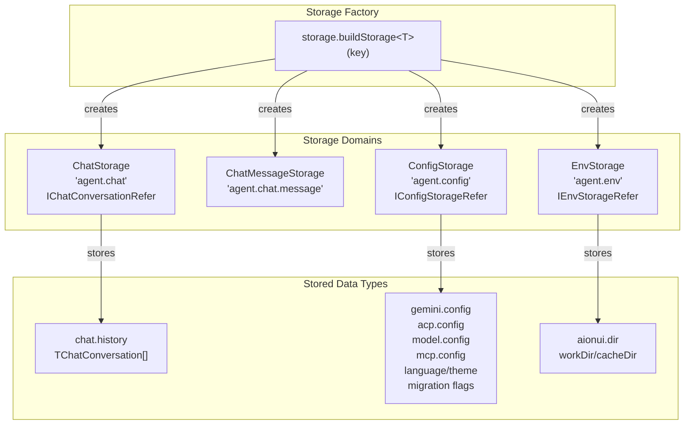
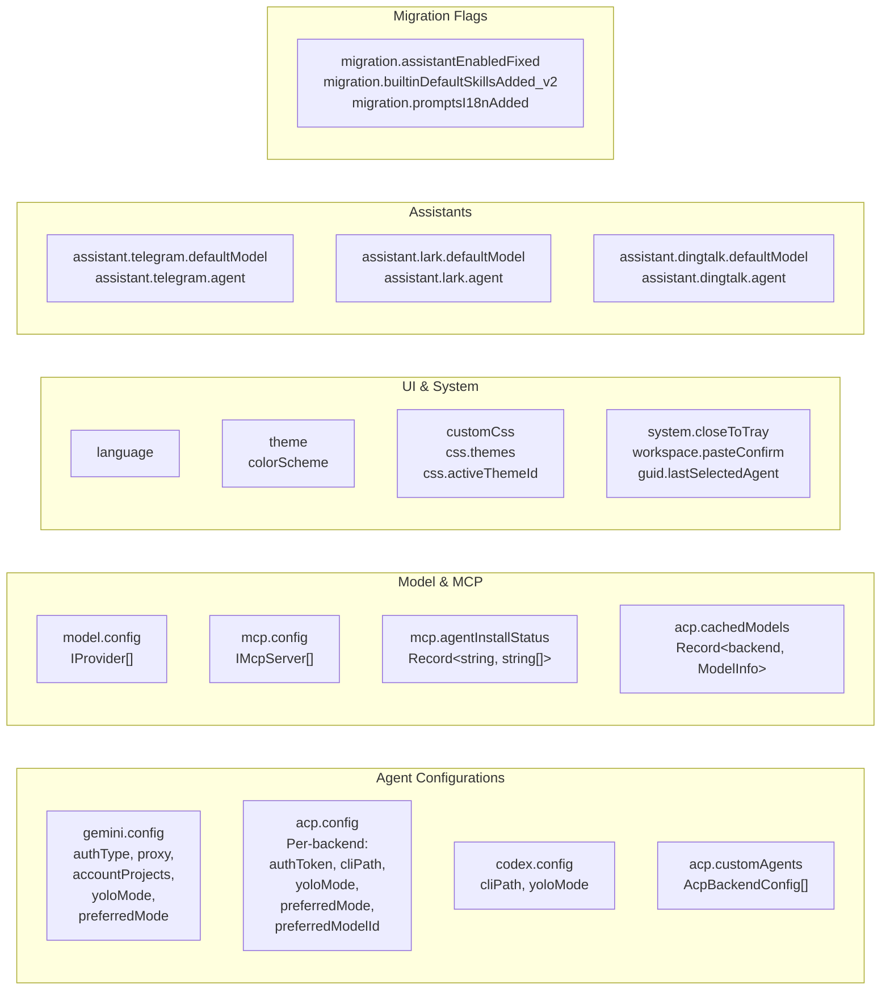
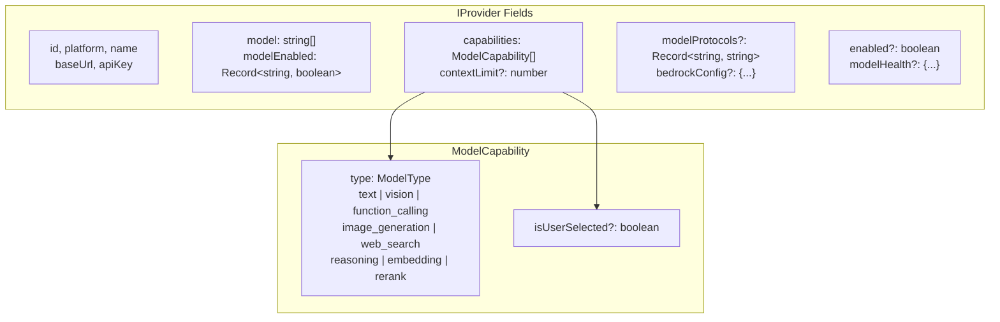
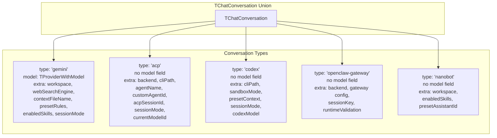
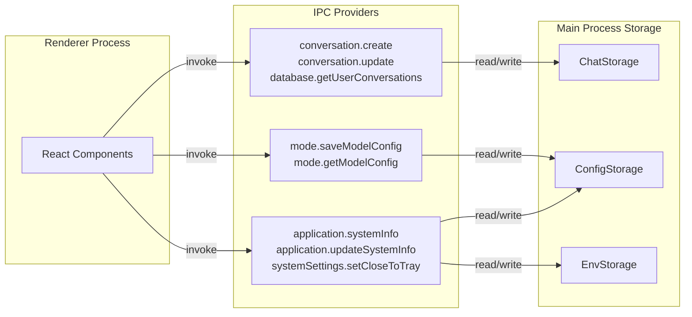
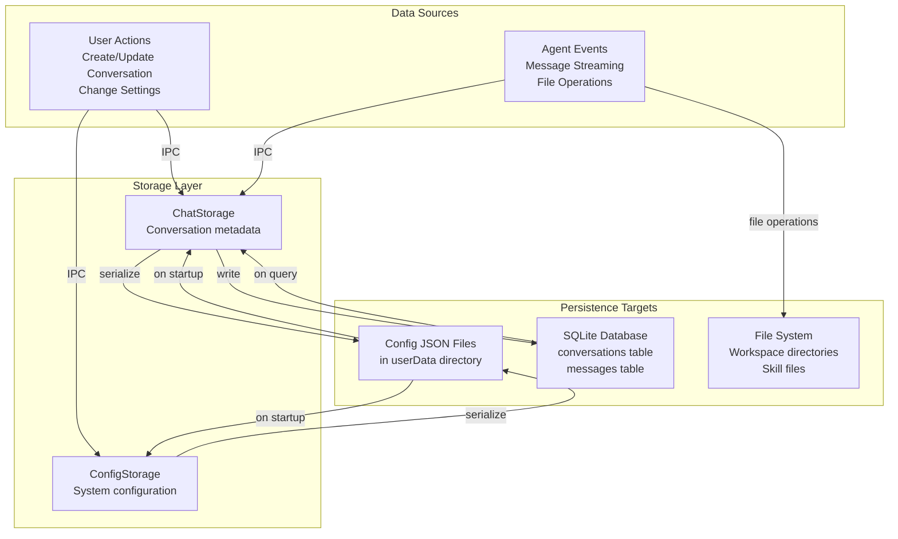
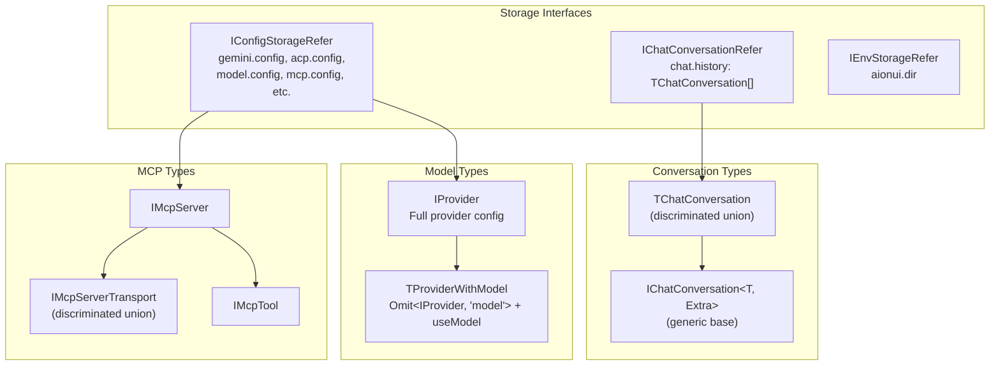

# Storage System

<details>
<summary>Relevant source files</summary>

The following files were used as context for generating this wiki page:

- [src/common/ipcBridge.ts](src/common/ipcBridge.ts)
- [src/common/storage.ts](src/common/storage.ts)
- [src/renderer/pages/guid/index.tsx](src/renderer/pages/guid/index.tsx)

</details>

## Purpose and Scope

The Storage System provides a type-safe, domain-isolated persistence layer for AionUi. It manages four primary storage domains: conversations (`ChatStorage`), configuration (`ConfigStorage`), environment variables (`EnvStorage`), and messages (`ChatMessageStorage`). This document explains the storage architecture, type system, and access patterns used throughout the application.

For database-level message persistence and batching, see [Database System](#3.6). For configuration cascading and hot-reload mechanisms, see [Configuration System](#8.1).

---

## Storage Factory Architecture

AionUi uses a factory pattern to create isolated storage instances with typed interfaces. Each storage domain is created using `storage.buildStorage<T>(key)` from the `@office-ai/platform` package, which provides a consistent API for reading and writing structured data.

### Storage Domains Overview



**Sources:** [src/common/storage.ts:7-22]()

### buildStorage Factory Pattern

The `buildStorage` factory creates a storage instance with type-safe get/set methods. Each instance is isolated by its storage key, preventing cross-contamination between different data domains.

| Storage Instance     | Key                    | Type Interface           | Purpose                           |
| -------------------- | ---------------------- | ------------------------ | --------------------------------- |
| `ChatStorage`        | `'agent.chat'`         | `IChatConversationRefer` | Conversation metadata and history |
| `ChatMessageStorage` | `'agent.chat.message'` | (untyped)                | Message-level storage             |
| `ConfigStorage`      | `'agent.config'`       | `IConfigStorageRefer`    | System and agent configuration    |
| `EnvStorage`         | `'agent.env'`          | `IEnvStorageRefer`       | System paths and environment      |

**Sources:** [src/common/storage.ts:13-22]()

---

## Configuration Storage (ConfigStorage)

`ConfigStorage` is the most complex storage domain, managing system-wide configuration through a hierarchical key structure. Each configuration key represents a specific subsystem or feature.

### Configuration Key Structure



**Sources:** [src/common/storage.ts:24-118]()

### Agent-Specific Configuration

#### Gemini Configuration

The `gemini.config` key stores Gemini-specific settings:

```typescript
{
  authType: string;           // Authentication method
  proxy: string;              // Proxy URL
  GOOGLE_GEMINI_BASE_URL?: string;
  accountProjects?: Record<string, string>; // Per-account GCP projects
  yoloMode?: boolean;         // Auto-approve mode
  preferredMode?: string;     // Default session mode
}
```

The `accountProjects` field uses a migration pattern where the old `GOOGLE_CLOUD_PROJECT` field is deprecated but kept for backward compatibility.

**Sources:** [src/common/storage.ts:25-36]()

#### ACP Configuration

The `acp.config` key stores a record keyed by `AcpBackend` type:

```typescript
{
  [backend in AcpBackend]?: {
    authMethodId?: string;
    authToken?: string;
    lastAuthTime?: number;
    cliPath?: string;
    yoloMode?: boolean;
    preferredMode?: string;
    preferredModelId?: string;
  }
}
```

This allows each ACP backend (claude, qwen, etc.) to have independent configuration.

**Sources:** [src/common/storage.ts:41-53]()

### Model Provider Configuration

The `model.config` key stores an array of `IProvider` objects representing configured AI model providers.

#### IProvider Interface Structure



**Key Fields:**

| Field            | Type                      | Purpose                                           |
| ---------------- | ------------------------- | ------------------------------------------------- |
| `id`             | `string`                  | Unique provider identifier                        |
| `platform`       | `string`                  | Platform type (gemini, openai, anthropic, etc.)   |
| `model`          | `string[]`                | Available model IDs                               |
| `capabilities`   | `ModelCapability[]`       | Supported features (vision, tools, etc.)          |
| `modelProtocols` | `Record<string, string>`  | Per-model protocol overrides (new-api only)       |
| `bedrockConfig`  | `object`                  | AWS Bedrock authentication (accessKey or profile) |
| `modelEnabled`   | `Record<string, boolean>` | Per-model enable/disable state                    |
| `modelHealth`    | `Record<string, object>`  | Health check results for UI display               |

**Sources:** [src/common/storage.ts:327-386]()

### MCP Server Configuration

The `mcp.config` key stores an array of `IMcpServer` objects for Model Context Protocol server integration.

#### IMcpServer Structure

```typescript
interface IMcpServer {
  id: string
  name: string
  description?: string
  enabled: boolean // Whether installed to CLI agents
  transport: IMcpServerTransport // stdio | sse | http | streamable_http
  tools?: IMcpTool[]
  status?: 'connected' | 'disconnected' | 'error' | 'testing'
  lastConnected?: number
  createdAt: number
  updatedAt: number
  originalJson: string // Original config for editing
}
```

The `transport` field is a discriminated union supporting four transport types:

| Transport Type    | Fields                   |
| ----------------- | ------------------------ |
| `stdio`           | `command`, `args`, `env` |
| `sse`             | `url`, `headers`         |
| `http`            | `url`, `headers`         |
| `streamable_http` | `url`, `headers`         |

**Sources:** [src/common/storage.ts:390-432]()

### Migration Flags

Migration flags in `ConfigStorage` track schema evolution and prevent duplicate migrations:

| Flag Key                                 | Purpose                                    |
| ---------------------------------------- | ------------------------------------------ |
| `migration.assistantEnabledFixed`        | Fixed assistant enabled default value      |
| `migration.builtinDefaultSkillsAdded_v2` | Added default skills to builtin assistants |
| `migration.promptsI18nAdded`             | Added promptsI18n to builtin assistants    |

**Sources:** [src/common/storage.ts:74-82]()

---

## Conversation Storage (ChatStorage)

`ChatStorage` manages conversation metadata through the `chat.history` key, storing an array of `TChatConversation` objects.

### TChatConversation Type System

`TChatConversation` is a discriminated union type that varies based on the agent type. The `type` field acts as the discriminator.



**Sources:** [src/common/storage.ts:154-302]()

### Common Conversation Fields

All conversation types share these base fields:

```typescript
interface IChatConversation<T, Extra> {
  createTime: number
  modifyTime: number
  name: string
  desc?: string
  id: string
  type: T // Discriminator
  extra: Extra // Type-specific fields
  model: TProviderWithModel // Omitted for some types
  status?: 'pending' | 'running' | 'finished'
  source?: ConversationSource // 'aionui' | 'telegram' | 'lark' | 'dingtalk'
  channelChatId?: string // Channel isolation ID
}
```

**Sources:** [src/common/storage.ts:133-147]()

### Type-Specific Extra Fields

#### Gemini Extra

```typescript
{
  workspace: string;
  customWorkspace?: boolean;
  webSearchEngine?: 'google' | 'default';
  lastTokenUsage?: TokenUsageData;
  contextFileName?: string;
  contextContent?: string;
  presetRules?: string;            // System rules
  enabledSkills?: string[];        // Filtered skills
  presetAssistantId?: string;
  pinned?: boolean;
  pinnedAt?: number;
  sessionMode?: string;            // Persisted mode
  isHealthCheck?: boolean;
}
```

**Sources:** [src/common/storage.ts:156-178]()

#### ACP Extra

ACP conversations omit the `model` field at the type level (using `Omit<IChatConversation, 'model'>`):

```typescript
{
  workspace?: string;
  backend: AcpBackend;
  cliPath?: string;
  agentName?: string;
  customAgentId?: string;
  presetContext?: string;
  enabledSkills?: string[];
  acpSessionId?: string;           // Session UUID for resume
  acpSessionUpdatedAt?: number;
  sessionMode?: string;
  currentModelId?: string;         // Persisted model
  isHealthCheck?: boolean;
}
```

**Sources:** [src/common/storage.ts:180-212]()

#### OpenClaw-Gateway Extra

```typescript
{
  workspace?: string;
  backend?: AcpBackendAll;
  agentName?: string;
  gateway?: {
    host?: string;
    port?: number;
    token?: string;
    password?: string;
    useExternalGateway?: boolean;
    cliPath?: string;
  };
  sessionKey?: string;
  runtimeValidation?: {            // Post-switch validation
    expectedWorkspace?: string;
    expectedBackend?: string;
    expectedAgentName?: string;
    expectedCliPath?: string;
    expectedModel?: string;
    expectedIdentityHash?: string | null;
    switchedAt?: number;
  };
}
```

**Sources:** [src/common/storage.ts:240-282]()

---

## Environment Storage (EnvStorage)

`EnvStorage` manages system paths through the `aionui.dir` key:

```typescript
{
  'aionui.dir': {
    workDir: string;   // User-configurable workspace root
    cacheDir: string;  // System cache directory
  }
}
```

These paths are used throughout the application for file operations, workspace management, and temporary file creation.

**Sources:** [src/common/storage.ts:120-125]()

---

## IPC Bridge Integration

The storage system is accessed from the renderer process via IPC providers defined in `ipcBridge.ts`. Storage is not directly exposed; instead, specific IPC methods provide controlled access.

### Storage Access Patterns



**Sources:** [src/common/ipcBridge.ts:25-40](), [src/common/ipcBridge.ts:224-230](), [src/common/ipcBridge.ts:91-107]()

### Key IPC Methods for Storage

| IPC Method                      | Storage Access        | Purpose                      |
| ------------------------------- | --------------------- | ---------------------------- |
| `conversation.create`           | ChatStorage write     | Create new conversation      |
| `conversation.update`           | ChatStorage write     | Update conversation metadata |
| `database.getUserConversations` | ChatStorage + DB read | Query conversation list      |
| `mode.saveModelConfig`          | ConfigStorage write   | Save provider configuration  |
| `mode.getModelConfig`           | ConfigStorage read    | Retrieve provider list       |
| `application.updateSystemInfo`  | EnvStorage write      | Update system paths          |
| `systemSettings.setCloseToTray` | ConfigStorage write   | Update system preferences    |

**Sources:** [src/common/ipcBridge.ts:26-31](), [src/common/ipcBridge.ts:225-227](), [src/common/ipcBridge.ts:97](), [src/common/ipcBridge.ts:373-376]()

---

## Data Persistence Flow

The storage system coordinates with the database and filesystem for complete data persistence.

### Multi-Layer Persistence Strategy



**Sources:** [src/common/storage.ts:13-22](), [src/common/ipcBridge.ts:325-328]()

### Storage vs Database Separation

| Aspect             | Storage System                           | Database System                    |
| ------------------ | ---------------------------------------- | ---------------------------------- |
| **Purpose**        | Metadata, configuration, settings        | Message content, history           |
| **Implementation** | JSON files via `buildStorage`            | SQLite via better-sqlite3          |
| **Write Pattern**  | Immediate writes                         | Batched writes (2-second debounce) |
| **Read Pattern**   | In-memory cache                          | Query-based                        |
| **Typical Data**   | Conversation extra fields, model configs | Message arrays, token counts       |
| **Location**       | userData directory                       | Database file in userData          |

This separation allows the storage system to handle lightweight, frequently-accessed metadata while the database handles the heavier message history with optimized batching.

**Sources:** [src/common/storage.ts:13-19]()

---

## Type Safety and Validation

The storage system leverages TypeScript's type system to ensure data integrity.

### Type Hierarchy



**Sources:** [src/common/storage.ts:304-306](), [src/common/storage.ts:24-118](), [src/common/storage.ts:154-302](), [src/common/storage.ts:327-386](), [src/common/storage.ts:420-432]()

### Discriminated Union Pattern

The `TChatConversation` type uses TypeScript's discriminated union pattern for type-safe handling of different conversation types:

```typescript
// Type guard example
if (conversation.type === 'gemini') {
  // TypeScript knows: conversation.extra.workspace exists
  // TypeScript knows: conversation.model exists
} else if (conversation.type === 'acp') {
  // TypeScript knows: conversation.extra.backend exists
  // TypeScript knows: conversation.model does NOT exist
}
```

This pattern ensures that accessing type-specific fields is type-safe at compile time.

**Sources:** [src/common/storage.ts:154-302]()

---

## CSS Theme Storage

The storage system includes support for user-defined CSS themes through the `css.themes` configuration key.

### ICssTheme Interface

```typescript
interface ICssTheme {
  id: string // Unique identifier
  name: string // Theme name
  cover?: string // Cover image (base64 or URL)
  css: string // CSS style code
  isPreset?: boolean // Preset vs user-created
  createdAt: number // Creation timestamp
  updatedAt: number // Update timestamp
}
```

The active theme is tracked separately via `css.activeThemeId`, allowing users to switch between themes without modifying the theme definitions.

**Sources:** [src/common/storage.ts:444-452]()

---

## Assistant Configuration Storage

Each channel assistant (Telegram, Lark, DingTalk) has dedicated configuration storage for default model and agent selection.

### Assistant Configuration Pattern

```typescript
// Pattern repeated for each assistant
'assistant.{platform}.defaultModel': {
  id: string;
  useModel: string;
}
'assistant.{platform}.agent': {
  backend: AcpBackendAll;
  customAgentId?: string;
  name?: string;
}
```

This pattern allows each channel to independently configure its AI backend and model preferences.

**Sources:** [src/common/storage.ts:86-117]()

---

## Summary

The Storage System provides a type-safe, domain-isolated persistence layer with these key characteristics:

1. **Factory Pattern**: `buildStorage<T>(key)` creates isolated storage instances
2. **Domain Separation**: Chat, Config, Env, and Message storage domains
3. **Type Safety**: TypeScript interfaces and discriminated unions ensure compile-time safety
4. **IPC Access**: Controlled access from renderer via specific IPC providers
5. **Hierarchical Configuration**: Nested configuration keys for organized settings
6. **Migration Support**: Version flags track schema evolution
7. **Multi-Layer Persistence**: Coordinates with database and filesystem for complete data management

**Sources:** [src/common/storage.ts:1-453](), [src/common/ipcBridge.ts:1-603]()
