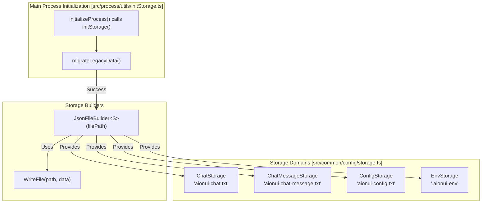
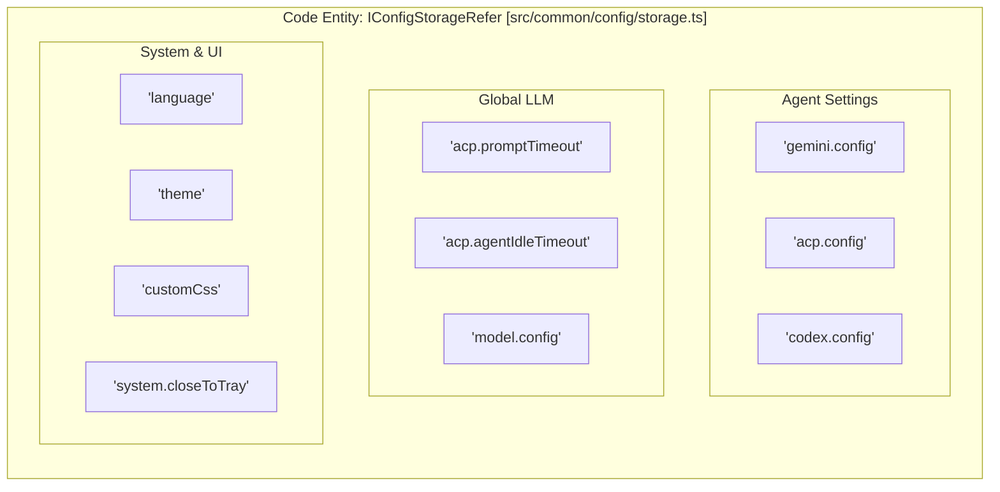

# Storage System

Relevant source files

The following files were used as context for generating this wiki page:

- [src/common/config/storage.ts](src/common/config/storage.ts)
- [src/common/platform/ElectronPlatformServices.ts](src/common/platform/ElectronPlatformServices.ts)
- [src/common/platform/IPlatformServices.ts](src/common/platform/IPlatformServices.ts)
- [src/common/platform/NodePlatformServices.ts](src/common/platform/NodePlatformServices.ts)
- [src/common/platform/index.ts](src/common/platform/index.ts)
- [src/process/bridge/applicationBridgeCore.ts](src/process/bridge/applicationBridgeCore.ts)
- [src/process/index.ts](src/process/index.ts)
- [src/process/utils/configureChromium.ts](src/process/utils/configureChromium.ts)
- [src/process/utils/index.ts](src/process/utils/index.ts)
- [src/process/utils/initBridgeStandalone.ts](src/process/utils/initBridgeStandalone.ts)
- [src/process/utils/initStorage.ts](src/process/utils/initStorage.ts)
- [src/process/utils/utils.ts](src/process/utils/utils.ts)
- [src/process/webserver/auth/middleware/TokenMiddleware.ts](src/process/webserver/auth/middleware/TokenMiddleware.ts)
- [src/process/webserver/middleware/csrfClient.ts](src/process/webserver/middleware/csrfClient.ts)
- [src/renderer/components/settings/SettingsModal/contents/SystemModalContent/index.tsx](src/renderer/components/settings/SettingsModal/contents/SystemModalContent/index.tsx)
- [src/renderer/hooks/context/AuthContext.tsx](src/renderer/hooks/context/AuthContext.tsx)
- [src/renderer/pages/conversation/Workspace/hooks/useWorkspaceEvents.ts](src/renderer/pages/conversation/Workspace/hooks/useWorkspaceEvents.ts)
- [src/renderer/pages/conversation/Workspace/hooks/useWorkspaceTree.ts](src/renderer/pages/conversation/Workspace/hooks/useWorkspaceTree.ts)
- [src/renderer/pages/settings/AgentSettings/RemoteAgentManagement.tsx](src/renderer/pages/settings/AgentSettings/RemoteAgentManagement.tsx)
- [src/renderer/services/i18n/i18n-keys.d.ts](src/renderer/services/i18n/i18n-keys.d.ts)
- [src/renderer/services/i18n/locales/en-US/settings.json](src/renderer/services/i18n/locales/en-US/settings.json)
- [src/renderer/services/i18n/locales/ja-JP/settings.json](src/renderer/services/i18n/locales/ja-JP/settings.json)
- [src/renderer/services/i18n/locales/ko-KR/settings.json](src/renderer/services/i18n/locales/ko-KR/settings.json)
- [src/renderer/services/i18n/locales/ru-RU/settings.json](src/renderer/services/i18n/locales/ru-RU/settings.json)
- [src/renderer/services/i18n/locales/tr-TR/settings.json](src/renderer/services/i18n/locales/tr-TR/settings.json)
- [src/renderer/services/i18n/locales/zh-CN/settings.json](src/renderer/services/i18n/locales/zh-CN/settings.json)
- [src/renderer/services/i18n/locales/zh-TW/settings.json](src/renderer/services/i18n/locales/zh-TW/settings.json)
- [tests/unit/RemoteAgentManagement.dom.test.tsx](tests/unit/RemoteAgentManagement.dom.test.tsx)
- [tests/unit/platform/platformRegistry.test.ts](tests/unit/platform/platformRegistry.test.ts)
- [tests/unit/process/bridge/applicationBridgeCore.test.ts](tests/unit/process/bridge/applicationBridgeCore.test.ts)
- [tests/unit/process/initStorage.jsonFileBuilder.test.ts](tests/unit/process/initStorage.jsonFileBuilder.test.ts)
- [tests/unit/process/utils/configureChromium.test.ts](tests/unit/process/utils/configureChromium.test.ts)
- [tests/unit/webserver/csrfClient.dom.test.ts](tests/unit/webserver/csrfClient.dom.test.ts)

## Purpose and Scope

The Storage System provides a type-safe, domain-isolated persistence layer for AionUi. It manages four primary storage domains: conversations (`ChatStorage`), configuration (`ConfigStorage`), environment variables (`EnvStorage`), and messages (`ChatMessageStorage`). This system handles the transition from legacy file-based storage to the modern [Database System](), ensuring data consistency across application restarts and platform migrations.

---

## Storage Factory Architecture

AionUi uses a factory pattern to create isolated storage instances with typed interfaces. In the main process, storage is initialized via `initStorage.ts`, which provides the concrete implementation for reading and writing data to the filesystem.

### Storage Domains Overview

**Sources:** [src/process/index.ts:25-30](), [src/process/utils/initStorage.ts:46-55](), [src/process/utils/initStorage.ts:130-160](), [src/common/config/storage.ts:14-23]()

### buildStorage Factory Pattern

The system uses `JsonFileBuilder` to create storage instances. Unlike standard `localStorage`, AionUi persists these to specific text files in the user's configuration directory. Data is encoded using a `base64(encodeURIComponent(JSON))` format for backward compatibility [src/process/utils/initStorage.ts:128-133]().

**Key Features of JsonFileBuilder:**
*   **In-Memory Cache**: Data is loaded once synchronously on first access and kept in memory for microsecond reads [src/process/utils/initStorage.ts:136-160]().
*   **Serialized Persistence**: Disk writes are serialized via a promise chain (`writeChain`) to prevent file corruption during concurrent updates [src/process/utils/initStorage.ts:162-178]().
*   **Atomic Updates**: The `update<K>` method allows for safe functional updates to specific keys [src/process/utils/initStorage.ts:215-221]().

| Storage Instance | File Path | Type Interface | Purpose |
|-----------------|-----------|----------------|---------|
| `ChatStorage` | `aionui-chat.txt` | `IChatConversationRefer` | Conversation metadata and legacy history. |
| `ConfigStorage` | `aionui-config.txt` | `IConfigStorageRefer` | System and agent configuration. |
| `EnvStorage` | `.aionui-env` | `IEnvStorageRefer` | System paths (workDir, cacheDir). |
| `ChatMessageStorage` | `aionui-chat-message.txt` | `Record<string, TMessage[]>` | Legacy message-level storage. |

**Sources:** [src/process/utils/initStorage.ts:46-55](), [src/common/config/storage.ts:14-23]()

---

## Configuration Storage (ConfigStorage)

`ConfigStorage` manages system-wide configuration through a hierarchical key structure defined in `IConfigStorageRefer`.

### Configuration Key Structure

**Sources:** [src/common/config/storage.ts:25-174]()

### Subsystem Configuration Details

*   **Gemini Settings**: Stores `authType`, `proxy`, and `accountProjects` for Google Cloud integration [src/common/config/storage.ts:26-39]().
*   **ACP (Agent Core Protocol)**: Manages a map of backend configurations, including `cliPath`, `yoloMode`, and `preferredModelId` [src/common/config/storage.ts:45-59]().
*   **System Timeouts**: Global settings like `acp.promptTimeout` (default 300s) and `acp.agentIdleTimeout` (default 5m) control the lifecycle of AI processes [src/common/config/storage.ts:60-63]().
*   **UI Customization**: Persists `customCss` and a list of `css.themes` for interface personalization [src/common/config/storage.ts:83-85]().

---

## Conversation Storage (ChatStorage)

`ChatStorage` manages conversation metadata. While the message history is now primary persisted in SQLite, the conversation "shell" and its specific agent settings are defined here.

### TChatConversation Type System

`TChatConversation` is a discriminated union where the `type` field determines the schema of the `extra` configuration.

| Type | Extra Field Interface | Key Features |
| :--- | :--- | :--- |
| `gemini` | `IGeminiExtra` | `workspace`, `webSearchEngine`, `enabledSkills`. |
| `acp` | `IAcpExtra` | `backend`, `cliPath`, `acpSessionId`. |
| `codex` | `ICodexExtra` | `repoPath`, `yoloMode`, `sandboxMode`. |
| `aionrs` | `IAionrsExtra` | `binaryPath`, `workDir`. |

**Sources:** [src/common/config/storage.ts:154-302]()

---

## Data Migration and Path Management

### Path Resolution
AionUi uses `getDataPath()` and `getConfigPath()` to resolve storage locations. On macOS, the system creates CLI-safe symlinks in the home directory (e.g., `~/.aionui`) to avoid issues with spaces in the default "Application Support" path [src/process/utils/utils.ts:44-114]().

### Migration Logic
1.  **Legacy Directory Migration**: `migrateLegacyData()` moves data from the old `temp` directory to the `userData/config` directory on startup [src/process/utils/initStorage.ts:66-111]().
2.  **Configuration Import**: `importConfigFromFile` handles importing external JSON/TXT configurations into the internal storage [src/process/utils/initStorage.ts:34-34]().
3.  **Database Sync**: Metadata from `ChatStorage` is synchronized with the SQLite database to support advanced querying and message batching [src/process/bridge/conversationBridge.ts:133-167]().

**Sources:** [src/process/utils/initStorage.ts:66-111](), [src/process/utils/utils.ts:98-114]()

---

## Summary of Key Entities

| Symbol | Location | Purpose |
| :--- | :--- | :--- |
| `JsonFileBuilder` | `src/process/utils/initStorage.ts` | Core factory for file-backed JSON persistence. |
| `ConfigStorage` | `src/common/config/storage.ts` | Global singleton for application and agent settings. |
| `IConfigStorageRefer` | `src/common/config/storage.ts` | TypeScript interface defining the schema for all configuration keys. |
| `getDataPath` | `src/process/utils/utils.ts` | Resolves the root directory for application data, handling platform-specific pathing. |
| `SystemModalContent`| `src/renderer/.../SystemModalContent/index.tsx` | UI component for managing `ConfigStorage` keys like `promptTimeout`. |

**Sources:** [src/process/utils/initStorage.ts:130-130](), [src/common/config/storage.ts:20-20](), [src/common/config/storage.ts:25-25](), [src/process/utils/utils.ts:98-98](), [src/renderer/components/settings/SettingsModal/contents/SystemModalContent/index.tsx:31-31]()